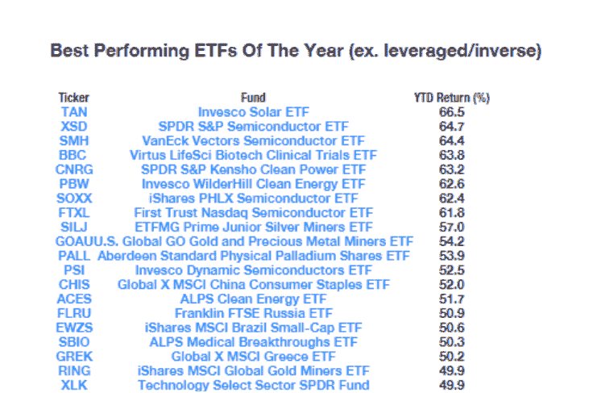
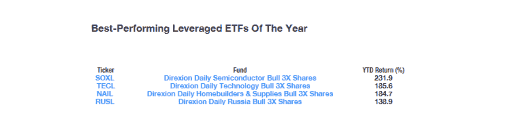

# 如何成功投资交易所交易基金？

> 原文：<https://blog.quantinsti.com/exchange-traded-funds/>

由[查尼卡·塔卡](https://www.linkedin.com/in/chainika-bahl-thakar-b32971155/)

交易所交易基金是投资者众所周知的投资工具/渠道之一，如果合理利用，可以实现收益最大化。接下来，我们将更多地讨论“ETF 的明智投资”。

简而言之，投资交易所交易基金提供了投资一批金融证券的机会。这个资金池是作为一个单一实体建立的，但持有不同投资者的不同类型的投资。此外，这些股票在主要的证券交易所交易，而不是在 T2 的场外交易。

就其运作而言，ETF 的每个投资者都会获得与其在全部证券中所占份额成比例的股份。此外，还有一些创新的 ETF 相关计划，让投资者做空市场。这有助于他们从[杠杆](https://quantra.quantinsti.com/glossary/Leverage)中获益，而无需承担短期资本利得税。

好吧！我们已经讨论了 ETF 的含义和工作原理，让我们继续看一看这篇文章的内容。本文涵盖:

*   [ETF 的起源和种类](#origin-and-types-of-etf)
*   为什么你应该选择 ETF？
*   [波动时期的 ETFs】](#etfs-in-times-of-volatility)
*   什么是 VIX，它有什么帮助？
*   构建全 ETF 投资组合时需要考虑什么？

## 起源&ETF 的种类

ETF 起源于 1993 年，它们最初的产品通常被称为“蜘蛛”或“间谍”(股票代码)。SPY 就是这样一种产品，被公认为历史上交易量最高的 ETF。

但是，ETF 的起步并不顺利。在“真正的”或“实际的”ETF 出现之前，有过几次尝试。根据“[交易所交易基金手册](https://books.google.com/books?id=CIYoyIrP6cIC&pg=PA31&source=gbs_toc_r&cad=3#v=onepage&q=toronto&f=false)”的作者所说，**第一次尝试交易所交易基金**是在 1989 年，主要针对标准普尔 500 指数的被称为指数参与股的产品。但是，芝加哥的一家联邦法院提到，该基金并不是独一无二的，其运作方式与 T4 期货合约非常相似。因此，有人提到，如果要进行交易，必须在期货交易所进行。这一观察推迟了“实际”ETF 的出现。

接下来是多伦多证券交易所在 1990 年的一次尝试，该产品以跟踪 TSE-35 指数的名称[多伦多 35 指数参与单位](https://www.finiki.org/wiki/Exchange-traded_fund#ETF_history) (TIPs 35)推出。

终于在三年后，1993 年 1 月 22 日，道富环球投资公司推出了 [S & P500 信托 ETF](https://en.wikipedia.org/wiki/SPDR_S%26P_500_Trust_ETF) 也就是我们上面提到的蜘蛛或间谍。这仍然是一个众所周知的 ETF，并继续保持其受欢迎程度。

好吧！让我们继续讨论交易所交易基金的类型，找出你可以投资的不同选择。我们将快速浏览投资者用来成功获利的最受欢迎和最常见的 ETF 类型。这 7 种交易所交易基金是:

*   市场交易所交易基金
*   部门和行业交易所交易基金
*   红利 ETF
*   基于风格的 ETF
*   商品交易所交易基金
*   货币交易所交易基金
*   债券交易所交易基金

交易所交易基金带来了投资实践的演变，并使投资者更容易获得多种投资机会。既然市场上有这么多 ETF，找到一个最适合自己的是一件相当艰巨的任务。在这里，我们将讨论最常见和最受欢迎的，以便您能够找到最适合您的投资组合非常容易。让我们来看看上面提到的每一只 ETF。

**市场 ETF**

这些是专为跟踪特定指数而设计的，是最常见和最著名的指数。例如， **SPDR S & P 500** 跟踪美国股票的 S & P 500 或“间谍”,是最著名的市场 ETF。这种类型跟踪涵盖整个或大部分股票市场的指数，也包括各种指数。有趣的是，最便宜的 ETF 是市场上最便宜的投资渠道之一。此外，它们还为您的资产配置提供一站式解决方案。

**部门或行业 ETF**

这些交易所交易基金提供了对特定行业或部门的投资，如制药、快速消费品等。这些交易所交易基金的运作包括将整个市场分成十个不同的部分。通过这种方式，你可以清楚地了解对你最有利的特定行业或领域。虽然市场交易所交易基金为你提供了整个市场的覆盖范围，但行业交易所交易基金让你受益于选择特定的行业。这意味着，当你选择一个特定的部门，它表现良好，你得到全部利润，而不必担心利润下降，因为其他一些部门或股票可能表现不佳。

**红利 ETF**

这些交易所交易基金包括那些支付股息的股票，以帮助投资者获得可观的收入。有各种各样的红利 ETF 是基于当前收益或收入最大化或基于过去红利增长的表现。这两种类型的股息 ETF 的回报率彼此相差很大。由于每种类型的应用背后都有不同的策略，因此选择最适合您的投资组合的策略非常重要。此外，您的投资风格在决定哪种红利 ETF 将服务于您的目的方面发挥着重要作用，因为您熟悉的投资类型可能是您更有信心的投资类型。

**基于风格的 ETF**

投资交易所交易基金有两种众所周知的方式，投资者根据[成长股](https://en.wikipedia.org/wiki/Growth_stock)或基于[价值投资](https://en.wikipedia.org/wiki/Value_investing)的股票做出决策。这是因为这两只股票的表现非常相似。投资哪一种股票取决于投资者的风格。基于他们不时的表现，投资者决定选择哪一个。这些交易所交易基金适用于国内外各种规模(大盘股、小盘股和中型公司)的各种股票。

**商品 ETF**

这些交易所交易基金在商品市场上提供了多种多样的选择。这个主要用于跟踪商品的价格，如黄金、玉米等。这些基金的回报可能与股市同步，也可能不同步。这符合那些寻求多元化投资组合(跨资产类别)的投资者的目的。最大 ETF 利用期货、[远期](https://quantra.quantinsti.com/glossary/Forwards)等衍生品来获取不同市场的敞口。然而，一些投资者购买实物商品时，每只股票都显示相同的数量。

**货币 ETF**

这些交易所交易基金通过帮助你从外币相对于美元的价值变动中获利而使你受益。ETF 与货币价值有两种对应方式。一，通过直接对应一定数量的特定货币的价值。其次，通过跟踪美元指数等基准货币的走势。

这些交易所交易基金有助于对冲投资或分散投资，例如度假或保护自己免受不利价格波动的影响。货币 ETF 的主要重要性在于，它们可以作为外币的现金投资。此外，正因为如此，它们可以在资产配置策略中用作现金等价物(对于外币敞口也是如此)。

**债券 ETF**

基本上，这些交易所交易基金为投资者提供了巨大的风险敞口。债券 ETF 有两类，投资者可以购买的债券都包括在其中。

*   **覆盖整个市场的广义市场债券 ETF**。
*   **债券类 ETF**专注于特定的债券，如国债、公司债等。

主要是，债券 ETF 背后的想法是为投资者提供市场上所有类型的债券。在这种类型中，你应该意识到基金的重点可能是到期，也可能是将到期的债券展期并重点购买新的债券。这取决于你的投资组合的要求，因为每种类型的利率风险不同。

太好了！有了 ETF 的起源和类型的良好知识，我们可以进一步讨论你应该选择其中一个 ETF 的原因。这将带我们了解投资 ETF 的优势，以及过去使用 Python 投资 ETF 的前 5 名表现。

## 为什么你应该选择 ETF？

如果你知道在哪里利用 ETF，你也能同样成功。有几个原因使投资这些基金非常有益，其中之一是投资这些基金不需要很多钱 。这是因为，在股票池中，每股很少超过 100 美元。通常是 100 美元或更少。即使是这么多的投资，由于总额相当于一大笔资金，你的每一份股票都可以让你对几十家甚至几百家不同的公司产生兴趣。相反，如果涉及的资金很少，而你决定投资一两只股票，那么如果这些公司表现不佳，你就有可能损失全部资金。然而，如果这些公司继续表现良好，你会看到你的利润大幅上升。这种因投资少数股票而导致的上涨或下跌在多元化投资组合中不太可能发生。值得注意的是，交易所交易基金有潜力提供稳定的利润，让投资者感到放心。

***其次，有 ETF 的存取方便。*** 这只是暗示有 ETF 考虑了金融市场上的大部分投资资产。由于其覆盖面广，ETF 允许你投资股票、债券、大宗商品、外汇，以及被称为混合型 ETF 的资产组合。正如我们所看到的，这种多样化有助于轻松获得各种资产类别。一般来说，这些交易所交易基金在一只基金中为你提供整个市场。此外，由于投资持有量每天公布，因此透明度很高，即使在建立全 ETF 投资组合时，投资者也可以放心。

第三，ETF 提供特定资产类别的子行业。 这种分类让你可以投资一些公司，而不是属于不同行业的不同公司。当这些交易所交易基金挖掘为你提供特定的资产时，你可能会从投资你预期表现良好的公司的股票中受益。如果你意识到某个特定行业或某些公司相对于竞争对手(其他行业或某些公司)的优势趋势(特定场景)，这种情况就会发生。例如，在冠状病毒爆发中表现良好的药品。

***第四，ETF 性价比高。*** 这意味着 ETF 不收取很高的管理费。这尤其是因为基金经理的责任有限。跟踪 ETF 的基金经理需要跟踪 ETF 选择作为其基准的特定指数([股票指数](https://en.wikipedia.org/wiki/Stock_index)或[债券指数](https://en.wikipedia.org/wiki/Bond_index))的表现。这有助于节省投资专业人士的开支，他们帮助你决定超越市场的特定投资选项。将交易所交易基金的费用与共同基金和指数基金等类似的选择进行比较，你会发现交易所交易基金是最具成本效益或成本最低的选择。此外，你从 ETF 获得的税收优惠也很好，因为 ETF 的纳税义务不会因为市场波动而受到影响。

投资于一个适合你的投资组合和投资风格的交易所交易基金，同时选择最好的，你肯定能从中获益。ETF 可以通过各种方式帮助投资者获利，现在看来我们已经掌握了许多必要的信息。

*关键要点:*

ETF 类似于共同基金，因为它们都来自于相同的集合基金投资概念。集合基金将所有证券集合在一起，为投资者提供多样化投资组合的好处。

ETF 和共同基金的区别在于:

*   费用相关-ETF 比共同基金更划算
*   税收-与 ETF 相比，共同基金征收更多的税收
*   管理-ETF 管理起来更简单，因为与共同基金相比，它们更加结构化

让我们更多地了解 ETF 及其表现。

去年，交易所交易基金获得了一些丰厚的回报。您可以查看下表，了解 2019 年表现最佳的 ETF(不包括杠杆/反向)及其[报价器](https://en.wikipedia.org/wiki/Ticker_symbol)和 [YTD 回报率(%)](https://en.wikipedia.org/wiki/Year-to-date) 。

根据雅虎财经的数据，去年排名前 20 的 ETF 的涨幅都在 50%以上。这还不包括那里的杠杆产品，如[迪瑞克森每日半导体牛 3X 股(SOXL)](http://www.etf.com/soxl) 、[迪瑞克森每日科技牛 3X 股(TECL)](http://www.etf.com/tecl) 或[迪瑞克森每日住宅建筑商&供应牛 3X 股(NAIL)](http://www.etf.com/nail) ，每股上涨超过 185%。

来源:雅虎财经

此外，2019 年有 4 只表现最佳的杠杆 ETF，它们是:

来源:雅虎财经

让我们看看如何用 Python 取出数据来分析市场中的股票情况。

要了解 2019 年的表现，我们可以选择任何股票，并获取第一个月和上个月的数据。这样我们就可以比较股票在年初和年末的表现。让我们看看“SOXL”股票行情系统，看看该股票在第一个月(1 月)和最后一个月(12 月)的表现。