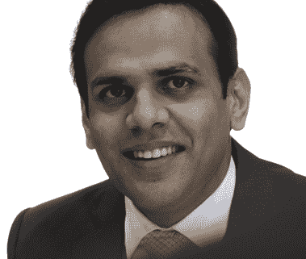

# 基金管理和算法交易|穆罕默德如何让两者成为可能

> 原文：<https://blog.quantinsti.com/fund-management-algorithmic-trading-acca-cfa-fdp-epat-success-story-muhammad-shamoon-tariq/>

位列全球前三的全球基金经理，拥有多项 IBM 关于数据科学、人工智能、ML 和 ACCA、CFA 和 FDP 的认证，今天我们为您带来 EPAT 校友 Muhammad Tariq 的旅程。

正是他学习进步的速度让他的教育转向了对资本市场的热情和对投资的热爱。他是瑞典商业委员会驻巴基斯坦的副总裁，同时也是瑞典 Tundra Fonder AB 公司的首席信息官/合伙人。

他的每一项成就都掩盖了他以前的非凡成就。带着永不满足的学习和成长的欲望，从生活和市场中获得更多，甚至更有生产力——这就是穆罕默德的旅程。

* * *

## 嗨，穆罕默德，给我们介绍一下你自己吧！

嗨！我是[默罕默德·沙蒙·塔里克](https://www.linkedin.com/in/muhammad-shamoon-tariq-cfa-fdp-24b40a80/)，我是巴基斯坦人，曾在瑞典&生活和工作。在过去的 12 年里，我一直与资本市场联系在一起，我的职业生涯始于分析师，这让我对金融建模有了相当的了解。

当我搬到瑞典时，我开始从事金融建模工作，当时我是一名驻瑞典的资产经理，负责在新兴市场进行全球投资。

我纯粹是一个资本市场的人，遵循传统，比如 Excel 建模。**在 Citywire 和晨星的新兴市场领域，我们被评为全球前三大全球基金管理公司**。

我去了很多地方旅行，见识了很多文化，这是我热爱我的工作的最大好处之一。为了工作，我去过大约 20 个国家，尤其是欧洲、美国、南亚和东南亚，这些都是世界上增长最快的市场。

疫情使旅行变得不太可能，这种情况需要几年时间才能改变。谢天谢地，有了现在的技术，网上会议和聚会已经开始了。

对我来说，就工作而言，这是一个优势，因为这样你就有更多的时间来沟通、主持会议、管理时间表，还可以培养一些技能。

我现在正在研究巴基斯坦的第一台机器人顾问，为这个拥有 2 . 2 亿人口的国家提供储蓄产品。

我的爱好当然包括旅游，但我也喜欢钓鱼、跳伞和潜水。我也是有执照的跳伞运动员！

* * *

## 你能描述一下你的旅程以及 Algo Trading 是如何进入这个画面的吗？

我实际上是一名工科学生，擅长数学和物理。所以，我在暑假，我的朋友有一个经纪公司，我们花了大约一个月的时间。这让我意识到这是我想做的。

然后我改变了我的教育，转向金融，并在 2008 年完成了我的 ACCA 和 CFA。当时我在伊斯兰堡，但没有太多的金融机会，所以我搬到了卡拉奇，开始做金融分析师，并在那里工作了两年。在那里，我自己从零开始创建了这个行业的金融模型，并且热爱金融建模。

几年来，我创建了各种金融模型，并进行了大量的编码工作，这感觉就像是这个领域的重复例行工作，我想尝试一些新的东西。当我开始与国际客户交谈时，机会出现了。我为客户提供建议，为高净值人士提供指导，但此外，在这里工作对我来说很有成就感。

我的一个客户是一家瑞典公司，它雇佣我做研究。几个月后，我成了基金经理，六个月后我成了合伙人，一年后我成了公司的正式股东。

我喜欢自动化。这不仅仅是因为计算机科学，更像是当你在做一个金融模型的时候——你在创造它并使它自动化。你改变了变量，你改变了逻辑，模型本身给了你结果。

我热爱资本市场。我喜欢投资。我喜欢尝试新事物，经常全神贯注于深入研究金融模型。目前，我参加了伦敦经济学院的数据科学和商业分析项目。

所以，我已经习惯了，习惯了 Excel 或其他我们过去一直在使用的常规工具，但不是用 Python 或任何计算机语言。随着时间的推移，我看到了技术的进步，并在 2015 年帮助我哥哥的技术创业公司建立后端基础设施时体验到了这一点。

我开始思考——为什么不把模型自动化呢？我手头有数据，我想为什么不为这些公司创建研究模型来预测它们的收益呢？这就是它开始的地方。

我从能给我的工作带来效率的东西开始。带着这个想法，我开始寻找某些特定的课程，我注册并完成了一些热门课程提供商提供的许多与数据科学和机器学习相关的在线课程。然而，我对方向并不满意。

课程没有结构化，无论是 Python 课程还是数据科学课程，等等。他们中没有一个人知道具体的步骤，接下来是什么，等等。例如，如果我学习了 ML 和 AI，然后继续学习 Python，这将是一场灾难。

所以，我在这里，寻找一个更结构化的方法，因为这是我想做的。尽管我正在自动化，尽管我已经给我的工作带来了效率，但我需要那种指导。

* * *

## 编程知识的匮乏是否阻止了你学习 Algo 交易？

我擅长逻辑，但我不擅长技术，因为我从未接触过技术。

所以，我想知道，在交易中使用技术能做些什么？
*需要什么样的架构？*
*需要什么编程语言？*
*哪种语言对编程有好有坏？*

这就是我如何经过大量的搜索，发现了 EPAT。

在新冠肺炎疫情期间，有一些在线课程已经开始，数据科学吸引了我，它是非常基础的。我必须理解这些非常基本的东西，因为这需要数据科学和机器学习。

但是，那不是我想要的！他们在教一些过时的编程语言。虽然我支付了费用，但我并不开心，所以我停止了那些课程。

那是我遇到 EPAT 的时候，我和 QuantInsti 团队通过多次电话进行了讨论，由于我以前的经历，我有点担心课程的成本。但我天生喜欢冒险，想试一试。

最糟糕的结果可能是时间和金钱的损失，但这根本没有发生。但是当我和 EPAT 开始交往时，我所有的疑虑都烟消云散了。

要创建一个算法，一种方法是导入已经实现的库，另一种方法是尝试一下。对于像我这样对逻辑和算法有所了解的人来说；如果我想创建自己的算法，我不知道如何着手。我不得不付出很大的努力才达到基础。

然而，对于拥有不同技能和不同知识和经验的人来说，学习经历可能是不同的。

我最喜欢 EPAT 的一点是:

*   该结构
*   从基础到高级领域的牵手
*   专门支持

在过去的 6 个月里，我有了很好的学习经历，并获得了 EPAT 优秀证书，EPAT 给了我一个坚实的基础。

* * *

## 作为高层管理者，你是个大忙人——你是如何为 EPAT 安排时间的？

我是一个有工作的人，但我的热情让我抽出时间去 EPAT 和学习。尽管身处不同的时区，而且被疫情环绕，我还是习惯早起工作，之后还可以参加现场讲座。

参加现场讲座时，您有一些问题可以立即得到解答。如果你正在听录音讲座，支持系统真的很好——说实话，确实如此。

每当你在学习过程中遇到问题，或者遇到概念问题时，你可以找人询问，支持团队会很快为你安排电话，他们会尽力解决你的疑问。我真的很欣赏并认为课程和支持是 EPAT 最好的特点。

例如，当你在一个新的国家，有一个向导在那里，你会立刻感觉舒服很多，这就是我对 EPAT 支持团队的感觉。舒服。

我过去是，现在仍然是编程新手，要真正精通它并能够编写代码还需要一些时间。当我开始做这个的时候，我真的需要帮助，为此，支持系统总是在那里帮助和指导我。

* * *

## 你对有抱负的算法交易者有什么建议？

QuantInsti 通过 EPAT 提供的不仅仅是算法交易。不仅仅是这样！

这是一个投资领域，交易是其中的一部分。有完整的选股、研究和分析、建议，然后转化为交易——这使整个过程成为一次旅行。

EPAT 已经在做的是覆盖整个旅程，而不仅仅是创建算法交易的基石。人们可以利用这些知识来提高工作效率，或者预测价格变动，提出经济模型等等。

EPAT 不仅提供算法交易的知识，还提供算法投资，因为它涵盖了整个投资过程。EPAT 不仅仅局限于贸易领域。它吸引了研究分析师、基金经理、技术交易员和销售人员。

现在看起来可能不太必要，但 5 年后，算法交易将成为一种必然。任何拥有这种知识的人都将在竞争中获得优势，无论是在 it 公司还是在工作中，并且能够获得和利用这种知识。

> 即使 Algo 不是你的激情所在，也要去投资，但这样做只是为了你能在那里生存下去。这是一场生存游戏。大家都在砍掉人力资源，用技术和自动化，不如今天就做好未来的准备。如果你没有学习算法投资或在交易中采用技术，现在是时候了。

* * *

穆罕默德，感谢你在百忙之中抽出时间与我们交谈。和你交谈很愉快。你的旅程非常鼓舞人心，我们希望它继续变得更好。给你最好的祝愿。

如果你也渴望用终身技能武装自己，这些技能将永远帮助你提升你的交易策略，这个 [algo 交易课程](https://www.quantinsti.com/epat)正是你所需要的。拥有统计学&计量经济学、金融计算&技术、机器学习等课题，确保你精通在交易领域出类拔萃所需的每一项技能。现在就来看看 EPAT 吧！

* * *

免责声明:为了帮助那些正在考虑从事算法和量化交易的人，这个成功的故事是根据 QuantInsti EPAT 项目的学生或校友的个人经历整理的。成功案例仅用于说明目的，不用于投资目的。EPAT 方案完成后取得的成果对所有人来说可能不尽相同。T3】