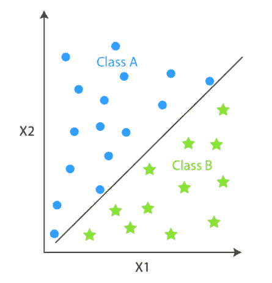
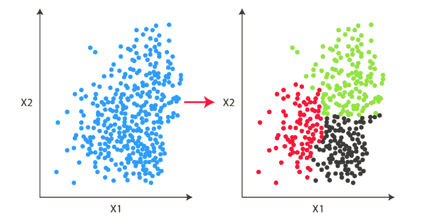
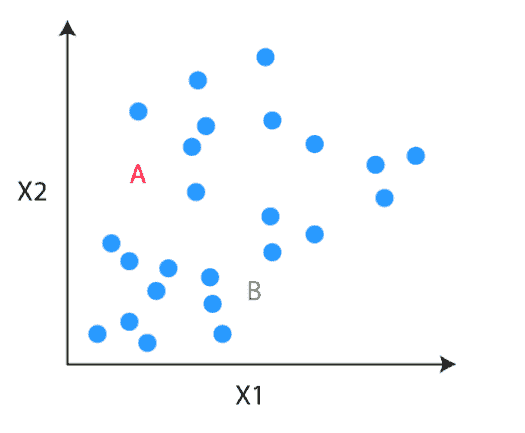
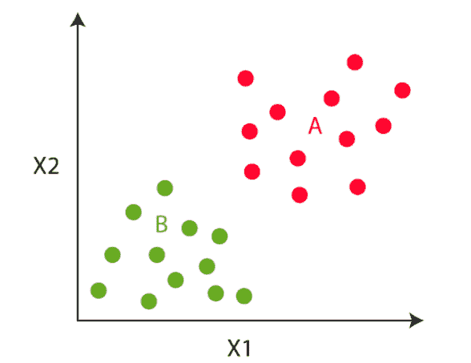
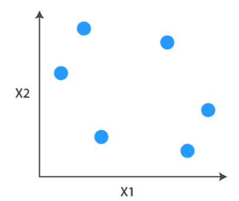
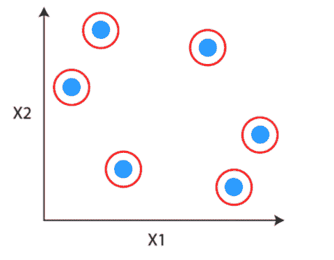
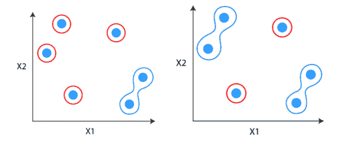
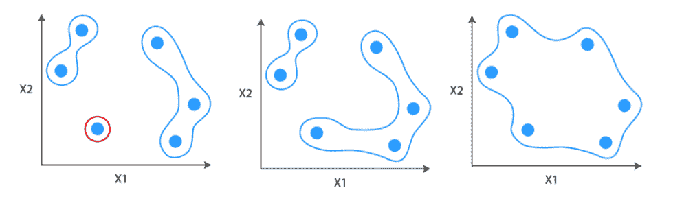
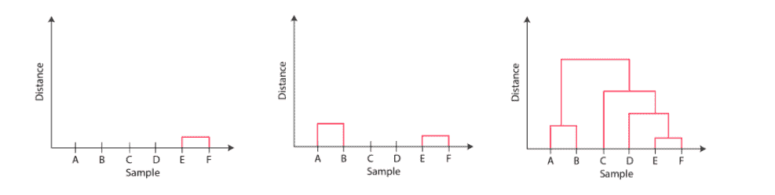
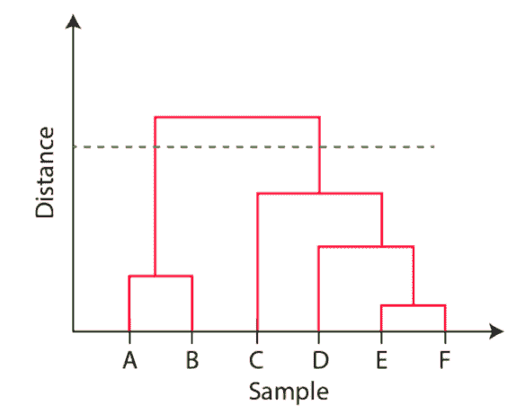

# Python 中的层次聚类

> 原文：<https://blog.quantinsti.com/hierarchical-clustering-python/>

由[维布·辛格](https://www.linkedin.com/in/vibhu-singh-1b76b6105/)

随着原始数据的丰富和分析的需要，无监督学习的概念逐渐流行起来。无监督学习的主要目标是发现未标记数据中隐藏的和令人兴奋的模式。最常见的无监督学习算法是聚类。聚类分析的应用范围从医学到人脸识别到股票市场分析。在这篇博客中，我们讨论层次聚类。

这篇文章的结构如下。

*   [什么是层次聚类？](#what-is-hierarchical-clustering)
*   [聚类之间的差异&分类](#difference-between-clustering-and-classification)
*   [K-Means 之间的差异&层次聚类](#difference-between-k-means-&-hierarchical-clustering)
*   [层次聚类的类型](#types-of-hierarchical-clustering)
*   [凝聚层次聚类](#agglomerative-hierarchical-clustering)
*   [如何识别两个聚类是否相似？](#how-to-identify-if-two-clusters-are-similar)
*   什么是树状图？
*   [分裂式层次聚类](#divisive-hierarchical-clustering)
*   [Python 中的层次聚类](#agglomerative-hierarchical-clustering-in-python)
*   [层次聚类的利与弊](#pros-and-cons-of-hierarchical-clustering)

* * *

## 什么是层次聚类？

分层聚类是一种无监督学习，它将相似的数据点或对象分组到称为聚类的组中。你脑海中出现的问题是什么是聚类和[无监督学习](https://quantra.quantinsti.com/course/unsupervised-learning-trading)。让我们试着找到这个。

* * *

## 聚类和分类的区别

分类和聚类都试图基于各种特征的相似性将数据点分组到一个或多个类别中。区别在于两者的工作方式。分类是一种监督算法，其中有预定义的标签(yi)分配给每个输入数据点(Xi)。

<figure class="kg-card kg-image-card"></figure>

然而，聚类是一种无监督算法，其中标签缺失意味着数据集仅包含输入数据点(Xi)。

<figure class="kg-card kg-image-card kg-width-full"></figure>

另一个主要区别是，由于分类技术具有标签，因此需要训练和测试数据集来验证模型。在聚类中，没有标签，因此不需要训练和测试数据集。

**分类算法的流行例子有:**

1.  逻辑回归
2.  支持向量分类器
3.  朴素贝叶斯
4.  [决策树](https://quantra.quantinsti.com/course/decision-trees-analysis-trading-ernest-chan)
5.  随机森林
6.  [神经网络](https://quantra.quantinsti.com/course/neural-networks-deep-learning-trading-ernest-chan)

**聚类算法的例子有:**

1.  分层聚类
2.  k 均值聚类
3.  均值漂移聚类
4.  谱聚类

在本文中，我们将深入研究分层集群的细节。

* * *

## K-Means 和层次聚类的区别

我们为什么需要层次聚类的答案就在 K-means 聚类的过程中。

我们将用通俗的语言来理解 K-means 聚类。

为我们的问题考虑这个未标记的数据。我们的任务是使用 K-means 聚类将未标记的数据分组到聚类中。

<figure class="kg-card kg-image-card"></figure>

### 第一步

第一步是决定聚类的数量(k)。假设我们已经决定将数据分成两个集群。

### 第二步

一旦聚类被决定，我们随机初始化两个点，称为聚类质心。

<figure class="kg-card kg-image-card"></figure>

### 第三步

在第三步中，该算法转到每个数据点，并根据它是更接近红色聚类质心还是绿色聚类质心，将这些点分成各自的类。

<figure class="kg-card kg-image-card"></figure>

### 第四步

在第四步中，我们移动质心步长。我们计算所有红色点的平均值，并将红色聚类的质心移动到那里，并对绿色聚类进行同样的操作。

<figure class="kg-card kg-image-card"></figure>

我们将执行第 3 步和第 4 步，直到群集质心不再移动。也就是说，在本例中，该点的颜色将不会进一步改变。

*K-means 过程看起来不错吧？*

是的，但是有一个问题，或者我们可以说是这个过程的局限性。在算法的开始，我们需要决定聚类的数量。但是我们不知道开始时需要多少个集群。

分层聚类弥合了这一差距。在层次聚类中，我们不需要一开始就定义聚类的个数。让我们看看它是如何工作的。

* * *

## 层次聚类的类型

有两种类型的分层聚类:

*   凝聚层次聚类
*   分裂层次聚类

### 凝聚层次聚类

凝聚层次聚类是最常见的层次聚类类型，用于根据相似性将对象分组。这是一种自下而上的方法，每个观察从自己的聚类开始，随着一个观察在层次结构中向上移动，聚类对被合并。

凝聚式层次聚类是如何工作的？

假设您有一些数据点，您希望将它们分组到相似的集群中。

<figure class="kg-card kg-image-card"></figure>

**第一步:**第一步是把每个数据点看成一个聚类。

<figure class="kg-card kg-image-card"></figure>

**第二步:**识别相似的两个聚类，使其成为一个聚类。

<figure class="kg-card kg-image-card kg-width-full"></figure>

步骤 3: 重复该过程，直到只剩下单个簇

<figure class="kg-card kg-image-card kg-width-full"></figure>

## 如何识别两个集群是否相似？

其中一个方法是找出集群之间的距离。

### 距离的度量(相似性)

两个聚类之间的距离可以基于从一个聚类到另一个聚类所画的直线的长度来计算。这就是通常所说的欧几里德距离。

欧几里得距离:平面或三维空间中两点之间的欧几里得距离测量连接两点的线段的长度。这是表示两点间距离的最明显的方式。

如果(x1，y1)和(x2，y2)是二维空间中的点，那么它们之间的欧几里得距离是

(x2-x1)2 - (y2-y1)2

除了欧几里德距离，还开发了其他几种度量来测量距离，例如:

*   汉娩距
*   曼哈顿距离(出租车或城市街区)
*   闵可夫斯基距离

距离度量的选择应该基于研究领域或你试图解决的问题。

例如，如果您试图在一个统一的网格上测量对象之间的距离，如棋盘或城市街区。那么曼哈顿距离将是一个合适的选择。

### 连锁标准

选择距离度量后，需要确定距离的计算起点。一些常见的链接方法有:

**单连锁:**单连锁或最近连锁是两个聚类中一对观测值之间的最短距离。

**完全连锁:**完全连锁或最远连锁是两个聚类中一对观测值之间的最远距离。

**平均链接:**平均链接是一个聚类中的每个观察值到另一个聚类中的每个观察值之间的距离。

**质心连接:**质心连接是两个簇的质心之间的距离。在这种情况下，您需要找到两个集群的质心，然后在合并之前计算它们之间的距离。

**Ward's-linkage:** Ward's 法或最小方差法或 Ward's 最小方差聚类法将两个聚类合并为单个聚类后，两个聚类之间的距离计算为误差平方和的增加量。这种方法试图选择连续的聚类步骤，以最小化每一步的平方和误差的增加。

链接标准的选择基于领域应用。平均连接和完全连接是层次聚类中两种最流行的距离度量。然而，当没有明确的理论依据来选择关联标准时，Ward 的方法是默认选项。

### 集群数量如何选择？

在层次聚类中，为了选择类的数目，我们使用了称为树状图的概念。

* * *

## 什么是树状图？

树状图是一个树形图，显示了观察值之间的层次关系。它包含了层次聚类算法的内存。

只要看一下树状图，你就能知道星团是如何形成的。让我们看看如何为下面的数据点形成树状图。

<figure class="kg-card kg-image-card"></figure>

观测值 E 和 F 通过任何其他点彼此最接近。因此，它们被组合成一个集群，并且将它们连接在一起的链路的高度也是最小的。下一个彼此最接近的观察值是 A 和 B，它们被组合在一起。

这也可以在树状图中观察到，因为 A 和 B 之间的块的高度略大于 E 和 F。类似地，D 可以合并到 E 和 F 簇中，然后 C 可以合并到 E 和 F 簇中。最后，A 和 B 与 C、D、E 和 F 结合在一起，形成一个单独的簇。

<figure class="kg-card kg-image-card kg-width-full"></figure>

阅读树状图时需要注意的重要一点是:

1.  块的高度代表簇之间的距离，并且
2.  观察之间的距离代表不同。

但是问题仍然是一样的，我们如何使用树状图找到聚类的数量，或者我们应该在哪里停止合并聚类。通过在树状图中画一条水平线，观察值被分配到聚类中。

<figure class="kg-card kg-image-card"></figure>

一般来说，我们切割树状图的方式是切割最高的垂直线。在上面的例子中，我们有两个集群。一个分类有观察值 A 和 B，另一个分类有 C、D、E 和 f。

* * *

### 分裂层次聚类

分裂式层次聚类在解决现实世界的问题时并不常用。它的工作方式与聚集聚类相反。在这种情况下，我们从所有数据点作为一个单独的集群开始。

在每次迭代中，我们分离不相似的最远的点或聚类，直到每个数据点被认为是一个单独的聚类。这里我们将单个聚类分成 n 个聚类，因此称为分裂聚类。

* * *

## Python 中的层次聚类

为了演示层次聚类在 Python 中的应用，我们将使用 Iris 数据集。虹膜数据集是最常见的数据集之一，用于机器学习中的插图目的。

虹膜数据具有三种类型的虹膜花，它们是因变量中的三个类别。它包含四个自变量，即萼片长度、萼片宽度、花瓣长度和花瓣宽度，单位均为厘米。我们将原始类与使用层次聚类方法形成的类进行比较。

### 输入数据

我们将从 sklearn 库中导入数据集。