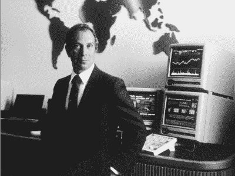
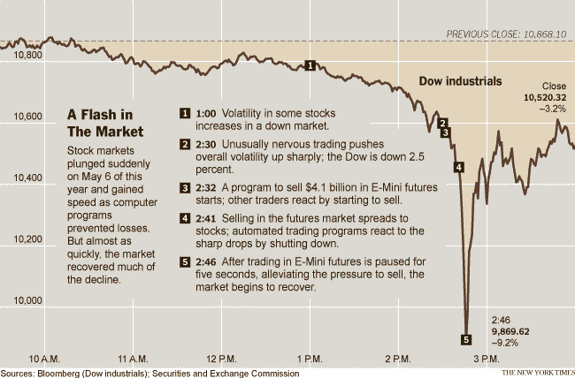
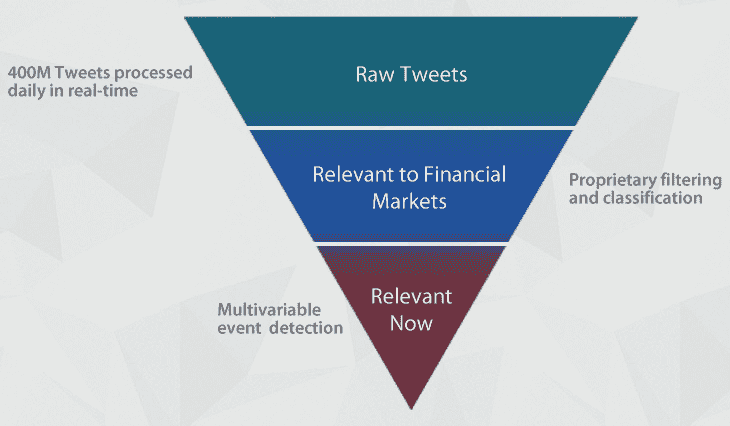
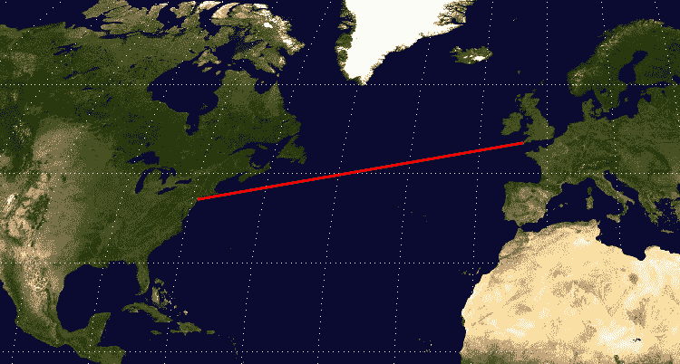
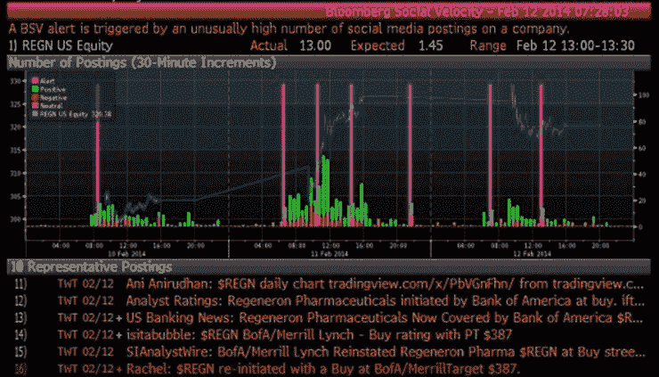
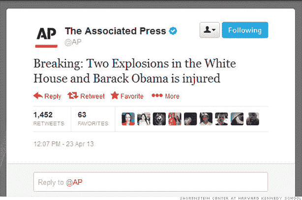
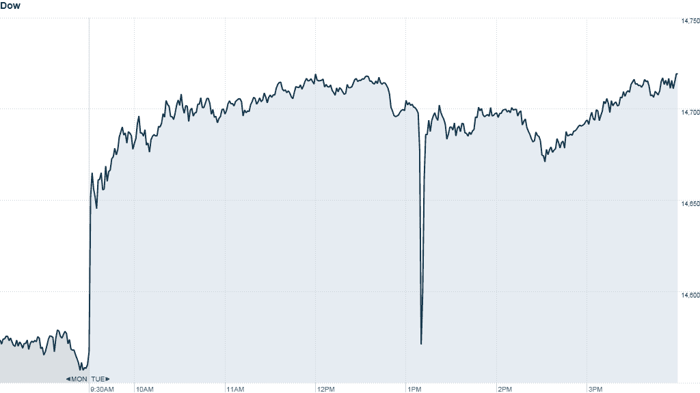

# 算法交易、HFT 和新闻交易的历史

> 原文：<https://blog.quantinsti.com/history-algorithmic-trading-hft/>

 1602 年——阿姆斯特丹证券交易所

阿努普里亚·古普塔

据估计，2013 年 70%的美国股票是通过自动交易实现的。[根据分析师的说法，算法交易](https://quantra.quantinsti.com/course/getting-started-with-algorithmic-trading)占印度现金股票总量的三分之一，**几乎占衍生品部分**总量的一半。尽管 HFT 是金融新闻中最具争议的话题之一，但它仍被广泛使用，并不断扩大其在新兴市场的影响力。让我们回顾一下这种技术驱动的交易技术的历史和所涉及的风险。

### 证券交易所的设立

从贸易历史的开端开始，我们可以追溯到四个世纪前的 1602 年。

VOC(荷兰东印度公司或 Vereenigde Oost-in dische Compagnie)股票的二级市场始于 17 世纪的第一个十年。1602 年，荷兰东印度公司启动了阿姆斯特丹从一个区域性集镇向主导性金融中心的转变。随着易于转让的股票的引入，几天内买家就开始交易它们。很快，公众开始参与各种复杂的交易，包括远期、期货、期权和空头突袭，到 1680 年，阿姆斯特丹市场上使用的技术和我们今天使用的一样复杂。

### 高频交易的早期开端

高频交易是为了提高信息传播的速度。一个 HFT 交易者利用尖端的技术创新比任何人都更快地获得信息，然后比任何人都更快地执行他的交易指令。有趣的是，快速信息传递的现象可以追溯到 17 世纪的 T2。一个有趣的轶事是关于内森·梅尔·罗斯柴尔德在伦敦政府之前知道惠灵顿公爵在滑铁卢战胜了拿破仑。

汤森路透的创始人朱利叶斯·路透在 19 世纪(T2)使用了包括电报电缆和一队信鸽在内的综合技术来运行新闻传送系统。你可以在[这篇文章](/origin-of-modern-high-frequency-trading-4/)中阅读所有关于路透社通讯页面的内容，这篇文章描述了历史上第一次高频交易创新。

### 二十世纪股票市场的发展

“美国股市最大的结构性变化可能是 1900 年至 1929 年左右铁路的消亡，以及 1982 年至 2007 年左右金融业的崛起，”拉塞尔·纳皮尔说。

股票市场的历史就是经济变化的历史。

金融市场中订单流的计算机化始于 20 世纪 70 年代初，一些里程碑式的事件是纽约证券交易所“指定订单周转”系统(DOT，以及后来的 SuperDOT)的引入，该系统以电子方式将订单发送到适当的交易站，由交易站人工执行。“开盘自动报告系统”(OARS)帮助专家确定市场清算开盘价(SOR 智能订单路由)。

**创新市场体系**由[迈克尔彭博](http://en.wikipedia.org/wiki/Michael_Bloomberg)于**于 1983 年**推出。1981 年，所罗门兄弟公司的普通合伙人迈克尔·彭博获得了 1000 万美元作为合伙协议。为所罗门设计了内部电脑化财务系统后，彭博建立了自己的创新市场系统(IMS)。美林向 IMS 投资了 3000 万美元，帮助开发彭博终端计算机系统，到 1984 年，IMS 向所有美林客户出售机器。

社会和技术剧变是人类历史上反复出现的主题，推而广之，也是股票市场的主题。

### 算法交易的开始

20 世纪 80 年代末和 90 年代发展了完全电子化执行和类似电子通信网络的金融市场。在美国，十进制将最小报价单位从 1/16 美元(0.0625 美元)改为每股 0.01 美元，这可能鼓励了算法交易，因为它通过允许买卖价格之间的较小差异改变了[市场微观结构](/market-microstructure/)，降低了做市商的交易优势，从而增加了市场流动性。

直到 **1998** 美国证券交易委员会(SEC)授权电子交易所为计算机化的高频交易铺平了道路。HFT 执行交易的速度比人快 1000 倍。从那时起，高频交易(HFT)变得非常普遍。

### 高频交易的繁荣

到 2001 年，HFT 交易的执行时间只有几秒钟。到 2010 年，这一时间缩短到毫秒，甚至微秒，随后在 2012 年缩短到纳秒。21 世纪初，高频交易占股票订单不到 10%，但这一比例增长迅速。根据纽约证券交易所的数据，在 2005 年**和 2009 年**之间，**的高频交易量增长了 164%。**

### 瞬间崩溃

截至 2010 年，美国 56%的股票交易是由 HFT 完成的。2010 年 5 月 6 日，一笔价值 41 亿美元的电脑销售引发了**5 月闪电崩盘**，道琼斯指数**在一个交易日内暴跌** 1000 点。近 1 万亿美元的市值被抹去，在 5 分钟的时间内下跌了 600 点，随后才恢复。美国证券交易委员会和 CFTC 将此次崩盘主要归咎于 HFT 公司。

### 交易技术的创新

**2011** ，标志着**纳米交易技术**的推出之年。一家名为 **Fixnetix** 的公司开发了一种可以在纳秒(相当于十亿分之一秒)内执行交易的微芯片:

**1 纳秒= 0.000000001 秒**

### [基于新闻的黎明交易](http://www.slideshare.net/QuantInsti/quantifying-news-for-automated-trading-methodology-and-profitability)

【2012 年 9 月 Dataminr 投资 3000 万美元推出全新服务，将社交媒体流转化为可操作的交易信号。这有助于报道最新的商业新闻，比传统的新闻报道快 54 分钟。该平台能够识别许多独特的**【微趋势】**，为客户提供独特的见解，帮助他们预测世界可能很快会关注什么。其中一些信号包括现场聊天、消费者产品反应、利基在线社区的讨论转移以及公众注意力的增长和衰退模式。

检测 Twitter 上每天分享的超过 3 . 4 亿条消息的语言和传播模式是实时分析引擎的一些功能，该引擎处理公共推文的聚合。

在 2012 年期间，HFT 席卷了股票市场，并负责 70%的美国股票交易。IT 公司在 HFT 技术上投资数百万。一种专门为 HFT 制造的新计算机芯片在 **0.000000074** 秒内准备好交易；一条拟议中的**3 亿美元**的跨大西洋电缆正在建设中，目的只是为了将纽约市和伦敦之间的交易时间缩短 0.006 秒。

美国联邦调查局对社交媒体的监控以及社交媒体对证券日益增长的即时影响，2013 年 4 月 2 日**日日日**日**证交会**日**日和【CFTC】日**日对通过社交媒体发布上市公司公告实施限制。

### Twitter 数据被用于交易

在美国证券交易委员会和 CFTC 于 2015 年 4 月 4 日实施限制后仅仅两天，彭博终端公司就将实时推文整合到其经济数据服务中。彭博社交速度追踪关于特定公司的异常聊天记录。

影响股票市场的异常新闻事件的一个值得注意的例子是从 2013 年 4 月 23 日日下午 1:05 分——这一天美联社账户发送了一条错误的推文，称白宫遭到两次爆炸袭击；这在华尔街引起了广泛的恐慌。**道琼斯指数在 3 分钟内暴跌 143 点(1%)，从 14699 点跌至 14555 点。**

 

### 首次同地办公

将 HFT 公司和自营交易者拥有的计算机放置在交易所的计算机服务器所在的同一场所。这使得 HFT 公司能够比其他投资者提前一秒了解股票价格。对交易所来说，协同定位已经成为一项有利可图的业务，交易所向 HFT 公司收取数百万美元的“低延迟访问”特权费

为了追求速度，总部位于丹佛的数据中心公司 CoreSite 运营着一个设施，交易者可以在华盛顿市中心安装所谓的“协同定位”计算机。

### 快，快，最快

整个想法是获得联邦数据的速度比那些耐心等待数据以光纤线路传输到纽约、新泽西和芝加哥市场的交易员快几毫秒。所有这一切——信息从华盛顿到新泽西、纽约和芝加哥的市场服务器的传输、翻译和交易——都比人类思维的速度快。一个人眨眼需要 300 毫秒。但是参与这场电信军备竞赛的公司将一毫秒视为胜利或失败的边缘。

在过去的 20 年里，买家希望支付的价格和卖家希望得到的报酬之间的差距已经大幅缩小。其中一个原因是精确度的提高，股票价格已经从零头交易变成了便士交易。HFT 方面还向市场注入了更多流动性，消除了买卖价差，这在以前是不可能做到的。

### **下一步**

如果你是一名散户交易者或专业技术人员，想要建立自己的自动化交易平台，今天就开始[高频交易培训](https://www.quantinsti.com/)！从基本概念开始，如[自动交易架构](/algorithmic-trading-system-architecture/)、[市场微观结构](/market-microstructure/)、[策略回溯测试系统](/backtesting/)和[订单管理系统](/automated-trading-order-management-system/)。你也可以报名参加 EPAT，这是业内最广泛的算法交易课程。