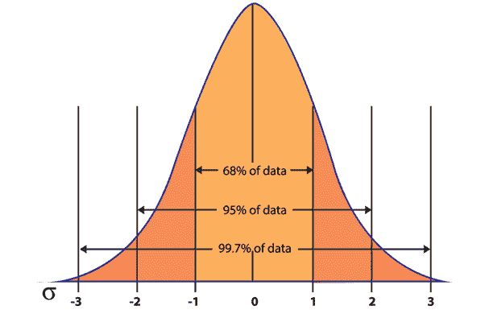
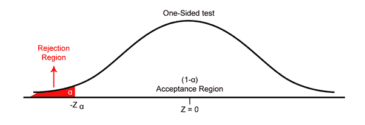
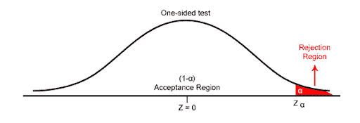
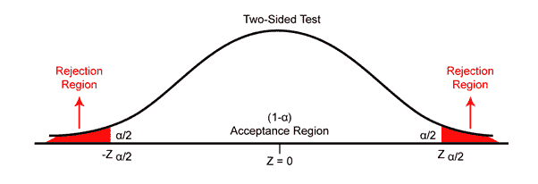

# 交易中的假设检验-逐步指南

> 原文：<https://blog.quantinsti.com/hypothesis-testing-trading-guide/>

由[维布·辛格](https://www.linkedin.com/in/vibhu-singh-1b76b6105/)

在这篇博文中，我们将了解什么是假设形成，以及如何在交易中进行假设检验。

建立量化交易策略需要一个严格的方法。任何量化交易系统都由四大部分组成:

1.  假设形成-寻找策略
2.  回溯测试和优化假设——获取数据，编码策略，分析性能
3.  自动化策略-链接到经纪公司
4.  风险管理-最佳资本分配、买卖规模等。

假设形成是关于你对市场的看法。如果你认为市场趋势看涨，你可以买入该资产；如果你认为市场趋势看跌，你可以做空该资产。但是为了验证假设，你需要进行假设检验。

## **假设检验**

假设检验是对关于人口的假设或想法进行检验的系统化方法。在假设检验中，我们通过测量样本中的行为来了解更多关于人群的信息，因为样本与人群有些关联。例如，如果俏皮 50 指数中所有股票的回报率为 3%，并且我们从指数中随机选择 10 只股票，那么样本平均值的平均值将等于总体平均值。

假设你是一名分析师，你认为 Nifty 50 指数中所有股票的平均回报率都高于 3%。你假设收益是正态分布的。

## **假设检验方法**

假设检验的方法可以概括为四个步骤:

1.  [陈述假设](#hypothesis)
2.  [设定决策标准](#criterion)
3.  [计算测试统计数据](#statistic)
4.  [做决定](#decision)

### **第一步:** **陈述假设**

陈述假设是假设检验既定流程的第一步。它包括陈述无效假设和替代假设。

#### **零假设:**

在假设检验中，零假设通常是我们想要拒绝的假设。它通常用 Ho 表示，并且总是包含某种形式的等号。

在我们的例子中，零假设是:

###### 何:μ< = 3的。

μ为总体均值。

#### **替代假设:**

备选假设是当零假设被拒绝时将被接受的陈述。它通常用 Ha 表示。

在我们的例子中，另一个假设是:

###### **ha:μ****>**

### **第二步:设置判定标准**

决策必须基于数据集的某些参数，这就是正态分布、显著性水平、单尾和双尾检验的概念出现的地方。

#### **常态分布**

正态分布是一种[概率分布](https://blog.quantinsti.com/statistics-probability-distribution/)，其中大部分数值位于平均值附近，其他数值对称地位于平均值之上或之下。

对于正态分布，68%的值落在平均值的一个标准偏差内。95%的值落在平均值的两个标准偏差内，99.7%的值落在平均值的三个标准偏差内。

### **显著性水平**

显著性水平或显著性水平用于设定标准，根据该标准做出关于零假设的决定。它被定义为当假设为真时，检验统计量偶然拒绝原假设的概率。它用α或α 来表示。如果我们选择 0.05 的显著性水平，这意味着当假设为真时，我们有 5%的机会拒绝零假设。显著性水平为 0.01 意味着当零假设为真时，有 1%的机会拒绝零假设。

通常，显著性水平是在计算检验统计之前指定的，因为检验统计的结果可能会影响显著性水平的选择。

### **单尾检验**

单尾检验意味着假设检验，其中拒绝区域出现在抽样分布的一侧。如果总体参数是“小于”或“大于”，那么我们使用单尾检验。例如，如果 Nifty 50 所有股票的回报率都大于 3%，那么进行的假设检验就是单尾检验。

### **双尾检验**

双尾检验表示假设检验，其中拒绝区域位于抽样分布的两侧。如果总体参数的特征是“等于”或“不等于”，那么我们使用双尾检验。例如，如果 Nifty 50 的所有股票的回报率等于 3%，那么它是一个双尾测试，我们可以拒绝基于任何一个尾的观察的零假设。

替代假设决定了是将显著性水平置于抽样分布的一个尾部还是两个尾部。如果μ 是一个总体参数的实际值(如均值或标准差)，μ 0 是我们假设的总体参数的值，那么:

| **替代假设** | **测试类型** |
| h1:μ≤t1【0】T2 | 双尾检验 |
| h1:μ>0 | 单尾(右) |
| h1:μ<0 | 单尾(左) |

### **第三步:计算测试统计量**

在假设检验中，检验统计量被定义为从样本中提取的数量，用于决定是拒绝还是接受零假设。

计算检验统计量的一般公式是

检验统计量=【-样本统计量-根据空值的参数值】 **/** 样本统计量的标准误差(SE)

标准误差=标准差/ √(样本数)

### **第四步:做决定**

关于假设检验的决定是通过比较两个值做出的。

1.  测试统计
2.  临界值:临界值是检验分布上的一个点，它与检验统计量进行比较，以确定是否拒绝零假设。是显著性水平 (α ) 、概率分布以及检验是单尾还是双尾的函数。

单尾和双尾检验(正态分布)在三种常用显著性水平下的临界值。

| **显著性水平****【α】** | 单尾检验 | 双尾检验 |
| 0.05 (5%) | +1.625 或-1.625 | 1.96 |
| 0.01 (1%) | +2.33 或-2.33 | 2.58 |
| 0.001 (0.1%) | +3.09 或-3.09 | 3.30 |

对于双尾检验，显著性水平 (α ) 对半分开，放在正态分布的每个尾部，如上图双尾图所示。

如果检验统计量的值小于或等于临界值，我们拒绝零假设，并声明结果具有统计学意义。如果检验统计量大于临界值，那么我们不能拒绝零假设，我们声明结果没有统计学意义。

其中，

Zα =显著性水平的临界值

## **错误类型**

假设检验中有两类错误:第一类和第二类。

### **第一类错误:**

类型 I 错误被定义为当零假设为真时拒绝零假设。犯 I 型错误的概率是α。α值为 0.05 表示当你拒绝零假设时，你愿意接受 5%的错误概率。选择较低的α值可以减少 I 型误差。

### **第二类错误:**

当零假设是假的，我们没有拒绝它，我们犯了第二类错误。犯第二类错误的概率是β。我们可以通过增加样本量来降低犯第二类错误的风险。

## **结论**

为了创造一个有利可图的交易策略，你需要有一个假设，为了验证一个假设，你需要进行假设检验。假设检验涉及的步骤有:

1.  陈述假设
2.  设定决策标准
3.  计算测试统计数据
4.  做决定

假设检验通常是我们开始制定交易策略的第一步。你可以通过检查算法交易策略包来浏览不同的策略。

##### **建议阅读:**

关于算法交易你需要知道的一切

*免责声明:股票市场的所有投资和交易都有风险。在金融市场进行交易的任何决定，包括股票或期权或其他金融工具的交易，都是个人决定，只能在彻底研究后做出，包括个人风险和财务评估以及在您认为必要的范围内寻求专业帮助。本文提到的交易策略或相关信息仅供参考。*