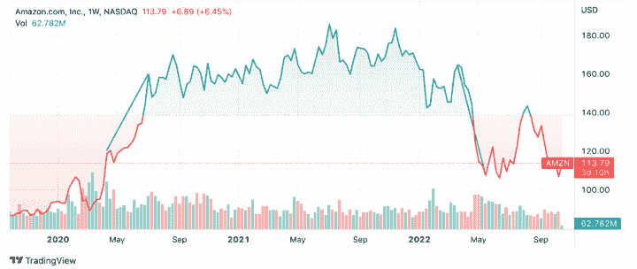

# 构建趋势跟踪策略的五个指标

> 原文：<https://blog.quantinsti.com/indicators-build-trend-following-strategy/>

由[查尼卡·塔卡](https://www.linkedin.com/in/chainika-bahl-thakar-b32971155/)

趋势跟踪策略是交易者中最受欢迎的策略，因为交易者可以根据股票的趋势决定做多或做空该股票。2022 年 5 月，据观察，兴业银行运行的领先趋势跟踪策略指数年初至今上涨超过 26%[⁽⁾](https://www.risk.net/investing/7949186/trend-followings-bumper-returns-mask-fading-convexity)。

让我们通过这篇博客了解更多的趋势跟踪策略和五个最常用的趋势交易指标，内容包括:

*   什么是趋势跟踪策略？
*   [趋势跟踪策略示例](#example-of-trend-following-strategy)
*   趋势是如何形成的？
*   [交易趋势的类型](#types-of-trends-in-trading)
*   [实施趋势跟踪策略](#implementation-of-trend-following-strategies)
*   [趋势跟踪策略的优点](#pros-of-trend-trading-strategy)
*   [趋势跟踪策略的缺点](#cons-of-trend-trading-strategy)

* * *

## 什么是趋势跟踪策略？

趋势跟踪策略是你简单地驾驭趋势的策略，即当价格上涨时买入，当价格开始下跌时卖出(两者都是长期的)。使用趋势跟踪策略，我们的目标不是预测或预言，而是只需要关注市场上任何出现的趋势。

* * *

## 趋势跟踪策略示例

让我们以亚马逊的股票作为趋势跟踪策略的例子。在下图中，我标记了两条蓝色的线，亚马逊的价格呈现两种趋势，即上升趋势和下降趋势。

Amazon

你可以在图中清楚地看到，在 2020 年，大约在 5 月份，亚马逊的股价持续上涨，甚至大部分时间都处于上涨趋势。

显而易见，到 2022 年 5 月，价格大多处于更高的高点和更高的低点。在上升趋势的情况下，趋势交易者做多并买入股票，希望价格进一步上涨。

但是，你可以说，在 2022 年 5 月，亚马逊的股价大多下跌，蓝色直线显示出急剧下降的趋势，随后是更低的低点和更低的高点。

在下跌趋势的情况下，趋势交易者通常会做空，并倾向于卖出股票。如果趋势跌破某个点，趋势交易者甚至会退出市场。

* * *

## 趋势是如何出现的？

当我们使用[算法交易](/algorithmic-trading-strategies)即[量化交易策略](https://quantra.quantinsti.com/course/quantitative-trading-strategies-models)来抑制[情绪交易](https://quantra.quantinsti.com/course/trading-using-options-sentiment-indicators)时，同样的方法也可以用来利用情绪并将其货币化。由于互联网的力量，我们都听说过像病毒一样传播的事情。这是同一个概念，尽管目标不同。

在金融界，也有 FOMO(害怕错过)，尽管在这里，原因是普遍希望站在胜利的一方。因此，趋势的出现是人类情感和从众欲望的结果，因为一群人可以根据事件引发的情感做出交易决定。其他人也跟着走！

* * *

## 交易趋势的类型

趋势跟踪是最常见和最流行的交易策略，因为趋势对交易者来说至关重要。趋势很重要，因为趋势可以帮助交易者识别金融市场(股票、商品、货币等)的进场和出场位置。).

因此，交易者可以跟踪趋势，在上升趋势的情况下买入(进入)股票，在趋势相反的情况下，交易者可以卖出(退出)股票。

以下是三种不同类型的总体趋势:

*   上升趋势
*   下降趋势
*   横向趋势

### 上升趋势

上升趋势意味着股票价格在升值。在上升趋势的情况下，交易者的目标是通过进入多头头寸来利用优势，以便在稍后以高价卖出。

例如，如果股票价格上涨 40 美元，下跌 20 美元，然后再次上涨 25 美元，达到 45 美元，则股票价格处于上升趋势，因为它在价格中显示出更高的高点(价格的上涨更经常地使价格线朝着向上的方向)和更高的低点(价格的偶尔下跌不使价格线朝着向下的方向)。

### 下降趋势

在下跌趋势的情况下，股价面临价值下跌。在下跌趋势中，趋势交易者进入空仓。而且，当股票价格似乎要跌破可能的最低点时(这使得价格太低)，趋势交易者更喜欢卖出股票，退出市场。

例如，如果股票价格下跌 70 美元，然后上涨 40 美元，然后再次下跌 50 美元，达到 80 美元，交易者将看到下降趋势的形成。

在下跌趋势中，它通过股价的较低高点(价格的偶尔上涨并不使价格线向上)和较低低点(价格的下降更经常使价格线向下)显示出来。

### 横向趋势

横盘趋势意味着市场是静态的，即股价既没有到达最高点，也没有到达最低点。通常，趋势交易者会忽略横盘趋势，但是为了利用横盘趋势，黄牛党会在市场上建立短期头寸。

* * *

## 实施趋势跟踪战略

[趋势跟踪策略](/strategy-using-trend-following-indicators-macd-st-adx)旨在利用市场情景获利。原因是高风险和同样高的收益。

没有一个单一的指标可以预测一种安全的买卖证券的方式。然而，有一些著名的方法经常被用来获得分析观点和逻辑决策。

以下是最好的交易指标，有助于创造趋势跟踪策略:

*   移动平均线
*   布林线
*   MACD
*   RSI
*   OBV

### 移动平均线

移动平均线指标是一个广泛使用的技术指标，用于做出不是基于一两次价格波动的决定。

一组[历史数据](/basic-statistics-for-trading-strategies-i)可以用来观察股票在预定时间段内的价格波动。这同样有助于描绘趋势流的大致方向。

**在趋势跟踪策略中使用移动平均线**

[移动平均线](/moving-average-trading-strategies)提供了一个清晰的思路，让你知道是做多还是做空这只股票。如果股票呈现负面趋势，即价格低于移动平均线，则做空(卖出)股票。

另一方面，如果股价高于简单移动平均线，则必须持有该股票的多头头寸(买入),因为预期股价会进一步上涨。

**用 Python 绘制趋势跟踪策略的移动平均线**

在我们绘制移动平均线之前，我们将首先定义一个时间段，并选择一只股票，以便我们进行分析。对于本文，我们将范围保持在 2020 年 1 月 1 日到 2022 年 1 月 1 日，使用的公司详细信息是 Tesla (TSLA)。

因此，在 python 中导入相关库并定义周期的代码如下: