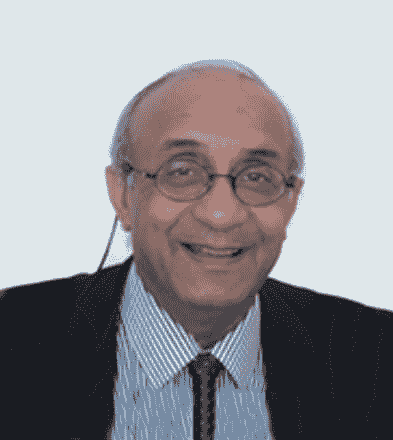
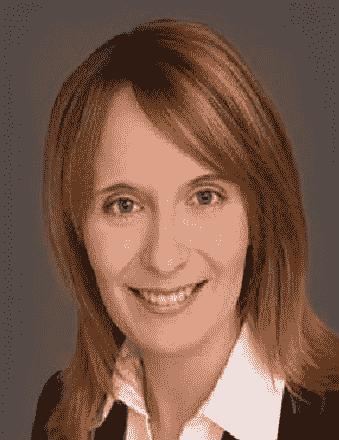

# CSAF 金融情绪分析和替代数据证书[信息课程]

> 原文：<https://blog.quantinsti.com/info-session-csaf-29-march-2022/>

[https://www.youtube.com/embed/26rvLjc52pw?rel=0](https://www.youtube.com/embed/26rvLjc52pw?rel=0)

* * *

## 关于会议

参加这个关于 CSAF 的实时信息会议，了解 CSAF 如何提升你的形象和职业生涯。

CSAF 是一个在现代金融方法中发展你职业生涯的完美平台，它涵盖了交易、投资决策的各个方面&使用新闻分析、情绪分析和替代数据的应用。

会议大纲如下:

*   由顶尖的交易专家、情绪专家、定量模型专家和 HFT 思想领袖为金融专业人士设计的利基课程。
*   这门课程如何对不同背景的专业人士有用？
*   本课程通过基础讲座和使用案例讲座来讲授
*   考试、评估和认证
*   主要结果和收获
*   问与答(Question and Answer)

* * *

## 扬声器

<figure class="kg-card kg-image-card"></figure>

### Gautam Mitra 教授

**主席，UNICOM 和 OPTIRISK**
Mitra 教授是运筹学领域，尤其是计算优化和建模领域的国际知名研究科学家。他是 OptiRisk Systems 和 UNICOM 研讨会的创始人和主席。他出版了五本书，发表了 150 多篇研究论文，并于 2004 年被布鲁内尔大学授予“杰出教授”称号。

<figure class="kg-card kg-image-card"></figure>

### Christina Erlwein-Sayer 教授

柏林工业大学统计和金融数学教授
Christina 教授是柏林工业大学(HTW)统计和金融数学教授，曾在 OptiRisk Systems 担任定量分析师和高级研究员。她于 2008 年在伦敦布鲁内尔大学获得了数学博士学位。然后，她在德国凯泽斯劳滕弗劳恩霍夫 ITWM 大学金融数学系担任研究员和顾问。

### 特邀嘉宾

CSAF 大学的校友也加入了我们，

*   来自澳大利亚墨尔本的 Amit Arora(高级变革管理顾问)和
*   abhijit Desai(ICICI 证券公司电子交易副总裁)来自印度孟买。

* * *

本次活动于:
*2022 年 3 月 29 日星期二
东部时间上午 9:30 | IST 时间晚上 7:00 | SGT 晚上 9:30*