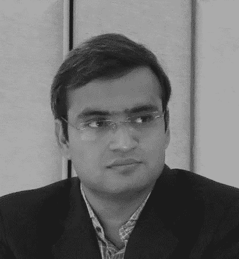

# 关于算法交易的信息会议

> 原文：<https://blog.quantinsti.com/informative-session-algorithmic-trading-webinar/>

[https://www.youtube.com/embed/nq0n9vOnkQo?rel=0](https://www.youtube.com/embed/nq0n9vOnkQo?rel=0)

**日期:**2016 年 11 月 3 日星期四

**时间:**IST 时间下午 06:30 |新加坡时间下午 09:00 |格林威治时间下午 01:00

### **会话内容**

*   算法交易行业概述
    *   目前的市场份额和数量
    *   全球算法交易的增长和未来
    *   风险措施和技术进步
    *   如何开始——免费且便宜的试水方法
*   EPAT——算法交易管理课程
    *   这是什么？
    *   这和你有什么关系？
    *   为什么你需要参与进来？
*   问与答——询问算法和量化交易专家

### **发言人简介**

**Nitesh Khan delwal 先生，伊拉克资本咨询有限公司联合创始人**

Nitesh 在金融市场拥有丰富的经验，在不同的资产类别中扮演不同的角色。他共同创立了 irage capital Advisory Private Limited，这是一家在印度提供算法交易技术和策略服务领域值得信赖的公司。他领导了 iRageCapital 和 QuantInsti 的业务部门。在 QuantInsti，他还是衍生品和跨市场研究培训部门的负责人。他目前是位于新加坡的 iRage 全球咨询服务私人有限公司的董事。

他曾在银行资金部(外汇和利率领域)和自营交易部门工作过。他在 IIT 坎普尔获得电子工程技术学士学位，之后在 IIM 勒克瑙获得管理学研究生学位。

### **下一步**

如果你是一名散户交易者或专业技术人员，想要建立自己的自动化交易平台，今天就开始学习算法交易吧！从基本概念开始，如[自动交易架构](https://blog.quantinsti.com/algorithmic-trading-system-architecture/)、[市场微观结构](https://blog.quantinsti.com/market-microstructure/)、[策略回溯测试系统](https://blog.quantinsti.com/backtesting/)和[订单管理系统](https://blog.quantinsti.com/automated-trading-order-management-system/)。你也可以报名参加 EPAT，这是业内最广泛的量化交易课程之一。