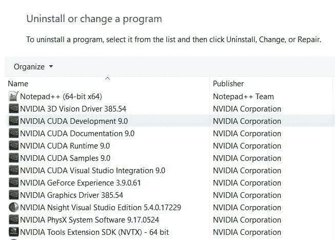
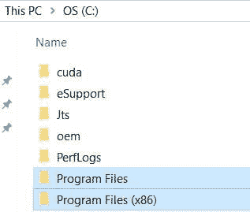
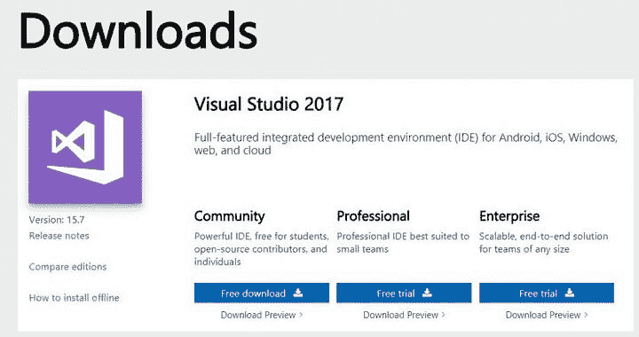
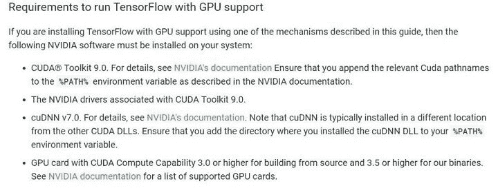
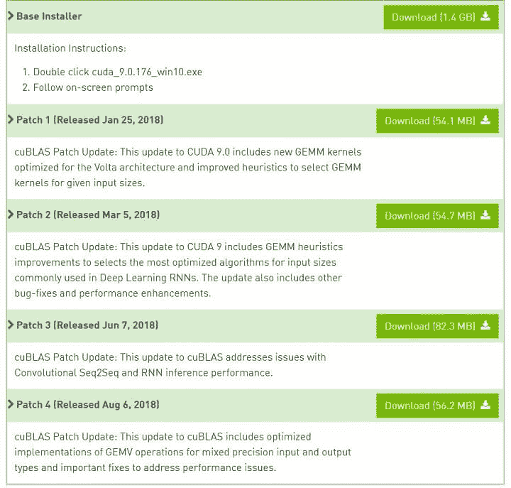
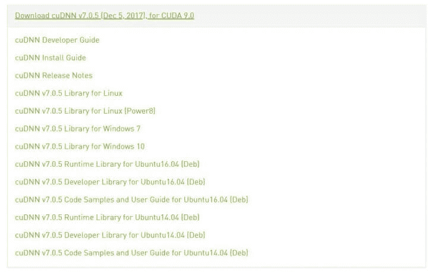
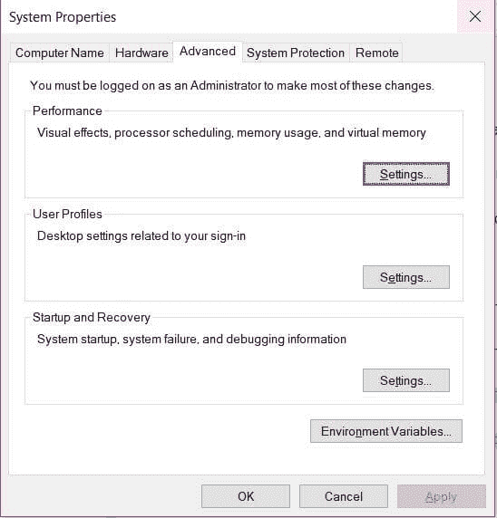
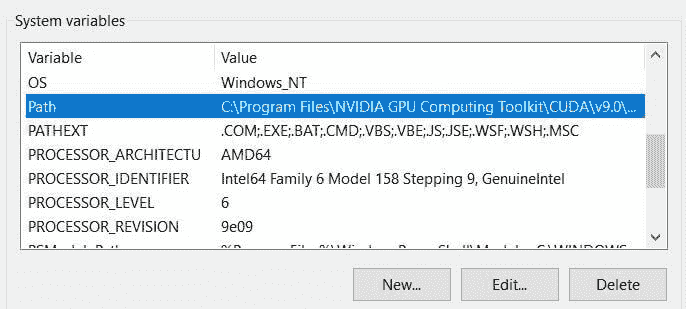
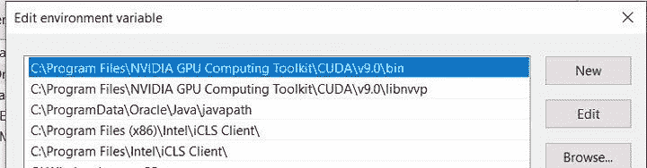

# 如何安装 TensorFlow GPU(附详细步骤)

> 原文：<https://blog.quantinsti.com/install-tensorflow-gpu/>

由[瓦伦·迪瓦卡](https://www.linkedin.com/in/varun-divakar-b862a667/)

在这篇博客中，我们将了解如何在 Nvidia GPU 系统上安装 Tensorflow GPU。Tensorflow GPU 安装过程中涉及的步骤有:

1.  [卸载 Nvidia](#step-1-uninstall-nvidia)
2.  [安装 Visual Studio](#step-2-install-visual-studio)
3.  [安装 CUDA](#step-3-install-cuda)
4.  [安装 cuDNN](#step-4-install-cudnn)
5.  [安装蟒蛇](#step-5-install-anaconda)
6.  [安装 TensorFlow-GPU](#step-6-install-tensorflow-gpu)
7.  [Install Keras](#step-7-install-keras)

* * *

当我开始研究深度学习(DL)模型时，我发现在 CPU 上训练这些模型所需的时间太长了，如果你在一天内创建多个模型，这将阻碍你的研究工作。后来我听说了 GPU 的优越性能，所以我决定为自己买一个。

我最初面临的一个基本问题是 [TensorFlow GPU](https://www.tensorflow.org/) 的安装。在经历了很多麻烦和烧坏主板(不是因为 TensorFlow)之后，我学会了怎么做。

几天前，我和一个面临类似问题的人聊过，所以我想我可以帮助那些陷入类似情况的人，写下我让它起作用的步骤。

* * *

## 步骤 1:卸载 Nvidia

这可能看起来不像是一个必要的步骤，但是相信我，如果你当前的驱动程序和 CUDA T1 之间存在兼容性问题，这将会为你省去很多麻烦。

登录到系统后，转到控制面板，然后转到“卸载程序”链接。然后向下滚动到由 Nvidia 公司发布的程序部分。

<figure class="kg-card kg-image-card kg-width-full kg-card-hascaption">

<figcaption>Uninstall Nvidia</figcaption>

</figure>

在这里，你卸载所有的 Nvidia 程序。如果您有一些驱动程序，请不要担心，它们可以在您完成安装后更新。

一旦你删除了所有的程序，转到 c 盘，检查所有的程序文件文件夹，并删除其中的任何 Nvidia 文件夹。

<figure class="kg-card kg-image-card kg-card-hascaption">

<figcaption>Delete Nvidia folders</figcaption>

</figure>

* * *

## 步骤 2:安装 Visual Studio

下一步，我们将安装 visual studio 社区。

<figure class="kg-card kg-image-card kg-width-full kg-card-hascaption">

<figcaption>Download Visual Studio</figcaption>

</figure>

在这里，确保您选择了社区选项。

<figure class="kg-card kg-image-card kg-width-wide kg-card-hascaption">

<figcaption>Select the community option</figcaption>

</figure>

下载 Visual Studio 后，请按照安装过程进行操作并完成安装。

**注意:安装 Visual Studio 社区不是先决条件。任何其他 IDE 或没有 IDE 也可以用于运行带有 GPU 的 TensorFlow。*T3】*

* * *

## 步骤 3:安装 CUDA

这是一个棘手的步骤，在您继续安装 CUDA 的最新版本之前(这是我最初做的)，请[检查最新 TensorFlow](https://www.tensorflow.org/install) [**支持的 CUDA 版本。**](https://www.tensorflow.org/install)

我有一个基于 windows 的系统，因此相应的链接显示 CUDA 的最新支持版本是 9.0，而其对应的 cuDNN 版本是 7。

<figure class="kg-card kg-image-card kg-width-full kg-card-hascaption">

<figcaption>Install CUDA</figcaption>

</figure>

不言而喻，要安装 TensorFlow GPU，您需要在系统中安装一个实际的 GPU。

因此**请检查您的系统上是否有 GPU**，如果有，请使用上面截图中的第三个链接检查它是否是兼容版本。一旦你确定你的 GPU 是兼容的，[下载 CUDA 工具包 9.0](https://developer.nvidia.com/cuda-90-download-archive) 。

*   请正确选择您的操作系统、架构(平台的 CPU 类型)和操作系统版本。
*   然后点击 exe(本地)按钮。
*   现在下载基本安装程序和所有可用的补丁。

<figure class="kg-card kg-image-card kg-width-full kg-card-hascaption">

<figcaption>Install CUDA installer and patches</figcaption>

</figure>

下载完成后，首先安装基本安装程序，然后安装从补丁 1 到补丁 4 的补丁。

如果您在安装过程中遇到任何问题，请查看 Nvidia 论坛。

* * *

## 步骤 4:安装 cuDNN

一旦安装完成，您就可以[下载 cuDNN 文件](https://developer.nvidia.com/cudnn)。

*   在这里下载所需的文件，你需要有一个开发者的登录。因此，如果您还没有，请继续创建您的登录帐户。
*   一旦您创建了您的登录名并同意条款和条件，请访问[存档的 cuDNN 文件](https://developer.nvidia.com/rdp/cudnn-archive)。
*   点击 CUDA 9.0 版为 CUDA 9.0

<figure class="kg-card kg-image-card kg-width-full kg-card-hascaption">

<figcaption>Install cuDNN</figcaption>

</figure>

然后为您的系统选择合适的操作系统选项。

<figure class="kg-card kg-image-card kg-width-full kg-card-hascaption">

<figcaption>Install cuDNN and choose OS</figcaption>

</figure>

这会将一个 zip 文件下载到您的系统中。解压缩文件后，您会看到其中有三个文件夹:bin、include 和 lib。将这三个文件解压缩到您的桌面上。

<figure class="kg-card kg-image-card kg-width-full kg-card-hascaption">

<figcaption>Install cuDNN unzip and extract files</figcaption>

</figure>

一旦你提取了它们。转到 c 盘，在那里你会找到一个名为 NVIDIA GPU 计算工具包的文件夹。

在这个文件夹中，您会发现一个名为 CUDA 的文件夹，其中有一个名为 v9.0 的文件夹。在这个文件夹中，您可以看到您有相同的三个文件夹:bin、include 和 lib。

将桌面上 bin 文件夹的内容复制到 v9.0 文件夹中的 bin 文件夹。类似地，传输 include 和 lib 文件夹的内容。

一旦你完成了内容的传输，进入开始菜单并搜索“编辑环境变量”。单击搜索结果，打开“系统属性”窗口，并在其中打开“高级”选项卡。

<figure class="kg-card kg-image-card kg-width-full kg-card-hascaption">

<figcaption>Install cuDNN system properties</figcaption>

</figure>

现在点击“环境变量”，

<figure class="kg-card kg-image-card kg-width-full kg-card-hascaption">

<figcaption>Install cuDNN environment variables</figcaption>

</figure>

在“系统变量”下，查找 PATH，选择它，然后单击“编辑”。将以下两条路径添加到 path 变量中:

*   C:\Program Files\NVIDIA GPU 计算工具包\CUDA\v8.0\bin
*   C:\Program Files\NVIDIA GPU 计算工具包\CUDA\v8.0\libnvvp

<figure class="kg-card kg-image-card kg-card-hascaption">

<figcaption>Install cuDNN add paths</figcaption>

</figure>

完成这些之后，您可以下载 Anaconda，如果您已经有了它，那么在其中创建一个 Python 3.5 环境。

* * *

## 步骤 5:安装 Anaconda

要在你的系统上安装 Anaconda，请访问 **[此链接](https://www.anaconda.com/download/)** 。在这里选择你的操作系统和 Python 3.6 版本，然后点击下载。按照安装管理器中的说明完成安装过程。

一旦您完成了 Anaconda 的安装。在终端或 anaconda 提示符下使用以下命令创建一个 Python 3.5 环境。

```py
conda create -n tensorflow python=3.5
```

创建环境后，在终端或 anaconda 提示符下使用以下命令激活它:

```py
activate tensorflow
```

* * *

## Step 6: Install Tensorflow GPU

准备好环境后，可以在终端或 anaconda 提示符下使用以下命令安装 Tensorflow GPU:

```py
pip install --ignore-installed --upgrade tensorflow-gpu
```

如果您使用的 CUDA 和 cuDNN 版本与本博客中显示的版本不同，您将需要指定 tensorflow-gpu 的版本。上面一行默认安装最新版本的 Tensorflow。

如果您在安装 Tensorflow 时有任何问题，请查看 [**此链接**](https://www.tensorflow.org/install/install_windows#common_installation_problems) 。

* * *

## Step 7: Install Keras

一旦安装了 Tensorflow，就可以安装 Keras 了。使用以下命令:

```py
pip install keras
```

一旦 Keras 的安装成功完成，您可以通过在 Spyder IDE 或 Jupyter notebook 上运行以下命令来验证它:

```py
import keras
```

有些人可能会面临味精包装的问题。如果需要，您可以使用以下命令安装它:

```py
conda install -c anaconda msgpack-python
```

* * *

## 结论

希望你已经在系统上成功安装了 Tensorflow GPU。在本文中，我们介绍了在 windows 上安装 Tensorflow GPU 的许多重要方面，例如:

*   如何安装 Anaconda，
*   如何安装 Tensorflow，
*   如何安装 Keras？

我们从卸载 Nvidia GPU 系统开始，进展到学习如何安装 Tensorflow GPU。深度学习模型需要大量的神经网络层和数据集来进行训练和运行，对交易领域的贡献至关重要。

要了解如何在交易中应用深度学习模型，请访问我们的新课程[神经网络交易](https://quantra.quantinsti.com/course/neural-networks-deep-learning-trading-ernest-chan)，该课程由世界知名的欧内斯特·陈博士(Ernest P. Chan)教授。它涵盖了核心概念，如在 Keras 中使用 LSTM 模型的反向和正向传播。

* * *

*<small>免责声明:股票市场的所有投资和交易都涉及风险。在金融市场进行交易的任何决定，包括股票或期权或其他金融工具的交易，都是个人决定，只能在彻底研究后做出，包括个人风险和财务评估以及在您认为必要的范围内寻求专业帮助。本文提到的交易策略或相关信息仅供参考。</small>T3】*