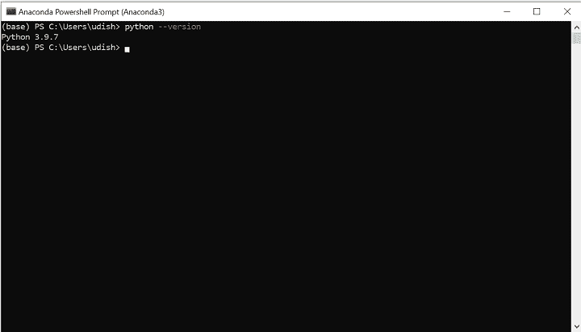
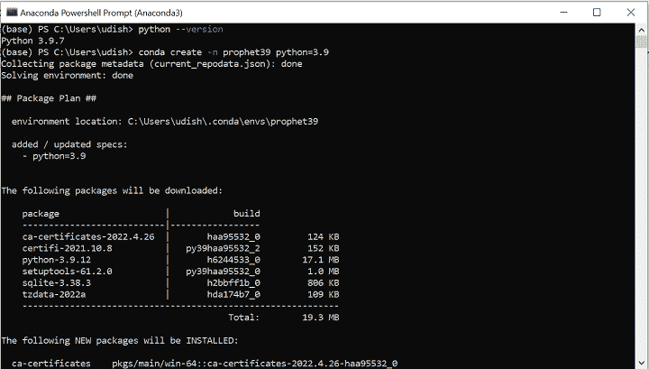
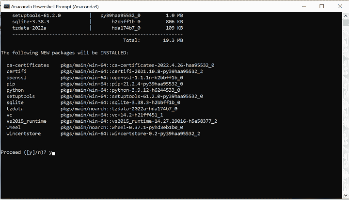
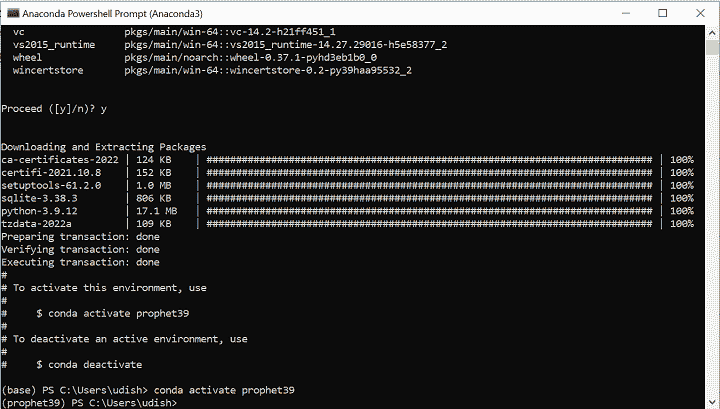
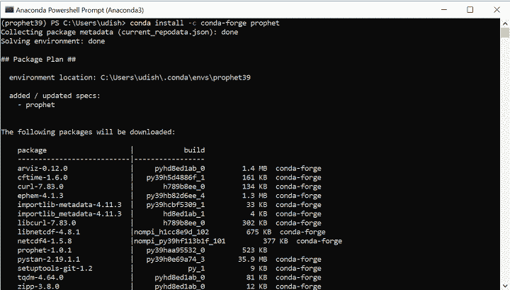
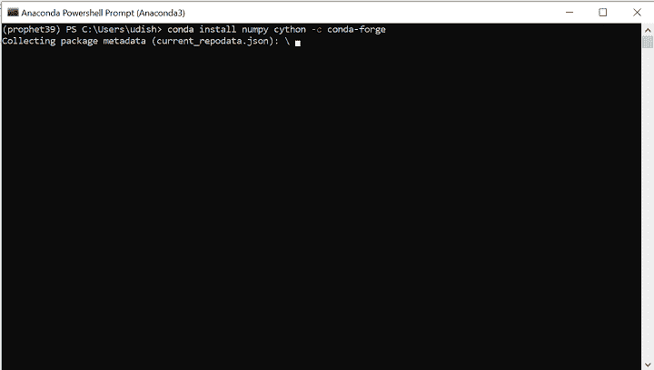
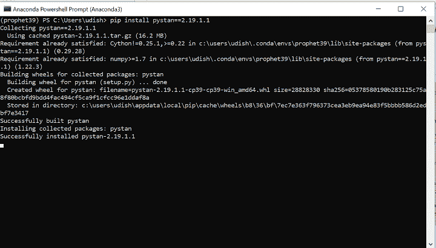
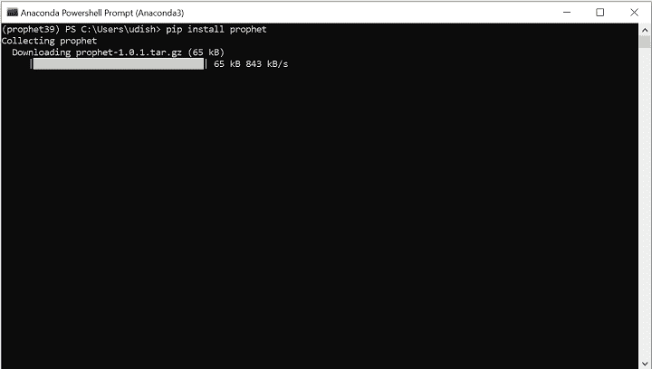

# 在 Windows 上安装先知库

> 原文：<https://blog.quantinsti.com/installing-prophet-library-windows/>

由[乌迪莎·阿洛克](http://www.linkedin.com/in/udisha-alok)

在 Windows 系统上安装 Prophet 库可能会很棘手，因为它依赖于其他库。在这篇博客中，我们将列出在你的 Windows 系统上顺利安装 Prophet 的步骤。

我们将讨论以下主题:

*   [什么是先知？](#what-is-prophet)
*   [Prophet 安装依赖关系](#prophet-installation-dependencies)
*   [安装 Prophet 前检查环境](#checking-the-environment-before-installing-prophet)
*   [使用 conda 安装 Prophet】](#prophet-installation-using-conda)
*   [安装 Prophet 依赖项](#installing-prophet-dependencies)
*   [安装预言者](#installing-prophet)
*   [常见问题和修复](#common-issues-and-fixes)

* * *

## 什么是先知？

Prophet(之前称为 fbprophet)是由脸书的核心数据科学团队开发的开源库。它主要用于时间序列预测。

它对缺失数据、异常值和趋势变化非常稳健，是用于时间序列预测的最流行的库之一。想了解更多关于 Prophet 的信息，可以去翻翻它的官方[文档](https://facebook.github.io/prophet/)。

[在 Mac OS 上安装 Prophet](/installing-prophet-library-mac/)也是可以的。

* * *

## Prophet 安装依赖项

Prophet 安装可能比较棘手，主要是因为以下三个原因:

1.  Python 版本
2.  对 Pystan 库的依赖
3.  Microsoft C++生成工具依赖项

* * *

## 安装 Prophet 前检查环境

这篇文章我用的是 Windows 10 的机器。但是，该过程应该适用于所有 Windows 系统。

在继续之前，我们将首先检查系统上安装的 Python 版本。我们在 Anaconda 提示符下运行 below 命令，如下所示。



Check Python version


如果您有 Python 3.6 或更高版本，就可以开始了。

但是，由于各种依赖关系，我们建议您创建一个新环境来安装 Prophet。我们通过在 Anaconda 提示符下运行以下代码，在您的系统上创建一个名为 **prophet39** 的环境:

```py
conda create -n prophet39 python=3.9
```



Create a new environment for Prophet


当 conda 提示我们是否继续时，我们输入' ***y*** '。



Create a new environment for Prophet


完成后，我们使用以下命令激活这个 prophet39 环境:

```py
conda activate prophet39
```



Activate the environment


正如你所看到的，我们现在处于预言的环境中。现在，我们可以继续安装了。

* * *

## 使用 conda 安装 Prophet

如前所述，Prophet 的安装由于其依赖性可能会很棘手。然而，一个简单的解决方案是使用 conda 进行安装。使用 conda 进行安装有多种优势。

1.  Conda 是跨平台的，因此它可以在任何系统上工作。
2.  使用 conda 很容易管理环境。在上一节中，我们使用 conda 创建了一个具有特定 Python 版本的环境。
3.  康达为你“解决”你的环境。这意味着它会为您处理所有的依赖关系。

因此，安装 Prophet 的第一件事是在终端上运行以下命令:

```py
conda install -c conda-forge prophet
```



Conda installation for Prophet


在大多数情况下，这将在您的系统上成功安装 Prophet。如果这对你有用，你可以跳过博客的其余部分。

但是，在某些情况下，您可能会遇到错误。运行上述命令后，您得到了一个吗？

如果你有，这个博客值得你继续关注。请继续阅读，我们将带您一步步地了解安装依赖项以及 Prophet 库本身的过程。

* * *

## 安装 Prophet 依赖项

先知的主要依赖是 Pystan。Pystan 库有自己的[安装说明](https://pystan2.readthedocs.io/en/latest/windows.html?msclkid=eb5dcb49ac2511ec829bf25d2eab26d6)。

然而，在我们安装 Pystan 之前，我们需要安装一些其他的库。

首先，我们需要安装 C++编译器 mingw-w64 toolchain，这又需要 libpython。因此，我们按如下方式安装它们:

```py
conda install libpython m2w64-toolchain -c msys2
```


Install Pystan dependencies


我们需要安装 Cython 和 Numpy。

```py
conda install cython numpy
```

如果有任何问题，您可以使用以下命令:

```py
conda install numpy cython -c conda-forge
```



Install Cython and Numpy


现在，我们安装一些其他可选的依赖项，这将有助于我们的安装顺利进行。

```py
conda install matplotlib scipy pandas -c conda-forge
```


Install Matplotlib, Scipy and Pandas


由于 Pystan 在 pip 上可用，我们建议使用 pip 来安装它，如下所示:

```py
pip install pystan
```



Install Pystan


或者，我们可以使用 conda 安装它:

```py
conda install pystan -c conda-forge
```

## 安装 Prophet

我们现在快结束了。

最后，我们使用以下命令安装 Prophet:

```py
pip install prophet
```



Install Prophet


* * *

## 常见问题和修复

Prophet 安装可能会有问题，主要是因为它依赖于 Pystan，而 Pystan 又有自己的依赖项。然而，如果你遵循上面列出的安装说明，这个过程虽然很长，但会很顺利。

以下是常见问题及解决方法的列表:

| **SNo** | **发布** | **建议修复** |
| 1. | 使用 pip install for Prophet，您得到一个错误:" ***运行 setup.py install for prophet...*错误** | 使用 Anaconda 安装:***康达安装-c*康达-锻造先知** |
| 2. | 错误:为 pystan 构建轮子失败 | 确保 Pystan 的所有依赖项(包括可选的)都已安装。 |
| 3. | 使用 pip 在 Python 3.9 中安装 Prophet 时出错。 | 尝试在 Python 3.7 上安装。 |
| 4. | 在基本环境中安装时出错。 | 由于 Prophet 的各种依赖性，我们建议在安装之前创建一个新环境。 |
| 5. | 安装后，导入 prophet 时，得到错误:“ ***导入 plotly 失败。交互式情节不起作用。*** | 检查 prophet39 环境中是否安装了 plotly。如果没有，请使用以下方式安装 plotly:pip 安装计划
如果已经安装了 plotly，请使用以下命令进行升级:pip 安装-升级 plotly |
| 6. | 使用 pip 安装 pystan 时出错。 | 尝试使用 Anaconda 来安装:康达安装 pystan -c 康达锻造 |
| 7. | 安装 Prophet 时出错:“ ***错误:需要 Microsoft Visual C++ 14.0 或更高版本。用*的【微软 C++构建工具】得到它** | 从[https://visualstudio.microsoft.com/visual-cpp-build-tools/](https://visualstudio.microsoft.com/visual-cpp-build-tools/)安装微软 Visual C++。之后，再次尝试安装 Prophet。 |

* * *

### 结论

我们讨论了如何在 Windows 机器上安装 Prophet 库，从创建环境、安装其依赖项以及最终的 Prophet 安装开始。

我们还了解了安装中一些常见的问题以及如何解决这些问题。我希望这将为您在 Windows 系统上安装这个库节省一些时间和精力。

如果你认为机器学习是金融市场未来的重要组成部分，那么对于那些对 ML 及其在 Quantra 交易中的应用感兴趣的人来说，你不能错过这个在[机器学习&金融市场深度学习](https://quantra.quantinsti.com/learning-track/machine-learning-deep-learning-in-financial-markets)上强烈推荐的学习课程。立即注册！

* * *

*<small>免责声明:股票市场的所有投资和交易都涉及风险。在金融市场进行交易的任何决定，包括股票或期权或其他金融工具的交易，都是个人决定，只能在彻底研究后做出，包括个人风险和财务评估以及在您认为必要的范围内寻求专业帮助。本文提到的交易策略或相关信息仅供参考。</small>T3】*