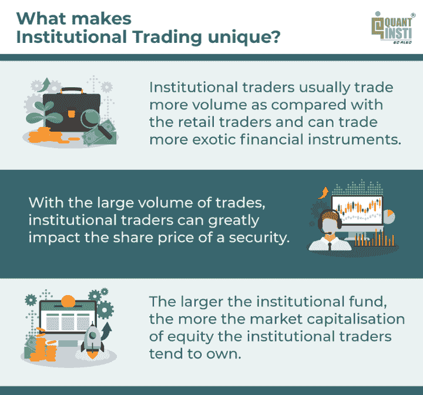

# 机构交易:介绍，例子，类型，策略等等

> 原文：<https://blog.quantinsti.com/institutional-trading/>

由[查尼卡·塔卡](https://www.linkedin.com/in/chainika-bahl-thakar-b32971155/)

机构投资者是对金融工具的价格动态施加巨大影响的交易公司(如花旗集团、摩根大通)，因为:

*   他们交易奇异金融工具的能力(私人投资者可能有，也可能没有)
*   为客户管理大量资金的能力

让我们来了解一下[机构投资者](https://quantra.quantinsti.com/glossary/Institutional-Investors)、他们的交易行为以及本博客涵盖的更多内容:

*   [什么是机构交易？](#what-is-institutional-trading)
*   [机构交易的例子](#examples-of-institutional-trading)
*   [机构交易公司使用的服务提供商](#service-providers-used-by-institutional-trading-firms)
*   机构交易的独特之处是什么？
*   [机构交易者 vs 散户交易者](#institutional-traders-vs-retail-traders)
*   [机构投资者的类型](#types-of-institutional-investors)
*   [机构交易策略](#institutional-trading-strategies)
*   [如何成为机构交易者？](#how-do-you-become-an-institutional-trader)
    *   [机构交易的教育要求](#educational-requirements-for-institutional-trading)
    *   [机构交易中的工作机会](#job-opportunities-in-institutional-trading)
*   [机构交易者赚多少钱？](#how-much-do-institutional-traders-earn)
*   [机构交易的优势](#advantages-of-institutional-trading)
*   [机构交易的弊端](#disadvantages-of-institutional-trading)
*   [学习机构交易的资源](#resources-to-learn-institutional-trading)

* * *

## 什么是机构交易？

机构交易是由一个法人实体进行的，它从几个不同的投资者那里积累资金，投资于不同的金融工具，如股票、债券、房地产等。简而言之，机构交易是由大型机构代表客户进行的。

有几种类型的证券，如远期、掉期等。私人交易者可能得不到，因为这种可交易的项目需要大量的资金，而且在长期投资中大多是成功的。此外，机构投资者获得了最佳交易价格。

* * *

## 机构交易的例子

首先，让我们看看代表客户进行交易的公司的例子。这种为客户提供投资服务的公司被称为机构交易公司。机构交易公司的一些例子如下。

### 机构交易公司示例

*   [花旗集团](https://www.citigroup.com/citi/)
*   摩根大通

* * *

## 机构交易公司使用的服务提供商

此外，让我们找出机构交易公司用来提供持续市场信息的服务提供商。例如:

### 机构交易服务提供商

*   [彭博](https://www.bloomberg.com/professional/expertise/investor-relations/)
*   [汤森路透](https://ir.thomsonreuters.com/)
*   [事实集](https://www.factset.com/)
*   [市场观察](https://www.marketwatch.com/)

* * *

## 机构交易的独特之处是什么？

<figure class="kg-card kg-image-card kg-width-full kg-card-hascaption">

<figcaption>Institutional trading is unique</figcaption>

</figure>

* * *

## 机构交易者与散户交易者

| **机构交易员** | **散户** |
| 机构交易者为他们为团体或机构管理的账户买卖证券 | 散户为个人账户买卖证券 |
| 交易更大的尺寸(量) | 交易较小规模的资产 |
| 可以交易更多的奇异产品，如[奇异期权](/exotic-options/)(障碍期权、二元期权等。) | 通常交易常规/普通可交易项目 |
| 机构有优势，比如可以获得更多的产品([IPO](https://en.wikipedia.org/wiki/Initial_public_offering)、[期货](https://quantra.quantinsti.com/glossary/Futures)、[掉期](https://quantra.quantinsti.com/glossary/Swap)) | 无法获得期货、掉期等。通常 |
| 拥有谈判交易费用的能力，并保证执行的最佳价格 | 无法协商交易费用和执行价格 |
| 通常涉及长期投资 | 包括长期和短期投资 |

* * *

## 机构投资者的类型

机构投资者的几种类型如下:

*   银行([摩根大通](https://www.jpmorgan.com/global)，[花旗](https://www.citi.com/))
*   信用社([海军联合会](https://www.navyfederal.org/)，[全球信用社](https://globalcu.org/))
*   养老基金([政府养老金投资](https://www.gpif.go.jp/en/)
*   保险公司([雪绒花](https://www.edelweisstokio.in/investment-returns-calculator?cp_id=622&v_id=68&c_id=112&utm_source=Search&utm_term=edelweiss%20insurance&utm_creative=Expanded_Search_Ads&utm_campaign=WSP_BrandGroup_Exact_Desk&utm_device=c&utm_content=Search&utm_adgroup=edelweiss_insurance&utm_placement=&utm_medium=Google&gclid=CjwKCAjwxOCRBhA8EiwA0X8hi90_Ij6ywofEG0S9mFMyUA403WCVVa5fCTmIWWzojEYb1K9uTTzrxBoC_u8QAvD_BwE)，[联合健康集团](https://www.unitedhealthgroup.com/))
*   对冲基金( [Bridgewater Associates](https://www.bridgewater.com/) ， [Renaissance Technologies](https://www.rentec.com/Home.action?index=true)
*   共同基金( [DSP 贝莱德世界矿业基金、](https://www.blackrock.com/us/individual) [ICICI 保诚全球稳定股票](https://www.icicipruamc.com/mutual-fund/other-funds/icici-prudential-global-stable-equity-fund?utm_source=google&utm_medium=cpc&utm_campaign=&utm_adgroup=&utm_term=&utm_network=Search_g&utm_matchtype=&utm_device=c&utm_placement=&utm_content=471783804888&utm_Adposition=&utm_location=9302008&utm_campaignid=9566765272&gclid=CjwKCAjwiuuRBhBvEiwAFXKaNN5ybGKOYRcmWmOwXexXnahhFqA3Wl0ZuPITzt8O0lfr2cEIptxIghoCcfAQAvD_BwE&gclsrc=aw.ds))
*   房地产投资信托([安年资本管理](https://www.swfinstitute.org/profile/5afdd48837b3d91a52c57508)、 [AGNC 投资公司](https://www.swfinstitute.org/profile/5d0ac54af8e6cb726e40706f))

* * *

## 机构交易策略

机构投资者的策略取决于多种因素。机构投资者根据以下因素做出投资决策:

*   市场波动的预期
*   外汇市场状况
*   宏观经济因素，如战争、自然灾害、贸易协定等。

机构投资者遵循的一些策略是:

*   指数再平衡
*   资产配置
*   要素投资
*   对特殊工具的投资，如掉期、远期等。

### 指数再平衡

[指数](https://quantra.quantinsti.com/glossary/Index)的再平衡是重新调整[投资组合](https://quantra.quantinsti.com/course/quantitative-portfolio-management)中金融工具权重的简单过程。指数的再平衡无非是通过修改投资组合中的金融工具来保持投资组合的平衡，以使风险在一段时间内大致保持不变。

例如，乌克兰-俄罗斯战争等宏观经济因素导致的经济条件变化。这可能导致金融市场基础资产价格的重大变化。

此外，这种情况会导致相关行业/部门发生重大变化。当前的一个例子是，由于战争情况，最近对原油的需求增加。

### 资产配置

机构交易者实施资产分配策略来平衡投资组合中的风险和回报。这种做法/策略根据客户的风险承受能力、目标和决定的投资时间框架调整投资组合中每种金融工具的百分比。

### 要素投资

[因素投资](/factor-investing/)是一种投资策略，通过根据因素选择证券来帮助创建投资组合。因素有助于解释这些证券的回报和风险。宏观经济和风格是两类因素。

*   利率、通胀、流动性等宏观经济因素有助于解释不同资产类别的回报率。
*   另一方面，价值、规模、动力、低波动性、质量等风格因素有助于解释资产类别中的回报。

利用不同的因素，投资者可以创造更高的回报，降低风险，增加投资组合的多样化。

### 对特殊金融工具的投资，如掉期、远期等。

互换、远期等投资。给了机构投资者优势。散户通常无法获得这种奇异的工具，因为机构投资者拥有这种投资所需的巨额资金。

因此，机构投资者采取策略投资于奇异的工具，以显著分散投资组合。

* * *

## 如何成为机构交易者？

要成为机构交易者，你需要从散户开始，这样你就知道金融市场的错综复杂。我们先从成为机构交易者的学历要求说起。

### 机构交易的教育要求

坦率地说，为了开始机构交易的职业生涯，没有特定的课程或学位需要选择。这通常取决于你对数字和计算的精通程度。

大多数机构交易者持有学士学位或更高的学位。但是，如果你想成为一名在高层工作的专业机构交易者，你需要一个硕士学位。

以下是一些学士和硕士对机构交易角色有帮助的科目:

*   金融
*   会计
*   商业
*   经济学

此外，机构交易者可以通过攻读数学、经济学、物理学和定量金融学的博士学位而受益。有了上述学科中根深蒂固的知识，定量计算的高级知识一定会成为成功的机构交易者。

### 机构交易中的就业机会

完成学业后，你可以开始做实习生或在职培训主管。

一些大型机构投资者，如花旗集团，培训和雇佣应届毕业生。如果你想自己开始，那么从散户开始是最好的。同时，你可以选择同时学习。

机构交易员的角色是一个高要求的工作，需要利基技能，因为这样的人参与投资和管理别人的钱。对于拥有合适技能的人来说，全球有巨大的机会。组织主要寻求在压力下快速有效的决策，以及为客户交易获利的能力。

* * *

## 机构交易者赚多少钱？

对于机构交易者来说，收入是基于业绩的。让我们进一步了解机构交易者的收入，如下所示:

*   机构交易员没有底薪，不同的公司有不同的底薪。
*   基本工资取决于组织的规模
*   除了基本工资之外，交易员还可以从他/她为公司带来的回报中获得一定的百分比。
*   此外，奖金支付的频率以及支付的百分比根据回报的变化而变化。此外，有些组织按季度发放奖金，有些则按年发放。

* * *

## 机构交易的优势

机构交易的优势如下:

*   机构投资公司雇佣合格的交易者以获得最佳业绩
*   更多合格的交易者也为客户执行更好的风险管理实践
*   改进的价格发现是另一个优势，这意味着机构交易者可以以最优价格交易
*   机构投资者向客户提供了更多的管理责任和更高的配置效率
*   机构交易公司为市场提供流动性，流动性是金融市场的生命线。

* * *

## 机构交易的缺点

机构交易的缺点如下:

*   业绩奖金是交易员工资的很大一部分。所以，职业生涯的成功完全取决于交易者给组织带来的回报。在你掌握交易艺术之前，持续盈利是一项具有挑战性的任务。
*   支付给机构交易者的频率也很棘手，因为它完全取决于交易者的表现。如果你有一个糟糕的交易年度，你可能不会收到你的绩效奖金。

然而，如果一个人被驱使成为机构交易者，并准备好面对挑战，他可以在这个工作岗位上创造奇迹。

* * *

## 学习机构交易的资源

虽然你可能会找到一些学习机构交易的资源，我们列出了一些供你参考。我们下面提到的资源有助于你掌握机构交易实践所需的知识。

机构交易者是运用他/她的金融市场交易知识以及任何关于算法交易、量化交易等的额外知识的交易者。为机构交易公司的客户服务。

因此，没有一种资源可以称为特定的机构交易资源。然而，有一些课程、书籍和播客可以帮助个人获得成功的机构交易的必要信息。

让我们在下面找到所有这些精选的资源。

### 学习机构交易概念的课程

您可以选择的在线课程完全取决于各种因素，例如:

*   你想学什么。例如，如果你作为机构交易者只交易期权，你可以相应地选择一个程序。
*   你已经知道的东西。因为只有你才能找到一门课程，帮助你填补机构交易所需的知识空白。
*   你希望如何学习？了解这一点很重要，因为有些课程是综合性的，如果你有时间的话，可以自己掌握进度。然而，还有一些自定进度的课程(只要您有时间就可以完成)。

现在让我们看看以下课程:

*   [**来自 EPAT 的认证**](https://www.quantinsti.com/epat)

本课程使个人具备了定量交易实践的必要知识，以及算法交易概念的知识和实际应用。

EPAT 课程的知识有助于成为机构交易者。EPAT 提供了算法交易和量化计算的当代概念的大量知识，以增加金融市场交易的便利性和有利的回报。

这个课程是一个综合项目，需要 6 个月的全力投入和承诺。

*   [**Quantra**认证的自定进度互动课程](https://quantra.quantinsti.com/courses)

Quantra 课程是自定进度的课程，范围从金融市场交易策略的概念到算法和量化交易实践。

通过 Quantra 课程，有抱负的机构交易者可以获得所需的知识，或者填补金融市场交易方面的知识空白。

此外，机构交易者可以在交易的算法和量化技术知识的帮助下，使交易更加方便快捷。

为了方便学生，这些课程被分成不同的类别，但是每门课程都是完整的“学习路线”的一部分，帮助你从基础课程开始，到高级课程结束。

此外，如果你想跳过学习轨道，跳到高级课程，获取任何特定金融市场的机构交易知识，你可以方便地这样做。

### 学习机构交易概念的书籍

这些书对那些喜欢阅读，同时渴望成为成功的机构交易者的人来说是有用的资源。每本书都让你对金融市场交易者不可或缺的概念有了深入的了解，因此，机构交易者也可以从中受益，为他们的客户应用这些方法。

注意:你对自己的交易决定负责——这不是财务建议。

让我们看看下面这些名著:

*   [**本杰明·格拉哈姆《聪明的投资者》**](https://www.amazon.in/Intelligent-Investor-English-Paperback-2013/dp/0062312685/ref=asc_df_0062312685/?tag=googleshopdes-21&linkCode=df0&hvadid=397006923289&hvpos=&hvnetw=g&hvrand=3746592104847908611&hvpone=&hvptwo=&hvqmt=&hvdev=c&hvdvcmdl=&hvlocint=&hvlocphy=9302667&hvtargid=pla-394582189094&psc=1&ext_vrnc=hi)

这本书强调了一些重要的概念，对最新的金融秩序和计划是有用的。保持格雷厄姆的原始形式的独特文本，这本书侧重于可以在日常生活中应用的主要原则。

所有的概念和原则都借助例子来解释，以便更好地理解金融世界。

格雷厄姆最初的计划和当前的金融形势相结合，是这本书受到当今投资者青睐的原因。这是一个详细的版本，有几个智慧的报价，可能会改变一个人的投资生涯，并导致财务安全和保障的道路。

*   [**解决市场的人:吉姆·西蒙斯如何发起量化革命作者格雷戈里·祖克曼**](https://www.amazon.in/Man-Who-Solved-Market-Revolution/dp/0241309727/ref=sr_1_1?crid=35CP5MAUL06SX&keywords=the+man+who+solved+the+market&qid=1648205647&s=books&sprefix=the+man+who+solved%2Cstripbooks%2C270&sr=1-1)

吉姆·西蒙斯是现代金融史上最伟大的赚钱者。他是传奇投资者中的佼佼者，包括沃伦·巴菲特、乔治·索罗斯和雷伊·达里奥。

金融行业长期以来一直渴望了解西蒙斯的秘密对冲基金——复兴科技(Renaissance Technologies)。随着 Renaissance 成为金融界的主要参与者，其高管开始对其他领域施加影响。西蒙斯成为科学研究、教育和民主政治的主要力量，资助希拉里·克林顿的总统竞选。

所有这些原因就是为什么这本书是任何有抱负的机构交易者的必读之作，因为它将提供很多关于吉姆·西蒙斯成功运用策略的信息。

*   [**【金融市场技术分析:交易方法与应用综合指南】约翰·墨菲**](https://www.amazon.in/Technical-Analysis-Financial-Markets-Comprehensive/dp/059333244X/ref=sr_1_3?crid=W867CZVY21VJ&keywords=Technical+Analysis+of+the+Financial+Markets%3A+A+Comprehensive+Guide+to+Trading+Methods+and+Applications+by+John+murphy&qid=1648205678&s=books&sprefix=technical+analysis+of+the+financial+markets+a+comprehensive+guide+to+trading+methods+and+applications+by+john+murphy%2Cstripbooks%2C230&sr=1-3)

一个有抱负的机构交易者可以从这本书中学到很多。从如何阅读图表到理解指标和技术分析在投资中的重要作用，读者可以全面了解技术分析领域，特别是期货市场。

这本书根据当今金融世界的需求进行了修改和扩展，是任何对跟踪和分析市场行为感兴趣的人的必读之作。

*   [**市场奇才杰克·施瓦格**](https://www.amazon.in/Market-Wizards-Interviews-Traders-Updated/dp/1118273052/ref=sr_1_1_sspa?crid=3BCQO8KJLMI7H&keywords=Market+Wizards+by+Jack+D.+Schwager&qid=1648205705&s=books&sprefix=market+wizards+by+jack+d.+schwager%2Cstripbooks%2C251&sr=1-1-spons&psc=1&spLa=ZW5jcnlwdGVkUXVhbGlmaWVyPUExUlNDRUFBNlI3NlVQJmVuY3J5cHRlZElkPUEwMzY0ODU5MlIwU1lVVzRCNjAzNyZlbmNyeXB0ZWRBZElkPUEwNzE3ODQ3MVFBQThGVEU0OFdBUSZ3aWRnZXROYW1lPXNwX2F0ZiZhY3Rpb249Y2xpY2tSZWRpcmVjdCZkb05vdExvZ0NsaWNrPXRydWU=)

世界上最成功的交易者是如何一年积累数千万美元的？他们是神秘知识的大师，随机市场彩票的幸运儿，天生的市场艺术大师吗？

为了寻找答案，畅销书作家杰克·d·施瓦格采访了大多数金融市场的几十位顶级交易员。虽然他们的回答在细节上有所不同，但他们都可以归结为同一个基本公式:可靠的方法+正确的心态=交易成功。

在《市场奇才》中，施瓦格让你听听那些超级交易者用他们自己的话讲述他们前所未有的成功，他把他们的回答浓缩成一套指导原则，你可以用这些原则成为自己的交易明星。

### 关于机构交易的播客

边听边学或者了解最成功的交易者是一件令人愉快的事情。让我们看看最流行的关于机构交易的播客。

注意:你对自己的交易决定负责——这不是财务建议。

*   [**与交易员聊天**](https://player.fm/series/chat-with-traders)

与交易者交谈是你了解金融市场交易精英的关键。这个播客是一个拥有最多听众的热门话题。开始听，了解不同的交易者如何从零到英雄，他们如何成功地交易市场，并获得他们的最佳技巧和盈利表现的指示，以及更多。

* * *

### 结论

机构交易是一个概念，许多交易者希望了解更多。无论是想转向机构交易的散户还是想在机构交易公司工作的散户，都有很多关于这个概念的问题。我们在这篇博客中讨论了机构交易及其复杂性。

如果你也想用终生的技能来武装自己，这将永远帮助你提升你的交易策略。这门 [algo 交易课程](https://www.quantinsti.com/epat)的主题包括统计学和计量经济学、金融计算和技术、机器学习，确保你精通在交易领域取得成功所需的每一项技能。现在就来看看 EPAT 吧！

* * *

*<small>免责声明:股票市场的所有投资和交易都涉及风险。在金融市场进行交易的任何决定，包括股票或期权或其他金融工具的交易，都是个人决定，只能在彻底研究后做出，包括个人风险和财务评估以及在您认为必要的范围内寻求专业帮助。本文提到的交易策略或相关信息仅供参考。</small>T3】*