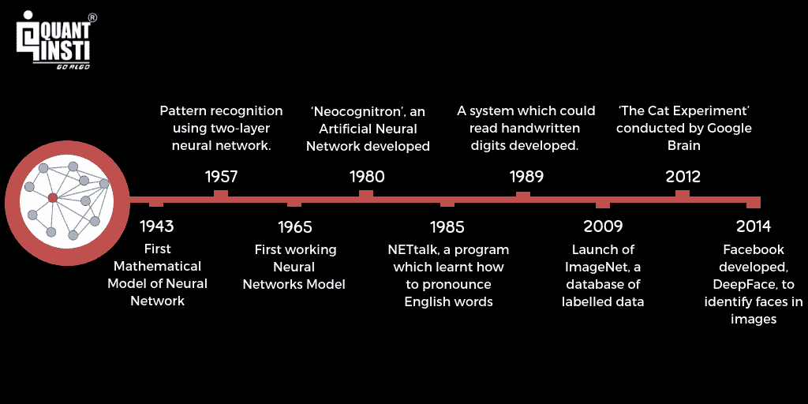
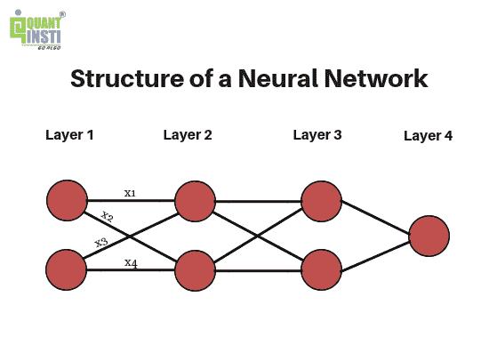
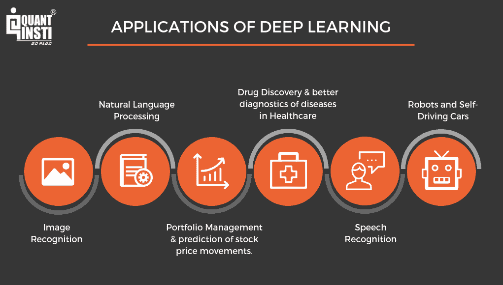

# 深度学习和神经网络简介

> 原文：<https://blog.quantinsti.com/introduction-deep-learning-neural-network/>

作者:[沙古塔·塔西尔达](https://www.linkedin.com/in/shaguftatahsildar/)

“人工智能将是谷歌的终极版本。理解网络上一切的终极搜索引擎。Alphabet 首席执行官拉里·佩奇(Larry Page)在 2000 年表示:“它会准确理解你想要什么，并给你正确的东西。”当时我们大多数人都认为谷歌只是一个简单的搜索引擎。今天，人工智能和深度[神经网络学习](https://quantra.quantinsti.com/course/neural-networks-deep-learning-trading-ernest-chan)正在使几年前甚至难以想象的事情成为可能！

感谢像[机器学习](https://blog.quantinsti.com/machine-learning-basics)和深度学习这样的领域，它们是人工智能的一部分，我们已经能够在机器内自动化和集成“学习”。

在这篇介绍深度学习的文章中，我们将学习什么是深度学习，以及它如何被用于人工智能领域。

本文关于“深度学习与神经网络导论”的内容如下:

*   [什么是深度学习？](#deeplearning)
*   [深度学习的历史](#history)
*   [深度学习和机器学习的区别](#difference)
*   [深度神经网络的工作](#working)
*   [深度学习的应用](#applications)

### **什么是深度学习？**

深度学习是一种涉及使用**人工深度神经网络**的机器学习方法。就像人类的大脑由通过发送和接收信号来处理信息的神经细胞或神经元组成一样，深度[神经网络学习](https://quantra.quantinsti.com/course/neural-networks-deep-learning-trading-ernest-chan)由多层相互通信和处理信息的‘神经元’组成。

深度学习中的‘深’指的是网络内部的层数；层数越多，网络越深。

深度神经网络可以处理**标记的数据**以及**未标记的数据**，这允许监督和非监督学习。然而，需要大量数据来训练深度神经网络，这可能有助于产生更准确的结果。

这些网络还能够识别输出中的错误或损失，并在不需要人工干预的情况下纠正它们。

### **深度学习历史**

除了介绍深度学习和理解它是什么，我们还将了解它是如何开始的。正如我们现在所知，深度学习网络基本上是具有许多层的深度神经网络。

1943 年，**沃尔特·皮茨**和**沃伦·麦卡洛克**创建了第一个神经网络数学模型，展示了人类大脑的思维过程。从这里开始了深度神经网络和深度学习的旅程。

这个旅程可以表示如下:

*   **1957**——弗兰克·罗森布拉特(Frank Rosenblatt)提交了一篇题为《感知器:一种感知和识别自动机》的论文，该论文由一种使用双层神经网络进行模式识别的算法或方法组成。
*   **1965** -阿列克谢·伊瓦赫年科和 V.G .帕拉开发了第一个工作神经网络，阿列克谢·伊瓦赫年科于 1971 年创建了一个 8 层深度神经网络，并在计算机识别系统 Alpha 中进行了演示。这是深度学习的实际介绍。
*   **1980** - Kunihiko Fukushima 开发了“ **Neocognitron** ”，这是一个具有多个卷积层的人工深度神经网络，用于识别视觉模式。
*   **1985**——特里·塞伊诺夫斯基创建了 **NETtalk** ，这是一个学习英语单词发音的程序。
*   **1989**——Yann le Cun，利用**卷积深度神经网络**，开发了一个可以阅读手写数字的系统。
*   **2009** -由于深度学习模型需要大量的标记数据来在监督学习中训练自己，费-李非推出了 **ImageNet** ，这是一个大型的标记图像数据库。
*   **2012**——谷歌大脑进行的“**猫实验**结果出炉。这项实验基于无监督学习，其中深度神经网络与未标记的数据一起工作，以识别猫图像中的模式和特征。然而，它只能正确识别 15%的图像。
*   **2014**——脸书开发了 **DeepFace** ，这是一个深度学习系统，可以识别并标记照片中用户的面部。

### **机器学习和深度学习的区别**

深度学习实际上是机器学习的一个子集，因此这两个术语经常被人们混淆。但是，它们的能力不同。这也是为什么在阅读《深度学习导论》的同时，有必要了解机器学习的原因。

**机器学习模型**缺乏识别错误的机制，在这种情况下，程序员需要介入调整模型，以做出更准确的决策，而**深度学习模型**可以识别不准确的决策，并在没有人工干预的情况下自行纠正模型。

但要做到这一点，深度学习模型需要大量的数据和信息，不像机器学习模型。

### **深度神经网络的工作**

到目前为止，我们已经了解了深度学习的基础和介绍，现在是时候了解深度神经网络如何工作了。

如前所述，深度神经网络得名于网络中的**高层数**。现在让我们通过参考下面给出的图表来理解这些层是什么，以及它们如何在深度神经网络中使用，以给出最终输出:

#### **深层神经网络的层数**

通过查看该图，我们看到在这个深度神经网络中存在 4 层，即第 1 层、第 2 层、第 3 层和第 4 层。每个深度神经网络由三种类型的层组成，它们是:

**输入层(第 1 层):**该层是深度神经网络中的第一层，它提供处理信息所需的输入参数。它只是将这些参数传递给下一层，而不在这一层进行任何计算。

**隐藏层(第 2 层和第 3 层):**深度神经网络中的这些层对从前几层接收的输入执行必要的计算，并将结果传递给下一层。为了提高深度神经网络的效率，决定层的数目和每层中神经元的数目是至关重要的。隐藏层数越多，网络越深。

**输出层(第 4 层):**深度神经网络中的这一层，在接收到前几层的结果后，给我们最终的输出。

现在我们已经了解了网络中存在的层的类型，让我们了解这些层实际上是如何工作的，并给出输出数据。

每个神经元都连接到下一层中的所有神经元，并且所有这些连接都具有与其相关联的一些权重。但是这些砝码是什么，为什么要用？

#### **深度神经网络中的权重**

**权重**顾名思义，就是用来给某个特征附加一些权重。为了获得所需的输出，某些功能可能比其他功能更重要。

例如，在预测第二天的股票价格时，前几天的收盘价和 SMAs 将被视为比高或低价格更重要的特征，这将影响这些参数的权重。

这些权重用于**计算每个神经元的加权和**。x1、x2、x3、x4 表示与深度神经网络中的相应连接相关联的权重。

除了权重，每个隐藏层都有一个与之关联的激活函数。

#### **深度神经网络中的激活函数**

激活函数基于它们的加权和来决定神经元是否应该被激活。这些也用于通过使用像 **sigmoid 和 tanh** 这样的函数来引入非线性，从而允许对更复杂的任务进行计算。如果没有激活函数，深度神经网络将充当简单的[线性回归模型](https://quantra.quantinsti.com/course/trading-with-machine-learning-regression target=)。

以下是一些使用的激活功能的示例:

*   **Tanh:** 避免梯度偏差
*   **整流线性单元(ReLU):** 用于图像处理
*   **Softmax:** 保留离群值的相关性

除此之外，我们还为每一层添加了一个**“偏置”神经元**，以使激活函数能够沿 x 轴向左或向右移动，从而使我们能够更好地拟合激活函数。当输入为绝对零时，作为常数项的偏置项也作为输出。

#### **深度神经网络的处理**

该处理开始于使用从输入层接收的输入来计算第一隐藏层中每个神经元的加权和。加权和是输入与每个连接的相应权重的乘积之和。

对应于每一层的激活函数然后作用于这些加权和，以给出最终输出。这个过程也可以称为[正向传播。](https://blog.quantinsti.com/forward-propagation-neural-networks)

处理完成后，将预测输出与实际输出进行比较，以确定误差或损失。为了使深度神经网络准确工作，必须最小化该损失函数，以使预测输出尽可能接近实际输出。当我们最初为深度神经网络中的连接选择随机权重时，它们可能不是最佳选择。

因此，为了最小化损失函数，我们需要调整权重和偏差以获得准确的结果。[反向传播](https://blog.quantinsti.com/backpropagation)是用于调整权重和偏差的过程，以便我们获得权重和偏差的最佳值，从而使我们的结果更准确。

### **深度学习应用**

这篇关于“深度学习简介”的博客涵盖了深度学习的定义、差异、历史和应用，并帮助我们了解人工深度神经网络是如何工作的。

现在，我们已经熟悉了深度学习的介绍，我们可以继续前进，获取更多关于它的知识。在下面的课程中，你还可以学习如何使用深度学习和神经网络进行 Python 交易。

你可以在 Quantra 上注册[神经网络教程](https://quantra.quantinsti.com/course/neural-networks-deep-learning-trading-ernest-chan)，在这里你可以使用先进的神经网络技术和最新的研究模型，如 LSTM & RNN，来预测市场和寻找交易机会。Keras，使用相关的 python 库。

**推荐阅读**

*   [用于股票价格预测的神经网络的工作](https://blog.quantinsti.com/working-neural-networks-stock-price-prediction)
*   [训练用于股票价格预测的神经网络](https://blog.quantinsti.com/training-neural-networks-for-stock-price-prediction)
*   [Python 中的人工神经网络使用 Keras 预测股价走势](https://blog.quantinsti.com/artificial-neural-network-python-using-keras-predicting-stock-price-movement)
*   [深度学习——使用 Python 中 TensorFlow 的人工神经网络](https://blog.quantinsti.com/deep-learning-artificial-neural-network-tensorflow-python)
*   [RNN、LSTM 和 GRU 进行交易](https://blog.quantinsti.com/rnn-lstm-gru-trading)

*免责声明:本文中提供的所有数据和信息仅供参考。QuantInsti 对本文中任何信息的准确性、完整性、现时性、适用性或有效性不做任何陈述，也不对这些信息中的任何错误、遗漏或延迟或因其显示或使用而导致的任何损失、伤害或损害承担任何责任。所有信息均按原样提供。*