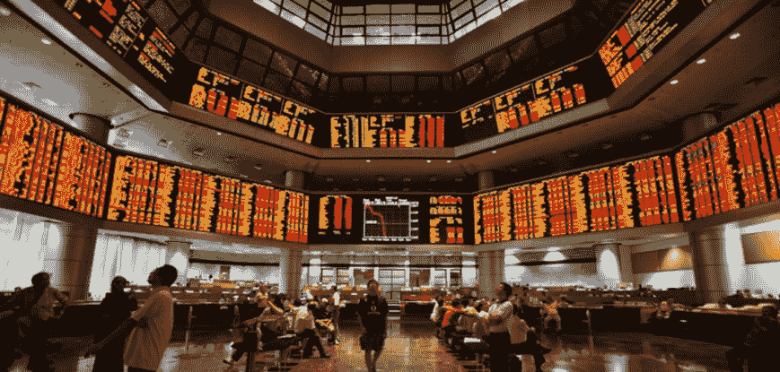

# 交易导论:发展概念框架

> 原文：<https://blog.quantinsti.com/introduction-trading/>

由[高拉夫·雷扎达](http://in.linkedin.com/in/graizada "Gaurav")和  [瓦伦·迪瓦卡尔](https://www.linkedin.com/in/varun-divakar-b862a667/)

当有人想学习如何交易时，他们从哪里开始？他们应该关注哪些市场？他们应该考虑什么样的交易模式？他们应该在交易中承担多大的风险？

以上都是常见的初题，都是错误的初题。

### **交易介绍**

学习交易是如何从概念框架开始的:理解市场如何和为什么运动，以及它们如何和为什么相互关联。

当科学家进行实验时，他们不会把各种各样的东西往墙上扔，看看有什么东西粘在墙上。他们从一个理论开始——对他们的观察的尝试性解释——然后用这个理论来指导假说的产生和检验。心理学家库尔特·勒温曾经说过:“没有什么比一个好的理论更实际的了”。理论组织思想；它帮助我们专注于重要的事情，剔除无关的事情。

大多数交易者也用他们的理论和概念框架操作。从学习研究中衍生出来的精神分析观点和认知行为方法:这些是理解人及其模式的方法。这就是为什么新交易者和经验丰富的老交易者坐在一起学习逻辑、感觉和方法。

很多时候，交易者开始学习市场，试图学习他们可以交易的模式。如果没有观察和理论的科学基础，这些交易者最终会拿自己的钱去冒险，而没有真正理解他们在做什么，以及如何适应他们市场更大的供求关系。难怪这样的交易者很难保持信心和纪律:如果你不明白为什么要做某事，就很难有信心去做。

### **新量化交易者的基本能力**

新的量化交易者在开始职业生涯时往往很难获得公正的指导，因此这种资源非常宝贵。问题的主题从交易机制和交易系统到市场微观结构和交易生涯。

总的来说，我想强调四个关键的学习领域，这是一个人今天开始量化交易生涯时应该具备的:

#### **宏观经济**

你会希望牢牢把握市场间的关系，以及货币政策如何影响利率、货币和经济增长。股票、货币、利率、商品和信贷市场的基础知识在任何发达/发展中市场的交易中都是必不可少的。尤其是现在，市场之间紧密相连，相互关联交易。这些信息可能会也可能不会决定接下来半小时的交易，但是清楚地理解手头的问题对于可视化和建立交易系统是非常重要的。缺乏对宏观经济和市场间关系的理解是许多短线交易者在市场中亏损的主要原因。

#### **一种交易理论**

交易者需要一个框架来思考价格运动，并从市场上稳定的价格变化中找出原因。我不确定交易者是否认同这种或那种理论有很大关系，但是我确定有一个解释框架比没有要好。人们认同各种各样的基础或技术理论。在量化交易中，[市场微观结构](https://blog.quantinsti.com/market-microstructure/)理论、双向拍卖市场、行为金融学、交易心理学、交易模式、市场概况、相对估值等。单独使用或与其他理论结合使用。

#### **观察**

毫无疑问，在学习如何交易时，我做过的最聪明的事情就是在交易前长时间观察市场。我收集日内走势图，甚至是分笔交易图，每天寻找最佳交易机会。随着时间的推移，我开始在这些机会中看到重复的模式，这对我后来的交易很重要。不仅要观察价格，还要观察交易量、行业行为、市场间的行为，以及像分笔成交点这样的指标，这有助于你认识突破、反转和趋势的动态。

#### **编码的最优性**

当有其他系统在寻找类似的机会时，平台和策略的编码方式也很重要。尤其是在利润可以用几个分笔成交点来衡量的情况下，将订单发送到市场的时间和速度至关重要。代码应该能够处理任何类型的市场环境，并处理高风险事件。根据我今天所知道的，如果我开始做交易者或者给新手做建议，我会建议在把钱投入风险之前至少花半年的时间学习、观察和练习纸上交易。我坚信新交易者不成功的一个主要原因是他们没有投入必要的时间去学习市场和获得急需的技能。

#### **机器学习**

机器学习已经成为量化分析师应该具备的技能清单中的重要部分。交易中使用的大多数策略，无论是技术策略、数量策略还是基本面策略，都可以被自动化和优化。为了优化代码，你需要对你正在编码的语言有很强的理解，为了优化策略，你需要对策略的特征和适合于手头问题的必要的机器学习模型有很强的理解。市场上有很好的机器学习算法，能够让[使用 Twitter feeds 或其他类似的新闻 feed 来理解市场情绪](https://blog.quantinsti.com/applicability-sentiment-analysis-trading-works/)。作为交易者，结合这样的算法会给你比其他交易者更大的优势。

#### **Python/R/C++**

学哪种语言？这可能是一个困扰每个量化交易初学者的问题。如果你知道一种特定的语言在哪里使用，那么你就能明白哪种语言更适合你的需要。

C++ 广泛用于那些执行时间是最重要参数的策略中。例如，在 HFT(高频交易),交易不到一秒钟就能完成，你选择的语言可以决定你策略的成败。在这种情况下，C++是最好的选择。

[Python](https://blog.quantinsti.com/python-trading/) 或 R 在分析和金融领域有着广泛的用途。它们在算法交易中被广泛使用，世界上几乎每个主要的经纪人都有至少支持其中一种的 API。这两者都没有什么可选择的，它们都提供相似的特性和库，并且都是开源的。[在金融领域，R 是一门成熟的语言](https://blog.quantinsti.com/shorting-high-algo-trading-strategy-r/)，而 Python 是一门相对较新的语言。但是 Python 的流行和使用一直呈指数级增长。

### **下一步:**

我们给你带来了一个基于期权的交易策略，你可以在 Python 编程的帮助下计算收益图。[点击此处](https://blog.quantinsti.com/iron-condor-options-trading-strategy/)访问 Iron Condor 期权交易策略，该策略结合了看涨看跌期权交易策略和看跌期权交易策略。这是交易者可以使用的最简单的策略之一，即使账户很小，也能让时间衰减对你有利。

*免责声明:本文提供的所有数据和信息仅供参考。QuantInsti 对本文中任何信息的准确性、完整性、现时性、适用性或有效性不做任何陈述，也不对这些信息中的任何错误、遗漏或延迟或因其显示或使用而导致的任何损失、伤害或损害承担任何责任。所有信息均按原样提供。T3】*