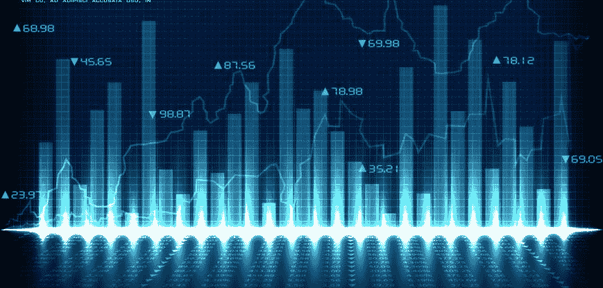
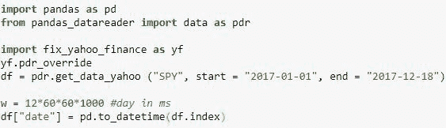
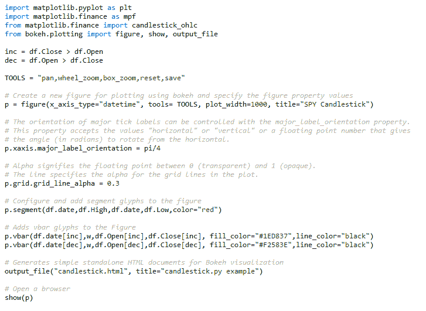
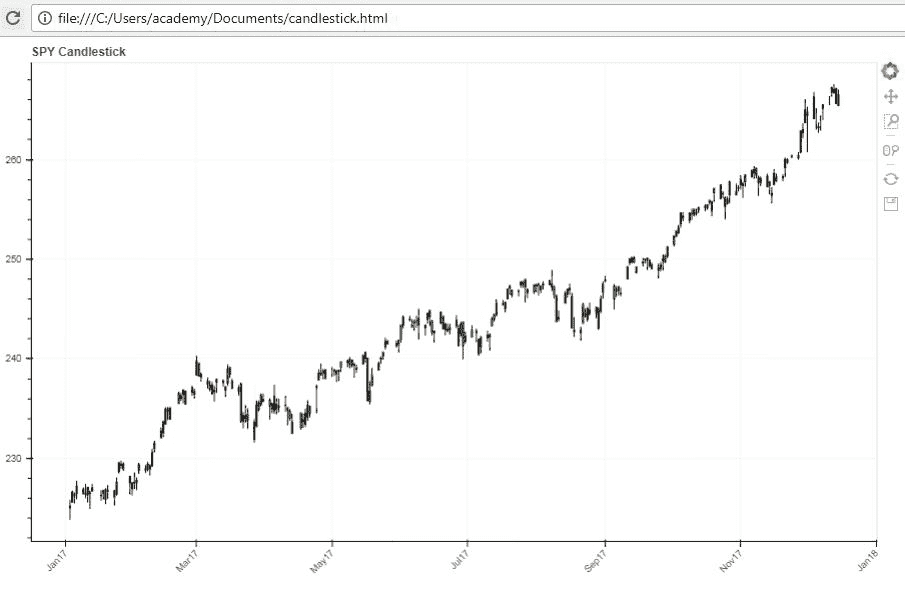
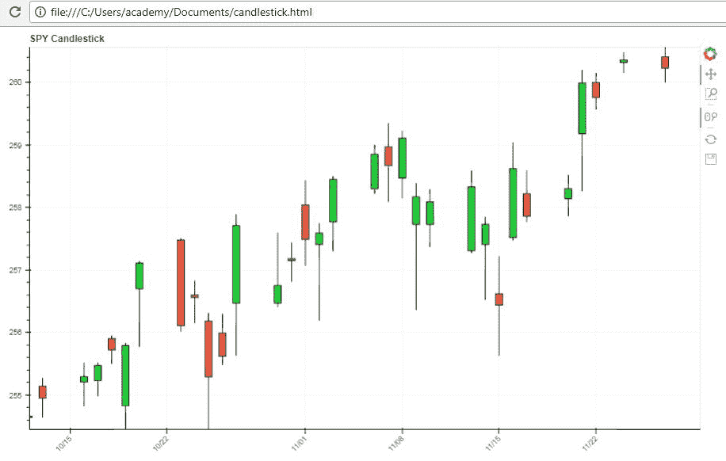
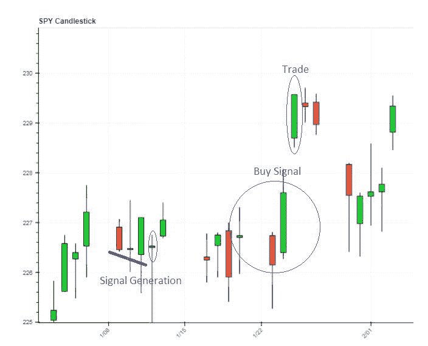
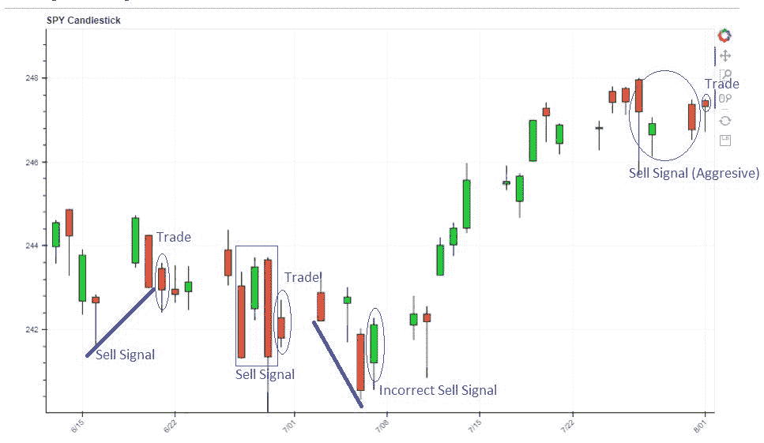

# 日本烛台交易策略

> 原文：<https://blog.quantinsti.com/japanese-candlestick-trading-strategy/>

由杰伊·马尼尔

### **关于日本烛台交易**

据说日本人在 17 世纪用技术分析来交易大米。据说，一个来自坂田的名叫 Munehisa Homma 的大米交易商发明了这种绘制蜡烛图的技术来分析市场上大米的每日现货价格。根据现代烛台制图之父史蒂夫·尼森的说法，使用烛台的正当交易始于 19 世纪 50 年代。你可以参考这篇博客[烛台图案的意义及其解剖](/candlestick-patterns-meaning/)来了解烛台的基本概念。

在这篇博客中，我们的目标如下:

1.  对**剧情**烛台使用 **Python**
2.  使用**“三根日线蜡烛”**理解烛台交易策略

#### **使用 Python 绘制烛台**

我们将从雅虎数据库中获取任何相关的每日财务数据，并用它来绘制我们的烛台。在本例中，我们将绘制日常“间谍”烛台。您可以更改股票代码，如:“谷歌”、“APPL”、“MFST”等。绘制你自己的蜡烛图。

对于数据可视化，我们一般使用' matplotlib.pyplot '库。Matplotlib 还提供一小部分特殊融资地块，如烛台。这种类型的绘图可在“matplotlib.finance”子库中找到。

我们将进一步使用通过使用“bokeh.plotting”接口创建的[散景](/python-data-visualization-using-bokeh/)图，该接口带有一组默认工具和默认视觉样式。Bokeh 使用 Python 交互式可视化库，面向现代 web 浏览器进行演示。

上述代码的输出如下:

我们提供的工具将帮助您使用方框缩放和滚轮缩放来“平移”图表和“放大”或缩小。还有一个重置按钮来显示实际输出，保存按钮将帮助您下载在浏览器中显示的图像(即使是缩放的图像)。

#### 

#### **理解使用“三根日线蜡烛”的烛台交易策略**

让我们看看一个简单的每日交易策略，我们将查看过去三天的蜡烛线，并预测我们是否会在第四天做多或做空。我们将在第四天结束前平仓并记录盈利/亏损，

**【做多】**或**第四天买入的交易规则:**

规则 1:不管蜡烛的颜色如何，最近的蜡烛体必须比前两根蜡烛体大。

规则 2:第二根日线蜡烛必须是红色的。

规则 3:最近一根蜡烛线的收盘价必须比第二根日线的收盘价高。

规则 4:你将在第四天早上交易开始时买入，在收市前卖出。

在**第四天**进行**【做空】**或卖出的交易规则

规则 1:不管蜡烛的颜色如何，最近的蜡烛的主体必须大于前两根蜡烛的主体。

规则 2:第二根日线蜡烛必须是绿色的。

规则 3:最近一根蜡烛线的收盘价必须小于第二根日线的收盘价。

规则 4:你将在第四天早上交易开始时“卖出”，在收市前“买入”。

如果“收盘”太近，你可以通过在某些地方不遵循规则 3 来放松“买入”和“卖出”信号，但更保守的方法是遵循所有三个步骤。

如果你自己绘制一张蜡烛图，并试图找到你正在考虑的资产的“买入”和“卖出”信号，那将会很有趣。

此外，有各种各样的烛台模式，你会在网上找到。你也可以参考这个博客[烛台交易——一个动量策略和例子【EXCEL 模型】](/candlestick-trading-a-momentum-strategy-with-example-excel-model/ "Permalink to Candlestick Trading – A Momentum Strategy with Example [EXCEL MODEL]")，了解[动量策略](https://quantra.quantinsti.com/course/momentum-trading-strategies)，你观察前 n 个烛台上的价格，并据此下注。一个有趣的练习是试图在你绘制的蜡烛图中找到它们。

除此之外，你可以查看我们博客上关于不同[量化交易策略](https://quantra.quantinsti.com/course/quantitative-trading-strategies-models)的文章。

但是在我结束之前，我想特别感谢 Abhishek Kulkarni 先生帮助我完成烛台绘图代码。

所以祝你好运，享受你的烛台图表。

### **下一步**

如果你对探索算法交易策略感兴趣，那么请查看我们的[EPAT](https://www.quantinsti.com/epat/)项目。它涵盖了算法&量化交易、金融计算、技术、统计和计量经济学等培训模块。EPAT 让你具备成为成功的算法交易者所需的技能。[现在报名](https://www.quantinsti.com/epat/)！

**更新**

我们注意到一些用户在从雅虎和谷歌金融平台下载市场数据时面临挑战。如果你正在寻找市场数据的替代来源，你可以使用 [Quandl](https://www.quandl.com/) 来获得同样的信息。

### **下载数据文件**

*   Python 中的日本烛台交易策略