# 朱莉娅简介

> 原文：<https://blog.quantinsti.com/julia-programming/>

安舒尔·塔亚尔

本文介绍了专门为科学计算设计的 Julia 编程语言，它解决了“双语言问题”，即它提供了与 C 相当的性能以及 Python 和 r 的动态特性。

这一系列的文章将带你开始 Julia 编程的旅程，到[回溯测试](/backtesting/)并在其中实现实时交易策略。

这是本系列的第一篇文章，包含以下几个部分

*   [朱莉娅是什么？](#what-is-julia)
*   为什么我们需要另一种编程语言？
*   [Julia 比 Python 快还是比 R 快？](#is-julia-faster-than-python-or-r "Is Julia faster than Python or R?")
*   [如何安装 Julia？](#how-to-install-julia "How to install Julia?")
*   [如何在 Jupyter 笔记本中运行 Julia？](#how-to-run-julia-in-a-jupyter-notebook "How to run Julia in a Jupyter notebook?")
*   [如何在 Julia 中安装包？](#how-to-install-packages-in-julia "How to install packages in Julia?")
*   [Julia 中的基本包](#basic-packages-in-Julia "Basic packages in Julia")
*   [Julia 算法交易包](#julia-packages-for-algorithmic-trading "Julia packages for Algorithmic Trading")

* * *

## ****茱莉亚是什么？**T3】**

Julia 是一种专门为高效数值计算设计的高性能编程语言。它旨在提供高计算速度和易于编写的编程语言。

Julia 项目始于 2009 年，并于 2012 年通过一篇[博客文章](https://julialang.org/blog/2012/02/why-we-created-julia/)作为开源语言(在麻省理工学院许可下)发布。2018 年发布了 Julia 1.0。随着科学界意识到其潜力，Julia 的用户群已经广泛增长。截至 2021 年 7 月，朱莉娅拥有 203，400+ GitHub 明星，提供 6000+注册包，下载量超过 2900 万次。

* * *

## ****为什么我们需要另一种编程语言？**T3】**

科学界一直面临着编程的高性能和动态性之间的权衡。像 Matlab、R 或 Python 这样的编程语言在科学界被广泛使用。

然而，当涉及到解决需要极高计算能力的挑战时，代码必须用 C 或 Fortran 等语言重新编写才能实现这一目标。这就是所谓的“双语问题”。

Julia 声称通过结合两个世界的优点来解决这一挑战，即速度和易于编写的语言。

* * *

## ****Julia 比 Python 快还是比 R 快？**T3】**

让我们来看一些基准测试。

### 计算时间

下图显示了各种语言在不同操作上的计算时间(图例中提到)。纵轴显示了针对 C 实现标准化的每个基准时间。

正如我们所见，Julia 在大多数操作中最接近 C，在某些情况下落后于 LuaJIT 和 Rust。它比 Python 或 r 要快得多。关于这个基准测试的更多细节可以在[这里](https://julialang.org/benchmarks/)找到。

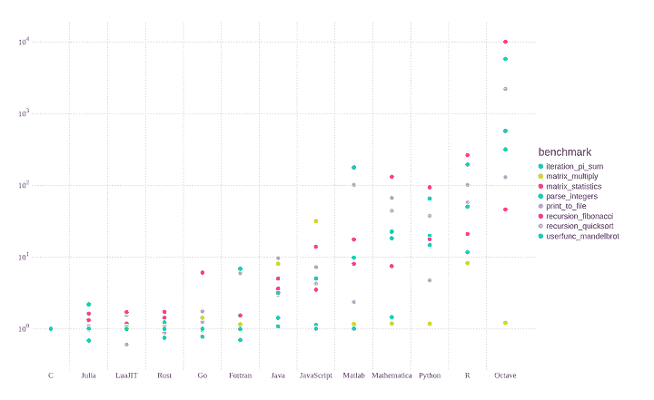

Source: [https://julialang.org/benchmarks/](https://julialang.org/benchmarks/)

### 大型数据集上的多重操作

下图比较了各种包中的`groupby`函数的任务。下图中的“查询 1”是执行的测试之一，DF.jl(一个 Julia 包)被证明是最快的。还有许多其他的查询在[这里执行](https://h2oai.github.io/db-benchmark/)。

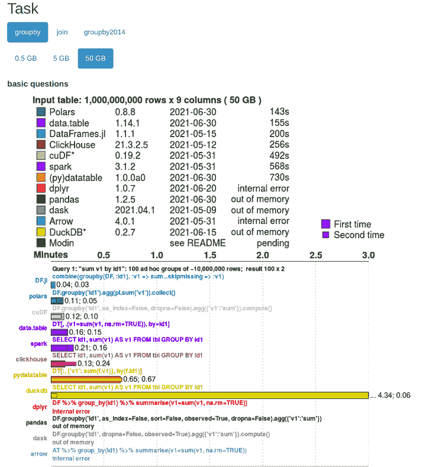

Source: [https://h2oai.github.io/db-benchmark/](https://h2oai.github.io/db-benchmark/)

对于查询 1:“sum v1 by Id1”:100 组大约 10，000，000 行，Python (pandas 包)和 R (dplyr 包)分别导致内部错误和内存不足错误，而 Julia 第一次用了 2.4 秒，第二次用了 1.8 秒。

* * *

## ****如何安装 Julia？**T3】**

让我们开始安装吧。以下是安装 Julia 的步骤:

### 第一步

从[这里](https://julialang.org/downloads/)下载当前稳定版的 Julia。

### 第二步

提取文件并使用以下命令设置 Julia:

**在 Linux 上安装 Julia:**

*   tar -xvzf "下载文件名称"

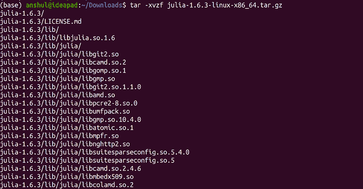

Installing Julia on Linux

*   sudo cp -r julia-1.6.3 /opt/
*   sudo ln-s/opt/Julia-1 . 6 . 3/bin/Julia/usr/local/bin/Julia
*   打开终端，键入“julia”:

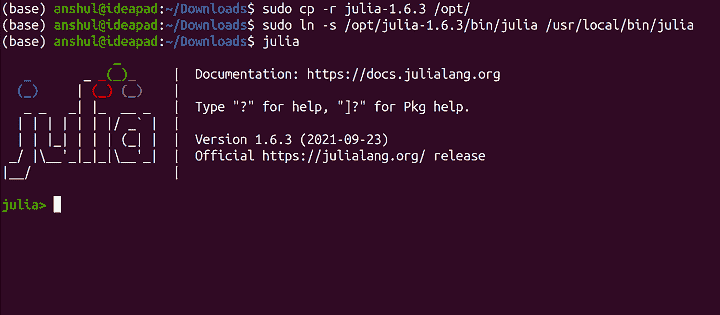

Installing Julia on Linux

**在 Mac 上安装 Julia:**

*   运行下载的。dmg 文件
*   将 Julia 文件移动到应用程序文件夹
*   点击朱莉娅图标。

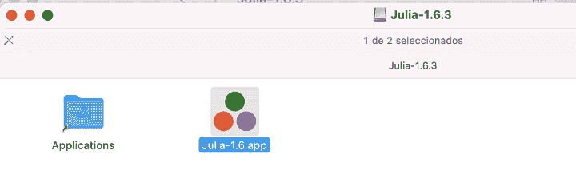

Installing Julia on Mac

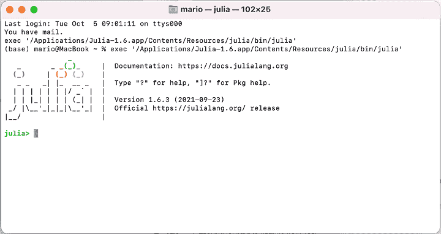

Installing Julia on Mac

**在 Windows 上安装 Julia:**

*   运行下载的。exe 文件
*   选择安装目录

Installing Julia on Windows

选中“将 Julia 添加到路径”复选框

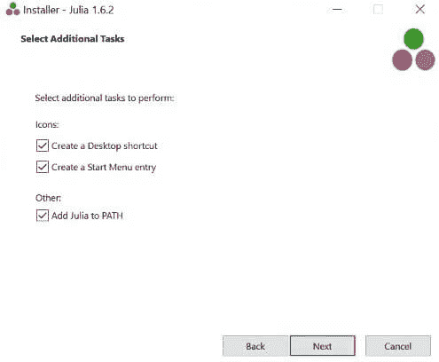

Add Julia to path Windows

选中“运行朱莉娅”复选框

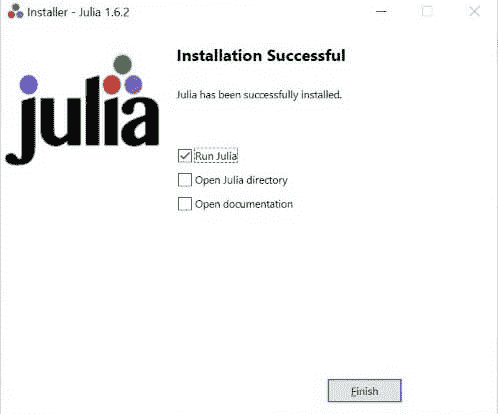

Run Julia on Windows

现在，一个 Julia 窗口已经打开，您可以在 Julia 中编写代码了！

* * *

## ****如何在 Jupyter 笔记本中运行 Julia？**T3】**

要在 Jupyter 笔记本中运行 Julia，您必须添加一个提供该功能的包“IJulia”。在 Julia 终端中，键入:

1.  使用 Pkg
2.  Pkg.add("IJulia ")

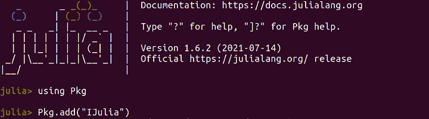

Run Julia in Jupyter Notebook

Julia 现已添加到您的 Jupyter 笔记本中。

1.  在 anaconda 终端上输入“jupyter-notebook ”,打开 Jupyter 笔记本。
2.  在右上角，点击“新建”。
3.  从下拉菜单中选择“Julia 1.6.3”。
4.  您现在已经准备好使用 Jupyter Notebook 在 Julia 中编写代码了！

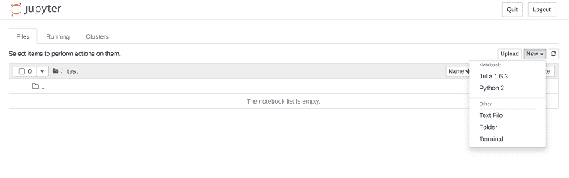

Code Julia using Jupyter Notebook

* * *

## 如何在 Julia 中安装包？

开始使用任何编程语言的第一步是安装用于不同目的的各种包。

要在 Julia 中添加任何包，请遵循以下步骤:

1.  使用 Pkg
2.  Pkg.add("包名")
3.  使用“包名”

如果你熟悉 Python，Julia 中的“using”关键字相当于 Python 中的“import”，Python 中的“pip install package-name”相当于“Pkg.add("package-name ")”。“Pkg”是 Julia 中的包管理器。

比如——下面截图是添加包“CSV.jl”的例子，用来读”。csv”文件。

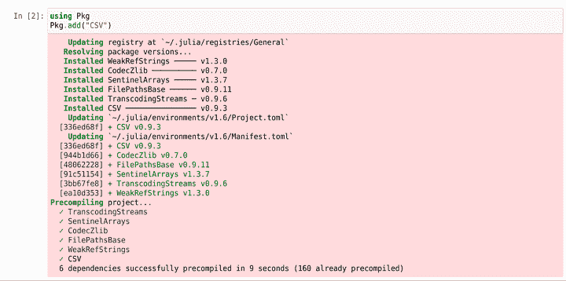

Adding Package in Julia

* * *

## ****基本包在茱莉亚**T3 里**

前面提到过，Julia 里有 **6000+注册包**。

以下是一些帮助您开始最常见操作的软件包:

1.  **CSV.jl** 用于读取。csv 文件，
2.  **XLSX.jl** 可用于读取 excel 表格，
3.  **JLD.jl** 用于保存和加载 Julia 变量，
4.  **DataFrames.jl** 用于管理数据帧。
5.  **Plots.jl** 用于生成图。
6.  **Images.jl** 用于图像处理、
7.  **RCall.jl** 和 **PyCall.jl** 用于在 Julia 中使用 R 和 Python 代码。

对于更具体的应用，使用这些包:

*   **Mocha.jl** 用于训练神经网络，
*   **Tensorflow.jl** 和 **ScikitLearn.jl** 对于 ML 车型
*   **微分方程. jl** 解微分方程。

这些包裹将是你朱莉娅旅程的一个良好起点。还有很多更有用的包，我们稍后会谈到。

* * *

## ****茱莉亚包进行算法交易****

算法交易是在某些情况下需要密集计算能力的领域的一个例子。在这样一个领域，使用易于编写的编程语言更快地处理数据可以为交易者和投资者增加很多价值。

它还可以为那些希望开始并更积极参与的非专业程序员打开空间。

Julia 拥有各种可用于量化金融的注册软件包，例如:

1.  **MarketTechnicals.jl** -用于[金融时间序列](https://quantra.quantinsti.com/course/financial-time-series-analysis-trading)的技术分析。
2.  **financial derivatives . JL**-用于金融衍生品建模和定价
3.  目标是提供一个用 C++编写的 Julia 版本的 QuantLib。
4.  **QuantEcon.jl** -用于数量经济学
5.  **Jib.jl** -交互式代理 API 的 Julia 实现
6.  用 Julia 编写的高度优化的工作日计算器
7.  **Quandl.jl** -用于来自 Quandl 的数据
8.  YStockData.jl -来自雅虎财经的数据
9.  **TradingLogic.jl** -用于回溯测试和实时交易

由于 Julia 仍然是一门新兴语言，所以其中一些软件包不是很稳定。它们应该让我们了解定量金融中这种语言的可能性和热情。

* * *

**参考书目**

1.  [https://julialang.org/](https://julialang.org/)
2.  [https://julialang.org/downloads/](https://julialang.org/downloads/)
3.  [https://juliacomputing.com/](https://juliacomputing.com/)

* * *

## ****结论****

本文介绍了 Julia 编程语言。我们研究了创建 Julia 背后的想法，如何设置它，以及其中一些可用包的想法。这篇文章提供了 Julia 入门的动力。

我们生活在技术革命的时代；我们需要跟上技术进步；我们需要适应，就像我们周围的其他事物一样，为了生存并发挥出我们最好的一面。

正如玛丽·居里曾经说过的:

> ****“人生没有什么可怕的；它只是被理解。现在是时候了解更多，这样我们就可以少一些恐惧。”**T3】**

所以，我们来了解一下！

本系列的后续文章将深入探讨基本操作和语法、数据操作、可视化、分析等等。敬请期待！

如果你是一名交易员、程序员、学生或希望从事算法交易的人，那么我们全面的为期 6 个月的算法交易(EPAT)执行课程(T1)正是你所需要的，该课程由行业专家、交易从业者和坚定的支持者教授，如 E. P. Chan 博士、Euan Sinclair 博士等。

* * *

*<small>免责声明:本文提供的所有数据和信息仅供参考。QuantInsti 对本文中任何信息的准确性、完整性、现时性、适用性或有效性不做任何陈述，也不对这些信息中的任何错误、遗漏或延迟或因其显示或使用而导致的任何损失、伤害或损害负责。所有信息均按原样提供。</small>*