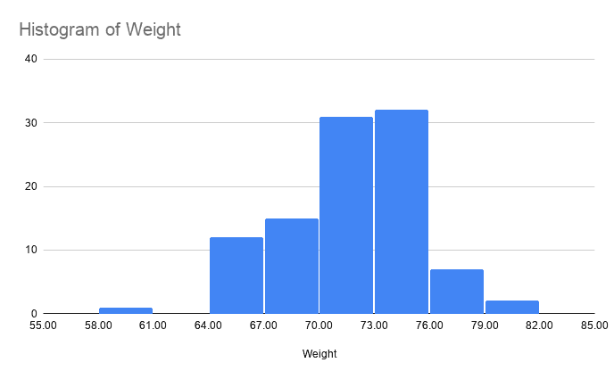
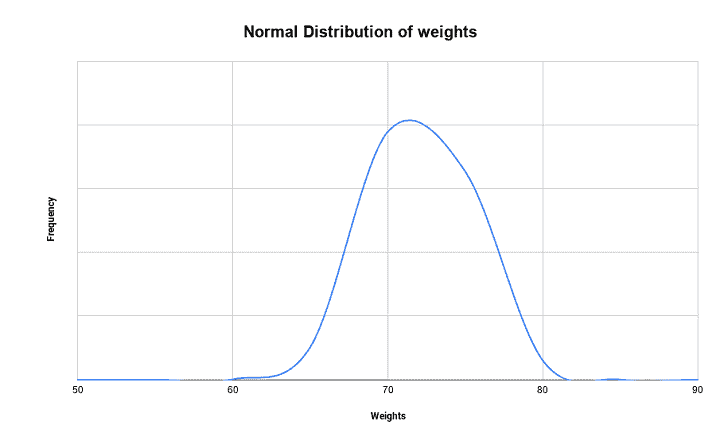
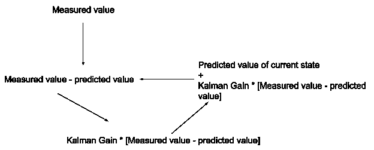
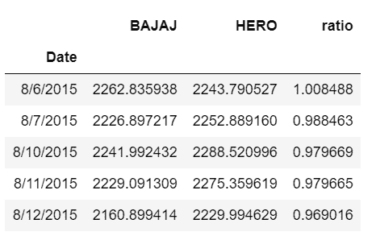
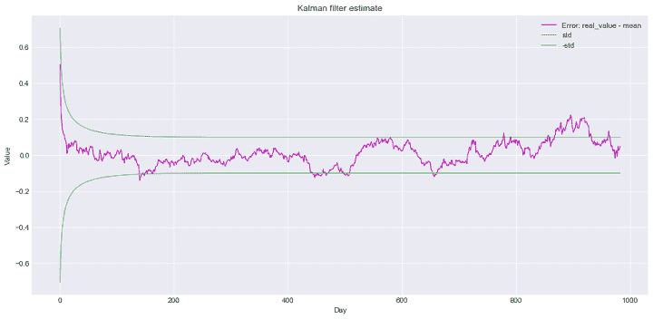

# 卡尔曼滤波 Python:教程和策略

> 原文：<https://blog.quantinsti.com/kalman-filter/>

以[重香重香](https://www.linkedin.com/in/rekhit/)

如果我们必须用一行来解释卡尔曼滤波器，我们会说它是用来提供一个不能直接测量的变量的精确预测。事实上，卡尔曼滤波器最早的用途之一是由美国宇航局计算阿波罗宇宙火箭的位置，以确保它在正确的轨道上。

*但是卡尔曼滤波器如何在交易中适用呢？*

那么，我们可以利用卡尔曼滤波器实现[对交易](/implementing-pairs-trading-using-kalman-filter/)，甚至在[期货市场](/kalman-filter-techniques-statistical-arbitrage-china-futures-market-python/)寻找套利机会。但在我们开始应用卡尔曼滤波器之前，让我们了解一下如何使用它。

因此，在这篇博客中，我们涵盖了以下主题:

*   [卡尔曼滤波器中使用的统计术语和概念](#statistical-terms-and-concepts-used-in-kalman-filter)
*   [卡尔曼滤波方程](#kalman-filter-equations)
    *   [状态更新方程式](#status-update-equation)
    *   [状态外推方程](#state-extrapolation-equation)
    *   [卡尔曼增益方程](#kalman-gain-equation)
    *   [估计不确定性更新](#estimate-uncertainty-update)
    *   [估计不确定性外推](#Estimate-uncertainty-extrapolation)
*   [Python 中使用卡尔曼滤波器的成对交易](#pairs-trading-using-kalman-filter-in-python)
    *   [配对交易策略](#pairs-trading-strategy)

* * *

因此，当涉及到数学和统计学的使用时，卡尔曼滤波器可以被认为是一个沉重的话题。因此，在深入研究这些方程之前，我们将讨论几个术语。如果你愿意的话，可以跳过这一节，直接看方程。

* * *

## 卡尔曼滤波器中使用的统计术语和概念

卡尔曼滤波器在其方程中使用了正态分布的概念，让我们了解估计的准确性。让我们退一步，理解我们如何得到一个变量的正态分布。

让我们假设我们有一个十人的足球队正在打全国赛。作为标准健康检查的一部分，我们测量他们的体重。下面给出了球员的权重。

| 玩家编号 | one | Two | three | four | five | six | seven | eight | nine | Ten |
| 重量 | seventy-two | Seventy-five | Seventy-six | sixty-nine | Sixty-five | Seventy-one | Seventy | Seventy-four | Seventy-six | seventy-two |

现在，如果我们计算平均体重，即**的平均值**，我们得到的值是(所有玩家体重的总和)/(玩家总数)

= 720/10 = 72

平均值通常用希腊字母μ表示。如果我们把权重分别考虑为 w 1 ，w 2 ，玩家总数为 N，那么可以写成:μ=(w1+w2+w3+w4+.....+ w n )/N

或者

$$ \mu = \frac{1}{N}\sum_{i=1}^n W_i$$

现在，凭直觉，我们决定看看每个玩家的体重与平均值相差多少。这可以很容易地通过从平均值中减去个体的体重来计算。

现在，一队球员的体重以如下方式变化，(单个球员的体重)-(平均值)= 72 - 72 = 0。

类似地，第二个玩家的体重变化如下:75 - 72 = 3。

让我们现在更新表格。

| 玩家编号 | one | Two | three | four | five | six | seven | eight | nine | Ten |
| 重量 | seventy-two | Seventy-five | Seventy-six | sixty-nine | Sixty-five | Seventy-one | Seventy | Seventy-four | Seventy-six | seventy-two |
| 平均值之差 | Zero | three | four | -3 | -7 | -1 | -2 | Two | four | Zero |

现在，我们想看看整个团队的权重与平均值相差多少。整个团队的体重与平均值之差的简单相加将为 0，如下所示。

因此，我们计算每个人的体重差的平方，并找出平均值。平方是为了消除分数的负号+惩罚与平均值的较大偏离。

更新后的表格如下:

| 玩家编号 | one | Two | three | four | five | six | seven | eight | nine | Ten |
| 重量 | seventy-two | Seventy-five | Seventy-six | sixty-nine | Sixty-five | Seventy-one | Seventy | Seventy-four | Seventy-six | seventy-two |
| 平均值之差 | Zero | three | four | -3 | -7 | -1 | -2 | Two | four | Zero |
| 平均值的平方差 | Zero | nine | Sixteen | nine | forty-nine | one | four | four | Sixteen | Zero |

如果我们取平均值，我们得到的等式是，

$$ \frac{1}{N}\sum_{i=1}^n {(W_i-\mu)}^2=10.8$$

**方差**告诉我们权重被分散了多少。因为方差是平方的平均值，所以我们取方差的平方根，以便更好地了解权重的分布。我们称这一项为**标准差**，用σ表示。

$$ \text{Thus, } \sigma=\sqrt{\frac{1}{N}\sum_{i=1}^n {(W_i-\mu)}^2}=\sqrt{10.8}=3.46$$

由于标准差用σ表示，所以方差用σ 2 表示。T3】

但是我们为什么需要标准差呢？当我们计算一个足球队的方差和标准差时，也许我们可以找到锦标赛中所有足球队的方差和标准差，或者如果我们更雄心勃勃，我们可以对世界上所有足球队进行同样的计算。这将是一个很大的数据集。

需要理解的一点是，对于一个小的数据集，我们使用了所有的值，即整个群体来计算这些值。但是，如果它是一个大型数据集，我们通常会从整个人口中随机抽取一个样本，并找到估计值。

在这种情况下，我们用(N-1)代替 N，根据[贝塞尔修正](https://en.wikipedia.org/wiki/Bessel%27s_correction)得到最准确的答案。当然，这引入了一些误差，但是我们现在忽略它。

因此，更新后的等式为:

$$ \sigma=\sqrt{\frac{1}{N-1}\sum_{i=1}^n {(W_i-\mu)}^2}$$

现在，查看过去进行的不同研究，发现给定一个大型数据集，大多数数据都集中在平均值附近，整个数据变量的 68%都在平均值的一个标准偏差内。

这意味着，如果我们有数百万名足球运动员的数据，并且我们得到了与现在相同的标准差和方差，我们可以说球员体重从 72 公斤变为+-3.46 的概率是 68.26%。这意味着 68.26%的运动员体重会在 68.53 公斤到 75.46 公斤之间。

当然，为了证明这一点，数据应该是随机的。

让我们画一个图表来进一步理解这一点。这只是一个参考，如果我们有 100 个人的体重，平均值为 72，标准差为 3.46，分布会是什么样子。

这显示了权重是如何集中在平均值附近并向极端值逐渐减少的。如果我们创建一条曲线，你会发现它的形状像一个钟，因此我们称它为**钟形曲线**。平均值为 72、标准差为 3.46 的权重的[正态分布](https://quantra.quantinsti.com/glossary/Standard-Normal-Distribution)将类似于下图。

正态分布也称为概率密度函数。虽然推导过程相当漫长，但我们对概率密度函数有一定的观察。

一个标准差包含总体的 **68.26** %。

两个标准差包含 95.44%的人口，而三个标准差包含 99.74%。

概率密度函数给出如下，

$$ f(w, μ, \sigma^2) =\frac{e^{\frac{-(w-μ)}{2σ^2}}}{\sqrt{2 兀\sigma^2}} $$

你可以在这个[博客](/statistics-probability-distribution/)中找到更多关于概率密度函数的信息。我们讨论正态分布的原因是，它是卡尔曼滤波器的重要组成部分。现在让我们进入卡尔曼滤波器教程下一节的主题。

* * *

## 卡尔曼滤波方程

卡尔曼滤波是一种预测算法。因此，卡尔曼滤波器的成功取决于我们的估计值及其与实际值的差异。在卡尔曼滤波器中，我们假设根据前一个状态，我们可以预测下一个状态。

首先，我们想澄清一下，这个卡尔曼滤波器教程不是关于方程的推导，而是试图解释方程如何帮助我们估计或预测一个值。

现在，正如我们前面所说的，我们试图预测一些不能直接测量的东西的价值。因此，预测值和实际值之间显然会有一些误差。

如果系统本身包含一些误差，那么它被称为测量噪声。例如，如果体重秤本身显示同一名足球运动员的不同读数，这将是测量噪声。

如果进行测量的过程中存在某些未被考虑的因素，则称之为过程噪声。

例如，如果我们正在预测阿波罗火箭的位置，并且我们不能在初始发射阶段考虑风，那么我们将在实际位置和预测位置之间遇到一些误差。

卡尔曼滤波器用于减少这些误差，并成功地预测下一个状态。

现在，假设我们挑出一个球员，称他 10 次体重，由于一些测量误差，我们可能会得到不同的值。

Rudolf Kalman 先生建立了状态更新方程，考虑了三个值，即

*   真值
*   估计值或预测值
*   测量值

* * *

### 状态更新方程

**状态更新等式**如下:

当前状态估计值

=当前状态的预测值+卡尔曼增益*(测量值-状态的预测值)

让我们进一步理解这个等式。

在我们的例子中，我们可以说，给定所有十次测量的测量值，我们将取这些值的平均值来估计真实值。

为了求解这个方程，我们取一个测量值作为测量值。在初始步骤中，我们猜测预测值。

现在，由于计算了平均值，在本例中，随着每次连续迭代，卡尔曼增益将为(1/N ),等式的第二部分将减小，从而给出更好的估计值。

我们应该注意，当前的估计值在下一次迭代中成为当前状态的预测值。

现在，我们知道实际重量是不变的，因此很容易预测估计值。但是如果我们不得不考虑系统的状态(在这种情况下是重量)的变化呢？

为此，我们现在将进入卡尔曼滤波器教程中的下一个方程，即状态外推。

* * *

### 状态外推方程

状态外推系统帮助我们找到当前状态和下一个状态之间的关系，即预测系统的下一个状态。

到目前为止，我们知道卡尔曼滤波器本质上是**递归**的，并使用系统中的前一个值来预测下一个值。虽然我们可以很容易地给出公式并使用它，但我们想知道为什么要使用它。在这方面，我们将举另一个例子来说明状态外推方程。

现在，让我们以一家试图开发机器人自行车的公司为例。如果你想一想，当有人骑自行车时，他们必须平衡自行车，控制油门，转弯等。

假设我们有一条直路，我们必须控制自行车的速度。为此，我们必须知道自行车的位置。作为一个简单的例子，我们测量车轮的旋转来预测自行车移动了多少。我们记得，物体走过的距离等于物体的速度乘以走过的时间。

现在，假设我们测量某一时刻的旋转，即δt。

如果我们说自行车有一个恒定的速度 v，那么我们可以这样说:

自行车的预测位置等于自行车的当前估计位置+自行车在时间δt 内行驶的距离

这里自行车经过的距离将是δt 乘以自行车速度的结果。

假设速度保持恒定在 2 m/s，时间δt 为 5 秒。这意味着自行车在每次连续测量之间移动 10 米。

但是如果我们下次检查时发现自行车移动了 12 米呢？这给了我们 2 米的误差。这可能意味着两件事，

1.  用来测量速度的装置有误差(测量误差)
2.  自行车以不同的速度移动，在这种情况下，可能是下坡(过程错误)

我们试图找出如何通过将不同的增益应用于状态更新方程来最小化该误差。

现在，我们将在卡尔曼滤波器教程中引入一个新概念，即 **α - β滤波器**。

现在，如果我们回忆一下状态更新等式，它被给出为:

当前状态估计值

=当前状态的预测值+卡尔曼增益*(测量值-状态的预测值)

我们将说α用于减少测量中的误差，因此它将用于预测物体的位置值。

现在，如果我们用α代替卡尔曼增益，您可以推断出α值越高，测量值越重要，α值越低，测量值的权重越小。这样就可以在预测位置的同时减少误差。

现在，如果我们假设自行车以不同的速度运动，我们将不得不使用另一个方程来计算速度，这反过来将导致对自行车位置的更好预测。这里我们用β代替卡尔曼增益来估计自行车的速度。

我们试图了解α和β如何影响预测值的关系。但是，我们如何确切地知道α和β的正确值，才能使预测值更接近实际值呢？

让我们进入卡尔曼滤波器教程中的下一个方程，即卡尔曼增益方程。

* * *

### 卡尔曼增益方程

回想一下，我们在这篇博客的开始部分谈到过**正态分布**。现在，我们可以说，无论是测量误差还是过程误差，都是随机的，并且在本质上是正态分布的。事实上，更进一步来看，估计值与实际值之间的标准差更大。

卡尔曼增益是一个术语，指的是估计误差的不确定性。简单地说，我们将ρ表示为估计的不确定性。

由于我们使用σ作为标准偏差，我们将由于不确定性导致的测量值σ 2 的方差表示为⋎.

Thus, we can write the Kalman Gain as, $$\frac{\text{(Uncertainty in estimate)}}{\text{(Uncertainty in estimate + Uncertainty in measurement)}}$$

在卡尔曼滤波器中，**卡尔曼增益**可用于根据估计值改变估计值。

由于我们看到了卡尔曼增益的计算，在下一个方程中，我们将理解如何更新估计的不确定性。

在我们进入卡尔曼滤波器教程中的下一个方程之前，我们将了解到目前为止我们已经学过的概念。我们首先看状态更新方程，它是卡尔曼滤波器的主要方程。

我们进一步了解了如何将当前估计值外推至预测值，该预测值将成为下一步的当前估计值。第三个方程是卡尔曼增益方程，它告诉我们误差的不确定性如何在计算卡尔曼增益时发挥作用。

现在，我们将了解如何更新卡尔曼滤波方程中的卡尔曼增益。让我们继续卡尔曼滤波器教程中的第四个方程。

* * *

### 估计不确定性更新

在卡尔曼滤波教程中，我们看到卡尔曼增益取决于估计的不确定性。现在，正如我们所知，随着每一个连续的步骤，卡尔曼滤波器不断更新预测值，以便我们得到的估计值接近变量的实际值，因此，我们必须了解如何降低误差中的不确定性。

虽然方程的推导是冗长的，但我们只关心方程。

因此，估计不确定性更新方程告诉我们，当前状态的估计不确定性与先前的估计不确定性相差(1 -卡尔曼增益)倍。我们也可以称之为协方差更新方程。

这将我们带到卡尔曼滤波教程的最后一个方程，我们将在下面看到。

* * *

### 估计不确定性推断

卡尔曼滤波器流行的原因是因为它根据预测和测量的当前值不断更新其状态。回想一下，在第二个等式中，我们外推了估计的状态。类似地，当前误差的估计不确定性被用于预测下一状态的误差不确定性。

好的。这是一个简单的，没有方程的方式来描述卡尔曼滤波器。如果你感到困惑，让我们回顾一下这个过程，看看我们到目前为止学到了什么。

对于输入，我们有测量值。最初，我们将某些参数用于卡尔曼增益以及预测值。我们还将记录估计的不确定性。

现在我们使用卡尔曼滤波方程来寻找下一个预测值。

在下一次迭代中，根据我们预测的变量的精确程度，我们对不确定性估计进行修改，这反过来会修改我们的卡尔曼增益。

因此，我们获得了一个新的预测值，该值将在下一阶段用作我们的当前估计值。

这样，每走一步，我们都将更加接近预测实际值，并取得一定的成功。

这就是事情的全部。我们将在本卡尔曼滤波器教程中重申，卡尔曼滤波器受欢迎的原因是因为它只需要以前的值作为输入，并且根据测量中的不确定性，预测结果值。

在现实世界中，当我们考虑现实世界的情况时，随着复杂性的增加，通过实现矩阵运算来使用卡尔曼滤波器。如果你对卡尔曼滤波器的数学部分感兴趣，你可以通过这个[资源](https://www.kalmanfilter.net/kalman1d.html)找到许多说明卡尔曼滤波器各个方程的例子。

说到交易，卡尔曼滤波器是 pairs 交易策略的重要组成部分。现在让我们使用卡尔曼滤波器 [Python](https://quantra.quantinsti.com/course/python-for-trading) 建立一个简单的配对交易策略。

* * *

## Python 中使用卡尔曼滤波器的配对交易

(感谢 [Chamundeswari Koppisetti](https://www.linkedin.com/in/chamundeswari-koppisetti/) 提供代码。)

让我们从导入卡尔曼滤波器所需的库开始

我们将考虑 Bajaj 汽车有限公司(Bajaj-Auto)4 年(2015 年 8 月-2019 年 8 月)调整后的收盘价数据。NS)和 Hero MotoCorp Limited (HEROMOTOCO。NS)。

我们已经将数据文件和代码包含在 zip 文件中，供您稍后在系统上运行。下载文件的链接可以在博客的末尾找到。

输出如下所示:

卡尔曼滤波器的超参数可以改变，例如:

*   多维转移矩阵，使用更多的过去信息在每个点进行预测
*   不同的观测值和转移协方差

### 配对交易策略

在[成对交易](https://quantra.quantinsti.com/glossary/Pairs-Trading)策略中，我们买入一只股票，卖出另一只股票，选择数量作为对冲比率。你可以在 Quantra 的[统计套利](https://quantra.quantinsti.com/course/statistical-arbitrage-trading)课程中了解更多配对交易策略。

输出是:0.12224383398741

* * *

## 结论

在卡尔曼滤波器教程中，我们看到了如何通过使用与要测量的值间接相关的测量值，并使用卡尔曼增益预测下一个值，来估计无法直接测量的值。

你可以在学习课程[使用 Python &互动经纪人](https://quantra.quantinsti.com/learning-track/automated-trading-using-python-interactive-brokers)进行自动化交易中了解更多关于不同算法交易策略的信息。

请在下面的评论中告诉我们你是否喜欢这篇文章和任何其他反馈。

* * *

**文件在下载**

*   包含价格数据的数据文件
*   使用卡尔曼滤波器代码的配对交易策略

* * *

*<small>免责声明:本文提供的所有数据和信息仅供参考。QuantInsti 对本文中任何信息的准确性、完整性、现时性、适用性或有效性不做任何陈述，也不对这些信息中的任何错误、遗漏或延迟或因其显示或使用而导致的任何损失、伤害或损害负责。所有信息均按原样提供。</small>*