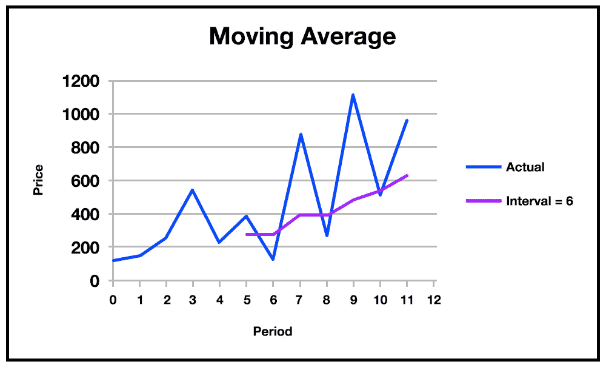
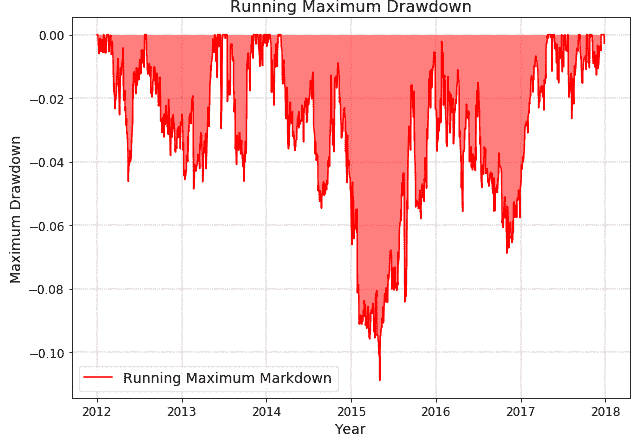

# 为什么我要学习一种特定交易风格的量化方法？

> 原文：<https://blog.quantinsti.com/learn-quantitative-approach-trading/>

由[查尼卡·塔卡](https://www.linkedin.com/in/chainika-bahl-thakar-b32971155/)

交易中的定量方法要求一个人精通数学和统计学。大多数情况下，价格和交易量是进行交易定量分析的常用输入变量。

例如，定量分析意味着用过去的数据来测试交易策略([回测](/backtesting/))，以根据一些流行的性能统计方法来显示策略的性能，这些方法包括诸如 ARIMA(自回归积分移动平均线)、SMA(简单移动平均线)、指数平滑、神经网络(NN)等模型。以及夏普比率、索提诺比率等性能评价。

使用定量方法的交易风格有:

*   [动量交易](https://quantra.quantinsti.com/glossary/Momentum-Trading)
*   [摇摆交易](https://en.wikipedia.org/wiki/Swing_trading)
*   [日内交易](https://quantra.quantinsti.com/glossary/Intraday-Trading)
*   [倒票](https://quantra.quantinsti.com/glossary/Scalping)

展望未来，这篇文章包括:

*   [在每种交易风格中使用量化方法的原因](#reasons-for-using-the-quantitative-approach-in-each-trading-style)
*   定量方法与其他方法相比有何优势？
*   [如何从量化交易开始？](#how-to-start-with-quantitative-trading)

* * *

## 在每种交易风格中使用定量方法的原因

对于上面提到的每种交易风格，量化方法在交易者中的成功背后都有一些原因，这些原因是:

*   捕捉中短期上涨趋势
*   能够迅速采取行动
*   用于在投资前识别风险
*   对于位置调整
*   为投资银行和对冲基金提供量化策略

### 捕捉中短期上涨趋势

能够用动量交易、摆动交易等交易方式成功交易。我们需要捕捉中短期的上涨趋势。定量分析有助于发现交易机会。

定量分析利用了[神经网络](https://quantra.quantinsti.com/course/neural-networks-deep-learning-trading-ernest-chan) (NN)、ARIMA(自回归积分移动平均)、SMA(简单移动平均)等统计方法。预测趋势。

[移动平均线](/moving-average-trading-strategies/)的示例如下:

在上图中，显示了价格(12 个观察值)和相同间隔的时间段数。实际数据点以蓝色显示，而 SMA 是使用以下公式计算的:

截至最后一个时间段的增加值(收盘价)/考虑的总时间段

使用 SMA 公式计算每个下一个间隔的值。因此，紫色线表明 SMA 显示上升趋势。正如你所看到的，在第 5 期和第 6 期之间，实际价格有一个低谷。然后，从 6 到 7，显示价格的峰值。

总而言之，在图形表示中有很多峰值和谷值。SMA 显示趋势，交易者在此基础上发现是否会有看涨趋势或看跌趋势。这就是在统计方法的帮助下，交易者如何在[市场](https://quantra.quantinsti.com/course/getting-market-data)中捕捉短期或中期上涨趋势，并创建在上涨趋势中买入和在趋势峰值出现时卖出的算法。

### 能够迅速采取行动

能够对这种系统交易采取快速行动是另一个原因。在定量交易的情况下，交易者发现大量的机会，然后采取行动执行金融市场中的交易。

交易者希望手动还是自动执行交易完全取决于交易者。无论是哪种情况，统计方法都会给投资的未来价值带来一定程度的确定性。

这个自动化系统可以快速地在金融市场上开仓和平仓。而人工交易的话，通过统计的方法做了定量分析之后，交易者可以很快给经纪人打电话下单。

如今，使用 Python 等计算机语言，提取过去的数据、用统计计算对策略进行回溯测试以及执行交易的速度比以往任何时候都快。

### 用于在投资前识别风险

借助于诸如夏普比率和 T2 的计算，量化交易者可以在投资前识别风险。通过计算，定量分析师发现了金融市场的风险，并在此基础上发现了机会。

例如，夏普比率衡量投资资产或交易策略中每单位[标准差](https://quantra.quantinsti.com/glossary/Standard-Deviation)的超额[回报](https://quantra.quantinsti.com/glossary/Returns)。夏普比率越高，投资者每单位风险得到的回报就越多。夏普比率越低，投资者对单位风险的预期回报就越少。

例如，假设您预期您的投资组合的年化回报率为 12%。如果无风险利率是 7%，你的投资组合有 8%的标准差。您投资组合的夏普比率计算如下:

**夏普比率= (Rp - Rf) / σ**

其中，
Rp=平均投资组合收益
Rf= [无风险利率](https://quantra.quantinsti.com/glossary/Risk-Free-Rate)
σ=投资组合的标准差

夏普比率= (12% - 7%)/ 8% = 0.625

类似地，最大压降可以用公式表示为:

**最大压降= L-P/P**

其中，
P =最大跌幅前的最大值
L =新高前的最小值

在您的交易或投资期间，您的投资组合会多次贬值。这些价值的减少被称为提取。这些提款值的最大值给了我们一个投资组合可能下降的最大值的估计。从技术上讲，它被定义为一个投资组合从高峰到低谷的最大价值减少。

例如:

假设你的投资组合的初始值是 10，000 美元。在一段时间内，它增加到 50，000 美元，然后下降到 7500 美元。然后反弹到 55，000 美元，然后再次下跌到 48，000 美元。

在这种情况下，最大下降值为

(7500 – 50000) / 50000 = -85%.

你可以用这些业绩评估方法来比较两个投资组合，并且可以选择一个与另一个相比具有更高的夏普比率和更小的最大提款值。

### 对于位置调整

为了维持你的投资组合，头寸规模是非常重要的。[头寸规模](https://quantra.quantinsti.com/course/position-sizing-trading)决定头寸的规模，包括多少股票、合约、债券等。每笔交易都应该买进卖出。通过定量方法，你可以用诸如最优 f、凯利等技术来分析策略的性能。

### 在投资银行和对冲基金从事量化策略工作

量化交易员通常受雇于投资银行和对冲基金。一些商业银行也雇佣定量分析师。定量分析师可以在对冲基金和投资银行的前台和后台工作，如 Bridgewater Associates、Goldman Sachs 等。

后台的定量分析师进行研究，创建[交易策略](https://quantra.quantinsti.com/course/quantitative-trading-strategies-models)，并进行风险管理。此外，后台部门的定量分析师正在验证基于[趋势线](https://quantra.quantinsti.com/glossary/Trend)、[股票价值](https://quantra.quantinsti.com/course/Value-Strategy-Forex)等创建的模型。然而，前线办公室的定量分析师更专注于实施和执行交易策略。

* * *

## 定量方法如何优于其他方法？

与传统的和非量化的交易方法相比，量化交易是有用的，因为它的结果在本质上更具体。

| **量化交易** |
| 量化数据是一种客观的分析 |
| 借助夏普比率、索提诺比率、最大压降等绩效评估指标和 ARIMA、SMA 等模型对数据进行分析。 |
| 该分析基于过去特定情况的发生来量化数据 |
| 它涵盖了一个大型数据集 |
| 研究方法在数字上是决定性的 |

| **传统交易和非量化方法** |
| 不要量化数据 |
| 只做趋势或模式分析，不做数字分析 |
| 
数据通常不是很大，因为没有定量方法很难测试大型数据集 |
| 由于战略无法衡量，只能通过查看数据值来预测，因此决策力没有那么大 |
| 研究方法是决定性的，没有确切的数字或测量 |
| 在非定量方法的情况下，情绪通常不受控制 |

* * *

## 如何从量化交易入手？

从量化交易开始，我们有全面的博客文章、课程和一些有趣的视频来帮助你。

### 学习量化交易的资源

**博客学习量化交易**

博客文章涵盖了从教育背景到成为专业的量化分析师和工作角色等话题。以下是推荐的 [quant 博客](/unconventional-guide-best-websites-quants/):

*   [如何成为量化分析师？](/quantitative-analyst/#educational-requirements-to-become-a-quantitative-analyst)
*   [如何成为量化开发者？](/quantitative-developer/)

**学习量化交易的视频**

以下视频将带您深入了解量化交易策略:

*   [如何开发和测试量化交易策略](https://www.youtube.com/watch?v=DW9zQ8Hz6gQ&t=265s)
*   [摇摆交易策略介绍](https://www.youtube.com/watch?v=pqN1eSatu1g)
*   [动量交易策略介绍](https://www.youtube.com/watch?v=KXt7mq_DCx8)
*   [黄牛的算法交易策略](https://www.youtube.com/watch?v=nXmIGj68QWs)

**学习量化交易的课程**

以下课程将为您构建量化交易策略或交易风格的知识和技能:

*   [摇摆交易策略](https://quantra.quantinsti.com/course/swing-trading-strategies)
*   [动量交易策略](https://quantra.quantinsti.com/course/momentum-trading-strategies)
*   [日内交易策略](https://quantra.quantinsti.com/course/day-trading-strategies)
*   [Python 中的期权交易策略](https://quantra.quantinsti.com/course/options-trading-strategies-python-advanced)

* * *

## 结论

交易的量化方法允许你利用金融市场的机会。机会是通过将复杂的行为模式分解成数值来发现的。

为了在金融市场中承担更多的计算风险，数学和统计方法有助于从交易决策中提供一些确定的预期。

探索我们关于[动量交易策略](https://quantra.quantinsti.com/course/momentum-trading-strategies)的课程，了解更多信息。你也可以看看我们在[动量交易](/momentum-trading-strategies/)的博客。

* * *

*<small>免责声明:本文提供的所有数据和信息仅供参考。QuantInsti 对本文中任何信息的准确性、完整性、现时性、适用性或有效性不做任何陈述，也不对这些信息中的任何错误、遗漏或延迟或因其显示或使用而导致的任何损失、伤害或损害负责。所有信息均按原样提供。</small>*