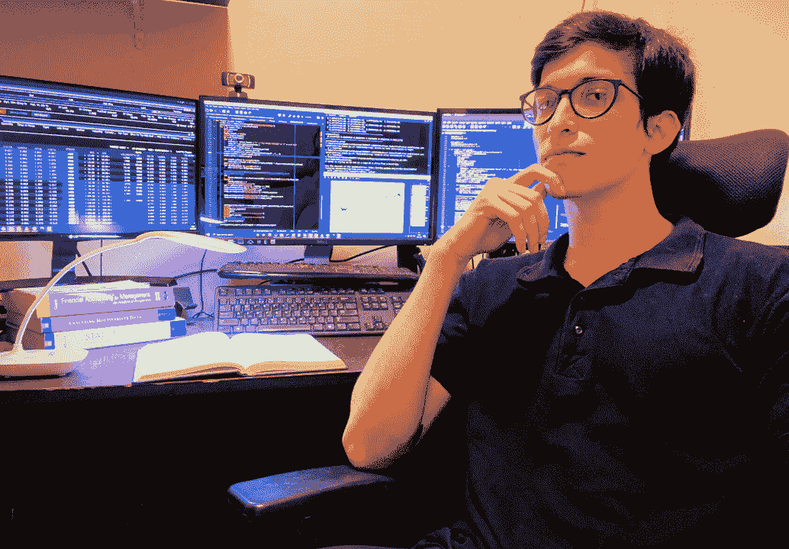

# 从 14 岁学习交易到现在的算法交易——塔伦的旅程

> 原文：<https://blog.quantinsti.com/learning-trading-14-algorithmic-trading-tarun-journey/>

成功的交易者在交易实践中体现的一个强大的品质是信念。你可能会惊讶，EPAT 校友塔伦在 14 岁就开始交易了。与此同时，他得到了他哥哥的指导和教导，并一直敏锐地交易。他向我们吐露，他在自己的工作中找到了信念和快乐。

我们联系了 Tarun，尽管冠状病毒处于封锁状态，他还是和我们分享了他进入算法交易世界的旅程。这是他的故事。

## 你好，塔伦！你能给我们介绍一下你自己吗？

嗨！我是塔伦·辛格·乔汉。我在孟买工作。我现在是大学的最后一年，学习数学和统计学——由于冠状病毒疫情，目前暂停了学习。我喜欢足球，在学校的比赛中踢了很多次，现在我仍然喜欢踢足球。

<figure class="kg-card kg-image-card"></figure>

我 14 岁开始交易，在 MCX 为哥哥执行黄金和原油订单。我 15 岁的时候就开始设置止损单和目标单。我在过去的 9 年里一直从事交易，我热爱它。我对我现在做的事情很有信心，但我还不热衷于工作方面。

全职交易，我和我的哥哥 Jatin Singh 一起工作。我们认为交易是一项运动，每个人都有自己的玩法。

目前，我正在处理指数期权(银行俏皮俏皮)。期权有希腊特色，你有很大的发挥空间，你需要精通数学，让它在期权中发挥作用。这是我真正喜欢的东西。

因为我对问题陈述和当市场横盘运行而没有产生阿尔法的探索非常感兴趣。我一直在设计算法，通过数学定价模型的帮助来检测期权的错误定价，并以对冲的方式利用它们，我还一直在研究算法，通过找到各种脚本之间的稳健关系并利用这些关系中检测到的偏差来执行统计套利。

## 有趣的是，你才 14 岁就开始交易了。算法交易是如何走进你的生活的？

我接触交易的真正原因是我哥哥，他自己已经交易了 18 年，他自己 19 岁就开始交易了。

他比我大 15 岁。这一切都是从我 13 岁左右开始对市场感兴趣开始的，那时我 8 年级，在印度中央邦的印多尔上学。我只是有点喜欢这个市场，并被我哥哥坐在终端上交易的方式迷住了。

在九年级的时候，我住在一所寄宿学校，我决定要在暑假学这个。因为我很快就明白了事情的本质，我和我哥哥决定去私立学校学习，这样我就可以花更多的时间去交易，从而放弃传统的学校教育。

我在私人学校完成了我的初中和高中学业，同时，我开始和我哥哥一起交易，学习衍生品、市场、交易所以及交易领域是如何运作的。我也开始代表我的兄弟执行指令，根据他的指示，什么时候做多，什么时候做空，用什么工具。

当我 16 岁的时候，我实际上知道衍生品市场和各种接近市场的方式，技术分析和基本面分析——什么是期权、期货、限价单、股票限价，以及以非常基本的方式交易所需的一切。

大约在这个时候，我开始编写趋势检测、内置[仓位大小](https://quantra.quantinsti.com/course/position-sizing-trading)的动量系统等等。我从 AFL 开始，这是 Amibroker 的语言，一个制图软件。两年来，我一直在 AFL 中制作基本系统，尝试在各种工具中绘制实时信号，如黄金、原油、铜。

当我 18 岁时，我开始寻找我对编码的兴趣和我对市场的领域知识的交集。我们决定我应该选择学习数学和统计学，因为它在交易中有非常直接的应用。所以，我开始全心全意地学习它，但是我没有写那么多代码。

20 岁时，我开发了一个端到端的趋势跟踪策略，在 MCX 交易大宗商品，主要是贵金属，并在一年内产生了三位数的回报，但后来我意识到，尽管趋势跟踪策略有较高的预期，但它们的夏普比率相对较低，需要相对较长的时间来实现预期，这促使我开始寻找夏普比率更高的阿尔法

一年前，我 21 岁的时候，我们偶然发现了 QuantInsti 网站，然后我们决定这是一门完美的课程，需要个人学习算法交易的热情。

算法交易是我感兴趣的，QuantInsti 似乎为我提供了学习的方法。我对课程进行了详细的概述，那时我意识到，由于我的编码背景和交易领域的知识，我应该加入 EPAT。因为 QuantInsti 是这两者之间的关键环节。

因此，我在正确的时间出现在正确的地方。我认为我很幸运有我的兄弟作为我的导师，否则，我不会在这里。在他的指导下，我很快学会了交易，在他的经验和知识的指导下，我相信如果我自己学的话，会花更多的时间。

## 今天，在 EPAT 获得的知识和技能对你有什么帮助？

EPAT 帮助我从宏观上了解了不同类型的阿尔法，这些阿尔法可以通过使用由编码、数学和金融原理创建的算法来加以利用。人们面临的最困难的部分是将这三个领域联系在一起。

工科生不懂金融，金融生不懂编码。而算法交易是工程和金融的交叉点。在这方面，EPAT 提供了各种风格的要点。因此，它让我意识到，利用我目前的编码技能和金融知识，并结合这两者来创造市场阿尔法值，可以获得不同的交易风格。

现在我意识到了各种各样的概念，比如我如何将我的技能应用到交易中，等等。我的方法也很精致。对我哥哥万分感激。

## 你最喜欢 EPAT 的哪一个特色？

支持功能，不言而喻！这很好。每当我想和老师联系时，我就打电话给我的课程协调员。他们只是把它安排在日历上，然后嘣！你接到电话了。

你可以和在 EPAT 教你的市场专家分享具体的问题。

这个过程非常无缝。对我来说，支持是突出的关键特征。我从来没有遇到过任何问题。我的支持经理 Subash 和校友经理 Deepa 总是支持我。

## 你对有抱负的算法交易者有什么话要说吗？

印度市场目前可能缺乏流动性，但它正在增长。由于它是一个发展中经济体，对市场的参与也将随着时间的推移而增加。算法交易将成为下一个完全统治市场的事物，这只是时间问题。

如果你登上火车，你就会到达它要去的目的地。

我肯定会推荐 EPAT，这样你就能意识到算法交易到底是什么，为了把算法交易作为职业，你应该记住哪些要点。

除了 QuantInsti，我不知道有任何机构专门教授算法交易。由于它强大的支持系统，我认为它绝对物有所值！

* * *

谢谢你和我们分享你的旅程，Tarun。得知爱人的支持和指导对一个人的生活和职业生涯有多么激励人心，有多么积极的影响，真的很鼓舞人心。我们祝你未来一切顺利。

你想用终生的技能来武装自己吗？这些技能将永远帮助你提升你的交易策略。通过统计学和计量经济学，金融计算和技术，机器学习等主题，EPAT 确保你精通在交易领域取得成功所需的每一项技能。[在此查询](https://www.quantinsti.com/epat)。

*<small>免责声明:为了帮助那些考虑从事算法和量化交易的人，这个案例研究是根据一个学生或 QuantInsti 的 EPAT 项目的校友的个人经历整理的。案例研究仅用于说明目的，并不意味着用于投资目的。EPAT 项目完成后所取得的成果对所有人来说可能并不一致。</small>*