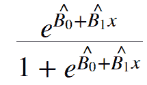
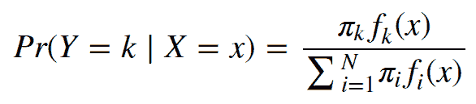
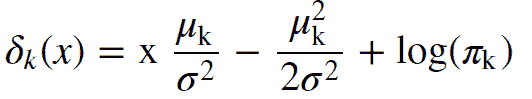
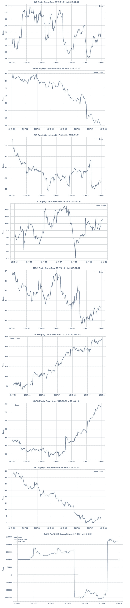
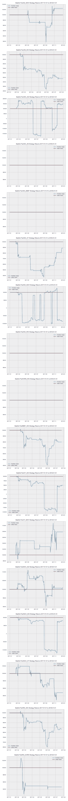
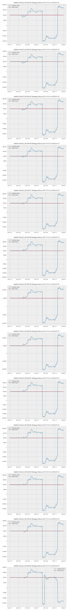
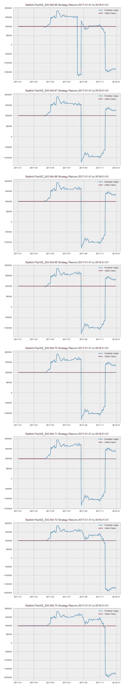
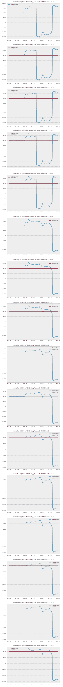
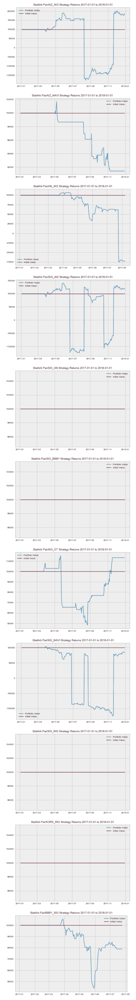
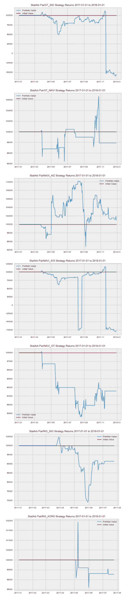

# 使用线性判别分析进行量化投资组合管理

> 原文：<https://blog.quantinsti.com/linear-discriminant-analysis-quantitative-portfolio-management/>

拉马克·科尔曼

在本帖中，我们将学习线性判别分析，以及如何在量化投资组合管理中使用它。我们将简要回顾什么是线性判别分析，并将其应用于管理量化投资组合的风险。

在我们进入 LDA 之前，让我们简单讨论一下，

## **为什么是机器学习？**

我的意思是它的目的是什么，我们真正要做的是什么？在最近围绕使用机器学习和 API 提供的模型抽象的讨论中，很容易忽略机器学习的目的和意图。

我们使用机器或统计学习的原因是为了进行推理和预测。简而言之，我们希望更多地了解某些特定数据或领域的总体情况。在大多数情况下，人口不是我们可以完全观察到的，或者用统计学术语来说是连续的。存在某个函数， **f(x)** 描述某个空间内解释变量和因变量之间的性质和关系。回想一下，一个连续随机变量的概率是无穷大， **∞** ，在某个区间之外， **a < y < b** 。直觉上这是说我们无法确定人口的确切 **f(x)** 。因此，在机器学习中，我们试图逼近群体的 **f(x)** 。我们通过获取样本或在一定时间间隔内查看一些数据来做到这一点。

请记住，我们的样本只是总人口的一部分，我们希望尽可能地逼近 **f(x)** ，一个关键问题是，我们如何知道我们从这部分人口中观察到的实际上代表了人口。换句话说，**我们怎么知道这个观察不是随机的？**这是假设检验的目的，也是我们计算检验统计和 p 值的原因。

## **什么是线性判别分析？或者什么是 LDA？**

线性判别分析，也称为 LDA，是一种监督的**机器学习算法**，可以用作分类器，最常用于实现降维。为了了解 LDA 的目标，让我们简单回顾一下线性回归。线性回归是一种参数化的监督学习模型。线性回归的目标是预测一个定量的反应，或标签。我们试图通过建立一个可以接受单个或多个参数或预测值的线性模型来实现这一点。这些预测可以是定量的，或数字的，或定性的或分类的。

与线性回归不同，在线性回归中，我们试图构建一个模型来预测特定的定量响应，在 LDA 中，我们的目标是预测定性响应或类别标签。这方面的一个例子是构建一个模型来预测资产的方向，而不是用线性回归的术语来预测资产的实际价格。更具体地说，LDA 将寻求预测方向的概率。

那么算法是如何工作的呢？

线性判别分析试图求解以下方程:Pr(Y=k ∣ X=x)

如果你学过逻辑回归，这个等式可能看起来很熟悉。它代表给定 **x** 的第 **K <sub>第</sub>T3】类或我们预测器的条件概率。**

你可能会想，如果逻辑回归和 LDA 都试图找到某个观察值属于某个特定类别的条件概率，或者给定一个值给 **x** ，或者给定我们的预测值，我们为什么不使用逻辑回归呢？

简而言之，当我们的类别或定性响应是二元的，例如，要么是 1 或 0，要么是真或假时，逻辑回归工作得很好。但是，当我们处理的数据中我们的类可能有两个以上的可能状态时，LDA 可以提供一个更好的选择。此外，当我们的类别和给定的其他条件之间存在高度的可分性时，LDA 可以给我们更好的预测，可以比逻辑回归更稳定。

尽管 LDA 试图解决与逻辑回归中使用的等式相同的等式，但它是以完全不同的方式解决的。在逻辑回归中，我们直接计算上面提供的条件概率。我们用最大似然法计算我们的系数。然后，我们将我们的系数插入逻辑函数，以得出我们的条件概率。逻辑功能如下所示:



LDA 不使用最大似然和逻辑函数，而是使用**贝耶定理**来求解条件概率方程。

应用于 LDA 的 Baye 定理的等式如下所示:



其中π <sub>k</sub> 是一个 **Y** 或一个随机观测值来自第 **k <sub>第</sub>T7】类的先验概率，f**T9】k(x)**是我们的 **x** 来自第 **k <sub>第</sub>T17】类的可能性或概率。分母是边际概率。****

先验概率**π<sub>k</sub>T3】计算起来相当简单，并且可以通过计算第 k <sub>个</sub>类的分数概率来实现。但是，似然函数，f **<sub>k</sub> (x)** 涉及的比较多一点。**

最终，我们将上面的等式转换为下面的判别等式:



**判别方程等价于条件概率方程**

在我们的新方程中， **x** 是我们的预测值或特征(注意:这种推导是基于仅使用 1 个特征)， **μ <sub>k</sub>** 是 **k <sub>th</sub>** 类或响应的平均值， **σ <sup>2</sup>** ，是所有分布的集体方差， **π <sub>k</sub>** 是我们的先验概率。

你可能想知道我说的集体方差是什么意思。为了计算似然性，LDA 必须假设某种概率密度函数。该模型假设为高斯分布。这意味着该模型将为每个**k<sub>n</sub>T5】类创建一个单独的 **x** 分布，并且每个类都有自己的 **μ** 但共享一个**σ<sup>2</sup>T11】****

简而言之，当我们拟合我们的模型时，它必须为每个 **k <sub>n</sub>** 类创建单独的概率分布，并估计 **μ <sub>k</sub>** 、 **σ <sup>2</sup>** 和 **π <sub>k</sub>** 的值，并将这些值代入判别方程**(注意:这是指如果 p=1，则使用 1 个预测器；否则，该方程将发生一点变化，以考虑多个预测值)**以便计算我们的概率，或对我们的数据进行分类。

## **让我们定义我们的问题陈述**

现在我们已经对 LDA 有了一个简要的概述，让我们来定义我们的问题。我们将假设我们正在管理一个由[统计套利策略](https://quantra.quantinsti.com/course/statistical-arbitrage-trading)组成的量化投资组合。我们关心的一个主要问题是，在任何给定的时间里，我们可以预期的最大损失。

我们计算我们的**风险值**，或**风险值**，并以 95%的信心理解我们的回报不应低于的水平。但是另外 5%呢，或者说尾部风险呢？

尾部风险是风险值分析的主要关注点。直观地说，虽然我们知道我们的回报可能在 5%的时间里低于某个阈值，但我们担心的是，我们不知道在这 5%的区间内，我们可以预期我们的回报会下降到哪里。在这 5%的尾部中，我们可以预期的最大损失是多少？

为了解决这个问题，我们将建立一个由**统计套利策略**组成的量化投资组合。我们将在 S & P 500 中使用 K-Means 创建的 pairs，在这里可以找到早期的文章:https://blog . quantin STI . com/K-Means-clustering-pair-selection-python/。

一旦我们构建了我们的投资组合，我们将创建我们的 VaR 和**蒙特卡罗**并分析结果。然后，我们将建立一个 LDA 模型，它可以帮助我们更好地了解在我们的 VaR 之下的某个范围内的回报概率。这将帮助我们更好地了解我们的风险，从而管理我们的量化投资组合。

我们开始吧！

## **建立我们的量化投资组合**

我们将移植 K-Means 系列中的 statarb 类。我们将使用在该分析的第一个聚类中发现的股票来创建我们的统计套利组合。

```py
class statarb(object):

def __init__(self,df1, df2,ma,floor, ceiling,beta_lookback,start,end,exit_zscore=0):
#setting the attributes of the data cleaning object
self.df1=df1 #the complete dataframe of X
self.df2=df2 # the comlete dataframe of Y
self.df=pd.DataFrame(index=df1.index) #creates a new dataframe in the data_cleaning method
self.ma=ma# the moving average period for the model
self.floor=floor #the buy threshold for the z-score
self.ceiling=ceiling #the sell threshold for the z-score
self.Close='Close Long' #used as close signal for longs
self.Cover='Cover Short' #used as close signal for shorts
self.exit_zscore=exit_zscore #the z-score
self.beta_lookback=beta_lookback #the lookback of beta for hedge ratio
self.start=start #the beginning of test period as a string
self.end=end # the end of test period as a string
#create price spread
def create_spread(self):
#setting the new dataframe values for x and y of the closing
#prices of the two dataframes passed in

self.df['X']=self.df1['Close']
self.df['Y']=self.df2['Close']
#calculating the beta of the pairs
self.ols=linregress(self.df['Y'],self.df['X'])
#setting the hedge ratio
self.df['Hedge Ratio']=self.ols[0]

self.df['Spread']=self.df['Y']-(self.df['Hedge Ratio']*self.df['X'])

return self.df
#check for cointegration
def check_for_cointegration(self):
coint=adfuller(self.df['Spread'].dropna())
#writing conditional that states print out
#cointegrated if the t-statistic passes the
#critical value test
if coint[0] < coint[4]['1%']:
print('Spread is Cointegrated at 99% Confidence Interval')
elif coint[0] < coint[4]['5%']:
print('Spread is Cointegrated at 95% Confidence Interval')
elif coint[0] < coint[4]['10%']:
print('Spread is Cointegrated at the 90% Confidence Interval')
else:
print('Spread is not Cointegrated')

return

def generate_signals(self):
#creating the z-score
self.df['Z-Score']=(self.df['Spread']-self.df['Spread'].rolling(window=self.ma).mean())
self.df['Spread'].rolling(window=self.ma).std()
#prior z-score
self.df['Prior Z-Score']=self.df['Z-Score'].shift(1)
#Creating Buy and Sell Signals; when to be long, short, exit

self.df['Long Signal']=(self.df['Z-Score']<=self.floor)*1.0 #buy the spread self.df['Short Signal']=(self.df['Z-Score']>=self.ceiling)*1.0 #short the spread
self.df['Exit']=(self.df['Z-Score']<=self.exit_zscore)*1.0 #tracking our positions self.df['In Long']=0.0 self.df['In Short']=0.0 #variables that track if we enter market self.enter_long=0 self.enter_short=0 #signal generator for i,value in enumerate(self.df.iterrows()): #longs if value[1]['Long Signal']==1.0: self.enter_long=1 #shorts if value[1]['Short Signal']==1.0: self.enter_short=1 if value[1]['Exit']==1.0: self.enter_long=0 self.enter_short=0 self.df.iloc[i]['In Long']=self.enter_long self.df.iloc[i]['In Short']=self.enter_short return self.df def create_returns(self, allocation,pair_name): self.allocation=allocation self.pair=pair_name self.portfolio=pd.DataFrame(index=self.df.index) self.portfolio['Positions']=self.df['Long Signal']-self.df['Short Signal'] self.portfolio['X']=-1.0*self.df['X']*self.portfolio['Positions'] self.portfolio['Y']=self.df['Y']*self.portfolio['Positions'] self.portfolio['Total']=self.portfolio['X']+self.portfolio['Y'] #creating a percentage return stream self.portfolio['Returns']=self.portfolio['Total'].pct_change() self.portfolio['Returns'].fillna(0.0,inplace=True) self.portfolio['Returns'].replace([np.inf,-np.inf],0.0,inplace=True) self.portfolio['Returns'].replace(-1.0,0.0,inplace=True) #calculating the mu,sigma,sharpe;wins and losses self.mu=(self.portfolio['Returns'].mean()) self.sigma=(self.portfolio['Returns'].std()) #self.Sharpe=(self.mu-0.005)/self.sigma self.portfolio['Win']=np.where(self.portfolio['Returns']>0,1,0)
self.portfolio['Loss']=np.where(self.portfolio['Returns']<0,1,0) self.wins=self.portfolio['Win'].sum() self.losses=self.portfolio['Loss'].sum() self.total_trades=self.wins+self.losses #win loss ratio; ie hit ratio self.win_loss_ratio=(self.wins/self.losses) #probability of win self.prob_of_win=(self.wins/self.total_trades) #probability of loss self.prob_of_loss=(self.losses/self.total_trades) #average return of wins self.avg_win_return=(self.portfolio['Returns']>0).mean()
#average returns of losses
self.avg_loss_return=(self.portfolio['Returns']<0).mean()
#calculating payout ratio
self.payout_ratio=(self.avg_win_return/self.avg_loss_return)
#calculating equity curve
self.portfolio['Returns']=(self.portfolio['Returns']+1.0).cumprod()
self.portfolio['Trade Returns']=(self.portfolio['Total'].pct_change()) #non cumulative Returns
self.portfolio['Portfolio Value']=(self.allocation*self.portfolio['Returns'])
self.portfolio['Portfolio Returns']=self.portfolio['Portfolio Value'].pct_change()
self.portfolio['Initial Value']=self.allocation

with plt.style.context(['bmh','seaborn-paper']):
#Plotting Portfolio Value
plt.plot(self.portfolio['Portfolio Value'])
plt.plot(self.portfolio['Initial Value'])
plt.title('StatArb Pair%s Strategy Returns %s to %s'%(self.pair,self.start,self.end))
plt.legend(loc=0)
plt.tight_layout()
plt.show()

return
```

现在我们有了策略类，让我们导入我们的库。

```py
#data analysis/manipulation libraries
import numpy as np
import pandas as pd
#data gathering library
import quandl as qd
#data visualization libraries
import matplotlib.pyplot as plt
import seaborn as sns
sns.set_style('whitegrid')
#stats
from scipy.stats import linregress

import warnings
warnings.simplefilter("ignore")
```

概括地说，我们的 K-Means 算法在聚类 0 中识别了 9 只股票。我们将导入这些股票，并创建它们的不同组合，检查它们的协整性，如果 ADF 测试为正，我们将把它们添加到我们的统计套利组合中。

让我们进口我们的股票。我们将获得 2017-2018 年期间的数据。

```py
#setting start and end dates
start='2017-01-01'
end='2018-01-01'
```

```py
#assigning our stocks
aiz=qd.get('WIKI/AIZ',start_date=start,end_date=end)
an=qd.get('WIKI/AN',start_date=start,end_date=end)
```

```py
sig=qd.get('WIKI/SIG',start_date=start,end_date=end)
kors=qd.get('WIKI/KORS',start_date=start,end_date=end)
```

```py
bbby=qd.get('WIKI/BBBY',start_date=start,end_date=end)
gt=qd.get('WIKI/GT',start_date=start,end_date=end)
```

```py
navi=qd.get('WIKI/NAVI',start_date=start,end_date=end)
pvh=qd.get('WIKI/PVH',start_date=start,end_date=end)
```

```py
rig=qd.get('WIKI/RIG',start_date=start,end_date=end)
```

现在我们有了数据，让我们简单地看一下我们的数据框架。我们将使用 **kors** 。

```py
kors.head()
```

| 日期 | 打开 | 高的 | 低的 | 关闭 | 卷 | 除息 | 分流比 | 开放的 | Adj .高的 | 低的 | 接近的 | 可调音量 |
| --- | --- | --- | --- | --- | --- | --- | --- | --- | --- | --- | --- | --- |
| 2017-01-03 | Forty-two point seven eight | Forty-three point four five | Forty-two point zero nine five | Forty-three point zero eight | One million nine hundred and twenty-nine thousand six hundred and thirty-four | Zero | One | Forty-two point seven eight | Forty-three point four five | Forty-two point zero nine five | Forty-three point zero eight | One million nine hundred and twenty-nine thousand six hundred and thirty-four |
| 2017-01-04 | Forty-three point two | Forty-three point nine three | Forty-three point two | Forty-three point five | Two million one hundred and forty-six thousand eight hundred and sixty-seven | Zero | One | Forty-three point two | Forty-three point nine three | Forty-three point two | Forty-three point five | Two million one hundred and forty-six thousand eight hundred and sixty-seven |
| 2017-01-05 | Forty-two point six five | Forty-two point seven one | Forty point eight one | Forty-two point one | Three million six hundred and ninety-five thousand nine hundred and four | Zero | One | Forty-two point six five | Forty-two point seven one | Forty point eight one | Forty-two point one | Three million six hundred and ninety-five thousand nine hundred and four |
| 2017-01-06 | Forty-two point one eight | Forty-two point seven six | Forty-two point one two | Forty-two point four seven | Two million five hundred and sixty-two thousand two hundred and ninety-two | Zero | One | Forty-two point one eight | Forty-two point seven six | Forty-two point one two | Forty-two point four seven | Two million five hundred and sixty-two thousand two hundred and ninety-two |
| 2017-01-09 | Forty-two point four four | Forty-two point five six | Forty-one point eight five | Forty-two point zero four | Two million one hundred and thirty-seven thousand seven hundred and sixty-three | Zero | One | Forty-two point four four | Forty-two point five six | Forty-one point eight five | Forty-two point zero four | Two million one hundred and thirty-seven thousand seven hundred and sixty-three |

我们可以看到我们的数据框架包含开盘价、最高价、最低价、收盘价、调整收盘价和成交量。让我们画出样本期内数据的价格。

让我们创建一个绘图函数来绘制我们的数据。

```py
def plot_close(symbols):

plt.figure(figsize=(10,6))
plt.plot(symbols[symbol],label='Close')
plt.legend(loc=0)
plt.ylabel('Price')

plt.title('%s Equity Curve from %s to %s' %(symbol.upper(),start,end))
#plt.show()
```

我们将创建一个字典来保存我们的符号

```py
symbols={'aiz':aiz['Close'],'an':an['Close'],'sig':sig['Close'],'kors':kors['Close'],'bbby':bbby['Close'],'gt':gt['Close'],'navi':navi['Close'],'pvh':pvh['Close'],'rig':rig['Close']}
```

我们现在可以使用我们的函数来绘制我们的符号的收盘价。

```py
for count,symbol in enumerate(symbols):
plot_close(symbols)
```

既然我们已经可视化了我们的数据，我们可以开始创建我们的对，以便我们可以进行 ADF 测试，然后建立我们的统计套利组合。我们有 9 种不同的股票来自 0 类。我们的目标是创建这些股票的不同组合，并测试它们的协整性。我们可以使用下面的组合函数来确定有多少种可能的组合。

```py
import math

def possible_combinations(n,k):

combinations=math.factorial(n)/(math.factorial(k) *math.factorial((n-k)))

return (int(combinations),'Possible Combinations')
```

我们知道有 9 只股票是我们的 n，2 只是我们的 k。让我们运行我们的可能组合函数。

```py
possible_combinations(9,2)
```

```py
(36, 'Possible Combinations')
```

为了识别所有可能的组合并检查它们的协整性，我们将首先创建一个符号列表。然后，我们将创建一个函数，使用符号列表创建所有可能的符号对。然后，我们可以创建一个方法来迭代我们的符号字典，传递我们的符号列表，并检查每一个可能的协整对。

让我们首先创建一个符号列表。

```py
symbolList=['aiz','an','sig','kors','bbby','gt','navi','rig','pvh']
```

现在让我们创建一个方法，从我们的符号列表中创建每一个可能的对。

```py
#creating method to identify each possible pair
def find_pairs(symbolList):
#creating a list to hold each possible pair
pairs=[]
#intializing placeholders for the symbols in each pair
x=0
y=0
for count,symbol in enumerate(symbolList):
for nextCount,nextSymbol in enumerate(symbolList):
x=symbol
y=nextSymbol
if x !=y:
pairs.append([x,y])

print('Length of Pairs List is:',len(pairs))
return pairs
```

```py
find_pairs(symbolList)
```

 ('Length of Pairs List is:', 72)[['aiz', 'an'], ['aiz', 'sig'], ['aiz', 'kors'], ['aiz', 'bbby'], ['aiz', 'gt'], ['aiz', 'navi'], ['aiz', 'rig'], ['aiz', 'pvh'], ['an', 'aiz'], ['an', 'sig'], ['an', 'kors'], ['an', 'bbby'], ['an', 'gt'], ['an', 'navi'], ['an', 'rig'], ['an', 'pvh'], ['sig', 'aiz'], ['sig', 'an'], ['sig', 'kors'], ['sig', 'bbby'], ['sig', 'gt'], ['sig', 'navi'], ['sig', 'rig'], ['sig', 'pvh'], ['kors', 'aiz'], ['kors', 'an'], ['kors', 'sig'], ['kors', 'bbby'], ['kors', 'gt'], ['kors', 'navi'], ['kors', 'rig'], ['kors', 'pvh'], ['bbby', 'aiz'], ['bbby', 'an'], ['bbby', 'sig'], ['bbby', 'kors'], ['bbby', 'gt'], ['bbby', 'navi'], ['bbby', 'rig'], ['bbby', 'pvh'], ['gt', 'aiz'], ['gt', 'an'], ['gt', 'sig'], ['gt', 'kors'], ['gt', 'bbby'], ['gt', 'navi'], ['gt', 'rig'], ['gt', 'pvh'], ['navi', 'aiz'], ['navi', 'an'], ['navi', 'sig'], ['navi', 'kors'], ['navi', 'bbby'], ['navi', 'gt'], ['navi', 'rig'], ['navi', 'pvh'], ['rig', 'aiz'], ['rig', 'an'], ['rig', 'sig'], ['rig', 'kors'], ['rig', 'bbby'], ['rig', 'gt'], ['rig', 'navi'], ['rig', 'pvh'], ['pvh', 'aiz'], ['pvh', 'an'], ['pvh', 'sig'], ['pvh', 'kors'], ['pvh', 'bbby'], ['pvh', 'gt'], ['pvh', 'navi'], ['pvh', 'rig']]

好的，太好了！我们有 36 种可能的组合。如果我们在配对中颠倒 X 和 Y，我们可以在技术上创造一个完全不同的价差。当在我们的符号列表中考虑这一点时，能够创建每个组合对，每个符号都是 X 和 Y，我们得到 36 * 2 种可能性或 72 种可能性。这个数字等于 find pairs 函数中的 pairs 的长度。

我们现在可以将我们的配对存储在一个变量中，这样我们就可以访问它们并检查协整性。

```py
pairs=find_pairs(symbolList)
```

```py
('Length of Pairs List is:', 72)
```

现在让我们找出哪些对是协整的。我们可以通过创建一个接收符号字典和符号对的方法来实现这一点。我们将遍历 pairs 列表，测试协整性，然后存储协整的 pairs。

让我们导入 ADF 测试来检查协整性。

```py
from statsmodels.tsa.api import adfuller
```

现在让我们创建函数来检查我们的配对是否协整。

```py
def test_pairs(symbols,pairs):
cointegrated_pairs=[]
for count,pair in enumerate(pairs):
spread=symbols[pair[0]]-symbols[pair[1]]
adf_test=adfuller(spread.dropna())
if adf_test[0] < adf_test[4]['10%']:
cointegrated_pairs.append([pair[0],pair[1]])
return cointegrated_pairs
```

我们将把函数存储在一个变量中，这样我们就可以访问我们的 cointegrated_pairs 列表。

```py
#initialzing our variable as our function
cointegrated=test_pairs(symbols,pairs)
```

现在让我们检查我们的协整变量，看看我们的协整对列表。

```py
#checking our cointegrated variable
cointegrated
```

 [['aiz', 'sig'], ['aiz', 'navi'], ['an', 'sig'], ['sig', 'aiz'], ['sig', 'an'], ['sig', 'bbby'], ['sig', 'gt'], ['sig', 'navi'], ['sig', 'rig'], ['kors', 'rig'], ['bbby', 'sig'], ['gt', 'sig'], ['gt', 'navi'], ['navi', 'aiz'], ['navi', 'sig'], ['navi', 'gt'], ['rig', 'sig'], ['rig', 'kors']]

既然我们已经发现了哪些对在我们的测试期间是协整的，我们可以使用我们的 statarb 类来创建我们的策略。我们将使用我们发现的协整对的两种组合。

让我们开始编写一个函数，允许我们为每个协整对创建 StatArb 策略。

```py
def generate_portfolio_returns(cointegrated):
for pair in cointegrated:
test=statarb(eval(pair[0]),eval(pair[1]),30,-1.5,1.5,30,start,end)
test.create_spread()
test.generate_signals()
test.create_returns(100000,'%s_%s'%(pair[0].upper(),pair[1].upper()))
```

现在我们有了函数，让我们传入嵌套的对列表并计算它们的返回。

```py
generate_portfolio_returns(cointegrated)
```

 

在浏览了我们对的股票曲线后，我们可以看到需要优化我们的参数来提高我们的表现。我们可以创建一个函数，让我们找到参数的最佳值，从而产生最佳的总体性能。在实践中，我们会对每一对都这样做，但这里我们只使用第一对。

```py
def optimize_strategy_lookback(ma1,ma2,X,Y):
for i in range(ma1,ma2):
test=statarb(eval(X),eval(Y),i,-1.5,1.5,i,start,end)
test.create_spread()
test.generate_signals()
test.create_returns(100000,'%s_%s MA:%s'%(X.upper(),Y.upper(),i))
```

现在我们有了参数优化器函数，让我们将它应用到配对列表中的第一对。

```py
optimize_strategy_lookback(40,90,cointegrated[0][0],cointegrated[0][1])
```

  

好的，让我们回顾一下我们刚刚完成的内容。我们编写了一个方法，允许我们从早期的 K-Means 系列中创建聚类 0 中股票的每一个可能的组合对。在找到所有可能的组合后，我们将这些组合传递给我们构建的另一个函数，该函数对这些可能的组合对执行 ADF 测试，并返回那些协整的组合。由于得到了协整的配对，我们编写了另一种方法，在我们组合投资组合之前查看每一对的表现，我们还创建了一种方法来优化我们的回顾。基于我们**优化*策略*回顾分析**的结果，我们将使用 57 作为我们的回顾。

现在我们可以创建我们的统计套利策略组合。我们将创建另一个方法，允许我们迭代我们的协整对，用这些对创建一个 **statarb 策略**，并存储返回。

```py
def create_portfolio_return(cointegrated_pairs):
returns=pd.DataFrame()
retsList=[]
for pair in cointegrated_pairs:
test=statarb(eval(pair[0]),eval(pair[1]),57,-1.5,1.5,57,start,end)
test.create_spread()
test.generate_signals()
test.create_returns(100000, '%s_%s'%(pair[0].upper(),pair[1].upper()))

retsList.append([test.portfolio['Portfolio Value']])
returns['Portfolio Value'+str(pair)]=test.portfolio['Portfolio Value']
#returns['Total Value']=returns['Portfolio Value'+str(pair)]
return returns
```

现在让我们使用 create *portfolio* returns 函数来创建我们的投资组合回报。我们将把我们的函数存储在一个变量中，这样我们就可以访问我们的返回数据帧。

```py
portfolio=create_portfolio_return(cointegrated)
```

 

好吧。现在我们已经得到了每种策略的回报，让我们来看看我们的投资组合数据框架。

```py
#looking at the head of our portfolio df
portfolio.tail()
```

| 日期 | 投资组合价值['aiz '，' sig'] | 投资组合价值['aiz '，' navi'] | 投资组合价值['an '，' sig'] | 投资组合价值['sig '，' aiz'] | 投资组合价值['sig '，' an'] | 投资组合价值['sig '，' bbby'] | 投资组合价值['sig '，' gt'] | 投资组合价值['sig '，' navi'] | 投资组合价值['sig '，' rig'] | 投资组合价值['kors '，' rig'] | 投资组合价值['bbby '，' sig'] | 投资组合价值['gt '，' sig'] | 投资组合价值['gt '，' navi'] | 投资组合价值['navi '，' aiz'] | 投资组合价值['navi '，' sig'] | 投资组合价值['navi '，' gt'] | 投资组合价值['rig '，' sig'] | 投资组合价值['钻机'，' kors'] |
| --- | --- | --- | --- | --- | --- | --- | --- | --- | --- | --- | --- | --- | --- | --- | --- | --- | --- | --- |
| 2017-12-22 | 179977.977935 | 91408.570457 | 圆盘烤饼 | 117626.022091 | One hundred thousand | One hundred thousand | 113219.354595 | 84358.647887 | One hundred thousand | One hundred thousand | 圆盘烤饼 | -56900.096850 | 97881.584901 | 101131.516629 | -78726.338519 | 88907.110597 | 圆盘烤饼 | 圆盘烤饼 |
| 2017-12-26 | 175927.156915 | 91408.570457 | 圆盘烤饼 | 117626.022091 | One hundred thousand | One hundred thousand | 113219.354595 | 86367.651524 | One hundred thousand | One hundred thousand | 圆盘烤饼 | -60230.249887 | 97881.584901 | 101166.119109 | -80601.208547 | 88907.110597 | 圆盘烤饼 | 圆盘烤饼 |
| 2017-12-27 | 180909.666770 | 91408.570457 | 圆盘烤饼 | 117626.022091 | One hundred thousand | One hundred thousand | 113219.354595 | 84690.231011 | One hundred thousand | One hundred thousand | 圆盘烤饼 | -57582.898012 | 97881.584901 | 101592.883037 | -79035.783087 | 88907.110597 | 圆盘烤饼 | 圆盘烤饼 |
| 2017-12-28 | 185365.569892 | 91408.570457 | 圆盘烤饼 | 120523.214753 | One hundred thousand | One hundred thousand | 113219.354595 | 82993.305609 | One hundred thousand | One hundred thousand | 圆盘烤饼 | -55510.536590 | 97881.584901 | 101858.168721 | -77452.155006 | 88907.110597 | 圆盘烤饼 | 圆盘烤饼 |
| 2017-12-29 | 179410.862992 | 91408.570457 | 圆盘烤饼 | 116651.511831 | One hundred thousand | One hundred thousand | 113219.354595 | 84319.638107 | One hundred thousand | One hundred thousand | 圆盘烤饼 | -58074.035690 | 97881.584901 | 100946.970066 | -78689.933276 | 88907.110597 | 圆盘烤饼 | 圆盘烤饼 |

现在我们已经有了包含每个策略回报的投资组合数据框架，我们可以创建总投资组合价值列。在检查了我们的列的长度之后，我们发现我们有 18 个不同的对列。我们可以:

1.  手动初始化总值列，方法是自己将所有这些相加，或者我们可以
2.  用编程的方式解决这个问题，节省很多时间，甚至有一些代码我们可以存储在一个函数里，以后再用。

让我们用第二个。我们将编写一些逻辑，允许我们将总值列初始化为所有个人投资组合价值的总和。

```py
#creating a copy of our portfolio dataframe
portfolioCopy=portfolio.copy()
#creating Total Value column and initializing to 0
portfolioCopy['Total Value']=0
#creating a pandas Series to hold the cumulative value of each row
rets=pd.Series(index=portfolioCopy.index)
#iterating over each row
for count,row in enumerate(portfolioCopy.iterrows()):
#iterating over each column within each row
for count2,column in enumerate(row):
#storing sum of each column within each row into rets at same location
rets.iloc[count]=np.sum(column)
#storing the returns series into the Total Value column in our dataframe
portfolioCopy['Total Value']=rets
```

既然我们已经以编程方式初始化了总值列，那么让我们来看看 dataframe 的头部。

```py
portfolioCopy.tail()
```

| 日期 | 投资组合价值['aiz '，' sig'] | 投资组合价值['aiz '，' navi'] | 投资组合价值['an '，' sig'] | 投资组合价值['sig '，' aiz'] | 投资组合价值['sig '，' an'] | 投资组合价值['sig '，' bbby'] | 投资组合价值['sig '，' gt'] | 投资组合价值['sig '，' navi'] | 投资组合价值['sig '，' rig'] | 投资组合价值['kors '，' rig'] | 投资组合价值['bbby '，' sig'] | 投资组合价值['gt '，' sig'] | 投资组合价值['gt '，' navi'] | 投资组合价值['navi '，' aiz'] | 投资组合价值['navi '，' sig'] | 投资组合价值['navi '，' gt'] | 投资组合价值['rig '，' sig'] | 投资组合价值['钻机'，' kors'] | 总值 |
| --- | --- | --- | --- | --- | --- | --- | --- | --- | --- | --- | --- | --- | --- | --- | --- | --- | --- | --- | --- |
| 2017-12-22 | 179977.977935 | 91408.570457 | 圆盘烤饼 | 117626.022091 | One hundred thousand | One hundred thousand | 113219.354595 | 84358.647887 | One hundred thousand | One hundred thousand | 圆盘烤饼 | -56900.096850 | 97881.584901 | 101131.516629 | -78726.338519 | 88907.110597 | 圆盘烤饼 | 圆盘烤饼 | 1.13888e+06 |
| 2017-12-26 | 175927.156915 | 91408.570457 | 圆盘烤饼 | 117626.022091 | One hundred thousand | One hundred thousand | 113219.354595 | 86367.651524 | One hundred thousand | One hundred thousand | 圆盘烤饼 | -60230.249887 | 97881.584901 | 101166.119109 | -80601.208547 | 88907.110597 | 圆盘烤饼 | 圆盘烤饼 | 1.13167e+06 |
| 2017-12-27 | 180909.666770 | 91408.570457 | 圆盘烤饼 | 117626.022091 | One hundred thousand | One hundred thousand | 113219.354595 | 84690.231011 | One hundred thousand | One hundred thousand | 圆盘烤饼 | -57582.898012 | 97881.584901 | 101592.883037 | -79035.783087 | 88907.110597 | 圆盘烤饼 | 圆盘烤饼 | 1.13962e+06 |
| 2017-12-28 | 185365.569892 | 91408.570457 | 圆盘烤饼 | 120523.214753 | One hundred thousand | One hundred thousand | 113219.354595 | 82993.305609 | One hundred thousand | One hundred thousand | 圆盘烤饼 | -55510.536590 | 97881.584901 | 101858.168721 | -77452.155006 | 88907.110597 | 圆盘烤饼 | 圆盘烤饼 | 1.14919e+06 |
| 2017-12-29 | 179410.862992 | 91408.570457 | 圆盘烤饼 | 116651.511831 | One hundred thousand | One hundred thousand | 113219.354595 | 84319.638107 | One hundred thousand | One hundred thousand | 圆盘烤饼 | -58074.035690 | 97881.584901 | 100946.970066 | -78689.933276 | 88907.110597 | 圆盘烤饼 | 圆盘烤饼 | 1.13598e+06 |

我们可以看到，我们的总值列现在等于所有单个对列的总和。

## **创建我们的蒙特卡洛和 VaR**

现在我们准备计算我们的风险价值。我们只用回报的前 10 个月来避免前瞻偏差。这样做的目的是，我们将使用我们的 VaR 来建立 95%置信度的损失下限，以便我们可以创建具有不同回报区间的标签或类别，来代表我们尾部风险的某个百分比。我们不想使用我们所有的数据，因为我们的风险值或 95%置信度下的最差预期日损失将基于我们所有的回报，因此当我们使用 LDA 模型预测一定程度的尾部风险时，我们的预测将基于我们已经看到的回报和尾部风险，我们希望预测。这将极大地扭曲我们的结果。前 10 个月对应于 80/20 训练测试分割，我们将使用它来构建我们的 LDA 模型。

让我们从初始化一些参数开始。我们将把我们的 Returns 列添加到我们的数据框架中，然后手动切掉前 10 个月并创建我们的参数。

```py
#adding return column to our portfolioCopy dataframe
portfolioCopy['Returns']=portfolioCopy['Total Value'].pct_change()
#slicing out first 10 months of our data
first10=portfolioCopy['Returns']['2017-01-01':'2017-10-31']
#initializing our parameters
test_range=300
beginning_value=portfolioCopy['Total Value'][0]
mu=first10.mean()
sigma=first10.std()
days=202
name='StatArb Portfolio'
```

在继续之前，让我们简单回顾一下我们的参数。我们的测试范围是我们将要做的迭代次数。在本例中，我们将这个数字保持得很低，但实际上，这个数字会高得多。我们的初始价值是我们投资组合的初始价值。我们的 mu 是我们投资组合在前 10 个月的平均回报，我们的 sigma 是我们投资组合在前 10 个月的标准差。天数代表我们模拟周期的长度。我们已经包含了一个名称参数，该参数将被传递到我们的蒙特卡罗函数中用于绘图目的。

让我们创建我们的蒙特卡罗函数。

```py
def monte_carlo(initial_portfolio_value,days,mu,sigma,asset_name):
'''
PARAMETERS
##########
initial_portolio_value - some starting value for strategy or portfolio
days- the amount of time to run MC over (i.e. 252 for one year)
mu- mean of asset or strategy
sigma- volatility/standard deviation of asset or strategy
asset_name- the name of strategy/asset as a string you want to appear on chart
dt- time delta(i.e. 1/days)
'''
dt=1/days
#creating price array
Portfolio_Value=np.zeros(days)
Portfolio_Value[0]=initial_portfolio_value

shock=np.zeros(days)
drift=np.zeros(days)

for x in range(1,days):
#calculate shock
shock[x]=np.random.normal(loc=mu*dt,scale=sigma*np.sqrt(dt))
#calculate drift
drift[x]=mu*dt
#calculate portfolio value
Portfolio_Value[x]=Portfolio_Value[x-1]+(Portfolio_Value[x-1]*(drift[x]+shock[x]))

return Portfolio_Value
```

现在我们有了蒙特卡罗函数，让我们将它传递到一个循环中，在我们的采样周期内进行模拟。

```py
plots=pd.DataFrame()
for count,i in enumerate(range(0,test_range)):

values=monte_carlo(beginning_value,days,mu,sigma,name)
plots['Value'+str(count)]=values
```

```py
with plt.style.context(['seaborn-poster','ggplot']):

plt.figure(figsize=(12,8))
plt.plot(plots)
plt.xlabel('Days')
plt.ylabel('Value')
plt.title('%s Monte Carlo Simulation'%(name))
```

我们的[蒙特卡洛模拟](https://blog.quantinsti.com/monte-carlo-simulation/)表明投资组合低至 150 万美元左右。回想一下，我们用 10 万美元初始化每个策略，有 18 个不同的组合，因此我们的初始投资组合价值为 180 万美元。现在我们已经计算了蒙特卡罗，让我们通过直方图生成 VaR。

```py
#creating histogram VaR
trials=np.zeros(test_range)
np.set_printoptions(threshold=7)
hist=pd.DataFrame()
for count,value in enumerate(range(0,test_range)):
trials[count]=monte_carlo(beginning_value,days,mu,sigma,name)[days-1]

hist['Value'+str(count)]=trials
```

```py
#plotting histogram
#setting 5% quantile
q=np.percentile(trials,5)

with plt.style.context(['seaborn-poster']):
plt.hist(trials, bins=50)
#showing starting value
plt.figtext(0.6,0.8,s='Initial Value: $%.2f' %(beginning_value) )
#annotating tail
plt.figtext(0.15,0.7,"VaR(0.95): $%.2f" %(q))
plt.axvline(x=q,linewidth=5,color='b')
plt.title('StatArb Portfolio Value at Risk')
```

我们刚刚完成了风险值分析。我们从创建蒙特卡洛模拟开始。我们的蒙特卡洛显示投资组合价值略高于 150 万美元。然后，我们使用蒙特卡洛创建直方图，并以 95%的置信度获得我们的风险值。我们可以通过打印 q 变量来验证这个投资组合的价值。

```py
#printing out VaR threshold
q
```

```py
1800000.0
```

我们可以看到，根据这一分析，我们的风险值为 166 万美元。我们现在可以在此分析的基础上，通过使用 LDA 来预测我们的蒙特卡洛风险值分析所确定的尾部风险中特定损失的概率。

## **构建我们的 LDA 模型**

在这一点上，我们已经测试了 K-Means 系列的聚类 0 中的每一对组合的协整性，并确定了那些被协整的组合。我们已经构建了我们的统计套利策略组合，并进行了蒙特卡洛风险值分析。根据我们的风险分析，我们了解到，在 95%的信心下，我们的投资组合不应低于 166 万。

我们最初的投资组合价值是 180 万美元。降至 166 万美元意味着我们的投资组合价值下降了 7.7%。虽然拥有这些信息可以帮助我们管理我们的投资组合，但我们最关心的是，当我们的投资组合可能低于这 166 万时，会发生 5%的情况。

为了改善我们的投资组合风险管理，我们将使用 LDA 来预测我们的投资组合落入尾部风险区域内某个阈值的概率。我们可以从柱状图中看到，我们的分析下限为 160 万美元。这一投资组合价值意味着 11%的提款。我们将把我们的最大提款设置在我们的风险值和下限的中点。这相当于 163 万英镑，下降了 9%。这是我们愿意在投资组合中承担的最大风险。

为了确保我们将损失限制在最大 9%，我们希望能够预测超过这一阈值的概率。我们将使用 LDA 来解决这一问题。

我们将在用于蒙特卡罗分析的相同时期内训练我们的模型，即样本的前 10 个月。我们需要添加一个二进制类来表示我们是否已经超出了最大暴露量。我们还需要计算我们的解释变量或特征，这些变量或特征将用于预测违反最大风险敞口的可能性。

我们将使用两个滞后的回报以及更广泛的市场波动作为我们的特征。

让我们导入 S&P 指数，计算其在一段时间内的波动性，并将其添加到我们的投资组合副本数据框架中。

```py
import fix_yahoo_finance as yf
index=yf.download('^GSPC',start,end)
```

让我们检查一下索引数据的头部。

```py
index.head()
```

| 日期 | 打开 | 高的 | 低的 | 关闭 | 接近的 | 卷 |
| --- | --- | --- | --- | --- | --- | --- |
| 2017-01-03 | 2251.570068 | 2263.879883 | 2245.129883 | 2257.830078 | 2257.830078 | -524437296 |
| 2017-01-04 | 2261.600098 | 2272.820068 | 2261.600098 | 2270.750000 | 2270.750000 | -530077296 |
| 2017-01-05 | 2268.179932 | 2271.500000 | 2260.449951 | 2269.000000 | 2269.000000 | -533147296 |
| 2017-01-06 | 2271.139893 | 2282.100098 | 2264.060059 | 2276.979980 | 2276.979980 | -955077296 |
| 2017-01-09 | 2273.590088 | 2275.489990 | 2268.899902 | 2268.899902 | 2268.899902 | -1077357296 |

我们将计算指数收益和波动性，并把它们放到数据框架中。

```py
index['Returns']=index['Close'].pct_change()
#computing the index volatlity
```

```py
index['Volatility']=index['Returns'].rolling(window=5).std()
```

现在让我们再看一下我们的索引数据。

```py
index.head()
```

| 日期 | 打开 | 高的 | 低的 | 关闭 | 接近的 | 卷 | 返回 | 波动性 |
| --- | --- | --- | --- | --- | --- | --- | --- | --- |
| 2017-01-03 | 2251.570068 | 2263.879883 | 2245.129883 | 2257.830078 | 2257.830078 | -524437296 | 圆盘烤饼 | 圆盘烤饼 |
| 2017-01-04 | 2261.600098 | 2272.820068 | 2261.600098 | 2270.750000 | 2270.750000 | -530077296 | 0.005722 | 圆盘烤饼 |
| 2017-01-05 | 2268.179932 | 2271.500000 | 2260.449951 | 2269.000000 | 2269.000000 | -533147296 | -0.000771 | 圆盘烤饼 |
| 2017-01-06 | 2271.139893 | 2282.100098 | 2264.060059 | 2276.979980 | 2276.979980 | -955077296 | 0.003517 | 圆盘烤饼 |
| 2017-01-09 | 2273.590088 | 2275.489990 | 2268.899902 | 2268.899902 | 2268.899902 | -1077357296 | -0.003549 | 圆盘烤饼 |

让我们回顾一下我们的投资组合副本数据框架。

```py
portfolioCopy.head()
```

| 日期 | 投资组合价值['aiz '，' sig'] | 投资组合价值['aiz '，' navi'] | 投资组合价值['an '，' sig'] | 投资组合价值['sig '，' aiz'] | 投资组合价值['sig '，' an'] | 投资组合价值['sig '，' bbby'] | 投资组合价值['sig '，' gt'] | 投资组合价值['sig '，' navi'] | 投资组合价值['sig '，' rig'] | 投资组合价值['kors '，' rig'] | 投资组合价值['bbby '，' sig'] | 投资组合价值['gt '，' sig'] | 投资组合价值['gt '，' navi'] | 投资组合价值['navi '，' aiz'] | 投资组合价值['navi '，' sig'] | 投资组合价值['navi '，' gt'] | 投资组合价值['rig '，' sig'] | 投资组合价值['钻机'，' kors'] | 总值 | 返回 |
| --- | --- | --- | --- | --- | --- | --- | --- | --- | --- | --- | --- | --- | --- | --- | --- | --- | --- | --- | --- | --- |
| 2017-01-03 | One hundred thousand | One hundred thousand | One hundred thousand | One hundred thousand | One hundred thousand | One hundred thousand | One hundred thousand | One hundred thousand | One hundred thousand | One hundred thousand | One hundred thousand | One hundred thousand | One hundred thousand | One hundred thousand | One hundred thousand | One hundred thousand | One hundred thousand | One hundred thousand | 1.8e+06 | 圆盘烤饼 |
| 2017-01-04 | One hundred thousand | One hundred thousand | One hundred thousand | One hundred thousand | One hundred thousand | One hundred thousand | One hundred thousand | One hundred thousand | One hundred thousand | One hundred thousand | One hundred thousand | One hundred thousand | One hundred thousand | One hundred thousand | One hundred thousand | One hundred thousand | One hundred thousand | One hundred thousand | 1.8e+06 | Zero |
| 2017-01-05 | One hundred thousand | One hundred thousand | One hundred thousand | One hundred thousand | One hundred thousand | One hundred thousand | One hundred thousand | One hundred thousand | One hundred thousand | One hundred thousand | One hundred thousand | One hundred thousand | One hundred thousand | One hundred thousand | One hundred thousand | One hundred thousand | One hundred thousand | One hundred thousand | 1.8e+06 | Zero |
| 2017-01-06 | One hundred thousand | One hundred thousand | One hundred thousand | One hundred thousand | One hundred thousand | One hundred thousand | One hundred thousand | One hundred thousand | One hundred thousand | One hundred thousand | One hundred thousand | One hundred thousand | One hundred thousand | One hundred thousand | One hundred thousand | One hundred thousand | One hundred thousand | One hundred thousand | 1.8e+06 | Zero |
| 2017-01-09 | One hundred thousand | One hundred thousand | One hundred thousand | One hundred thousand | One hundred thousand | One hundred thousand | One hundred thousand | One hundred thousand | One hundred thousand | One hundred thousand | One hundred thousand | One hundred thousand | One hundred thousand | One hundred thousand | One hundred thousand | One hundred thousand | One hundred thousand | One hundred thousand | 1.8e+06 | Zero |

现在，我们可以创建滞后回报列，并将指数波动率列添加到数据框架中。

```py
#creating our lagged returns columns
portfolioCopy['Lag1']=portfolioCopy['Returns'].shift(1)
portfolioCopy['Lag2']=portfolioCopy['Returns'].shift(2)
#adding our index volatility column
portfolioCopy['Index Volatility']=index['Volatility']
```

让我们检查一下数据帧的头部。

让我们首先用 0 填充 NaN 值。当我们准备好适应我们的模型时，这将是有益的

```py
portfolioCopy.fillna(0).tail()
```

| 日期 | 投资组合价值['aiz '，' sig'] | 投资组合价值['aiz '，' navi'] | 投资组合价值['an '，' sig'] | 投资组合价值['sig '，' aiz'] | 投资组合价值['sig '，' an'] | 投资组合价值['sig '，' bbby'] | 投资组合价值['sig '，' gt'] | 投资组合价值['sig '，' navi'] | 投资组合价值['sig '，' rig'] | 投资组合价值['kors '，' rig'] | ... | 投资组合价值['navi '，' aiz'] | 投资组合价值['navi '，' sig'] | 投资组合价值['navi '，' gt'] | 投资组合价值['rig '，' sig'] | 投资组合价值['钻机'，' kors'] | 总值 | 返回 | Lag1 | Lag2 | 指数波动 |
| --- | --- | --- | --- | --- | --- | --- | --- | --- | --- | --- | --- | --- | --- | --- | --- | --- | --- | --- | --- | --- | --- |
| 2017-12-22 | 179977.977935 | 91408.570457 | Zero | 117626.022091 | One hundred thousand | One hundred thousand | 113219.354595 | 84358.647887 | One hundred thousand | One hundred thousand | ... | 101131.516629 | -78726.338519 | 88907.110597 | Zero | Zero | 1.138884e+06 | -0.006932 | -0.004255 | -0.000237 | 0.003257 |
| 2017-12-26 | 175927.156915 | 91408.570457 | Zero | 117626.022091 | One hundred thousand | One hundred thousand | 113219.354595 | 86367.651524 | One hundred thousand | One hundred thousand | ... | 101166.119109 | -80601.208547 | 88907.110597 | Zero | Zero | 1.131672e+06 | -0.006333 | -0.006932 | -0.004255 | 0.001859 |
| 2017-12-27 | 180909.666770 | 91408.570457 | Zero | 117626.022091 | One hundred thousand | One hundred thousand | 113219.354595 | 84690.231011 | One hundred thousand | One hundred thousand | ... | 101592.883037 | -79035.783087 | 88907.110597 | Zero | Zero | 1.139617e+06 | 0.007020 | -0.006333 | -0.006932 | 0.001279 |
| 2017-12-28 | 185365.569892 | 91408.570457 | Zero | 120523.214753 | One hundred thousand | One hundred thousand | 113219.354595 | 82993.305609 | One hundred thousand | One hundred thousand | ... | 101858.168721 | -77452.155006 | 88907.110597 | Zero | Zero | 1.149194e+06 | 0.008404 | 0.007020 | -0.006333 | 0.001355 |
| 2017-12-29 | 179410.862992 | 91408.570457 | Zero | 116651.511831 | One hundred thousand | One hundred thousand | 113219.354595 | 84319.638107 | One hundred thousand | One hundred thousand | ... | 100946.970066 | -78689.933276 | 88907.110597 | Zero | Zero | 1.135982e+06 | -0.011497 | 0.008404 | 0.007020 | 0.002686 |

现在，我们可以为阈值添加列，并创建响应列。

```py
#adding our threshold value
portfolioCopy['Threshold']=1630000
#adding our response column
portfolioCopy['Tail Risk']=np.where(portfolioCopy['Total Value']<portfolioCopy['Threshold'],'Yes','No')
```

现在我们已经添加了阈值和响应，让我们重新检查我们的数据框架。

```py
portfolioCopy.tail()
```

| 日期 | 投资组合价值['aiz '，' sig'] | 投资组合价值['aiz '，' navi'] | 投资组合价值['an '，' sig'] | 投资组合价值['sig '，' aiz'] | 投资组合价值['sig '，' an'] | 投资组合价值['sig '，' bbby'] | 投资组合价值['sig '，' gt'] | 投资组合价值['sig '，' navi'] | 投资组合价值['sig '，' rig'] | 投资组合价值['kors '，' rig'] | ... | 投资组合价值['navi '，' gt'] | 投资组合价值['rig '，' sig'] | 投资组合价值['钻机'，' kors'] | 总值 | 返回 | Lag1 | Lag2 | 指数波动 | 阈值 | 尾部风险 |
| --- | --- | --- | --- | --- | --- | --- | --- | --- | --- | --- | --- | --- | --- | --- | --- | --- | --- | --- | --- | --- | --- |
| 2017-12-22 | 179977.977935 | 91408.570457 | 圆盘烤饼 | 117626.022091 | One hundred thousand | One hundred thousand | 113219.354595 | 84358.647887 | One hundred thousand | One hundred thousand | ... | 88907.110597 | 圆盘烤饼 | 圆盘烤饼 | 1.13888e+06 | -0.006932 | -0.004255 | -0.000237 | 0.003257 | One million six hundred and thirty thousand | 是 |
| 2017-12-26 | 175927.156915 | 91408.570457 | 圆盘烤饼 | 117626.022091 | One hundred thousand | One hundred thousand | 113219.354595 | 86367.651524 | One hundred thousand | One hundred thousand | ... | 88907.110597 | 圆盘烤饼 | 圆盘烤饼 | 1.13167e+06 | -0.006333 | -0.006932 | -0.004255 | 0.001859 | One million six hundred and thirty thousand | 是 |
| 2017-12-27 | 180909.666770 | 91408.570457 | 圆盘烤饼 | 117626.022091 | One hundred thousand | One hundred thousand | 113219.354595 | 84690.231011 | One hundred thousand | One hundred thousand | ... | 88907.110597 | 圆盘烤饼 | 圆盘烤饼 | 1.13962e+06 | 0.007020 | -0.006333 | -0.006932 | 0.001279 | One million six hundred and thirty thousand | 是 |
| 2017-12-28 | 185365.569892 | 91408.570457 | 圆盘烤饼 | 120523.214753 | One hundred thousand | One hundred thousand | 113219.354595 | 82993.305609 | One hundred thousand | One hundred thousand | ... | 88907.110597 | 圆盘烤饼 | 圆盘烤饼 | 1.14919e+06 | 0.008404 | 0.007020 | -0.006333 | 0.001355 | One million six hundred and thirty thousand | 是 |
| 2017-12-29 | 179410.862992 | 91408.570457 | 圆盘烤饼 | 116651.511831 | One hundred thousand | One hundred thousand | 113219.354595 | 84319.638107 | One hundred thousand | One hundred thousand | ... | 88907.110597 | 圆盘烤饼 | 圆盘烤饼 | 1.13598e+06 | -0.011497 | 0.008404 | 0.007020 | 0.002686 | One million six hundred and thirty thousand | 是 |

太好了！现在我们准备好建立我们的 LDA 模型。让我们从导入必要的库开始。

```py
from sklearn.discriminant_analysis import LinearDiscriminantAnalysis as lda
from sklearn.model_selection import train_test_split
```

让我们将 LDA 模型初始化为一个模型。

```py
model=lda()
```

让我们将数据分成训练集和测试集。请注意，我们只需要最后添加的 4 列，即 Lag1 和 2、指数波动率和尾部风险。

首先，我们将从 portfolioCopy 数据框架中创建一个仅包含相关列的数据框架。

```py
sample_data=pd.DataFrame(dict(Lag1=portfolioCopy['Lag1'],Lag2=portfolioCopy['Lag2'],IndexVolatility=portfolioCopy['Index Volatility'],TailRisk=portfolioCopy['Tail Risk']))
```

我们刚刚创建了一个 sample_data 数据帧，其中包含来自 portfolioCopy 数据帧的相关数据。让我们检查一下。

```py
sample_data.head()
```

| 日期 | 指数波动性 | Lag1 | Lag2 | 尾部风险 |
| --- | --- | --- | --- | --- |
| 2017-01-03 | 圆盘烤饼 | 圆盘烤饼 | 圆盘烤饼 | 不 |
| 2017-01-04 | 圆盘烤饼 | 圆盘烤饼 | 圆盘烤饼 | 不 |
| 2017-01-05 | 圆盘烤饼 | Zero | 圆盘烤饼 | 不 |
| 2017-01-06 | 圆盘烤饼 | Zero | Zero | 不 |
| 2017-01-09 | 圆盘烤饼 | Zero | Zero | 不 |

现在让我们填充这些 NaN 值，因为当我们准备好拟合我们的模型时，它们会造成问题。

```py
#filling NaN values with 0
sample_data.fillna(0).tail()
```

| 日期 | 指数波动性 | Lag1 | Lag2 | 尾部风险 |
| --- | --- | --- | --- | --- |
| 2017-12-22 | 0.003257 | -0.004255 | -0.000237 | 是 |
| 2017-12-26 | 0.001859 | -0.006932 | -0.004255 | 是 |
| 2017-12-27 | 0.001279 | -0.006333 | -0.006932 | 是 |
| 2017-12-28 | 0.001355 | 0.007020 | -0.006333 | 是 |
| 2017-12-29 | 0.002686 | 0.008404 | 0.007020 | 是 |

现在让我们创建我们的训练和测试集。回想一下，我们将进行 80/20 分割。

```py
sample_data = sample_data.dropna()
#creating our features space by dropping our response from our data
X=sample_data.drop('TailRisk',axis=1)
#creating our response by initializing y as TailRisk
y=sample_data['TailRisk']
#creating our 80/20 split
X_train,X_test,y_train,y_test=train_test_split(X,y,test_size=.20)
```

现在我们已经分割了数据，让我们来训练我们的模型。

```py
#fitting our model to our data
model.fit(X_train.fillna(0),y_train.fillna(0))
```

```py
LinearDiscriminantAnalysis(n_components=None, priors=None, shrinkage=None,
solver='svd', store_covariance=False, tol=0.0001)
```

既然我们已经把模型和数据拟合好了，让我们用它来预测我们的尾部风险和结果。

```py
#passing in our new labels; those not yet seen by our model
predictions=model.predict(X_test)
```

现在我们有了我们的预测，我们可以检查我们的模型在预测我们的投资组合超过我们的最大风险敞口的可能性方面有多准确。

让我们从 sklearn 导入我们的混淆矩阵和分类报告。

```py
from sklearn.metrics import classification_report, confusion_matrix
```

现在我们准备打印我们的报告。

```py
#printing out confusion matrix
print(confusion_matrix(y_test,predictions))
#printing out classification report
print(classification_report(y_test,predictions)) # target_names=response_names))
```

```py
[[ 0 18]
[ 0 31]]
                 precision   recall     f1-score    support
    No             0.00       0.00        0.00        18
    Yes            0.63       1.00        0.78        31
avg / total        0.40       0.63        0.49        49
```

在我们进入模型的结果之前，让我们简单地确保我们理解了前面的代码在做什么。我们首先创建了一个仅包含我们的预测指标(即 Lag1、Lag2、指数波动率)和我们的反应或标签(即尾部风险)的数据框架。然后，我们将数据分为训练集和测试集，使用我们的训练数据(X *训练或我们的预测器，y* 训练或我们的响应)训练我们的模型，然后使用我们的 X *测试集或我们的模型尚未看到的预测器进行预测。因此，我们传递我们的 y* 测试集，或者我们预测响应的实际响应，并检查我们模型的准确性。

```py
true_negative,false_negative,false_positive,true_positive=confusion_matrix(y_test,predictions).ravel()
```

```py
print('Interpreting Confusion Matrix')
print('Actual NO & Predicted NO:', true_negative)
print('Actual YES & Predicted NO:', false_negative)
print('Actual NO & Predicted YES:', false_positive)
print('Actual YES & Predicted YES:', true_positive)
```

**解读混淆矩阵**

```py
('Actual NO & Predicted NO:', 0)
('Actual YES & Predicted NO:', 18)
('Actual NO & Predicted YES:', 0)
('Actual YES & Predicted YES:', 31)
```

让我们检查一下我们的理解。我们的混淆矩阵可以从左到右阅读，列是实际否和实际是，行是预测否和预测是。混淆矩阵显示的是我们的投资组合没有违反我们的风险敞口的次数，我们预测它不会用矩阵中的 0 表示；它显示了我们的投资组合违反我们的风险敞口的次数，我们预测它不会，在矩阵中用 31 表示。它显示了我们的投资组合有多少次没有违反我们的风险敞口，我们预测它会违反，在矩阵中用 1 表示。它显示了我们的投资组合违反我们的风险敞口的次数，我们预测它会违反，在矩阵中用 19 表示。

我们的分类报告为我们提供支持信息，但格式不同。例如，我们知道我们的投资组合实际违约的总次数是 50 次。

我们可以通过简单地将我们实际的“是”列 31+19=50 相加来看到这一点。

我们还知道，我们正确预测了 19 次暴露缺口。我们可以用我们暴露的总次数来划分，19/50 = 38；在分类报告的“精度”列中，我们在“是”行得到了完全相同的结果。这表明，我们的精确度或我们的模型正确识别我们的投资组合何时会违反我们的风险限额的能力是 38%的时间。

我们使用的参数在我们的模型对我们的观察结果进行正确分类的能力中起着重要的作用。回想一下，在上面的例子中，我们使用了回报的两个滞后期以及指数的波动性。必须评估模型开发中的不同考虑因素。我们不会在这里解决这些问题，但是我们要做的是，如果我们只根据指数的波动性进行预测，我们的精度会如何变化。

让我们创建一个新的训练和测试集，仅使用指数波动率作为我们的预测器。

```py
sample_data_2=sample_data.copy()
```

让我们检查我们的第二个样本数据的头部，以确保其有效性。

```py
sample_data_2.head()
```

| 日期 | 指数波动性 | Lag1 | Lag2 | 尾部风险 |
| --- | --- | --- | --- | --- |
| 2017-01-10 | 0.003656 | Zero | Zero | 不 |
| 2017-01-11 | 0.002861 | Zero | Zero | 不 |
| 2017-01-12 | 0.003061 | Zero | Zero | 不 |
| 2017-01-13 | 0.002665 | Zero | Zero | 不 |
| 2017-01-17 | 0.002490 | Zero | Zero | 不 |

好吧。现在，我们可以用 0 填充 NaN 值，删除我们的 2 个滞后列，并执行我们的训练和测试拆分。

```py
#filling NaNs
sample_data_2.fillna(0)
#dropping our Lagged columns
sample_data_2.drop(['Lag1','Lag2'],inplace=True,axis=1)
#initializing our X and y vairables
X_2=sample_data_2.drop('TailRisk',axis=1)
y_2=sample_data_2['TailRisk']
#creating our training and testing sets
X_train_2,X_test_2,y_train_2,y_test_2=train_test_split(X_2,y_2,test_size=0.20)
```

让我们检查我们的 X 和 y。

```py
X_2.head()
```

| 日期 | 指数波动 |
| --- | --- |
| 2017-01-10 | 0.003656 |
| 2017-01-11 | 0.002861 |
| 2017-01-12 | 0.003061 |
| 2017-01-13 | 0.002665 |
| 2017-01-17 | 0.002490 |

```py
y_2.head()
```

```py
Date
2017-01-10 No
2017-01-11 No
2017-01-12 No
2017-01-13 No
2017-01-17 No
Name: TailRisk, dtype: object
```

好了，现在我们已经确认了数据的有效性，让我们只使用指数波动率来拟合我们的新模型。

```py
#creating a new instance of LDA object
new_model=lda()
#fitting our model on our training data
new_model.fit(X_train_2.fillna(0),y_train_2)
```

```py
LinearDiscriminantAnalysis(n_components=None, priors=None, shrinkage=None,
solver='svd', store_covariance=False, tol=0.0001)
```

现在，我们只使用指数波动性作为预测指标，使我们的模型符合我们的数据。我们现在可以像以前一样使用我们的模型进行预测，并查看我们的混淆矩阵和分类报告。

```py
#making predictions
predictions_2=new_model.predict(X_test_2)
```

```py
#creating our new confusion matrix and classication reports
print('Creating Confusion Matrix and Classification Report for P=1, Volatility')
print(confusion_matrix(y_test_2,predictions_2))
print(classification_report(y_test_2,predictions_2))
```

```py
Creating Confusion Matrix and Classification Report for P=1, Volatility
[[ 1 18]
[ 6 24]]
                 precision   recall   f1-score   support
No                 0.14       0.05      0.08       19
Yes                0.57       0.80      0.67       30
avg / total        0.41       0.51      0.44       49
```

我们可以看到，仅仅通过改变我们用于预测的参数，我们预测暴露限值违规的能力就从 38%提高到了 52%。在我们使用 Lag1 和 Lag2 以及指数的 5 期滚动标准差或波动性之前。这一次，我们只使用了指数的波动性，这样做提高了我们预测敞口限额违规的能力。

当然，我们可以做更多的事情来进一步改善这一点，但我们不会在这篇文章中涉及。最重要的是:

1.  我们在尾部风险范围内预测违反最大敞口的能力，以及
2.  假阴性，或者当我们预测我们的投资组合不会违反我们的最大风险限额，但它确实违反了

经常有这样的情况，我们会在一个类中比另一个类更重视预测的准确性。在这个例子中，我们正确预测违反我们的风险敞口限额和限制假阴性的能力，远比我们预测何时我们不会违反我们的限额以及何时我们会错误地声明我们会违反的能力更重要。这是因为我们最大的风险是当我们超出了我们在尾部风险中设定的限度。

## **让我们回顾一下**

我们在这篇文章中已经谈了很多。首先，我们了解了线性判别分析，以及在使用 API 创建模型时实际发生了什么。这种分析非常重要，因为对模型实际运行情况的深入了解将对您优化模型的能力以及为您的问题选择最合适的模型起到关键作用。API 的抽象很容易导致您低估这些信息的重要性。

在了解了 LDA 寻求实现的目标后，我们使用 K-Means 系列的数据构建了 StatArb 投资组合。我们使用包含 9 种不同股票的聚类 0。我们学习了如何创建这些股票的每一个可能的配对组合，并使用扩展的 Dickey-Fuller 检验来检查它们的协整性。我们还学习了如何解析出那些协整的组合，并使用我们的 statarb 类来创建定量投资组合。

建立我们的投资组合后，我们学习了如何使用蒙特卡罗模拟进行风险分析，以计算我们的风险价值。我们讨论了风险值的一个关键限制，并设计了一种方法来改进我们的风险值分析。我们确定了风险值阈值，然后为我们的投资组合设定了最大敞口。有了最大敞口，我们就能够在我们的投资组合超过这一最大预期提款时做出集体反应。

然后，我们创建解释变量或预测变量来预测我们的投资组合何时可能超过我们的最大尾部风险阈值。我们了解到，我们在模型中使用的参数对模型的精度起着重要作用。我们看到，通过简单地改变我们使用的参数，我们的模型的精度从 38%提高到 52%。

### **挑战:看看你能否将这一分析应用于日内交易**

我们已经讨论了如何分析我们的投资组合风险以及管理风险的方法。我们将这一分析应用于我们的总投资组合价值。这种分析可用于从日常角度管理我们的风险值。挑战你自己，看看你如何运用我们在这里学到的逻辑来管理当天的风险。

## **先行一步**

这篇文章介绍了机器学习和线性判别分析。如果你想了解更多，你可能会对算法交易的执行程序感兴趣。EPAT 涵盖了统计学和计量经济学、定量交易策略和机器学习等主题。你可以了解更多关于 EPAT 项目以及我们的校友 T2 所做的一些工作。

*免责声明:股票市场的所有投资和交易都涉及风险。在金融市场进行交易的任何决定，包括股票或期权或其他金融工具的交易，都是个人决定，只能在彻底研究后做出，包括个人风险和财务评估以及在您认为必要的范围内寻求专业帮助。本文提到的交易策略或相关信息仅供参考。T3】*

### **下载数据文件**

*   使用线性判别分析进行量化投资组合管理- Python 代码