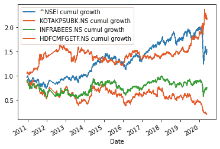
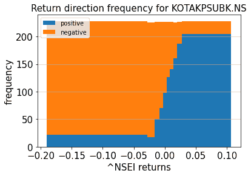
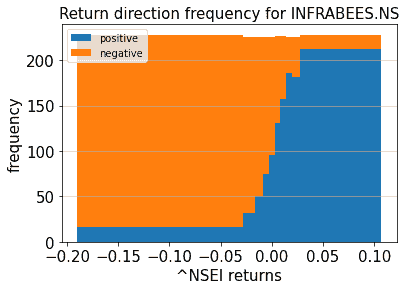
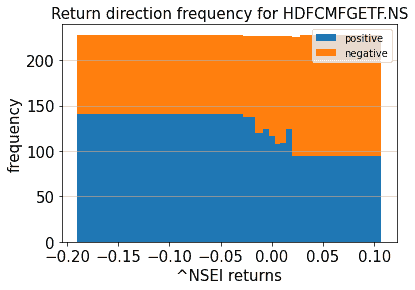
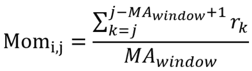
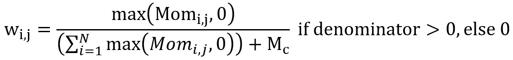
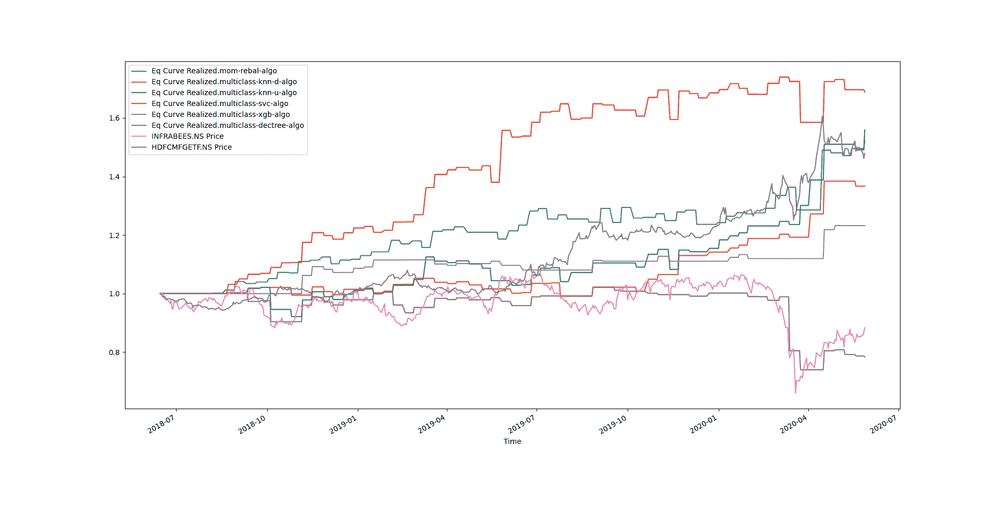
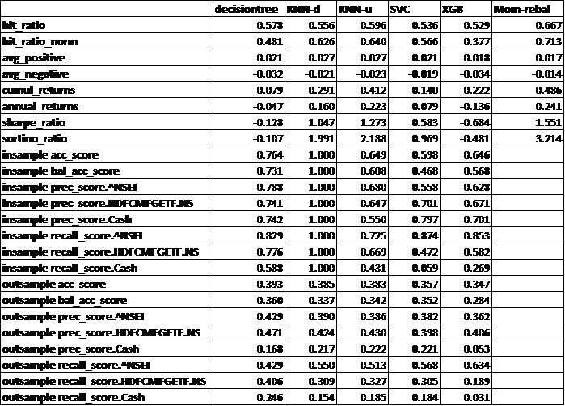
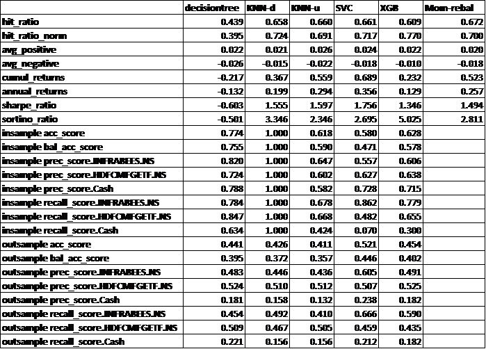
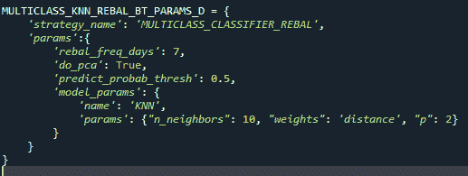

# 仅做多、低频率的资产分配算法

> 原文：<https://blog.quantinsti.com/long-only-low-frequency-asset-allocation-algorithms-project-vivin-thomas/>

了解和学习，你如何能够专注于算法，利用机器学习的核心来做出资本分配的选择。你可以想出一个低频策略，定期在预先选定的一组基础资产(篮子资产)中优化配置其主要资本。

通过这个过程，您可以创建只做多头、低频率的资产分配算法。除此之外，你还将学会根据普通的分配策略来衡量这些，普通的分配策略仅仅依靠经验的[动量指标](/momentum-trading-strategies/)来做决定。

这个项目中使用的完整代码的链接可以在文章末尾找到。

本文是作者提交的最后一个项目，作为他在 QuantInsti 的算法交易管理课程( [EPAT](https://www.quantinsti.com/epat) )的一部分。请务必查看我们的[项目页面](/tag/epat-trading-projects/)，看看我们的学生正在构建什么。

* * *

## 关于作者

<figure class="kg-card kg-image-card"></figure>

[Vivin Thomas](https://www.linkedin.com/in/vivin-thomas-7885a2130/) 是金融服务行业的一名定量分析师，常驻印度孟买。他在量化金融领域积累了 9 年的专业经验，涵盖衍生品定价和风险。

他在多个职位和组织中成长，特别是近年来在两家全球知名的投资银行担任副总裁。Vivin 拥有 IIT 马德拉斯大学的工程学士和硕士学位。Vivin 还自豪地获得了 EPAT 卓越证书。

* * *

## 项目摘要

*   这个项目的目的是提出一个低频策略，可以在预先选定的一组基础资产(篮子资产)中定期优化分配其主要资本。
*   这种算法/策略有许多选择。在这个项目中，我们主要关注那些在其核心利用机器学习为我们做出资本分配选择的算法。在这方面使用了一套机器学习算法，并将每一种算法与另一种算法进行比较。
*   为了确保我们有一个合适的基线，我们还尝试提出一个“基于规则”(即非 ML)的分配方案，主要用于比较目的。这将有助于理解 ML 算法与基于规则的算法相比是否确实提供了一个可见的优势。
*   我们如何选择底层资产也是一个重要的考虑因素，尤其是篮子中的资产数量。这将在下一节中详细讨论。

* * *

## 项目动机

这里的想法是提出一个只做多的资产配置策略，在预先确定的一篮子基础资产中优化地重新分配其当前资本。

这种重新分配也称为重新平衡，以固定的频率发生，在我们的例子中选择为 7 天。这个想法是明智的分散投资——也就是说，当我篮子里的一项资产表现不佳时，我希望篮子里的其他资产通过显著的优异表现来“缓冲”它。

分配可以是部分的，也可以是全部的，即在一个再平衡期内。我们可以选择将我们的全部资本分配给篮子中的一项资产，或者根据我们的算法预测，在即将到来的再平衡期间，将部分财富分配给篮子中的每项资产。

我们做多的原因只是为了复制传统基金/投资组合的简单性。做空作为一个概念可能不容易被大多数(不那么老练的)散户投资者理解，他们可能希望投资于你的基金，这可能会使他们不太愿意投资。

简单也是我们试图将重新平衡频率设置为合理值的原因。极低的频率会让我们很难做出准确的预测(预测一天的表现比预测一年的表现相对容易)。

另一方面，极高的频率会带来巨大的交易成本和滑点，从而减少我们的整体回报。自然，我们可以在回溯测试中引入交易成本，并对再平衡频率进行“优化”。

然而，我们将这一讨论排除在范围之外，因为它会给我们已经很高维的优化问题增加一个额外的维度(我们将在后面看到)

* * *

## 篮子底层的选择

如前所述，为本次演习选择的底层的数量和确切名称也是一个重要的考虑因素。

我们的目标是首先提出我们认为的“类别”的定义，然后为每个类别选择合理的代表性资产。

类别可以基于行业(制药、IT、基础设施、金融等)，也可以基于资本(大、中、小盘)，或者基于资产类型(股票、债券)。我最终选择了第一个定义。这种选择是任意的，可以对任何其他类别定义执行相同的算法(尽管有不同的最佳参数)。

选择修正这个定义是为了确保设置的简单性。出于同样的原因，我决定选择交易所交易基金来代表每个行业，而不是进行另一项复杂的练习，为每个类别选择“正确的代表性股票”。

这将额外确保股票选择导致的特殊行为不会在我们的整体算法性能中发挥作用。

只是为了开始，除了纯粹的“现金”之外，我还选择了 4 只 ETF 作为最初的候选。这些交易所交易基金是

*   一只 PSU 银行 ETF (KOTAKPSUBK。NS)，
*   infra ETF (INFRABEES。NS)，
*   一只黄金 ETF (HDFCMFGETF。NS)和
*   Nifty-50 ETF(由于一些数据问题，我为此选择了^NSEI 指数。总的来说这个应该是可以的)。

考虑到我们的分析，每个 ETF 在整个期间实现的回报可以在下面找到。

<figure class="kg-card kg-image-card"></figure>

像这样一个相对较大的篮子(包括现金在内总共 5 个)有明显的缺点。当我们试图解决多类分类问题时，这些缺点变得更加严重。

分类器基于在整个集合中哪个标签被分配了最高的“预测概率”来进行预测。随着我们增加用于预测的标签数量，概率阈值自然会变小，从而增加了我们预测中的噪声，使其容易受到更多不正确预测的影响。

此外，如果在预测中使用“N”个技术指标作为特征(这里就是这种情况——我们将在后面的章节中看到),那么每增加一个资产都会导致在您的分类模型中增加 N 个新特征，这可能会导致模型过度拟合。

当我在这个大小为 5 的篮子上运行整个工作流(在后续部分中描述)时，这个假设也得到了非正式的证实。

获得的结果确实很差，这是我回去对资产选择进行更多分析的主要动力。

<u>分析背后的一些直觉可以在下面的</u>中找到:

*   要考虑的主要项目是反相关性。回想一下本节前面描述的“缓冲”概念。
*   有多个底层可供选择的原因是基于这样的假设:当你的基础底层(让我们以 Nifty 50 为例)表现不佳时，你有另一个底层可以“锚定”你的策略。
*   对于这样的行为，合理程度的反相关是必要的。如果你的集合中有两个底层是正相关的，那么期望其中一个“锚定”另一个是没有意义的。
*   对我们每一个底层投资者的 5 天回报率(任意选择以减少噪音)进行快速相关计算，得出以下结果

|  | ^NSEI |
| ^NSEI | One |
| KOTAKPSUBK.NS | Zero point six four |
| 红外线扫描 | Zero point seven |
| HDFCMFGETF。纳秒 | -0.10 |

(我截断了矩阵，但很明显，唯一与基础资产负相关的资产是[黄金。](/gold-price-prediction-using-machine-learning-python/))

*   我们可以形象化这种关系的另一种方式是，对于市场/基础底层投资者(Nifty 50)的给定回报值(超过 5 天，任意选择)，绘制其他底层投资者之一给我们带来正与负回报(频率)的频率。
*   粗直方图可视化可以在下面找到。

<figure class="kg-card kg-image-card"></figure>

<figure class="kg-card kg-image-card"></figure>

<figure class="kg-card kg-image-card"></figure>

*   正如你所看到的，黄金 ETF 比其他两个基金有明显的优势——当市场产生负回报时，黄金产生正回报的可能性超过 50%。该轮廓实际上与其他 2 个轮廓完全相反

这是当我决定截断我的初始基础清单，只包括 3 个，包括现金。黄金交易所交易基金必须在名单上，因为它是唯一一种与其他资产呈负相关的资产。

另一个可以选择剩下的三个中的任何一个。我选择讨论使用 Nifty-50 和 Infra ETF 获得的结果，以便可以在一个以上的场景下评估算法的适当性。

**算法描述** -基于规则和基于分类器的资产分配模型将在以下小节中详细描述

* * *

## 基于动量的资产配置(基于规则)

想法是在每个再平衡日期计算每项资产的指标，并为每项资产分配与该指标成比例的可用资本的一部分。

在这种情况下，我试图提出一个反映资产潜在动力的指标。这个想法是，如果一个资产开始建立势头，它将在一个合理的时间框架(时间范围)内平均朝着那个方向发展。

对于我们的案例，我们感兴趣的时间范围是 7 天(之前讨论过)。动量指标越高，趋势可能越强，我们应该考虑分配的份额越高(如果趋势为正)。

如果一项资产的动量/趋势指标为负，那么我们的算法应该确保它不会得到分配。如果所有的资产都是负动量，那么我们应该简单地什么都不分配给我们的篮子，而是把我们所有的资本都作为现金储备。

我决定采用的动量指标是过去几天收盘时的简单平均回报率。该指标是试探性得出的(即，没有文献必然支持该特定计算优于其他动量指标的优势)。

<figure class="kg-card kg-image-card"></figure>

在哪里，

Mom i，j 是截至第 j 个交易日观察到的篮子中第 i 个资产对应的动量度量，

r k 是从第(k-1) 日到第 k 日日的收盘价百分比收益。

MA window 是我们要计算平均回报率的历史日期数。

**这是模型**的超参数之一。

在每个重新平衡日，分配给每项资产的权重计算如下。

<figure class="kg-card kg-image-card"></figure>

在哪里，

w i，j 为截至第 j 个交易日第 i 项资产对应的权重

Mom i，j 已经在上面定义了，并且

M c 是我们赋予现金的默认动量值。

M c 是我们模型中的第二个超参数。

请注意，对于所有篮子资产都为 0 或动量为负且 M c 设置为 0 的情况，所有权重都自动分配为 0，正如我们在上面的等式中看到的那样。

w i 在每个再平衡日进行计算，我们从中获得需要分配给资产 I 的近似资本。

然后，我们用这一近似资本除以该资产的当前收盘价来计算股票数量。这个数字被四舍五入到最接近的整数，以得到实际的股份数，我们可以从中获得实际分配的资本。

所有资产的实际分配资本相加，该总额与再平衡日的总资本之差就是剩余的现金量。

给定再平衡日分配给每项资产的股份数量与其前一个再平衡日的股份数量之差就是在该再平衡日需要买入/卖出的股份数量。

很明显，这是一种*分数*分配策略。我们也可以把它转换成一种*整体*分配策略，简单地把我们所有的资本分配给具有最高动量的资产。

但是为了这个分析的目的，我们保持分配分数。

* * *

## 多类别 ML 资产分配

在这里，我们不会根据规则做出任何决定。相反，我们训练一个多类分类模型来代表我们做决策。

请注意，为了保持简单性，这种 ML 分配策略在*整体*模式下运行，即在每个再平衡期开始时，我们的全部资本将被分配给该期间被认为是预测的*赢家*的资产。

预测(因变量)被称为*赢家*。在任何一个任意的观察日，我们都会观察每种资产在再平衡期间的累积未来回报。

具有最高累积回报的资产被指定为该日期的*中奖证券*(注意，现金的累积回报被假定为 1)。

作为本练习的一部分，预测变量可能属于以下两组中的任何一组:{INFRABEES。NS，HDFCMFGETF。NS，Cash}或{^NSEI，HDFCMFGETF。NS，Cash}

自变量或特征的选择可以是多种多样的。我们选择了 talib 上可用的标准技术指标(特别是 MACD、7 天 ROCP 和 RSI)。

我们如何选择指标的确切类型和数量将在随后的章节中讨论。

正如任何好的机器学习练习一样，我们首先将整个数据集分为训练、验证和测试数据集。我选择 60-20-20 作为分成。上面提到的技术指标(特征)与*获胜标记*一起被填充到篮子中的每个资产，即预测变量。

可以选择多种分类模型来拟合数据并进行后续预测。传统分类模型，例如:

*   k-最近邻居，
*   支持向量分类器，
*   决策树，
*   逻辑回归，
*   岭回归，
*   朴素贝叶斯——永远是第一选择。

如果传统分类器的性能没有达到标准，那么可以利用 boosting 或 bagging 技术——可以尝试 bagging 和 boosting 原生分类器、随机森林、xgboost 等。

在极端情况下，如果其他方法都失败了，我们还可以利用神经网络分类器作为最后的手段。

要注意的一点是，虽然分类器的预测能力会在每个重新平衡期开始时调用一次，但训练和验证本身是在每日历史时间序列的每一天进行的。

为了保持训练和验证数据集的粒度等于回溯测试而进行的下采样是不必要的，并且只会导致样本量的减少。

* * *

## 基础设施设置

代码尽可能以模块化的方式建立。这样做是为了确保出于实验目的而需要进行的微小更改/添加不会导致实现核心功能的代码发生变化。此外，git 中的整个代码库都有版本控制。

<u>基础设施的显著特点/组成如下:-</u>

### lib .引擎

在 lib.engines 中可以找到许多可以跨多个策略重用的核心功能。这包括各种历史数据生成器、模拟器和策略“接口”,以促进鸭子分型。

选择接口样式是为了确保任何被编码的策略都必须实现某些关键方法，以便它们可以在通用的回溯测试程序或优化程序脚本中被调用。

这些方法包括但不限于从/向数据库/文件读取/写入相关市场数据、将算法执行的结果写入数据库/文件、更新指标、信号发生器、下单、绩效指标计算等。

### 自由策略

实际的策略(类)可以在 lib.strategies 中找到。每个策略都应该从 lib.engines 中定义的一个接口继承，以确保它们可以被公共的 backtester 或 optimizer 函数调用。

这些类需要实现上面列出的所有方法，以及任何其他定制的方法，具体取决于策略功能。

### lib .配置

各种策略配置与 lib.configs 中的核心策略实现保持完全分离。

有一个优化器配置，它存储策略超参数的数组/组合，策略需要在这些参数上进行优化。

另一个配置存储特定运行的超参数设置，使用其自己的 run_name 标识符字符串等进行唯一标识

### lib .示例

可执行文件可以在 lib.examples 中找到。可执行文件可以是优化器脚本，可用于对优化器配置中定义的多个参数配置顺序运行测试+验证。

有一些回测脚本会根据提供的 run_name 输入来运行回测，以帮助确定它需要在哪个特定的配置上运行。优化器和 backtester 脚本都将逐条执行细节和相应的性能指标保存到 file/db 中。

还包括了一个“绘图仪”可执行脚本，该脚本可以绘制多个策略性能之间的相互关系。我们只需要指定文件/表名，绘图仪可执行文件会完成剩下的工作。

这些可执行文件中的每一个都以某种方式实现，以便能够通过命令行调用运行，并具有可通过参数指定的多种配置。

### 图书馆实验

lib.experiments 文件夹，顾名思义，包括对任何其他文件都有最终影响的特定实验代码。

该文件夹中的脚本包括用于运行上述相关性分析的脚本、各种移动平均线的试验脚本和另一个 PCA 试验脚本。

### utils script

lib 中有一个独立的 utils 脚本。除了在整个项目中使用的帮助器函数之外，该脚本还包含基于通过配置提供的输入参数分配和拟合适当的分类模型的函数。

最后，我在 batch 文件夹中添加了几个批处理文件，当我们希望按顺序运行多个回溯测试或优化器可执行文件时，这些文件非常有用。

* * *

## 结果分析

我们跳过讨论最终结果。为了得出最终构型而进行的试验和实验的顺序，将在下一节中讨论，这里已经给出了最终构型的回测结果。

这对于 ML 模型尤其重要，在 ML 模型中，测试和比较了数百种不同的配置，包括许多分类器，这些分类器甚至不包括在最终结果中，例如:

*   岭/逻辑回归，
*   袋装 KNN，
*   自适应增压等。

本分析所考虑的总时间段为 2010 年 10 月 5 日至 2020 年 5 月 29 日。对于 ML 模型，训练-验证-测试的比例是 60-20-20。

对于基于规则的动量分配器，这一比例是 80-20，因为没有训练阶段，只有优化阶段。

* * *

## 原始结果

{^NSEI 测试期间的策略比较。NS}可以在下面看到:

<figure class="kg-card kg-image-card kg-width-full"></figure>

{ infra bees }测试期间的策略比较。NS，HDFCMFGETF。NS}可以在下面看到:

<figure class="kg-card kg-image-card kg-width-full"></figure>

下面显示的是{^nsei hdfcmfgetf 的每个单独策略的性能统计数据。NS}:

<figure class="kg-card kg-image-card kg-width-full"></figure>

下面显示的是{ infra bees }的每个单独策略的性能统计数据。NS，HDFCMFGETF。NS}

<figure class="kg-card kg-image-card kg-width-full"></figure>

* * *

## 评论

*   基于规则的动量再平衡策略似乎是所有考虑的策略中最一致的。在这两种情况下，其在测试阶段的表现至少等于所考虑的资产对中表现最好的资产。
*   在最大似然模型中，我发现具有均匀权重的 KNN 分类器给出了最稳定的结果。与基于规则的策略一样，在测试阶段，这两种情况下的性能几乎与表现最好的资产的性能相匹配。此外，一般来说，与基于距离的权重的 KNN 相比，具有统一权重的 KNN 是更好的选择，因为后者的结果会严重偏向在欧几里德距离方面与其“最接近”的训练数据，从而使其对噪声非常敏感。
*   最佳[决策树](https://quantra.quantinsti.com/course/decision-trees-analysis-trading-ernest-chan)模型在这两种情况下表现都很差，可以放心地不予考虑。XGBoost 分类器也是如此。
*   SVC 在第二个案例中表现出色。当您将 SVC 的得分与其他明显优于它的得分进行比较时，这是有意义的。但是，第一种情况的性能相当一般。选择一种性能依赖于数据对的实际选择的策略可能不是一个好的决定，因为这可能会被认为是一种迹象，表明该策略在不同的制度下可能无法很好地工作。
*   很难确定合适的分数/指标如何转化为战略绩效。但是有几个有趣的地方需要记住:
*   一般来说，样本内度量越接近样本外度量，性能越好。差异(如极高的样本内得分和极低的样本外得分)表明过度拟合。例如，对于决策树分类器(对于所选择的“最优”超参数)，散度看起来通常更高。在这两种情况下，该分类器的表现也往往不如其他分类器。
*   一般来说，对于那些预测正确性/准确性更均匀地分布在所有 4 个类别中的配置，可以看到策略性能更好。同样优选的是，在同一个类中，精确分数和召回分数均匀分布。KNN 似乎在这方面做得很好，因此我们认为它在这两种情况下的表现相对更稳定。另一方面，我们注意到在第一种情况下运行的 XGB 分类器的 cash 得分较低，这可能会导致性能下降。这也是我们在使用 SVC(尤其是第二种情况)时应该三思的原因，因为它对现金的简单回忆分数相当低。

* * *

## 帮助 ML 模型公式化的实验

在下一节中，我们将讨论在最后的回溯测试阶段之前我需要运行的许多实验中的一些。

* * *

## 特征选择

在最大似然模型的情况下，最重要的练习之一是提出一组适当的特征来进行预测。

我们最初用人工计算的特征来表示短期动力、短期风险、长期动力和长期风险。

*   “短期”由 10 天的滚动窗口任意表示，而“长期”由 100 天的滚动窗口任意表示。
*   “动量”由在所选时间窗口内计算的收盘价到收盘价的平均值表示。
*   “风险”由在所选时间窗口内计算的收盘价收益的标准差表示。

这些指标是针对篮子中的每项资产计算的。因此，如果我们选择在篮子中有 N 项资产，我们最终会有 4*N 个特征。

我们从上述公式转向另一个基于 TA-lib 指标的公式。这些指标数量众多，但可以分为几个功能组，例如:

*   势头，
*   音量，
*   波动性，
*   周期指示器和
*   模式识别指示器等等。

最初的想法是从每组中选择 1-2 个有代表性的指标——ADX、MACD、RSI、ROCP、ATR、OBV。

然而，如前所述，假设每个这样的指标将被添加到篮子中的每个资产，每个新的指标将有效地增加“N”个特征集。

任何回归/分类问题中的大型特征集都会遭受众所周知的缺点，例如过度拟合。因此，将特性集最小化为最重要的特性是必要的。

也许最直接的方法是利用 sklearn.feature_selection 模块中的众多算法之一，例如 RFE。

然而，我决定采用一种相对更加手动的方法，一个接一个地明确添加特征，并选择那些在 insample+outsample 拟合质量方面提供最大增量(定性)改进的特征。

这原来是 MACD，RSI 和 7 天 ROCP。请注意，这些指标是为篮子中的每项资产计算的。

* * *

## 特征约简

上面选择的 3 个 TA-lib 指示符仍然意味着我们最终有 6 个(3*N，其中 N=2)特征来运行我们的分类。很难断定我们的配方是否容易过度拟合。

不管是不是，理解我们选择的特征是否可以被分解成更少的组成部分仍然是一个好的实践，通过这些组成部分我们可以解释总方差的大部分。这可以通过简单的 PCA 来实现。

在通过 PCA 运行之前，我们首先对每个特征分别应用 StandardScaler()变换。这将有助于确保通过将所有要素转换为单位方差和 0 均值变量来均衡它们。

我们还可以指定一个方差阈值(默认值为 95%)来帮助降低特征集的维数。训练/验证/测试是在转换+缩减的特征集上进行的。

* * *

## 特征标准化

一般来说，在传统的分类/回归问题中，已经根据经验观察到归一化产生更好质量的拟合。

因此，最好将此作为一个选项——在标准化前后生成拟合质量，并观察标准化后是否有任何显著的改进。

代码以这样的方式实现，以便能够轻松地应用 sklearn 中任何可用的规范化例程。在这个练习中，我选择了“QuantileTransformer”。

如果归一化后拟合质量没有显著提高，那么最好恢复到非归一化数据集。

* * *

## 价格平滑

众所周知，金融数据具有很高的信噪比。因此，我们试图拟合金融数据的任何最大似然模型都会自动地更容易受到噪声的影响。

一种可能规避这个问题的方法是通过应用任何合适的移动平均或频率过滤器来平滑价格数据。虽然这种应用可以增加 SNR(并且因此稳定分类模型的方差)，但是捏造特征值本身可能引入偏差和/或响应延迟。

因此，如果我们在应用平滑后没有观察到任何显著的改善，那么最好是恢复到原始的时间序列。

我通过局部更改代码，以特别的方式(即，不像其他一些实验那样，通过配置支持平滑的无缝应用)尝试了 EMA、d EMA、MAMA、SMA、WMA。

合体质量没有显著改善。事实上，我观察到性能略有下降。因此，决定继续使用原始价格数据。

* * *

## 样本加权

对于市场状况良好的样本来说(在再平衡期间，每项资产的波动都很小)，有可能*的赢家*更难预测。

此外，在这种市场情况下，把*中奖股票*搞错也没什么大不了的，因为这种失误的成本也相对较小。然而，来自上述良性市场的样本可能会增加我们模型预测的可变性(噪音样本？).

此外，在市场剧烈波动的情况下，做出正确的预测自然更为重要，因为市场剧烈波动会导致错误预测的高昂代价。

记住这一点，我们包括了通过“错误预测的成本”来缩放样本的能力。通过计算*中奖股票*和其他股票(包括现金)之间的收益差的平方和，计算每个样本的成本。

差值越高，权重越大。因此，来自更不稳定条件的样品将被赋予更大的权重。

希望这也意味着对高影响情景的预测更加准确。

该实现允许用户能够指定是否应用该加权方案。样本权重的计算本身是硬编码的(如上所述的 L2 式加权)。

请注意，并非所有分类器都支持应用样本权重。在实验过程中，我确实观察到一些分类器模型在样本加权的情况下表现得更好(就整体策略表现而言)。

* * *

## 预测概率阈值应用

所有分类器预测都有一个相关的“预测概率”,它代表预测的确定性。自然，预测概率越高，确定性就越高。

在多类分类问题中，例如我们在此尝试解决的问题，类越多，将它指定为预测特征所需的典型概率就越低。

例如:
如果只有 2 个类别可供选择，则被指定为该样本的预测类别的类别的预测概率需要大于 50%。
如果有 3 个类，那么有可能 34%就够了等等。
因此，当我们增加分类问题中可供选择的类别数量时，我们的预测可能会变得更加嘈杂，阈值也会变得更低。

规避这个问题的一个方法是减少我们运行预测的类集的大小。这正是 2.1 节中所执行的。

另一种方法是通过明确指定进行预测的最低阈值要求来引入一定程度的保守性。

例如，我们可以将概率阈值设置为 0.7，并且仅当预测变量的概率超过该阈值时，才将该预测变量指定为*赢家*。如果不是，那么我们将*现金*指定为该样本的*获奖股票*。

我考虑了 0.5、0.7 和“无阈值”作为优化的场景。这些值可通过配置来指定。

* * *

## 合成数据生成

我们通常只有有限的数据来训练和测试我们的模型。增加数据集大小的方法之一是运行模拟。然而，我们需要考虑股票扩散的潜在特征，如自相关、波动聚集等。你可以阅读更多关于[自相关和自协方差](/autocorrelation-autocovariance/)的内容。

对于多资产篮子，我们还需要额外考虑两两相关。总而言之，这项运动将会非常激烈。

此外，如果任何潜在的特征不被满足，并且我们结束了在这样的数据上训练我们的模型，那么我们的最终预测可能会失控。

因此，虽然我确实对合成数据进行了一些实验，但我确实记住了潜在的缺点。因此，通过合成数据获得的任何优化结果都没有在实际回测中使用。相反，它们仅用于“排除”测试。

例如，如果在实际历史数据上获得的最佳配置是在任何合成数据集上的最差配置，则该配置被排除在回溯测试之外。

此外，生成琐碎的数据集有助于消除代码中任何明显的错误。

例如，如果您输入合成对数据，其中一个资产总是在增加，而另一个却停滞不前(或减少)，那么您会期望 ML 分类器始终选择第一个资产。

或者，如果价格波动，但一个上涨，另一个下跌，反之亦然，那么你也会期望分类器在大多数情况下做出正确的预测。

我还实现了一个“数据混洗器”作为交叉验证的代理，它也主要用于排除测试。

* * *

## 最佳化

前面小节中描述的大部分功能都经过了优化。我们还根据正在优化的分类器对特定的超参数进行了优化。

运行优化的典型配置可能如下所示

<figure class="kg-card kg-image-card"></figure>

优化既在“全局”参数上运行，如“do_pca”、“predict _ probab _ thresh”等，也在“model_params”下定义的模型特定超参数上运行。

优化将在多维空间上运行，多维空间由每个单独的“优化”参数与其他参数的叉积定义。

功能选择、价格平滑和综合数据生成等具体实验是作为一次性练习进行的，并不意味着优化。

* * *

## 指标生成和比较

最后一步是在优化过程后选择最佳配置。

用于确定这种配置的机制将基于比较由每个配置生成的某些度量，并挑选出给出最佳结果的一个。

可在第 5.1 节提供的表格中查看指标列表。最重要的指标是性能指标，如命中率、归一化命中率、CAGR、夏普、索提诺等。

此外，对于最大似然模型，我们还生成对应于每个类别的总体准确度分数、精确度分数和召回分数，包括样本内和样本外。

从优化步骤后生成的数字堆中提出最佳配置是一项重要的任务。我决定保留这个流程手册。

大多数时候，我们可能倾向于选择具有最高夏普/索提诺和/或 CAGR 的配置。然而，大多数时候这种配置只是“幸运”的执行者。

这也是我决定在两个独立的篮子上进行这个练习的原因之一——{^nsei，HDFCMFGETF。NS}和{INFRABEES。NS，HDFCMFGETF。NS}。

一个合理的配置应该对两个篮子都有很好的表现。此外，正如 6.7 节所讨论的，它们不应该在合成数据上表现不佳。我们经常观察到，70-80%文件范围内的配置在各种场景中是最一致的。

* * *

## 结论

我能够从这个项目中得出的结论是，基于规则的动量再平衡策略在所有测试的配置中表现得最为一致。

原始结果可在第 5.1 节查看。优化结果相对更稳定，验证和测试数据集中的性能或多或少是一致的。

当谈到最大似然算法时，有相当大的空间来改进它的性能，特别是通过考虑以下一些附加因素

**经由隐马尔可夫模型(HMM)的状态识别**

基本上，我们试图将整个历史数据时期聚类成单独的状态(熊市对牛市，良性对波动性等)，并为不同的状态训练不同的模型。在回溯测试或实时交易中，我们需要首先识别制度，并使用专门为该制度训练的模型进行预测。

**更好的功能选择**

这些功能是从 TA-lib 上的可用选项中选择的。有可能存在比从历史价格得出的 TA-lib 指标更好的预测指标。我们可以考虑使用替代数据。

**稳健的合成数据生成**

尽管如第 6.7 节所述进行了尝试，但其应用仅限于将特定配置列入黑名单，而不是通过提供更多数据来提高现有模型的稳健性。这当然可以极大地提高模型的性能。

**优化再平衡周期和/或添加再平衡触发器**

我选择了一个合理的低重新平衡频率，并保持不变。回测性能极有可能随频率单调增加(分类模型预计会在更短的预测间隔内做出更准确的预测)。

然而，更高的再平衡频率会导致更高的交易成本。显然，我们可以增加交易成本作为参数，并优化再平衡频率，但这将增加一定程度的不确定性，因为这些成本不容易观察到。

此外，如果在再平衡期内，被选为*获奖股票*的资产表现差于表现最佳的资产一定幅度，我们可以添加触发器，以发出过早再平衡机会的信号。

这可能确保了我们尽快摆脱亏损头寸，而不必等到再平衡期结束。

**多头/空头**

这适用于基于规则的策略和 ML 策略。除了限制自己只做多或不做，我们还可以尝试做空我们预测在再平衡期间表现不佳(负回报)的资产。

这有可能通过利用股票“下跌”来提高我们的回报。此外，根据经纪商/交易所的不同，做多+做空可能会降低我们的总体保证金要求，从而也增加我们的总体回报。

* * *

**参考书目**

*   [Scikit Learn](https://scikit-learn.org) (了解并设置各种分类算法)
*   [TA-Lib](https://mrjbq7.github.io/ta-lib) (找到我在 TA-Lib 指示器周围的路)
*   [堆栈交换](https://stackexchange.com/)(用于学习)

* * *

如果你想学习算法交易的各个方面，那就去看看算法交易(EPAT) 的[高管课程。课程涵盖统计学&计量经济学、金融计算&技术和算法&定量交易等培训模块。EPAT 教你在算法交易中建立一个有前途的职业所需的技能。](https://www.quantinsti.com/epat/)[现在报名](https://www.quantinsti.com/epat/)！

**你可以在这里访问完整的代码:**

* * *

免责声明:就我们学生所知，本项目中的信息是真实和完整的。学生或 QuantInsti 不保证提供所有推荐。学生和 QuantInsti 否认与这些信息的使用有关的任何责任。本项目中提供的所有内容仅供参考，我们不保证通过使用该指南您将获得一定的利润。