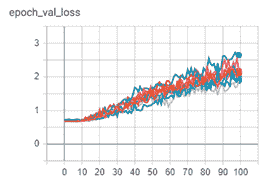
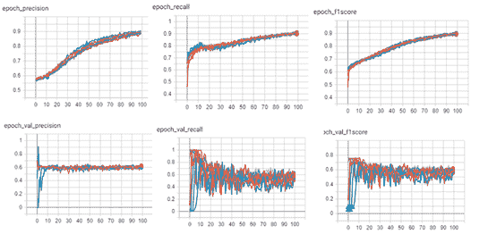
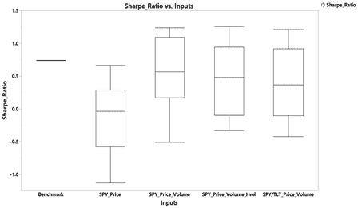
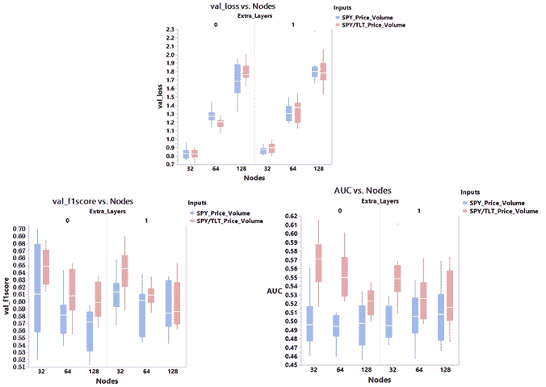
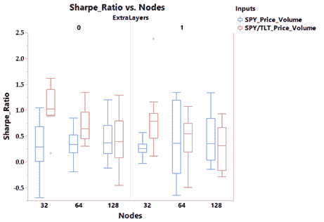
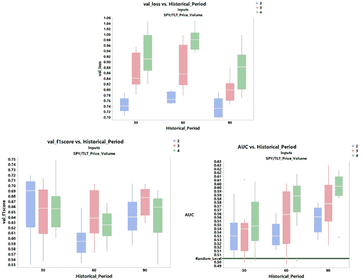
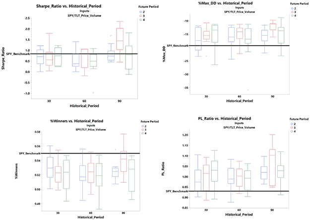
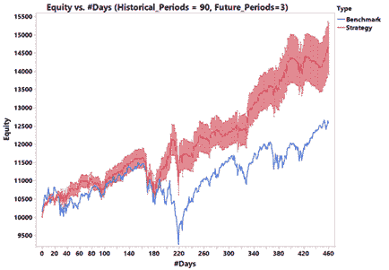

# LSTM 网络公司:他们能预测股票指数价格吗？

> 原文：<https://blog.quantinsti.com/lstm-networks-predict-price-project-krishna-tunga/>

在本文中，我们将研究一个基于递归神经网络的深度学习框架，以预测每日股票指数价格波动。具体来说，重点将放在长期短期记忆(LSTM)网络——这是一种递归神经网络。

将研究不同类型的输入和网络架构，以确定它们对可预测性的影响。我们将看到，通过投入和架构的适当组合，可以开发出夏普比率高于简单的买入并持有方法的策略。

还将强调与传统机器学习方法相比的差异、限制和需要考虑的因素。通读完这篇文章后，读者应该能够创建一个基于 LSTM 的基本神经网络[来根据公开可用的数据轻松预测任何工具的价格变动。](https://quantra.quantinsti.com/course/neural-networks-deep-learning-trading-ernest-chan)

本文是作者提交的最后一个项目，作为他们在 QuantInsti 的算法交易(EPAT ) 的[管理课程的一部分。请务必查看我们的](https://www.quantinsti.com/epat)[项目页面](/tag/epat-trading-projects/)，看看我们的学生正在构建什么。

* * *

## **关于作者**

Krishna Tunga 博士拥有 IIT-马德拉斯大学的学士学位，佐治亚理工学院的硕士和博士学位，都是工程学学位。他的兴趣领域包括半导体、可靠性和风险预测、建模和仿真、人工智能、机器学习、深度学习、金融和金融衍生品。

* * *

## **概述**

合理的预期是，股票指数会随着普遍和预期的宏观经济前景而变动。然而，诺贝尔奖获得者 Tversky 和 Kahneman[1]最近的工作表明，交易者和投资者普遍存在行为偏差，并可能导致价格波动持续几天、几周甚至几个月。这使得根据历史价格(和交易量)变化预测未来价格成为可能。

许多技术指标属于重叠指标、动量指标、波动性指标等更广泛的类别。已经被用于预测价格变动几十年了。

计算能力的最新进展使得使用传统的监督机器学习方法成为可能，如支持向量机、[决策树](https://quantra.quantinsti.com/course/decision-trees-analysis-trading-ernest-chan)、主成分分析、随机森林、集成方法等。通过使用几个技术指标的组合以及价格作为输入来预测未来价格。

上述传统机器学习方法的一个缺点是，它们都需要手动挑选指标，基于所挑选的指标具有预测能力的预先假设，预先计算它们，然后在机器学习模型中使用它们作为独立预测器。

这种假设可能不总是正确的，并且不可能通过反复试验来确定一组理想的独立预测值，因为要测试的这种可能组合的数量理论上是无限的。

递归神经网络(RNN)是一种有监督的机器学习方法，可以潜在地解决这个问题。Christopher Olah[2]已经提供了一个很好的关于 RNN 的理论概述，本文不做讨论。

RNN 概念的核心是一个拥有基于历史价格变化的持久内部状态的单元。该单元首先被初始化为随机状态，并以价格(或数量或任何其他适当的数据)的形式接收输入数据，这些数据以确定和规则的时间间隔顺序地输入到该单元中。

当每个输入数据被一个接一个地馈送到该单元时，该单元的状态改变，并且该改变的状态在下一个时间序列与新的输入数据一起被传送回该单元。因此，单元的状态基于其先前的状态和新的输入数据不断地随时间变化。

因此，输入数据中的所有历史移动都以某种方式被单元“理解”,并由其当前状态来表示。因此，无需基于假设预先单独计算所有技术指标，并将其作为预测值输入到模型中，但如果需要，也可将其添加到输入数据中。

长短期记忆(LSTM)网络是由 Hochreiter & Schmidhuber 于 1997 年提出的。LSTMs 除了像 rnn 那样的短持续时间依赖性之外，还可以学习更长持续时间的依赖性。他们能够通过引入三个门(遗忘门、更新门和输出门)来实现这一点，这三个门分别规定:
a .应该保留的单元的先前内部状态的部分，
b .应该保留并添加到先前内部状态的新输入数据和先前输出数据的部分，
c .应该用于确定输出并与当前内部状态一起传输到下一个单元的当前内部状态的部分。

通过将具有已知历史输入的模型拟合和校准到已知输出标签或标签值来确定这些分数。当然，这是对 LSTMs 非常简单的概述。关于更详细的解释，建议读者阅读参考文献[2]。

所有这些都带来了额外的计算成本。因此，LSTMs 在计算上是昂贵的，并且在具有足够 GPU 核心的机器上运行这些模型将是有帮助的。

* * *

## **数据和基础网络描述**

在这项研究的第一部分，我将首先使用一个基本的 LSTM 网络，如下图 1 所示，使用前 3 个月的价格数据作为输入，预测未来 3 天的 SPY 指数的平均每日回报，所有这些都基于调整后的收盘价。整个网络是用 Keras 库和 Python 3.7 编写的。

这项工作使用的输入数据是从*雅虎*下载的从 1998 年 1 月 2 日到 2019 年 12 月 19 日的 SPY 指数的每日价格回报。前 90%的历史数据用于训练网络，后 10%的数据用于验证。

通过使用 *StandardScaler()拟合和转换训练集，训练集的返回数据被转换为 z 分数。来自 *sklearn.preprocessing，*的 fit_transform()* 函数，然后将它们用作模型的输入。

使用根据训练集数据确定的拟合平均值和标准偏差来转换验证集的返回数据。

Figure 1\. LSTM Base Structure

基础结构有两个 LSTM 层。两层的电池状态和电池输出使用 64 个节点表示。两层的初始单元状态(状态 1 0 和状态 2 0)和单元输出(输出 1 0 和输出 2 0)被设置为由 *Keras* 提供的默认选项。

第 1 层将过去 60 天的 fit 转换的历史价格回报数据作为输入，如前所述。

来自层 1 的输出被馈送到具有 20%下降的下降层，以减少过度拟合和对该层内仅少数节点的过度依赖。

来自漏失层的输出被馈送到一个批量标准化层，以避免协变偏移影响模型。

批量标准化也有轻微的正则化效果，这有助于减少过度拟合。来自 LSTM 层 1 的输出被馈送到 LSTM 层 2，随后是另一个丢弃和批量标准化层。

来自第二 LSTM 层的最后一个单元的输出随后被馈送到具有 32 个节点的密集层中，其后是整流线性(ReLu)激活函数，已知该函数可以提高学习速率。

然后，来自该密集层的输出被馈送到只有一个节点的最终输出层，随后是提供 0 和 1 之间的输出值的 Sigmoid 激活。

将 Sigmoid 函数的输出与真实输出进行比较，并使用*“二元交叉熵”计算模型损失。*真实的输出是接下来 3 天的平均每日回报的二进制版本，如果回报为正，输出设置为 1，如果回报为负，输出设置为 0。

*Keras* 自动执行反向传播，以尽量减少训练数据的损失，并相应地确定权重。具有默认学习率 0.001 和学习率衰减 1e-6 的 Adam 优化器用于拟合模型。该模型运行 100 个时期，批次大小为 128。

* * *

## **基础网络结果**

LSTM 网络使用反向传播来获得最佳权重。整个过程在本质上是随机的。这在估计的权重和预测的输出中带来了一些随机性。

用于初始化单元状态和权重矩阵的随机权重的选择也引入了随机性。输出的随机性是神经网络的缺点之一，当模型的拟合损失较低时(或当拟合精度较高时)，输出的随机性通常会降低。

在这项研究中，为了消除随机性并消除非确定性部分，相同的模型运行了 10 次。来自 10 次运行的输出的平均值和偏差用于评估拟合模型的质量和有用性。

Epoch loss

Figure 2\. Training set and Validation set loss vs. Epochs

图 2 显示了训练集(左图)和验证集(右图)的模型拟合的损失变化，该变化是训练的时期数的函数。

带有 Adam optimizer 的反向传播在减少带有训练集数据的拟合模型的损失方面做得很好。然而，当将拟合的模型与验证数据一起用于验证时，我们可以看到损失随着时期的数量而增加，并且显著高于用训练集观察到的损失。

由于损失没有最小化，我们还可以看到 10 个不同模型运行之间的损失有相当大的变化，达到大约 10%的标准偏差。所有这些都表明，模型很可能过度适应了定型数据，因此没有很好地处理验证集。

但是，请记住，对于信号产生，我们不一定需要模型具有低水平的损耗或高水平的精度。如果模型可以产生准确率超过 50%的好信号，如果正确信号的收益高于错误信号的亏损，那么它仍然是有利可图的。

所用的 LSTM 模型基本上是一个二元分类器，它输出一个介于 0 和 1 之间的值，然后分别对卖出信号(负)和买入信号(正)离散化为 0 或 1。

这意味着我们可以查看其他指标，如精确度、召回率(敏感度)和 f1 得分，来评估模型的性能。精度表示模型预测的买入信号中实际上是真实买入信号的部分。回忆量化了模型预测真实购买信号的有效性。

换句话说，它表示模型正确预测的真实买入信号的比例。F1score 是精确度和召回率之间的调和平均值，将这两个指标合并为一个指标。如果这三个指标都大于 0.5，则该模型有可能盈利。

图 3 给出了显示训练集和验证集的所有三个度量的变化的图。

Figure 3\. Precision, recall and f1score for the training and validation set‌‌

所有三个度量都随着训练集数据的历元数而增加，并且在 100 个历元的训练中大于 0.9。然而，当使用验证数据进行测试时，这些指标明显较低，并且似乎在大约 50 个时期时达到平稳状态。然而，平均平台水平高于 0.5，表明该模型可能仍然有用。

除了我们已经在使用的间谍价格数据输入之外，让我们通过添加更多的输入来尝试改进模型预测。下面给出了我们将用于进一步研究的输入列表:
a .仅间谍价格数据(基本情况)
b .间谍价格和数量数据
c .间谍价格和数量以及历史波动数据
d .间谍和 TLT 价格和数量数据

交易量数据的转换方法与价格数据的转换方法相同，即首先根据每日收盘价转换成百分比变化值，然后使用 *sklearn* 的 *StandardScaler()* 函数进行拟合和转换。

使用根据训练数据确定的拟合平均值和偏差来转换体积的验证数据。使用上月价格的标准差计算历史波动率。在将历史波动率值用作模型的输入之前，使用上述拟合和转换方法将其转换为 z 得分。

美国国债在历史上一直是避险期间的避风港，投资者通常会将资金从股市撤出，投入债券市场。因此，至少在过去几十年里，美国国债与美国股票指数呈负相关。

与美国长期国债的负相关性更强。因此，作为最后一个案例，我添加了 20 年以上长期国债 ETF——TLT——的价格和交易量数据作为额外的输入(案例 d ),看看我们是否能获得一个更好的预测模型。

我们将查看上述所有四种情况的验证数据集损失和 f1 得分，并进行比较，以了解添加额外输入是否有帮助。此外，我们还将对上述四种情况下的受试者工作特征(ROC)曲线下面积(也称为 AUC)进行比较。

ROC 曲线通常用于通过绘制不同阈值水平下的收益与成本来选择最优的二元分类器系统。收益等于模型正确预测的阳性比例(真阳性率或灵敏度)，成本等于模型错误预测的阴性比例(假阳性率或 1-特异性)。

随机二元分类器将给出 0.5 的 ROC 曲线下的面积。因此，为了让模型比随机分类器更好，我们希望 ROC 曲线下的面积大于 0.5——越高越好。

图 4 给出了显示 100 个时期后上述四种情况的验证数据集损失、f1 得分和 ROC-AUC 的均值和标准差(来自 10 次模型运行)的图。

除了价格数据之外，包括交易量数据导致 f1 得分和 ROC-AUC 得分非常微小的增加，代价是损失略高。ROC-AUC 仍然低于 0.5，使得该模型仍然不是非常有用。除了交易量数据之外，增加历史波动性数据不会改变 ROC-AUC 平均值。相反，它导致 f1 分数略微下降，使模型略微变差。

由于历史波动性是从价格数据中得出的，除了价格数据已经提供的信息之外，添加这些数据可能并不能真正提供任何额外的信息。如果使用隐含波动率，而不是使用历史波动率，性能可能会更好。

然而，这项工作中没有研究这一点。包括 TLT 的价格和数量数据确实导致了 f1 评分和 ROC-AUC 值的增加。ROC-AUC 值等于或高于 0.5，即使包括一个可能变异的标准偏差。

当用作输入时，损失也低于单独使用 SPY 价格和数量数据时的损失。

Figure 4\. Loss, F1 score and AUC for the validation data set‌‌

上述所有四种情况的拟合模型与验证数据集一起使用，以每天生成买入/卖出信号，然后用于做多或做空间谍指数 ETF。

图 5 比较了买卖信号产生的股票曲线的夏普比率。假设交易的每日收盘价和佣金为零。用于比较的基准是 SPY 指数值(调整后的收盘价)。

从图中可以看出，仅使用价格从 LSTM 网络生成买入/卖出信号会导致性能下降，即使在包括 10 次模型运行的偏差后也是如此。

包括交易量或历史波动性或 TLT 价格/交易量数据可以极大地提高性能。但是，从统计上看，这三种情况并没有太大的区别。此外，从统计数据来看，夏普比率似乎并没有比基准更好。

接下来，我们将看看是否可以通过改变 LSTM 网络架构来提高模型性能。

Figure 5\. Sharpe ratio comparison for four input cases

* * *

## **网络架构变化**

有几种方法可以改变 LSTM 网络结构，包括但不限于，改变 LSTM 层的数量，改变代表单元状态和单元输出的节点数量，改变密集层及其节点的数量，改变 LSTM 层和/或密集层内的激活函数等。

我们将关注可能会显著影响网络性能的两个关键变化:
a)在现有的两个层之外添加一个额外的 LSTM 层
b)在每个 LSTM 层中使用三种不同的节点大小:32、64(当前)和 128。

我们将比较相同的三个关键指标——损失、f1 得分和 ROC-AUC——以及上一节中列出的最后两个案例的夏普比率，即作为输入的间谍价格/数量数据和作为输入的间谍/TLT 价格/数量数据。

图 6 显示了 50 个时期后，每个场景运行 10 个模型的关键指标的比较。增加一个额外的 LSTM 层不会明显改变验证数据丢失、f1 评分或 ROC-AUC 评分。

然而，减少每个 LSTM 层中的节点数量确实产生了巨大的影响。随着节点数量的增加，模型很可能会过度拟合数据，从而导致更高的损失。

随着节点的减少，损失显著减少，f1 得分显著增加，特别是当使用间谍/TLT 价格/交易量数据作为输入时。随着节点的减少，ROC-AUC 评分仅在 SPY/TLT 价格/交易量用作输入数据时有所改善。因此，从所有三个指标来看，具有 32 个节点且未添加额外层的 LSTM 网络是最佳配置。

Figure 6\. Effect of an additional LSTM layer and LSTM node count on metrics

图 7 显示了根据使用这些不同的 LSTM 配置生成的权益曲线确定的夏普比率的比较。

当间谍和 TLT 数据都被用作输入时，夏普比率随着更少的节点而提高，当没有额外的层被添加到 LSTM 网络时，提高最高。

具有 32 个节点且没有添加额外层的配置再次看起来是最佳选择。

Figure 7\. Effect of an additional LSTM layer and LSTM node count on Sharpe ratio

* * *

## **历史和未来期间变化**

到目前为止所做的分析侧重于使用过去 3 个月的历史价格/交易量数据来预测未来 3 天的平均每日回报。

在这一节中，我们将研究如何改变这两个参数，看看是否可以进一步提高模型的可预测性。我们将了解三个不同的历史时期——30、60 和 90 个工作日——以及三个不同的未来时期——2、3 和 4 个工作日。

节点数量保持在 32 个。模型运行 50 个时期(因为所有的验证度量在大约 50 个时期后达到平稳状态),并且为每种情况运行 10 次这样的模拟，以确定所有度量的平均值和标准偏差。

图 8 显示了 50 个时期后验证数据的关键模型度量的曲线。ROC-AUC 评分随着更长的历史持续时间和更长的未来持续时间而改善，最高平均值接近 0.6。

然而，这也是以更高的损失为代价的。f1 得分似乎没有遵循任何可预测的趋势，但都在 0.6 以上，这很好。

Figure 8\. Effect of a historical and future period variation on key model metrics

除了夏普比率之外，我们还将考察三个额外的回报指标-%最大提取额、%盈利和损益比率(盈利回报与亏损回报的比率)。

除了 90-3(历史时期-未来时期)的情况，所有其他情况下的夏普比率似乎与间谍买入并持有基准没有显著差异。

然而，最大提款百分比似乎比所有情况下的基准都好得多，90-3 是最好的情况。平均%收益率低于基准(90-3 组合是最好的)，平均 PL 比率高于基准(90-3 也是最好的)。

总的来说，纵观所有四个回报指标，90-3 组合似乎是最佳选择。

Figure 9\. Effect of a historical and future period variation on return metrics‌‌

我们现在将查看使用经过训练的 90-3 输入-输出周期组合、具有 32 个节点的双层 LSTM 网络生成的权益曲线，该网络将 SPY+TLT 价格和交易量数据作为输入，并生成买入/卖出信号。

这些信号被用于每日使用收盘价交易间谍指数 ETF，以生成一条权益曲线——所有这些都假设零佣金。

该模型运行 10 次，以说明 LSTM 网络的随机性质，并获得所生成曲线的标准化误差的估计值。

图 10 显示了生成的权益曲线与 SPY 基准的比较。从图中可以看出，即使考虑到预测结果中的标准化误差，该策略也确实提供了较高的回报。

验证数据集有大约 460 个交易日，基准收益率在此期间接近 22%。在同一时间段内，使用 LSTM 网络的策略预计回报率为 37.5%至 52.5%。

Figure 10\. Equity curve for the best LSTM configuration‌‌

* * *

## **总结与结论**

在这项研究中，我们研究了一种增强版的递归神经网络，称为 LSTM 网络，用于根据历史价格和交易量数据预测间谍股票指数价格。

我们最初从一个基础网络开始，只有间谍价格作为输入数据，与简单的买入并持有策略相比，我们的表现更差。通过添加与交易量和美国长期国债价格/交易量数据相关的额外输入数据，可预测性大大提高。

通过减少节点数量(防止过拟合)以及改变历史输入周期和预测的未来输出周期，网络的性能得到了进一步“优化”和提高。

因此，要回答本文标题中提出的问题:**是的，LSTMs 可以用来预测未来的价格变动，但是，很少有如下所述的警告**。

不必预先选择和计算几个技术指标并作为输入输入到模型中的优点至少部分地被取消，因为必须输入 LSTM 网络定义其架构所需的几个附加参数，例如:

1.  LSTM 层数，
2.  每层中的节点数量，
3.  输入序列的长度，
4.  致密层的数量和尺寸，
5.  激活类型等

-所有这些都被称为超参数。

因此，选择最佳架构需要一定量的超参数调整。

正如我们在本研究中在某种程度上所做的那样，找到一个最佳的架构可能并不总是保证将来有更好的信号，特别是如果有一个以前没有看到并从训练集中学习到的制度转变。

防止这种情况发生的一种方法是改变网络的结构，并使用适用于当前体制的最新数据不断对其进行训练，并使用新训练的网络进行预测。

这将需要大量的计算能力！

1.  LSTM 网络使用反向传播来拟合模型，反向传播是一种随机优化过程，需要对权重和初始细胞状态进行随机初始猜测。

    使用某种形式的随机梯度下降过程进行优化，该过程需要定义额外的超参数，例如:学习率、学习率衰减、β1、β2、正则化参数、退出百分比等。

    因此，基于初始化的权重和拟合模型之前选择的超参数集，拟合的模型权重可能不同。

    由于使用测试数据确定的模型损失与来自训练数据的损失相比通常总是较高，因此在同一模型的不同运行之间，估计权重的可变性也可能较高。

    因此，该模型应运行几次，以平均出模型的非确定性部分，并得出预测权重、输出和回报指标的平均估计值。

    这使得提供买入/卖出建议非常耗时，并且需要更高的计算能力，尤其是在用于高频算法交易时。

2.  几次模型运行的预测平均结果的标准误差与运行次数的平方根成反比。因此，增加同一个模型的模拟次数应该有助于获得更具确定性的输出。

    通过使用来自 *numpy.random 或 tensorflow.set_random_seed 的随机种子，也可以部分减轻由 LSTM 网络做出的预测中的随机性。*

    这两者的影响并未作为本研究的一部分进行调查，但可能有助于进一步研究。

* * *

如果你想学习算法交易的各个方面，那就去看看算法交易(EPAT) 的[高管课程。课程涵盖统计学&计量经济学、金融计算&技术和算法&定量交易等培训模块。EPAT 教你在算法交易中建立一个有前途的职业所需的技能。](https://www.quantinsti.com/epat/)

免责声明:就我们学生所知，本项目中的信息是真实和完整的。所有推荐均由学生或 QuantInsti**提供，不做任何保证。学生和 quantin STI***否认对这些信息的使用负有任何责任。本项目中提供的所有内容仅供参考，我们不保证通过使用该指南您将获得一定的利润。*T15】**

****参考文献****

1.  **前景理论:风险下的决策分析，丹尼尔·卡内曼和阿莫斯·特沃斯基，《计量经济学》，第 47 卷，第 2 期，第 263-292 页**
2.  **[https://colah.github.io/posts/2015-08-Understanding-LSTMs/](https://colah.github.io/posts/2015-08-Understanding-LSTMs/)**

* * *

****文件在下载****

*   **基于 Python 脚本的网络**
*   **Splyce 电子竞技俱乐部**
*   **TLT**