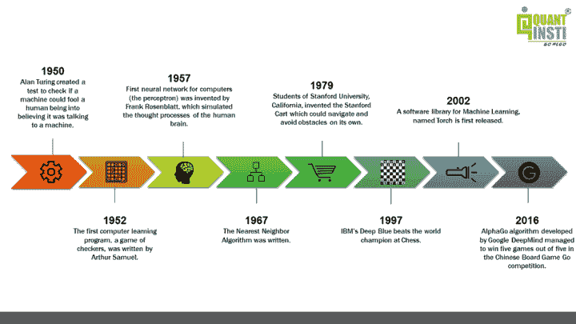
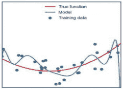
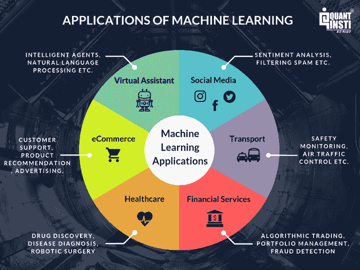

# 机器学习基础:组件、应用、资源等

> 原文：<https://blog.quantinsti.com/machine-learning-basics/>

由[查尼卡·塔卡](https://www.linkedin.com/in/chainika-bahl-thakar-b32971155/)

机器学习已经成为当今的热门话题，世界各地的企业家都转向机器学习来进行商业运营。机器学习已经取得了进步，它甚至可以在没有明确编程的情况下预测结果。

这不仅仅是它，当谈到机器学习在交易中的应用时，还有很多。通过这个博客，你将了解机器学习的所有基础知识，以及如何开始学习机器学习，学习资源，机器学习的应用等等！

深入了解这个有趣的博客，它涵盖了:

*   [什么是机器学习？](#what-is-machine-learning)
*   [机器学习的例子](#example-of-machine-learning)
*   [机器学习的历史](#history-of-machine-learning)
*   [机器学习的重要性](#importance-of-machine-learning)
*   [机器学习的组件](#components-of-machine-learning)
*   [机器学习分类](#machine-learning-classification)
*   [机器学习和深度学习的区别](#difference-between-machine-learning-and-deep-learning)
*   [学习机器学习的先决条件](#prerequisites-to-learn-machine-learning)
*   [用于机器学习的 Python 库](#python-libraries-for-machine-learning)
*   [机器学习中常用的术语](#common-terms-used-in-machine-learning)
*   [机器学习在交易中的应用](#application-of-machine-learning-in-trading)
*   [学习机器学习的资源](#resources-to-learn-machine-learning)
*   [机器学习的未来](#the-future-of-machine-learning)

* * *

## 什么是机器学习？

顾名思义，机器学习为机器提供了基于经验、观察和分析给定数据集内的模式进行自主学习的能力，而无需显式编程。

当我们为某个特定的目的编写程序或代码时，我们实际上是在编写一组明确的指令，机器将会遵循这些指令。

而在机器学习中，我们输入一个数据集，机器通过识别和分析数据集中的模式来学习。然后，机器将根据其观察和从数据集中的学习自主做出决策。

* * *

## 机器学习的例子

虽然有很多机器学习的例子，但我们在这里只涉及其中的几个。

*   Facebook:例如，想想 Facebook 的面部识别 [⁽ ⁾](https://www.facebook.com/help/122175507864081) 算法，它会在你上传照片时提示你给照片加标签。
*   Alexa、Cortana 和其他语音助手:另一个例子是使用机器学习来识别和服务用户请求的语音助手。
*   特斯拉汽车:另一个例子是特斯拉的自动驾驶 [⁽ ⁾](https://www.tesla.com/autopilot) 功能。

现在让我们看一个“鸟类物种识别学习”问题的例子。这个例子解释了模型的任务、模型的性能测量以及准确结果所需的训练经验:

*   **机器学习模型的任务:**对图像中的鸟类种类进行识别和分类
*   **性能测量:**正确分类的鸟类物种的百分比
*   **机器学习模型的训练经验:**在给定分类的鸟类物种数据集上训练

因此，机器学习模型将根据机器学习模型的性能测量和所需的训练经验来学习任务。

* * *

## 机器学习的历史

机器学习并不是最近的现象。事实上，神经网络最早是在 1943 年 [⁽ ⁾](https://en.wikipedia.org/wiki/Timeline_of_machine_learning) 引入的！

虽然在早期，由于计算成本高，机器学习的进展有些缓慢。高昂的计算成本使得这个领域只有大型学术机构或跨国公司才能进入。此外，数据本身很难满足公司的需求。

但是随着互联网的出现，我们现在每天都在产生万亿次的数据 [⁽⁴⁾](https://www.forbes.com/sites/bernardmarr/2018/05/21/how-much-data-do-we-create-every-day-the-mind-blowing-stats-everyone-should-read/#4742a8c860ba) ！

再加上计算成本的降低，我们发现机器学习不仅仅是一个可行的提议 [⁽⁵⁾](https://www.einnews.com/pr_news/585166263/artificial-intelligence-market-size-to-grow-by-usd-94-500-million-driven-by-growing-preference-for-machine-learning) 。

机器学习历史上一些值得注意的事件是:

*   **1950 年**——这是“艾伦·图灵” [⁽⁶⁾](https://www.newscientist.com/people/alan-turing/) 第一次创造了一个测试，以检验一台机器是否能欺骗人类，让人类相信它在和一台机器说话。
*   1952 年——第一个计算机学习程序，一个跳棋游戏，是由亚瑟·塞缪尔编写的。
*   1957 年，弗兰克·罗森布拉特发明了第一个计算机神经网络，它模拟了人类大脑的思维过程。
*   **1967 年**——最近邻算法写成。
*   1979 年 -加州斯坦福大学的学生发明了斯坦福小车，它可以自己导航和躲避障碍物。
*   1997 年——IBM 的深蓝击败国际象棋世界冠军。
*   **2002**——一个名为 Torch 的机器学习软件库首次发布。
*   **2016**——谷歌 DeepMind 开发的 AlphaGo 算法在中国棋盘游戏围棋比赛中，成功拿下五局。

这些事件可以表示为:

<figure class="kg-card kg-image-card kg-width-full kg-card-hascaption">

<figcaption>Timeline of machine learning</figcaption>

</figure>

* * *

## 机器学习的重要性

机器学习在企业领域扮演着重要的 [⁽⁷⁾](https://www.datarobot.com/blog/the-importance-of-machine-learning-data/) 角色，因为它使企业家能够最大限度地减少手工劳动。机器学习模型在人类的帮助下学习，但最终，机器会学习并接管学习的任务。

尽管需要最低程度的干预来确保不会出现“与机器相关的”故障或更新输入的数据。

如今，像谷歌、亚马逊、脸书、特斯拉等领先公司都在有效地利用这些技术。因此，机器学习被证明成为运营和功能的核心部分。

此外，有大量的使用案例可以应用机器学习来削减成本，减轻风险，提高包括风险管理在内的整体生活质量。此外，*全球机器学习(ML)市场预计将增长 [⁽⁸⁾](https://www.fortunebusinessinsights.com/machine-learning-market-102226) ，从 2022 年的 211.7 亿美元增长到 2029 年的 2099.1 亿美元，预测期内的复合年增长率为 38.8%*。

* * *

## 机器学习的组件

机器学习算法有数万种，每年都有数百种新算法被开发出来。

每个机器学习算法都有三个组成部分:

*   **表示**:这暗示了如何表示知识。示例包括决策树、规则集、实例、图形模型、神经网络、支持向量机、模型集成等。
*   **评估**:这是评估候选方案(假设)的方式。示例包括准确性、预测和召回、平方误差、可能性、后验概率、成本、利润、熵 k-L 散度等。
*   **优化**:最后但并非最不重要的，优化是候选程序生成的方式，被称为搜索过程。例如，组合优化、凸优化和约束优化。

所有的机器学习算法都是这三个部分的组合，是理解所有算法的框架。

* * *

## 机器学习分类

[机器学习](https://www.youtube.com/watch?v=m4BFOSaos7M)算法可以分为:

1.  监督算法:
    ♀[线性回归](/machine-learning-trading-predict-stock-prices-regression)、
    ♀[逻辑回归](/machine-learning-logistic-regression-python)、
    ♀[KNN 分类](/machine-learning-k-nearest-neighbors-knn-algorithm-python)、
    ♀[支持向量机(SVM)](/trading-using-machine-learning-python-svm-support-vector-machine/) 、
    ♀[决策树](https://quantra.quantinsti.com/course/decision-trees-analysis-trading-ernest-chan)、
    ♀[随机森林](/random-forest-algorithm-in-python)、
    ♀[朴素](/bayesian-inference)
2.  无监督算法: [K 均值聚类](/k-means-clustering-pair-selection-python)
3.  [强化算法](/reinforcement-learning-trading/)

让我们更深入地研究一下这些机器学习基础算法。

### 监督机器学习算法

在这种类型的算法中，训练机器的数据集由标记数据组成，或者简单地说，由输入参数和所需输出组成。

让我们以前面的面部识别为例，一旦我们识别出照片中的人，我们将尝试将他们分类为婴儿、青少年或成人。

在这里，婴儿、青少年和成人将是我们的标签，我们的训练数据集已经根据某些参数被分类到给定的标签中，通过这些参数，机器将学习这些特征和模式，并根据从这些训练数据中的学习对一些新的输入数据进行分类。

监督机器学习算法可以大致分为两种类型的算法；分类和回归。

**分类算法**

顾名思义，这些算法用于将数据分类到预定义的类别或标签中。我们将讨论最常用的[分类](https://www.youtube.com/watch?v=0IWLfTomLLg)算法之一，称为 K-最近邻(KNN)分类算法。

**回归机器学习算法**

这些算法用于确定两个或多个变量之间的数学关系以及变量之间的依赖程度。这些可用于基于两个或更多变量的相互依赖性来预测输出。

例如，一种产品价格的上涨会减少其消费量，这意味着，在这种情况下，消费量将取决于该产品的价格。

在这里，消费量将被称为因变量，产品价格将被称为自变量。消费金额对产品价格的依赖程度将帮助我们根据产品价格的变化预测消费金额的未来价值。

### 无监督机器学习算法

与监督学习算法不同，在监督学习算法中，我们处理带标签的数据进行训练，对于无监督机器学习算法，训练数据将是无标签的。根据变量之间的相似性将数据聚类成特定的组。

一些无监督的机器学习算法是 K-均值聚类和神经网络。

一个简单的例子是，给定足球运动员的数据，我们将使用 K-means 聚类，并根据他们的相似性来标记他们。因此，这些聚类可以基于前锋对任意球或成功铲球得分的偏好，即使算法一开始没有给出预定义的标签。

k-均值聚类对那些认为不同资产之间可能存在表面上看不到的相似性的交易者是有益的。

虽然我们在无监督机器学习算法中提到了神经网络，但可以争论的是，它们既可以用于监督学习算法，也可以用于无监督学习算法。人工神经网络和[递归神经网络](/rnn-lstm-gru-trading/)也属于无监督机器学习算法。

### 强化机器学习算法

强化学习是一种机器学习，在这种学习中，机器需要确定特定上下文中的理想行为，以使其回报最大化。

它的工作原理是奖惩原则，也就是说，对于机器做出的任何决定，它要么受到奖励，要么受到惩罚。因此，它将理解决定是否正确。

这就是机器将如何学习采取正确的决策，以实现长期回报最大化。

对于强化算法，机器可以被调整和编程，以更加关注长期回报或短期回报。当机器处于一个特定的状态，并且必须为下一个状态采取行动以实现奖励时，这个过程被称为马尔可夫决策过程。

* * *

## 机器学习和深度学习的区别

机器学习模型缺乏识别错误的机制，在这种情况下，程序员需要介入来调整模型以做出更准确的决策，而深度学习模型可以识别不准确的决策，并在没有人工干预的情况下自行纠正模型。

但要做到这一点，深度学习模型需要大量的数据和信息，不像机器学习模型。

* * *

## 学习机器学习的先决条件

学习机器学习有一些先决条件，没有这些先决条件，人们就会失去继续学习机器学习所需的重要概念。这些是:

**统计概念**

在机器学习中，统计概念对于从数据中创建模型至关重要。方差分析和假设检验等统计数据对于构建算法至关重要。

**概率**

概率有助于预测未来的后果，机器学习中的大多数算法都是基于不确定的条件，需要可靠的决策。

**数据建模**

数据建模能够识别底层数据结构，找出模式并填补数据不存在的地方之间的空白。

**编程技巧**

我们都知道，机器学习主要依赖于算法，这意味着一个人应该掌握至少一种编程语言的良好知识。Python 被认为是一种容易掌握的语言，并且被大多数 quants 使用。

* * *

## 用于机器学习的 Python 库

[Python 库](/python-trading-library/)有助于消除从头编写代码的需要。他们在开发机器学习模型方面发挥着至关重要的作用，因为他们需要算法。下面让我们来看看一些最受欢迎的图书馆。

**Scikit-learn**

它是一个基于 SciPy 库构建的 Python 机器学习库，由包括分类、聚类和回归在内的各种算法组成，可以与 NumPy 和 SciPy 等其他 Python 库一起用于科学和数值计算。

它的一些类和函数是 sklearn.cluster、sklearn.datasets、sklearn.ensemble、sklearn.mixture 等。

**TensorFlow**

TensorFlow 是一个开源软件库，用于高性能数值计算和机器学习应用程序，如神经网络。它允许跨各种平台(如 CPU、GPU、TPU 等)轻松部署计算。由于其灵活的架构。在这里了解如何[安装 TensorFlow](/install-tensorflow-gpu/) GPU。

**Keras**

Keras 是一个深度学习库，用于开发神经网络和其他深度学习模型。它可以建立在 TensorFlow、Microsoft Cognitive Toolkit 或 Theano 之上，并专注于模块化和可扩展。

* * *

## 机器学习中的常用术语

这里有一些机器学习基础术语，在你开始机器学习算法的旅程时会有所帮助。

### 偏见

如果机器学习模型的可预测性水平高，则称其具有低偏差。换句话说，它在处理数据集时犯的错误更少。

当我们必须对同一问题陈述比较两种机器学习算法时，偏差起着重要的作用。

### 交叉验证偏差

[机器学习中的交叉验证](/cross-validation-machine-learning-trading-models/)是一种提供机器学习模型性能的精确测量的技术。这种表现暗示了你对未来在没有任何人类帮助的情况下使用模型的期望。

简而言之，交叉验证偏差发现机器学习模型是否正确地学习了任务。

机器学习模型的应用是从现有数据中学习，并使用这些知识来预测未来的未知事件。机器学习模型中的交叉验证需要在现场[交易](https://www.youtube.com/watch?v=hxtugnzgdM4)之前彻底完成，以便不会出现意外错误。

### 欠拟合

如果一个机器学习模型不能准确预测，那么我们说这个模型不适合。这可能是由于各种原因，包括没有为预测选择正确的特征，或者只是问题陈述对于所选择的机器学习算法来说太复杂。

### 过度拟合

在机器学习和统计学中，当模型与数据拟合得太好时，或者简单地说，当模型太复杂时，就会发生过度拟合。过度拟合模型学习训练数据中的细节和噪声，以至于对模型在新数据/测试数据上的性能产生负面影响。

<figure class="kg-card kg-image-card kg-width-full kg-card-hascaption">

<figcaption>Overfitting</figcaption>

</figure>

过拟合问题可以通过减少特征/输入的数量或增加训练样本的数量来解决，以使机器学习算法更加通用。解决过度拟合问题的更常见的方法是正则化。

这些是我们在《机器学习基础》中讨论过的几个术语。上面提到了大部分流行的机器学习算法。

* * *

## 机器学习在交易中的应用

机器学习应用于各种服务。机器学习在企业领域发挥着重要作用，因为它使企业家能够理解客户行为和业务运作行为。

目前，几乎每个公共领域都由机器学习应用提供动力。仅举几个例子，医疗保健、搜索引擎、数字营销和教育是主要受益者。

让我们具体看看，机器学习系统涵盖了哪些所有服务。

<figure class="kg-card kg-image-card kg-width-full kg-card-hascaption">

<figcaption>Applications of machine learning</figcaption>

</figure>

* * *

## 学习机器学习的资源

各种资源可用于学习机器学习概念。要学习从基础到高级、概念、术语、项目等等，你可以看看这些关于机器学习的[博客](/tag/machine-learning/)。

让我们看看下面的一些其他资源。

### 课程

首先让我们来看看学习机器学习可以探索哪些[课程](https://quantra.quantinsti.com/learning-track/machine-learning-deep-learning-in-financial-markets)。下面是一个列表:

[学习轨迹:机器学习&金融市场深度学习](https://quantra.quantinsti.com/learning-track/machine-learning-deep-learning-in-financial-markets)

学习路线中的课程涵盖了从简单到复杂的各种模型。

因此，无论是初学者还是希望进入下一个高级阶段的专家，这条学习路线都适合所有人。

通过这些课程，您将学到:

*   调谐超参数
*   梯度推进
*   集成方法
*   构建稳健预测模型的先进技术
*   在交易中使用无监督学习来增强算法

[用于金融机器学习的 Python](https://quantra.quantinsti.com/course/python-machine-learning)

该课程非常适合那些希望开始使用 Python 进行机器学习的人。通过这个课程，你将得到一个关于创建交易的机器学习算法的循序渐进的指导。

还可以评估机器学习算法的性能，用 Quantra 的集成学习进行[回测](/backtesting/)，纸上交易和现场交易。

### 录像

欧内斯特·陈博士的《交易的机器学习》

在介绍视频之前，让我们先了解一下陈博士。

陈博士是算法和量化交易领域的全球知名人士。他是 QTS 资本管理有限责任公司的管理成员。此外，自 1997 年以来，他曾在多家投资银行(摩根士丹利、瑞士瑞信银行、Maple)和对冲基金(Mapleridge、Millennium Partners、MANE)工作。

在这个视频中，欧内斯特·陈博士回答了 QuantInsti 为您带来的关于机器学习交易的一些最常见的问题。

交易者的机器学习:介绍

这个视频适合那些想知道什么是机器学习以及编程语言(Python，C++等)中的常规算法之间的区别的人。)和一个机器学习算法。

此外，这个视频包括现实世界中的机器学习(ML)算法的例子，使用机器学习的行业以及机器学习在交易中的实施和使用。

交易者的机器学习:术语

在这个视频中，我们讨论机器学习中的某些术语。他们正在训练和测试数据集。本视频还将帮助您了解机器学习任务的类型，即-

*   监督学习
*   无监督学习
*   强化学习

[交易者的机器学习-分类介绍](https://www.youtube.com/watch?v=0IWLfTomLLg&t=1s)

在本视频中，您将了解以下几点:

*   分类介绍
*   在各种领域中的应用，例如:
*   医疗诊断
*   欺诈检测
*   手写识别
*   客户细分
*   风险评估
*   电子商务网站使用的分类示例
*   它不限于文本和数字，甚至图像也可以分类
*   监督分类器算法
*   可以选择分类器算法，这取决于
*   训练数据的大小
*   特征集的独立性
*   系统速度

此外，本视频中介绍的分类器算法包括:

*   k-最近邻算法(KNN)
*   使用决策树的随机森林
*   人工神经网络
*   朴素贝叶斯分类

### 书

此外，也是最后一点，有一些有用的书籍可以帮助你学习所有关于机器学习的知识。对于那些喜欢以学习为目的阅读的人来说，书籍是一个很好的学习来源。此外，那些想学习有更详细解释的概念的人可以选择书籍来学习。

* * *

## 机器学习的未来

机器学习是一种通用且强大的技术。机器学习的未来格外令人兴奋。

机器学习对于企业或组织来说可能是一个有争议的优点，因为目前由人工完成的任务在未来将完全由机器来完成。

根据⁽⁹⁾的报告，2021 年机器学习(ML)市场规模为 154.4 亿美元。在预测期内，市场规模预计将从 2022 年的 211.7 亿美元增长到 2029 年的 2099.1 亿美元，CAGR 为 38.8%。

* * *

**参考书目**

*   Solomonoff，r . j .(1964 年 6 月)。“归纳推理的形式理论。第二部 [⁽ ⁰⁾](https://doi.org/10.1016%2FS0019-9958%2864%2990131-7) 。信息和控制。
*   汤姆·米切尔(1997) [⁽ ⁾](https://en.wikipedia.org/wiki/Tom_M._Mitchell) 。机器学习 [⁽ ⁾](http://www.cs.cmu.edu/~tom/mlbook.html) 。纽约:麦格劳·希尔。
*   科尔特斯，科琳娜[⁽⁾](https://en.wikipedia.org/wiki/Corinna_Cortes)；弗拉基米尔·瓦普尼克(1995 年)。[【支持向量网络】](https://doi.org/10.1007%2FBF00994018)。机器学习 [⁽ ⁴⁾](https://en.wikipedia.org/wiki/Machine_Learning_(journal)) 。
*   Stuart J. Russell，Peter Norvig (2010)人工智能:现代方法 [⁽ ⁵⁾](https://en.wikipedia.org/wiki/Artificial_Intelligence:_A_Modern_Approach) ，第三版，普伦蒂斯霍尔。

* * *

### 结论

机器学习在各个领域都非常重要，它因为所有正确的原因而广受欢迎。通过了解先决条件并采用这些条件，人们可以使用机器学习。还有，机器学习的未来似乎一片光明。因此，了解著名的机器学习有几个好处。

从我们的[机器学习简介](https://quantra.quantinsti.com/course/introduction-to-machine-learning-for-trading)课程开始你的机器学习世界之旅，成为使用机器学习算法的专家。

借助该领域的几项重要研究，本课程将帮助您了解不同的机器学习算法是如何在金融市场数据上实现的。

* * *

*<small>免责声明:股票市场的所有投资和交易都涉及风险。在金融市场进行交易的任何决定，包括股票或期权或其他金融工具的交易，都是个人决定，只能在彻底研究后做出，包括个人风险和财务评估以及在您认为必要的范围内寻求专业帮助。本文提到的交易策略或相关信息仅供参考。</small>T3】*