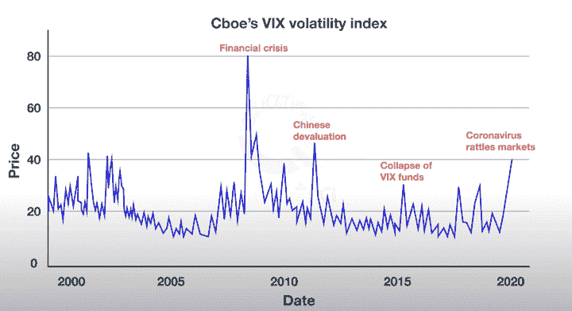

# 市场事件和算法交易者的表现

> 原文：<https://blog.quantinsti.com/market-events-performance-algorithms/>

由[查尼卡·塔卡](https://www.linkedin.com/in/chainika-bahl-thakar-b32971155/)

对经济和金融市场产生重大影响的事件即将发生。无论是突发事件还是有计划的事件，市场波动都会随之发生。在这篇文章中，我们讨论了在这样的市场事件中算法交易者对金融市场和表现的影响。

这篇文章包括:

*   [什么是市场事件？](#what-is-a-market-event)
*   [一个事件对金融市场的影响](#impact-of-an-event-on-financial-markets)
*   [在每个市场事件中规划算法交易](#planning-algorithmic-trades-in-each-market-event)
*   [黑天鹅](#black-swan)
*   [灰天鹅](#grey-swan)
*   [白天鹅](#white-swan)

* * *

## 什么是市场事件？

市场事件是指在价格变动、交易量或市场微观结构方面能够影响市场的任何重大事件，如公投或出人意料的监管决定。

有三种类型的市场事件:

*   黑天鹅(Black Swan)——这样的事件是不可预测的，会突然发生。它通常会对金融市场产生负面影响。例如，2007 年至 2008 年的金融危机是一场不可预测的事件，导致全球金融市场承受了极大的压力。

Black Swan - CBOE's VIX Volatility Index

在上图中，你可以看到 [VIX](/exchange-traded-funds/#what-is-vix-and-how-does-it-help) 波动率指数显示了过去震动金融市场的各种黑天鹅事件。VIX 或波动率指数基本上是一种衡量市场波动的指标，因此也被称为“恐惧指数”。

VIX 在每次事件中都显示出市场波动性的上升。

*   **灰天鹅**——灰天鹅事件很可能发生，而且意义重大。但是发生的概率低。因此，形成了某些判断。例如，气候变化是一个可能发生的事件，但即使在预测之后，它在特定时间发生的可能性也很小。

*   **白天鹅**——白天鹅是一个极其简单的事件，事件是可预测的，结果是已知的。例如，可以借助 GDP 增长率预测经济增长，结果是国民收入增加。

* * *

## 一个事件对金融市场的影响

| 天鹅 | [股市](https://quantra.quantinsti.com/course/stock-market-basics) | [债券市场](/financial-markets-introduction/#trading-exchange) | [衍生品市场](/derivatives-market/) |
| 黑天鹅 | 价格波动大，损失巨大，一些公司有更多的盈利机会(例如，covid 期间的净化部门) | 突然坍塌可能会发生，也可能不会发生，这取决于事件的性质 | 可能导致违约，因为经济中的货币供应减少，高负债率 |
| 灰色天鹅 | 价格波动较大，风险管理实践带来的损失较少，利润潜力极高 | 坍塌可能会发生，也可能不会发生，这取决于事件的性质，由于事件发生的概率不大，所以是可以控制的 | 由于事件发生的概率较小，违约的可能性较小 |
| 白天鹅 | 价格波动性低，风险管理实践导致的损失更少，利润潜力更小 | 倒塌可能会发生，也可能不会发生，这取决于事件的性质，由于事件发生的概率很高，所以是可控的 | 由于事件发生的概率很高，违约的可能性很小或没有 |

* * *

## 在每个市场事件中计划算法交易

算法交易员对算法进行编程，使其能够顺利交易，因为在每个事件中[风险管理](https://quantra.quantinsti.com/course/quantitative-portfolio-management)都迫在眉睫。有很多算法的[交易策略](/tag/more-trading-strategies/)比如[做市](/market-making/)，套利等。这有助于避免每只天鹅——黑天鹅、灰天鹅或白天鹅——可能遭受的损失。

此外，买卖订单，如市价订单，限价订单，止损订单执行，以避免损失。算法也可以被编程来对冲损失。

我们已经介绍了三个市场事件:

*   黑天鹅
*   灰色天鹅
*   白天鹅

下面，我们讨论了每个市场事件的例子和算法交易者在不同金融市场交易的表现。

* * *

## 黑天鹅

因为我们知道黑天鹅事件是不可预测的，交易者没有机会在金融市场上计划交易。但在灰天鹅和白天鹅的情况下，可以在各种市场交易来规避损失。

### 黑天鹅的例子

福岛核灾难是发生在日本核电站的事故。这是导致公众健康危险的最严重的核事故之一。

从那时起，一家依赖核能运营的公司的股价就比其他不依赖核能的公司低得多。

类似地，任何这样的事件在突然发生后对经济产生巨大影响，被称为黑天鹅。

### 算法交易员在黑天鹅事件中的表现

算法交易在这种事件中有所帮助，因为对突然的市场波动做出反应的时间更短。在像福岛这样的突发事件中，股价会意外下跌。

在这种情况下，算法(预编程指令)会对市场模式做出快速反应，并在几毫秒内执行买入和卖出指令。算法通过根据影响执行股票、衍生品和债券中最有利的指令来执行。

* * *

## 灰色天鹅

### 一只灰天鹅的例子

像海啸这样的自然灾害会导致沿海地区的损失。对房屋、库存、机械、设施、运输网络、物资的破坏和人员损失会对商业、运输、旅游、渔业、农业等产生巨大影响。因此，与受影响行业相关的公司股价下跌。

同样，我们可以说机器人接管快递、零售服务、接待员等服务的概率。在全球范围内，2021 年的可能性很低，但在不久的将来，这种情况发生的可能性很高。

### 灰天鹅期间算法交易者的表现

在灰天鹅事件中，事件发生的可能性是存在的，尽管可能性较小。这种情况由算法交易者通过提前计划来避免可能的损失来处理。

算法交易者以如下方式在各种金融市场中计划这种灰天鹅事件:

*   股票市场 -股票市场的交易者仍然准备好应对灰色天鹅发生后可能出现的熊市或牛市趋势。交易者可以根据历史分析投资一些波动较小的股票。

*   债券市场 -债券的风险低于股票。万一股市下跌，债券有助于分散投资组合。还有一些商品支持债券，如金属(黄金、白银等)。).

*   **衍生品市场-** 当市场在特定时期可能波动时，大量资金会投资于衍生品(远期、期货、期权和掉期)。衍生产品可以在预期波动性较高的日期到期，以帮助避免基础资产价值下降时的损失。

* * *

## 白天鹅

### 白天鹅的例子

在某种情况下，如回购利率下降，国民收入(白天鹅)有望增加。总之，由于国民收入的增加，股票市场将会上涨。

相反，在回购利率上升的情况下，预计国民收入将减少，结论将是对股票市场的抑制效应或股票市场的下跌。

### 白天鹅期间算法交易者的表现

在白天鹅的例子中，算法交易员知道事件发生的概率很高，因此提前计划交易的执行。

算法交易员创建带有交易策略的算法，如[情绪分析](/applicability-sentiment-analysis-trading-works/)，以便在此类事件发生时执行交易。算法对消息的反应比人工交易员快得多。在设计[交易策略](/algorithmic-trading-strategies/)时，Twitter 信息也会被用到。

在白天鹅事件中，交易者使用以下方法来避免损失:

*   **股票市场** -在高度可预测的事件中，算法交易员借助某些措施(如限价单和止损单)来控制波动

*   **债券市场**——由于该事件高度可预测，债券交易是最好的选择。在销售税、消费税等上涨的情况下，股票市场变得非常不稳定。

*   **衍生品市场-** 尽管价格下跌，衍生品仍有助于锁定标的资产的价格。交易员投资衍生品是为了防范资产价值下跌。

* * *

**了解市场事件的重要有用资源**

*   通过录制关于[风险管理:最大化长期增长](https://youtu.be/kt1jSw9BDt0)的网络研讨会，了解更多关于交易风险管理的信息。
*   精彩阅读- [尊重灰天鹅:40 年的声誉危机](https://www.aon.com/getmedia/03965282-4d98-49c3-9e4c-97d4fbfb2c3e/Respecting-the-Grey-Swan.aspx)
*   Nassim Nichola Taleb 的研究论文- [不公平的根源:艺术和文学中的黑天鹅](https://www.fooledbyrandomness.com/ARTE.pdf)
*   有许多定量交易策略模型，算法交易者应用这些模型来摆脱使市场波动的棘手事件。在这里学习这些策略[。](https://quantra.quantinsti.com/course/quantitative-trading-strategies-models)

* * *

## 结论

我们了解了对金融市场产生巨大影响的三个市场事件——黑天鹅、灰天鹅和白天鹅，以及算法交易员在每个市场事件中的表现。

资金可以存放在不同的金融市场中，以应对突发的或计划好的市场事件。此外，算法交易者在每个市场事件中都使用有助于限制或规避损失的交易策略。

如果你想开始学习基本的技术交易策略，如基于趋势的策略和布林线策略，并在实时市场中实施，请务必查看本课程的[量化交易策略和模型](https://quantra.quantinsti.com/course/quantitative-trading-strategies-models)。

* * *

*<small>免责声明:本文提供的所有数据和信息仅供参考。QuantInsti 对本文中任何信息的准确性、完整性、现时性、适用性或有效性不做任何陈述，也不对这些信息中的任何错误、遗漏或延迟或因其显示或使用而导致的任何损失、伤害或损害负责。所有信息均按原样提供。</small>*