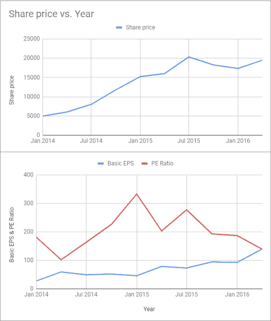

# 市场基本面-什么影响股价？

> 原文：<https://blog.quantinsti.com/market-fundamentals-share-price/>

以[重香重香](https://www.linkedin.com/in/rekhit/)

公司的股价取决于多种因素，包括公司的内在价值。在我们讨论其中几个之前，让我们先来谈谈“有效市场”。你一定听过很多投资者说，“*市场是前瞻性的*，”或者“*市场总是有效的，这里没有彩票。*

## 但是，什么是前瞻性市场呢？

简单地说，市场通过考虑公司的预期未来收益来估计公司的现值。

我们用一个例子来理解这个。

以艾希尔汽车公司(NSE: EICHERMOT)为例，该公司在 2014 年经历了强劲的股票反弹。在 2014 年至 2015 年期间，这主要是由股票的重新评级推动的，市场认为该公司的价值高于当前价格。**这期间市盈率几乎翻了一倍！**

**注:** *市盈率是一家公司的股票价格与该公司每股收益的比率。*

在短暂的创纪录高位后，市场一致认为股价现在反映了股票的正确价值，正如预期的那样，收益赶上了市场预期。该股继续反弹，但这一次，它是由每股收益的稳步增长推动的。市盈率回到了 2014 年之前的水平。

你应该注意到，虽然市盈率不是一家公司财务状况的唯一指标，但它可以用来对公司的增长轨迹做出明智的假设。

## 好吧，但如果你说市场是前瞻性的，你是说他们知道 2007 年存在房地产泡沫，而没有人做任何事情吗？

人们必须明白，我们毕竟是人。有时候，市场会被情绪左右，这可能会造成不可持续的增长轨迹。

然而，这也是市场的重要特征之一，它会周期性地自我修正。

## 那么，投资者如何从市场的前瞻性特征中获益呢？

有些交易者利用市场时机，在收益公布前建立股票投资组合，在事件发生前几天做多，并在前一天平仓。以印度股票为例，这种策略被认为能产生正回报。

为了说明这一点，我们可以举一个马恒达和马恒达金融服务公司财报的例子。在该报告发布之前，分析师曾预测该公司的净利润为 100 亿卢比。24 亿卢比，但报告的实际净利润为 16.4 亿卢比。因此，该公司的股价从 270 印度卢比/股下跌至 253 印度卢比/股。

第二天，它进一步下降到 239 印度卢比。因此，如果投资者在一个月前以 297 印度卢比买入股票，并在收益报告前一天以 326 印度卢比卖出股票，则每股利润为(326-297)= 29 印度卢比。

鉴于公司经常超出分析师的预期，人们应该知道这可能是一个高风险的策略。

## 这难道不违背有效市场假说的理念吗？

不完全是。

我们并不是说，如果交易者获利，市场就是无效的。有效市场假说认为股票价格反映了所有可获得的信息。但是，由于新信息的处理，在市场自我修正之前存在一个时间差。这就是日内交易者遵循的概念，把握市场时机。

对于交易者来说，知道何时进场和出场是很重要的。在这里，新闻起着至关重要的作用。

这里需要提醒的是，最近的一项研究支持这样一个事实，即持续跑赢市场是不可能的。

## **明白了。那么，市场如何决定一家公司的股价是被低估还是被高估呢？**

一种方法是价格发现机制。基本前提是，市场将买方和卖方聚集在一起，并基于他们的心态和预期，为一家公司发现一个价格。需要注意的是，价格发现不是对公司的估值，而是对其业绩的假设。

因此，交易者考虑公司的估价和市场价值来决定它是被低估还是被高估。有趣的是，价格发现机制支持前瞻性市场的特征。

## 你谈到随着新信息/新闻的发布，市场会自我调整。你能详细解释一下吗？

不仅仅是新闻，对新闻的反应也对股价起着重要作用。对这一消息的反应取决于不同的因素以及市场本身。

让我们通过研究印度 NBFC 地区的现状来理解这一点。

我们知道，IL&FS 目前正因资金管理不善而接受调查。因此，投资者在一段时间内密切关注着 NBFC 板块。顺便提一下，DSP 在二级市场以 11%的高收益率出售了价值 30 亿卢比的 DHFL 文件，导致人们猜测 DHFL 将拖欠付款，结果，DHFL 股价下跌了 50%。然而，DHFL 对其良好财务状况的澄清帮助阻止了下跌，股价似乎有所回升。

在高波动性和不确定性(波动性的高度不确定性)时期，市场对坏消息的反应比好消息更强烈。

此外，市场有时会变得过于乐观或过于悲观。

由于亿万富翁首席执行官埃隆·马斯克，特斯拉得到了很多媒体的关注。当埃隆·马斯克(Elon Musk)在推特上表示，他将以 420 美元的股价将特斯拉私有化，这远远高于现有价格，这导致了股价上涨 10%的狂热活动。然而，一旦发现埃隆·马斯克没有一个坚定的计划，股价就急剧下跌。

因此，投资者的工作就是评估每一个新信息，并判断市场可能的反应。正如伟大的经济学家约翰·梅纳德·凯恩斯所说:

> 成功的投资是对他人预期的预测

这些是影响股价的几个因素。作为一个负责任的投资者，人们应该考虑到商业环境以及可能导致公司股价修正的宏观经济因素。

由 [QuantInsti](https://www.quantinsti.com/) 教授的[算法交易(EPAT)](https://www.quantinsti.com/epat/)高管课程涵盖了统计学&计量经济学、金融计算&技术和算法&量化交易等培训模块，让你具备运用各种交易工具和平台成为成功交易者所需的技能。

*免责声明:本文中提供的所有数据和信息仅供参考。QuantInsti 对本文中任何信息的准确性、完整性、现时性、适用性或有效性不做任何陈述，也不对这些信息中的任何错误、遗漏或延迟或因其显示或使用而导致的任何损失、伤害或损害承担任何责任。所有信息均按原样提供。*