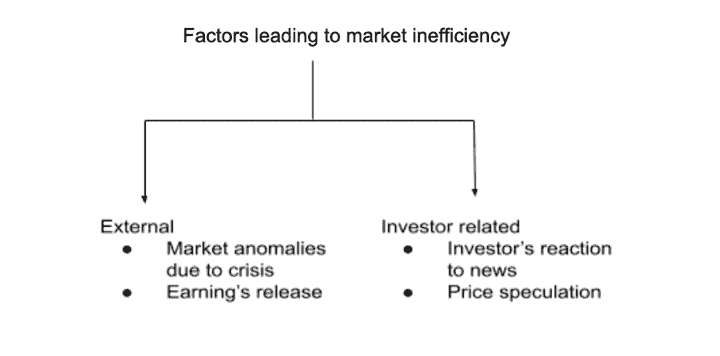
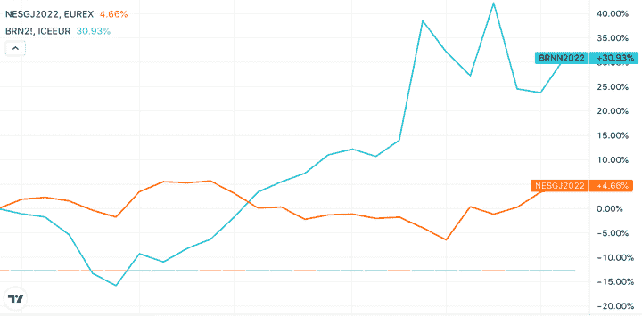
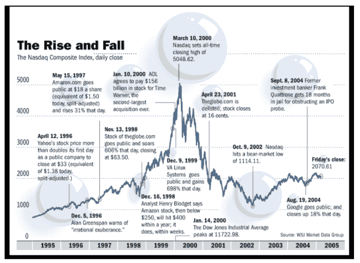

# 市场无效率:它是什么，类型，例子，交易，等等

> 原文：<https://blog.quantinsti.com/market-inefficiency/>

由[查尼卡·塔卡](https://www.linkedin.com/in/chainika-bahl-thakar-b32971155/)

市场无效率是交易世界中一个充满巨大机会的时期。然而，除了机会，交易者还需要对自己的投机能力、有助于在正确的时间买卖的策略等有信心。

简而言之，在市场效率低下的情况下，遵循正确的方法是极其重要的，这也是我们将在这篇博客中关注的内容，它涵盖了:

*   什么是无效率市场？
*   [导致市场无效率的因素](#factors-that-lead-to-market-inefficiency)
*   [过去市场效率低下的例子](#examples-of-market-inefficiencies-in-the-past)
*   [什么是有效市场假说？](#what-is-the-efficient-market-hypothesis)
*   [有效市场假说的类型](#types-of-efficient-market-hypothesis)
*   [有效市场的含义](#implications-of-an-efficient-market)
*   [市场效率 vs 市场无效率](#market-efficiency-vs-market-inefficiency)
*   [如何在低效的市场中交易？](#how-to-trade-in-an-inefficient-market)
    *   仲裁
    *   [统计套利](#statistical-arbitrage)
    *   [猜测](#speculation)
    *   [情感分析](#sentiment-analysis)
*   [在低效市场交易的优势](#advantages-of-trading-in-an-inefficient-market)
*   [在低效市场交易的缺点](#disadvantages-of-trading-in-an-inefficient-market)

* * *

## 什么是无效率市场？

无效率市场只不过是金融市场中特定证券的价格不以其真实价值交易的情况。因此，市场以非有效的方式运行。

当最近的事件/新闻或对事件/新闻的猜测使得市场上的证券或可交易项目的价格低于或高于实际或公平价值时，可交易项目的这种非有效价格就会出现。

例如，黑色星期二或 1929 年华尔街股灾是最严重的市场崩溃之一，投资者在一天之内在纽约证券交易所交易了大约 1600 万股股票。

就在第二天，恐慌性抛售开始了，最终没有人购买股票。由于投资者无法评估股票的实际价值，恐慌持续不断，这一事件最终导致了众所周知的大萧条。

此外，还有各种导致市场效率低下的因素，我们将在接下来讨论。

* * *

## 导致市场无效率的因素

有几个因素导致市场变得低效。这两类因素如下:

Factors leading to market inefficiency

**外部**

外部因素是由于以下原因而发生的:

*   危机导致的市场异常
*   收益发布

### 危机导致的市场异常

市场异常现象的出现是由于新闻的更新，如自然或人为的危机。例如，2022 年的乌克兰-俄罗斯战争正在造成市场异常，导致原油价格达到历史最高水平。这一高价是不正常的，因为它不等于原油的公允价值。

相反，快速消费品是受产品关键投入价格上涨影响最大的行业之一。

例如，俄罗斯和乌克兰合计占全球小麦出口的四分之一以上，而乌克兰一国就占了葵花籽油出口的近一半。但是由于在战争情况下缺乏出口，关键的投入，即小麦、葵花籽油等。变得昂贵。

因此，快速消费品变得昂贵，对其需求下降。因此，通货膨胀使投机者怀疑快速消费品行业的有利回报，导致市场表现不佳。

让我们在下图中看到快速消费品和原油的表现。NESGJ(雀巢期货)和 BRN2！(布伦特原油期货)两者都可以在下图中看到。

显而易见，原油价格的趋势远高于平时，而雀巢公司的股价反映了快速消费品行业的状况，因为其价格与其价值相比要低得多。

Tradingview - Nestle and crude oil

### 收益发布

[收益](https://finance.zacks.com/impact-earnings-announcements-stock-prices-4265.html)公告是与公司在一段时间内的业绩相关的信息。如果公告描绘了强劲的收益，投资者和交易者会对其表现感到乐观，股票价格就会上涨(反之亦然)。

举个例子，让我们假设公司 A 的股票值 40 美元，但是因为当前的收益公告(它受到诸如战争、海啸等情况的影响。公司 A 的股票趋向于 20 美元。

在这里，由于暂时的危机，价格趋向于比实际价值低得多的价格。相反，由于泡沫，价格也可能以异常或人为的高速度发展。因此，泡沫也被认为是市场无效率。

推荐阅读:[财报公布对股价的影响:瑞士](https://www.researchgate.net/publication/336767366_Impact_of_Earnings_Announcements_on_Share_Prices_Switzerland)

**投资者相关**

接下来是导致市场无效率的下一个因素，让我们找出一些与投资者相关的因素(完全取决于市场中投资者的反应)。这些措施如下:

*   价格投机
*   投资者对危机消息的反应

### 价格投机

交易者的投机导致市场效率低下，因为在有效市场的情况下，实际价值等于股价。

但是，如果交易者因为即将到来的事件(例如，选举结果)而推测价格在未来的时间内上涨或下跌，股东可以相应地买卖股票。这可能导致市场效率低下。

### 投资者对危机消息的反应

每当一条新闻对可交易项目的估值产生影响时，如果投资者反应迟缓，就会导致市场效率低下。

这种反应的延迟为许多交易者提供了机会，让他们可以建立能够带来丰厚回报的头寸。但是，在这个小窗口中(直到投资者做出反应并使价值等于价格)，如果投机以及随后的新闻出错(如互联网泡沫破裂)，也可能产生巨大损失。

* * *

## 过去市场效率低下的例子

接下来来看实际例子，让我们看看过去的市场低效。示例如下:

### 网络泡沫(1996 - 2001 年)

网络泡沫，也被称为网络繁荣和互联网泡沫，基本上是一个股票市场泡沫。这个泡沫发生在 20 世纪 90 年代，是过度投机的结果，即在线运营的公司将在未来的时间里见证巨大的增长。

这种预期导致大量投资涌入基于互联网的公司，尽管这些公司几乎没有增长潜力。最终，网络泡沫破裂，导致了 2001 年的经济衰退。

让我们看看下图，看看互联网泡沫存在的时间线。

Rise and fall (Dotcom bubble) (Source: [Flat World Business](https://flatworldbusiness.wordpress.com/flat-education/previously/web-1-0-vs-web-2-0-vs-web-3-0-a-bird-eye-on-the-definition/dotcom-bubble/))

上图清楚地显示了从 1996 年开始，关于基于互联网的公司的猜测显示了对其增长潜力的乐观态度。虽然，2001 年后，现实检查使交易者意识到互联网公司被高估，导致崩溃。

因此，市场是无效率的，直到公司的实际价值(假设关于资产、负债、利润和损失等的全部信息。公司的可获得性)可以反映在股票价格中。

### 大衰退(2007-2009 年)

大衰退是经济活动中最剧烈的下降。众所周知，这是一次重大的衰退，衰退的发生是因为美国房地产市场在繁荣之后大幅下跌。

在这次衰退中，大量抵押贷款支持证券和衍生品损失了大量价值。不景气发生的原因是:

*   持续了一段时间的房地产泡沫导致房价上涨
*   次级抵押贷款的增加
*   宽松的贷款做法

但很快泡沫破裂，银行遭受巨大损失，由于次贷危机导致一些银行关闭。

让我们看看下面的图片，它显示了抵押贷款是如何无法控制的。因此，美国的房价一直虚高，直到 2007 年泡沫最终破裂，导致抵押贷款支持证券的价值损失。

Loss on mortgage backed securities (Source: [THE FINANCIAL CRISIS INQUIRY REPORT](https://www.govinfo.gov/content/pkg/GPO-FCIC/pdf/GPO-FCIC.pdf))

因此，显而易见的是，抵押贷款证券的次级股票出现了巨额亏损，最终导致了大萧条。

* * *

## 什么是有效市场假说？

有效市场假说(EMH)也称为有效市场理论，是一种假设，认为股票价格反映了公司/资产的全部信息，能够正确地对其进行估价。

因此，这意味着有效市场假说认为股票总是以公平的价格在交易所交易。此外，如果股票的价格等于它们的价值，交易者就没有机会购买被低估的股票，并在价格上涨时卖出。

* * *

## 有效市场的含义

在这样一个完美或有效的市场情景中，选择一只有潜力在未来达到更高价格的股票是不可能战胜市场的。交易者/投资者可以采用的策略有:

*   一种承担风险的策略，在这种策略中，为了获得更高的回报，可以承担更高的风险。但是更高的风险意味着损失的[风险也更高。](/tag/portfolio-risk-management/)
*   此外，你必须战略性地将投资分散到不同的股票上，以维持一个包含不同风险水平股票的投资组合。这种多样化有助于防止一些股票的回报比其他股票更好。

推荐阅读:[市场效率——定义、测试和证据](https://pages.stern.nyu.edu/~adamodar/pdfiles/valn2ed/ch6.pdf)

* * *

## 有效市场假说的类型

有效市场假说有三种形式(EMH):

### 弱式有效市场假说

过去的全部信息都以这种形式被定价为证券。证券的基本面分析可以提供信息，在短期内产生高于市场平均水平的回报。但是基本面分析并不能提供长期优势，技术分析也不起作用。

### 半强式有效市场假说

半强式有效市场假说意味着基本面分析和技术分析都不能提供任何显著的优势。它还表明，新信息会立即反映在证券价格中。

### 强式有效市场假说

所有的信息，无论是公开的还是私人的，都反映在股票的价格上。因此，任何投资者都无法超越市场。强式有效市场假说并没有说不可能获得异常高的回报。这是因为平均值中总有异常值。

有效市场假说并不是说你永远跑赢市场。它说，有离群值可以击败市场平均水平。但也有离群者，他们在市场上损失惨重。多数更接近中间值。“赢”的人是幸运的；“输”的人倒霉。

* * *

## 市场效率与市场无效率

现在让我们看看市场效率和市场无效率之间的显著区别。

| **市场效率** | **市场效率低下** |
| 关于公司的全部信息(公司的价值)是已知的 | 关于公司的全部信息(公司的价值)是未知的 |
| 公司的实际价值反映在其价格上(价格等于实际价值) | 公司的实际价值没有反映在价格中(价格要么异常高，要么异常低) |
| 因为每个人都知道实际价格，所以没有机会在市场上获得超过其他交易者的优势(以较低的价格买入，然后以较高的价格卖出) | 大量的机会被创造出来，因为交易者可以投机、分析和套利 |
| 价格仍然停滞不前 | 随着实际价值逐渐为人所知，价格最终会创造一个有效的市场 |

* * *

## 如何在无效率的市场中交易？

在市场效率低下的情况下，可以根据情况修改交易惯例。

由于低效市场为交易者提供了大量投机和决定可交易资产价格的机会，现在正是期待有利回报的时候。

尽管低效率的市场是交易的好时机，但人们必须对讨价还价和投机的能力有信心，因为在这种情况下，可交易的资产可能被高估或低估。

让我们看看一些在低效市场中交易的方法，如下所示:

*   套利
*   统计套利
*   投机
*   情感分析

### 套利

套利是同时交易多种金融证券以从价格差异中获利的过程。

这可以通过多种方式实现，例如:

*   相同证券在不同市场的买卖(空间套利)或
*   同时买卖[证券](https://quantra.quantinsti.com/glossary/Security)的[现货价格](https://quantra.quantinsti.com/glossary/Spot-Price)和[期货合约](https://quantra.quantinsti.com/glossary/Futures)或者
*   买入被收购公司的股票，同时卖出收购公司的股票(合并套利)。

套利可以应用于[股票](https://quantra.quantinsti.com/glossary/Stocks)、[债券](https://quantra.quantinsti.com/glossary/Bond)、[衍生品](https://quantra.quantinsti.com/glossary/Derivative)、商品等金融工具。

套利是一种无风险的策略，尽管情况并非总是如此。始终存在[执行风险](https://quantra.quantinsti.com/glossary/Execution-Risk)的可能性，即由于市场的高波动性和价格的突然变化导致无法以有利可图的价格完成交易的风险。涉及的其他风险是交易对手风险和[流动性](https://quantra.quantinsti.com/glossary/Liquidity)风险。

例如，一家公司 ABC 的股票在伦敦证券交易所(LSE)的交易价格为每股 10 美元，而同样的股票在纽约证券交易所(NYSE)的交易价格为每股 10.5 美元，套利策略是在伦敦证券交易所以每股 10 美元的价格买入，在纽约证券交易所以每股 10.5 美元的价格卖出，每股获利 0.5 美元。

### 统计套利

另一种方式是[统计套利](https://quantra.quantinsti.com/course/statistical-arbitrage-trading)或 stat arb 是一种[交易策略](https://quantra.quantinsti.com/glossary/Trading-Strategy)，基于一项或多项资产相对于资产预期未来价值的统计错误定价。

Stat arb 算法监控历史上已知统计相关或协整的金融工具，关系中的任何偏差都表明交易机会。

Stat arb 涉及统计学、定量方法和数据挖掘的计算方法，可以通过算法高频交易。统计套利包括不同类型的策略，如配对交易、指数套利、篮子交易或 delta 中性策略。

这些策略因投资组合中工具的数量、类型和权重及其风险承受能力而异。

例如，最受欢迎的统计套利例子之一是百事可乐对可口可乐的股票。两只股票属于同一个行业，或者同一个业务类型，并且随着同样的市场事件影响它们的价格而同步波动。

这一对股票的价格变动的任何偏差，例如，如果百事可乐的股票比可口可乐的股票上涨得多，那么人们可能会做空百事可乐的股票，做多可口可乐的股票，以预期账面利润。

### 投机

[投机](https://www.youtube.com/watch?v=9Vu1ANK-Nnc)是一种成功的做法，当金融市场上的可交易项目不能反映正确的价格时，因为不能获得能够揭示可交易项目价值的全部信息。

由于新实体、新引入的技术、社交媒体或新闻的误导等因素，信息可能不可用。这些因素可能不会在市场上立即产生反应。

因此，在这种情况下，对价格的猜测发生，以决定是否购买或出售可交易的项目。买入是为了防止股价在未来一段时间内上涨，卖出是为了防止股价下跌。

有能力根据以下因素进行投机的个人/交易商/投资者:

*   内幕消息:交易者或团体知道公司的下一步行动，这将决定公司的盈利能力
*   借助过去的经验进行自己的评估
*   基于新闻更新等的评估。

例如，一家公司 A 的趋势是 40 美元，一个交易员在自己的评估或基于新闻更新的评估的帮助下，推测它会上涨并购买该公司的股票。

在这种情况下，价格实际上可以上升，带来有利的回报，甚至可以下降，导致亏损。人们需要对在这种情况下做出的决定充满信心。

### 情感分析

[情绪分析](https://quantra.quantinsti.com/learning-track/sentiment-analysis-trading?source=google&medium=cpc&campaign=dsaindia&gclid=CjwKCAjwo8-SBhAlEiwAopc9WzRaXBQnVMlPOmSpWh3iqMYnWtM2GrSrA-Y74Zh7CEaZkM70DwlF2hoCUwEQAvD_BwE)是利用新闻报道、博客帖子、社交媒体趋势等来评估市场对特定证券的态度或一般情绪的分析。

这个过程通常涉及到自然语言处理工具的使用，[机器学习](https://quantra.quantinsti.com/glossary/Machine-Learning)，或者[统计](https://quantra.quantinsti.com/glossary/Statistics)。简单地说，自然语言处理(NLP)是指使用计算机来处理自然语言(如英语)的文本。

这里的目标是从这些推文、博客和文章中发现的非结构化或半结构化数据中提取信息，并将它们分类为正面、负面或中性。

使用统计学或机器学习在这些分类和市场运动之间绘制关系(或相关性)。然后，情绪分析算法用于推断市场情绪是看涨还是看跌。基于这样的分析，做出交易决定。

* * *

## 在低效市场中交易的优势

*   无效市场中的不完全信息有助于获得投资优势。由于股票的实际价值不为其他交易者所知，在这种情况下，对股票进行彻底的分析、投机然后建仓是有益的。
*   价值投资也可能在一个无效率的市场环境中进行，因为交易者可能低估了股票的价值。但是，用内幕交易、分析等策略。一个人可以沉迷于价值投资，并获得超过其他交易者的优势。
*   成长型投资意味着投资于一家未来有增长潜力的公司的股票。在一个无效率的市场中，一只股票可能不会显示出它的实际价值，但是在成长投资策略的帮助下，就有可能推测一家公司的成长潜力，从而建仓。

* * *

## 在低效市场中交易的缺点

*   通常，投机者和套利者是这个市场的主要参与者，错误的判断会导致巨大的损失。
*   通常情况下，重大新闻发布会对金融市场的价格产生积极或消极的影响。然而，在低效市场中，可交易项目的价格不会完全立即对消息做出反应，这可能导致对交易头寸的盈利机会的误判。
*   可能会经历明显的延迟。这个小窗口为小玩家创造了获利的机会，但同时也可能导致巨额亏损。

* * *

## 结论

市场无效率听起来像是一个不完美的场景，但实际上是有利的，因为它使交易者有机会进行投机并获得有利的回报。

如果一个市场是完美的或有效的，公司的所有信息都可用，那么交易者就没有机会从股票的买卖中获利。

在一个有效的市场中，实际价值总是已知的，没有交易者会获得优势。此外，我们讨论了导致无效率市场的因素，过去的事件以及在无效率市场中交易的利弊。

如果你也想学习如何在统计套利策略的帮助下利用一个低效的市场，探索关于统计套利交易的课程。借助于统计概念，如协整、ADF 检验等。完成本课程后，您将能够识别交易机会。本课程还包括学习使用电子表格和 Python 创建交易模型，并对交易策略进行回溯测试，以获得出色的交易体验！快乐学习！

* * *

*<small>免责声明:股票市场的所有投资和交易都涉及风险。在金融市场进行交易的任何决定，包括股票或期权或其他金融工具的交易，都是个人决定，只能在彻底研究后做出，包括个人风险和财务评估以及在您认为必要的范围内寻求专业帮助。本文提到的交易策略或相关信息仅供参考。</small>T3】*