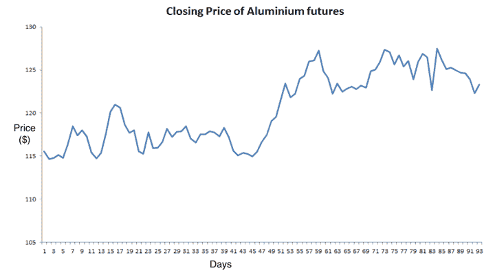
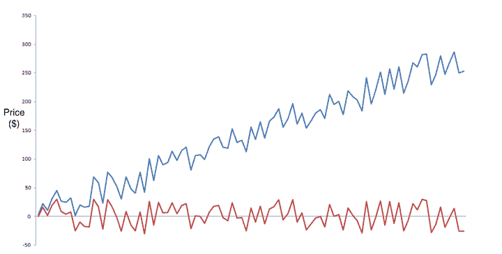

# 时间序列中的均值回归:什么是均值回归和交易策略

> 原文：<https://blog.quantinsti.com/mean-reversion-time-series/>

由[查尼卡·塔卡](https://www.linkedin.com/in/chainika-bahl-thakar-b32971155/)

时间序列数据只是一段时间内生成的观察值的集合。例如，赛车每秒的速度、每日的温度、每周的销售数字、每分钟的股票回报等。

在金融市场中，时间序列跟踪特定数据点的运动，如特定时间段内的证券价格，数据点以固定间隔记录。可以为随时间变化的任何变量生成时间序列。

此外，均值回归是一个简单的概念，即股票价格在由于经济、组织等的任何重大变化而偏离均值一段时间后，最终恢复到均值。

让我们通过这篇博客了解更多关于时间序列均值回归的信息，这篇博客包括:

*   [什么是时间序列分析？](#what-is-time-series-analysis)
*   [什么是均值回归？](#what-is-mean-reversion)
*   为什么均值回归交易有效？
*   [股票如何在时间序列中经历均值回归？](#how-does-a-stock-undergo-mean-reversion-in-time-series)
    *   [平稳性的相关性](#relevance-of-stationarity)
*   [一对股票的时间序列均值回归](#mean-reversion-in-time-series-with-a-pair-of-stocks)
*   [带技术指标的均值回归交易策略](#mean-reversion-trading-strategies-with-technical-indicators)
    *   [移动平均线](#moving-average)
    *   [相对强度指数](#rsi)
    *   [布林线](#bollinger-bands)

* * *

## 什么是时间序列分析？

时间序列是随时间索引的一系列观察值。在交易中，时间序列是一个重要的组成部分，因为它被用来跟踪一段时间内证券的价格。

例如，在一段特定的时间内定期记录的证券价格的变动。

**时间序列的组成部分**

1.趋势:趋势可以显示一个时间序列在很长一段时间内的增长或下降。

2.周期:这是发生在时间序列中的长期振荡。这些运动一般持续五至十二年或更长时间。

3.季节性:时间序列在一定时期内的周期性波动。这些波动形成了一种模式，这种模式往往会从一个季节重复到另一个季节。与周期不同，季节性行为非常有规律，这意味着数据的波峰和波谷之间有精确的时间间隔。

4.不规则波动:这是发生在时间序列中的不太可能重复的突然变化。这些不能用趋势、季节性或周期性运动来解释。这种成分有时被称为时间序列中的随机运动。

现在，时间序列分析意味着分析一个时间序列数据，以了解其特点，设计和框架，以便从中得出推论。时间序列分析有许多应用，包括产量预测、库存研究、经济预测、销售预测等。

时间序列分析的不同方法包括简单预测和平滑模型、相关分析方法和 ARIMA 模型。

现在让我们看看下面的图表，它代表了铝期货在 93 个交易日内的每日收盘价，这是一个时间序列。

Close price

时间序列分析很重要，因为它有助于:

1.  识别数据中观察序列所代表的现象的性质。
2.  预测时间序列变量的未来值。
3.  比较不同的时间序列。

* * *

### 什么是均值回归？

均值回归理论表明，证券价格的相当大的偏离倾向于回到它们的历史均值。

换句话说，如果价格偏离长期平均水平太远，它会回到平均水平。这种理论只考虑极端的变化，不包括正常的增长和其他市场事件的发生。

当当前市场价格低于平均价格时，交易者买入股票，并预期价格会上涨。同样，当价格高于平均价格时，投资者会卖出该证券，预期价格会回落至均值。Pairs 交易策略是基于均值回归理论。

例如，让我们假设股票 ABC 的 1 年平均价格为 125 美元，股票交易价格为 150 美元。由于强劲的基本面，股票价格可能会在一年内逐步上涨，但如果股票价格在一个交易日内上涨 8%至 162 美元，那么人们可能会做空股票，假设股票将回到其长期均值并实现盈利。

* * *

### 为什么均值回归交易有效？

均值回归交易策略有效，因为价格总是在均值附近波动。价格回归均值的原因主要是当价格偏离正常时交易者的情绪。

每当股票价格在一个趋势中上涨，交易者和投资者立即购买股票，以避免错过价格上涨可能带来的机会。因此，需求大于供给。需求的增加也进一步推高了价格。

随着价格继续上涨，越来越多的交易者开始买入股票，直到价格达到最高点，交易者最终开始卖出。现在，角色发生了逆转，供应变得大于需求。

在这样的情况下，价格开始下跌。由于预见到价格下跌，大多数交易者因害怕亏损而开始抛售股票，这导致股票供应过剩，价格下跌得更快。

现在，在一个非常低的价格，一些交易者开始再次购买股票，推动价格略有上升。这导致了一个平衡，因此，价格恢复到平均水平。

* * *

### 股票如何在时间序列中经历均值回归？

在时间序列均值回归的情况下，平稳性检验起着不可或缺的作用。

平稳测试将帮助您分析时间序列是平稳的还是非平稳的。如果时间序列的均值和方差在一段时间内保持不变，则该时间序列将是平稳的。

此外，**平稳时间序列**本质上将是均值回复的，即，由于其有限的常数方差，它不会偏离其均值太远。

相反，**非平稳时间序列**将具有时变方差或时变均值或两者，并且不会趋向于回复到均值。

### 平稳性的相关性

在金融行业，交易者利用稳定的时间序列，当证券价格大大偏离其历史均值时下单，推测价格回归其均值。

下面显示的是一个资产图，它是一个具有确定趋势(Yt = α + βt + εt)的**非平稳时间序列**，由蓝色曲线表示，其去趋势**平稳时间序列** (Yt - βt = α + εt)由红色曲线表示。

这里，Y 轴代表资产的价格。

Stationarity and Non stationarity of time series

我们还观察到，在非平稳时间序列的情况下，数据往往是不可预测的，无法建模或预测。通过对数据进行差分或去趋势处理，可以将非平稳时间序列转换为平稳时间序列。

在这里，随机游走(对象的运动或变量的变化不遵循可辨别的模式或趋势)可以通过差分(计算 Yt 和 Yt -1 之间的差)转换为平稳序列。

* * *

## 一对股票时间序列的均值回复

到目前为止，我们一直在时间序列分析中观察单个股票在一段时间内的平稳性。现在，让我们来看看如何对一对股票进行均值回归。

首先，我们检查股票之间的协整关系，以确定它们是否能够一起产生交易信号。检查一对证券之间的[协整](https://quantra.quantinsti.com/glossary/Cointegration)的常用测试之一是扩展的 Dickey-Fuller 测试(ADF 测试)。

如果 ADF 测试的结果显示两者是协整的，那么这些证券价格之间的[价差](https://quantra.quantinsti.com/glossary/Spread)是固定的。否则，它是非平稳的。

在平稳性的情况下，我们将生成交易信号，假设两种股票的价格最终将恢复到均值。因此，我们可以利用价格在短时间内偏离均值的优势。

如果这一对证券表现出协整关系，那么，我们卖空被高估的股票，对于被低估的股票，我们做多，希望价格在未来会上涨。

让我们看看如何用 Python 对时间序列进行协整-ADF 测试。

首先，你导入必要的库，然后拉两只股票的数据。这里我们把 KO(可口可乐)和百事可乐(PEP)作为两只股票。