# 用 python 建模一个基本的交易策略:从想法到执行

> 原文：<https://blog.quantinsti.com/model-moving-averages-strategy-in-python/>

由[雅克](https://za.linkedin.com/in/jacquesjoubert)儒贝尔

最近，我有幸通过直播参加了在伦敦举行的 *Python for Quants* 大会。每次我参加这一系列的讲座，我都试图以书面形式捕捉其中的一个演讲，这一次，我将根据詹姆斯·芒罗博士题为“量化策略:从想法到执行”的讲座进行写作。

请注意，虽然我在这里使用了他的讲座的大部分信息，但我确实做了一些修改，并添加了我自己的经验。这里所写的并没有得到 AHL 的认可，使用你的想象力来添加你认为合适的所有其他披露。

我真的很喜欢他的讲座，因为作为一个花费大量时间回溯测试不同策略的专业人士，他对我说。它很好地捕捉了回溯测试中的常见错误。

在这篇文章中，我们讲述了一个相当基本的交易策略，它开始看起来很吸引人，但是随着我们慢慢地加入更多的现实因素，你会注意到表现是如何衰退的。

这个策略是一个简单的 20 日均线交叉策略。例如:如果当前价格高于[移动平均线](/moving-average-trading-strategies/)，那么买入并持有，否则做空并持有。该战略将被命名为“玩具战略”。

玩具策略将在天然气期货上运行。

请注意，在期货交易中，我们将不得不滚动合约并将价格缝合在一起，这就是为什么我们使用调整后的结算价格。

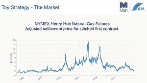

作为一个回溯测试的倡导者，我特别强调传播两种不同类型框架的好消息:向量化和事件驱动。对于这个例子，Munro 博士决定使用一个矢量化回溯测试器，它对于快速构建策略原型非常有用，但是在准确性和灵活性方面却是更大的祸害。

矢量化回溯测试的步骤:

1.  获取数据(天然气)
2.  创建您的指标(20 天 SMA)
3.  根据交易逻辑生成信号
4.  生成持有的头寸
5.  计算绩效指标
6.  绘制权益曲线

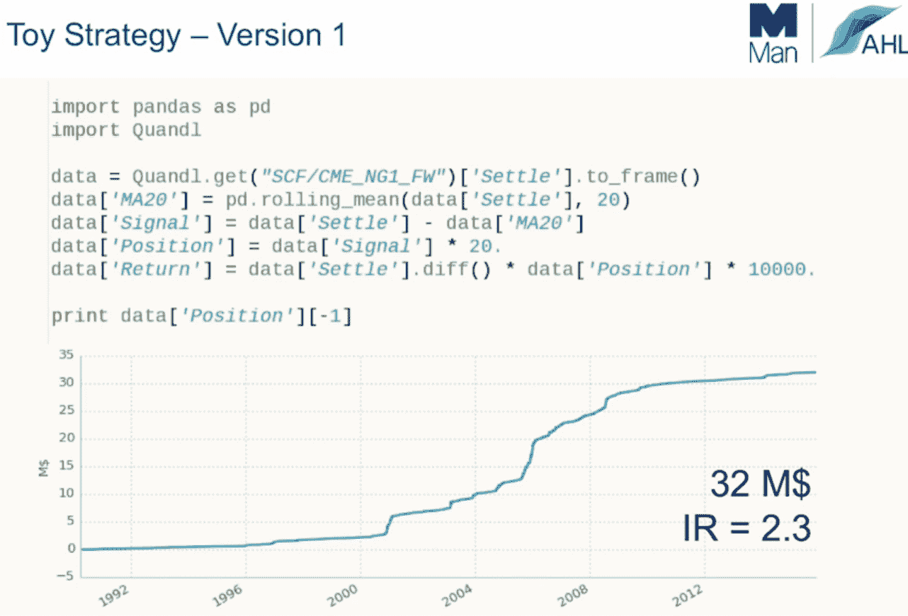

Tada…这是第一个回溯测试，总回报为 3200 万美元，信息比率为 2.3。

就像生活中的大多数事情一样，当有人试图卖给你一些好得难以置信的东西时，它很可能是真的。乍一看，这是一个令人肃然起敬的策略，应该马上实施！然而，本文将带您完成为了验证策略而需要执行的一些检查。

## **第一步:把你的黑匣子变成一个玻璃盒子**

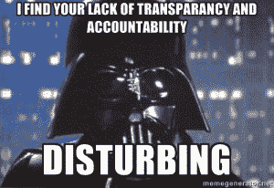

现在有一些实现[机器学习技术](/overview-machine-learning-trading/)的策略更难变成一个玻璃盒子，但这不是其中之一。提高透明度的最简单方法是简单地绘制数据框中的所有列。

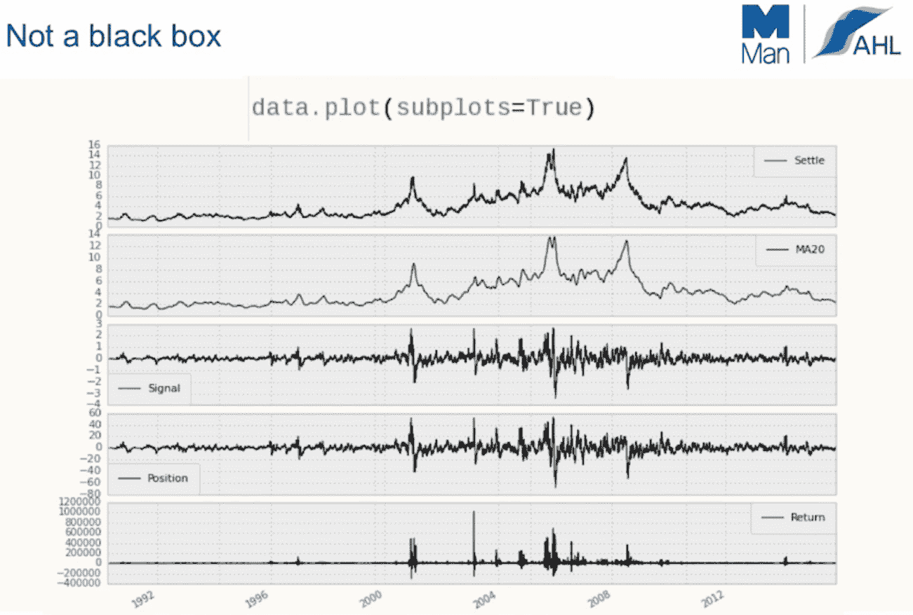

通过这样做，我们可以验证我们的模型如预期的那样运行。

图表 1:每天都有价格数据(在很长一段时间内没有丢失数据)。

图表 2:清楚 20 天的 SMA 平滑了数据，我们没有任何缺口或异常峰值。

图 3:这个信号图不同于我的其他回溯测试，因为它不是一个简单的数值，1 代表买入，0 代表平仓，-1 代表做空。在这个图表中，我们必须将信号值乘以一个倍数来生成位置。(从长远来看，这不是最佳的仓位调整技巧，但这是一个玩具策略。)

图表 4:代表我们在任何给定时间点持有的手数。

图表 5:每日回报

## **第二步:数据验证**

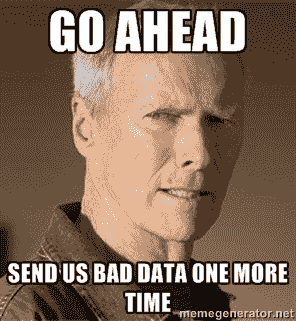

接下来，我们需要验证我们有干净的数据。干净数据包括以下检查:

1.  有每个交易日的数据。如果有数据丢失，则执行向前填充。
2.  确保数据中没有不切实际的峰值。例如:如果平均股价在 400 和 300 之间，那么突然有一个 4000 的峰值，你需要纠正它。这也适用于在数据中插入 0 值的情况。
3.  仔细检查您的时间序列中没有重复的日期
4.  确保你的数据根据股票分割和合并进行了调整，股息调整价格是额外的奖励。
5.  当心免费数据源！根据我的经验，免费数据源的干净数据较少。

确保数据是干净的！就我个人而言，我的大量时间都花在获取和清理数据上。据说 Quandl 是一个很好的来源，我也同意 Quandl 是免费数据的一个很好的来源。然而，如果有选择的话，我会随时选择像彭博这样的付费来源！

接下来，我们运行以下代码来检查我们是否有每个交易日的数据，并且我们可以直观地看到我们所有的历史头寸，这也是玻璃箱概念的一部分:

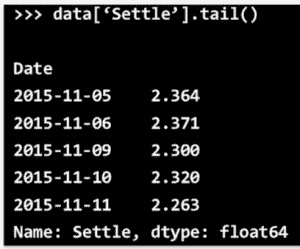

在上面的截图中，你会注意到数据只到 2015 年 11 月 11 日，我知道你不能从阅读文章中看出这一点，但我预计会有到 13 日的数据。为了纠正这一点，Munro 博士在他的代码中添加了一项检查，即使有一些数据丢失，玩具策略也能继续执行。

这个修正是通过声明 ToyStrategy 只需要最少 10 个数据点来计算一个 SMA 数字来添加的。" min_periods = 10 "

现在再次运行代码，注意什么都没有改变。ToyStrategy 仍然有和以前一样的总收益和信息比率。

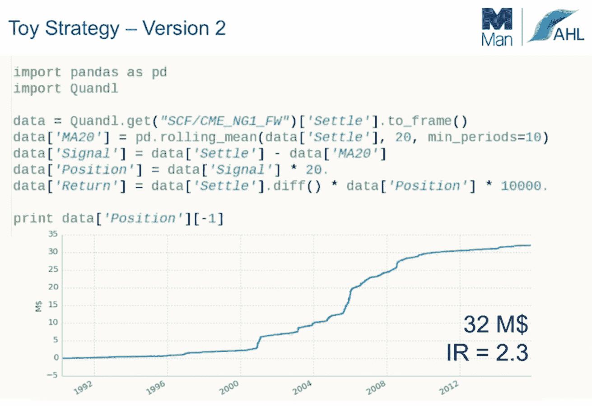

## **第三步:订单管理和头寸规模**

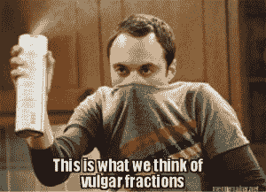

接下来，你需要验证 ToyStrategy 是否实施了正确的[头寸规模](https://quantra.quantinsti.com/course/position-sizing-trading)技术，以及它是否符合你的预期。在矢量化回溯测试中，当处理多个股票时，这可能有点棘手，但 ToyStrategy 只在 1 个资产上运行，并使用矢量化方法。

在步骤 2 中，您会注意到 ToyStrategy 使用实数来表示在某个时间点持有的合约数量，但这是不正确的，您只能持有整数个合约。

要纠正这一点很简单，只需添加 round()函数。

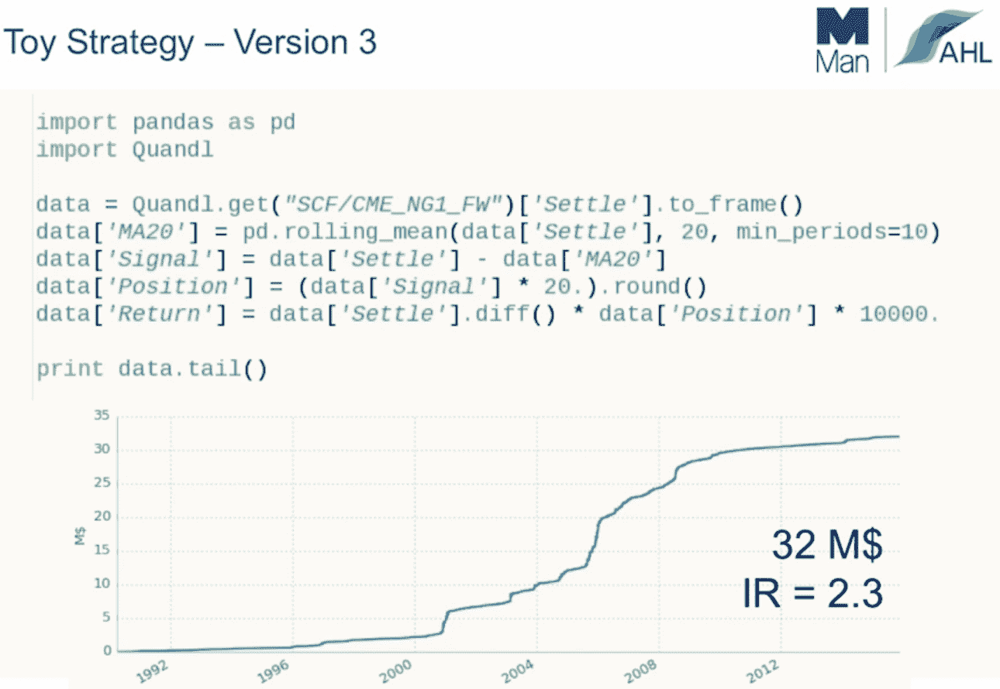

同样，什么都没有改变，为了再次确认我们使用的是整数，我们运行: *print data.tail()*

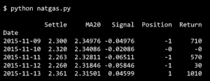

## **第四步:确保你已经消除了前瞻偏差**

接下来，很明显，由于投资策略将信号建立在当天收盘价的基础上，我们必须向前看。为了解决这个问题，我们需要延迟数据，在本例中，我们通过创建一个“下一个位置”列，然后延迟一个名为“位置”的新列中的值。在下面的代码中，这是通过添加“*”来实现的。*轮班①。

哎哟！这里我们可以看到权益曲线的第一个主要差异。事实证明，玩具战略现在不那么有吸引力了，因为它不能展望未来。

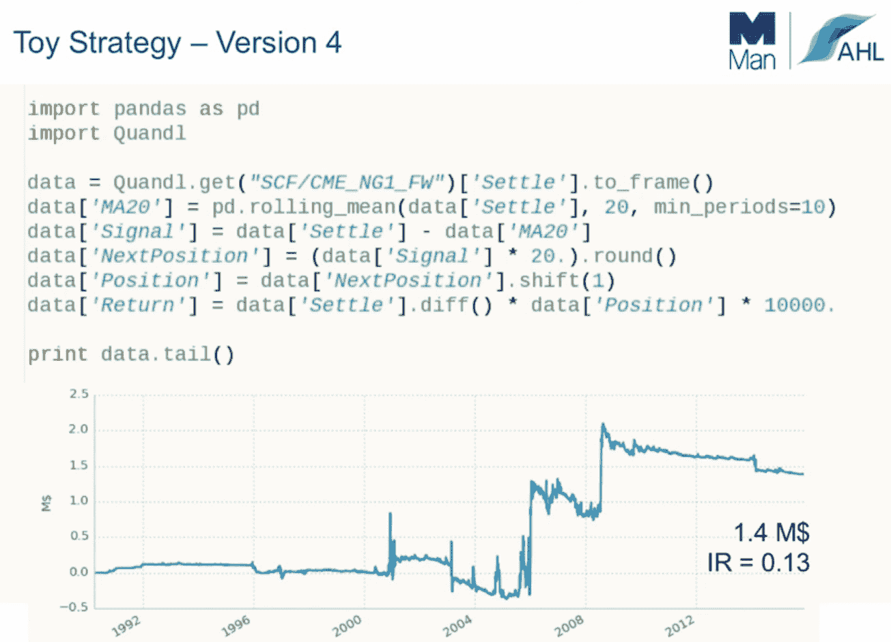

## **第五步:增加交易费用**

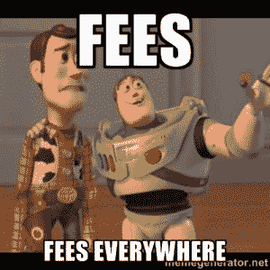

到目前为止，ToyStrategy 策略一直在没有交易费和滑点的情况下运行。雪上加霜的是，由于矢量化方法，我们不得不使用一种非常基本的方法来增加费用。

经过深思熟虑的回溯测试必须包括:

*   滑动
*   佣金
*   其他流动性影响
*   头寸管理(风险限额)

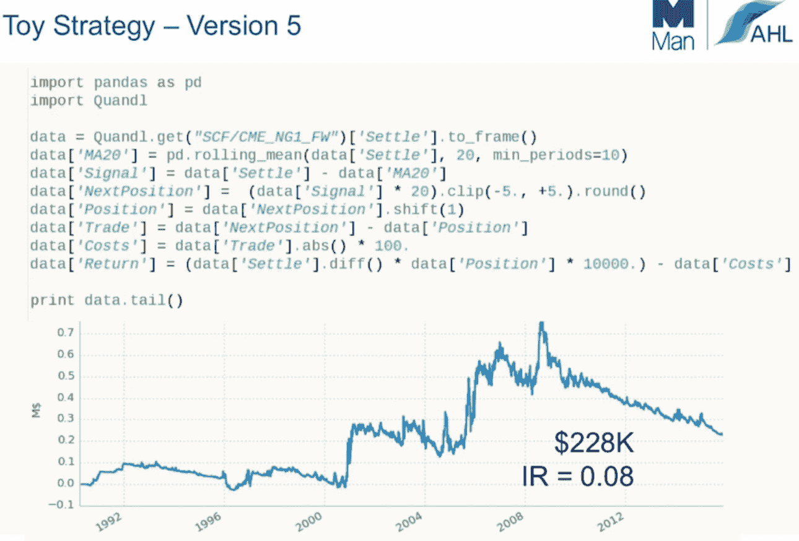

不知何故，这一战略仍然有效，我不知道是怎么回事，但更重要的是，我们可以看到，我们没有办法继续使用这一战略。

## **第六步:实时交易与模拟交易**

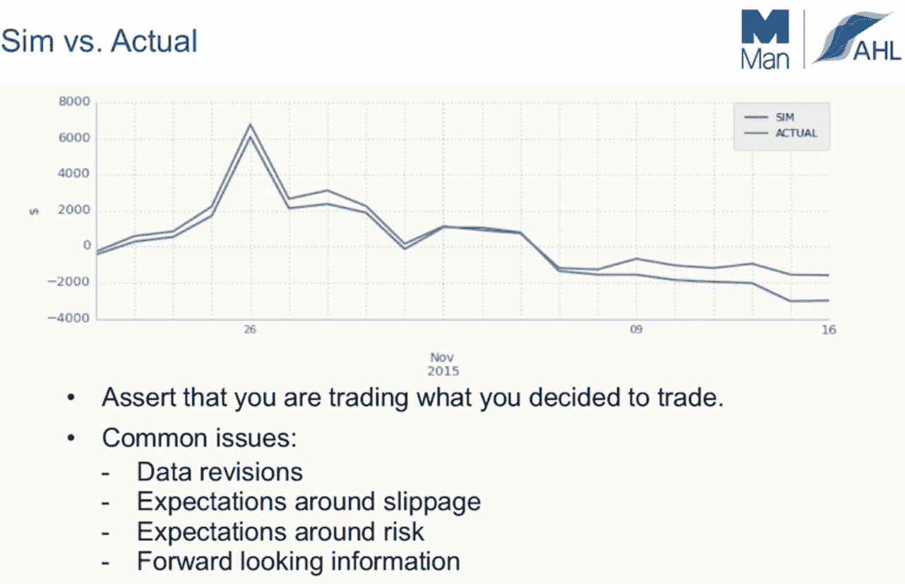

一个推荐的最佳实践是运行你的模拟结果和你的实时交易。通过这样做，你就有了一种查找错误和修复 bug 的方法。

如果你打算把你的模拟结果放在你的基金说明书里让公众查看，那么尽可能谨慎是一个非常好的主意。两者之间不能有太大的差异，这一点很重要。事实上，如果你的实际结果比模拟结果稍微好一点，那就更好了。

## 最后备注:

我希望这篇文章对我们社区中那些开始回溯测试的成员有所帮助。以我的经验来看，有两件事会产生最大的不同，那就是:

1.  通过延迟信号来消除前瞻偏差
2.  增加交易成本和滑点

如果你知道其他可以帮助他人开始的文章，请一定在下面的评论区留下链接。

### 下一步

Python 算法交易在 quant finance 社区中获得了牵引力，因为它可以轻松地建立复杂的统计模型，这是因为有足够的科学库可用，如 Pandas、NumPy、PyAlgoTrade、Pybacktest 等。

如果您希望掌握使用 Python 生成交易策略、回溯测试、处理时间序列、生成交易信号、预测分析等艺术，您可以注册我们的 [Python for Trading 课程！](https://quantra.quantinsti.com/course/python-for-trading)