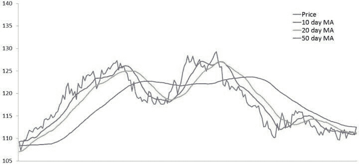
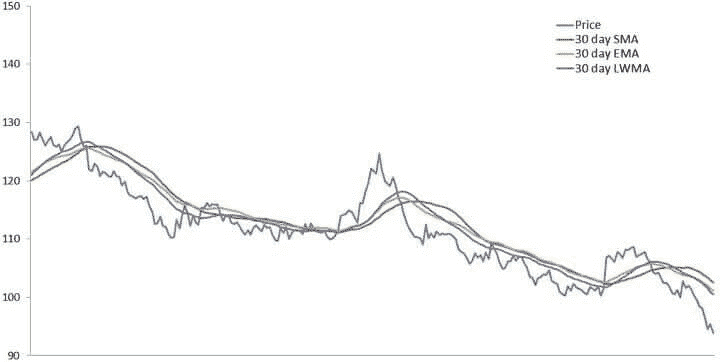
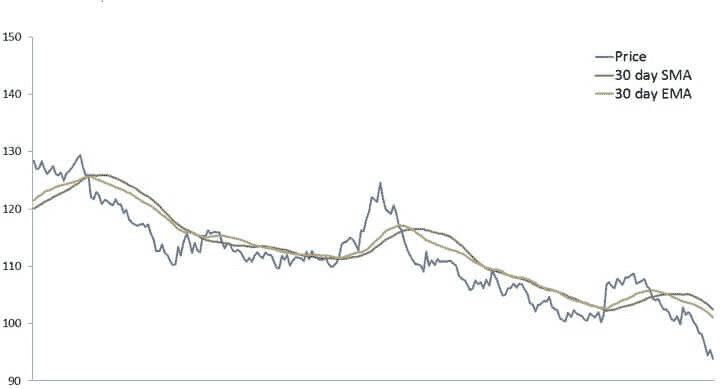
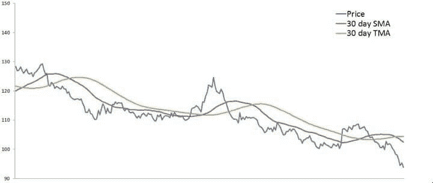
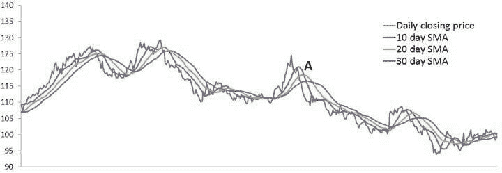
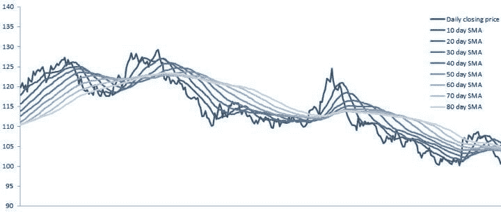
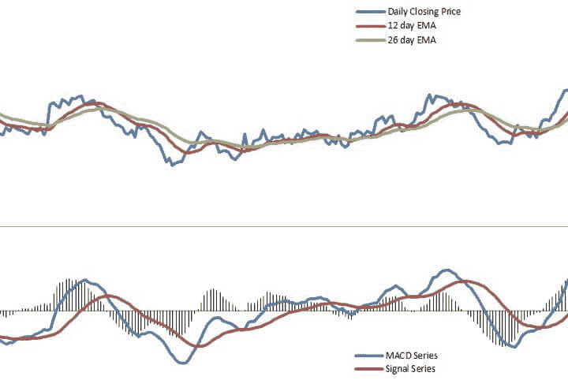

# 移动平均线交易:策略、类型、计算和例子

> 原文：<https://blog.quantinsti.com/moving-average-trading-strategies/>

由[查尼卡·塔卡](https://www.linkedin.com/in/chainika-bahl-thakar-b32971155/)

移动平均线或 MA 是一个用于验证市场运动的技术指标。只有少数其他指标被证明是不偏不倚的，明确的和实际的移动平均线。移动平均线交易帮助交易者识别增加有利交易的趋势。

让我们通过这篇博客了解更多关于移动平均线交易的信息，内容包括:

*   [什么是均线？](#what-is-a-moving-average)
*   [移动平均指标的计算](#calculation-of-a-moving-average-indicator)
*   [移动平均指标示例](#example-of-a-moving-average-indicator)
*   [计算移动平均指标的回看周期](#lookback-periods-for-calculating-the-moving-average-indicator)
*   [移动平均线的类型](#types-of-moving-averages)
*   [移动平均线交易策略](#moving-average-trading-strategies)
*   [在交易中使用均线的优势](#advantages-of-using-moving-averages-in-trading)
*   [在交易中使用均线的缺点](#disadvantages-of-using-moving-averages-in-trading)
*   [常见问题解答](#faqs)
    *   [哪条均线最适合交易？](#which-moving-average-is-best-for-trading)
    *   移动平均线交易能提供好的结果吗？
    *   如何使用均线？

* * *

## 什么是均线？

移动平均线是一系列数值的平均值。它们有一个预定义的长度，用于计算要平均的值的数量。随着时间的推移，随着更多数据的添加，这组值会向前移动。

给定一系列数字和一个固定的子集大小，移动平均系列的第一个元素是通过取数字系列的初始固定子集的平均值获得的。

然后通过向前移动一个值来修改子集。换句话说，当我们获得更新的数据时，子集的第一个元素被排除，最新的元素被添加，这保持了长度的固定。

移动平均线基于持续时间(也称为回顾期)工作，例如 10 天、20 天等等。根据交易者的偏好，回望期可以是分钟、小时等。

众所周知，移动平均线是滞后指标，因为它们落后于价格/交易量图的变动。滞后指标之所以存在，是因为它们是用历史数据计算出来的。

与较慢的移动平均线(长期或长回望期)相比，较快的移动平均线(短期或短回望期)具有较小的滞后。

持续时间较短的移动平均线被称为快速移动平均线，对趋势变化的反应更快。

快速移动平均线也被称为较小的移动平均线，因为它们对每日价格变化的反应较小。

证券价格倾向于快速波动，因此，图表包含几个波峰和波谷，很难理解整体运动。

但是对于移动平均线交易，移动平均线有助于平滑波动，使分析师和交易员能够预测证券价格的趋势或运动。在[金融市场](/financial-markets-introduction/)，它最常用于股票和衍生品价格、百分比回报、收益率和交易量。

* * *

## 移动平均指标的计算

让我们看看下面提到的简单移动平均线的计算示例。计算五个数据点的平均值。

| 数字系列 | 7 12 2 14 15 16 11 20 7 |
| MA 系列的第一个值 | (7 + 12 + 2 + 14 + 15) / 5 = 10 |
| MA 系列的第二个值 | (12 + 2 + 14 + 15 + 16) / 5 = 11.8 |
| MA 系列的第三个价值 | (2 + 14 + 15 + 16 + 11) / 5 = 11.6 |

可以看出，用于计算平均值的子集向前移动了一个数据条目，因此称为移动平均值(也称为移动平均值或滚动平均值)。可以为任何时间序列计算移动平均序列。

* * *

## 移动平均指标示例

现在让我们看看移动平均线交易的例子，图表显示 10 天，20 天和 50 天的移动平均线。

<figure class="kg-card kg-image-card kg-width-full kg-card-hascaption">

<figcaption>Example of moving average</figcaption>

</figure>

上面的图表显示了期货合约的收盘价(蓝线)，10 天移动平均线(红线)，20 天移动平均线(绿线)和 50 天移动平均线(紫线)。

可以观察到，50 天移动平均线是最平滑的，10 天移动平均线具有最大数量的波峰和波谷或波动。随着回看周期的增加，移动平均线远离价格曲线。

红线(10 天移动平均线)最接近蓝线(价格曲线)，紫线(50 天移动平均线)最远。

* * *

## 用于计算移动平均指标的回望周期

在移动平均线交易中，计算移动平均线最常用的回顾周期是 10、20、50、100 和 200。

这些回顾周期可以是一分钟、每天、每周等等。这取决于交易者希望进行长期交易还是短期交易。

短时间的均线比长时间的均线对价格变化的反应要快得多。

此外，移动平均值可以是任何长度，即 17、29、110 等。并且交易者可以根据历史数据分析自由调整时间段。

* * *

## 移动平均线的类型

根据平均值的计算方式，有许多不同类型的移动平均值。五种最常用的移动平均线是简单(或算术)、指数、加权、三角和可变移动平均线。

不同移动平均线之间的显著差异是在移动平均线周期中分配给数据点的权重。

简单移动平均线对所有数据点应用相同的权重。指数和加权平均值对最近的数据点应用更多的权重。三角形平均线在移动平均线周期的中间对数据施加更多的权重。可变移动平均线根据价格的波动改变权重。

### 简单移动平均线

简单(或算术)移动平均是一种算术移动平均，计算方法是将时间序列中的元素相加，然后将总和除以时间段数。顾名思义，简单均线是最简单的一种均线。

它可以说是交易者使用的最流行的技术分析工具。SMA 中的所有元素都具有相同的权重。如果移动平均周期是 5，那么 SMA 中的每个元素在 SMA 中的权重是 20% (1/5)。

SMA 通常用于识别趋势方向，但是它也可以用于产生潜在的交易信号。

计算 SMA 的公式很简单:

**SMA =(移动平均周期内数据点之和)/(总周期数)**

### 加权移动平均(WMA 或 LWMA)

加权移动平均指的是移动平均周期中的每个数据点在计算平均值时被赋予特定权重的移动平均。指数移动平均是一种加权移动平均，其中移动平均周期中的元素被赋予指数增长的权重。

线性加权移动平均(LWMA)，通常也称为加权移动平均(WMA)，是通过向移动平均周期中的元素分配线性增加的权重来计算的。

如果移动平均周期包含十个数据条目，则最近的元素(第十个元素)将乘以十，第九个元素将乘以九，依此类推，直到乘数为一的第一个元素。

然后将所有这些线性加权元素的总和相加，并除以乘数的总和。在 10 个元素的情况下，总和将除以 55 (n(n+1)/2)。下图显示了 30 天的 SMA(红线)、EMA(绿线)和 LWMA(紫线)。

<figure class="kg-card kg-image-card kg-width-full kg-card-hascaption">

<figcaption>Weighted moving average</figcaption>

</figure>

从上图可以看出，和指数移动平均线一样，加权移动平均线对价格曲线变化的反应比简单移动平均线更快。

但是它对波动的反应比均线稍慢。

对波动反应慢是因为 LWMA 比均线更看重最近的数据。在均线的情况下，每个新数据点的权重以指数方式增加。

下面提到的是在计算 4 天的 EMA 和 WMA 时给元素的权重:

| **元素** | **EWMA** | **LWMA** |
| 最新元素: | 2/(4+1) = 40% | 4/10 = 40% |
| 第二个最近的元素: | 40% x 60% = 24% | 3/10 = 30%  |
| 第三个最新元素: | 24% x 60% = 14.4% | 2/10 = 20%  |
| 第四个最新元素: | 14.4% x 60% = 8.6% | 1/10 = 10%  |
| 第五个最新元素: | 8.6% x 60% = 5.2% | 0/10 = 0% |
| 第六个最新元素: | 5.2% x 60% = 3.1% | 0/10 = 0% |
| 第 7 个最新元素: | 3.1% x 60% = 1.9% | 0/10 = 0% |

诸如此类…

### 指数移动平均线(均线或 EWMA)

简单的移动平均线有时过于简单，当证券价格出现峰值时，它就不能很好地工作。指数移动平均线给予最近的时间段更多的权重。

这使得它们比 SMA 更可靠，更好地代表了证券的近期表现，因此可以用来创建更好的移动平均策略。

均线的计算如下所示:

**加权乘数= 2 /(移动平均周期+1)**

**均线=(收盘价-前一日均线/棒线)x 乘数)+前一日均线/棒线**

改写为: **EMA =(收盘价)x 乘数+(前一日/棒线的 EMA)x(1-乘数)**

短期均线对最新数据的权重大于长期均线。例如，10 期均线的权重为 18.18% (2/11)，而 20 期均线的权重为 9.52% (2/21)。

指数移动平均线这个名字是因为在移动平均线周期中的每一项都比前一项具有更大的指数权重。指数移动平均线比简单移动平均线反应更快，这可以从下面的图表中看出。

在下图中，蓝线代表每日收盘价，红线代表 30 日均线，绿线代表 30 日均线。

<figure class="kg-card kg-image-card kg-width-full kg-card-hascaption">

<figcaption>Exponential moving average</figcaption>

</figure>

下面我提到了约翰·j·墨菲的著作《金融市场的技术分析》的摘录，该书由纽约金融研究所于 1999 年出版。这项工作包含了一个关于指数加权移动平均线优于简单移动平均线的最好解释。

内容如下:

指数平滑移动平均解决了与简单移动平均相关的两个问题。首先，指数平滑的平均值给较新的数据分配较大的权重。因此，它是一个加权移动平均线。

但是，尽管它不太重视过去的价格数据，但它确实在计算中包括了该工具生命周期中的所有数据。

*此外，用户可以调整权重，对最近一天的价格给予更大或更小的权重，该权重将被添加到前一天价格的百分比中。两个百分比值的总和为 100。*

### 三角形移动平均线

三角形移动平均线是一条双重平滑的曲线，这也意味着数据被平均了两次(通过平均简单移动平均线)。TMA 是一种加权移动平均，其中权重以三角形模式应用。按照下面提到的步骤计算 TMA:

首先，计算简单移动平均线(SMA):

**SMA = (D1 + D2 + D3 +。。。。。。+ Dn) / n**

接下来，计算 SMAs 的平均值:

**TMA = (SMA1 + SMA2 + SMA3 +。。。。。。+ SMAn) / n**

<figure class="kg-card kg-image-card kg-width-full kg-card-hascaption">

<figcaption>Triangular moving average</figcaption>

</figure>

考虑上面的图表，它由每日收盘价曲线(蓝线)、30 天 SMA(红线)和 30 天 TMA(绿线)组成。可以观察到，TMA 比 SMA 平滑得多。TMA 的波动比 SMA 更长更稳定。

因为双重平均，TMA 的滞后大于其他均线，比如 SMA 和 EMA。可以观察到，TMA 需要更长的时间来对价格波动做出反应。

与均线产生的信号相比，TMA 在趋势期间产生的交易信号会远离该期间的波峰和波谷，因此使用 TMA 的利润会更少。

然而，在盘整期间，TMA 不会产生和 SMA 一样多的交易信号，这可以避免交易者持有不必要的头寸，降低交易成本。

### 可变移动平均线(VMA)

可变移动平均线是由 Tushar Chande 于 1991 年开发的指数加权移动平均线。Chande 建议，指数移动平均线的性能可以通过使用波动指数(VI)来改善，以在市场条件变化时调整平滑期。波动性是衡量价格随时间变化快慢的指标。

波动率指数显示了市场对未来 30 天的波动率预测。

开发 VMA 的目的是在价格处于盘整期时降低平均速度，以避免无效的交易信号，并在市场呈趋势时提高平均速度，以充分利用趋势价格。

下面给出了计算可变移动平均线的方法:

**VMA = (𝛂 * VI *收盘价)+ (1 - (𝛂 * VI)) * VMA[1]**

其中，
*𝛂 = 2 / (N + 1)
VI =波动率或趋势强度的度量
N =用户决定的平滑周期
VMA [1] =变量移动平均线的前一个值*

* * *

### 移动平均线交易策略

现在让我们讨论一些已知的移动平均线交易策略。当你看每一个均线交易指标时，你会看到每个指标在交易时的相关性。

### 三重移动平均交叉策略

三重均线策略包括绘制三条不同的均线来产生买入和卖出信号。这种均线策略比双均线交叉系统更擅长处理虚假交易信号。

通过使用不同回看期的三条移动平均线，交易者可以确认市场是否真的见证了趋势的变化，或者它只是在继续之前的状态下暂时休息。买入信号在趋势形成的早期产生，卖出信号在趋势结束的早期产生。

第三条均线和另外两条均线一起使用，确认或否定它们产生的信号。这降低了交易者根据错误信号采取行动的概率。

移动平均线周期越短，它就越接近价格曲线。当证券开始上涨时，快速移动平均线(短期)将比慢速移动平均线(长期)更早开始上涨。

假设一种证券在过去 60 个交易日中每天上涨相同的数量，然后在接下来的 60 天中开始下跌相同的数量。10 天移动平均线将在第六个交易日开始下降，20 天和 30 天移动平均线将分别在第 11 天和第 16 天开始下降。

趋势持续的概率与趋势已经持续的时间成反比。因为这个原因，等待交易太久会导致错过大部分收益，而过早进入交易可能意味着进入了错误的信号，不得不亏损退出。

为了说明这种移动平均线策略，我们将使用 10 天、20 天和 30 天的简单移动平均线，如下图所示。

均线的持续时间和类型取决于交易者交易的时间框架。对于较短的时间框架(1 小时或更短)，指数移动平均线是首选，因为它倾向于紧密跟随价格曲线(例如 4、9、18 均线或 10、25、50 均线)。

对于更长的时间框架(日线或周线)，交易者更喜欢使用简单的移动平均线(例如 5，10，20 日均线或 4，10，50 日均线)。移动平均周期根据交易者的策略和交易的证券而变化。

<figure class="kg-card kg-image-card kg-width-full kg-card-hascaption">

<figcaption>Triangular moving average</figcaption>

</figure>

考虑上面图表中的点“A ”,三条均线围绕这个点改变方向。

红线代表快速移动平均线(10 天 SMA)，绿线代表中等移动平均线(20 天 SMA)，紫线代表慢速移动平均线(30 天 SMA)。

当快速移动平均线穿过中等移动平均线和慢速移动平均线时，卖出信号被触发。这显示了趋势的短期转变，即过去 10 天的平均价格已经低于过去 20 天和 30 天的平均价格。

当中等移动平均线穿过慢速移动平均线之下时，卖出信号被确认。当中等(20 天)移动平均线穿过慢速(30 天)移动平均线之下时，动量的转移被认为是更重要的。

三重均线交叉系统在慢速均线高于中等均线，中等均线高于快速均线时产生卖出信号。

当快速移动平均线高于中等移动平均线时，系统退出。因此，与双重均线交易系统不同，三重均线系统并不总是在市场上出现。

当慢速移动平均线和中等移动平均线之间的关系与中等移动平均线和快速移动平均线之间的关系不匹配时，系统就退出了市场。

更激进的交易者不会等待趋势的确认，而是根据快速移动平均线穿越慢速和中等移动平均线的情况建仓。

你也可以在不同的时间进入头寸，例如，当快速移动平均线穿过中等移动平均线时，交易者可以持有一定数量的多头头寸，然后当快速移动平均线穿过慢速移动平均线时，持有下一组多头头寸。

最后，当介质穿过慢速移动平均线时，建立更多的多头仓位。如果在任何时候观察到趋势逆转，他可能会退出他的位置。

### 移动平均线带

均线带是均线交叉系统的延伸版本。这种移动平均线策略是通过将大量移动平均线放在同一个图表上创建的(下图使用了 8 个简单的移动平均线)。

在选择均线的长度和类型时，必须考虑时间跨度和投资目标。

当所有的均线都向同一个方向移动时，趋势就被认为是强的。交易信号以类似于三重均线交叉系统的方式产生，交易者必须决定交叉的次数来触发买入或卖出信号。

交易者在快速移动平均线穿过慢速移动平均线时买入，在快速移动平均线穿过慢速移动平均线时卖出。

<figure class="kg-card kg-image-card kg-width-full kg-card-hascaption">

<figcaption>Moving Average Ribbon</figcaption>

</figure>

### 移动平均收敛发散(MACD)

MACD 是移动平均线收敛发散的缩写，是一个趋势跟踪动量指标。它是三个时间序列的集合，根据历史价格数据(通常是收盘价)的移动平均值进行计算。

MACD 线是特定证券收盘价的快速(短期)指数移动平均线和慢速(长期)指数移动平均线之差。

信号线是 MACD 线的指数移动平均线。在这个均线策略中，交易者寻找 MACD 和信号线的交叉点。

MACD 策略由定义策略的三个参数表示，即三个移动平均线的时间周期——MACD(a，b，c ),其中 MACD 系列是时间周期为“a”和“b”的 EMAs 之差。信号线是 MACD 系列的均线，时间周期为“c”。

最常用的 MACD 策略对 MACD 系列使用 12 天和 26 天的均线，对信号系列使用 9 天的均线，用 MACD(12，26，9)表示。下图是根据这些输入参数绘制的

MACD 线=收盘价的 12 日均线-收盘价的 26 日均线信号线= MACD 线的 9 日均线柱状图= MACD 线-信号线

<figure class="kg-card kg-image-card kg-width-full kg-card-hascaption">

<figcaption>MACD</figcaption>

</figure>

图表的上半部分包含每日收盘价(蓝线)、12 日均线(红线)和 26 日均线(绿线)。

图表的下半部分由 MACD 系列(蓝线)组成，它是用快速移动平均线(12 日均线)减去慢速移动平均线(26 日均线)计算出来的。

信号序列(红线)是用 MACD 序列的 9 日均线计算出来的，最后 MACD 直方图(黑色垂直线)是用 MACD 序列减去信号序列绘制出来的。

对 MACD 图表有许多不同的解释。最常用的信号触发是当 MACD 线穿过信号线时。

当 MACD 线穿过信号线上方时，建议买入标的证券，当 MACD 线穿过信号线下方时，触发卖出信号。

这些事件被视为潜在安全趋势即将向交叉方向升级的迹象。交易者考虑的另一个交叉叫做零交叉。

当价格曲线的慢速和快速移动平均线交叉时，或者当 MACD 序列改变符号时，就会出现这种情况。

从正到负的变化被认为是熊市信号，而从负到正的变化被认为是牛市信号。零交叉提供了对趋势变化的确认，但在触发信号方面不如信号交叉可靠。

交易者也监控 MACD 线和信号线的背离，可以通过柱状图观察。当柱状图开始下降(向零线移动)时，它表明趋势在减弱，这发生在 MACD 和信号线汇合的时候。

反之，当信号线和 MACD 线背离，或者柱状图上升(远离零线)，则表明趋势变强。

* * *

## 在交易中使用均线的优势

在交易中使用均线的优势是:

*   你可以根据市场趋势进行交易。通过分析，你可以发现它是上升趋势(价格在均线上方移动)还是下降趋势(价格在均线下方移动)。
*   还要考虑许多其他因素，如交易周期的长度、移动平均线交叉等。你可以找到交易头寸。当价格趋势强劲时，你也可以找到进场点。
*   可以作为支撑点/阻力点。
*   移动平均线交易通过创建一个不断更新的平均价格来帮助拉平特定时期的价格数据。因此，该指标对新的和更新的信息作出反应，这意味着更好的预测。

* * *

## 交易中使用均线的缺点

现在我们将讨论均线交易的一些缺点，你可以权衡一下成功交易的好处。

以下是均线交易的一些缺点:

*   如果价格波动，价格可能来回波动，产生多个趋势反转或交易信号。当这种情况发生时，最好靠边站或利用另一个指标来帮助澄清趋势。同样的事情也会发生在均线交叉上。在 Quantra 课程中详细学习[价格行动交易策略](https://quantra.quantinsti.com/course/price-action-trading-strategies)。
*   移动平均线在强趋势条件下运行良好，但在波动或波动条件下运行不佳。调整时间框架可以暂时帮助解决这个问题，但是，在某些时候，这些问题很可能会发生，不管移动平均线的时间框架是什么。
*   均线交易在横盘行情中不起作用。在横向市场的情况下，证券的价格在相当稳定的范围内交易，在一段时间内没有形成任何特定的趋势。在横盘行情中，由于价格线的重叠，移动平均线可能会产生错误的信号。

在上面提到的均线交易不成功的情况下，你可以避免均线交易。

* * *

## 常见问题

### 哪条均线最适合交易？

在均线交易中，每个均线指标都各有利弊。因此，对于交易者来说，根据影响金融工具价格的一些因素来决定移动平均线指标是很重要的。

例如，由于某些事件(如经济衰退)导致的可预测的价格回撤，价格短暂且波动较大的市场情况等。

每一个均线指标都是不同的，在特定的情况下都能很好地发挥作用。让我们看看均线和 SMA 指标的区别，找出区别。

**均线指示器**

当价格改变方向时，均线反应更快。例如，如果价格回撤走低，均线开始向下，表明交易信号发生了变化。

**形状记忆合金指示器**

SMA 移动得慢得多，当价格短暂波动时，它可以让你交易更久。

### 移动平均线交易能提供好的结果吗？

移动平均线交易指标只是一个帮助你追踪价格变化和波动的指标，这样你就可以对交易头寸采取正确的措施。

好的结果取决于你的交易策略以及根据特定的市场趋势应用正确的移动平均线指标。

### 均线是如何使用的？

在移动平均线交易中，移动平均线指标只是用来预测价格的变化和金融市场趋势的变化。

例如，如果价格高于 200 天移动平均线，这表明市场正在经历对股票的看涨情绪。

* * *

### 结论

移动平均线交易是最受欢迎的交易，因为移动平均线帮助交易者了解市场的变化趋势，并在此基础上进行交易。

当用移动平均线交易时，你必须考虑许多市场相关因素，如任何预测的价格波动，趋势反转等。在交易之前。

了解均线交易的利与弊也是对交易者的现实检验，这样预测和交易策略就建立在正确的分析基础上。一旦交易者知道如何以最好的方式使用均线指标，均线交易就是成功的。

如果你想了解更多关于移动平均线交易的知识，并希望通过一个完整的课程来学习，请学习我们关于技术分析指标的课程。本课程将使你熟悉移动平均线技术指标，同时帮助你同时比较其他指标。此外，如果你希望使用移动平均线交易，你将能够深入了解每种类型的移动平均线和策略。

祝你成功的移动平均线交易！

* * *

*<small>免责声明:股票市场的所有投资和交易都涉及风险。在金融市场进行交易的任何决定，包括股票或期权或其他金融工具的交易，都是个人决定，只能在彻底研究后做出，包括个人风险和财务评估以及在您认为必要的范围内寻求专业帮助。本文提到的交易策略或相关信息仅供参考。</small>T3】*