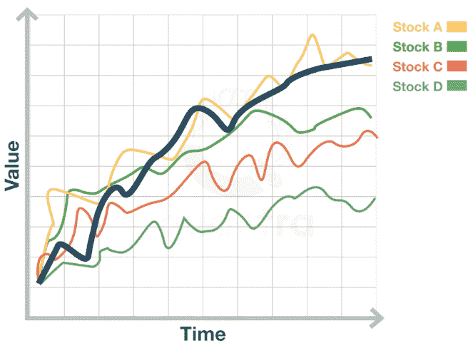
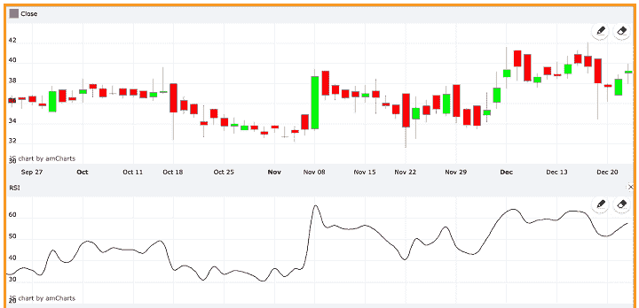
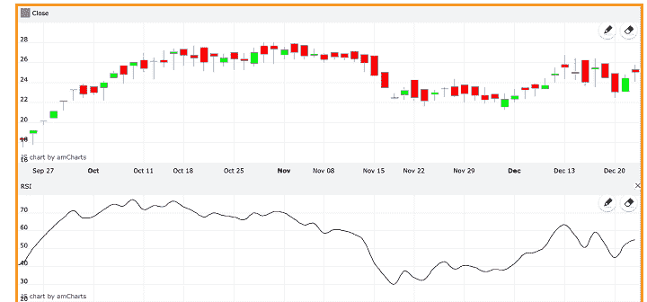

# 互斥事件:公式、示例、计算等等

> 原文：<https://blog.quantinsti.com/mutually-exclusive-events/>

由[查尼卡·塔卡](https://www.linkedin.com/in/chainika-bahl-thakar-b32971155/)

互斥事件是同时停止存在的有趣事件。在这篇文章中，你会发现这两个或更多的互斥事件是如何在金融市场上发生的。

博客内容包括:

*   [什么是互斥事件？](#what-are-mutually-exclusive-events)
*   [交易中互斥事件的例子](#example-of-mutually-exclusive-events-in-trading)
*   [计算互斥事件](#calculating-mutually-exclusive-events)
*   [经济中相互排斥的事件](#mutually-exclusive-events-in-the-economy)
*   [互斥事件和独立事件的区别](#difference-between-mutually-exclusive-events-and-independent-events)
*   [交易领域独立事件的例子](#example-of-an-independent-event-in-trading-domain)

* * *

## 什么是互斥事件？

互斥事件是那些不能同时发生的事件。例如，你不能同时向前和向后跑。

扔硬币是另一个例子。你不能指望在一个翻转或事件中正面和反面。同样，在金融市场交易实践中也存在互斥事件。

* * *

## 交易中互斥事件的例子

金融市场交易中互斥事件的一个非常简单的例子可以解释为同时包括你的预算和不同股票的价值。

现在，假设你希望你的投资组合中有股票 A、股票 B、股票 C 和股票 D。这些股票在下面的图表中显示(市场指数用黑线标出)，它们的价值随着时间的推移而增加。

Example of mutually exclusive events in trading

假设你的预算是 100 万美元。现在，如果:

*   股票 A 的价格是每股 90，000 美元，而
*   股票 B 的价格是每股 80，000 美元，
*   股票 C 和股票 D 的价格为每股 50，000 美元

预算不允许你投资所有的股票，因为你只有有限的资本投资。在这里，你既可以只投资股票 A，也可以只投资股票 b。或者，你可以同时投资股票 C 和股票 D，因为它们并不相互排斥。

它导致了这些启示:

**与股票 A**

*   股票 A 和股票 B -互斥
*   股票 A 和股票 C -互斥
*   股票 A 和股票 D -互斥

**与股票 B**

*   股票 B 和股票 A 相互排斥
*   股票 B 和股票 C -互斥
*   股票 B 和股票 D -互斥

**与股票 C**

*   股票 C 和股票 A -互斥
*   股票 C 和股票 B -互斥
*   股票 C 和股票 D -不相互排斥

**与股票 D**

*   股票 D 和股票 A -互斥
*   股票 D 和股票 B -互斥
*   股票 D 和股票 C -不相互排斥

互斥投资的概念也可以由战略考虑来驱动，资金被导向那些将允许你最有效地追求你想要的投资的股票。

* * *

## 计算互斥事件

为了计算互斥事件，可以使用概率。概率被认为是金融、人工智能、博弈论、哲学等各个领域最常用的实践。

在概率的情况下，每个互斥事件都有至少发生一次的可能性。例如，抛硬币可能以正面或反面结束，应用以下公式，每种情况发生的概率为 0.5:

**P(A) =有利结果总数/可能结果总数**

其中，P(A) =概率

*   有利结果的总数= 1(正面或反面)
*   可能结果的总数= 2(正面和反面)

所以要么正面要么反面的概率是 0.5。

好的，这是一个简单的概率解释。现在，在互斥事件的情况下，可以求出其中一个事件(一个或多个互斥事件)发生的概率。

* * *

## 经济中相互排斥的事件

经济中可能存在一些相互排斥的事件，如通货膨胀和通货紧缩。这两个经济事件不可能同时发生。而且，即使其中一个发生了，比如通货膨胀，那么更进一步的事件，比如降低利率和美元升值也不可能同时发生。

因此，这三个事件是互斥的，因为它们**不能**一起发生:

*   通货膨胀
*   低利率
*   美元价值的增加

同样，这三个事件是互斥的，并且**不能**一起发生:

*   通货紧缩
*   更高的利率
*   美元价值下降

* * *

## 互斥事件和独立事件的区别

独立事件是那些不像互斥事件那样相互关联的事件。下表清楚地显示了不同之处:

| **独立事件** | **互斥事件** |
| 两件事之间没有关系，但它们可以同时发生 | 这两件事不可能同时发生 |
| 比如是晴天(一个事件)。我赢得了国际象棋比赛(另一项赛事) | 例如，当你掷硬币时，头和尾不能同时出现 |

* * *

## 交易领域中的独立事件示例

现在，让我们以一个独立事件为例，借助一个被称为相对强度指数或 [RSI](/rsi-indicator/) 的技术指标，更好地了解这两个事件之间的差异。

相对强弱指数 RSI 是一个[动量](https://quantra.quantinsti.com/course/momentum-trading-strategies)振荡器，用来指示市场中[超卖](https://quantra.quantinsti.com/glossary/Overbought) t 和[超卖](https://quantra.quantinsti.com/glossary/Oversold)的情况。它在 0 和 100 之间波动，其值低于某个值，通常是 30，表明市场超卖，而高于另一个值，比如 70，表明超买。

通常，14 天的回顾期被考虑用于其计算，并且可以改变以适合特定资产或交易风格的特征。

现在，两只股票的增减是完全相互独立的。例如，在 RSI 的帮助下，我们有以下两种模式来显示两只不同的股票如何在同一时间出现不同的模式:

以下是 AARON 的 RSI 分析:

Following is the RSI analysis for AARON

以下是 aarey 药物的 RSI 分析:

Following is the RSI analysis for AAREYDRUGS Source: [Traders Cockpit](https://www.traderscockpit.com/?pageView=rsi-indicator-rsi-chart&type=rsi&symbol=AAREYDRUGS)

在上面的解释中，很明显，一只股票的模式与另一只完全无关，两种模式可以同时出现。因此，对于 AARON 和 AAREYDRUGS，交易者的进出决定完全独立于其他人的模式。

* * *

### 结论

互斥事件可能会限制一个人同时在两个地方投资，但它们也有助于一个人决定如何分散投资以获得有利的结果。

我们讨论了如何根据预算要求管理多样化的投资组合，以及互斥事件与独立事件有何不同。

你知道你可以用研究论文作为灵感来想出新的交易策略吗？Quantra 关于[事件驱动交易策略](https://quantra.quantinsti.com/course/event-driven-trading-strategies)的课程帮助您创建和回测八种季节性策略，以利用股票、国债和波动市场中存在的异常现象。现在一定要去看看！

* * *

*<small>免责声明:本文提供的所有数据和信息仅供参考。QuantInsti 对本文中任何信息的准确性、完整性、现时性、适用性或有效性不做任何陈述，也不对这些信息中的任何错误、遗漏或延迟或因其显示或使用而导致的任何损失、伤害或损害负责。所有信息均按原样提供。</small>*