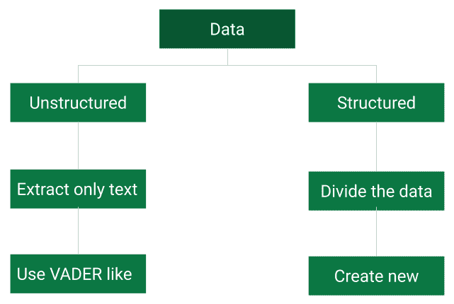
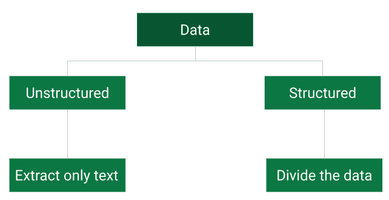
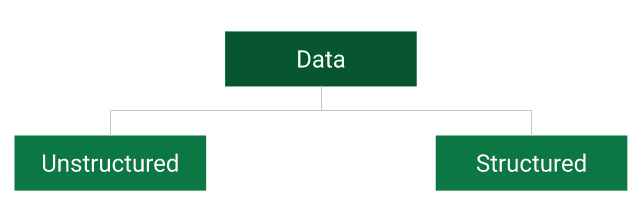

# 交易中自然语言处理的逐步指南

> 原文：<https://blog.quantinsti.com/natural-language-processing-trading/>

自然语言处理(NLP)在交易中被广泛使用。它主要用于通过 Twitter 订阅源、报纸文章、RSS 订阅源和新闻稿来衡量市场的[情绪](/tag/sentiment-trading/)。在这篇博客中，我们将从交易者的角度讲述解决 NLP 问题所需的基本结构。

## **交易和 NLP**

任何交易过某种金融工具的人都知道，市场会不断地考虑各种来源的消息。当一个人试图在非农就业数据等重大消息发布期间交易市场时，可以直接观察到有影响的消息与市场运动之间的因果关系。

## **新闻和 NLP**

在社交媒体成为主要信息来源之前，交易者通常依赖广播或电视公告来获取最新信息。

但是自从 [Twitter](/assess-twitters-impact-financial-markets/) 成为影响市场的消息来源(感谢政治领导人)，交易员们发现很难手动跟踪来自不同 Twitter 账号的所有信息。为了规避这个问题，交易者可以使用 NLP 软件包在短时间内阅读多个新闻源，并快速做出决定。

如果你是一名交易者，那么你绝对应该[学习如何在交易中使用 NLP](https://quantra.quantinsti.com/course/sentiment-analysis-in-trading)，超越其他交易者。现在我将一步一步地列出如何在交易中使用 NLP 的问题，并详细讨论每一个问题。

## **在交易中使用 NLP 的步骤**

以下是使用 NLP 进行交易需要遵循的步骤。

*   [获取数据](#get)
*   [数据预处理](#preprocess)
*   [将文本转换成情感分数](#convert)
*   [生成交易模型](#generate)
*   [回测模型](#backtest)

### **获取数据**

为了建立一个交易的 NLP 模型，你需要有一个可靠的数据来源。有多个供应商可以实现这一目的。例如，Twitter 和 Webhose 免费提供，而其他如 News API、路透社和彭博将向你收费。让我们将数据分为两种类型，并尝试以不同的方式处理它们。

结构化数据是以预定或一致的格式发布的数据。语言也很一致。

比如美联储纪要或某公司财报的新闻稿，可以认为是结构化数据。在这里，文本的长度通常非常大。

相反，非结构化数据是一种语言或格式都不一致的数据。例如，twitter feed、博客和文章可以算作其中的一部分。这些文本通常有篇幅限制。

### **数据预处理**

这两个数据集有不同的相关问题。像 Twitter feeds 这样的非结构化数据由许多非文本数据组成，比如标签和提及。在测量文本的情感之前，这些需要被去除。

对于结构化数据来说，文本的大小很容易云其本质。要解决这个问题，您需要将文本分解成单独的句子，或者应用 tf-idf 等技术来估计单词的重要性。

### **将文本转换成情感评分**

将文本数据转换成数值分数是一项具有挑战性的任务。对于非结构化文本，您可以使用预先存在的软件包，如 VADER，来估计新闻的情绪。如果文本是一篇博客或一篇文章，那么你可以试着把它分解给 [VADER](/vader-sentiment/) 来理解它。

对于结构化文本，您没有任何预先存在的库可以帮助您将文本转换为正或负的分数。所以，你必须创建一个你自己的图书馆。

在构建这样一个相关结构化数据的库时，应注意考虑来自类似来源的文本以及市场对此文本数据的相应反应。

例如，如果美联储发布声明称“通胀预期被牢牢锚定”，并将其改为“通胀预期稳定”，那么像 VADER 这样的库将无法区分，但市场会做出明显反应。

### **生成交易模型**

一旦你有了文本的情绪分数，然后把这个和某种[技术指标](/build-technical-indicators-in-python/)结合起来，过滤噪音，生成买卖信号。

要产生这些信号，你既可以根据自己的经验手动完成，也可以使用[决策树](/decision-tree/)类型的模型。

### **回测模型**

一旦模型准备就绪，您需要对过去的数据进行回溯测试，以检查您的模型的性能是否在风险限制范围内。在[回测](/backtesting/)时，请确保您没有使用用于训练决策树模型的相同数据。

如果模型符合您的风险管理标准，那么您可以在实时交易中部署该模型。

### **结论**

总之，你可以说量化市场情绪的任务需要细致的研究和真正的资源。这就是为什么我们在 Quantra 创建了一个 T2 课程来帮助你在交互式经纪人的 TWS 上部署一个基于 Twitter 的情绪模型。

如果你希望在现代金融方法方面发展你的职业生涯，一定要参加这个关于金融情绪分析的课程。它涵盖了交易的各个方面，投资决策&应用使用新闻分析，情绪分析和替代数据。

*<small>Disclaimer: All investments and trading in the stock market involve risk. Any decisions to place trades in the financial markets, including trading in stock or options or other financial instruments is a personal decision that should only be made after thorough research, including a personal risk and financial assessment and the engagement of professional assistance to the extent you believe necessary. The trading strategies or related information mentioned in this article is for informational purposes only.</small>*