# 基于机器学习的最优投资组合构建

> 原文：<https://blog.quantinsti.com/optimal-portfolio-construction-machine-learning/>

拉马克·科尔曼

在本帖中，我们将了解立体投资组合优化(SPO)框架，以及如何使用它来改善量化交易策略。

我们还将回顾一些概念，例如

*   高斯混合模型，
*   k-均值聚类，以及
*   随机森林。

我们的目标是确定我们是否可以拒绝零假设，即立体投资组合优化(SPO)模型不是创建最优短期投资组合的可行选项。

本文涵盖:

*   [什么是立体投资组合优化(SPO)框架？](#what-is-the-stereoscopic-portfolio-optimization-spo-framework)
*   什么是高斯混合模型，它们与 K-Means 聚类有什么关系？
*   [让我们回顾一下随机森林](#lets-review-random-forests)
*   [投资组合构建:等权重](#portfolio-construction-equal-weighted)
*   [投资组合构建:有效边界](#portfolio-construction-efficient-frontier)
*   [投资组合构建:自下而上的优化](#portfolio-construction-bottom-up-optimization)
*   [投资组合构建:SPO 框架](#portfolio-construction-spo-framework)
*   [相对投资组合业绩评估](#relative-portfolio-performance-assessment)
*   [总结](#summary)

* * *

[T2】](https://quantra.quantinsti.com/machine-learning-for-trading-ebook "How to Trade Using Machine Learning")

* * *

## 什么是立体投资组合优化(SPO)框架？

立体投资组合优化(SPO)框架是我在题为“**将机器学习集成应用于市场微观结构以实现投资组合优化**”的论文中介绍的一个想法。

***可以在文末下载论文和文件。**T3】*

在论文中，我将有效边界等传统技术称为实现最优投资组合的自上而下的方法。

传统上，[投资组合优化](/portfolio-optimization-methods/)的很大一部分都集中在寻找基于均值-方差权衡的不同资产类别分配的适当平衡。

### SPO 框架做什么

立体投资组合优化框架通过使用应用于一些市场微观结构组件的机器学习集成，引入了自下而上优化的思想。

在文本中波动率是使用的微观结构成分，但其他成分如订单到达率、流动性等也可以代入框架。

### 创建 SPO 框架

这些自下而上的技术与自上而下的方法相结合，创建立体投资组合优化(SPO)框架。

### SPO 框架的前提

该框架的前提是投资组合是 **n** 个市场微观结构的总和。下面的等式是作为解释这一逻辑的一种新颖方式给出的。

<figure class="kg-card kg-image-card">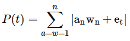</figure>

这个等式以一种新颖的方式陈述了投资组合的静态是组成市场微观结构及其权重的产物。

其中，

**a<sub>n</sub>T3’代表第 n <sub>个</sub>资产的微观结构；
‘w**<sub>n</sub>**’代表第**n**个资产的权重；
' **e <sub>t</sub>** '是一个误差项，代表随机性。**

绝对值符号被用作非线性的指示。下面的等式是投资组合动态的一种新的表现形式。

<figure class="kg-card kg-image-card">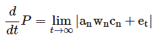</figure>

上面的等式表明，投资组合的动态状态不仅取决于各个组成部分的微观结构，还取决于它们的相对相关性。

此上下文中的相关性不是指价格，而是指实际微结构组件之间的关系。例如，当一种资产受到冲击，或者流动性发生变化时，另一种资产会如何反应。

微观结构成分相关性的概念可以写成条件概率。

<figure class="kg-card kg-image-card">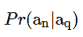</figure>

在哪里，

**a<sub>n</sub>T3】是第 **n <sub>个</sub>** 资产的微观结构，
q 代表第 q 个资产的微观结构。**

因此，相关项可以用矩阵形式表示:

<figure class="kg-card kg-image-card">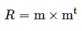</figure>

在哪里，

**R** 是相关矩阵，
T3】m 是我们微结构分量的一个 **n×1** 向量

因此，我们可以将我们的新等式更新为以下等式:

<figure class="kg-card kg-image-card">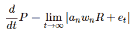</figure>

系综的使用与投资组合是 n 个市场微观结构的组合的想法是一致的。集成的优势在于它们允许聚合多个(有时是弱的)模型，以创建更健壮的模型。

*   集成的目标是最小化成本函数。
*   投资组合优化的目标是最小化风险。

因此，在这种情况下，风险是投资组合优化的成本函数，并创建一个与总体目标平行的目标。

本文将传统的均值-方差优化与高斯混合模型和随机森林相结合，建立了立体投资组合优化(SPO)框架。K-Means 聚类用于识别标准普尔 500 指数中的子群。

在我们开始将立体投资组合优化(SPO)框架应用于日内策略之前，让我们回顾一下所使用的一些组件。

* * *

## 什么是高斯混合模型，它们与 K-均值聚类有什么关系？

进行研究的一个重要部分是了解您的数据是如何分布的。数据的分布使您能够洞察看到某些观察结果的可能性。

在之前关于 K 均值聚类的**帖子中，我们学习了什么是 K 均值以及它如何应用于统计套利。简而言之，无监督学习方法允许我们探索我们的数据，并识别模式或关系。

K-Means 是一种机器学习技术，旨在识别我们数据中的子群。这意味着我们可以在我们的股票宇宙中找到关系，然后测试这些关系是否有一些统计意义。

要更全面地了解 K-Means，请访问题为“使用 K-Means 聚类进行配对选择**”的系列文章。

高斯混合模型与 K-Means 相似，都是一种聚类技术。GMM 和 K-Means 之间的一个关键区别是，K-Means 是一种硬聚类方法，而 GMM 被称为是一种软聚类技术。K 中的

表示一个观察值只有 0 或 1 的概率属于第 **k <sub>第</sub>类。**

高斯混合模型不分配属于特定类别的硬概率，而是分配一个介于 0 和 1 之间的概率，即观察值来自特定类别。

回想一下，在 K-Means 中，我们首先随机分配聚类中心，将每个观察值放入一个特定的聚类中。然后，我们计算聚类的质心或均值。然后，我们根据点与每个聚类平均值的距离，将点重新分配给每个聚类。

重复这个过程，直到不再有集群重新分配。我们在 K-Means 中的成本函数是最小化组内变化，或者用外行的术语来说，是确保每个组内的观察值高度相似。
下面的
是针对 K 均值的目标函数。

<figure class="kg-card kg-image-card">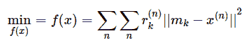</figure>

在哪里，

m **<sub>k</sub>** 是第 **k <sub>th</sub>** 簇的 Mu，
**x <sup>(n)</sup>** 是我们的观测值，
**r<sup>(n)</sup><sub>k</sub>**是第 **n <sub>th</sub>** 观测值属于第 k <sub>th</sub> 类的概率。

本质上，在我们的 K 均值目标函数中，我们将概率乘以每个观察值与第 **k <sub>第</sub>T3】类均值的平方距离。

与 K-Means 类似，高斯混合模型从为参数分配随机值开始。然后，它计算来自每个 **k <sub>th</sub>** 分布的观察值的概率。

与我们将概率设置为 1 或 0 的 K 均值不同，高斯混合模型将计算来自每个 **k** 分布的观察值的概率。**

**注意，这些概率之和必须等于 1。*T3】*

下面是高斯混合模型的一个等式:

<figure class="kg-card kg-image-card">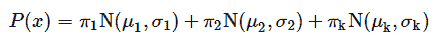</figure>

其中，
**π <sub>k</sub>** 是一个观测值属于 **k <sub>th</sub>** 分布的概率；
**N(μ <sub>k</sub> ，σ <sub>k</sub> )** 代表一个均值为 **μ <sub>k</sub>** 和 **σ <sub>k</sub>** 的**高斯**分布。

**这里注意，**σ<sub>k</sub>T5】是距离和与距离转置的乘积乘以 **k <sub>th</sub> 高斯**生成**n<sub>th</sub>T13】观测的概率组成的矩阵。*****T15】*

然后，这是分布数量的平均值。

下面是**<sub>k</sub>**项的等式:

<figure class="kg-card kg-image-card">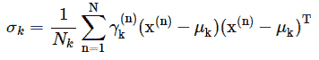</figure>

γ， **γ** ，此项由第 **k <sub>个</sub>T5】高斯负责生成第 **n <sub>个</sub>个**点。

责任，我们指的是第 **k <sub>第</sub>第**高斯促成第 **n <sub>第</sub>第**点的产生的程度。

我们可以通过下面的等式计算γ， **γ** ，项。**

<figure class="kg-card kg-image-card">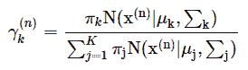</figure>

上面的等式是第 **k <sub>个</sub>个**高斯和所有高斯的商，或者换句话说是第 **k <sub>个</sub>个**高斯的比例。

* * *

## 让我们回顾一下随机森林

**Random Forests** 是一个机器学习集成，它结合了几个决策树来进行单个预测。回想一下，决策树以其简单性和易于解释而闻名。

**装袋和增压**是产生多棵树的随机森林的替代品。树既可以应用于[回归](https://quantra.quantinsti.com/course/trading-with-machine-learning-regression)也可以应用于分类问题。

决策树将特征空间划分为单独的区域，落入特定区域的每个观察值都被给予该区域均值的预测。

目标是最小化下面的成本函数:

<figure class="kg-card kg-image-card">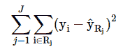</figure>

上面的成本函数是残差平方和，并且表示从第 **i <sub>个</sub>T3】观察的平均值到第 **j <sub>个</sub>T7】区域 **R** 的平均值的距离平方和。

**递归二进制分割**用于最小化 RSS。****

*   该过程考虑每个特征的每个可能的切割点或分割空间的点，目的是最小化成本函数。
*   这一过程将在两个新地区继续进行。
*   这些区域然后也经历相同的二进制分裂。
*   这种情况一直持续到满足特定标准。

决策树的一个主要考虑是，如果我们把一棵树长得非常大，它可能会超出我们的数据。更小的树可能导致更好的偏差-方差权衡。一个可行的方法是种植一棵大树，然后修剪它，只选择树的一个子集。这是通过一个叫做**的成本复杂性修剪**的过程实现的。

在代价复杂度剪枝中，我们使用一个调整参数来选择子树序列。

一旦我们有了树的子集，我们就可以使用 k-fold 交叉验证来选择调整参数的最佳值。

调优参数 ****一个**** 对应原树的一个特定分区。因此，当我们执行 k-fold 交叉验证以找到达到最佳 MSE 的**的值时，我们可以从我们的原始树中选择相应的子树。

决策树的另一个关键考虑因素是它们可以是非健壮的。这意味着数据中的小变化会导致树中的大变化。与其他机器学习方法相比，它们的性能也可能落后。

随机森林是改进[使用决策树](https://quantra.quantinsti.com/course/decision-trees-analysis-trading-ernest-chan)的一种方法。随机森林类似于 bagging 决策树，它们都对数据进行重采样，并将模型应用于重采样，然后对结果进行平均。

然而，在随机森林中，当执行分割时，选择特征的随机样本作为分割候选。这样做是为了限制任何一个特征的影响。所以在随机森林中分裂时，我们只考虑 **m ∈ p** 可能的特征。

随机森林在每次分裂时选择一小部分特征空间的原因是，如果空间中有非常强的特征，它很可能被选为每棵树的根节点。

这将意味着每棵树都可能密切相关，从而违背了减少方差的目的。**

### ******问题陈述******

**我们需要以最有效的方式构建一个统计套利策略的投资组合。

我们将在美国股票市场进行当日交易，即涵盖标准普尔 500 指数范围内的所有股票。

我们将设计多个投资组合，使用各种方法解决投资组合优化问题。为了评估我们的努力，我们将创建每个投资组合的夏普比率，并进行相对比较。

每个投资组合将由相同的关系组成，以确保苹果对苹果的比较。**

### ******数据******

**我们将在 2018 年期间使用 5 分钟数据，从 2018 年 1 月 4 日开始。虽然在这一点上，我们不确定我们将交易哪些股票，但我们知道我们将有以下四个投资组合:**

1.  **同等权重，**
2.  **有效前沿，**
3.  **自下而上的优化和**
4.  **立体投资组合优化(SPO)框架。**

****等权重投资组合**最容易构建，但因为剩余的投资组合需要一个培训期，我们的测试或评估期将是 2018 年下半年，这表明我们的等权重投资组合将在 2018 年下半年的数据中构建。

这段时间从 2018 年 5 月 1 日开始，到 6 月 12 日结束。我们投资组合的其余部分将利用 2018 年上半年作为培训期，下半年作为测试或评估期来构建。

正如我们将要看到的，这是比较同期各个投资组合的必要条件。简而言之，为了组成有效前沿、自下而上和 SPO 投资组合，我们首先必须有一段时间进行训练(即我们 2018 年上半年的数据)。

我们需要这个培训期，这样我们就可以对我们想要比较的所有投资组合进行预测(即 2018 年 5 月 1 日至 6 月 12 日)。

我们的**等权重投资组合**不需要创建培训期，因此我们将在剩余投资组合的测试期内创建它。**

### ******找交易** e **能人关系**T5】****

**正如我们在以前的文章中提到的，开发统计套利策略要解决的一个关键的初始问题是配对选择。我们将再次使用 K-Means 聚类来解决这个问题。我们将对标准普尔 500 指数应用 K 均值，创建子群，然后选择五种可交易的关系来构建我们的投资组合。

首先，让我们导入我们常用的库。**

```py
#data analysis and manipulation
import numpy as np
import pandas as pd
#data visualization
import matplotlib.pyplot as plt
import seaborn as sns
sns.set_style('whitegrid')
#statistics and machine learning
from statsmodels.tsa.api import adfuller
from sklearn.cluster import KMeans
from sklearn.mixture import GaussianMixture as GM
from sklearn.ensemble import RandomForestClassifier as RF
from sklearn.metrics import confusion_matrix, classification_report
```

```py
import warnings
warnings.simplefilter('ignore')
```

**我们将使用市盈率、每股收益和市值作为我们的特征来识别标准普尔 500 中的子群。

现在让我们导入我们的特征数据。**

```py
#importing the Excel file that contains our features data
fundamentals=pd.ExcelFile('SPO_Data.xlsx')
```

```py
#parsing the Fundamentals sheet from our Excel file of which holds our P/E, EPS, and MarketCap data
features=fundamentals.parse('Fundamentals')
```

**现在我们有了 K-Means 算法的特征，让我们检查一下特征空间的头部。**

```py
#checking the head of our features dataframe
features.head() 
```

 **| 号码 | 标志 | 名字 | 市盈率 | EPS | 市值 |
| --- | --- | --- | --- | --- | --- |
| Zero | 嗯 | 3M 公司 | Twenty-three point one seven | Eight point one six | One hundred and twelve point seven four |
| one | 阿布特 | 雅培实验室 | Forty-eight point zero three | Zero point nine four | Seventy-seven point seven six |
| Two | ABBV | 艾伯维 | Seventeen point five five | Three point six three | One hundred and one point five two |
| three | AutomaticCelestialNavigation 自动天体导航 | 埃森哲公司 | Eighteen point three seven | Six point seven six | Seventy-seven point two nine |
| four | ATVI | 动视暴雪 | Thirty-seven point five five | One point two eight | Thirty-six point one three |

我们现在准备创建 K-Means 方法，并在标准普尔 500 中查找子群。

在我们这样做之前，让我们从我们的特性数据中删除 Name 列。

```py
#dropping name column
features.drop('Name',axis=1,inplace=True)
```

```py
#rechecking our data
features.head()

```

| 号码 | 标志 | 市盈率 | EPS | 市值 |
| --- | --- | --- | --- | --- |
| Zero | 嗯 | Twenty-three point one seven | Eight point one six | One hundred and twelve point seven four |
| one | 阿布特 | Forty-eight point zero three | Zero point nine four | Seventy-seven point seven six |
| Two | ABBV | Seventeen point five five | Three point six three | One hundred and one point five two |
| three | AutomaticCelestialNavigation 自动天体导航 | Eighteen point three seven | Six point seven six | Seventy-seven point two nine |
| four | ATVI | Thirty-seven point five five | One point two eight | Thirty-six point one three |

回想一下，实现 K-Means 聚类的早期考虑是确定应该使用的 K 值。

我们将使用肘技术来决定我们应该使用什么样的 K 值。这项技术将把我们的 K 值与相应的误差进行比较。我们的目标是选择使误差或成本函数最小的 K 值。

```py
from scipy.spatial.distance import cdist
```

```py
#creating our elbow technique method
def find_k(features):
#intializing a list to hold costs or errors
costs=[]
#iterating over possible values for k
for k in range(1,51):
model=KMeans(n_clusters=k)
model.fit(features)
costs.append(sum(np.min(cdist(features,model.cluster_centers_,'euclidean'),axis=1)))
#plotting our elbow graph
with plt.style.context(['classic','ggplot']):
plt.figure(figsize=(10,6))
plt.plot(costs)
plt.xlabel('Clusters')
plt.ylabel('Errors')
plt.title('Finding K')
plt.show()
```

现在我们有了方法，让我们用它来寻找 k 的最佳值。首先，让我们通过使用符号作为索引来更新我们的数据帧。我们将首先制作原始数据帧的副本。

```py
#making a copy of our original features dataframe
features_copy=features.copy()
```

现在，我们可以通过符号列重新索引我们的特征数据框。

```py
#reindexing our features dataframe
features_copy=features_copy.reindex(index=features_copy['Symbol'],columns=features_copy.columns)
```

```py
features_copy.head()

```

| 标志 | 标志 | 市盈率 | EPS | 市值 |
| --- | --- | --- | --- | --- |
| 嗯 | 圆盘烤饼 | 圆盘烤饼 | 圆盘烤饼 | 圆盘烤饼 |
| 阿布特 | 圆盘烤饼 | 圆盘烤饼 | 圆盘烤饼 | 圆盘烤饼 |
| ABBV | 圆盘烤饼 | 圆盘烤饼 | 圆盘烤饼 | 圆盘烤饼 |
| AutomaticCelestialNavigation 自动天体导航 | 圆盘烤饼 | 圆盘烤饼 | 圆盘烤饼 | 圆盘烤饼 |
| ATVI | 圆盘烤饼 | 圆盘烤饼 | 圆盘烤饼 | 圆盘烤饼 |

现在我们已经重新索引了 features_copy dataframe，让我们将值添加回我们的列，并删除 Symbol 列。

```py
#adding our data back to their respective columns
features_copy['P/E']=features['P/E'].values
features_copy['EPS']=features['EPS'].values
features_copy['MarketCap']=features['MarketCap'].values
```

好吧。让我们重新检查我们的数据框架。

```py
features_copy.head()

```

| 标志 | 标志 | 市盈率 | EPS | 市值 |
| --- | --- | --- | --- | --- |
| 嗯 | 圆盘烤饼 | Twenty-three point one seven | Eight point one six | One hundred and twelve point seven four |
| 阿布特 | 圆盘烤饼 | Forty-eight point zero three | Zero point nine four | Seventy-seven point seven six |
| ABBV | 圆盘烤饼 | Seventeen point five five | Three point six three | One hundred and one point five two |
| AutomaticCelestialNavigation 自动天体导航 | 圆盘烤饼 | Eighteen point three seven | Six point seven six | Seventy-seven point two nine |
| ATVI | 圆盘烤饼 | Thirty-seven point five five | One point two eight | Thirty-six point one three |

现在我们准备从数据框架中删除符号列。

```py
#dropping symbol column
features_copy.drop('Symbol',axis=1,inplace=True)
```

让我们通过调用 head 方法来重新检查我们的数据帧。

```py
features_copy.head()

```

| 标志 | 市盈率 | EPS | 市值 |
| --- | --- | --- | --- |
| 嗯 | Twenty-three point one seven | Eight point one six | One hundred and twelve point seven four |
| 阿布特 | Forty-eight point zero three | Zero point nine four | Seventy-seven point seven six |
| ABBV | Seventeen point five five | Three point six three | One hundred and one point five two |
| AutomaticCelestialNavigation 自动天体导航 | Eighteen point three seven | Six point seven six | Seventy-seven point two nine |
| ATVI | Thirty-seven point five five | One point two eight | Thirty-six point one three |

现在让我们使用 find_k 方法来寻找 k 的最佳值。

```py
#finding K
find_k(features_copy.fillna(0))
```

<figure class="kg-card kg-image-card kg-width-wide">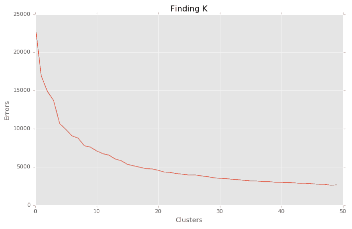</figure>

好，我们将使用 15 作为 K 的值。现在我们准备实施 K 均值聚类算法，K 等于 15，并寻找可交易的关系。让我们从初始化我们的模型开始。

```py
#initialzing K-Means algorithm
kmeans=KMeans(n_clusters=15,random_state=101)
```

注意，我使用了 random_state=101。这是为了让你可以重新创建相同的结果张贴在这里。我们现在将使我们的 K-Means 算法适合我们的特征数据。

```py
#fitting kmeans to our features data
kmeans.fit(features_copy.fillna(0))
```

```py
KMeans(algorithm='auto', copy_x=True, init='k-means++', max_iter=300,
    n_clusters=15, n_init=10, n_jobs=1, precompute_distances='auto',
    random_state=101, tol=0.0001, verbose=0)
```

请注意，我们在 features_copy 数据帧上调用了 fillna 方法，并用 0 替换了 NaNs 值。我们现在可以查看我们的集群。让我们从检查我们的标签开始。

```py
#getting cluster labels
kmeans.labels_
```

```py
array([ 6,  6,  6,  6, 12,  3,  0,  3, 13,  0,  3,  3, 12, 12, 12,  3,  3,
        7,  3,  6, 12,  3,  3,  1,  1,  5, 14,  3,  3, 12,  6,  0, 12,  3,
        3,  3,  3,  6,  3, 13,  3,  0,  3, 13,  3,  8,  0,  3, 13,  3,  3,
        2, 13,  0, 13,  3,  3,  3, 13, 12,  2, 12, 13,  0,  0, 13, 13,  3,
        0,  0,  3,  6,  7, 12,  7,  6,  6, 13,  3,  3, 13, 12,  0,  3,  3,
        0,  0, 12,  3,  3,  6,  3,  3,  3,  3, 13,  0,  6, 13,  5, 10,  0,
        3,  0, 13,  3,  3,  5,  5,  3,  3,  0,  3,  3,  5,  0,  0,  5,  3,
        3, 13,  0,  3,  3,  3,  6, 13,  7,  3,  0,  3,  6,  3,  0,  3,  3,
        0,  3,  0, 12, 13, 12,  3,  3,  3,  3,  3,  0,  3,  6,  3,  3,  0,
        0, 12,  3,  3,  0,  0,  0,  3, 12,  3,  0, 13, 13,  0, 13, 12, 11,
       13, 12,  3,  3,  0,  7,  3,  0,  3,  9,  3,  9,  3, 12,  0, 12,  3,
       13, 13,  3,  3, 12,  3, 12,  3,  3,  0,  3,  3,  3, 13, 13,  3,  3,
        0,  2,  3,  0,  0,  3,  6, 12,  6, 13,  3,  0,  3,  3,  3,  3,  3,
        3,  0,  3, 13,  3, 13,  0, 12,  5,  6,  3,  3,  3, 12,  3, 12,  0,
       12, 11,  3,  5,  3,  5,  3,  3,  3, 12, 12,  3,  7,  3,  3,  3,  9,
        0,  9,  3,  3, 12,  3,  0,  3,  7,  3,  3,  6,  3,  3,  3,  3,  3,
        3,  3,  7,  3,  6,  3, 12,  3,  6,  3,  6,  0,  3,  3,  3,  3, 13,
        3, 12,  0, 12,  3,  6,  3,  3,  6,  0,  3,  6,  5,  7, 12, 13, 11,
       13,  1, 12,  3,  3,  0,  0, 12,  7,  6,  3, 13, 12,  7, 13, 13, 12,
        4, 12, 13, 13, 13, 13,  0, 12,  6,  3, 13,  3,  0,  3,  0, 13,  3,
        0,  3,  0,  3, 12,  5, 12,  3,  3,  3,  0,  3,  3,  5,  3, 13,  5,
        0,  5,  0,  3, 13,  0, 12, 12,  3,  0,  6,  3,  2,  3,  3,  0,  3,
        0,  3,  3, 13,  6,  3,  3, 13,  0, 12, 12, 12, 12,  3, 12,  6,  3,
        3,  3, 12,  3,  3,  3,  0,  4,  3,  6,  3,  3,  3,  3,  3, 13,  0,
        3, 12,  3,  0,  0, 13,  3, 13,  6,  3, 12,  0,  3, 13,  3,  3,  3,
        3,  3,  3, 12,  3,  6,  3,  0,  3, 12, 12, 12,  0,  5,  0,  3,  6,
        0,  3, 12,  3,  3, 13, 12,  0,  0,  3,  6, 12, 12, 12, 12,  6,  3,
        5,  6,  3,  6,  3,  3,  3,  3,  3,  3, 12,  3,  3,  5, 13,  3,  5,
        3, 12,  5,  6,  0,  3,  3,  2,  3, 13, 12,  7,  3,  3,  3, 13, 12,
        3, 12,  3, 13,  3,  3, 12,  0,  3,  7,  3, 12])
```

我们现在将把我们的集群分配添加回我们的数据框架。

```py
#adding cluster labels to dataframe
features_copy['Cluster']=kmeans.labels_
```

现在让我们回顾一下我们的特性数据框架

```py
#reviewing features dataframe
features_copy.head()

```

| 标志 | 市盈率 | EPS | 市值 | 串 |
| --- | --- | --- | --- | --- |
| 嗯 | Twenty-three point one seven | Eight point one six | One hundred and twelve point seven four | six |
| 阿布特 | Forty-eight point zero three | Zero point nine four | Seventy-seven point seven six | six |
| ABBV | Seventeen point five five | Three point six three | One hundred and one point five two | six |
| AutomaticCelestialNavigation 自动天体导航 | Eighteen point three seven | Six point seven six | Seventy-seven point two nine | six |
| ATVI | Thirty-seven point five five | One point two eight | Thirty-six point one three | Twelve |

```py
#calling tail method our dataframe
features_copy.tail()

```

| 标志 | 市盈率 | EPS | 市值 | 串 |
| --- | --- | --- | --- | --- |
| YHOO | 圆盘烤饼 | -0.23 | Forty-three point seven four | Zero |
| 妙的 | Fifteen point eight three | Four point zero four | Twenty-two point six five | three |
| ZBH | Seventy-seven point five three | One point five one | Twenty-three point five four | seven |
| 天国 | Twenty-two point seven five | One point nine nine | Nine point one seven | three |
| ZTS | Thirty-two point one six | One point six five | Twenty-six point one one | Twelve |

既然我们已经有了集群分配，让我们按照集群分配对数据进行分组。

```py
#creating dataframe to hold data
clusters_df=pd.DataFrame()
#grouping our data by cluster for clusters with atleast 2 stocks in it.
clusters_df=pd.concat(i for clusters_df, i in features_copy.groupby(features_copy['Cluster']) if len(i) >1)
```

现在让我们检查我们的新数据帧。

```py
#checking the head of clusters df
clusters_df.head()

```

| 标志 | 市盈率 | EPS | 市值 | 串 |
| --- | --- | --- | --- | --- |
| ADBE | Fifty-one point seven two | Two point three two | Fifty-nine point two eight | Zero |
| 氨乙异硫脲(Aminoethylisothiourea) | Twenty point three seven | Six point four one | Forty-five point nine three | Zero |
| 全惯性制导 | 圆盘烤饼 | -0.78 | Sixty-two point one five | Zero |
| ANTM | Eighteen point zero two | Nine point two one | Forty-three point eight nine | Zero |
| 非晶体物质 | Nineteen point zero two | One point nine four | Thirty-nine point nine two | Zero |

```py
#checking the tail of our cluster df
clusters_df.tail()

```

| 标志 | 市盈率 | EPS | 市值 | 串 |
| --- | --- | --- | --- | --- |
| 装备 | Six point zero nine | Two point one | Four point six seven | Thirteen |
| VRTX(消歧义) | 圆盘烤饼 | -0.46 | Twenty-two point six nine | Thirteen |
| 世界舞蹈总会(World Dance Council) | 圆盘烤饼 | -1.59 | Twenty-two point one two | Thirteen |
| WMB | 圆盘烤饼 | -0.57 | Twenty-four point three | Thirteen |
| XRX | 圆盘烤饼 | -0.49 | Seven point four eight | Thirteen |

现在我们已经有了按集群分配组织的数据，我们准备检查可交易的关系。

为此，我们将在各自的集群内创建每个可能的配对组合。然后，我们可以在集群中的特定对上运行 CADF 测试。

让我们创建一个方法，该方法将把来自特定集群的符号作为输入，计算相应集群的可能配对组合，并将我们的配对存储到一个单独的列表中。

```py
#creating method to identify each possible pair
 def create_pairs(symbolList):
 #creating a list to hold each possible pair
 pairs=[]
 #initializing placeholders for the symbols in each pair
 x=0
 y=0
 for count,symbol in enumerate(symbolList):
 for nextCount,nextSymbol in enumerate(symbolList):
 x=symbol
 y=nextSymbol
 if x !=y:
 pairs.append([x,y])

return pairs
```

我们现在将创建一个符号列表。让我们使用聚类 0 中的股票符号。

```py
#creating list of symbols from cluster 0
symbol_list_0=['ADBE','AET','AIG','ANTM','AMAT']
```

我们现在将使用上面的 create pairs 方法来创建可能的配对组合列表。

```py
#list of lists of pairs
all_pairs=create_pairs(symbol_list_0)
```

让我们检查我们的配对组合。

```py
#printing list of all_pairs from cluster 0
all_pairs
```

```py
[['ADBE', 'AET'],
['ADBE', 'AIG'],
['ADBE', 'ANTM'],
['ADBE', 'AMAT'],
['AET', 'ADBE'],
['AET', 'AIG'],
['AET', 'ANTM'],
['AET', 'AMAT'],
['AIG', 'ADBE'],
['AIG', 'AET'],
['AIG', 'ANTM'],
['AIG', 'AMAT'],
['ANTM', 'ADBE'],
['ANTM', 'AET'],
['ANTM', 'AIG'],
['ANTM', 'AMAT'],
['AMAT', 'ADBE'],
['AMAT', 'AET'],
['AMAT', 'AIG'],
['AMAT', 'ANTM']]
```

好吧。现在我们有了来自聚类 0 的可能的货币对组合，让我们导入这些股票的日内数据。

```py
#initializing our stock variables
adbe=pd.read_csv('ADBE_5min.csv')
aet=pd.read_csv('AET_5min.csv')
aig=pd.read_csv('AIG_5min.csv')
antm=pd.read_csv('ANTM_5min.csv')
amat=pd.read_csv('AMAT_5min.csv')
```

让我们检查我们的数据。

```py
#checking head of ADBE
adbe.head()

```

| 
 | 日期 | 时间 | 打开 | 高的 | 低的 | 关闭 | 卷 | 交易次数 | 投标量 | ask 卷 |
| --- | --- | --- | --- | --- | --- | --- | --- | --- | --- | --- |
| Zero | 2018/01/04 | 08:30:00 | One hundred and eighty-one point nine three | One hundred and eighty-three point seven four | One hundred and eighty-one point eight four | One hundred and eighty-three point one three | Eighty-three thousand eight hundred and sixty-two | Three hundred and ninety-six | Twenty-two thousand nine hundred and forty-one | Sixty thousand nine hundred and twenty-one |
| one | 2018/01/04 | 08:35:00 | One hundred and eighty-three point zero five | One hundred and eighty-three point four eight | One hundred and eighty-two point six six | One hundred and eighty-two point eight nine | Thirty-one thousand five hundred and ninety-three | Two hundred and thirty-eight | Seventeen thousand eight hundred and forty | Thirteen thousand seven hundred and fifty-three |
| Two | 2018/01/04 | 08:40:00 | One hundred and eighty-two point eight four | One hundred and eighty-three point three five | One hundred and eighty-two point seven | One hundred and eighty-three point two two | Forty-nine thousand six hundred and fifty-four | Three hundred and forty-five | Twenty-six thousand nine hundred and sixty-two | Twenty-two thousand six hundred and ninety-two |
| three | 2018/01/04 | 08:45:00 | One hundred and eighty-three point two five | One hundred and eighty-three point seven three | One hundred and eighty-three point zero six | One hundred and eighty-three point seven three | Fifty-one thousand one hundred and eight | Three hundred and fourteen | Twenty-one thousand five hundred and sixty-six | Twenty-nine thousand five hundred and forty-two |
| four | 2018/01/04 | 08:50:00 | One hundred and eighty-three point six six | One hundred and eighty-four | One hundred and eighty-three point five six | One hundred and eighty-three point nine | Twenty-seven thousand four hundred and seventy-six | One hundred and ninety-six | Fifteen thousand two hundred and eighty-seven | Twelve thousand one hundred and eighty-nine |

```py
#checking tail of AIG
aig.tail()

```

| 
 | 日期 | 时间 | 打开 | 高的 | 低的 | 关闭 | 卷 | 交易次数 | 生物体积 | ask 卷 |
| --- | --- | --- | --- | --- | --- | --- | --- | --- | --- | --- |
| Eight thousand five hundred and seventy-four | 2018/06/12 | 14:30:00 | Fifty-four point five four | Fifty-four point five six | Fifty-four point five one | Fifty-four point five five | Sixty thousand nine hundred and two | Three hundred and fifty-seven | Twenty thousand one hundred and six | Forty thousand seven hundred and ninety-six |
| Eight thousand five hundred and seventy-five | 2018/06/12 | 14:35:00 | Fifty-four point five five | Fifty-four point six one | Fifty-four point five three | Fifty-four point six | Seventy-four thousand four hundred and eighty-three | Four hundred and twenty-five | Twenty-nine thousand three hundred and fifty-four | Forty-five thousand one hundred and twenty-nine |
| Eight thousand five hundred and seventy-six | 2018/06/12 | 14:40:00 | Fifty-four point six | Fifty-four point six | Fifty-four point five five | Fifty-four point five eight | Sixty-seven thousand five hundred and thirty-nine | Four hundred and fourteen | Twenty thousand six hundred and eighty-seven | Forty-six thousand eight hundred and fifty-two |
| Eight thousand five hundred and seventy-seven | 2018/06/12 | 14:45:00 | Fifty-four point five seven | Fifty-four point five eight | Fifty-four point five four | Fifty-four point five six | Eighty-two thousand one hundred and twenty-two | Four hundred and thirty-nine | Twenty-four thousand nine hundred and twenty-five | Fifty-seven thousand one hundred and ninety-seven |
| Eight thousand five hundred and seventy-eight | 2018/06/12 | 14:50:00 | Fifty-four point five six | Fifty-four point six two | Fifty-four point five six | Fifty-four point six | One hundred and twenty thousand three hundred and twenty-eight | Seven hundred and seventy-nine | Forty-six thousand three hundred and forty | Seventy-three thousand nine hundred and eighty-eight |

我们可以看到，从 2018 年 1 月 3 日到 2018 年 6 月 11 日的前半个交易日，我们的股票有 5 分钟棒线数据。我们现在可以测试我们的配对的协整性。回想一下，我们将使用我们的部分数据作为我们的评估期，所以我们不想将它包括在我们的测试中。

我们将利用 1 月至 5 月作为我们的训练期，并通过我们剩余的数据评估我们的投资组合。让我们创建变量来保存我们的培训期数据。

我们将存储使用我们的关闭列。为了能够按照训练周期解析数据，我们将把日期列作为数据的索引。我们从复制我们的数据开始。让我们创建一个方法来跨符号数据执行此操作。

我们将原始符号数据存储在字典中，并将其传递给我们的函数。

```py
#creating list to hold original data
original_data={'ADBE':adbe,'AET':aet,'AIG':aig,'ANTM':antm,'AMAT':amat}
```

我们现在可以创建我们的函数来复制我们的原始数据，并为我们的训练期数据创建一个数据帧。

```py
#function to parse out training period data
def get_training_data(original_data,symbol_list,start,end):
'''
PARAMETERS:

original_data - the dictionary we created that holds our dataframes
symbol_list - the list of symbols; data type are strings
start - the beginning date of our training period as a string
end - the ending date of our training period as a string
'''
#creating a dataframe to hold our parsed series
training_df=pd.DataFrame()
#iterating over our symbol list
for count, symbol in enumerate(symbol_list):

try:
#making a copy of our original data for each symbol
copy=original_data[symbol].copy()
#reindexing our copied data by Date column
copy=copy.reindex(index=copy['Date'],columns=copy.columns)
#restoring values of close column from our original data
copy[' Close']=original_data[symbol][' Close'].values
#parsing out our training period
copy=copy.loc[start:end][' Close']
#adding training data to dataframe
training_df[str(symbol)]=copy.values

except:
print(str(symbol),'Threw an Exception')
print('Current Symbol Length:')
print(len(copy.loc[start:end]))
print("")
print('training_df Length:')
print(len(training_df))
continue

return training_df

```

我们现在准备创建我们的训练数据。

我们将使用 get_training_data 函数解析出我们的训练数据，然后使用该数据帧解析出我们的配对组合的相应系列，以执行我们的 CADF 测试。

```py
#creating our training data dataframe using our training period start and end dates
training_df=get_training_data(original_data,symbol_list_0,'2018/01/04','2018/04/30')
```

来检查一下我们的 training_df。

```py
training_df.head()

```

| 
 | ADBE | 氨乙异硫脲(Aminoethylisothiourea) | 全惯性制导 | ANTM | 非晶体物质 |
| --- | --- | --- | --- | --- | --- |
| Zero | One hundred and eighty-three point one three | One hundred and eighty-three point four five | Sixty point three six | Two hundred and twenty-nine point six two | Fifty-four point six seven |
| one | One hundred and eighty-two point eight nine | One hundred and eighty-three point six eight | Sixty point six one | Two hundred and twenty-nine point six three | Fifty-four point five one |
| Two | One hundred and eighty-three point two two | One hundred and eighty-three point eight | Sixty point seven seven | Two hundred and twenty-nine point seven | Fifty-four point two five |
| three | One hundred and eighty-three point seven three | One hundred and eighty-three point eight two | Sixty point eight one | Two hundred and twenty-nine point six five | Fifty-four point zero eight |
| four | One hundred and eighty-three point nine | One hundred and eighty-three point nine three | Sixty point eight | Two hundred and twenty-nine point seven | Fifty-four point two seven |

检查我们的数据框架后，我们发现我们有所有股票的训练期数据。这意味着我们应该有 20 个可能的配对。

我们可以写一个方法来检查我们的数学。

```py
#creating method to check possible pair combinations
def possitrainingnations(n):
#Parameters#
############
#n- represents the number of items or in our case stocks

possible_pairs=(n*(n-1))

return possible_pairs
```

现在让我们检查我们可能的配对组合。

```py
#checking possible pair combinations
possible_combinations(5) # we pass in 5 for our 5 stocks
```

```py
20
```

我们现在准备好检查我们的配对的协整性。我们将创建一个方法，允许我们迭代我们的配对，计算斜率，然后执行 CADF 测试。被共同整合的对将被存储在一个列表中。

让我们导入我们的 OLS 方法。

```py
from scipy.stats import linregress
```

现在我们将编写我们的方法来创建我们的共集成对。

```py
def get_cointegrated(all_pairs,training_df):
'''
PARAMETERS
#########

all_pairs - the list of all possible pair combinations from Cluster 0
training_df - our dataframe holding our stock data for stocks in Cluster 0 over the training period

'''
#creating a list to hold cointegrated pairs
cointegrated=[]
#iterate over each pair in possible pairs list; pair is a list of our 2 stock symbols
for count, pair in enumerate(all_pairs):
try:
#getting data for each stock in pair from training_df
ols=linregress(training_df[str(pair[1])],training_df[str(pair[0])]) #note scipy's linregress takes in Y then X
#storing slope or hedge ratio in variable
slope=ols[0]
#creating spread
spread=training_df[str(pair[1])]-(slope*training_df[str(pair[0])])
#testing spread for cointegration
cadf=adfuller(spread,1)
#checking to see if spread is cointegrated, if so then store pair in cointegrated list
if cadf[0] < cadf[4]['1%']:
print('Pair Cointegrated at 99% Confidence Interval')
#appending the X and Y of pair
cointegrated.append([pair[0],pair[1]])
elif cadf[0] < cadf[4]['5%']:
print('Pair Cointegrated at 95% Confidence Interval')
#appending the X and Y of pair
cointegrated.append([pair[0],pair[1]])
elif cadf[0] < cadf[4]['10%']:
print('Pair Cointegrated at 90% Confidence Interval')
cointegrated.append(pair[0],pair[1])
else:
print('Pair Not Cointegrated ')
continue
except:
print('Exception: Symbol not in Dataframe')
continue

return cointegrated

```

让我们初始化 get_cointegrated 函数并找到我们的 cointegrated 对。

```py
#getting our cointegrated pairs
cointegrated_from_cluster_0=get_cointegrated(all_pairs,training_df)
```

```py
Pair Not Cointegrated
Pair Not Cointegrated
Pair Cointegrated at 95% Confidence Interval
Pair Not Cointegrated
Pair Not Cointegrated
Pair Not Cointegrated
Pair Cointegrated at 95% Confidence Interval
Pair Not Cointegrated
Pair Not Cointegrated
Pair Not Cointegrated
Pair Not Cointegrated
Pair Not Cointegrated
Pair Not Cointegrated
Pair Cointegrated at 95% Confidence Interval
Pair Not Cointegrated
Pair Not Cointegrated
Pair Not Cointegrated
Pair Not Cointegrated
Pair Not Cointegrated
Pair Not Cointegrated
```

让我们检查一下我们的综合列表。

```py
cointegrated_from_cluster_0
```

```py
[['ADBE', 'ANTM'], ['AET', 'ANTM'], ['ANTM', 'AET']]
```

好吧。我们已经发现，在 90%的置信区间内，我们可能的 20 对中有 3 对是协整的。

回想一下，我们在我们的 **clusters_df 数据帧**上调用了 head 方法，它只返回前五行。

让我们使用**计数器方法**来了解我们的符号是如何分布在我们所有的集群中的。

```py
#importing the Counter method
from collections import Counter
```

```py
#calling Counter method on our clusters
Counter(clusters_df['Cluster'])
```

```py
Counter({0: 76,
1: 3,
2: 5,
3: 215,
4: 2,
5: 19,
6: 39,
7: 13,
9: 4,
11: 3,
12: 69,
13: 54})
```

我们可以看到簇 0 实际上包含总共 76 个符号。鉴于我们发现了 3 个可交易的关系，我们将使用它们。然而，我将说明在我们的第一组中没有符号被协整的情况下，我们将如何着手检查特定组中的符号。

我们需要创建一个方法，允许我们遍历 clusters 列并返回特定簇中的符号。

首先，我们将把我们的符号作为一列添加回我们的数据帧，这样如果满足我们的聚类条件，我们就可以检索它们。

```py
#adding Symbol Column back to cluster_df
clusters_df['Symbol']=clusters_df.index
```

让我们重新检查我们的数据框架。

```py
#checking update to cluster_df
clusters_df.head()

```

| 标志 | 市盈率 | EPS | 市值 | 串 | 标志 |
| --- | --- | --- | --- | --- | --- |
| ADBE | Fifty-one point seven two | Two point three two | Fifty-nine point two eight | Zero | ADBE |
| 氨乙异硫脲(Aminoethylisothiourea) | Twenty point three seven | Six point four one | Forty-five point nine three | Zero | 氨乙异硫脲(Aminoethylisothiourea) |
| 全惯性制导 | 圆盘烤饼 | -0.78 | Sixty-two point one five | Zero | 全惯性制导 |
| ANTM | Eighteen point zero two | Nine point two one | Forty-three point eight nine | Zero | ANTM |
| 非晶体物质 | Nineteen point zero two | One point nine four | Thirty-nine point nine two | Zero | 非晶体物质 |

现在我们已经准备好创建我们的方法，在一个基于集群的列表中检索和存储我们的符号。

对于这个任务，我们将使用列表理解。我们将把我们的方法应用到集群 9。

```py
symbols_cluster_9=[ clusters_df['Symbol'][count] for count,value in enumerate(clusters_df['Cluster'].values) if value == 9]
```

让我们检查一下我们的 **symbols_cluster_9** 列表的长度，以确保我们的方法正确工作。

回想一下，我们的 Counter 方法为这个集群中的符号数返回值 4。

```py
#getting the length of our cluster 9 list
len(symbols_cluster_9)
```

```py
4
```

太好了！我们看到我们的列表理解正常工作。现在，我们可以使用这个符号列表为聚类 9 创建每个可能的配对组合。

我们来看看第 9 簇有哪些符号。

```py
#checking the symbols in cluster 9
symbols_cluster_9
```

```py
['XOM', 'FB', 'JNJ', 'JPM']
```

我们现在将使用这个列表，使用前面的 **create_pairs 方法**为集群 9 创建配对组合。

```py
#getting pair combinations for cluster 9
cluster_9_pairs=create_pairs(symbols_cluster_9)
```

让我们检查一下第 9 组的配对组合。

```py
#checking cluster 9 pair combinations.
cluster_9_pairs
```

```py
[['XOM', 'FB'],
['XOM', 'JNJ'],
['XOM', 'JPM'],
['FB', 'XOM'],
['FB', 'JNJ'],
['FB', 'JPM'],
['JNJ', 'XOM'],
['JNJ', 'FB'],
['JNJ', 'JPM'],
['JPM', 'XOM'],
['JPM', 'FB'],
['JPM', 'JNJ']]
```

好吧。从我们测试的前五个符号中，我们了解到我们有三个来自集群 0 的可交易关系。我们还演示了如果没有找到这三对，我们将如何在其他集群中找到其他对。在找到上面的配对之后，我们将应用与识别我们的三个配对相同的方法来检查协整。

从这里，我们准备开始构建我们的投资组合。

* * *

### ****简要重述****

让我们后退一步，回顾一下迄今为止我们所取得的成就。

*   我们从了解立体投资组合优化(SPO)框架开始。
*   然后，我们在标准普尔 500 上执行 K-Means 聚类。
*   通过使用我们的基本数据特征创建肘图，我们找到了 K 的最佳值。
*   在找到 K 之后，我们创建了我们的 K-Means 算法，并从第 0 类中选择股票来测试我们是否能识别可交易的关系。

在聚类 0 的前五个符号中，我们发现 20 个可能的组合中有 3 个是协整合的。

为了说明如果我们没有发现任何可交易的关系，我们将如何继续，我们创建了一个方法，允许我们从特定的聚类中选择所有的股票，并使用这些来创建所有可能的配对组合。有了这些配对，我们就可以测试这些配对，看看我们是否能找到可交易的关系。

* * *

## 投资组合构建:等权重

现在，我们已经找到了一些可能的可交易关系，我们准备构建我们的投资组合。在这一部分，我们将创建一个投资组合，同样衡量我们的战略。

我们假设我们的投资组合价值为 10 万美元，其中 10%为现金。我们将为每对选手分配 3 万美元。首先，我们将创建一个允许我们创建 StatArb 策略的类。

回想一下，我们将使用机器学习的投资组合的培训期为 2018 年 1 月 4 日至 2018 年 4 月 30 日，因此，由于该投资组合将不会使用优化方法，我们将在 2018 年 5 月 1 日开始的期间构建它，以便与我们剩余投资组合的测试期保持一致。

现在让我们创建每个符号的变量，这些变量将保存 2018 年 5 月 1 日开始的数据。我们将复制我们的数据，并将我们的日期设置为索引，这样我们就可以解析出我们的测试周期。

```py
#creating copies of our data
adbe_copy=adbe.copy()
aet_copy=aet.copy()
antm_copy=antm.copy()
```

```py
#reindexing our data
adbe_copy=adbe_copy.reindex(index=adbe_copy['Date'],columns=adbe_copy.columns)
aet_copy=aet_copy.reindex(index=aet_copy['Date'],columns=aet_copy.columns)
antm_copy=antm_copy.reindex(index=antm_copy['Date'],columns=antm_copy.columns)
```

好吧。让我们检查一下数据框。

```py
#checking dataframe after reindexing
adbe_copy.head()

```

| 日期 | 日期 | 时间 | 打开 | 高的 | 低的 | 关闭 | 卷 | 交易次数 | 生物体积 | ask 卷 |
| --- | --- | --- | --- | --- | --- | --- | --- | --- | --- | --- |
| 2018/01/04 | 圆盘烤饼 | 圆盘烤饼 | 圆盘烤饼 | 圆盘烤饼 | 圆盘烤饼 | 圆盘烤饼 | 圆盘烤饼 | 圆盘烤饼 | 圆盘烤饼 | 圆盘烤饼 |
| 2018/01/04 | 圆盘烤饼 | 圆盘烤饼 | 圆盘烤饼 | 圆盘烤饼 | 圆盘烤饼 | 圆盘烤饼 | 圆盘烤饼 | 圆盘烤饼 | 圆盘烤饼 | 圆盘烤饼 |
| 2018/01/04 | 圆盘烤饼 | 圆盘烤饼 | 圆盘烤饼 | 圆盘烤饼 | 圆盘烤饼 | 圆盘烤饼 | 圆盘烤饼 | 圆盘烤饼 | 圆盘烤饼 | 圆盘烤饼 |
| 2018/01/04 | 圆盘烤饼 | 圆盘烤饼 | 圆盘烤饼 | 圆盘烤饼 | 圆盘烤饼 | 圆盘烤饼 | 圆盘烤饼 | 圆盘烤饼 | 圆盘烤饼 | 圆盘烤饼 |
| 2018/01/04 | 圆盘烤饼 | 圆盘烤饼 | 圆盘烤饼 | 圆盘烤饼 | 圆盘烤饼 | 圆盘烤饼 | 圆盘烤饼 | 圆盘烤饼 | 圆盘烤饼 | 圆盘烤饼 |

现在让我们将这些值恢复到我们的列中。我们还将删除日期列。

```py
#dropping date columns
adbe_copy.drop('Date',axis=1,inplace=True)
aet_copy.drop('Date',axis=1,inplace=True)
antm_copy.drop('Date',axis=1,inplace=True)
```

```py
#restoring our column values back to our data
adbe_copy[[' Time',' Open',' High',' Low',' Close',' Volume',' NumberOfTrades',' BidVolume',' AskVolume']]=adbe[[' Time',' Open',' High',' Low',' Close',' Volume',' NumberOfTrades',' BidVolume',' AskVolume']].values
aet_copy[[' Time',' Open',' High',' Low',' Close',' Volume',' NumberOfTrades',' BidVolume',' AskVolume']]=aet[[' Time',' Open',' High',' Low',' Close',' Volume',' NumberOfTrades',' BidVolume',' AskVolume']].values
antm_copy[[' Time',' Open',' High',' Low',' Close',' Volume',' NumberOfTrades',' BidVolume',' AskVolume']]=antm[[' Time',' Open',' High',' Low',' Close',' Volume',' NumberOfTrades',' BidVolume',' AskVolume']].values
```

让我们重新检查我们的数据框架。

```py
#rechecking our dataframe
adbe_copy.head()

```

| 日期 | 时间 | 打开 | 高的 | 低的 | 关闭 | 卷 | 交易次数 | 生物体积 | ask 卷 |
| --- | --- | --- | --- | --- | --- | --- | --- | --- | --- |
| 2018/01/04 | 08:30:00 | One hundred and eighty-one point nine three | One hundred and eighty-three point seven four | One hundred and eighty-one point eight four | One hundred and eighty-three point one three | Eighty-three thousand eight hundred and sixty-two | Three hundred and ninety-six | Twenty-two thousand nine hundred and forty-one | Sixty thousand nine hundred and twenty-one |
| 2018/01/04 | 08:35:00 | One hundred and eighty-three point zero five | One hundred and eighty-three point four eight | One hundred and eighty-two point six six | One hundred and eighty-two point eight nine | Thirty-one thousand five hundred and ninety-three | Two hundred and thirty-eight | Seventeen thousand eight hundred and forty | Thirteen thousand seven hundred and fifty-three |
| 2018/01/04 | 08:40:00 | One hundred and eighty-two point eight four | One hundred and eighty-three point three five | One hundred and eighty-two point seven | One hundred and eighty-three point two two | Forty-nine thousand six hundred and fifty-four | Three hundred and forty-five | Twenty-six thousand nine hundred and sixty-two | Twenty-two thousand six hundred and ninety-two |
| 2018/01/04 | 08:45:00 | One hundred and eighty-three point two five | One hundred and eighty-three point seven three | One hundred and eighty-three point zero six | One hundred and eighty-three point seven three | Fifty-one thousand one hundred and eight | Three hundred and fourteen | Twenty-one thousand five hundred and sixty-six | Twenty-nine thousand five hundred and forty-two |
| 2018/01/04 | 08:50:00 | One hundred and eighty-three point six six | One hundred and eighty-four | One hundred and eighty-three point five six | One hundred and eighty-three point nine | Twenty-seven thousand four hundred and seventy-six | One hundred and ninety-six | Fifteen thousand two hundred and eighty-seven | Twelve thousand one hundred and eighty-nine |

现在我们准备好开始我们的测试阶段了。

```py
#creating variables to hold testing period data
adbe_test=adbe_copy.loc['2018/05/01':]
aet_test=aet_copy.loc['2018/05/01':]
antm_test=antm_copy.loc['2018/05/01':]
```

让我们检查一下数据的开头和结尾。

```py
#checking beginning of test period
adbe_test.head()

```

| 日期 | 时间 | 打开 | 高的 | 低的 | 关闭 | 卷 | 交易次数 | 生物体积 | ask 卷 |
| --- | --- | --- | --- | --- | --- | --- | --- | --- | --- |
| 2018/05/01 | 08:30:00 | Two hundred and twenty point seven seven | Two hundred and twenty-one point two eight | Two hundred and twenty point three three | Two hundred and twenty point eight eight | Fifty-two thousand three hundred and fifty-one | Two hundred and thirty-three | Thirty-nine thousand nine hundred and four | Twelve thousand four hundred and forty-seven |
| 2018/05/01 | 08:35:00 | Two hundred and twenty point nine five | Two hundred and twenty-one point three four | Two hundred and nineteen point seven eight | Two hundred and twenty point zero nine | Thirty-one thousand nine hundred and sixty-nine | Two hundred and forty-two | Fifteen thousand three hundred and fifty | Sixteen thousand six hundred and nineteen |
| 2018/05/01 | 08:40:00 | Two hundred and twenty point one | Two hundred and twenty point one five | Two hundred and nineteen point three eight | Two hundred and nineteen point six four | Twenty-six thousand one hundred and sixty-three | One hundred and seventy-five | Fourteen thousand six hundred and twenty-two | Eleven thousand five hundred and forty-one |
| 2018/05/01 | 08:45:00 | Two hundred and nineteen point five two | Two hundred and twenty point five five | Two hundred and nineteen point five two | Two hundred and twenty point three four | Twenty-two thousand seven hundred and fifty-six | One hundred and seventeen | Ten thousand eight hundred and ninety | Eleven thousand eight hundred and sixty-six |
| 2018/05/01 | 08:50:00 | Two hundred and twenty point three one | Two hundred and twenty point eight two | Two hundred and twenty point two four | Two hundred and twenty point five one | Twenty-three thousand nine hundred and ninety-four | eighty-nine | Eighteen thousand and forty-four | Five thousand nine hundred and fifty |

```py
#checking the end of test period
adbe_test.tail()

```

| 日期 | 时间 | 打开 | 高的 | 低的 | 关闭 | 卷 | 交易次数 | 生物体积 | ask 卷 |
| --- | --- | --- | --- | --- | --- | --- | --- | --- | --- |
| 2018/06/12 | 14:30:00 | Two hundred and fifty-two point two six | Two hundred and fifty-two point three five | Two hundred and fifty-two point two five | Two hundred and fifty-two point three four | Thirty-five thousand six hundred and forty-four | Two hundred and eighty-five | Fifteen thousand nine hundred and ninety-six | Nineteen thousand six hundred and forty-eight |
| 2018/06/12 | 14:35:00 | Two hundred and fifty-two point three five | Two hundred and fifty-two point three five | Two hundred and fifty-two point zero five | Two hundred and fifty-two point two seven | Thirty-two thousand and seventy-four | Two hundred and sixty-one | Fourteen thousand seven hundred and forty-six | Seventeen thousand three hundred and twenty-eight |
| 2018/06/12 | 14:40:00 | Two hundred and fifty-two point two seven | Two hundred and fifty-two point three two | Two hundred and fifty-two point one two | Two hundred and fifty-two point two | Twenty-five thousand eight hundred and nine | Two hundred and twenty-two | Thirteen thousand nine hundred and nine | Eleven thousand nine hundred |
| 2018/06/12 | 14:45:00 | Two hundred and fifty-two point one nine | Two hundred and fifty-two point three six | Two hundred and fifty-two point zero six | Two hundred and fifty-two point three six | Forty-three thousand one hundred and twenty-eight | Three hundred and forty | Nineteen thousand six hundred and eighty-four | Twenty-three thousand four hundred and forty-four |
| 2018/06/12 | 14:50:00 | Two hundred and fifty-two point four | Two hundred and fifty-two point five three | Two hundred and fifty-two point two nine | Two hundred and fifty-two point four seven | Fifty-three thousand four hundred and eighty | Four hundred and fifty | Twenty-five thousand four hundred and seventy-five | Twenty-eight thousand and five |

我们现在可以从我们的测试期数据框架中解析出我们的收盘值。

```py
#Closing price series for data
adbe_test_price_series=np.array(adbe_test[' Close'])
aet_test_price_series=np.array(aet_test[' Close'])
antm_test_price_series=np.array(antm_test[' Close'])
```

让我们检查我们的价格系列之一。我们会用 AET。

```py
#checking head of AET price series
aet_test_price_series[0:5]
```

```py
array([ 180.42, 179.7 , 179.3 , 179.53, 179.7 ])
```

我们现在可以构造我们的 StatArb 类并创建我们自己的策略。然后，我们将把这些单独的策略组合成一个权重相等的投资组合。

```py
class statarb(object):

def __init__(self,df1, df2,ma,floor, ceiling,beta_lookback,start,end,exit_zscore=0):

#setting the attributes
self.df1=df1 #array of prices for X
self.df2=df2 #array of prices for Y
self.ma=ma# the lookback period
self.floor=floor #the buy threshold for the z-score
self.ceiling=ceiling #the sell threshold for the z-score
self.Close='Close Long' #used as close signal for longs
self.Cover='Cover Short' #used as close signal for shorts
self.exit_zscore=exit_zscore #the z-score
self.beta_lookback=beta_lookback #the lookback for hedge ratio
self.start=start #the beginning of test period as a string
self.end=end # the end of test period as a string

#create price spread
def create_spread(self):

#creating new dataframe
self.df=pd.DataFrame(index=range(0,len(self.df1)))

try:
self.df['X']=self.df1
self.df['Y']=self.df2

except:
print('Length of self.df:')
print(len(self.df))
print('')
print('Length of self.df1:')
print(len(self.df1))
print('')
print('Length of self.df2:')
print(len(self.df2))

#calculating the beta of the pairs
ols=linregress(self.df['Y'],self.df['X'])
self.df['Beta']=ols[0]

#calculating the spread
self.df['Spread']=self.df['Y']-(self.df['Beta'].rolling(window=self.beta_lookback).mean()*self.df['X'])

return self.df.head()

def generate_signals(self):

#creating the z-score
self.df['Z-Score']=(self.df['Spread']-self.df['Spread'].rolling(window=self.ma).mean())/self.df['Spread'].rolling(window=self.ma).std()

#prior z-score
self.df['Prior Z-Score']=self.df['Z-Score'].shift(1)

#Creating Buy and Sell Signals; when to be long, short, exit
self.df['Longs']=(self.df['Z-Score']<=self.floor)*1.0 #buy the spread
self.df['Shorts']=(self.df['Z-Score']>=self.ceiling)*1.0 #short the spread
self.df['Longs_Exit']=(self.df['Z-Score']>=self.exit_zscore)*1.0
self.df['Shorts_Exit']=(self.df['Z-Score']<=self.exit_zscore)*1.0

#tracking positions via for loop implementation
self.df['Long_Market']=0.0
self.df['Short_Market']=0.0

#Setting Variables to track whether or not to be long while iterating over df
self.long_market=0
self.short_market=0

#Determining when to trade
for i,value in enumerate(self.df.iterrows()):

#Calculate longs
if value[1]['Longs']==1.0:
self.long_market=1
elif value[1]['Longs_Exit']==1.0:
self.long_market=0                    
elif value[1]['Shorts']==1.0:
self.short_market=1
elif value[1]['Shorts_Exit']==1.0:
self.short_market=0

self.df.iloc[i]['Long_Market']=self.long_market
self.df.iloc[i]['Short_Market']=self.short_market

return

def create_returns(self, allocation,pair_number): 
'''
PARAMETERS
##########
allocation - the amount of capital alotted for pair
pair_number - string to annotate the plots
'''
self.allocation=allocation
self.pair=pair_number

self.portfolio=pd.DataFrame(index=self.df.index)
self.portfolio['Positions']=self.df['Long_Market']-self.df['Short_Market']
self.portfolio['X']=-1.0*self.df['X']*self.portfolio['Positions']
self.portfolio['Y']=self.df['Y']*self.portfolio['Positions']
self.portfolio['Total']=self.portfolio['X']+self.portfolio['Y']
#creating a percentage return stream
self.portfolio['Returns']=self.portfolio['Total'].pct_change()
self.portfolio['Returns'].fillna(0.0,inplace=True)
self.portfolio['Returns'].replace([np.inf,-np.inf],0.0,inplace=True)
self.portfolio['Returns'].replace(-1.0,0.0,inplace=True)
#calculating metrics
self.mu=(self.portfolio['Returns'].mean())
self.sigma=(self.portfolio['Returns'].std())
self.portfolio['Win']=np.where(self.portfolio['Returns']>0,1,0)
self.portfolio['Loss']=np.where(self.portfolio['Returns']<0,1,0)
self.wins=self.portfolio['Win'].sum()
self.losses=self.portfolio['Loss'].sum()
self.total_trades=self.wins+self.losses
#calculating sharpe ratio with interest rate of
#interest_rate_assumption=0.75
#self.sharp=(self.mu-interest_rate_assumption)/self.sigma
#win loss ratio;
self.win_loss_ratio=(self.wins/self.losses)
#probability of win
self.prob_of_win=(self.wins/self.total_trades)
#probability of loss
self.prob_of_loss=(self.losses/self.total_trades)
#average return of wins
self.avg_win_return=(self.portfolio['Returns']>0).mean()
#average returns of losses
self.avg_loss_return=(self.portfolio['Returns']<0).mean()
#calculating payout ratio
self.payout_ratio=(self.avg_win_return/self.avg_loss_return)
#calculate equity curve
self.portfolio['Returns']=(self.portfolio['Returns']+1.0).cumprod()
self.portfolio['Trade Returns']=(self.portfolio['Total'].pct_change()) #non cumulative Returns
self.portfolio['Portfolio Value']=(self.allocation*self.portfolio['Returns'])
self.portfolio['Portfolio Returns']=self.portfolio['Portfolio Value'].pct_change()
self.portfolio['Initial Value']=self.allocation

with plt.style.context(['ggplot','seaborn-paper']):
#Plotting Portfolio Value
plt.plot(self.portfolio['Portfolio Value'])
plt.plot(self.portfolio['Initial Value'])
plt.title('%s Strategy Returns '%(self.pair))
plt.legend(loc=0)
plt.show()

return

```

好吧！我们准备应用 StatArb 类来创建我们的策略。回想一下，我们的配对是 ADBE 和 ANTM、ANTM 和 AET 以及 AET 和 ANTM。你可能想知道为什么我们用 ANTM & AET 和 AET & ANTM。这是因为尽管两对使用相同的符号，但它们实际上是两种完全不同的关系。

在第一对中，ANTM 是 X，AET 是 y。从某种意义上说，我们在问 AET 的变化程度可以用 ANTM 的单位变化来解释。

相比之下，在 AET & ANTM 配对中，我们要问的是 ANTM 的变异在多大程度上可以用 AET 的单位变化来解释。

当我们计算斜率或导数时，我们得到两个完全不同的数字，从而得到两种不同的关系。现在让我们将 StatArb 类应用到我们的第一对。

```py
#ADBE & ANTM statarb initialization
#passing in X, Y, MA, Floor, Ceiling, Beta Lookback, Start, End
adbe_antm=statarb(adbe_test_price_series,antm_test_price_series,17,-2,2,17,adbe_test.iloc[0],adbe_test.iloc[-1])
```

现在让我们创建我们的传播和产生我们的信号。

```py
#creating spread
adbe_antm.create_spread()

```

| 
 | X | Y | 贝塔 | 传播 |
| --- | --- | --- | --- | --- |
| Zero | Two hundred and twenty point eight eight | Two hundred and thirty-six point zero five | -0.763772 | 圆盘烤饼 |
| one | Two hundred and twenty point zero nine | Two hundred and thirty-six point seven four | -0.763772 | 圆盘烤饼 |
| Two | Two hundred and nineteen point six four | Two hundred and thirty-seven point one one | -0.763772 | 圆盘烤饼 |
| three | Two hundred and twenty point three four | Two hundred and thirty-seven point two six | -0.763772 | 圆盘烤饼 |
| four | Two hundred and twenty point five one | Two hundred and thirty-six point seven six | -0.763772 | 圆盘烤饼 |

我们现在可以生成我们的信号，并计算我们 3 万美元分配的回报。

```py
#generating signals
adbe_antm.generate_signals()
```

```py
#creating returns and passing in our allocation amount
adbe_antm.create_returns(30000,'ADBE_ANTM')
```

<figure class="kg-card kg-image-card">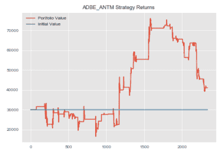</figure>

我们可以对剩下的几对重复这个过程。注意，我们的 create_spread 方法返回了包含 spread 的 dataframe 的头部。

我们使用了 17 的回看，这解释了为什么那些值是 NaNs。

```py
#repeating process for ANTM and AET
antm_aet=statarb(antm_test_price_series,aet_test_price_series,6,-2,2,6,antm_test.iloc[0],antm_test.iloc[-1])
antm_aet.create_spread()
antm_aet.generate_signals()
antm_aet.create_returns(30000,'ANTM & AET')
```

<figure class="kg-card kg-image-card">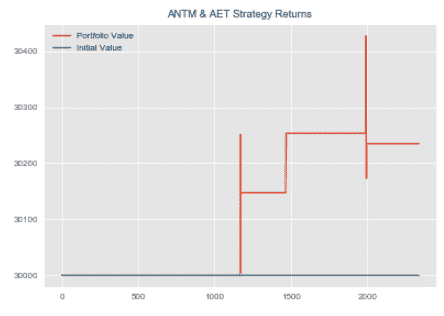</figure>

```py
#repeating process for ANTM and AET
antm_aet=statarb(antm_test_price_series,aet_test_price_series,6,-2,2,6,antm_test.iloc[0],antm_test.iloc[-1])
antm_aet.create_spread()
antm_aet.generate_signals()
antm_aet.create_returns(30000,'ANTM & AET')
```

<figure class="kg-card kg-image-card kg-width-wide"></figure>

好吧。并不是说我们已经创建了我们单独的 StatArb 实现，我们可以将它们组合成一个投资组合，计算我们的投资组合回报、mu、sigma 和 Sharpe 比率。

**注意，要计算夏普比率，我们需要对利率水平做一个假设。*T3】*

截至 2017 年 12 月，联邦基金利率为 1.5%。我们将把这个作为利率假设。回想一下，我们开始时的投资组合价值为 10 万美元。

我们分配了 1 万美元现金，并对我们的 StatArb 策略进行了同等加权。

### ****创建等权重投资组合****

我们在 statarb 类中包含了一个投资组合价值变量。我们将利用这一点来创建我们的总平均加权投资组合。

```py
#creating dataframe for equally weighted portfolio
equally_weighted=pd.DataFrame()
equally_weighted['ADBE_ANTM']=adbe_antm.portfolio['Portfolio Value']
equally_weighted['ANTM_AET']=antm_aet.portfolio['Portfolio Value']
equally_weighted['AET_ANTM']=aet_antm.portfolio['Portfolio Value']
equally_weighted['Cash']=10000
equally_weighted['Total Portfolio Value']=equally_weighted['ADBE_ANTM']+equally_weighted['ANTM_AET']+equally_weighted['AET_ANTM']+equally_weighted['Cash']
```

让我们检查一下我们的等权重投资组合数据框架。

```py
equally_weighted.head()

```

| 
 | ADBE_ANTM | AET ANTM | ANTM AET | 现金 | 投资组合总价值 |
| --- | --- | --- | --- | --- | --- |
| Zero | Thirty thousand | Thirty thousand | Thirty thousand | ten thousand | One hundred thousand |
| one | Thirty thousand | Thirty thousand | Thirty thousand | ten thousand | One hundred thousand |
| Two | Thirty thousand | Thirty thousand | Thirty thousand | ten thousand | One hundred thousand |
| three | Thirty thousand | Thirty thousand | Thirty thousand | ten thousand | One hundred thousand |
| four | Thirty thousand | Thirty thousand | Thirty thousand | ten thousand | One hundred thousand |

我们现在可以添加我们的回报栏，然后用它来计算我们的 Mu，适马和夏普比率。

```py
#adding returns column
equally_weighted['Returns']=np.log(equally_weighted['Total Portfolio Value']/equally_weighted['Total Portfolio Value'].shift(1))
#rechecking our dataframe
equally_weighted.head()
```

| 
 | ADBE_ANTM | AET ANTM | ANTM AET | 现金 | 投资组合总价值 | 返回 |
| --- | --- | --- | --- | --- | --- | --- |
| Zero | Thirty thousand | Thirty thousand | Thirty thousand | ten thousand | One hundred thousand | 圆盘烤饼 |
| one | Thirty thousand | Thirty thousand | Thirty thousand | ten thousand | One hundred thousand | Zero |
| Two | Thirty thousand | Thirty thousand | Thirty thousand | ten thousand | One hundred thousand | Zero |
| three | Thirty thousand | Thirty thousand | Thirty thousand | ten thousand | One hundred thousand | Zero |
| four | Thirty thousand | Thirty thousand | Thirty thousand | ten thousand | One hundred thousand | Zero |

我们现在将得到我们的 Mu、适马和夏普，并将它们存储在变量中。

```py
#initializing Equally_Weighted portfolio metrics
equally_weighted_mu=equally_weighted['Returns'].mean()
equally_weighted_sigma=equally_weighted['Returns'].std()
#initializing interest rate assumption of 1.5%
rate=0.015
#computing Sharpe
equally_weighted_Sharpe=round((equally_weighted_mu-rate)/equally_weighted_sigma,2)
```

好的，让我们检查一下我们的等权重投资组合的夏普比率。

```py
#getting Equally Weighted Portfolio Sharpe

print('Equally Weighted Portfolio Sharpe:',equally_weighted_Sharpe)
```

```py
Equally Weighted Portfolio Sharpe: -2.1
```

让我们画出我们的投资组合权益曲线。

```py
#plotting Equally Weighted Equity Curve
plt.figure(figsize=(10,6))
plt.plot(equally_weighted['Total Portfolio Value'])
plt.title('Equally Weighted Portfolio Equity Curve')
plt.show()
```

<figure class="kg-card kg-image-card kg-width-wide">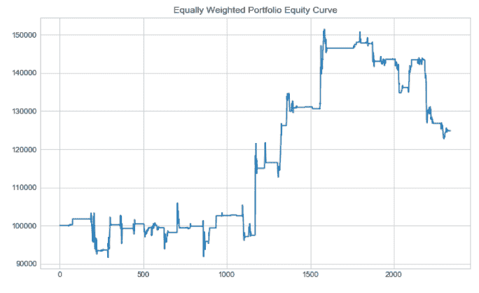</figure>

我们可以看到，尽管我们同等加权的投资组合价值增加了，但夏普仍然为负。

我们可以对剩余的投资组合重复这一过程，并比较我们的夏普比率。

* * *

## 投资组合构建:有效边界

到目前为止，我们已经创建了权重相等的投资组合，并检查了夏普比率和股票曲线。

我们现在感兴趣的是，如果我们找到了每个 StatArb 实施的最佳权重，以及由此对我们的权益曲线产生的影响，我们的夏普可能是多少。

我们现在将注意力转向通过给每一对投资组合分配随机权重来模拟我们投资组合的均值和方差。我们将存储我们投资组合的平均回报和 sigma，并创建一个散点图，帮助我们为每个战略实施选择最有效的权重。

为了更好地解释我们应该如何衡量我们的战略实施，我们将包括计算每个投资组合的夏普比率的逻辑。然后，我们可以使用更新的分配创建 StatArb 实施的新实例，并调查对我们的夏普比率和权益曲线的影响。

虽然我们的自下而上投资组合将是我们同等权重投资组合的扩展，因为它将仅将我们的机器学习概念应用于微观结构组件，但我们的立体投资组合优化(SPO)框架将结合此投资组合构建流程中的权重，并将其与自下而上投资组合的构建流程相结合。

首先，让我们检索我们配对的 mu 和 Sigmas。回想一下，我们在类中创建了一个方法来存储我们的平均值和 sigma。

我们可以使用我们的策略对象来检索这些变量。

```py
#initialzing Mus and Sigmas
#ADBE & ANTM
adbe_antm_mu=adbe_antm.mu
adbe_antm_sigma=adbe_antm.sigma
#ANTM & AET
antm_aet_mu=antm_aet.mu
antm_aet_sigma=antm_aet.sigma
#AET & ANTM
aet_antm_mu=aet_antm.mu
aet_antm_sigma=aet_antm.sigma
```

我们投资组合的回报可以表示为

<figure class="kg-card kg-image-card">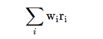</figure>

或者作为

<figure class="kg-card kg-image-card">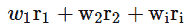</figure>

在哪里，

**w<sub>I</sub>T3】是第 **i <sub>th</sub>** 资产的权重，
**r <sub>i</sub>** 是第 i <sub>th</sub> 资产的收益。**

让我们创建一个计算回报的方法。

```py
#computing log returns for our portfolio values
returns=np.log(equally_weighted[['ADBE_ANTM','ANTM_AET','AET_ANTM']]/equally_weighted[['ADBE_ANTM','ANTM_AET','AET_ANTM']].shift(1))
```

让我们检查我们的回报。

```py
#checking returns
returns.head()

```

| 
 | ADBE_ANTM | AET ANTM | ANTM AET |
| --- | --- | --- | --- |
| Zero | 圆盘烤饼 | 圆盘烤饼 | 圆盘烤饼 |
| one | Zero | Zero | Zero |
| Two | Zero | Zero | Zero |
| three | Zero | Zero | Zero |
| four | Zero | Zero | Zero |

我们现在可以创建我们的平均回报率，并按年计算。

```py
avg_returns_252=returns.mean()*252
```

让我们来看看我们的平均年化回报率。

```py
#checking average annualized returns
avg_returns
```

```py
[0.00045914208401620995, 3.3720231332227273e-06, 0.00016147773221808213]
```

我们投资组合的方差可以表示为

<figure class="kg-card kg-image-card">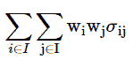</figure>

在哪里，

**w<sub>I</sub>T3】是第**I<sub>th</sub>T7】资产的权重，
T9】w<sub>j</sub>T12】是第**j<sub>th</sub>T16】资产的权重。******

现在我们将使用我们的回报来创建我们的年化协方差矩阵。

```py
covariance_matrix=returns.cov()*252
```

让我们检查一下我们的协方差矩阵。

```py
covariance_matrix

```

| 
 | ADBE_ANTM | AET ANTM | ANTM AET |
| --- | --- | --- | --- |
| ADBE_ANTM | 0.156866 | 1.205435e-04 | -2.591987e-03 |
| AET ANTM | 0.000121 | 1.834339e-05 | -1.338726e-07 |
| ANTM AET | -0.002592 | -1.338726e-07 | 1.212121e-03 |

我们现在可以创建一个变量来保存每个策略的权重。

```py
#assigning weights
weights=np.random.random(len(returns.columns))
weights/=np.sum(weights)
```

```py
#reviewing weights
weights
```

```py
array([ 0.22235774, 0.15788307, 0.61975919])
```

以下方法改编自【Yves J. Hilpisch 博士的《Python for Finance》。

我们将使用它来绘制我们的有效边界，并为我们的策略找到最佳权重。

```py
#importing optimization function
import scipy.optimize as sco
```

```py
def efficient_frontier(returns,rate=0.015):
#creating a list to hold our portfolio returns, variance and Sharpe values
portfolio_returns=[]
portfolio_volatility=[]
p_sharpes=[]
# returns=returns_df

for i in range(500):
#assigning weights
weights=np.random.random(len(returns.columns))
weights/=np.sum(weights)
#getting returns
current_return=np.sum(returns.mean()*weights)*252
portfolio_returns.append(current_return)
#getting variances
variance=np.dot(weights.T,np.dot(returns.cov()*252,weights))
#getting volatility
volatility=np.sqrt(variance)
portfolio_volatility.append(volatility)
#getting Sharpe ratios
ratio=(current_return-rate)/volatility
#storing Sharpe in list
p_sharpes.append(ratio)

p_returns=np.array(portfolio_returns)
p_volatility=np.array(portfolio_volatility)
p_sharpes=np.array(p_sharpes)
#plotting
plt.figure(figsize=(10,6))
plt.scatter(p_volatility,p_returns,c=p_sharpes, marker='o')
plt.xlabel('Expected Volatility')
plt.ylabel('Expected Return')
plt.title('Efficient Frontier')
plt.colorbar(label='Sharpe Ratio')
plt.show()

return
```

```py
efficient_frontier(returns.fillna(0))
```

<figure class="kg-card kg-image-card kg-width-wide">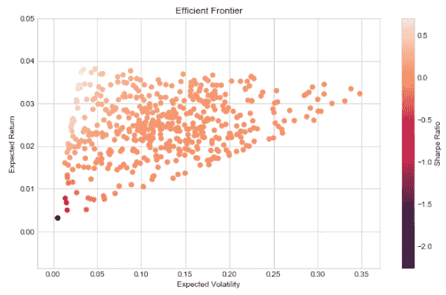</figure>

```py
def stats(weights,rate=0.015):
weights=np.array(weights)
p_returns=np.sum(returns.mean()*weights)*252
p_volatility=np.sqrt(np.dot(weights.T,np.dot(returns.cov()*252,weights)))
p_sharpe=(p_returns-rate)/p_volatility

return np.array([p_returns,p_volatility,p_sharpe])
```

```py
#testing stats method
stats(weights)
```

```py
array([ 0.0325289 , 0.08669494, 0.20219057])
```

```py
#creating function for optimization
def minimize_func(weights):
return -stats(weights)[2]
```

```py
#testing optimization function
minimize_func(weights)
```

```py
-0.20219056844039546
```

```py
def get_optimal_weights(weights):
#Finding Most Optimal Weights
#variables for optimization
constraints=({'type':'eq','fun':lambda x: np.sum(x)-1})
bounds=tuple((0,1) for x in range(len(returns.columns)))

starting_weights=len(returns.columns)*[1./len(returns.columns)]
most_optimal=sco.minimize(minimize_func,starting_weights, method='SLSQP', bounds=bounds, constraints=constraints)
best_weights=most_optimal['x'].round(3)

return best_weights, print('Weights:',best_weights)
```

```py
#storing optimal weights in a variable
optimal_weights=get_optimal_weights(weights)
```

```py
Weights: [ 0.022 0\. 0.978]
```

好吧。我们可以看到，最佳权重是将我们资本的 2%分配给 ANTM ADBE，0%分配给 AET ANTM，97.8%分配给 ANTM AET。

回想一下，我们的方法旨在优化我们的夏普比率。我们现在可以使用这些权重实现我们策略的另一个实例，并创建我们的投资组合和计算其权益曲线。

让我们创建 ADBE 和 ANTM 对的第二个实例。

我们将创建一个 total_allocation 变量，用于计算我们的策略分配。

```py
#total allocation variable
total_allocation=90000 #100k less 10k cash
#ADBE_ANTM Allocation
adbe_antm_allocation=round(total_allocation*optimal_weights[0][0],2)
#AET_ANTM Allocation
aet_antm_allocation=round(total_allocation*optimal_weights[0][2],2)
```

```py
#creating 2nd instance of first pair
adbe_antm_2=statarb(adbe_test_price_series,antm_test_price_series,17,-2,2,17,adbe_test.iloc[0],adbe_test.iloc[-1])
adbe_antm_2.create_spread()
adbe_antm_2.generate_signals()
#notice here we're using our updated allocation
adbe_antm_2.create_returns(adbe_antm_allocation,'ADBE_ANTM_Portfolio _2')
```

<figure class="kg-card kg-image-card kg-width-wide">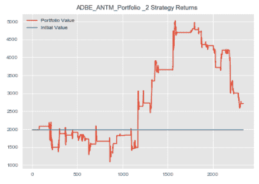</figure>

回忆一下，我们的第二对得到了 0%的分配。因此，我们将使用更新的权重创建第三对，并创建新的投资组合。

```py
#AET_ANTM 2nd implementation
aet_antm_2=statarb(aet_test_price_series,antm_test_price_series,12,-2,2,12,aet_test.iloc[0],aet_test.iloc[-1])
aet_antm_2.create_spread()
aet_antm_2.generate_signals()
aet_antm_2.create_returns(aet_antm_allocation,'AET & ANTM')
```

<figure class="kg-card kg-image-card kg-width-wide">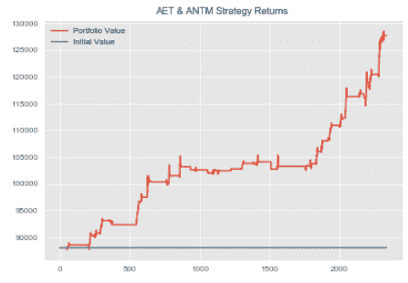</figure>

我们现在已经准备好构建我们的**有效前沿投资组合**。

### ****创造高效前沿投资组合****

让我们创建我们的有效前沿投资组合。

```py
#creating dataframe for Efficient Frontier Portfolio
efficient_frontier_portfolio=pd.DataFrame()
efficient_frontier_portfolio['ADBE_ANTM']=adbe_antm_2.portfolio['Portfolio Value']
efficient_frontier_portfolio['AET_ANTM']=aet_antm_2.portfolio['Portfolio Value']
efficient_frontier_portfolio['Cash']=10000
efficient_frontier_portfolio['Total Portfolio Value']=efficient_frontier_portfolio['ADBE_ANTM']+efficient_frontier_portfolio['AET_ANTM']+efficient_frontier_portfolio['Cash']
```

现在，我们可以将我们的收益列添加到我们的有效前沿数据框架中。

```py
#adding returns column to Efficient Frontier Dataframe
efficient_frontier_portfolio['Returns']=np.log(efficient_frontier_portfolio['Total Portfolio Value']/efficient_frontier_portfolio['Total Portfolio Value'].shift(1))
```

我们现在可以检查我们的有效前沿投资组合数据框架。

```py
#checking head of Efficient Frontier Portfolio dataframe
efficient_frontier_portfolio.head()

```

| 
 | ADBE_ANTM | ANTM AET | 现金 | 投资组合总价值 | 返回 |
| --- | --- | --- | --- | --- | --- |
| Zero | One thousand nine hundred and eighty | Eighty-eight thousand and twenty | ten thousand | One hundred thousand | 圆盘烤饼 |
| one | One thousand nine hundred and eighty | Eighty-eight thousand and twenty | ten thousand | One hundred thousand | Zero |
| Two | One thousand nine hundred and eighty | Eighty-eight thousand and twenty | ten thousand | One hundred thousand | Zero |
| three | One thousand nine hundred and eighty | Eighty-eight thousand and twenty | ten thousand | One hundred thousand | Zero |
| four | One thousand nine hundred and eighty | Eighty-eight thousand and twenty | ten thousand | One hundred thousand | Zero |

我们现在将绘制有效前沿投资组合的权益曲线。

```py
#plotting Equity Curve for Efficient Frontier Portfolio
plt.figure(figsize=(10,6))
plt.plot(efficient_frontier_portfolio['Total Portfolio Value'])
plt.title('Efficient Frontier Portfolio Equity Curve')
plt.show()
```

<figure class="kg-card kg-image-card kg-width-wide">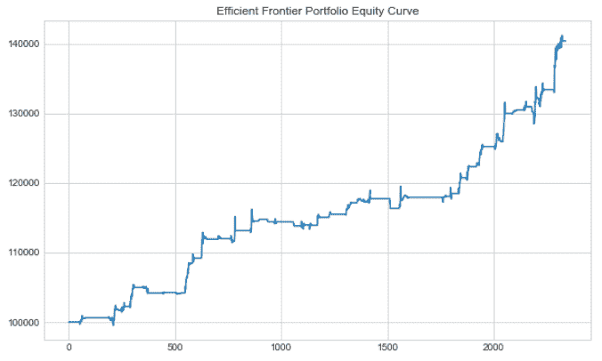</figure>

现在，我们可以将有效前沿投资组合的 Mu、适马和夏普指数存储在变量中。

```py
efficient_frontier_portfolio_mu=efficient_frontier_portfolio['Returns'].mean()
efficient_frontier_portfolio_sigma=efficient_frontier_portfolio['Returns'].std()
#recall that we initialized our interest assumption earlier
efficient_frontier_portfolio_sharpe=(efficient_frontier_portfolio_mu-rate)/efficient_frontier_portfolio_sigma
```

好吧。我们刚刚完成了第二个作品集。两个搞定了，还有两个。

我们现在可以开始构建我们的**自下而上优化投资组合**。

* * *

## 投资组合构建:自下而上的优化

自下而上的投资组合将机器学习应用于等权重投资组合的构成。

这意味着我们将使用相同的权重，但我们将使用自下而上的优化，而不是使用有效边界进行优化。

*   这个想法是让我们的 GMM 识别特定的政体或分布。T3】
*   然后，我们可以使用 GMM 的预测作为随机森林的标签。T3】
*   我们的信号发生器只有在我们的策略在历史上没有表现不佳的情况下才会交易。T3】

回想一下，我们的评估期是从 2018 年 5 月 1 日到 2018 年 6 月 12 日。在我们以前的投资组合中，我们能够利用这一时期来创建我们的投资组合。

然而，在这个投资组合中，我们将使用机器学习。这意味着我们需要在 2018 年 1 月 4 日到 2018 年 4 月 30 日这段时间内创建我们的模型，并在测试期间使用这些模型实际构建投资组合。

**让我们从创建我们的训练周期变量开始。**

回想一下，我们之前创建了一个名为 **training_df** 的数据帧，用于保存我们训练期间的数据。我们最初创建了这个数据框架，以便在我们的训练期间测试协整性。我们现在可以在这里重用它。

我们来回顾一下我们的 **training_df dataframe** 。

```py
training_df.head()

```

| 
 | ADBE | 氨乙异硫脲(Aminoethylisothiourea) | 全惯性制导 | ANTM | 非晶体物质 |
| --- | --- | --- | --- | --- | --- |
| Zero | One hundred and eighty-three point one three | One hundred and eighty-three point four five | Sixty point three six | Two hundred and twenty-nine point six two | Fifty-four point six seven |
| one | One hundred and eighty-two point eight nine | One hundred and eighty-three point six eight | Sixty point six one | Two hundred and twenty-nine point six three | Fifty-four point five one |
| Two | One hundred and eighty-three point two two | One hundred and eighty-three point eight | Sixty point seven seven | Two hundred and twenty-nine point seven | Fifty-four point two five |
| three | One hundred and eighty-three point seven three | One hundred and eighty-three point eight two | Sixty point eight one | Two hundred and twenty-nine point six five | Fifty-four point zero eight |
| four | One hundred and eighty-three point nine | One hundred and eighty-three point nine three | Sixty point eight | Two hundred and twenty-nine point seven | Fifty-four point two seven |

我们有从 2018 年 1 月 4 日到 2018 年 4 月 30 日的符号价格。没有发现包含 AMAT 的配对在至少 90%的置信区间上是协整的，所以我们不会使用它。

我们现在可以使用我们的训练期数据重新创建我们的同等权重策略实施。

一旦我们获得了实现的回报，我们就可以设计一些特性来训练我们的高斯混合模型。然后，我们将使用这些预测作为随机森林的标签。

一旦我们训练了我们的随机森林来预测我们的高斯混合模型发现的政权，我们就可以使用这些预测来增强我们的信号发生器，避免麻烦的政权。

让我们开始创建我们的策略实现。

#### ****第一步:特征工程****

我们现在准备好设计我们的功能。为了根据我们的策略的历史表现来预测我们的策略处于什么样的状态，我们需要特征或解释变量。

市场——微观结构包含大量的组成部分，包括流动性、波动性、市场深度等。在这个例子中，我们将使用波动率。

我们将跟踪我们每个基础成分的波动性、我们的价差和我们的 z 值。

这些特征将在我们的随机森林中使用，以预测由我们的高斯混合模型识别的政权。

#### ****第二步:创建历史时期的策略****

我们从第一对开始，ANTM ADBE。在我们开始实施之前，我们需要划分我们的历史时期。

回想一下，我们导入了 18 年 1 月 4 日到 18 年 6 月 12 日的日内数据。我们的评估周期或我们比较夏普比率的周期是从 2018 年 5 月 1 日到 2018 年 6 月 12 日。在前两个投资组合中，我们简单地将我们的策略应用于评估阶段。

然而，在我们后面的两个投资组合中，我们需要首先将其应用于我们的历史时期来训练我们的模型，然后将其应用于我们的评估时期。

在将我们的模型应用于真实的测试或评估阶段之前，为了评估我们的模型，我们需要将我们的历史阶段划分为历史训练和测试集。

这将使我们能够在总训练数据的一部分上训练我们的模型，然后在我们的历史测试数据上测试它。然后，我们可以将它们应用到我们的整体测试或评估阶段。

为简单起见，我们将手动计算一个 80/20 的 train_test_split。

```py
#checking length of training_df
len(training_df)
```

```py
6240
```

```py
#computing 80% of training_df length
len(training_df)*.80
```

```py
4992.0
```

```py
#computing 20% of training_df length
len(training_df)*-.20
```

```py
-1248.0
```

好了，现在我们有了代表我们的 training_df 数据帧的 80%和 20%标记的索引值，我们可以使用它们来分割我们的数据。

我们可以这样做的方式是对于我们的 80%，或者前 4992 行我们可以简单地使用符号[0:4992]。对于我们历史训练期间的测试期间，我们可以使用符号[-1248]解析最后的 20%。

这些符号将用于分割我们在整个历史时期产生的回报。

让我们创建我们的 ADBE_ANTM 实现。

```py
adbe_antm_3_historical=statarb(training_df['ADBE'],training_df['ANTM'],17,-2,2,17,adbe_test.iloc[0],adbe_test.iloc[-1])
adbe_antm_3_historical.create_spread()
adbe_antm_3_historical.generate_signals()
#notice that we are equally weighing our strategy
adbe_antm_3_historical.create_returns(30000,'ADBE_ANTM_3 Over Training Period')
```

<figure class="kg-card kg-image-card kg-width-wide">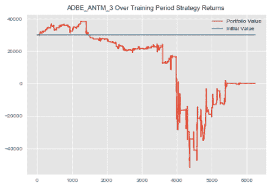</figure>

好了，现在我们已经创建了我们的策略，让我们检查一下我们的回报。

```py
adbe_antm_3_historical_rets=adbe_antm_3_historical.portfolio['Returns']
```

```py
#checking head of returns
adbe_antm_3_historical_rets.head()
```

```py
0 1.0
1 1.0
2 1.0
3 1.0
4 1.0
Name: Returns, dtype: float64
```

我们现在将对剩下的两对重复这一过程。

```py
#ANTM_AET Bottom Up Historical Implementation
antm_aet_3_historical=statarb(training_df['ANTM'],training_df['AET'],6,-2,2,6,antm_test.iloc[0],antm_test.iloc[-1])
antm_aet_3_historical.create_spread()
antm_aet_3_historical.generate_signals()
antm_aet_3_historical.create_returns(30000,'ANTM & AET_3 Over Hist. Train Period')
```

<figure class="kg-card kg-image-card kg-width-wide">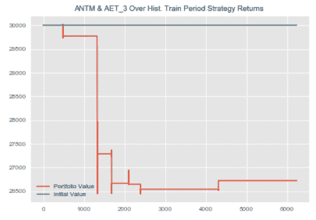</figure>

让我们将我们在 AET ANTM 培训期间的回报存储在一个变量中

```py
antm_aet_3_historical_rets=antm_aet_3_historical.portfolio['Returns']
```

好了，现在我们完成了 AET ANTM 配对。

```py
aet_antm_3_historical=statarb(training_df['AET'],training_df['ANTM'],12,-2,2,12,aet_test.iloc[0],aet_test.iloc[-1])
aet_antm_3_historical.create_spread()
aet_antm_3_historical.generate_signals()
aet_antm_3_historical.create_returns(30000,'AET & ANTM')
```

<figure class="kg-card kg-image-card kg-width-wide">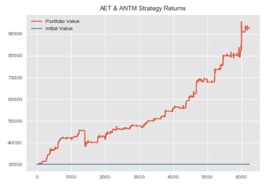</figure>

```py
aet_antm_3_historical_rets=aet_antm_3_historical.portfolio['Returns']
```

```py
#checking AET_ANTM returns over the training period
aet_antm_3_historical_rets.head()
```

```py
0 1.0
1 1.0
2 1.0
3 1.0
4 1.0
Name: Returns, dtype: float64

```

#### ****第三步:利用高斯混合模型识别历史政权****

我们现在有了历史时期 StatArb 策略的回报。我们的下一个任务是确定我们的历史政权。我们的目标是找出我们的战略在风险回报基础上表现不佳的制度，并避免这些时期。

要做到这一点，我们必须:

1.  确定我们的历史制度和
2.  可用于预测这些状态的工程特征。

然后，我们可以扩大我们的信号发生器，从而从微观结构层面优化我们的投资组合。

我们首先将我们的退货数据分割成 80/20 的测试分割。

```py
#splitting historical returns data
#ADBE_ANTM
#getting length of returns data
adbe_antm_3_rets_len=len(adbe_antm_3_historical_rets)
adbe_antm_3_rets_train=adbe_antm_3_historical_rets[0:4992]
adbe_antm_3_rets_test=adbe_antm_3_historical_rets[-1248:]
#ANTM_AET
#getting length of returns data
antm_aet_3_rets_len=len(antm_aet_3_historical_rets)
antm_aet_3_rets_train=antm_aet_3_historical_rets[0:4992]
antm_aet_3_rets_test=antm_aet_3_historical_rets[-1248:]
#AET_ANTM
#getting length of returns data
aet_antm_3_rets_len=len(aet_antm_3_historical_rets)
aet_antm_3_rets_train=aet_antm_3_historical_rets[0:4992]
aet_antm_3_rets_test=aet_antm_3_historical_rets[-1248:]
```

现在，我们已经创建了我们的火车和测试分裂，我们准备识别我们的政权。我们将首先根据训练期数据训练 GMM，然后将其应用于测试期数据。

**我们将创建一个可用于 GMM 和随机森林的方法。**

```py
class gmm_randomForests(object):
def __init__(self,historical_rets_train,historical_rets_test,base_portfolio_rets,gmm_components,df,base_portfolio_df,
internal_test_start,internal_test_end):

'''
PARAMETERS
##########
The first 3 parameters should have already been sliced from the
entire sample; ie specific dates parsed from dataframe that contains
trade history, returns, and features; other features will be added
later in development within the object

historical_rets_train- the returns data over the historical period used to train on
this is the internal train of the internal 80/20 split;the 80%
of the total historical training set

historical_rets_test- retuns data for 20% of internal training test set

base_portfolio_rets - this is our figurative live data;ie returns; 5/01/18-6/12/18 from either
Equally Weighted or Efficient Frontier Portfolios dependent upon implementation
of Bottom Up or Stereoscopic Portfolio Optimization (SPO) Framework

ex. data over 01/04/18-04/30/18
we would first split this 80/20
the 80% is our training set
the 20% is our testing set

we would then do another split on our training set created above
this is so that if we can better understand the historical
regimes and recalibrate our models if necessary before actually
predicting our 5/1/18-6/12/18 testing set

in this ex. our gmm_training_train is 80% of the period 01/04/18-4/30/18
our gmm_training_test is 20% of the period 01/04/18-4/30/18 and our
gmm_test_actual is 05/01/18-6/12/18

gmm_components - type:int; for number of components for GMM

df - the entire dataframe containing prior trading history; the dataframe from either Equally Weighted or
Efficient Frontier Portfolios; Our Random Forests Implementation will take this dataframe created by
our statarb class(i.e. from the prior portfolios) and add our features to it. It will then use these
features to predict the regimes of our test period. Recall that our Equally Weighted and Efficient
Frontier Portfolios were constructed over our assessment period of 5/1/18 to 6/12/18\. We will then
be able to store our predictions in a varible for our test period. These predictions will be passed
into a new statarb object as a parameter and be used to create the Bottom Up and SPO Framework Portfolios.

total_training_start- type: string; the beginning of the historical period for analysis; input as string
from example above would be 2012

total_training_end - type:string; the end of the historical period for analysis; input as string;
from example above would be 2017

base_portfolio_df - (i.e.adbe_antm.df,etc)Note: for the Bottom Up Implementation this df would be the Equally Weighted df but for the
SPO Framework df this would be the df from the Efficient Frontier implementation

internal_test_start- type:int; this is the testing period for the total training period; in the example,
this is the assessment period of 05/01/18-06/12/18; start thus is len(strategy_object)*.80

internal_test_end - type:int; this is the end of the assessment period; ie. the 20% testing split
of the broader split...this value is -len(strategy_object)*.20...Note this value is
is negative because we want the last 20% of the data

The last two methods are created as such because our Equally Weighted and Efficient Frontier
Portfolios are not indexed by dates but are indexed by a sequence of ints. This means
that in a later method(i.e. Random Forests) we have to pass in the int value of the index
position we want to parse
'''
self.historical_rets_train=historical_rets_train
self.historical_rets_test=historical_rets_test
self.base_portfolio_rets=base_portfolio_rets
self.gmm_components=gmm_components
self.max_iter=300
self.random_state=101
self.df=df
#self.total_training_start=total_training_start
#self.total_training_end=total_training_end
self.base_portfolio_df=base_portfolio_df
self.internal_test_start=internal_test_start
self.internal_test_end=internal_test_end
#creating volatility
self.volatility=self.historical_rets_train.rolling(window=5).std()
self.negative_volatility=np.where(self.historical_rets_train<0,self.historical_rets_train.rolling(window=5).std(),0)

def make_gmm(self):
model_kwds=dict(n_components=self.gmm_components,max_iter=self.max_iter,n_init=100,random_state=self.random_state)

gmm=GM(**model_kwds)

return gmm

def analyze_historical_regimes(self):
#Creating a Gaussian Mixture Model
self.gmm=self.make_gmm()
#instantiating the XTrain as the gmm_training_train; (i.e. the 80% of total training period)
self.gmm_XTrain=np.array(self.historical_rets_train).reshape(-1,1)
#Fitting the GMM on the Training Set(note this is the internal training set within the broader training set)
self.gmm.fit(self.gmm_XTrain.astype(int))
#Making predictions on the historical period; ie. the gmm_training_train
self.gmm_historical_predictions=self.gmm.predict(self.gmm_XTrain.astype(int))
#Making Predictions on the gmm_training_test (i.e. the 20% of total training period;)
self.gmm_XTest=np.array(self.historical_rets_test).reshape(-1,1)
self.gmm_training_test_predictions=self.gmm.predict(self.gmm_XTest.astype(int))
#Fitting the Model on ACTUAL data we want to Predict Regimes For
self.gmm_Actual=np.array(self.base_portfolio_rets).reshape(-1,1)
self.base_portfolio_predictions=self.gmm.predict(self.gmm_Actual)

return

def historical_regime_returns_volatility(self,plotTitle):
self.plotTitle=plotTitle
data=pd.DataFrame({'Volatility':self.volatility,'Regime':self.gmm_historical_predictions,'Returns':self.historical_rets_train})

with plt.style.context(['classic','seaborn-paper']):
fig,ax=plt.subplots(figsize=(15,10),nrows=1, ncols=2)

left = 0.125 # the left side of the subplots of the figure
right = 0.9 # the right side of the subplots of the figure
bottom = .125 # the bottom of the subplots of the figure
top = 0.9 # the top of the subplots of the figure
wspace = .5 # the amount of width reserved for blank space between subplots
hspace = 1.1 # the amount of height reserved for white space between subplots
# function that adjusts subplots using the above paramters
plt.subplots_adjust(
left = left,
bottom = bottom,
right = right,
top = top,
wspace = wspace,
hspace = hspace
)
# The amount of space above titles
y_title_margin = 2

plt.suptitle(self.plotTitle, y = 1, fontsize=20)

plt.subplot(121)
sns.swarmplot(x='Regime',y='Volatility',data=data)#,ax=ax[0][0])
plt.title('Regime to Volatility')

plt.subplot(122)
sns.swarmplot(x='Regime',y='Returns',data=data)#, ax=ax[0][1])
plt.title('Regime to Returns')
plt.tight_layout()
plt.show()

return

def train_random_forests(self):
#adding Features to the DataFrame
#assumption is that this is the df
#over the entire period

'''CAN UNCOMMENT THE SELF.VIX CODE TO INCLUDE VIX IN ANALYSIS..NOTE CHANGES TO PANDAS_DATAREADER API'''
#getting vix to add as feature
#self.VIX=pdr.get_data_yahoo('^VIX',start=self.total_training_start,end=self.total_training_end)
#creating features
#self.df['VIX']=self.VIX['Close']
self.df['6 X Vol']=self.df['X'].rolling(window=6).std()
self.df['6 Y Vol']=self.df['Y'].rolling(window=6).std()
self.df['6 Spread Vol']=self.df['Spread'].rolling(window=6).std()
self.df['6 Z-Score Vol']=self.df['Z-Score'].rolling(window=6).std()

self.df['12 X Vol']=self.df['X'].rolling(window=12).std()
self.df['12 Y Vol']=self.df['Y'].rolling(window=12).std()
self.df['12 Spread Vol']=self.df['Spread'].rolling(window=12).std()
self.df['12 Z-Score Vol']=self.df['Z-Score'].rolling(window=12).std()

self.df['15 X Vol']=self.df['X'].rolling(window=15).std()
self.df['15 Y Vol']=self.df['Y'].rolling(window=15).std()
self.df['15 Spread Vol']=self.df['Spread'].rolling(window=15).std()
self.df['15 Z-Score Vol']=self.df['Z-Score'].rolling(window=15).std()
#adding features to our historical df
#self.base_portfolio_df['VIX']=self.VIX['Close']
self.base_portfolio_df['6 X Vol']=self.df['X'].rolling(window=6).std()
self.base_portfolio_df['6 Y Vol']=self.df['Y'].rolling(window=6).std()
self.base_portfolio_df['6 Spread Vol']=self.df['Spread'].rolling(window=6).std()
self.base_portfolio_df['6 Z-Score Vol']=self.df['Z-Score'].rolling(window=6).std()

self.base_portfolio_df['12 X Vol']=self.df['X'].rolling(window=12).std()
self.base_portfolio_df['12 Y Vol']=self.df['Y'].rolling(window=12).std()
self.base_portfolio_df['12 Spread Vol']=self.df['Spread'].rolling(window=12).std()
self.base_portfolio_df['12 Z-Score Vol']=self.df['Z-Score'].rolling(window=12).std()

self.base_portfolio_df['15 X Vol']=self.df['X'].rolling(window=15).std()
self.base_portfolio_df['15 Y Vol']=self.df['Y'].rolling(window=15).std()
self.base_portfolio_df['15 Spread Vol']=self.df['Spread'].rolling(window=15).std()
self.base_portfolio_df['15 Z-Score Vol']=self.df['Z-Score'].rolling(window=15).std()
#replacing na values
self.df.fillna(0, inplace=True)
#Creating X_Train for RF over the Historical Period; Will train
#over Historical period, ie. self.historical_training_start/end
#then predict
self.RF_X_TRAIN=self.df[0:4992][['6 X Vol','6 Y Vol','6 Spread Vol','6 Z-Score Vol','12 X Vol','12 Y Vol',
'12 Spread Vol','12 Z-Score Vol','15 X Vol','15 Y Vol','15 Spread Vol','15 Z-Score Vol']]
#dropping unnecessary columns from train data
#self.RF_X_TRAIN.drop(['X','Y','Longs','Shorts','Exit','Long_Market','Short_Market'],inplace=True,axis=1)
#setting Y_Train for the RF to the predictions of GMM over historical period
self.RF_Y_TRAIN=self.gmm_historical_predictions
#Creating X_Test for the RF; ie the gmm_training_test period
#our features for RF
#that haven't been seen by the model
self.RF_X_TEST=self.base_portfolio_df[['6 X Vol','6 Y Vol','6 Spread Vol','6 Z-Score Vol','12 X Vol','12 Y Vol',
'12 Spread Vol','12 Z-Score Vol','15 X Vol','15 Y Vol','15 Spread Vol','15 Z-Score Vol']]\
#dropping unnecessary columns from train data
#self.RF_X_TEST.drop(['X','Y','Longs','Shorts','Exit','Long_Market','Short_Market'],inplace=True,axis=1)
#predictions for the x test over the internal testing period
self.RF_Y_TEST=self.base_portfolio_predictions #regime predictions for base portfolio
#build the RandomForest and check precision
self.RF_MODEL=RF(n_estimators=100) #Recall imported RandomForestsClassifier as RF
#training the random forests model on assessment period data
self.RF_MODEL.fit(self.RF_X_TRAIN.fillna(0),self.RF_Y_TRAIN)
#Making predictions for base portfolio period
self.RF_BASE_PORTFOLIO_PREDICTIONS=self.RF_MODEL.predict(self.RF_X_TEST.fillna(0))
#Checking Precision of Predictions
#print(confusion_matrix(self.RF_Y_TEST,self.RF_BASE_PORTFOLIO_PREDICTIONS))
#print('\n')
#print(classification_report(self.RF_Y_TEST,self.RF_BASE_PORTFOLIO_PREDICTIONS))

return

```

好吧。虽然我已经对上面的对象做了很多评论，但我还是想重申一下对我们的 **gmm_randomForests 方法**最重要的输入。

最关键的参数是:

*   gmm_training_train，
*   gmm _ 培训 _ 测试，
*   gmm_test_actual 和
*   df。gmm _ 培训 _ 培训

阐述:

*   df。gmm_training_train 是我们之前创建的历史期间回报的 80%分割。
*   gmm_training_test 是我们创建的历史时期回报的 20%部分。
*   mm_test actual is 是我们的等权重或有效前沿投资组合的回报。

自下而上优化建立在等权重投资组合的基础上，尽管它提供了一种优化技术，但分配仍然是等权重的。

这意味着我们可以使用我们同等权重投资组合的回报，预测制度，并创建一个使用制度的新 statarb 对象(即自下而上优化)。同样的逻辑也适用于我们的有效前沿投资组合。

SPO 框架建立在高效的前沿投资组合之上。因此，当我们设计我们的 SPO 框架组合时，我们将从我们的有效边界实施中获得体制预测。

然后我们将创建一个新的 statarb 对象，它将这些制度预测作为参数，并使用它来创建我们的 SPO 框架组合。需要记住的一件重要事情是，我们的 GMM 和随机森林模型是使用我们的历史数据来训练的。因此，当我们向模型提供来自我们的有效前沿和同等权重投资组合的数据时，这些数据是我们的模型没有看到的。这就是我们分离数据的目的。

**ADBE_ANTM GMM 实现**
我们先从第一对开始。让我们初始化我们的方法。

```py
#initializing GMM Random Forests method
#passing in the 1)returns for 80% of the training period(i.e.01/04/18-04/30/18),2)returns for 20% of the training period(i.e.01/04/18-04/30/18)
#3) Returns for actual or overall test period; (i.e. 05/01/18-06/12/18) for Equally Weighted, 4) count for GMMs,
#5)Dataframe for Equally Weighted, 6)
adbe_antm_gmm_rf=gmm_randomForests(adbe_antm_3_rets_train,adbe_antm_3_rets_test,adbe_antm.portfolio['Returns'],5,
adbe_antm_3_historical.df, adbe_antm.df,1871,-468)
```

现在我们已经初始化了我们的对象，让我们用它来获得 adbe_antm 对的政权。请注意，这些是基于我们的历史数据。

```py
#calling our analyze historical regimes method
adbe_antm_gmm_rf.analyze_historical_regimes()
```

我们现在可以用我们的历史制度回报波动率方法来绘制我们的制度。

```py
#Note this method takes in a string to title our plot
adbe_antm_gmm_rf.historical_regime_returns_volatility('ADBE_ANTM GMM Analysis')
```

<figure class="kg-card kg-image-card kg-width-wide">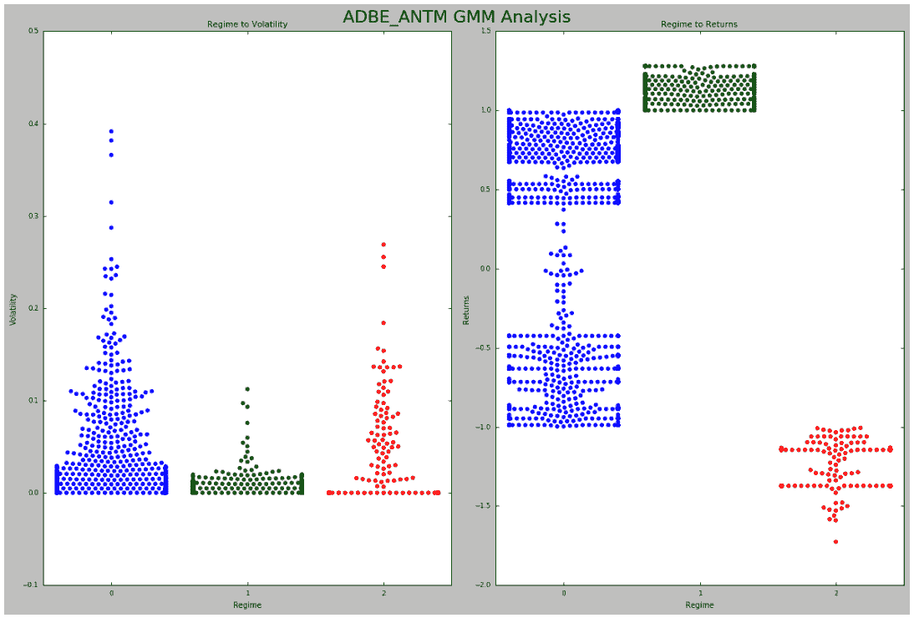</figure>

从上面的图中，我们可以看到对我们的策略最有利的方案是方案 1。这种制度的相对波动性最低，但回报率也最高。

我们将记下这一点，并将其纳入我们更新的 statarb 实施中。

*   需要注意的一点是，我们在历史或训练时期创造了这些制度。T3】
*   **回想一下，我们对数据进行了 80/20 分割。*T3】*
*   这意味着这些状态中的任何一个都可能是我们在 2018 年 5 月 1 日至 2018 年 6 月 21 日期间观察到的实际状态。T3】

在实践中，我们的想法是查看历史时期(即过去的 3 个月)并将分析应用于当前的一个月。我们会在每个月底更新并执行这一分析。让我们为剩下的两人组做同样的事情。

**ANTM_AET GMM 实现**

```py
#initializing object
antm_aet_gmm_rf=gmm_randomForests(antm_aet_3_rets_train,antm_aet_3_rets_test,antm_aet.portfolio['Returns'],5,antm_aet_3_historical.df, antm_aet.df,1871,-468)
```

```py
#calling our analyze historical regimes method
antm_aet_gmm_rf.analyze_historical_regimes()
```

```py
#plotting regime returns and volatility...Pass in String for Title of Plot
antm_aet_gmm_rf.historical_regime_returns_volatility('ANTM AET GMM Analysis')
```

<figure class="kg-card kg-image-card kg-width-wide">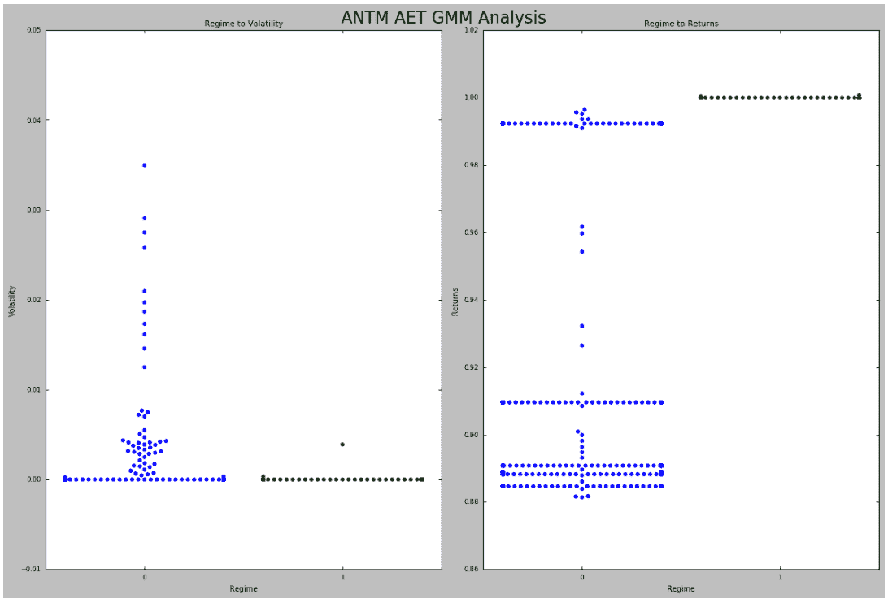</figure>

好的，我们可以看到，方案 1 似乎为我们的 ANTM-AET 关系提供了最佳的风险/回报权衡。

我们的回报在整个相对波动性分布中保持正值，但更希望以较小的波动性获得同等回报。

T5【AET _ ANTM】GMM 实现

```py
#initializing object
aet_antm_gmm_rf=gmm_randomForests(aet_antm_3_rets_train,aet_antm_3_rets_test,aet_antm.portfolio['Returns'],5,aet_antm_3_historical.df, aet_antm.df,1871,-468)
```

```py
#calling our analyze historical regimes method
aet_antm_gmm_rf.analyze_historical_regimes()
```

```py
#plotting regime returns and volatility...Pass in String for Title of Plot
aet_antm_gmm_rf.historical_regime_returns_volatility('AET_ANTM GMM Analysis')
```

<figure class="kg-card kg-image-card kg-width-wide">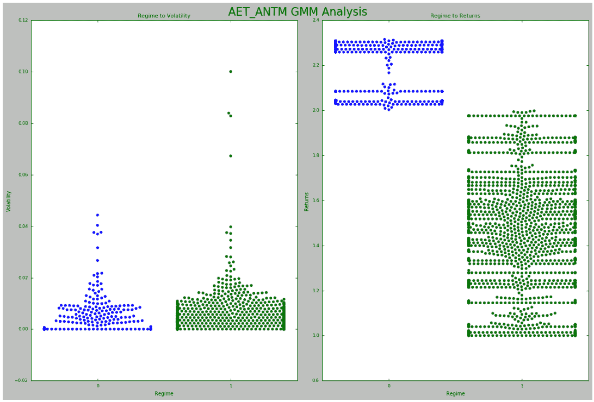</figure>

我们可以再次看到，尽管波动性很大，我们的回报仍然是正的。然而，从上面的图中我们可以注意到，在大多数情况下，制度 0 和制度 1 之间的波动水平是相似的。

然而，我们确实看到了制度 1 中波动性的一些爆发，我们的历史回报的很大一部分，尽管它们是正的，但比制度 0 中的少，制度 0 中没有显示任何显著的爆发。

在这个例子中，我们不会对该策略的实施进行任何更改，但是可以进行进一步的分析，以确定在这些波动性突发的情况下回报的符号，并且同样可以用于增强该策略。

让我们开始使用我们的随机森林来预测我们的制度，并通过使用我们的制度预测来更新我们的 StatArb 策略来回答上述问题。

#### ****第四步:训练随机森林预测政权****

现在我们已经完成了我们的状态分析，我们可以使用我们的随机森林来预测我们的评估期间的状态。回想一下，我们从由 adbe_antm 对象创建的等权重投资组合中传入了 dataframe。我们可以在 gmm_rf 对象上调用我们的 train_random_forests 方法，使用我们选择的特性来训练我们的随机森林。然后我们可以创建一个变量来保存我们的预测。

这些预测随后将被传递到我们新的 statarb 对象中，并用于生成我们自下而上的投资组合。

**【ADBE _ ANTM】随机森林实现**

```py
#calling the train_random_forests method on our adbe_antm_gmm_rf object
adbe_antm_gmm_rf.train_random_forests()
```

```py
[[ 0 0]
[ 895 1444]]

             precision  recall  f1-score  support
          0     0.00     0.00     0.00         0
          1     1.00     0.62     0.76      2339
avg / total     1.00     0.62     0.76      2339
```

让我们确保了解到目前为止我们已经取得的成绩。

*   回想一下，我们创建了变量来保存从 2018 年 1 月 4 日到 2018 年 4 月 30 日的培训期的回报。
*   我们使用 training_df 数据框架来提供历史数据，并对其应用我们的 StatArb 策略。
*   然后，我们将存储在变量中的训练周期回报分成 80%的训练和 20%的测试子集
*   2018 年 5 月 1 日至 2018 年 6 月 12 日期间是我们假设的实时市场数据，也是我们创建同等权重和有效前沿投资组合的时期。
*   我们的自下而上投资组合的目标是，通过优化使用我们设计的功能来预测我们的策略所处的政权(基于历史上看到的政权),从而建立我们的同等权重投资组合。
*   为此，我们需要使用我们在 2018 年 1 月 4 日至 2018 年 4 月 30 日期间的训练来训练我们的高斯混合模型，并使用我们的 GMM 模型来预测 2018 年 5 月 1 日至 2018 年 6 月 12 日期间的政权。
*   然后，我们可以使用从 2018 年 1 月 4 日到 2018 年 4 月 30 日期间的制度作为标签，并使用我们设计的特征作为随机森林训练的参数。
*   一旦我们训练了随机森林，我们就能够传递从 2018 年 5 月 1 日到 2018 年 6 月 12 日期间的特征，并使用它来预测政权。
*   为了测试我们的准确性，我们将这些结果与我们的高斯混合模型在 2018 年 5 月 1 日至 2018 年 6 月 12 日期间创建的实际区域进行了比较。

我们的结果表明，我们的随机森林具有完美的精确度。这是因为，在我们假设的实时交易期间，我们的观察来自相同的分布，这可以从我们上面的分类报告中看出。

我们现在可以创建一个变量来存储我们在假设的实时交易期间(即 2018 年 5 月 1 日至 2018 年 6 月 12 日)的状态预测，并将这些输入到更新的 statarb 实施中，看看我们的结果会如何变化。

我们将告诉我们更新后的 statarb 策略避免使用我们之前创建的图表，该图表显示了我们每个制度的回报和波动水平。

这并不是说我们已经更好地理解了我们的流程，在未来的实现中，我们将注释掉混淆矩阵和[分类](https://quantra.quantinsti.com/course/trading-machine-learning-classification-svm)报告，这样我们就不会真正知道我们的数据在我们假设的实时交易期间属于哪个区域。

我们将完全依赖我们对我们制度的波动性和回报特征的分析，并将这些信息反馈到我们的战略实施中。

让我们将我们的 ADBE-ANTM 对的状态预测存储到一个变量中，该变量可用于我们更新的 StatArb 实现。

```py
adbe_antm_regime_predictions=adbe_antm_gmm_rf.base_portfolio_predictions
```

**ANTM_AET 随机森林实现**

```py
#calling the train_random_forests method on our antm_aet_gmm_rf object
antm_aet_gmm_rf.train_random_forests()
```

好吧。现在让我们将我们的状态预测存储在一个变量中。

```py
antm_aet_regime_predictions=antm_aet_gmm_rf.base_portfolio_predictions
```

**AET_ANTM 随机森林实现**

```py
#calling the train_random_forests method on our antm_aet_gmm_rf object
aet_antm_gmm_rf.train_random_forests()
```

我们现在将把我们的预测存储在一个变量中。

```py
aet_antm_regime_predictions=aet_antm_gmm_rf.base_portfolio_predictions
```

我们现在可以使用这些制度预测来创建我们的更新策略，并组成我们的自下而上的投资组合。

#### ****第五步:在战略制定中运用模型的预测****

我们将首先创建一个 statarb 类的更新版本，它将允许我们传递我们的状态预测。

```py
class statarb_update(object):
#np.seterr(divide='ignore',invalid='ignore')

def __init__(self,df1, df2, ptype,ma,floor, ceiling,beta_lookback,start,end,regimePredictions,p2Objective,avoid1=0,target1=0,exit_zscore=0):
#setting the attributes of the data cleaning object
self.df1=df1 #the complete dataframe of X
self.df2=df2 # the comlete dataframe of Y
self.df=pd.DataFrame(index=df1.index) #creates a new dataframe in the create_spread method
self.ptype=ptype #the portfolio type 1= standard implementation 2=machine learning implementation
self.ma=ma# the moving average period for the model
self.floor=floor #the buy threshold for the z-score
self.ceiling=ceiling #the sell threshold for the z-score
self.Close='Close Long' #used as close signal for longs
self.Cover='Cover Short' #used as close signal for shorts
self.exit_zscore=exit_zscore #the z-score
self.beta_lookback=beta_lookback #the lookback of beta for hedge ratio
self.start=start #the beginning of test period as a string
self.end=end # the end of test period as a string
self.regimePredictions=regimePredictions.reshape(-1,1) #the regime predictions from GMM for p2=2 implementation
self.avoid1=avoid1 #the regime to avoid
self.target1=target1 #the regime to target
self.p2Objective=p2Objective #type:string;#the objective of p2 implementation; can be 'Avoid','Target',or 'None';
#create price spread
def create_spread(self):
if self.ptype==1:
#setting the new dataframe values for x and y of the closing
#prices of the two dataframes passed in
self.df['X']=self.df1[' Close']
self.df['Y']=self.df2[' Close']
#calculating the beta of the pairs
self.ols=linregress(self.df['Y'],self.df['X'])
#setting the hedge ratio
self.df['Hedge Ratio']=self.ols[0]

self.df['Spread']=self.df['Y']-(self.df['Hedge Ratio']*self.df['X'])

if self.ptype==2:
#setting the new dataframe values for x and y of the closing
#prices of the two dataframes passed in
self.df['X']=self.df1[' Close']
self.df['Y']=self.df2[' Close']
#calculating the beta of the pairs
self.ols=linregress(self.df['Y'],self.df['X'])
#setting the hedge ratio
self.df['Hedge Ratio']=self.ols[0]
#creating spread
self.df['Spread']=self.df['Y']-(self.df['Hedge Ratio']*self.df['X'])
#creating the z-score
self.df['Z-Score']=(self.df['Spread']-self.df['Spread'].rolling(window=self.ma).mean())/self.df['Spread'].rolling(window=self.ma).std()
#Creating the features columns
self.df['6 X Vol']=self.df['X'].rolling(window=6).std()
self.df['6 Y Vol']=self.df['Y'].rolling(window=6).std()
self.df['6 Spread Vol']=self.df['Spread'].rolling(window=6).std()
self.df['6 Z-Score Vol']=self.df['Z-Score'].rolling(window=6).std()

self.df['12 X Vol']=self.df['X'].rolling(window=12).std()
self.df['12 Y Vol']=self.df['Y'].rolling(window=12).std()
self.df['12 Spread Vol']=self.df['Spread'].rolling(window=12).std()
self.df['12 Z-Score Vol']=self.df['Z-Score'].rolling(window=12).std()

self.df['15 X Vol']=self.df['X'].rolling(window=15).std()
self.df['15 Y Vol']=self.df['Y'].rolling(window=15).std()
self.df['15 Spread Vol']=self.df['Spread'].rolling(window=15).std()
self.df['15 Z-Score Vol']=self.df['Z-Score'].rolling(window=15).std()
#Creating the Regime Prediction Column
self.df['Regime']=0
self.df['Regime']=self.regimePredictions.astype(int)

return

def generate_signals(self):
if self.ptype==1:
#creating the z-score
self.df['Z-Score']=(self.df['Spread']-self.df['Spread'].rolling(window=self.ma).mean())/self.df['Spread'].rolling(window=self.ma).std()
#prior z-score
self.df['Prior Z-Score']=self.df['Z-Score'].shift(1)
#Creating Buy and Sell Signals; when to be long, short, exit
#self.df['Signal']=np.where(self.df['Z-Score']<=self.floor,'BUY', np.where(self.df['Z-Score']>=self.ceiling,'SELL','FLAT'))
#self.df['Prior Signal']=self.df['Signal'].shift(1)

self.df['Longs']=(self.df['Z-Score']<=self.floor)*1.0 #buy the spread self.df['Shorts']=(self.df['Z-Score']>=self.ceiling)*1.0 #short the spread
self.df['Exit']=(self.df['Z-Score']<=self.exit_zscore)*1.0
#tracking positions via for loop implementation
self.df['Long_Market']=0.0
self.df['Short_Market']=0.0
#Setting Variables to track whether or not to be long while iterating over df
self.long_market=0
self.short_market=0
#Determining when to trade
for i,value in enumerate(self.df.iterrows()):
#Calculate logns
if value[1]['Longs']==1.0:
self.long_market=1

if value[1]['Shorts']==1.0:
self.short_market=1

if value[1]['Exit']==1.0:

self.long_market=0
self.short_market=0

self.df.iloc[i]['Long_Market']=self.long_market
self.df.iloc[i]['Short_Market']=self.short_market

if self.ptype==2:

self.df['Longs']=(self.df['Z-Score']<=self.floor)*1.0 #buy the spread
self.df['Shorts']=(self.df['Z-Score']>=self.ceiling)*1.0 #short the spread
self.df['Exit']=(self.df['Z-Score']<=self.exit_zscore)*1.0
#tracking positions via for loop implementation
self.df['Long_Market']=0.0
self.df['Short_Market']=0.0
#Setting Variables to track whether or not to be long while iterating over df
self.long_market=0
self.short_market=0
#Determining when to trade
for i,value in enumerate(self.df.iterrows()):
if self.p2Objective=='Avoid':
if value[1]['Regime']!= self.avoid1:
#Calculate longs
if value[1]['Longs']==1.0:
self.long_market=1
if value[1]['Shorts']==1.0:
self.short_market=1
if value[1]['Exit']==1.0:
self.long_market=0
self.short_market=0
self.df.iloc[i]['Long_Market']=value[1]['Longs']#self.long_market
self.df.iloc[i]['Short_Market']=value[1]['Shorts']#self.short_market

elif self.p2Objective=='Target':
if value[1]['Regime']==self.target1:
#Calculate longs
if value[1]['Longs']==1.0:
self.long_market=1
if value[1]['Shorts']==1.0:
self.short_market=1
if value[1]['Exit']==1.0:
self.long_market=0
self.short_market=0
self.df.iloc[i]['Long_Market']=value[1]['Longs']#self.long_market
self.df.iloc[i]['Short_Market']=value[1]['Shorts']#self.short_market

elif self.p2Objective=='None':
#Calculate longs
if value[1]['Longs']==1.0:
self.long_market=1
#Calculate Shorts
if value[1]['Shorts']==1.0:
self.short_market=1

if value[1]['Exit']==1.0:

self.long_market=0
self.short_market=0

self.df.iloc[i]['Long_Market']=value[1]['Longs']#self.long_market
self.df.iloc[i]['Short_Market']=value[1]['Shorts']#self.short_market

return self.df

def create_returns(self, allocation,pair_number):
if self.ptype==1:

'''
PARAMETERS
##########
allocation - the amount of capital alotted for pair
pair_number - string to annotate the plots
'''
self.allocation=allocation
self.pair=pair_number
self.portfolio=pd.DataFrame(index=self.df.index)
self.portfolio['Positions']=self.df['Long_Market']-self.df['Short_Market']
self.portfolio['X']=-1.0*self.df['X']*self.portfolio['Positions']
self.portfolio['Y']=self.df['Y']*self.portfolio['Positions']
self.portfolio['Total']=self.portfolio['X']+self.portfolio['Y']
#creating a percentage return stream
self.portfolio['Returns']=self.portfolio['Total'].pct_change()
self.portfolio['Returns'].fillna(0.0,inplace=True)
self.portfolio['Returns'].replace([np.inf,-np.inf],0.0,inplace=True)
self.portfolio['Returns'].replace(-1.0,0.0,inplace=True)
#calculating metrics
self.mu=(self.portfolio['Returns'].mean())
self.sigma=(self.portfolio['Returns'].std())
self.portfolio['Win']=np.where(self.portfolio['Returns']>0,1,0)
self.portfolio['Loss']=np.where(self.portfolio['Returns']<0,1,0)
self.wins=self.portfolio['Win'].sum()
self.losses=self.portfolio['Loss'].sum()
self.total_trades=self.wins+self.losses
#calculating sharpe ratio with interest rate of
#interest_rate_assumption=0.75
#self.sharp=(self.mu-interest_rate_assumption)/self.sigma
#win loss ratio;
self.win_loss_ratio=(self.wins/self.losses)
#probability of win
self.prob_of_win=(self.wins/self.total_trades)
#probability of loss
self.prob_of_loss=(self.losses/self.total_trades)
#average return of wins
self.avg_win_return=(self.portfolio['Returns']>0).mean()
#average returns of losses
self.avg_loss_return=(self.portfolio['Returns']<0).mean()
#calculating payout ratio
self.payout_ratio=(self.avg_win_return/self.avg_loss_return)
#calculate equity curve
self.portfolio['Returns']=(self.portfolio['Returns']+1.0).cumprod()
self.portfolio['Trade Returns']=(self.portfolio['Total'].pct_change()) #non cumulative Returns
self.portfolio['Portfolio Value']=(self.allocation*self.portfolio['Returns'])
self.portfolio['Portfolio Returns']=self.portfolio['Portfolio Value'].pct_change()
self.portfolio['Initial Value']=self.allocation

with plt.style.context(['ggplot','seaborn-paper']):
#Plotting Portfolio Value
plt.plot(self.portfolio['Portfolio Value'])
plt.plot(self.portfolio['Initial Value'])
plt.title('%s Strategy Returns '%(self.pair))
plt.legend(loc=0)
plt.show()

if self.ptype==2:
'''
PARAMETERS
##########
allocation - the amount of capital alotted for pair
pair_number - string to annotate the plots
'''
self.allocation=allocation
self.pair=pair_number

self.portfolio=pd.DataFrame(index=self.df.index)
self.portfolio['Positions']=self.df['Longs']-self.df['Shorts']
self.portfolio['X']=-1.0*self.df['X']*self.portfolio['Positions']
self.portfolio['Y']=self.df['Y']*self.portfolio['Positions']
self.portfolio['Total']=self.portfolio['X']+self.portfolio['Y']

self.portfolio.fillna(0.0,inplace=True)
#creating a percentage return stream
self.portfolio['Returns']=self.portfolio['Total'].pct_change()
self.portfolio['Returns'].fillna(0.0,inplace=True)
self.portfolio['Returns'].replace([np.inf,-np.inf],0.0,inplace=True)
self.portfolio['Returns'].replace(-1.0,0.0,inplace=True)
#calculating metrics
self.mu=(self.portfolio['Returns'].mean())
self.sigma=(self.portfolio['Returns'].std())
self.portfolio['Win']=np.where(self.portfolio['Returns']>0,1,0)
self.portfolio['Loss']=np.where(self.portfolio['Returns']<0,1,0)
self.wins=self.portfolio['Win'].sum()
self.losses=self.portfolio['Loss'].sum()
self.total_trades=self.wins+self.losses
#calculating sharpe ratio with interest rate of
#interest_rate_assumption=0.75
#self.sharp=(self.mu-interest_rate_assumption)/self.sigma
#win loss ratio;
self.win_loss_ratio=(self.wins/self.losses)
#probability of win
self.prob_of_win=(self.wins/self.total_trades)
#probability of loss
self.prob_of_loss=(self.losses/self.total_trades)
#average return of wins
self.avg_win_return=(self.portfolio['Returns']>0).mean()
#average returns of losses
self.avg_loss_return=(self.portfolio['Returns']<0).mean()
#calculating payout ratio
self.payout_ratio=(self.avg_win_return/self.avg_loss_return)

            #calculate equity curve
            self.portfolio['Returns']=(self.portfolio['Returns']+1.0).cumprod()
            self.portfolio['Trade Returns']=(self.portfolio['Total'].pct_change()) #non cumulative Returns
            self.portfolio['Portfolio Value']=(self.allocation*self.portfolio['Returns'])
            self.portfolio['Portfolio Returns']=self.portfolio['Portfolio Value'].pct_change()
            self.portfolio['Initial Value']=self.allocation

            with plt.style.context(['ggplot','seaborn-paper']):
                #Plotting Portfolio Value   
                plt.plot(self.portfolio['Portfolio Value'])
                plt.plot(self.portfolio['Initial Value'])
                plt.title('%s Strategy Returns '%(self.pair))
                plt.legend(loc=0)
                plt.show()

        return #self.portfolio['Portfolio Value'].plot()
```

现在让我们使用更新后的 statarb 类来创建我们的策略。

**ADBE_ANTM** **自下而上实现**

```py
#creating instance of updated statarb strategy
adbe_antm_bottom_up=statarb_update(adbe_test, antm_test, 2,17,-2, 2,17,'05/01/18','06/12/18',adbe_antm_regime_predictions,'Target',avoid1=0,target1=1,exit_zscore=0)
```

在上面的代码块中，我们传入除新字段之外的标准参数，即“Target”、target1、avoid1 和 regime 预测。

目标参数是我们对我们的 p2 目标的选择。这仅仅意味着我们正在寻求针对一个特定的政权。如果我们将此参数设置为“避免”，我们只需将“避免 1”参数初始化为我们想要避免的状态。

假设我们将该参数设置为“目标”，我们只需将目标 1 参数初始化为我们想要的目标状态。回想一下，我们确定了我们的历史制度，并使用我们设计的功能训练我们的随机森林来预测这些制度。

我们后来将随机森林模型应用于我们的测试阶段，并将状态预测存储在一个变量中。我们现在把这些预测传到这里，并根据我们对历史状况的分析，用它们来更新我们的信号发生器。让我们通过调用对象上的其余方法来完成这个实现。

```py
#creating spread
adbe_antm_bottom_up.create_spread()
#generating signals
adbe_antm_bottom_up.generate_signals()
#getting performance
#notice that we are passing in our equal weight amount here
adbe_antm_bottom_up.create_returns(30000,'ADBE_ANTM Bottom Up')
```

<figure class="kg-card kg-image-card kg-width-wide">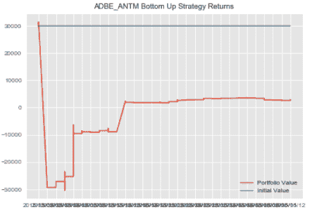</figure>

**ANTM_AET 自下而上实现**

```py
#creating instance of updated statarb strategy
antm_aet_bottom_up=statarb_update(antm_test, aet_test, 2,6,-2, 2,6,'05/01/18','06/12/18',antm_aet_regime_predictions,'Target',avoid1=0,target1=1,exit_zscore=0)
```

```py
#creating spread
antm_aet_bottom_up.create_spread()
#generating signals
antm_aet_bottom_up.generate_signals()
#getting performance
#notice that we are passing in our equal weight amount here
antm_aet_bottom_up.create_returns(30000,'ANTM AET Bottom Up')
```

<figure class="kg-card kg-image-card kg-width-wide"></figure>

在分析了我们的策略所属的历史制度并更新了我们的 statarb 实施以避免制度 0 之后，我们可以看到我们的 ANTM AET 实施在我们的测试期内没有交易。

这表示在此期间观察值落在 0 范围内。

**【AET _ ANTM】自下而上实现**

```py
#creating instance of updated statarb strategy
aet_antm_bottom_up=statarb_update(aet_test, antm_test, 1,12,-2, 2,12,'05/01/18','06/12/18',aet_antm_regime_predictions,'Avoid',avoid1=1,target1=0,exit_zscore=0)
```

> **请注意，在我们的 ANTM AET 实施中，我们选择不回避或针对任何特定制度。*T3】*

因此，在表示投资组合类型的第三个参数中，我们传入了 1，这是我们最初的实现。

```py
#creating spread
aet_antm_bottom_up.create_spread()
#generating signals
aet_antm_bottom_up.generate_signals()
#getting performance
#notice that we are passing in our equal weight amount here
aet_antm_bottom_up.create_returns(30000,'AET_ANTM Bottom Up')
```

<figure class="kg-card kg-image-card kg-width-wide">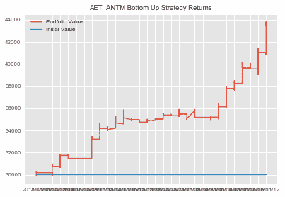</figure>

#### ****第六步:获取绩效指标****

现在，我们可以汇总我们的策略，形成自下而上的投资组合，并将夏普比率存储在一个变量中，以备后用。

```py
#creating dataframe for Bottom Up Portfolio
bottom_up_portfolio=pd.DataFrame()
bottom_up_portfolio['ADBE_ANTM']=adbe_antm_bottom_up.portfolio['Portfolio Value']
bottom_up_portfolio['AET_ANTM']=aet_antm_bottom_up.portfolio['Portfolio Value']
bottom_up_portfolio['ANTM_AET']=antm_aet_bottom_up.portfolio['Portfolio Value']
bottom_up_portfolio['Cash']=10000
bottom_up_portfolio['Total Portfolio Value']=bottom_up_portfolio['ADBE_ANTM']+bottom_up_portfolio['ANTM_AET']+bottom_up_portfolio['AET_ANTM']+bottom_up_portfolio['Cash']
```

我们现在可以添加一个列来保存自下而上投资组合的收益。

```py
#adding returns column to Bottom Up Dataframe
bottom_up_portfolio['Returns']=np.log(bottom_up_portfolio['Total Portfolio Value']/bottom_up_portfolio['Total Portfolio Value'].shift(1))
```

```py
plt.figure(figsize=(10,6))
plt.plot(bottom_up_portfolio['Total Portfolio Value'])
plt.title('Bottom Up Portfolio')
plt.show()
```

现在让我们绘制自下而上投资组合的权益曲线。

```py
plt.figure(figsize=(10,6))
plt.plot(bottom_up_portfolio['Total Portfolio Value'])
plt.title('Bottom Up Portfolio')
plt.show()
```

<figure class="kg-card kg-image-card kg-width-wide">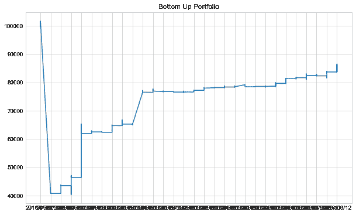</figure>

让我们通过创建 Sharpe 并将其存储在一个变量中以备后用，来总结我们自下而上的投资组合。

```py
bottom_up_portfolio_mu=bottom_up_portfolio['Returns'].mean()
bottom_up_portfolio_sigma=bottom_up_portfolio['Returns'].std()
#recall that we initialized our interest assumption earlier
bottom_up_portfolio_sharpe=(bottom_up_portfolio_mu-rate)/bottom_up_portfolio_sigma

```

* * *

## 项目组合构建:SPO 框架

SPO 框架将有效边界(或自顶向下的优化)背后的逻辑与自底向上的优化组合结合起来。这里，我们重复了创建自下而上投资组合的过程，只是我们没有对我们的策略进行平均加权，而是根据创建有效边界时得到的权重对它们进行加权。

回想一下，我们的有效边界分析给了我们的 ANTM-AET 对一个权重 0。这与我们在实施自下而上的投资组合时看到的一致。

因此，我们将使用在自下而上实施过程中发现的有效前沿权重和制度预测，在我们的 ADBE_ANTM 和 AET_ANTM 对上创建我们的 SPO 实施。

**ADBE_ANTM 立体投资组合优化(SPO)框架实现**

```py
#creating instance of updated statarb strategy
adbe_antm_spo=statarb_update(adbe_test, antm_test, 2,17,-2, 2,17,'05/01/18','06/12/18',adbe_antm_regime_predictions,'Target',avoid1=0,target1=1,exit_zscore=0)
```

```py
#creating spread
adbe_antm_spo.create_spread()
#generating signals
adbe_antm_spo.generate_signals()
#getting performance
#notice that we are passing in our weight from our efficient frontier analysis here
adbe_antm_spo.create_returns(adbe_antm_allocation,'ADBE_ANTM SPO Framework')
```

<figure class="kg-card kg-image-card kg-width-wide">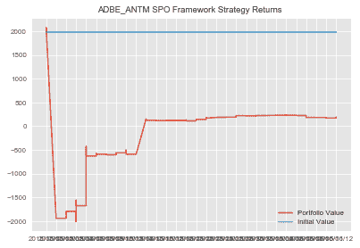</figure>

让我们为 ANTM AET 的实施重复这一过程。

**AET_ANTM SPO 框架实现**

```py
#creating instance of updated statarb strategy
aet_antm_spo=statarb_update(aet_test, antm_test, 1,12,-2, 2,12,'05/01/18','06/12/18',aet_antm_regime_predictions,'Avoid',avoid1=1,target1=0,exit_zscore=0)
```

```py
#creating spread
aet_antm_spo.create_spread()
#generating signals
aet_antm_spo.generate_signals()
#getting performance
#notice that we are passing in our efficient frontier weight amount here
aet_antm_spo.create_returns(aet_antm_allocation,'AET_ANTM SPO Framework')
```

<figure class="kg-card kg-image-card kg-width-wide">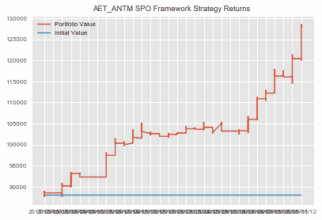</figure>

**我们现在可以构建我们的 SPO 框架组合了**

```py
#creating dataframe for SPO Portfolio
spo_portfolio=pd.DataFrame()
spo_portfolio['ADBE_ANTM']=adbe_antm_spo.portfolio['Portfolio Value']
spo_portfolio['AET_ANTM']=aet_antm_spo.portfolio['Portfolio Value']
spo_portfolio['Cash']=10000
spo_portfolio['Total Portfolio Value']=spo_portfolio['ADBE_ANTM']+spo_portfolio['AET_ANTM']+spo_portfolio['Cash']
```

**现在让我们计算一下我们的 SPO 框架投资组合的回报**

```py
#adding returns column to SPO Portfolio dataframe
spo_portfolio['Returns']=np.log(spo_portfolio['Total Portfolio Value']/spo_portfolio['Total Portfolio Value'].shift(1))
```

```py
spo_portfolio_mu=spo_portfolio['Returns'].mean()
spo_portfolio_sigma=spo_portfolio['Returns'].std()
#recall that we initialized our interest assumption earlier
spo_portfolio_sharpe=(spo_portfolio_mu-rate)/spo_portfolio_sigma
```

**让我们绘制 SPO 投资组合的权益曲线**

```py
plt.figure(figsize=(10,6))
plt.plot(spo_portfolio['Total Portfolio Value'])
plt.title('SPO Portfolio Equity Curve')
plt.show()
```

<figure class="kg-card kg-image-card kg-width-wide">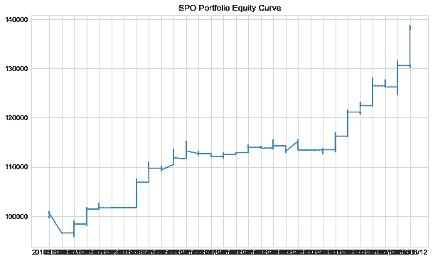</figure>

我们现在可以比较我们每个投资组合的夏普比率。

* * *

## 相对投资组合绩效评估

咻！

我们现在可以创建一个数据框架来保存我们的夏普比率并比较我们的结果。

让我们创建用于创建数据框架的变量。

```py
#list to hold portfolio names
names=['Equally Weighted','Efficient Frontier','Bottom Up','SPO Framework']
#variable to hold column name
column_name='Sharpe Ratio'
#list to hold Sharpe Ratios
sharpes=[equally_weighted_Sharpe,efficient_frontier_portfolio_sharpe,bottom_up_portfolio_sharpe,spo_portfolio_sharpe]
```

我们现在将使用变量来创建数据帧。

```py
#creating dataframe to compare Sharpe Ratios of Portfolios
portfolio_assessment=pd.DataFrame({column_name:sharpes},index=names)
```

好吧。我们现在可以检查我们的数据框架并比较我们的夏普比率。

```py
portfolio_assessment

```

| 
 | 夏普比率 |
| --- | --- |
| 同等加权 | -2.100000 |
| 效率限界 | -7.697951 |
| 颠倒 | -0.719018 |
| SPO 框架 | -6.743110 |

让我们创建一个数据框架来比较我们投资组合的最终价值。

```py
#creating list to hold ending values of portfolios
#We pass in 1 into the tail method because it represents the last index position
portfolio_values=[equally_weighted['Total Portfolio Value'].tail(1).values.astype(int),efficient_frontier_portfolio['Total Portfolio Value'].tail(1).values.astype(int),bottom_up_portfolio['Total Portfolio Value'].tail(1).values.astype(int),spo_portfolio['Total Portfolio Value'].tail(1).values.astype(int)]
#creating dataframe to hold ending value of portfolios
pd.DataFrame({'Ending Portfolio Values':portfolio_values},index=names)
```

| 
 | 期末投资组合价值 |
| --- | --- |
| 同等加权 | [124853] |
| 效率限界 | [140402] |
| 颠倒 | [86225] |
| SPO 框架 | [137868] |

好吧。我们可以看到，我们的最佳夏普比率是在自下而上的投资组合中实现的。但是，自下而上的投资组合产生了最差的投资组合价值。

回想一下，我们的自下而上实施建立在我们的同等权重投资组合之上，除此之外，它通过将我们的 GMM 应用于历史状态检测来优化投资组合，并使用随机森林来预测我们当前的市场状态属于哪个历史状态。

我们的 SPO 框架重复了这一过程，只是它使用了通过我们的有效前沿分析发现的权重。

在 SPO 和 Efficient Frontier 实现中，我们根据我们的分析结果将第二对——ANTM _ AET——置零。

* * *

## 回顾

在这篇文章中，我们已经涵盖了大量的信息。

*   我们从了解什么是 SPO 框架开始。
*   我们对高斯混合模型以及它们与 K 均值聚类和随机森林的关系有了一些了解。
*   我们了解到投资组合优化问题类似于系综的前提，系综是 SPO 框架的一个关键假设。
*   我们回顾了如何使用基本特征和 K-Means 来为我们的 StatArb 策略找到配对。
*   我们还回顾了如何找到 k 的最佳值。
*   我们创建了四个 StatArb 日内投资组合，采用不同的方法来解决投资组合优化问题。
*   在此期间，我们发现自下而上的实施方式产生了最佳的夏普比率，尽管产生了最差的性能。
*   一些关键的考虑因素是，在现实中，我们不会像在 AET-ANTM 组合的案例中那样，给单一策略分配那么多的资本。
*   这是由于我们的有效前沿分析产生了基于未优化对的结果的偏差结果。
*   此外，我们在自下而上投资组合的 ANTM-AET 实施中避免的制度显然考虑了我们测试期间的所有观察结果，因此在该投资组合的测试期间将这对组合清零，但这对组合被有效前沿分析从我们的 SPO 框架投资组合中移除。
*   因此，这些投资组合之间的主要区别是使用的权重。

从 SPO 框架的介绍中得到的一个关键信息是，投资组合可以被视为“n”个市场微观结构的总和。

投资组合优化问题的立体投资组合优化方法是一个框架，而不是一个硬性的模型。

因此，有效边界、高斯混合模型和随机森林可以用其他自上而下和自下而上的技术替代，自上而下是专注于资产分配的方法，而自下而上是专注于将机器学习应用于成分资产的市场微观结构的方法。

这种微观结构成分不限于波动率，还可以是流动性、订单到达率等。

* * *

### 注意

如果你希望利用这项研究的信息，那么这篇博客必须使用以下引文:

***科尔曼，L. (2017)。“什么是立体投资组合优化框架:**将机器学习集成应用于市场微观结构以实现投资组合优化”**quantin STI Quantitative Learning PVT . ltd .[https://blog . quantin STI . com/optimal-Portfolio-construction-Machine-Learning/](/optimal-portfolio-construction-machine-learning/)***

关于这项研究的任何疑问，您可以通过[marcus@gradientlaboratories.com](mailto:marcus@gradientlaboratories.com)联系作者

* * *

希望量化构建投资组合、创造回报并有效管理风险的投资组合经理和量化分析师可以参加这个[量化投资组合管理课程](https://quantra.quantinsti.com/course/quantitative-portfolio-management)，在这里您将学习不同的[投资组合管理](https://quantra.quantinsti.com/course/portfolio-management-machine-learning)技术，如要素投资、风险平价和凯利投资组合，以及现代投资组合理论。

如果你有兴趣了解更多关于交易的机器学习的知识，Quantinsti 通过我们的 [Quantra](http://www.quantra.quantinsti.com/) 在线学习门户网站提供了一个自定进度的选项，以及一个全面的量化交易方案，即算法交易的[执行计划(EPAT )](https://www.quantinsti.com/epat) 。

* * *

**文件在下载**

*   将机器学习集成应用于市场微观结构以实现投资组合优化(项目 PDF 文件)
*   使用机器学习构建最佳投资组合(Python 笔记本)
*   SPO_Data (Excel 文件)

* * *

*<small>免责声明:股票市场的所有投资和交易都涉及风险。在金融市场进行交易的任何决定，包括股票或期权或其他金融工具的交易，都是个人决定，只能在彻底研究后做出，包括个人风险和财务评估以及在您认为必要的范围内寻求专业帮助。本文提到的交易策略或相关信息仅供参考。</small>T3】***