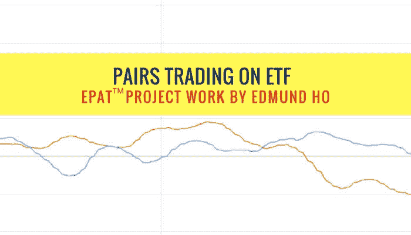
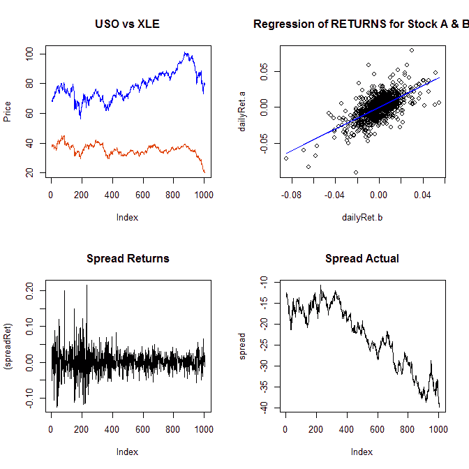
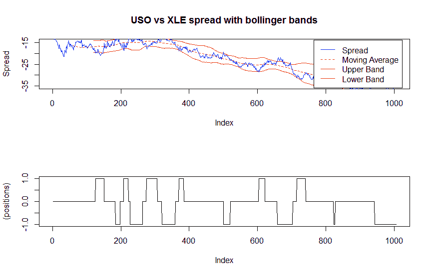
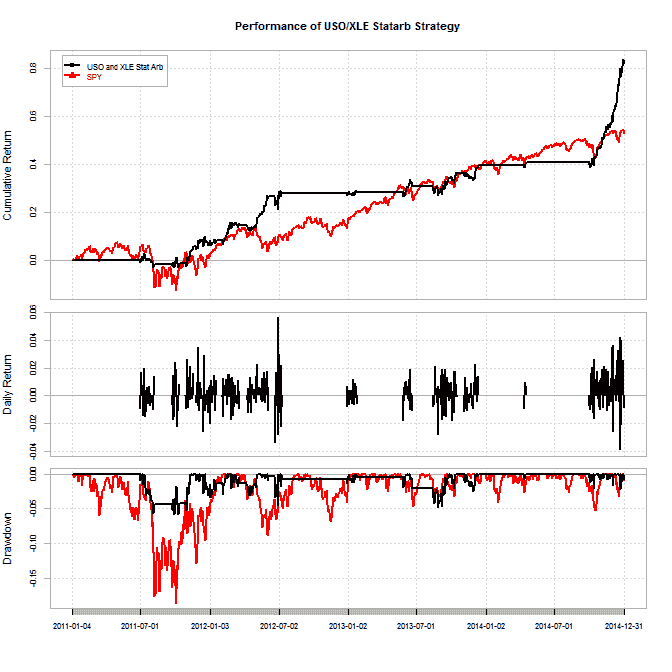
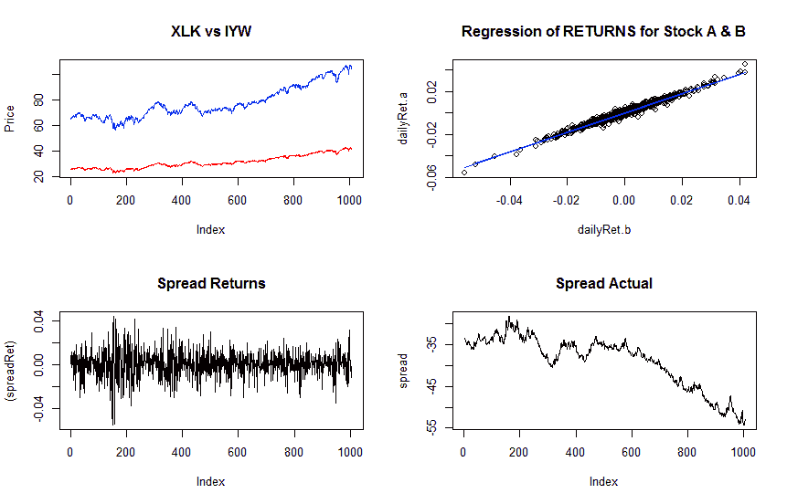
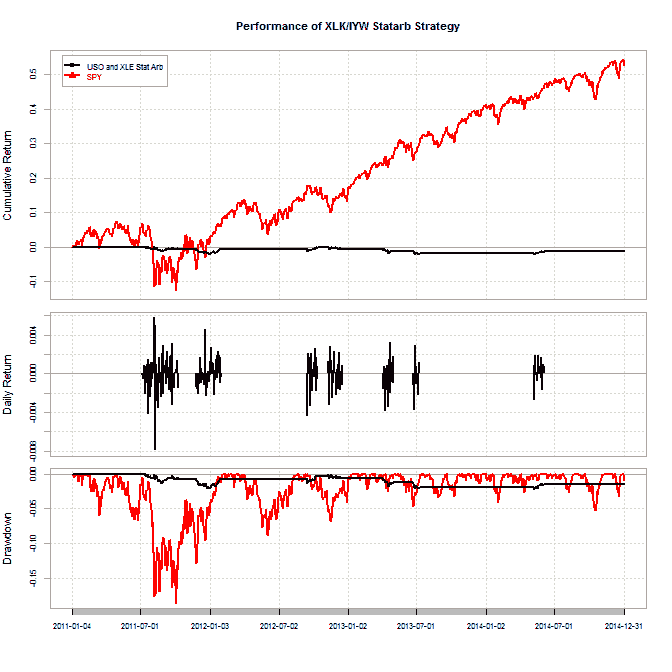
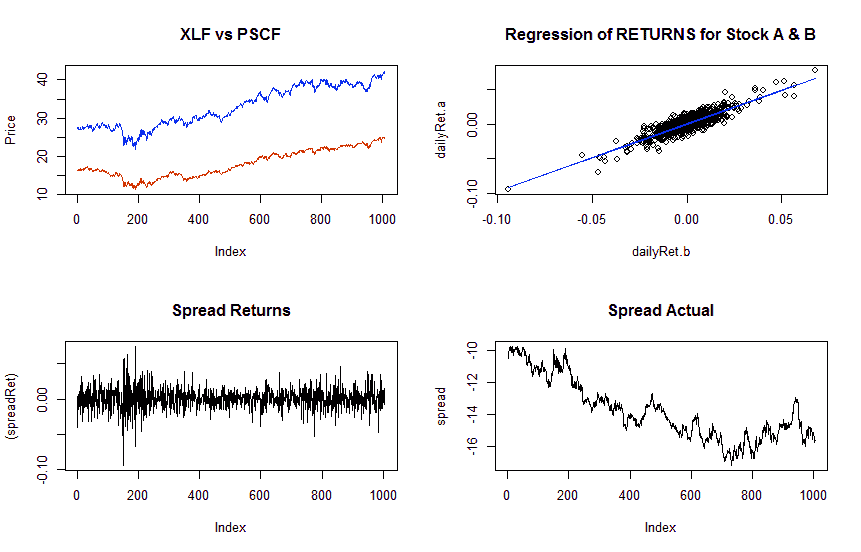

# 交易所交易基金的配对交易[EPAT 项目]

> 原文：<https://blog.quantinsti.com/pairs-trading-with-etf/>

本文是作者提交的最后一个项目，作为他在 QuantInsti 的[算法交易高管课程(EPAT)](https://www.quantinsti.com/epat/)的一部分。你可以查看我们的项目[页面](https://www.quantinsti.com/category/project-work-epat/)，在阅读完这篇文章**后，看看我们的学生在建设什么。**

### **关于作者** 

[何厚铧](https://www.linkedin.com/in/edmund-ho-a62a7320?)他在不列颠哥伦比亚大学获得商业学士学位，在香港科技大学获得投资管理硕士学位。Edmund 参加了第 27 批[EPAT](https://www.quantinsti.com/epat)，这份报告是他最后项目工作的一部分。

### **项目总结**

ETF 非常受配对交易的欢迎，因为它消除了公司特有的因素。最重要的是，大多数 ETF 都是卖空型的，因此我们不必担心卖空限制。在这个项目中，我们试图利用石油(USO vs XLE)、科技(XLK vs IYW)和金融部门(XLF vs PSCF)的 3 个 ETF 对建立一个投资组合。

长期来看，矿商的整体表现与大宗商品高度相关。短期内，由于个别公司的表现或整体股市表现，它们可能会出现分歧，因此短期套利机会可能存在。在科技股方面，我们试图寻找两只大型科技股 ETF 的错误定价。最后，我们试图看看是否存在套利机会之间的大型和中型金融交易所交易基金。

### **第一对——石油部门普遍服务义务 vs XLE**

#### 协整检验

以上图表是在 R Studio 中生成的。2011 年 1 月 1 日至 2014 年 12 月 31 日期间产生的样本数据。

首先，我们绘制成对的价格，它给我们的印象是两个价格系列非常相似。然后我们对 USO 和 XLE 进行回归分析(回报 USO = Beta *回报 XLE +剩余),发现 Beta 或对冲比率为 0.7493。接下来，我们应用套期保值比率来生成利差收益。我们可以看到利差收益在 0 附近偏离很近，这显示了协整模式的特征。最后，我们应用置信水平为 0.2 的扩展 Dickey-Fuller 检验，并检查配对是否通过 ADF 检验。结果如下:

###### 扩充迪基-富勒试验

数据:(扩散)迪基-富勒= -3.0375，滞后阶= 0，p 值= 0.1391

替代假设:静止

[1]“价差很可能与 0.1 的 p 值进行协整”。38360.88868888661

p 值为 0.1391 时，配对满足协整检验，我们将在下一节继续对配对进行回测。

#### 策略回溯测试

以上回溯测试结果是在 R Studio 中生成的。回测期使用的是样本内数据，类似于协整检验。我们的交易策略相对简单如下:

*   如果价差大于其 120 天的滚动回顾期标准差的+/- 1.5 倍，那么我们相应地做空/做多。
*   在任何时候，只有一个空缺职位
*   当价差回到均值/移动平均线时，平仓多头/空头头寸。

上面的回溯测试结果是在 R-Studio 中使用 PerformanceAnalystics 包生成的。在样本内回测期间，该策略取得了 121.03%的累计回报，其中间谍(S&P500)的累计回报为 61.78%。这意味着年化回报率分别为 22%和 12.82%。在风险分析方面，该策略的年化标准差为 11.63%，远低于 SPY 的 15.35%。该策略的最差提取比例为 6.39%，而 SPY 为 19.42%。在我们的策略中，年度夏普比率为 1.89，优于 SPY 的 0.835。请注意，上述所有计算都没有计入交易成本。

#### 样本外测试

对于 2015 年 1 月 1 日日至 2015 年 12 月 31 日之间的样本外期间，货币对未通过 ADF 测试，p 值为 0.3845。这种现象可以用残酷的石油价格急剧下跌来解释，而股票市场却在持续上涨。如果我们观察利差回报，它们首先似乎在 0 附近协整，但下图显示了更大的偏差。

实际的利差显然没有显示出高 p 值所表明的协整模式。接下来，我们将继续使用样本外数据回测相同的策略，尽管这对组合没有通过协整检验。套期保值比率为 1.1841。关键的回溯测试结果在 R-Studio 中生成，如下所示:

美国国债和 XLE 国债的年化回报率为 0.09860-0.09867686867

美国国债和 XLE 国债的累积回报率为 0.0980-0.00038638686

美国统一标准组织和 XLE 国家统计局的年度夏普比率(Rf=0%)为 0.56-0.516365666666

USO 和 XLE 统计 Arb 标准偏差 0.1759 0.15665865867

普遍服务义务和 XLE 统计数据第一次下降 0.170630530761

乍一看，该策略似乎在所有方面都优于 SPY，但由于回望期与样本内回测数据相同(120 天的一致性)，该策略在样本外期间只有 1 次交易，这可能无法反映未来的情况。然而，这表明，没有必要有一个完美的协整对，以提取利润机会。事实上，只有少数完美的一对能通过测试。

### **<u>第二对——大盘科技 XLK vs IYW</u>**

#### 协整检验

不足为奇的是，XLK 和 IYW 具有很强的线性关系，如对冲比为 0.903 的回归分析所示。这两只大盘科技股 ETF 除了规模、成交量、费用率等不同外，本质上非常相似。然而，如果我们仔细看看实际的收益率利差，它似乎并不满足协整检验。如果我们运行 ADF 检验，结果显示它们不太可能与 0.5043 的 p 值进行协整。

扩充迪基-富勒试验

数据:(传播)迪基-富勒= -2.1748，滞后阶= 0，p 值= 0.5043

替代假设:静止

[1]“价差不太可能与 p 值为 0.50 的协整。18961.688686886617

在这一对中运行策略的目的是看这一对中是否有任何错误定价(短期背离)，以便从中获利。在 USO 和 XLE 的例子中，我们观察到，尽管两者没有通过协整检验，盈利机会仍然存在。在这里，我们将继续测试这对组合，看看是否存在任何盈利机会。

#### 回溯测试结果

| XLK 和 IYW Stat Arb spy 年化回报率-0.003581305 0.1282006 XLK 和 IYW Stat Arb spy 累积回报率-0.01420635 0.6177882 XLK 和 IYW Stat Arb spy 年化夏普比率(Rf=0%) -0.2839318 0.8347157 XLK 和 IYW Stat Arb spy 年化标准差 0.0126131315 |
|  |
|  |

回溯测试结果表明，该策略在 2011 年 1 月 1 日1 日至 2014 年 12 月 31 日的回溯测试期间表现非常差。这表明，这两个 ETF 是高度相关的，很难从中提取盈利机会。为了让统计套利策略发挥作用，我们需要一对价差有一定波动性的货币，但它们最终应该呈现均值回归模式。在下一节中，我们将对金融 ETF 进行同样的分析。

### **<u>第三对——金融部门 XLF 对 PSCF</u>**

协整检验

在这一对中，我们试图寻找大型金融股 ETF XLF 和小型金融股 ETF PSCF 之间的交易机会。从价格序列来看，它们都显示出非常相似的模式。在回归分析中，它们明显表现出很强的相关性，对冲比为 0.9682。利差收益也说明了一些协整模式，利差偏离 0 左右。将测试值设置为 80%置信度的 ADF 测试显示，该货币对可能与 p 值为 0.1026 的货币对进行协整。

| 扩充的 Dickey-Fuller 检验数据:(扩散)Dickey-Fuller = -3.1238，滞后阶数= 0，p 值= 0.1026 替代假设:平稳[1]“扩散很可能与 p 值 0.1026882834 协整” |
|  |
| T6】

&#124;  &#124;

 |

#### 回溯测试结果

XLF 和 PSCF 统计银行年化回报率为 0.012150.1282202006

XLF 和 PSCF 统计 Arb 累积回报率为 0.0490 . 568686868686

XLF 和 PSCF 的统计通货膨胀的夏普比率(Rf=0%)为 0.194060846867

XLF 和 PSCF 国家外汇管理局年度标准偏差为 0.062430.15536566666

XLF 和 PSCF 央行第一次缩减了 0.0762000000001

虽然这对组合满足了协整检验，p 值较低，但回测结果表明，与指数回报相比，其表现低于平均水平。

### **<u>结论</u>**

在这个项目中，我们选择了 3 对不同的 ETF 来回测我们简单的均值回复策略。后验测试结果显示优于乌索/XLE，但不是在其他两对。我们可以得出结论，为了让[对交易策略](https://blog.quantinsti.com/pair-trading-strategy-excel-model/)发挥作用，我们不需要显示强线性关系的对，但长期均值回复模式对于获得良好结果至关重要。在 XLK/IYW 对中，我们试图寻找两个发行者之间的错误定价，然而，在美国有效的 ETF 市场中，这种大型 ETF 的错误定价非常罕见，因此这种策略在这一对中表现很差。另一方面，对 XLF/PSCF 组合的相关性和协整性检验表明，这一组合是进行统计套利交易的理想选择，然而，后验检验的结果却恰恰相反。任何统计套利策略，我们本质上都是在玩弄波动性，但如果一开始就没有围绕利差的足够波动性，就像 XLK/IYW 的那对一样，盈利机会就微不足道了。在 USO/XLE 货币对中，利差附近的波动性是理想的，协整检验显示该货币对具有均值回复模式，因此该货币对在后验检验结果中占优势并不令人惊讶。

在这篇关于[算法交易策略范例](https://blog.quantinsti.com/algorithmic-trading-strategies/)的文章中阅读其他策略。如果你也想了解更多的算法交易，那么[点击这里](https://www.quantinsti.com/epat)。

### **下载中的文件:**