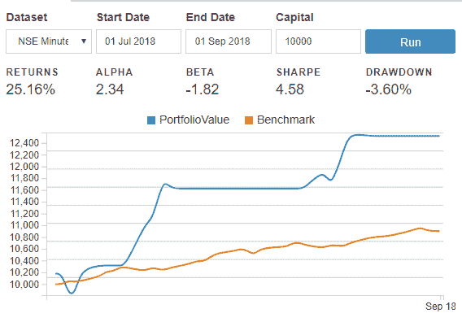
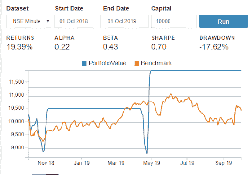
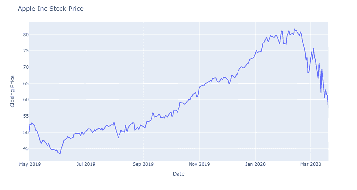
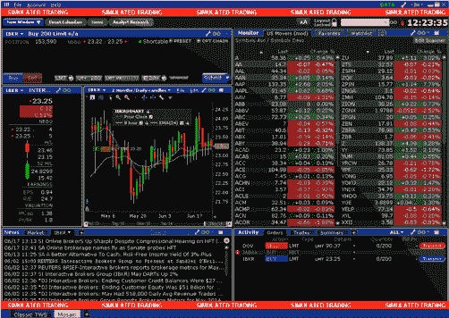
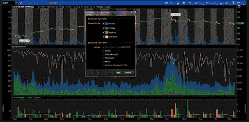
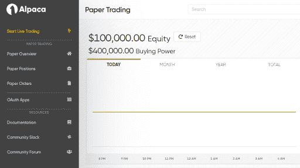
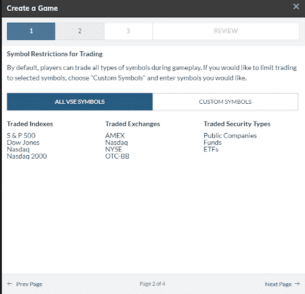
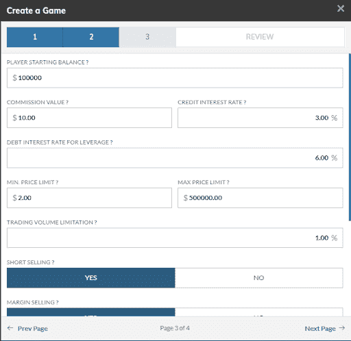
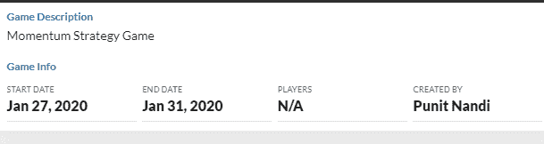

# 纸上交易——用虚拟货币交易！

> 原文：<https://blog.quantinsti.com/paper-trading/>

由[普尼特·南迪](https://www.linkedin.com/in/punit-nandi-bb46a5120/)和[雷希特·帕查内卡](https://www.linkedin.com/in/rekhit/)

金融市场通常是不可预测的，如果你没有做好足够的准备来应对不确定性，你将会损失很多钱！

嗯，有一种方法可以避免直接参与使用真实货币的现场交易，那就是通过虚拟货币。在这种情况下，虚拟货币是指不能在现实世界中交易，但可以用于进行纸面交易的货币。

票据交易是指那些可以在没有任何真实资金风险的情况下买卖证券的交易。使用虚拟货币进行纸上交易的整个机制被称为“纸上交易”

纸上交易对于想要学习如何在金融市场交易的初学者非常有帮助，对于想要测试他们的交易策略而不冒任何真钱风险的有经验的交易者也非常有帮助。

它不仅是一个学习实际交易的平台，也测试了当市场方向与最初的位置相反时处理情况的能力。

在这篇文章中，我们将介绍纸上交易的概念，以及在实际市场中部署策略之前，如何更好地测试你的策略！

下面是本文涉及的主题列表:

*   [市场微观结构简述](#brief-description-about-market-microstructure)
*   [回溯测试 vs 纸上交易](#backtesting-vs-paper-trading)
*   [为什么交易者要进行纸交易？](#why-do-traders-paper-trade)
*   [票据交易平台](#paper-trading-platforms)
*   [纸上交易游戏](#paper-trading-games)
*   [纸上交易心理](#psychology-of-paper-trading)

* * *

## 市场微观结构简述

当你开始交易时，有很多因素你必须考虑，否则它会妨碍整个策略，不管交易策略有多好！

下面列出的是利用纸上交易可以掌握的市场细微差别:

### 订单类型

市价订单是一种以市价或最后交易价格下单的订单。另一方面，限价单实质上意味着以固定价格下单。

如果你没有下市价单，而是下了限价单，很有可能交易永远不会执行，你所有的努力都将付之东流，因为当前的交易价格可能永远不会达到限价单的价格。

使用纸面交易，学习这种市场微观结构细微差别所需的技能可以提高，这在涉及真金白银风险的现场交易中显然是一个优势！

其他类型的交易订单包括:

*   取消前有效(GTC)，以及
*   立即或取消订单(国际奥委会)。

在 GTC，交易指令如果完成就会被执行，否则就会被取消。在 IoC 中，交易订单立即全部或部分执行。在 IoC 订单类型中，未履行或未执行的订单将被立即取消。

### 理论概念的应用

有多种策略可能看起来有利可图，并且在现实市场中实施起来非常合理，但实际上，它们的效果可能与最初的预期不同！

比如[期权策略](https://quantra.quantinsti.com/course/options-trading-strategies-python-basic):备兑买入和裸卖理论上差不多。然而，当我们在市场上实时交易时，策略的表现略有不同。

备兑买入策略包括持有标的资产，然而，裸卖空则没有。这就是为什么收益可能会大相径庭，导致盈亏平衡点的差异，即使两种策略都涉及以相同的执行价格和相同的当前市场价格出售期权。

要了解更多关于市场微观结构的信息，请查看这篇文章- [什么是市场微观结构？](/market-microstructure/)

在我们继续讨论纸上交易之前，让我们了解一下它与[回溯测试](/backtesting/)有什么不同。

* * *

## 回溯测试 vs 纸上交易

让我们来看看下面提到的一些差异:

### 过度拟合

每当你使用历史数据(即过去的 OHLCV 数据)测试一个新的交易策略时，使用的参数与要在实时市场中部署的参数相同，整个过程被称为回测。

但是，当我们测试交易策略时，有可能会过度拟合历史数据。过度拟合意味着你会以这样一种方式修改策略的参数，使得利润率看起来绝对完美和压倒性！

以下面提到的回溯测试结果为例。

回溯测试结果-2018 年 7 月 1 日至 2018 年 9 月 1 日

Backtesting results fig 1 Source: blueshift.quantinsti.com

回报图是一个配对交易策略，使用塔塔汽车和塔塔钢铁的印度股票，它们具有很高的相关价值，因为它们都是塔塔集团的一部分。实施策略的两个月历史数据给出了 25.16%的回报率。

然而，如果在 2018 年 9 月 1 日这一天，你会使用同样的策略，在下一年的市场中部署你的资本，回报结果会与你预期的有很大不同！

回溯测试结果-2018 年 10 月 1 日至 2019 年 10 月 1 日

Backtesting results fig 2 Source: blueshift.quantinsti.com

第一次回溯测试中 25.16%的不均衡回溯测试结果是因为塔塔钢铁有着强烈的积极情绪，鉴于其强劲的欧洲销售，塔塔钢铁第一季度的净利润率翻了一番。

另一方面，由于汽车销售数据下降，塔塔汽车公司受到了强烈的负面市场情绪的影响，而 Kerela 洪水的影响进一步削弱了塔塔汽车公司的股价。使用一个配对交易策略，价格预计将达到其平均价格水平，这一不寻常的净利润结果收到。

另一方面，在接下来的一年，价格实际上并没有远离平均价格，平均价格在第二个时间段仅产生 19.39%的回报。

使用模拟实时交易的纸上交易，无法以显示异常结果的方式使用价格数据，因为纸上交易使用的是不断流入而不是静态的实时数据。

### 修改参数

虽然回溯测试只涉及根据参数测试交易策略，并观察交易策略在真实市场中是否有效，但它并不真正涉及使用真实数据进行交易。

在纸上交易中，我们在实时数据上使用我们的策略，改变初始参数的余地很小。因此，你可以看到你设置的参数是否会产生预期的回报。

### 实时数据

纸面交易涉及使用实时数据在金融市场中部署交易策略。与历史价格数据不同，实时数据对人眼来说是一个惊喜，并且是一个在整个[交易日](https://quantra.quantinsti.com/course/day-trading-strategies)都无法控制或操纵的元素。

然而，在回溯测试中，回溯测试者已经看到了历史价格数据，因此缺乏惊喜的元素。现在，这种惊奇的元素和我们对市场数据的反应是一个好的交易者，一个伟大的交易者的要素！

### 滑点和佣金

滑点通常是指金融工具的执行价格和进场或出场信号价格之间的差额。虽然回溯测试在提供结果时不考虑滑点的发生，但纸交易提供了实时经验来了解滑点成本。

类似于滑点，佣金成本是另一种与交易执行相关的可变成本。尽管在对策略进行回溯测试之前，可以将佣金成本添加到历史价格中，但交易中包含的佣金成本和实际佣金成本之间仍有可能存在价差。

因此，纸上交易实际上有助于理解这些因素和克服这些微小的困难，而交易现场使用真正的现金！

但现在你可能会问，这些是不是纸贸易的唯一原因。下一节再来找几个原因吧。

* * *

## 为什么交易者要做纸交易？

### 建立信任

假设你已经对一个策略进行了回溯测试，它看起来棒极了。3 年内回报率超过 400%。50%的下降有点令人担忧，但 4 倍的回报足以让你说这是一个好策略。

但是你理性大脑的一小部分会问这是一个好策略吗？

我们能做点别的来建立你的信心吗？在这种情况下，纸上交易是完美的。你在实时数据上使用策略，但这不是你真正的钱。因此，你会明白这个策略在现实市场中是否有效，并获得将这个策略付诸实践的信心。

### 检查部署问题

纸上交易的另一个好处是，你会了解你的订单是如何完成的，是否有滑点。此外，您将了解交易平台及其运作方式。

这里的任何错误都可以被识别出来并加以解决，这样你就可以在真实的市场中毫无障碍地部署策略。

### 该战略的表现是否符合预期？

在票据交易环境中，在三个月的时间内，年回报率为 40%的策略表现是否符合预期？

在纸上交易中，你可以跟踪交易，检查策略表现是否符合回溯测试结果。

### 了解你自己

而票据交易可以帮助你理解市场。它还能帮助你理解自己。您知道恐惧和贪婪会驱动您的决策过程，应该加以控制。让我们举个例子。

Paper Trading - Apple Inc Stock Price fig 1

这是苹果的价格图。或者更确切地说，是苹果的拆分调整价格图。假设你在 2019 年 5 月以 50 美元投资了苹果。当它突破 80 美元时，你会大吃一惊。

但是由于新冠肺炎疫情，价格在 2020 年 2 月开始下跌。短短几周内从 80 美元暴跌到 56 美元。在这种情况下，很难保住你的位置。

Paper Trading - Apple Inc Stock Price fig 2

当然，苹果的价格不仅反弹，而且在 2021 年触及 140 美元。这个例子说明，当你的真金白银岌岌可危时，你很难继续持有急剧下跌的头寸。

现在让我们来看几个纸媒交易平台。

* * *

## 纸张交易平台

论文交易平台要么是科技公司，要么是网络经纪人。它们或者以虚拟游戏的形式提供纸面交易，或者以一般方式提供纸面交易账户，作为对真实交易账户的补充。

在线票据交易经纪平台之间的主要区别在于它们向交易者提供的经验和它们提供的设施。让我们来看看是什么造成了这种差异:

### 互动经纪人

互动经纪人(IB)有一个奇妙的纸交易平台，开始与您的虚拟交易体验。它拥有从实时图表、技术分析工具、期权定价分析等所有工具。

任何人都可以从 1，000，000 美元的虚拟现金开始，并选择在任何时间重置现金权益头寸。IB 的关键区别在于其简单的市场新闻和数据平台，以及出色的交易执行成功率。

但是，也有某些[限制](https://www.interactivebrokers.com/en/software/am/am/manageaccount/paper_trading_limitations.htm)比如某些策略的不执行，比如——[VWAP](/vwap-strategy/)。此外，它仅提供 1 级数据，即针对纸面交易的有限订单簿数据，以及取决于资产类别的 10-15 分钟的市场滞后。然而，交互式经纪人的最大优势是它为你的策略自动化提供了支持。

人们可以使用交互式代理很容易地自动化策略。

Paper Trading platform - Interactive Brokers (Source - interactivebrokers.com)

### TD Ameritrade

TD Ameritrade 的纸币也是一个非常有效的网上证券交易平台。它也是以 1，000，000 美元的账户开始，并且与 IB 不同，它执行大多数策略类型。

TD Ameritrade 的问题是，它不允许来自每个国家的客户在他们那里开户。然而，与其他经纪公司相比，它有很多与众不同的地方。

它有一个社会情绪指标，提到了交易者对特定交易资产的情绪。下图描绘了同一个[情绪指标](https://quantra.quantinsti.com/course/trading-using-options-sentiment-indicators)。

Paper Trading platform - TD Ameritrade (Source - tdameritrade.com)

### 羊驼

羊驼是一个著名的平台，自动化您的文件交易策略。它使用 IEX 的数据(IEX 是美国市场的交易所之一)。它使用两个 API 进行交易，一个作为你的 ID，另一个作为密钥。

有趣的是，羊驼为 100，000.00 美元的初始现金提供了 4 倍的杠杆，因此交易者可以使用所提供的杠杆练习保证金交易。

除了 algo 票据交易平台，它还与 Tradingview.com 合作提供手动交易，以获得多样化的票据交易体验。它支持 python、C#、Go 和 Node 等编程语言。

Paper Trading platform - Alpaca (Source - alpaca.markets)

### 贸易站

Tradestation 是另一个向用户提供模拟或纸质交易体验的在线经纪人。这里的关键区别在于它有两个市场数据类别:实时数据和延迟数据。

对于实时数据，它收取最低费用，对于延迟数据，费用为零。此外，在您开立实时交易账户之前，您不能开立纸质交易账户，实时交易账户的最低开户费用为 5000 美元。

### ICICI Direct

如果你想在印度市场开始票据交易，使用 ICICI Direct 是个不错的选择。在这里，资产类别不仅限于股票，还包括衍生品。不过，该平台截至目前还不支持自动化交易。

* * *

## 纸上交易游戏

顾名思义，纸上交易游戏是纸上交易的另一种方式，由经纪人提供模拟游戏体验平台，使新手交易者的纸上交易更加刺激和有竞争力。

下面列出了一些最著名的纸上交易游戏平台及其各自的细微差别:

### 莫尼巴伊

moneycontrol.com 的 Moneybhai 有一个纸交易游戏平台，他们要求游戏的每个参与者都要遵守一套规则来玩纸交易游戏。

他们为每个参与者提供 1 亿卢比的虚拟现金，如果你持有日内头寸，需要结清这些现金。简单地说，如果你是日内交易，你需要清算你的多头和空头头寸。

这是参与者需要遵守的规则之一。你可以在这里查看其他规则[。](https://moneybhai.moneycontrol.com/moneybhai-rules.html)

### 市场观察

说到纸交易游戏，Market watch(道琼斯公司的子公司)是一个开始竞争性纸交易的绝佳平台。这个想法很简单，你需要创建一个游戏或者参与一个已经创建的游戏。

我们试图在下面的图片中演示如何创建一个游戏:

Paper Trading game - Market Watch fig 1

Paper Trading game - Market Watch fig 2

Paper Trading game - Market Watch fig 3

Paper Trading game - Market Watch fig 4

Paper Trading game - Market Watch fig 5

* * *

## 票据交易心理学

电影《华尔街之狼》中有一句名言“是生意，把情绪留在门口”。虽然这句话指出了金融市场中存在的永恒真理，但交易者更经常在现场交易中陷入情绪化。

虽然纸上交易为预先测试交易策略提供了一个很好的平台，但是新手在交易之前应该记住以下几点:

### 虚拟贸易思维

既然纸媒交易是一个使用虚拟货币进行交易的平台。在交易者的头脑中会有一个心理障碍:

*   他/她正在使用虚拟货币
*   因此，无论采取何种立场，损失真钱的可能性为零。

因此，与其说是利用这个平台来提升交易技巧，不如说是变成了一个做多做空的平台，没有服务于它的真正目的。

所以，你必须时刻牢记，即使纸上交易用的是虚拟货币，交易时的认真对于提取内在价值也是极其重要的。你应该总是认为这是你真正的钱。

### 决策

根据虚拟交易思维的观点，扩大资本规模的问题在票据交易中非常普遍。

例如，在实时市场中，当股票价格的方向与初始[交易的头寸](https://quantra.quantinsti.com/course/position-sizing-trading)相反时，交易者通常会在向初始头寸投入更多资金之前进行多次思考。

然而，由于纸上交易使用虚拟货币，新手交易者可以进一步购买/出售相同的股票，以补充初始头寸。这就造成了纸面交易和现场交易的巨大区别。

这使得我们必须意识到，交易是基于艰难的决定，而纸上交易的平台应该被明智地用来灌输这种技能。

### 创办资本

虽然风险是在市场交易中亏损的可能性，但这一心理参数在交易者中非常普遍。恐惧和贪婪是市场情绪的主要组成部分，市场情绪现在和将来都将存在于金融市场中。

当交易者使用票据交易平台时，应该考虑承认市场相关风险的心态。你的资本应该等于你在真实市场中投入的资本。

如果你计划投资 10000 美元，那么在你的纸上交易账户里有 100 万美元是没有意义的。

### 建立一个现实的投资组合

在你的第一笔纸上交易中购买 1000 股苹果股票是很容易的。然而，在现实中，你很少有机会在第一笔交易中用真钱做 1000 股苹果股票的多头头寸。因此，建立一个类似于你用真钱建立的投资组合。

### 风险管理技术

纸上交易的目的是学习金融市场中的风险缓解技术。使用风险管理技术，你可以很容易地遏制你的损失，这可能会妨碍你在一个糟糕的交易日的利润。

市场因素对交易者的利润率有很大的影响。例如，止损或止盈的概念可能在理论上看起来非常有利可图和完美，但是，当我们试图设置止损或止盈参数时，有多个因素需要考虑。

这可能是止损值，跟踪止损值，甚至是止损利润。一旦我们在市场上交易，如果标的资产的价格按照我们的预测移动，我们倾向于根据情况增加或减少止损。

这种增加或减少止损和获利参数的动态机制对于交易者来说是非常重要的技能，可以通过纸上交易来优化。

### 了解市场情绪

与现场交易类似，资产价格根据票据交易中的市场事件而变动。例如:一般来说，每当一家公司宣布收益时，市场通常会波动。

新手交易者可以在了解市场情绪后建仓，并在此基础上进行交易。即使市场没有朝着预期的方向发展，他/她也可以了解新闻对市场的实际影响。

在一段时间内的这种经历给了在实时市场中建仓的强大心理阻力。整个过程培养了交易者的信心，让他在逻辑分析了当时的整体情况后，制定并执行策略。

### 定期检查指标

为了从纸上交易中获得最大收益，你应该定期检查你的策略的表现。这将有助于您了解它的性能，并给你上线的信心。或者关闭一切。

### 纪律，学科

虽然交易感觉像一场战斗，但成功的关键始终是在困难的情况下保持紧张。交易纪律只能通过实践和一套聪明的规则来建立。

例如:将止损设置在当前水平的 2%以下或在当前市场水平的 2%以上获利很容易，但是当资产价格下降或上升到止损或获利水平时，交易者可能会改变保证金以减少损失或赚取更多利润。

因此，为了处理像例子中提到的那种情况，一个人应该自律，保持情绪中立。这个习惯是多年养成的，所以金融市场上的任何人都可以用纸上交易来建立交易纪律。

### 强化学习

当在金融市场使用虚拟货币交易时，人们确实会在采取不正确的头寸或头寸的不正确的交易订单大小甚至头寸的时机方面犯错误。

这些错误有助于更好地理解市场，以及市场在不同情况下的反应。因此，在测试新策略时，甚至在测试修改后的策略后，纸上交易对交易者来说是一个强化的学习平台。

如果你想了解如何在纸上交易环境中运用策略，请查看网上研讨会的完整记录- [纸上交易如何让你成为更好的交易者](https://youtu.be/URRA8jRLT0M)

* * *

## **结论**

纸上交易是一个很好的平台来测试你在现实市场中的交易策略，在历史数据上对策略进行回溯测试后，不需要使用真正的现金。

正如文章中提到的，有几个经纪人平台可以测试你的策略。我会建议你检查所有提到的经纪人平台，找到最适合你的需求的平台。

此外，如前所述，纸上交易需要一个人有正确的交易道德，以尽可能最好的方式模拟现场交易。

在由 Interactive Brokers 和 Quantra-[Automated Trading with IBridgePy 使用 Interactive Brokers Platform](https://quantra.quantinsti.com/course/Automated-Trading-IBridgePY-Interactive-Brokers-Platform) 提供的本课程中，您的第一步是使用 Python 自动执行交易策略。

如果你计划从业内最好的人那里学习结构化的算法交易，EPAT 是最适合你的课程。EPAT 是 QuantInsti 的[算法交易课程](https://www.quantinsti.com/epat)，被广泛认为是学习量化交易的课程之一。

* * *

<small>*免责声明:股票市场的所有投资和交易都涉及风险。在金融市场进行交易的任何决定，包括股票或期权或其他金融工具的交易，都是个人决定，只能在彻底研究后做出，包括个人风险和财务评估以及在您认为必要的范围内寻求专业帮助。本文提到的交易策略或相关信息仅供参考。*T3】</small>