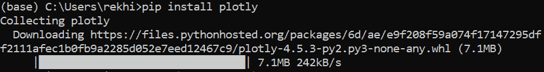
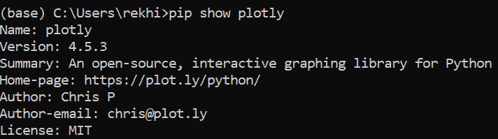

# plotly Python——交互式数据可视化

> 原文：<https://blog.quantinsti.com/plotly-python/>

由[雷希特](https://www.linkedin.com/in/rekhit/)帕查内卡和[沙克蒂普拉萨德](https://www.linkedin.com/in/shaktishimpi/)希姆皮

在深入 Plotly Python 的细节之前，让我问你一个问题。如果你必须去某个地方，你会选择以下哪一个:

1.  您的亲戚告诉您直行 15 公里，然后在第六大道左转，然后右转，再稍微左转，行驶 10 分钟即可到达目的地
2.  突出显示路线的地图。

显然，我们更喜欢地图，因为它更容易参考。同样，我们更喜欢条形图和曲线图，而不是表格，这样可以更好地比较不同的实体。Plotly Python 就是这么做的！

Plotly Python 是一个以交互方式帮助数据可视化的库。但是你可能想知道为什么我们需要 Plotly，因为我们已经有 matplotlib 做同样的事情。Plotly 的创建是为了让数据更有意义，它拥有交互式图表和绘图，这些图表和绘图也可以在线创建。我们可以在线可视化数据的事实消除了很多与离线使用图书馆相关的障碍。然而，Plotly 既可以用作离线工具，也可以用作在线工具，从而为我们提供了两个世界的最佳选择。

让我们在这篇博客中看到 Plotly 的不同方面。涵盖的主题如下:

*   [简介](#Introduction)
*   [如何在 Python 中安装 Plotly](#Install-Plotly)
*   [在线与离线使用](#Online-Offline-Usage)
*   [渲染为 HTML 文件或在笔记本中](#Render-HTML-Notebook)
*   [OHLC 图表](#OHLC-Chart)
*   [散点图](#Scatter-Plot)
*   [折线图使用 Plotly Express](#Line-Chart)
*   [直方图](#Histogram)
*   [等高线图](#Contour-Charts)
*   [三维散点图](#Scatter-Plot-3D)

如果你浏览一下 Plotly 公司的发展目标，你会发现它大致可以分为三个部分:

*   为了使可视化数据更具交互性和直观性
*   为了使库的绘图功能在在线环境中也可用
*   真正让数据科学工具开源，让每个人都可以使用。

事实上，使用 plotly 创建的图表有一个独特的功能，当您将鼠标悬停在图表上的单个元素上时，与该数字相关的数字就会出现。

[//plot.ly/~Quantra_Content/5.embed](//plot.ly/~Quantra_Content/5.embed)

根据其官方网站的说法，Plotly 支持超过 40 种图表类型，甚至可以用于三维用例。考虑到 Python 的协作环境，该库背后的公司保持了该库的开源和免费，以便它可以对所有人有益。

plotly python 库由以下包组成:

*   plotly:这是包含所有功能的主包
*   这个包包含了用于可视化的对象或者图形模板
*   matplotllib:关于 plotly 有趣的事情是它也支持 matplotlib 数字

现在让我们首先安装它，开始我们在 plotly 世界的旅程。

Python 的伟大之处在于，我们可以使用‘pip’命令轻松安装大多数包。因此，python 代码如下:

```py
pip install plotly
```

您可以在 Anaconda 终端中使用它，如下所示:

<figure class="kg-card kg-image-card kg-width-full"></figure>

如果你想检查 plotly 安装的版本，你可以使用下面的命令

```py
pip show plotly
```

您将看到如下所示的输出:

<figure class="kg-card kg-image-card kg-width-full"></figure>

Plotly 还包含一个“快速”特性，使得创建图形和对象更加容易。

最初，plotly 的创建者为 plotly 包的用户提供了在线和离线功能，但这导致了图形如何渲染的混乱。因此，从版本 4 开始，创建者使用离线功能作为默认，并将在线功能捆绑在一个名为“chart-studio”的新包中。

我们将关注这个博客的离线版本。有两种方法可以使用 Plotly Python 的离线绘图。让我们现在看看他们

我们首先来看看如何将这些图作为一个单独的 html 文件使用。

### 创建 HTML 文件(plotly.offline.plot)

我们使用 plotly.offline.plot()创建一个独立的绘图或图表 HTML 文件。这个 html 文件可以在任何 web 浏览器中保存和呈现。

下面给出了一个带有 x 轴和 y 轴元素的图形的示例代码: