# 使用 Python 的投资组合分配和配对交易策略

> 原文：<https://blog.quantinsti.com/portfolio-allocation-pair-trading-strategy-python-project-ravindra-rawat/>

学习使用夏普比率、索蒂诺比率和卡尔玛比率，对投资组合分配策略和配对交易策略进行比较分析。

本项目中使用的完整数据文件和 python 代码可以在本文末尾下载。

本文是作者提交的最后一个项目，作为他在 QuantInsti 的算法交易管理课程( [EPAT](https://www.quantinsti.com/epat) )的一部分。请务必查看我们的[项目页面](https://www.quantinsti.com/category/project-work-epat/)，看看我们的学生正在构建什么。

* * *

## 关于作者

Ravindra Singh Rawat 拥有 NMIMS 大学的电子和电信工程学士学位。此前，他曾与 Talerang(一家在哈佛孵化的公司)和 QuantInsti 合作。他对分析金融数据有着浓厚的兴趣，并渴望在金融市场上有所作为。

* * *

## 项目摘要

该项目的目的是比较投资组合分配策略和配对交易策略。

该项目的范围是印度股票市场。我们的目的是使用 Sharpe、Sortino 和 Calmar 比率进行比较分析。

*   在上述假设下，发现分配对以下部门更有效:医药和金融服务篮子。
*   配对交易似乎是以下行业的更好选择:科技、汽车和私人银行。

建议将 Sharpe 比率指标与 Sortino 和 Calmar 比率指标一起使用，因为后两个比率考虑了与特定策略相关的下行风险和缩减。

* * *

## 比率的简要历史

夏普比率是在威廉·夏普于 1966 年提出的。它衡量投资(如证券或投资组合)在调整风险后与无风险资产相比的表现。

对夏普比率的一个关键批评是，它在估计尾部风险方面表现不佳；假设正态分布，因此它不能区分正交易和负交易。

这就产生了**后现代投资组合理论**。后现代投资组合理论(PMPT)是一种投资组合优化方法，它使用收益的下行风险，而不是现代投资组合理论(MPT)使用的投资收益的均值方差，即索蒂诺比率。

PMPT 与现代投资组合理论(MPT)形成对比；这两个理论都详细说明了风险资产应该如何估值，同时强调多样化的好处，不同之处在于它们如何定义风险及其对回报的影响。

两位软件设计师 Brian M. Rom 和 Kathleen Ferguson 在 1991 年创建了 PMPT，当时他们认为使用 MPT 的软件设计存在缺陷。

1991 年也提高了卡尔马尔比率。它由特里·w·杨(Terry W. Young)创建，首次发表在名为“*期货*”的贸易杂志上。杨在加州圣伊内斯拥有一家名为 California Managed Accounts 的公司，该公司管理客户资金并出版时事通讯 *CMA Reports* 。他的比率名称“Calmar”是他的公司名称和他的简讯的首字母缩写:

> 加州(美国)加州 **M** 管理 **A** 账户 **R** 报告

杨这样定义它:

“卡尔马尔比率是过去 36 个月的平均年回报率除以过去 36 个月的最大提取额。是按月计算的。”

Young 认为 Calmar 比率更优越，因为:

Calmar 比率逐渐变化，比 Sharpe 比率更容易平滑 CTA(商品交易顾问)业绩的超额完成和未完成时期。

* * *

## 思维能力

我第一次碰到“蒙特卡洛模拟”这个词是在我读纳西姆·尼古拉斯·塔勒布的《被随机性愚弄》这本书的时候。我发现运行多个模拟的想法非常有趣。

当我在 EPAT 会议期间学习配对交易策略时，我心想，为什么不创建一个项目，将投资组合分配(基于蒙特卡罗模拟)策略与配对交易策略进行比较。就在那时，我有了我的项目想法。

* * *

## 项目描述

我的想法很简单:*我想比较投资组合分配策略和配对交易(使用均值回归)策略。*

事实上，我在两种策略中都使用了三联体，即 3 只股票，而不是一对股票。我将根据以下比率来比较上述策略的有效性:

*   夏普
*   索尔蒂诺
*   卡尔马尔

### 夏普比率

它是比较回报(投资回报)和风险(标准差)的比率。这使得我们可以根据为实现投资而承担的风险来调整投资回报。

这由以下公式给出:

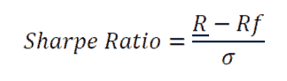

*   𝑅 -有问题的资产的年预期收益。
*   𝑅𝑓 -年无风险利率。把这想象成银行里的存款，每年赚取 x%。
*   𝜎 -回报率的年化标准差

### Sortino 比率

索提诺比率与夏普比率非常相似，唯一的区别是夏普比率使用所有的观察值来计算标准差，而索提诺比率只考虑负方差。

这样做的理由是，我们不太担心正偏差，然而，负偏差是非常令人担忧的，因为它们代表了我们的金钱损失。这由以下公式给出:

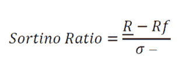

*   <u>R</u> -相关资产的年预期回报。
*   𝑅𝑓 -年无风险利率。
*   𝜎 -回报率的年化下行标准差

### 卡尔马尔比率

这与其他比率类似，主要区别在于 Calmar 比率使用分母中的最大下降，而不是标准差。

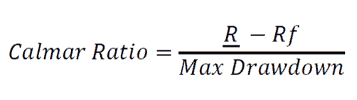

*   <u>R</u> -相关资产的年预期回报。
*   𝑅𝑓 -年无风险利率。

在我的项目中，我认为所有比率的 Rf 都是 0。

我从雅虎财经网站上收集数据。这些数据与印度股票市场的股票有关。库存数据的日期为 2017 年 5 月 29 日至 2020 年 6 月 30 日。我比较的行业有技术、金融(私人银行)、金融(金融服务)、汽车和制药。从每个板块中，我随机选择了 3 只股票。

* * *

## 投资组合配置策略方法

首先，我计算了夏普比率。程序如下:

*   我从雅虎财经导入了相关的股票数据。
*   然后，我使用 pct_change()方法计算调整后收盘价的回报。
*   之后，我计算了收益的平均值和协方差矩阵。协方差矩阵告诉我们两只股票的运动之间的关系。
*   为了运行模拟，我首先必须创建一个矩阵。因为我计划运行 10000 次模拟，所以我将行数初始化为 10000。在上述矩阵中，我想显示平均收益、标准差、夏普比率和 3 只股票。因此，矩阵的数量级为 10000×6
*   3 个“股票”栏将显示它们在投资组合中各自的权重。这个想法是随机化投资组合中股票的权重(权重在“for 循环”中分配)。
*   最初，矩阵中的所有值都显示为零，因为没有值提供给矩阵。
*   主要计算发生在“for 循环”内部。
*   投资组合回报计算如下:

**其中 252 是一年中的交易天数**

*   **投资组合标准差计算如下:**

****)****

**投资组合标准差是权重的点积以及协方差矩阵和权重的点积的平方根。**

*   **然后我们用投资组合收益率除以投资组合标准差来计算夏普比率。**

****𝑆ℎ𝑎𝑟𝑝𝑒𝑟𝑎𝑡𝑖𝑜=𝑃𝑜𝑟𝑡𝑓𝑜𝑙𝑖𝑜𝑟𝑒𝑡𝑢𝑟𝑛/𝑃𝑜𝑟𝑡𝑓𝑜𝑙𝑖𝑜𝑆𝑡𝑎𝑛𝑑𝑎𝑟𝑑𝑑𝑒𝑣𝑖𝑎𝑡𝑖𝑜𝑛****

*   **然后，我们用所需的值填充“零”矩阵。**
*   **我们的目标是找到以下投资组合:一个具有最大的夏普比率，另一个具有最小的标准差。**
*   **为此，我们使用 pandas 的“iloc”功能来定位以下行。**
*   **“iloc”功能与“idxmax”和“idxmin”功能结合使用，分别计算具有最大夏普比率和最小标准差的投资组合。**
*   **最后，我们使用 matplotlib 库绘制了我们的结果。**

* * *

## **计算排序比的程序**

*   **该过程类似于计算夏普比率。不同之处在于 for 循环，即循环内部的计算**
*   **首先，我计算了每日投资组合回报**
*   **然后我计算了投资组合回报的平均值(使用 mean()方法)并乘以 252，以便按年计算回报。**
*   **为了计算下行标准差，我只考虑了那些负的投资组合收益(使用 np.where 方法作为过滤器)。使用 std()方法计算标准偏差。**
*   **之后，我计算排序比:**

****𝑆𝑜𝑟𝑡𝑖𝑛𝑜𝑅𝑎𝑡𝑖𝑜=𝐴𝑛𝑛𝑢𝑎𝑙𝑖𝑠𝑒𝑑𝑃𝑜𝑟𝑡𝑓𝑜𝑙𝑖𝑜𝑟𝑒𝑡𝑢𝑟𝑛/𝐷𝑜𝑤𝑛𝑠𝑖𝑑𝑒𝑆𝑡𝑎𝑛𝑑𝑎𝑟𝑑𝑑𝑒𝑣𝑖𝑎𝑡𝑖𝑜𝑛****

*   **在使用“iloc”功能后，正如我在计算夏普比率时所做的那样，我使用 matplotlib 库绘制了结果。**

* * *

## **计算卡尔马尔比率的程序**

*   **该过程类似于计算夏普比率。不同之处在于 for 循环，即循环内部的计算**
*   **首先，我计算了每日投资组合回报**
*   **之后，我创建了一个名为最大下降的函数。该函数用于计算水位下降，如下所示:**

****𝐷𝑟𝑎𝑤𝑑𝑜𝑤𝑛= 1−(𝑃𝑜𝑟𝑡𝑓𝑜𝑙𝑖𝑜 𝑟𝑒𝑡𝑢𝑟𝑛.𝑅𝑢𝑛𝑛𝑖𝑛𝑔 𝑀𝑎𝑥)****

*   **投资组合回报可以被认为是权益，而运行最大值可以被认为是最高提取权益。运行最大值总是大于或等于投资组合回报。**
*   **之后，我使用 max()函数计算了最大下降量**
*   **完成后，我开始计算卡尔马尔比率，如下所示:**

****𝐶𝑎𝑙𝑚𝑎𝑟𝑟𝑎𝑡𝑖𝑜=𝑃𝑜𝑟𝑡𝑓𝑜𝑙𝑖𝑜𝑟𝑒𝑡𝑢𝑟𝑛/𝑀𝑎𝑥𝑖𝑚𝑢𝑚𝐷𝑟𝑎𝑤𝑑𝑜𝑤𝑛****

*   **在使用“iloc”功能后，正如我在计算夏普比率时所做的那样，我使用 matplotlib 库绘制了结果。**

* * *

## **配对交易策略的步骤**

**起初，我从雅虎财经导入数据。**

*   **与投资组合配置策略不同，我只对价格系列感兴趣。因此，我只导入了调整后的收盘系列，没有计算回报。**

**之后，我使用 plot()方法绘制了这个系列。**

*   **现在我们进入配对交易策略的本质。我从计算对冲比率开始。**
*   **套期保值比率告诉我们，为了保持均值回复，我们必须买入/卖出的股票数量。
    举个例子，我买了 X 的股票，Y 的对冲比率是 1.29，Z 的对冲比率是-2.29。这意味着，当我买入一股 X 时，我需要卖出 1.29 股 Y，买入 2.29 股 Z，这样策略才能保持均值回复。**

**然后我计算了策略的传播。价差是多头和空头之间的差额。**

**然后我绘制了价差图。**

*   **对于配对交易策略，价差必须是固定的。为了检验这一点，我们执行了一个称为 ADF 测试的统计测试。**
*   **为了满足 ADF 测试，ADF 索引 0 处的 P 值 i.eADF[0]必须小于 ADF 索引 4 处的 P 值，即 ADF[4]。**

**之后，我创建了一个名为“stat_arb”的函数，输入的值是调整后的收盘价、回望期和标准差。**

*   **创建“stat_arb”是为了让我能够为配对交易策略生成信号。这些信号是使用布林线生成的。布林线由 3 条线组成:均线，下轨和上轨。**
*   **在函数内部，我计算了移动平均值和移动标准差。回看被用作滚动窗口的值。**

**然后，我计算了高频带和低频带:**

****上限=移动平均线+标准差*移动标准差****

****下带=移动平均-标准差*移动标准差****

**然后我创建了多头和空头的进场和出场位置。**

*   **多头进场是指价差小于低波段。**
*   **当价差大于或等于移动平均线时，就是多头出场。**
*   **当价差大于上限时，可以做空。**
*   **当价差小于或等于移动平均线时，可以做空。**
*   **出口用 0 表示。长条目用 1 表示，短条目用-1 表示。**
*   **净头寸是多头和空头头寸的总和。**

**然后我计算价差，这样我就可以计算 pnl。价差是今天的价差-前一天的价差。pnl 是价差乘以净头寸。净头寸移动 1，即前一天，以避免前瞻偏差。**

**之后，我计算了累计 pnl。计算 Sharpe、Sortino 和 Calmar 比率需要策略回报。为了计算策略回报，我首先需要计算利差的百分比变化。**

******净头寸移动一天，以避免前瞻偏差。******

******然后我计算了策略回报的累积积(累积回报)，并绘制在图表上。在另一个单元格中，我用******

******然后，我继续计算下降(需要计算卡尔马尔比率)。******

********1(𝐶𝑢𝑚𝑢𝑙𝑎𝑡𝑖𝑣𝑒𝑟𝑒𝑡𝑢𝑟𝑛𝑠/𝑅𝑢𝑛𝑛𝑖𝑛𝑔𝑀𝑎𝑥)********

****累积回报可以被认为是权益，运行最大值可以被认为是峰值权益。运行最大值总是大于或等于累计回报。****

****然后我画出下降曲线。****

****之后，我开始计算夏普、索蒂诺和卡尔马尔比率。****

******∞252)******

******∞252)******

*   ****为了计算 Calmar 比率，我需要平均年回报率和最大提取额。****
*   ****为了计算平均年回报，我需要累积回报的最后值和年份。****
*   ****为了计算年数，我需要计算年数，然后除以 252，即交易日数。****

******𝐴𝑣𝑒𝑟𝑎𝑔𝑒𝑎𝑛𝑛𝑢𝑎𝑙𝑟𝑒𝑡𝑢𝑟𝑛=(𝐹𝑖𝑛𝑎𝑙𝑣𝑎𝑙𝑢𝑒𝑜𝑓𝐶𝑢𝑚𝑢𝑙𝑎𝑡𝑖𝑣𝑒𝑟𝑒𝑡𝑢𝑟𝑛)1/𝑦𝑒𝑎𝑟𝑠−1******

******𝐶𝑎𝑙𝑚𝑎𝑟𝑟𝑎𝑡𝑖𝑜=𝐴𝑣𝑒𝑟𝑎𝑔𝑒𝑎𝑛𝑛𝑢𝑎𝑙𝑟𝑒𝑡𝑢𝑟𝑛/𝑀𝑎𝑥𝑖𝑚𝑢𝑚𝑑𝑟𝑎𝑤𝑑𝑜𝑤𝑛******

****另外，我还计算了一个资产负债表来生成上述比率。Pyfolio 是检查生成的比率是否正确的好方法。****

* * *

## ****结果****

****在这里，我收集了部门方面的结果。****

******图 1a:为技术篮子计算的比率******

| **技术** | 夏普 | 外出 | **卡尔马尔** |
| 配对交易策略 | One point two one | One point five three | One point two two |
| 投资组合分配策略 | Zero point eight nine nine | One point two one seven | Zero point eight six two |

******图 1b:为汽车篮子计算的比率******

| **汽车** | 夏普 | 外出 | **卡尔马尔** |
| 配对交易策略 | Zero point two one | Zero point two five | Zero point one |
| 投资组合分配策略 | -0.0039 | -0.00538 | -0.0007 |

 ******图 1c:为金融(私人银行)篮子计算的比率**

| **金融** **(私人银行)** | 夏普 | 外出 | **卡尔马尔** |
| 配对交易策略 | One point seven two | Two point seven four | Two point one three |
| 投资组合分配策略 | Zero point five five nine | Zero point six six one | 0.4243 |

**图 1d:为金融(金融服务)篮子计算的比率**

| **金融(金融服务)** | 夏普 | 外出 | **卡尔马尔** |
| 配对交易策略 | -0.3 | -0.38 | -0.21 |
| 投资组合分配策略 | One point one three one | One point six four | One point zero zero six |

**图 1e:为药品篮子计算的比率**

| **药品** | 夏普 | 外出 | **卡尔马尔** |
| 配对交易策略 | -0.38 | -0.42 | -0.22 |
| 投资组合分配策略 | One point five five eight | Two point five zero two | One point six nine |

* * *

## 数字和图表

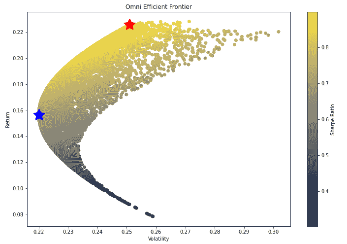

Figure A1: Scatter plot of Sharpe Ratio for the technology basket. Note that for all scatter plots, the red star represents the highest risk-adjusted return. The blue star represents the return with the least volatility.

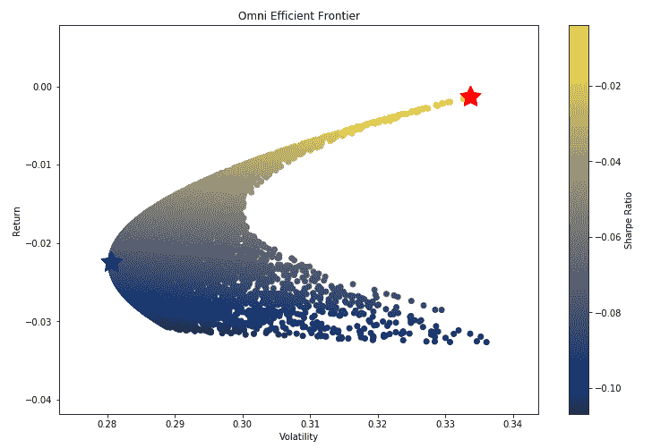

Figure A2: Scatter plot of Sharpe Ratio for the Automobile basket.

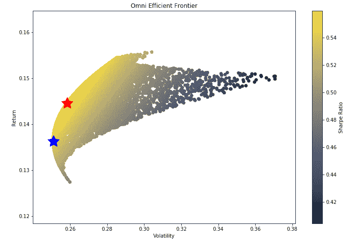

Figure A3: Scatter plot of the Sharpe ratio for the Private Banks basket

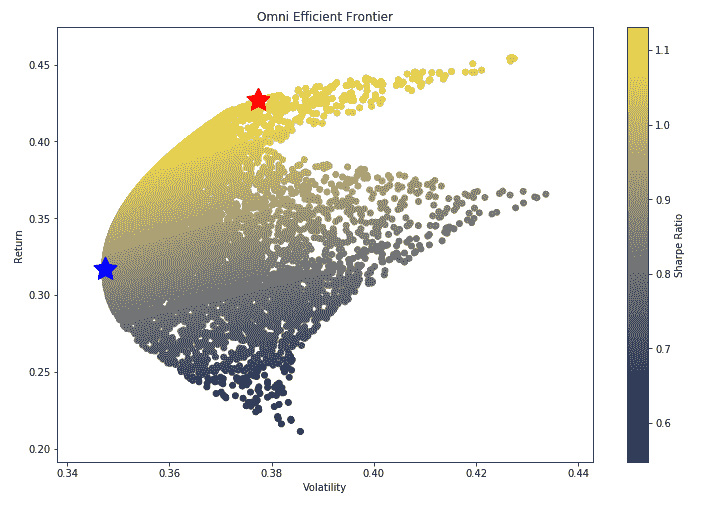

Figure A4: Scatter plot of the Sharpe Ratio for the Financial Services basket.

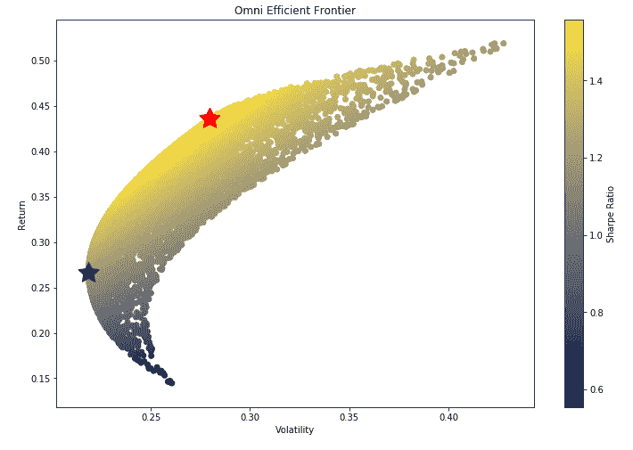

Figure A5: Scatter plot of the Sharpe Ratio for the Pharmaceuticals basket.

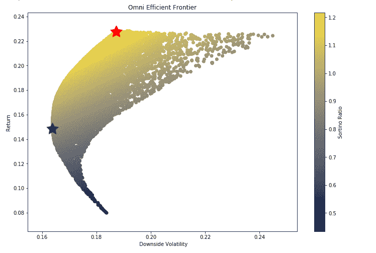

Figure B1: Scatter plot of the Sortino ratio for the Technology basket

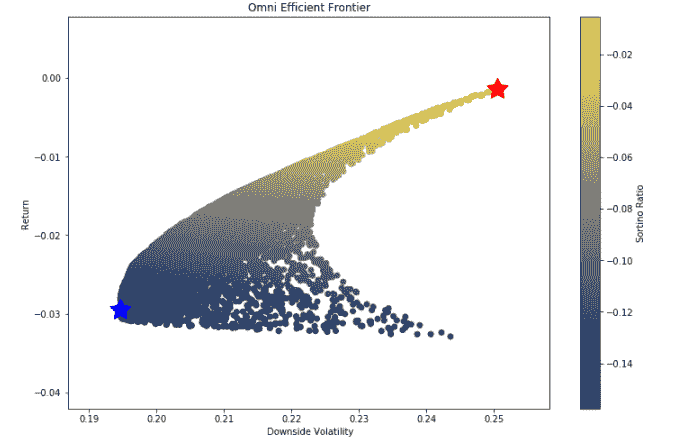

Figure B2: Scatter plot of the Sortino Ratio for the Automobile basket

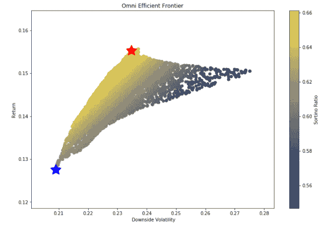

Figure B3: Scatter plot of the Sortino Ratio for the Private Banks basket

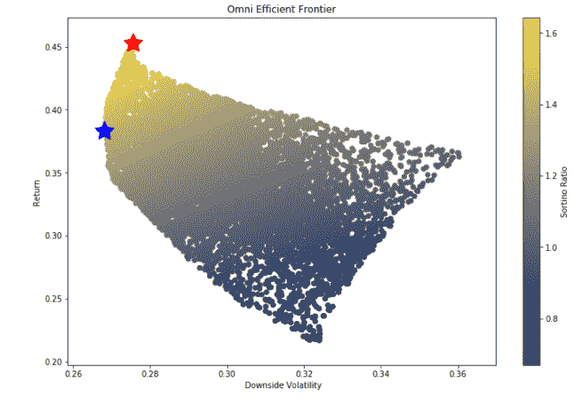

Figure B4: Scatter plot of the Sortino Ratio for the Financial Services basket

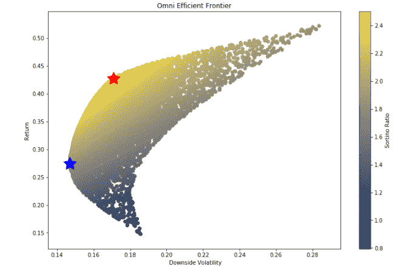

Figure B5: Scatter plot of the Sortino Ratio for the Pharmaceutical basket

Figure C1: Scatter plot of the Calmar ratio for the Technology basket

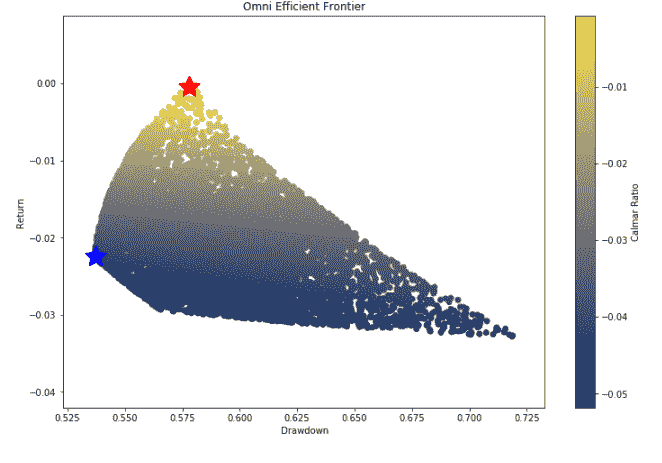

Figure C2: Scatter plot of the Calmar ratio for the Automobile basket

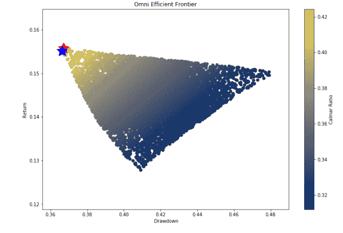

Figure C3: Scatter plot of the Calmar Ratio for the Private Banks basket

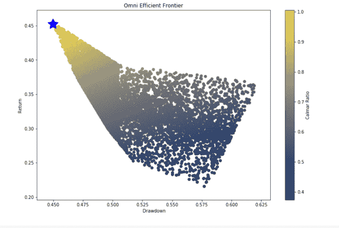

Figure C4: Scatter plot of the Calmar ratio of the Financial Services basket

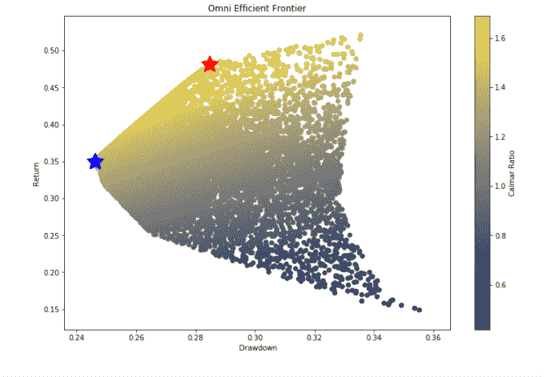

Figure C5: Scatter plot of the Calmar ratio of the Pharmaceutical basket

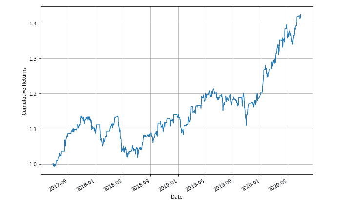

Figure D1: Cumulative returns for the Pair trading strategy in the Technology basket.

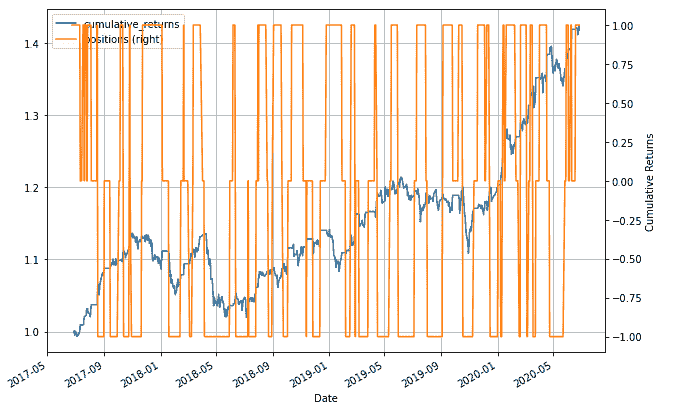

Figure D2: Cumulative returns and the Positions plotted alongside each other on the y-axis, for the Pair trading strategy in the Technology basket.

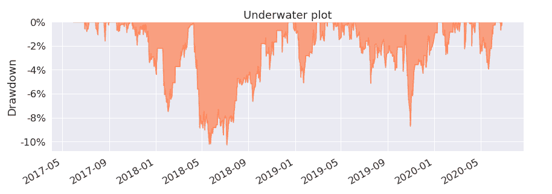

Figure D3: Drawdown of the Pair trading strategy in the Technology basket.

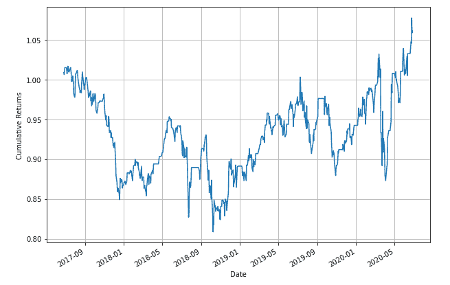

Figure E1: Cumulative returns for the Pair trading strategy in the Automobile basket.

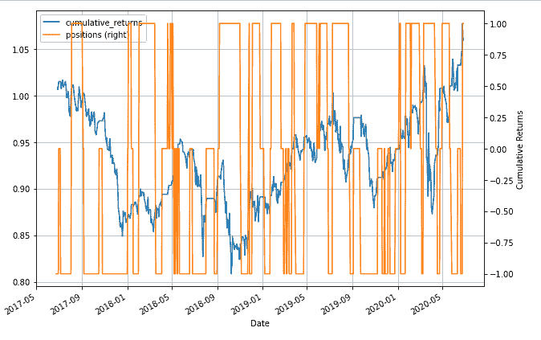

Figure E2: Cumulative returns and the Positions plotted alongside each other on the y-axis, for the Pair trading strategy in the Automobile basket.

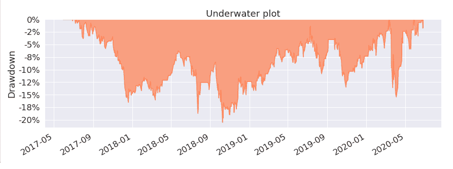

Figure E3: Drawdown of the Pair trading strategy in the Automobile basket.

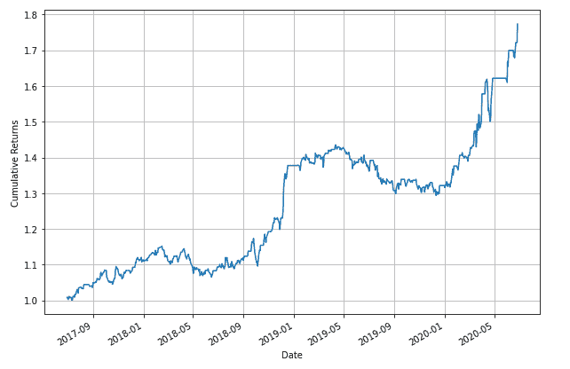

Figure F1: Cumulative returns for the Pair trading strategy in the Private Banks basket.

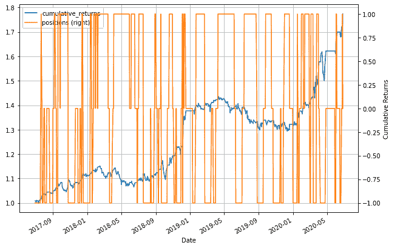

Figure F2: Cumulative returns and the Positions plotted alongside each other on the y-axis, for the Pair trading strategy in the Private Banks basket.

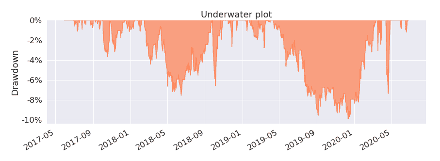

Figure F3: Drawdown of the Pair trading strategy in the Private Banks basket.

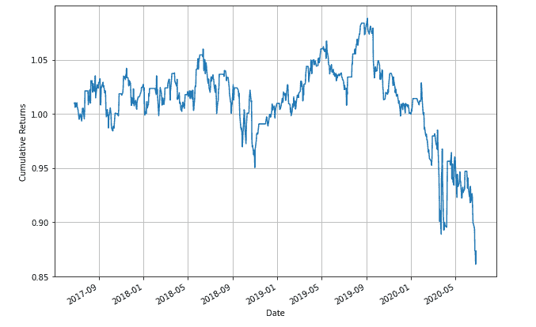

Figure G1: Cumulative returns for the Pair trading strategy in the Financial Services basket.

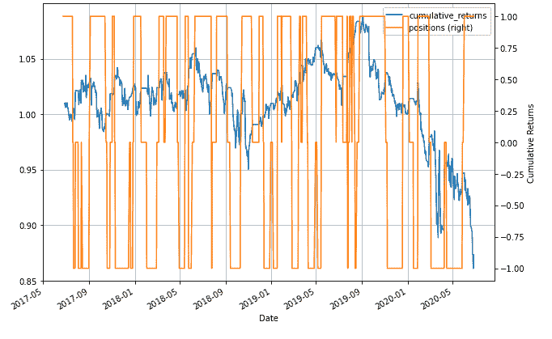

Figure G2: Cumulative returns and the Positions plotted alongside each other on the y-axis, for the Pair trading strategy in the Financial Services basket.

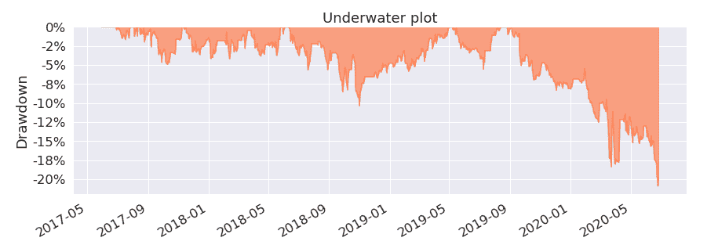

Figure G3: Drawdown of the Pair trading strategy in the Financial Services basket.

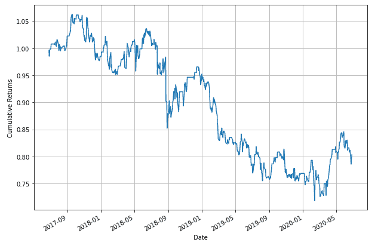

Figure H1: Cumulative returns for the Pair trading strategy in the Pharmaceutical basket.

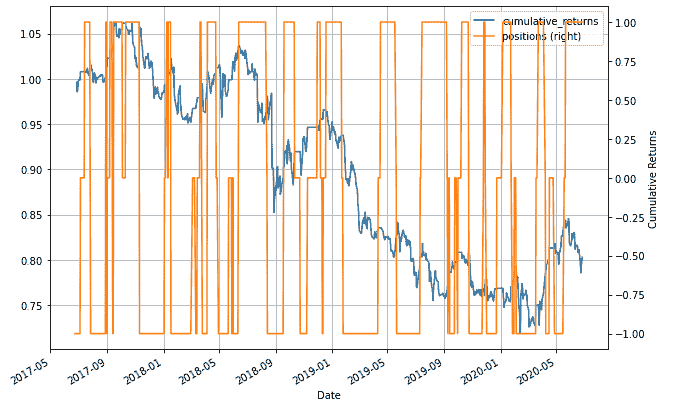

Figure H2: Cumulative returns and the Positions plotted alongside each other on the y-axis, for the Pair trading strategy in the Pharmaceutical basket.

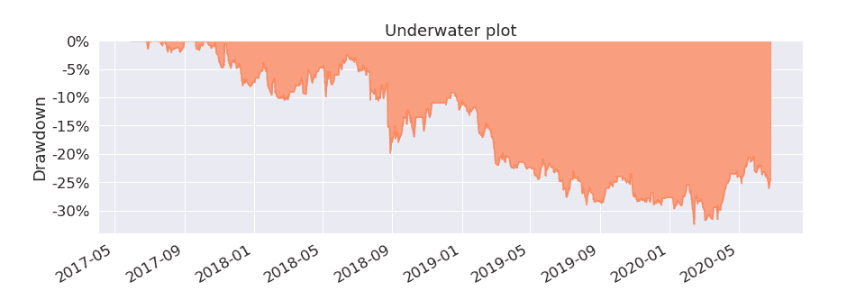

Figure H3: Drawdown of the Pair trading strategy in the Pharmaceutical basket.

* * *

## 结论和未来影响

做出的大假设:
我们只能投资于所选行业的特定股票。

此外，我们假设进行配对交易所需的保证金为:

*   这是从传播方程的百分比变化得出的。
*   实际上，经纪人可以对期货隔夜头寸收取高得多的保证金。
*   我们的目的是在假设和限制条件下进行比较分析。

在上述假设下，人们发现:

*   分配对以下部门更有效:医药和金融服务篮子
*   配对交易似乎是以下行业的更好选择:
*   技术、汽车和私人银行篮子

投资组合分配策略从正确的证券选择和分配给股票的权重中产生 alpha。配对交易策略从配对选择和均值回归过程中生成其 alpha 值(在 Quantra 课程中详细了解[均值回归策略](https://quantra.quantinsti.com/course/python-mean-reversion-strategies-ernest-chan))。

在配对交易策略中，尽管没有达到 ADF 测试标准，我还是继续实施了这个策略。

使用这两种策略的优势是什么？
*成对交易策略的优势在于它是市场中性的。*

**有哪些局限性？** *[印度现货股票市场不允许卖空](https://quantra.quantinsti.com/course/short-selling-in-trading)隔夜头寸。期货市场允许卖空。在这种情况下，投资组合分配策略会获得最大收益，因为所需的保证金要少得多。*

配对交易策略很难做空，因为需要更多的保证金。在熊市中，投资组合配置策略表现更差的可能性更大。

* * *

**参考文献**

*   c .培根和 s .主席，2009 年。夏普比率有多尖锐？风险调整绩效指标。 *Statpro，nd* 。
*   EPAT 讲座投资组合优化和配对交易策略
*   [http://www . turing finance . com/computational-investing-with-python-week-one/](http://www.turingfinance.com/computational-investing-with-python-week-one/)
*   [https://blog.quantinsti.com/monte-carlo-simulation/](/monte-carlo-simulation/)
*   [https://blog . quantin STI . com/portfolio-analysis-calculating-risk-returns/](/portfolio-analysis-calculating-risk-returns/)
*   [https://blog . quantin STI . com/portfolio-optimization-maximum-return-risk-ratio-python/](/portfolio-optimization-maximum-return-risk-ratio-python/)
*   [https://en.wikipedia.org/wiki/Calmar_ratio](https://en.wikipedia.org/wiki/Calmar_ratio)
*   [https://en.wikipedia.org/wiki/Sharpe_ratio](https://en.wikipedia.org/wiki/Sharpe_ratio)
*   [https://github.com/](https://github.com/)
*   [https://www . codearmo . com/blog/sharpe-sortino-and-calmar-ratios-python](https://www.codearmo.com/blog/sharpe-sortino-and-calmar-ratios-python)
*   [https://www.investopedia.com/terms/c/calmarratio.asp](https://www.investopedia.com/terms/c/calmarratio.asp)
*   [https://www.investopedia.com/terms/p/pmpt.asp](https://www.investopedia.com/terms/p/pmpt.asp)
*   北卡罗来纳州塔勒布，2005 年。被随机性愚弄:生活和市场中机会的隐藏角色。兰登书屋有限公司。

* * *

如果你想学习算法交易的各个方面，那就去看看算法交易(EPAT) 的[高管课程。课程涵盖统计学&计量经济学、金融计算&技术和算法&定量交易等培训模块。EPAT 教你在算法交易中建立一个有前途的职业所需的技能。](https://www.quantinsti.com/epat/)[现在报名](https://www.quantinsti.com/epat/)！

**文件在下载**

*   pair_mean_reversion_v3
*   v2_Calmar
*   v4 _ 夏普 _ 技术
*   v4_sortino

免责声明:就我们学生所知，本项目中的信息是真实和完整的。学生或 QuantInsti 不保证提供所有推荐。学生和 QuantInsti 否认与这些信息的使用有关的任何责任。本项目中提供的所有内容仅供参考，我们不保证通过使用该指南您将获得一定的利润。****