# 投资组合分析:计算风险和回报，策略和更多

> 原文：<https://blog.quantinsti.com/portfolio-analysis-calculating-risk-returns/>

由[曼德普·考尔](https://www.linkedin.com/in/mandeep-kaur-6b5313104/)

### **简介**

交易过程是一个复杂的过程，有许多步骤，比如选股、形成策略、创建投资组合等等。在这里，我们将集中于这样一个步骤，即计算有 n 只股票的投资组合的预期收益和方差。

#### **单只股票的预期回报率**

投资组合的预期回报提供了一个人可以从他们的投资组合中获得多少回报的估计。方差给出了投资者持有该投资组合的风险估计。投资组合的收益和风险取决于单个股票及其在投资组合中相应份额的收益和风险。

任何股票的风险和回报的[参数明确属于该特定股票，但是，投资者可以使用某些措施将他/她的投资组合的回报风险比调整到期望的水平。其中一项措施是调整投资者投资组合中股票的权重。](https://blog.quantinsti.com/controlling-intraday-risk-profile-10-jan-2017/)

这里我们将讨论个股的权重如何影响[投资组合](https://quantra.quantinsti.com/course/quantitative-portfolio-management)的这两个参数。考虑一只股票 ABC。设 r i 是股票的预期收益，r x 是任何概率为 p x 的收益。预期回报 r i 可以用下面的公式计算。

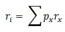

让我们假设 ABC 可以根据 b 列中给出的相应概率产生 A 列中的回报。ABC 的预期回报可以如 C 列所示计算，C 列是 A 列和 b 列的乘积。

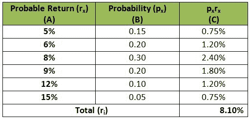

让我们看看计算这支股票的预期收益的代码。我们从导入熊猫库开始。

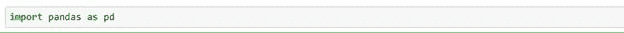

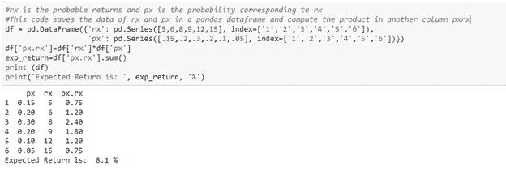

根据上面的计算，股票的预期回报率为 8.10%。可以使用[资本资产定价模型(CAPM)](https://blog.quantinsti.com/capital-asset-pricing-model/) 计算 A 列中的回报。

#### **单一股票的风险(或方差)**

股票收益 ABC 的方差可以用下面的公式计算。

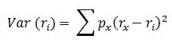

下表给出了使用上述相同示例计算方差的方法。

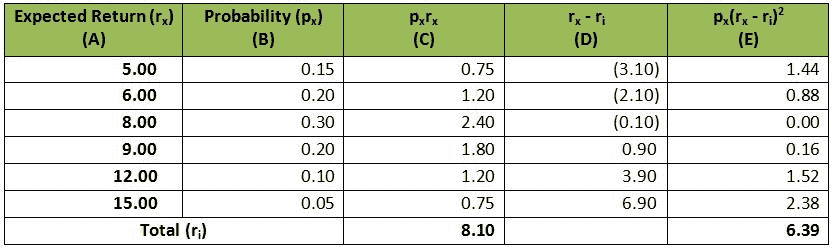

我们可以使用 python 计算单只股票的方差，如下所示:

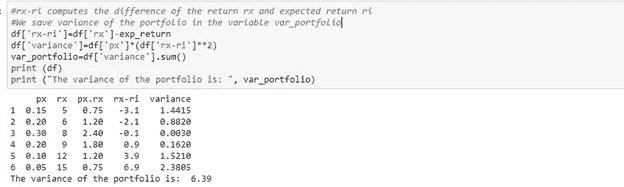

因此，ABC 的收益方差为 6.39。回报的标准差可以计算为方差的平方根。

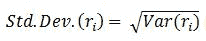

计算了股票的预期收益和方差后，我们现在来看看如何计算投资组合的收益和方差。我们使用投资组合的预期收益和方差来优化它。我们可以调整股票的权重，使回报最大化，标准差最小化。

#### **n 股投资组合的预期回报**

让我们看一个 n 股投资组合。假设第 i 只股票的预期收益为 r i 。投资组合的预期回报率将为:

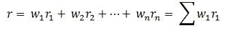

任何股票的权重都是投资于该股票的金额与投资总额的比率。对于以下投资组合，权重如表所示。

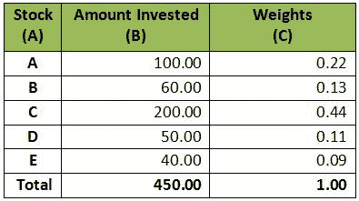

让我们看看如何使用 python 计算这个投资组合的权重。

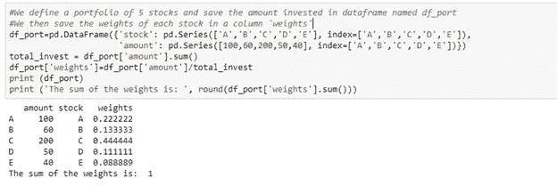

投资组合中所有股票的权重之和总是 1。接下来，我们将看到这个投资组合的预期收益。

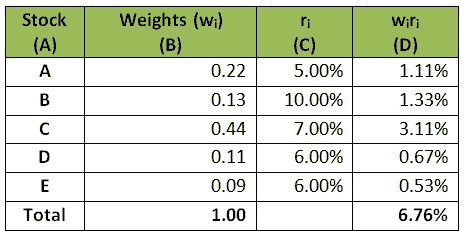

投资组合的预期回报可以计算如下:

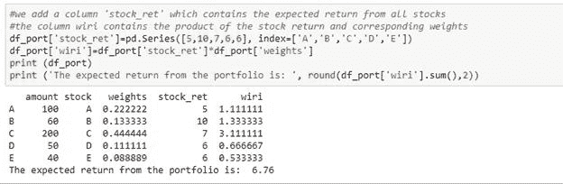

#### **收益的协方差和相关性**

在继续讨论投资组合的方差之前，我们将快速浏览一下协方差和相关性的定义。协方差(或相关性)表示任意两只股票收益的方向关系。协方差的大小表示关系的强度。如果协方差(或相关性)为零，则没有关系，如果协方差(或相关性)的符号为负，则表明如果一只股票向一个方向移动，另一只将向另一个方向移动。计算协方差和相关性的公式如下所示。

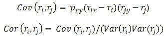

#### **投资组合方差的盒式方法**

对于投资组合的方差，我们将使用 box 方法。对于 n 只股票的投资组合，我们将创建一个 n X n 矩阵，所有股票都在 X 轴和 Y 轴上，如下图所示。每个单元格包含相应列的权重和相应股票的协方差的乘积。

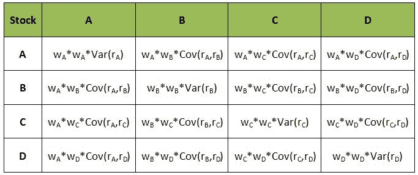

让我们来看看使用箱式法进行方差计算的逐步过程。

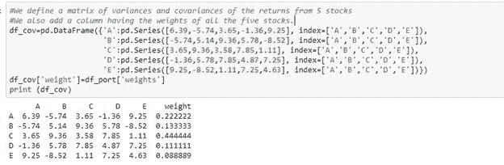

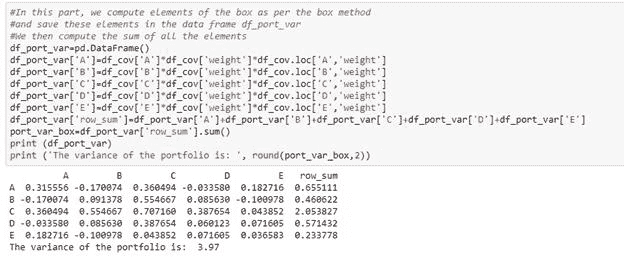

投资组合的方差是这个表格中所有单元格的和。因此，两只股票投资组合的方差将为:

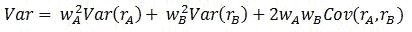

#### **完全多样化投资组合的特例**

现在我们来看一个特例，有 n 只股票，所有股票的权重相等。因此，每只股票的重量将是 1/n。使用上面的方框法，我们可以将所有对角线元素的总和写成:

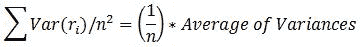

去掉 n 个对角元素后，我们剩下 n 个2–n 个元素。其余元素的总和可以写成:

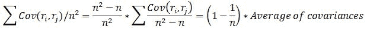

因此，这种投资组合的方差将是:

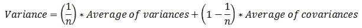

对于一个完全多样化的投资组合，我们可以假设我们已经在投资组合中加入了所有可能的股票。所以 n 会趋于无穷大，1/n 会趋于零。因此，完全多样化的投资组合的方差将是协方差的平均值。因此，我们可以说多样化消除了除股票协方差之外的所有风险，这就是[市场风险](https://blog.quantinsti.com/performance-metrics-risk-metrics-optimization/)。

### 下一步是什么？

如果你想学习算法交易的各个方面，那就去看看算法交易(EPAT)中的 T2 高管课程。该课程涵盖了统计学&计量经济学、金融计算&技术和算法&定量交易等培训模块。EPAT 让你具备成为成功交易者所需的技能。[现在报名](https://www.quantinsti.com/epat/)！