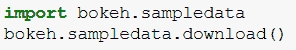
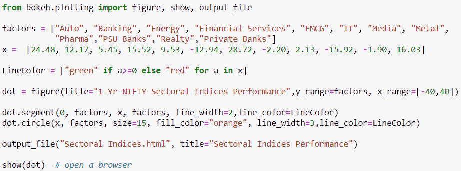
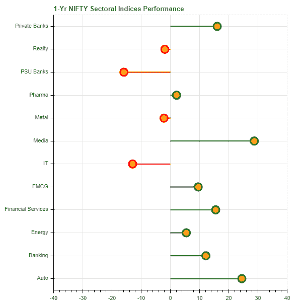
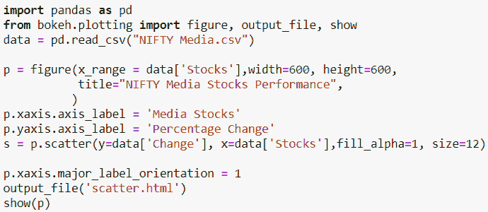
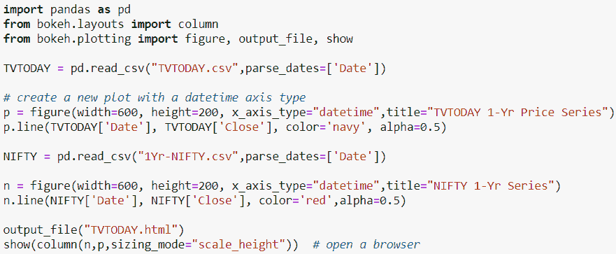
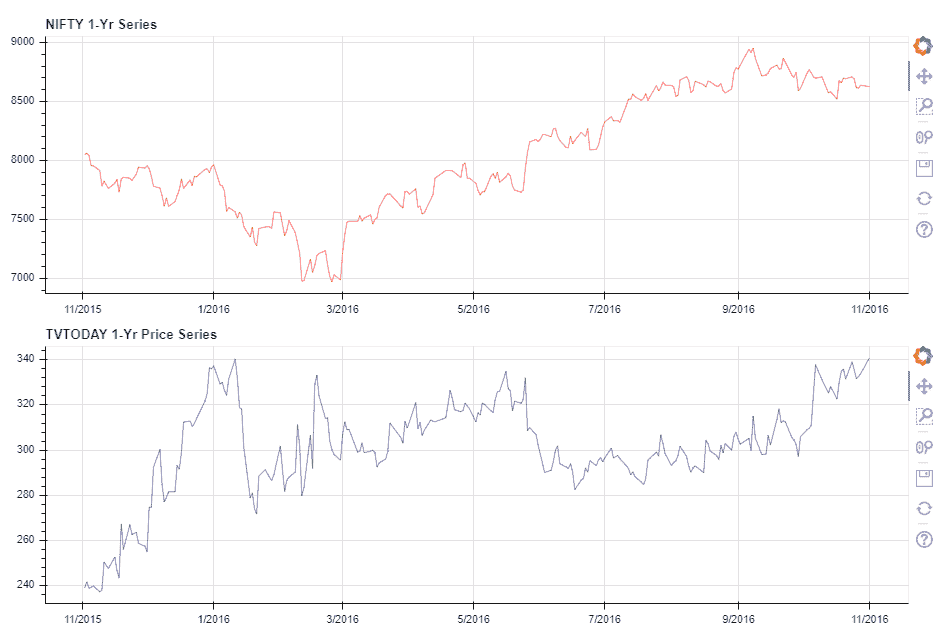
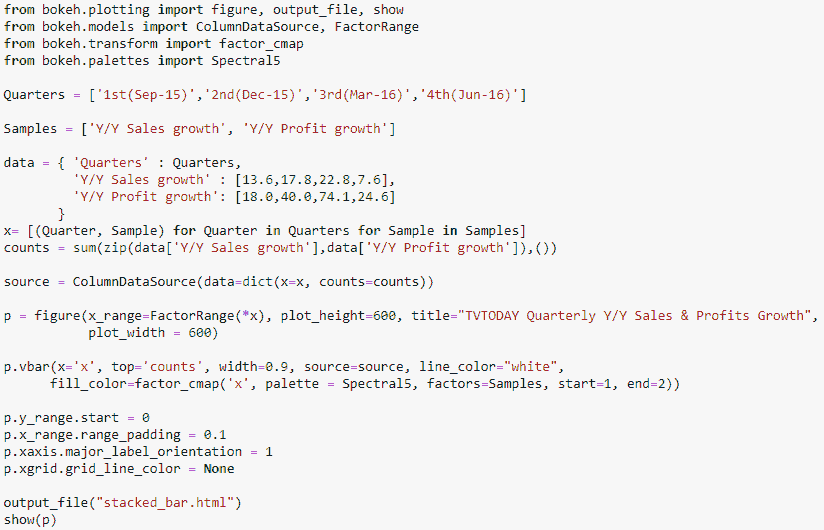
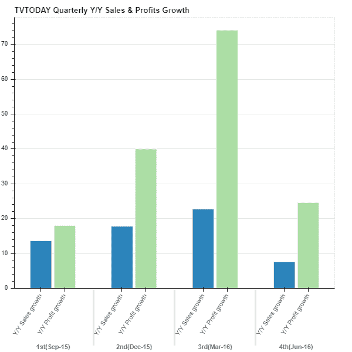

# 使用散景在 Python 中实现数据可视化

> 原文：<https://blog.quantinsti.com/python-data-visualization-using-bokeh/>

一幅画胜过千言万语或者一百年前一个聪明的女人说过。忠实于习语的每一句话，视觉化的美丽在于它可以多么清晰地传达多种信息。数据可视化是数据科学家的关键职能之一，解码视觉信息对算法交易者至关重要。这些模式(隐藏的和显而易见的)对交易者和分析师至关重要，因为他们根据这些解释决定他们的交易策略和下一步行动。

Python 提供了创建吸引人的情节和图形的酷方法。一些受欢迎的软件包包括 Matplotlib、Bokeh、T2、Plotly 和 Seaborn。在这篇博文中，我们将探索 Bokeh，这是一个 Python 交互式可视化库，使用现代 web 浏览器进行演示。使用散景可以快速、轻松地创建交互式绘图、仪表盘和数据应用程序。

### **用于 Python 数据可视化的散景**

> Bokeh 是一个 Python 交互式可视化库，它使用现代 web 浏览器进行演示。使用散景，我们可以轻松快速地创建交互式图表、仪表盘和数据应用程序 <sup>[ [1](http://bokeh.pydata.org/en/latest/) ]</sup>

Bokeh 的最终目标是以 D3.js 的形式提供优雅的外观和恰当的可视化数据描述。Bokeh 对于那些希望快速轻松地创建交互式绘图、仪表板和数据应用程序的人非常有用。让我们看看 Python 数据可视化是如何使用散景完成的。

### **绘图类型**

散景中的主要地块类型有:

#### **服务器应用程序图**

这些都连接到散景服务器，数据可以更新，从而更新绘图和用户界面。

#### **独立图**

这些地块不使用散景服务器。然而，它们仍然有许多交互式工具和功能，包括链接平移、刷动和悬停检查器。

### **安装散景**

安装散景很简单，可以使用以下 pip 命令从 PyPI (python 包索引)安装到 Python 中:

```py
pip install bokeh
```

或者，Anaconda 用户可以简单地运行命令:

```py
conda install bokeh

```

这将从 Continuum Analytics Anaconda 存储库中安装最新发布的 Bokeh 版本，以及所有的依赖项。

一些 Bokeh 示例依赖于不包含在 Bokeh GitHub 存储库或发布的包中的样本数据，因为它们的大小。安装散景后，可以通过在 Python 解释器中执行以下命令来获取样本数据:

###  **散景入门**

散景的架构是这样的，高层次的“模型对象”(代表像地块，范围，轴，字形等东西。)是用 Python 创建的，然后转换成 JSON 格式，由客户端库 BokehJS 使用。散景渲染视觉效果，并处理浏览器中散景图和部件的 UI 交互。

散景提供了两个主要界面，包括:

#### **散景模型**

一个低级界面，提供对如何组合和配置散景图和散景部件的完全控制。大多数模型都非常简单，通常由几个属性组成，没有方法。

#### **散景绘图**

一个中级界面，提供了一种方便的方法来创建以字形为中心的地块。字形是散景图的基本视觉构建块，例如线条、矩形、正方形、楔形、补丁等。

有多种方法可以生成散景文档的输出。它们包括:

1.  为散景可视化生成简单的独立 HTML 文档
2.  **output_notebook** -在 [Jupyter notebook](https://blog.quantinsti.com/jupyter-notebook-tutorial-installation-components-magic-commands/) 单元格中显示散景可视化效果

这些功能通常与显示或保存功能一起使用。

现在让我们绘制一些图表，展示散景图的简易性和威力。当我们带你浏览下面的图表示例时，我们将解释散景函数、方法和属性。

### **例 1:漂亮的行业指数表现**

让我们从这个例子开始，绘制过去一年漂亮的行业指数表现。不同部门的名称和相应的年度报告载于清单中；“因子”和“x”。我们使用 bokeh.plotting 中的图形功能创建一个点对象，并应用“线段”和“圆”方法在点图中绘制线条和线条末端的圆。

由于回报既包括正回报也包括负回报，我们在循环 的 ***中使用了 ***if else*** 语句，并创建了一个列表(LineColor)，其中将“绿色”分配给正回报，将“红色”分配给负回报。***

在“输出文件”功能中，我们指定了文件类型和文件名。“显示”功能以 html 格式显示图形。





### **例 2:俏皮传媒股表现**

从上图可以看出，在过去的一年中，传媒板块涨幅最大(约 30%)。现在让我们来想象一下由各种各样的股票组成的漂亮的媒体板块的涨幅。股票回报数据是使用 pandas 的 read_csv 函数加载的。接下来，我们使用 bokeh.charts 中的散点函数来创建“散点”对象。我们在 x 轴上指定股票名称，在 y 轴上绘制回报率。“显示”功能以 html 格式显示散点图。您也可以使用“保存”功能保存该图。

****T3】

### **例 3:对比 TVTODAY 与 NIFTY 系列**

你从散点图中观察到了什么？

我们可以看到，TVTODAY 的股票是漂亮的媒体行业中表现最好的股票之一，去年的回报率超过 40%。现在让我们画出 TVTODAY 价格系列，并与 NIFTY 指数进行比较。我们使用来自 pandas 的 read_csv 函数加载 TVTODAY 和漂亮的价格系列数据。使用 figure 函数，我们创建了“n”对象，并使用直线法绘制了 TVTODAY 价格序列。同样，我们绘制了漂亮的时间序列。

为了一个接一个地显示时间序列图，我们使用 bokeh.layouts 中的“column”函数，并将“n”和“p”对象传递给嵌套在“show”函数中的“column”函数(代码的最后一行)。这将产生一个接一个的时间序列图。



**T2】**

### **例 4: TVTODAY 季度同比销售额&利润增长**

比较上面的两个价格序列，我们可以观察到 TVTODAY 的股票在 11 月 15 日至 16 年 1 月期间出现大幅上涨，而 NIFTY 在同一时间框架内呈下跌趋势。TVTODAY 股票基本面能否解释大幅上涨？我们查看了 TVTODAY 股票的销售和利润增长数字，并绘制了一个涵盖过去四个季度的柱状图。

为了绘图，我们创建了一个包含过去四个季度的基本数据(销售额和净利润)的字典，并将其应用于 bokeh.charts 中的“Bar”函数。

 

从柱状图中，我们可以推断出 TVTODAY 在 2015 年 9 月、2015 年 12 月和 2016 年 3 月都取得了不错的业绩。此外，12 月初有对该公司有利的消息，允许 NRI 投资该公司。良好的季度业绩和利好消息为 11 月 15 日至 16 年 1 月期间的上涨趋势提供了一些解释。

这里有一篇关于在交互式代理 API 中实现 Python 代码的文章值得[阅读](https://blog.quantinsti.com/ibpy-tutorial-implement-python-interactive-brokers-api/)。

### **总结**

如上面的例子所示，散景非常用户友好，功能丰富，可以用来轻松地创建交互式图表。其网站上各种接口、功能、方法的大量文档使初学者学习散景很容易。

#### **来自散景网站的有用链接**

[安装](http://bokeh.pydata.org/en/latest/docs/installation.html) -本节详细介绍了散景[参考指南](http://bokeh.pydata.org/en/latest/docs/reference.html)的安装过程-本文档提供了使用基本字形进行散景[绘图的完整 API 参考](http://bokeh.pydata.org/en/latest/docs/user_guide/plotting.html) -详细介绍了使用散景绘图接口创建的散景图[处理分类数据](https://bokeh.pydata.org/en/latest/docs/user_guide/categorical.html) -详细介绍了散景图中的分类数据[添加注释](http://bokeh.pydata.org/en/latest/docs/user_guide/annotations.html)-详细介绍了可以添加到可视化中的补充信息

### **下一步**

学习可以使用 Python 对股票数据执行的基本操作，以分析和构建算法交易策略。在我们的文章“使用 Python 对股票数据的基本操作”中，我们介绍了一些可以使用 Python 对股票数据执行的基本操作，我们从读取 CSV 文件中的股票数据开始。

*免责声明:股票市场的所有投资和交易都有风险。在金融市场进行交易的任何决定，包括股票或期权或其他金融工具的交易，都是个人决定，只能在彻底研究后做出，包括个人风险和财务评估以及在您认为必要的范围内寻求专业帮助。本文提到的交易策略或相关信息仅供参考。*

zip 存档中的文件列表:

*   数据文件作为输入
*   所有示例的 Python 代码
*   包含输出的 HTML 文件