# Python 异常:在 Python 中引发和捕获异常

> 原文：<https://blog.quantinsti.com/python-exception/>

马里奥·比萨·培尼亚

在[上一篇](https://blog.quantinsti.com/dealing-python-error-exceptions/)中，我们处理了 Python 错误，并对 Python 异常有了基本的了解:NameError 和 TypeError。在这篇文章中，我们将深入了解 Python 异常，以及如何引发和捕捉 Python 异常。

简单地说，在 Python 解析器中检测到 Python 错误，即当 Python 代码解释器发现一些语法不正确或不完整的语句时。

这些 python 错误很容易检测和修复，因为如果我们不纠正它们，我们将无法对代码做任何事情。这些 Python 错误被称为**语法错误**。

T3】

### **Python 异常**

一方面，python 中存在错误，另一方面，Python 中存在异常(Python 异常)。解析器无法检测到这些类型的 python 错误，因为句子在语法上是正确和完整的，假设代码在逻辑上是有意义的，但是在运行时，它会发现一个意外情况，迫使执行停止。

这就是我们所说的**异常**，即。在这种情况下，Python 异常。幸运的是，我们可以正确处理这个 python 异常，防止代码突然结束执行。

### **了解 Python 异常**

为了更好地理解 Python 异常，让我们看一个例子，并开始使用它。

**例 1**

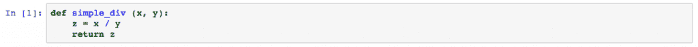

在这个例子中，我们有一个非常简单的 Python 函数来将一个数除以另一个数(我们并不真的需要这个函数来除法，但它可以作为构建这个例子的结构)。

这段代码语法正确，完整，没有错误。但事实是，代码的正确执行将取决于我们传递给函数的值 **x** 和 **y** 。让我们测试一些值。

**例 2**

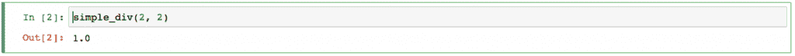

在本例中，我们用两个数字调用 simple_div(2，2)函数，该函数按预期工作，将数字相除。

**例 3**

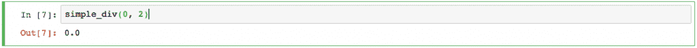

在本例中，我们用两个数字调用 simple_div(0，2)函数，该函数按预期工作，将数字分开。

**例 4**

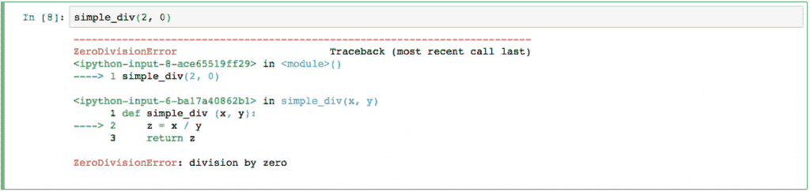

在这个例子中，我们用两个数字调用 simple_div(2，0)函数，这个函数没有像预期的那样工作，因为当我们用 0 除任何一个数字时，得到的是无穷大，而无穷大不是一个数字，因为无穷大是未知的，不可量化，因此，python 引发了一个异常，一个 Python 异常，在这个例子中称为 **ZeroDivisionError** ，执行突然结束，不允许我们继续(例如，我们可以等待结果来做其他操作)。

**例 5**

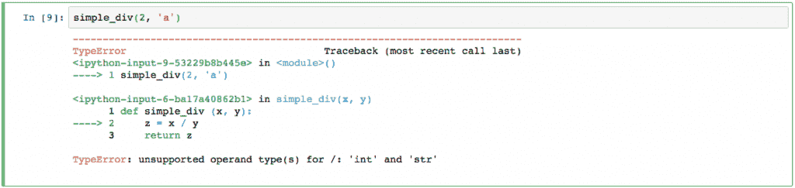

在本例中，我们用一个数字和一个字符调用 simple_div(2，' a ')函数，因此该函数不起作用，因为当我们用字符除任何数字时，python 引发了一个异常(Python 异常)，在本例中称为 **TypeError** ，执行突然结束，不允许我们继续。

**例 6**

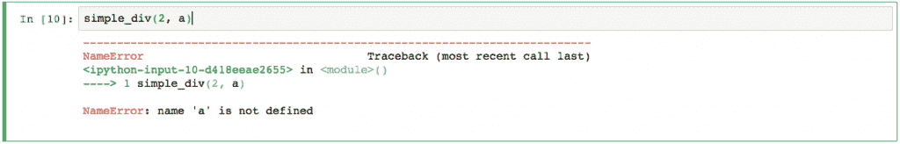

在本例中，我们使用一个数字和一个名为 a 的变量调用 simple_div(2，a)函数，因此该函数不起作用，因为变量没有初始化，因此 python 引发了一个异常(Python 异常)，在本例中称为 **NameError** ，执行突然结束，不允许我们继续。

在任何一种情况下，如果我们等待函数的结果来继续计算，我们的代码会突然结束。

有几种方法可以控制这些意外情况，例如，控制代码可以防止调用没有编号的函数，并控制分母不为零。

另一种管理方法是控制 python 异常，如果出现异常，就在出现异常时捕获它们。我们称之为**捕捉异常**。

### **捕捉异常**

我们现在要做的是控制代码执行中可能出现的异常情况(捕捉异常)，我们将尝试捕捉我们看到的第一个异常 **ZeroDivisionError** 。

注意到这个动词“尝试”是很有趣的，因为这正是我们要告诉 Python 去尝试做一些事情，如果它发现一个异常，就用它做一些事情。

在下面的函数中，我们试图执行一个除法，但是如果出现了 ZeroDivisionError Python 异常，我们希望捕获该异常并正确处理它，在这种情况下，在屏幕上打印一条消息并向用户提供一个清晰的输出。

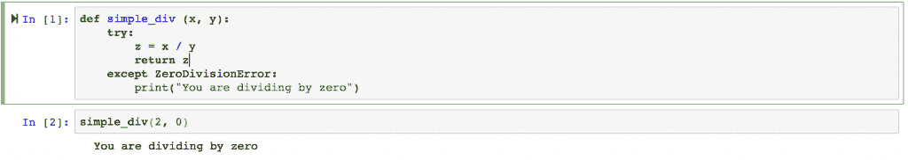

我们还可以提供 type -1、9999 或-9999 的值，这将允许我们在代码的后面进行适当的处理。

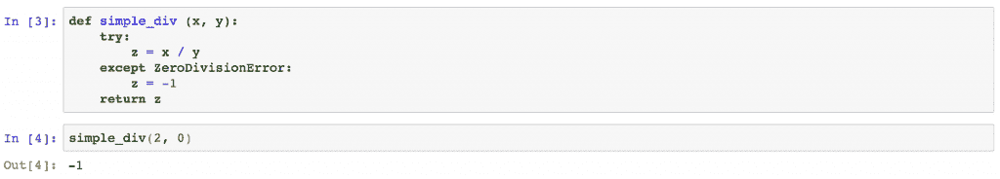

现在让我们试着捕捉异常 TypeError，可以想象，它遵循相同的结构。

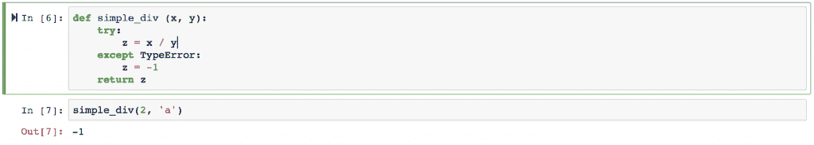

在异常 NameError 的情况下，变量 a 不存在，因此不允许从自己对函数的调用开始执行代码，也就是说，函数永远不会被执行，因为无法进行函数调用，因为我们试图传递给函数的变量不存在。

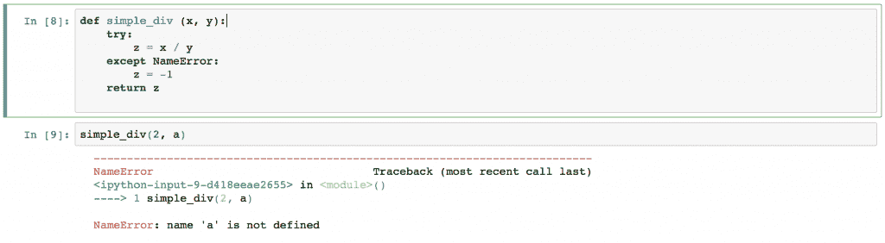

另一方面，我们可以遵循相同的结构来调用函数，也就是说，我们尝试调用函数，如果出现 python 异常 NameError，我们会正确处理它。

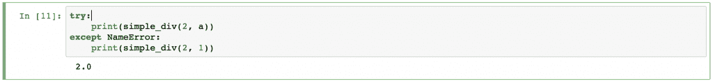

让我们把它们放在一起！

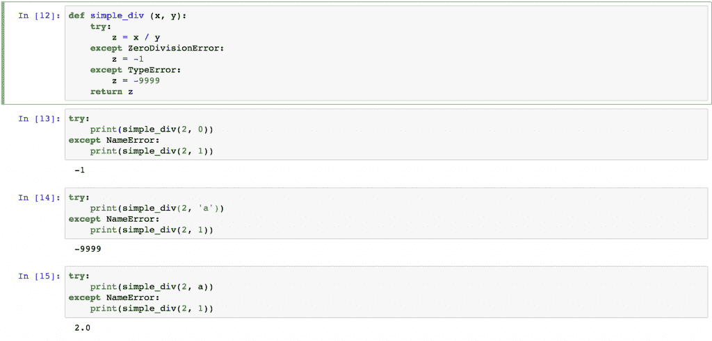

在第 12 块中，我们有一个接受两个输入参数的函数，并试图用它们进行除法运算。

我们也要记住，如果一些可预见的情况发生，我们可以妥善处理。

在块 13、14 和 15 中，我们简单地尝试调用函数，同时考虑到可能的 python 异常。

这些 python 异常可能是最典型的，但是我们可以使用内置在 python 语言中的许多其他 python 异常。

### **内置 Python 异常**

这里有一个非常有用和重要的链接，它包含了所有的[内置 Python 异常](https://docs.python.org/3/library/exceptions.html)

### **结论**

Python 为我们提供了使用所谓的 python 异常来实现干净执行的可能性，并允许我们对 python 代码执行中可能出现的某些异常进行处理。

在下一篇博客中，我们将会看到如何构建我们自己的 python 异常，并且我们将会详细了解像 Pandas 或 Numpy 这样的 python 库的 python 异常。

对于那些渴望了解更多关于 Python，它在算法和量化交易领域的使用和应用，或者只是想开始用 Python 进行交易的人，他们可以选择 [Quantra](https://quantra.quantinsti.com) 的 [Python For Trading](https://quantra.quantinsti.com/course/python-for-trading) 课程。它从头开始涵盖了重要的概念，也有助于发展和提高专门针对交易的 Python 技能。

*免责声明:股票市场的所有投资和交易都有风险。在金融市场进行交易的任何决定，包括股票或期权或其他金融工具的交易，都是个人决定，只能在彻底研究后做出，包括个人风险和财务评估以及在您认为必要的范围内寻求专业帮助。本文提到的交易策略或相关信息仅供参考。*