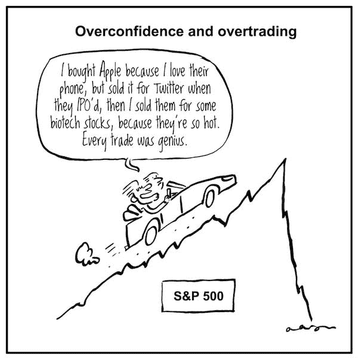
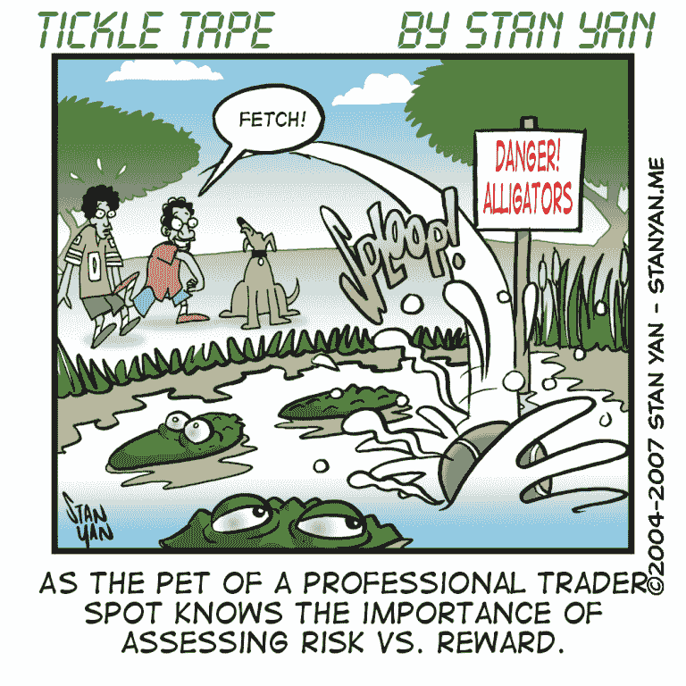
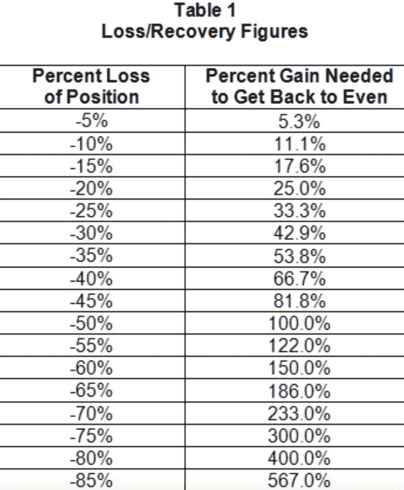
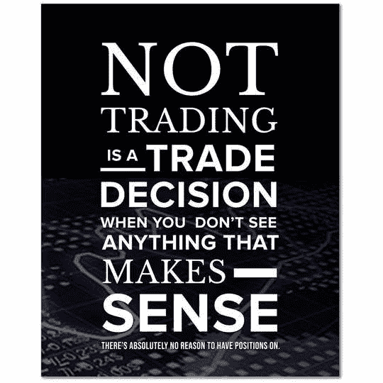

# 算法交易行业最优秀的人应该具备的 5 个品质

> 原文：<https://blog.quantinsti.com/qualities-best-people-algorithmic-trading/>

由[查尼卡·塔卡](https://www.linkedin.com/in/chainika-bahl-thakar-b32971155/)

算法交易行业充满了坚定、上进和热情的人。除了这些性格特征，算法交易行业最优秀的人还有以下 5 种品质:

1.  [优秀的观察者和倾听者](#good-observer-and-listener)
2.  [现实主义](#realist)
3.  乐观但有自知之明
4.  [勇敢而执着](#courageous and persistent)
5.  [终身学习者](#lifelong learner)

* * *

## 优秀的观察者和倾听者

在算法交易行业，最成功的是那些对金融市场哪怕是最微小的变化都保持警惕的人。在专注的态度和观察技巧的帮助下，交易者能够加强他们的交易策略。因此，交易者能够更好地最大化他们的回报。金融市场受到经济中发生的微小细节的影响。世界政治，经济趋势，甚至天气都有改变市场趋势的力量。通过了解金融市场过去和现在的情况，交易者为面对未来的波动做好了最好的准备(因为计划内和计划外的情况)。

* * *

## 现实主义者

作为一个算法交易者，你需要成为一个现实主义者，这样你才不会做出错误的决定。例如，在上涨趋势下兴奋地过度交易，害怕错过赚更多钱的机会，或者对过去损失资金的内疚。

下面，你可以看到一个过度自信和过度交易的例子:

来源:[雅虎！](https://finance.yahoo.com/news/common-investor-mistake-no-3-161053139.html?guccounter=1&guce_referrer=aHR0cHM6Ly93d3cuZ29vZ2xlLmNvbS8&guce_referrer_sig=AQAAACO7ATkiZRyWAHkit-bm4t-Z7Ezywki70azcXlMS4N3W2Ymwpi0-A2E03-vlx-RfPUm6I1_nfoq8u5YQk7Xruk2hmscbOo2Nqei2JOkjwqUHRB_45yxMpyhapSYM6Am2NnW2oUFoydyvM17XUIEWXL_Ljs8xtXI4_-QeMqtaORqD)

在上图中，可以清楚地看到交易者从一只股票跳到另一只股票的速度太快了。由于不稳定，改变交易想法不仅风险太大，还会导致大量交易成本和佣金支出。在算法交易中，交易者的情绪会导致这种高风险的策略产生。因此，成为一个现实主义者是极其重要的。

* * *

## 乐观但有自我意识

交易时，过度自信有风险，乐观和自我意识才是真正的宝石。一个成功的算法交易者保持平衡的情绪，对下一步保持积极的态度。交易时，算法交易者承担计算好的风险，并相信他/她有能力在适当的回溯测试后制定交易策略。

你可以从上图中看到，通过保持平衡乐观的方法，成功的算法交易者总是明智的。有点幽默的是，这张图片显示了专业交易者的宠物知道如何评估风险和回报，并且相信自己的决定！

虽然承担合理的风险非常重要，但当市场走势与预期相反时，通常会出现对风险的[识别、评估和缓解](/trading-risk-management/)的需求。因此，在对市场进行彻底分析的基础上，在预测所有风险之后，设定你的预期是非常重要的。

让我们看一下这张表，它是一个例子，说明承担计算好的风险是多么重要，因为每多损失 5%，你需要弥补损失的收益百分比就会增加。这仅仅意味着损失越大，就越难恢复:

来源:[培养基](https://medium.com/luchini-in-the-air/how-i-made-the-worst-trade-of-my-life-e3af9eda851e)

在这里，[投资组合优化](https://quantra.quantinsti.com/course/quantitative-portfolio-management)是一个重要的过程，涉及分析不同投资比例的投资组合。这个优化过程是通过计算每个投资组合的风险和回报，并选择实现预期风险回报的投资组合来完成的。

推荐阅读:

[投资组合&风险管理](/tag/portfolio-risk-management/)

* * *

## 勇敢而执着

算法交易者总是愿意承担计算好的风险，并且有足够的勇气去做决定。坚持的态度是算法交易者的另一个最好的朋友，因为它帮助交易者在真实市场中学习。虽然纸上交易开始时要好得多，但交易者学会了在现实市场中交易的实际方法。

这也意味着人们应该避免在金融市场预期表现不佳时做出交易决定。算法交易者不会因为做决定而内疚或害怕，会坚持不懈。

来源:[股市行情](https://dogtrainingobedienceschool.com/quotes-on-courage-stock-market/6428980_top-20-bravery-quotes-and-brave-sayings-for-being-courageous-in-life.html)

* * *

## 终身学习者

不断地研究一个想法，并改进它，最终使它发挥作用，这是在任何领域取得成功的关键。作为算法交易者，你必须尽可能多地学习算法交易。有一些[免费资源](/free-resources-learn-machine-learning-trading/)可以让学习继续下去，还有一些[关于算法交易的必备书籍](/books-algorithmic-trading/)(免费和付费)。

* * *

上面提到的是算法交易者的 5 个品质，下面你可以看到算法交易者保持的其他一些关键的性格特征或纪律:

*   他们不断研究金融市场以获得最佳经验
*   他们至少知道一种编程语言
*   他们有定量技能
*   他们获得数据管理能力

### 他们不断跟踪金融市场，以获得最佳经验

金融市场是交易发生的各种平台。

*   **交易所——是交易所平稳地运行着购买、出售和交易工具的整个过程**
*   **监管当局——监管委员会或机构是监管交易所活动的当局。与证券市场相关的监管机构包括:**
*   **美国证券交易委员会(SEC) -监管美国证券交易所/市场**
*   **印度证券交易委员会(SEBI) -监管印度证券交易所/市场**
*   **分析-分析有三种类型，目标是找出特定证券的正确价值。这些是基本的、技术的和定量的分析。**

**基本面分析包括现金流、盈利能力、资产负债表规模等因素。**

**技术分析使用图表软件来可视化价格模式、交易量和运动。**

**定量分析包括通过数学和统计模型对金融事件的研究。使用统计技术识别交易机会。**

*   **交易量——交易量是某一特定时期内某一证券交易的股票或合约总数。而平均交易量是每单位时间的交易量。一只股票的交易量越大，它在市场上的流动性就越高。**
*   **OHLC——是开盘、盘高、盘低和收盘(OHLC)的缩写。它指的是股票价格的数据集，其中每个数据点有四个价格。例如，有一个特定股票从 2019 年到 2020 年的每日价格数据集，每个数据点(每天)将有四个价格，分别指开盘价、最高价、最低价和收盘价。**
*   **趋势-趋势是基于证券价格的市场运动方向。如果价格向上移动，这就是所谓的上升趋势，反之，如果价格向下移动，这就是下降趋势。**
*   **订单——订单是投资者向[经纪人](https://quantra.quantinsti.com/glossary/Broker)或经纪公司发出的或直接在交易场所买卖股票、债券或衍生品等证券的指令。可以通过电话或在线手动/通过算法下订单。**
*   **价差——在金融学中，价差可以定义为任意两个价格之间的差异。它也被定义为给定证券的当前[出价](https://quantra.quantinsti.com/glossary/Bid-Price)和当前[要价](https://quantra.quantinsti.com/glossary/Ask-Price)之间的差额(买卖价差)。**
*   **流动性——流动性是指资产转换为现金而不会在很大程度上影响市场上当前资产价格的能力和难易程度。市场流动性是指市场允许股票、债券或衍生产品等资产在无需支付巨大买卖差价的情况下进行买卖的程度。与其他资产相比，现金是流动性最强的资产。**

********你应该如何跟随股市？********

为了跟踪股票市场的表现，最好的网站是谷歌和经济时报市场。你也可以在经济时报市场的帮助下学习如何跟踪股市。

* * *

### 他们至少精通一门编程语言

虽然有很多编程语言，但算法交易中最优秀的人至少熟悉其中一种。如果你的目标是在算法交易领域获得风险经理或投资/资产经理的职位，那么可以跳过编程，这是不正确的想法。编程语言在算法交易领域非常重要，因为你需要从验证策略假设到回溯测试和执行策略的编程技能。

******流行编程语言******

你可以学习很多计算机编程语言。然而有一些流行的语言是:Python、C、C++、Java 和 HTML。学习任何一种流行的编程语言都有助于算法交易。

******学习编程语言的方法******

学习编程语言的最好方法是通过在线课程。网上有各种各样的课程，你可以找到最适合你知识水平的课程。

推荐课程:

*   [Python for Trading:基础](https://quantra.quantinsti.com/course/python-trading-basic)(免费课程)
*   [用于交易的 Python！](https://quantra.quantinsti.com/course/python-for-trading)(付费课程)

众所周知，Python 是程序员/开发者开发交易策略的首选语言，因为它提供了以下优势:

*   Python 有一些用于机器学习和数据科学的 API 和库，与其他语言相比，这些 API 和库使得分析更加流畅。
*   它帮助交易者快速简单地编码，以图形的形式导入数据和可视化数据。
*   大多数量化交易者更喜欢 Python，因为它可以帮助他们建立自己的数据连接器、执行机制、回溯测试、风险和订单管理、前向分析和优化测试模块。
*   Python 交易库的首次更新在开发人员社区中经常出现。

* * *

### 他们有定量技能

******什么是量化技能？******

定量技能包括统计学知识、数学模型和统计研究方法。此外，你的定量技能使你能够有效地找到合适的模型来定义随机性，计算资产价格的变动，并检查市场数据的统计特性等。

******如何习得这些命令式量化技能？******

为了获得定量技能，有一些简短的在线课程是自定进度和互动的。此外，你可以选择一些知名平台提供的你想学习的具体方面。

在算法交易行业，你需要所有工作角色的量化技能。算法交易中的工作角色包括[量化分析师](/quantitative-analyst/)、[量化开发员](/quantitative-developer/)、[风险分析师](/risk-analyst/)等。通过掌握量化技能，你可以在算法交易领域的每一个工作角色中脱颖而出。Quantra 提供的一些课程有:

[用机器学习进行交易:回归](https://quantra.quantinsti.com/course/trading-with-machine-learning-regression)

本课程非常适合使用机器学习算法创建您的第一个交易策略。循序渐进地学习:获取数据，预处理数据，训练和测试机器学习回归模型，预测股票价格。提供实际操作的编码帮助。

[用机器学习进行交易:分类和 SVM(支持向量机)](https://quantra.quantinsti.com/course/trading-machine-learning-classification-svm)

学习在金融市场数据上使用 SVM，并创建自己的预测算法。课程涵盖分类算法、机器学习中的性能测量、超参数调整和监督分类器的构建。

[神经网络交易](https://quantra.quantinsti.com/course/neural-networks-deep-learning-trading-ernest-chan)

本课程强烈推荐程序员和 quants 在金融市场实现神经网络和深度学习。由欧内斯特陈博士提供，学习使用先进的技术，如 LSTM，RNN 在现场交易。

[交易中的决策树](https://quantra.quantinsti.com/course/decision-trees-analysis-trading-ernest-chan)

通过这门课程，你将学会使用人工智能技术预测市场和寻找交易机会。此外，你将能够训练算法通过数百个技术指标来决定哪个指标在预测正确的市场趋势方面表现最好。进一步，优化这些 AI 模型，学习如何在实盘交易中使用。

执行方案

有了高管课程，你可以从各种专业人士、行业中坚分子那里学到行业的实际方面。

其中一个项目是算法交易管理项目( [EPAT](https://www.quantinsti.com/) )，这是一个为期 6 个月的综合虚拟课堂项目，涵盖了算法交易的基本模块，例如:

*   市场微观结构
*   金融工具
*   统计数字
*   数据分析
*   证券管理
*   Python/Matlab/Excel 编码基础
*   机器学习的使用
*   交易、技术、基础设施和运营
*   实时交易策略构建

该课程通过专注于衍生品、量化交易、电子做市或交易相关技术和风险管理，激励传统交易者走向成功的算法交易生涯。

* * *

### 他们获得数据管理能力

**什么是数据管理？**

数据管理通常是为了清理直接从源中提取的原始数据，这些数据可能包含多个问题，如重复、非平稳性等。干净和可用的数据是指在交易中随时可用于各种目的的数据，例如回测、分析和预测交易等。数据管理并没有就此结束，它需要确保数据中没有进一步的错误，它是容易访问和可靠的。

**数据管理是怎么做的？**

数据管理通常由算法交易行业的[数据工程师](/data-engineering/)来完成。数据工程师有三种类型:

*   多面手-他们完成创建数据管道的全部工作，例如从数据源检索数据，对其进行处理并进行最终分析。这一过程占用了数据科学家的全部技能，并且是没有太多专业人员的小公司或团队所需要的。
*   以管道为中心——中型公司需要它们，这些公司有复杂的数据需求，需要数据团队进行大量需要分布式系统和计算机科学背景的工作。
*   以数据库为中心——它们通常出现在大型公司中，数据分布在各个数据库中。这些公司中有各种数据分析师，数据工程师需要将信息从数据库的主应用程序中提取到分析数据库中。

* * *

## 结论

尽管算法交易行业最优秀的人不断用先进的知识和专业技能让自己变得更好，这些品质将有助于你的职业发展..这将有助于你在算法交易行业获得最好的工作角色和职位。

希望你喜欢这篇文章，它很好地服务于它的目的！我们想知道你对此的想法，请在下面分享你的评论。

你也可以通过算法交易(EPAT) 的[高管课程来开始你升级算法交易知识的探索——这是一门综合课程，涵盖的主题从统计学&计量经济学到金融计算&技术，包括机器学习等等。立即注册！](https://www.quantinsti.com/)

* * *

*<small>免责声明:本文提供的所有数据和信息仅供参考。QuantInsti 对本文中任何信息的准确性、完整性、现时性、适用性或有效性不做任何陈述，也不对这些信息中的任何错误、遗漏或延迟或因其显示或使用而导致的任何损失、伤害或损害负责。所有信息均按原样提供。</small>*