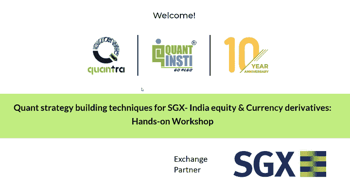

# 使用 QuantInsti 构建 SGX -印度股票和货币衍生品的量化策略技术

> 原文：<https://blog.quantinsti.com/quant-strategy-building-techniques-for-sgx-india-equity-currency-derivatives-with-quantinsti/>

* * *

[https://www.youtube.com/embed/AqLdzheIszE?rel=0](https://www.youtube.com/embed/AqLdzheIszE?rel=0)

* * *

****日期:****2020 年 10 月 22 日星期四美国东部时间早上 6:30-7:30

* * *

<figure class="kg-card kg-image-card kg-width-full"></figure>

* * *

专业量化策略开发框架的演练，以及构思、设计和回溯测试股票和货币衍生品市场端到端策略的实践方法。

了解量化交易中的最佳风险管理实践。如果你想开始你的量化交易或者给你的策略发展过程添加一个框架，这个研讨会对你来说是完美的。

* * *

****演讲人:****AVP 伊山沙阿，内容&在 QuantInsti 调研

* * *

****由**主办**新加坡交易所

* * *

QuantInsti 提供 EPAT 课程，该课程被广泛认为是印度、新加坡和全球最好的交易课程之一。联系课程顾问以了解更多相关信息。