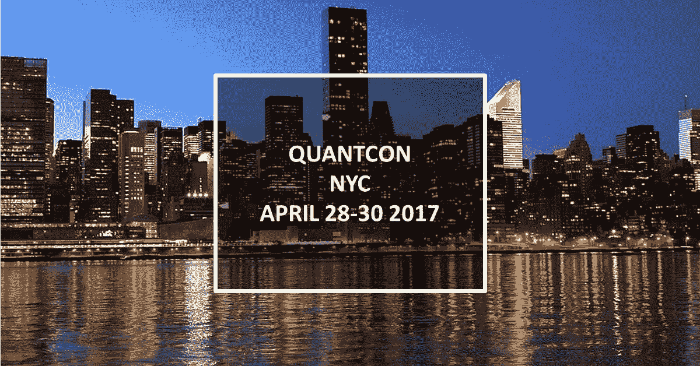
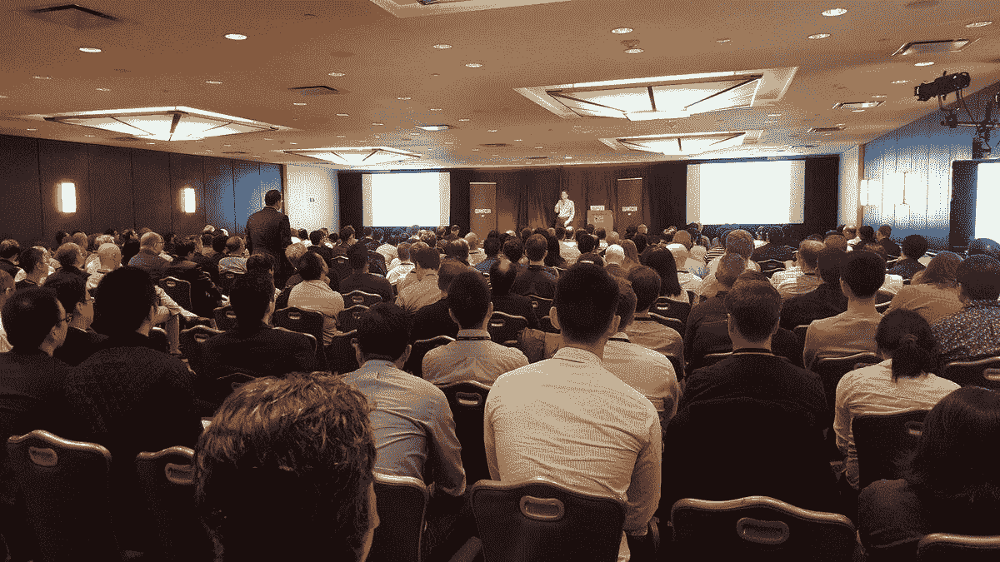
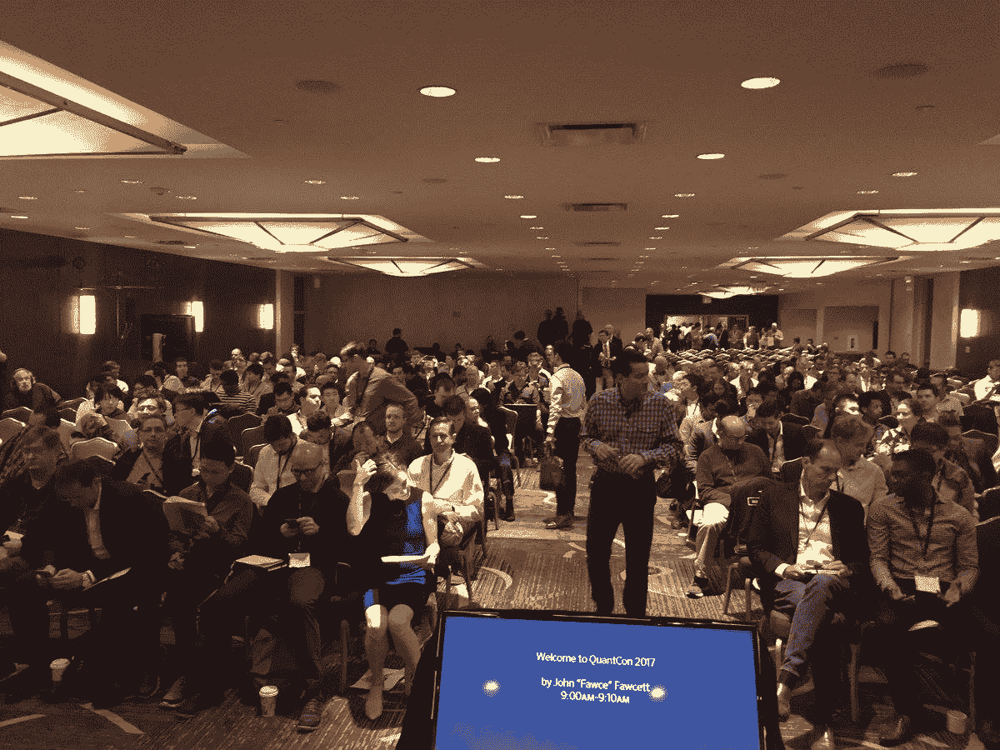
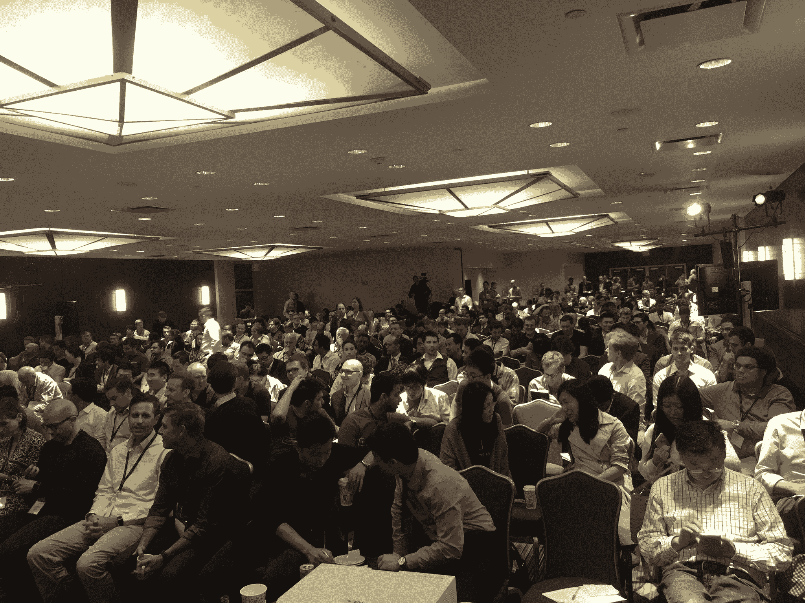
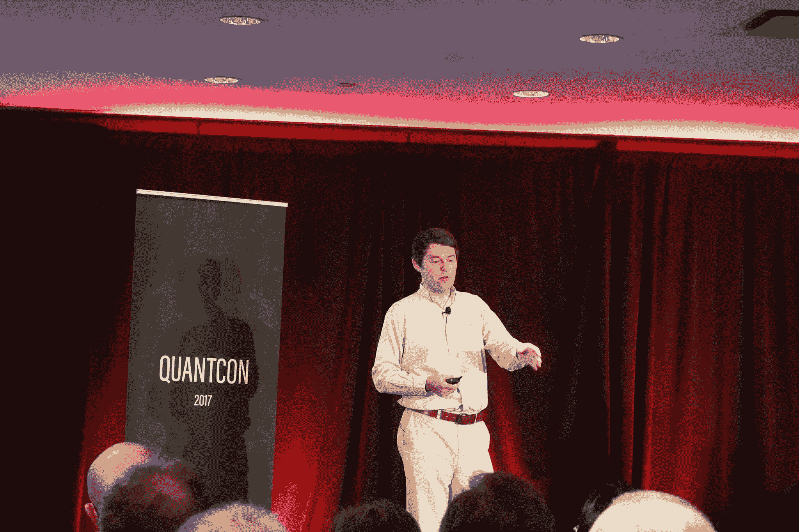

# QuantCon 2017:亚洲的算法交易机会

> 原文：<https://blog.quantinsti.com/quantinsti-at-quantcon-2017/>

QuantCon 2017 由 Quantopian 主办，于 4 月 28 日日至 30 日日在纽约市举行。会议的特色是专家研讨会和讲座，讨论如何克服算法交易、量化金融和机器学习的障碍。

### QuantCon 的 Rajib Ranjan Borah

[T2】](https://d1rwhvwstyk9gu.cloudfront.net/2017/05/Rajib-Ranjan-Bohra-1.jpg)

我们的主任 Rajib 是 QuantCon 大会上众多著名演讲者之一。他谈到了亚洲的算法交易机会-法规，技术，竞争格局，机会。

美国的高频和算法交易市场竞争非常激烈。明白了这一点后，Rajib 解释道，对于那些已经积累了专业知识的公司来说，关注亚洲的新兴市场已经变得越来越谨慎。在亚洲使用类似的努力和专业知识可能会产生更高的利润，并为一些新市场提供先发优势。

然而，这条道路充满了独特的障碍，对挑战和可能性的内在洞察力是至关重要的。QuantCon 上的这次演讲有望消除一些困惑，并为算法交易业务在亚洲的扩展提供更多的线索。

总之，对于 QuantInsti 来说，这确实是一个与 QuantCon 合作并为算法交易、量化金融和机器学习领域做出贡献的绝佳机会。

## **下面是我们图库中 QuantCon 演讲者的照片:**

