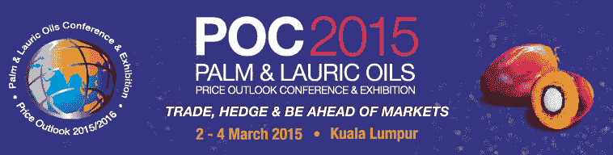

# QuantInsti 参加价格展望会议和展览

> 原文：<https://blog.quantinsti.com/quantinsti-price-outlook-conference-exhibition-2015/>

### **关于事件**

著名的棕榈油和月桂油价格展望会议和展览(POC)每年在马来西亚吉隆坡举行，吸引了来自 50 多个国家的油脂行业的国际参与者的参与。

这次旗舰会议是由马来西亚证券交易所衍生品组织的，该交易所经营着世界基准的原油棕榈油期货合约或 FCPO。这项活动被全球食用油玩家指定为一项必须参加的年度活动。它为来自世界不同地区和价值链流程的代表提供了交流思想的完美网络平台。

### **QuantInsti at POC2015**

QuantInsti 受邀为与会者提供期货和期权方面的教育，以便他们能够获得衍生品如何帮助其业务的信息。有了这个[工作坊](https://www.quantinsti.com/events-workshops-seminars/)，更多的实物交易者现在有了使用衍生品进行交易和风险管理的知识。

**日期**-2015 年 3 月 2 日至 4 日

**地点** -马来西亚吉隆坡香格里拉酒店

### **节目**

#### poco2015 马来西亚证券交易所衍生品研讨会

2015 年 3 月 2 日:上午 8 时 30 分至下午 1 时

| **时间** | **项目** |
| 上午 8:30 | 注册开始 |
| 上午 9 点 | 开场白 |
| 上午 9 点 15 分 | **研讨会论文 1:贸易期货&领先于市场** Nitesh Khandelwal 衍生产品培训部门主管&QuantInsti 跨市场研究 |
| 上午 10 点 15 分 | **茶歇** |
| 上午 10 点 35 分 | **研讨会论文 2:贸易选择&领先于市场**Rajib ran Jan Borah QuantInsti 联合创始人&董事 |
| 上午 11 时 35 分 | **问&答** |
| 中午 12 点 | **午餐** |
| 下午 1 点 | **BMD 研讨会结束** |

### **关于演讲者**

**Nitesh Khandelwal 先生**，QuantInsti&市场间研究衍生品培训部主任。

**Rajib Ranjan Borah** ，QuantInsti 高级教师，期权概念&交易策略和做市。