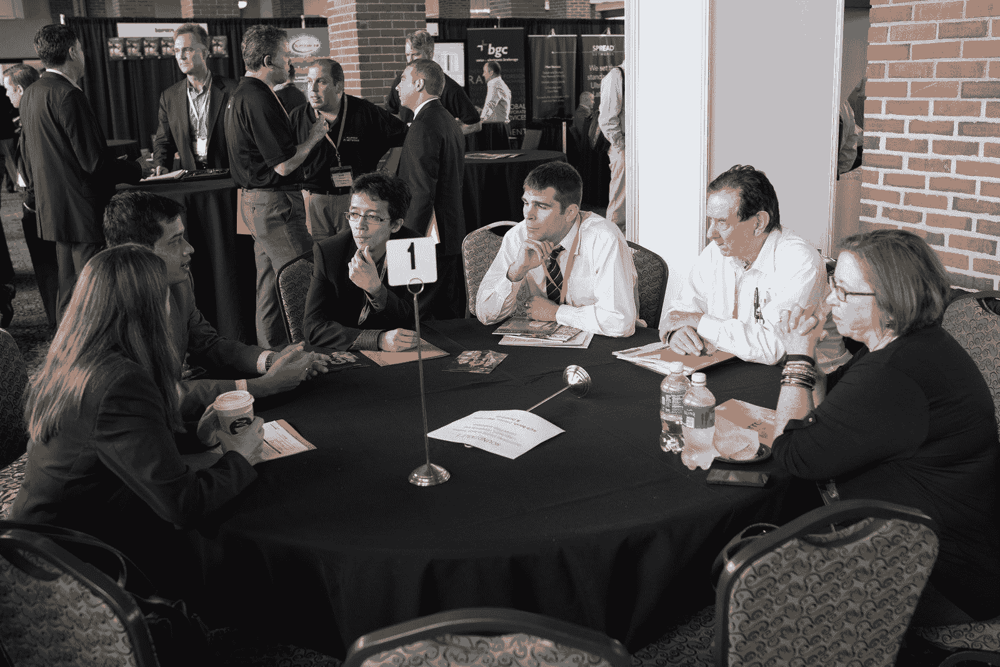

# QuantInsti 受邀参加 2015 年芝加哥贸易展

> 原文：<https://blog.quantinsti.com/quantinsti-the-trading-show-chicago-2015/>

**2015 年 5 月 26 日邀请帖:**

**日期**:2015 年 6 月 3 日-4 日

地点:美国伊利诺伊州芝加哥海军码头，邮编 60611

### **事件概述**

QuantInsti 联合创始人兼董事 Rajib Ranjan Borah 受邀参加 2015 年 6 月 3 日和 4 日在芝加哥举办的“交易展”。芝加哥交易展是芝加哥(以及美国)交易行业的主要活动之一——结合了量化金融、自动化交易、交易所技术、大数据和衍生品。来自对冲基金、交易公司、道具店、银行、经纪人、交易场所、监管机构和金融服务提供商的 1000 多名代表参加了此次活动。

近 100 名行业专家受邀担任演讲嘉宾，包括来自交易技术公司、量化交易公司、交易所、美国财政部等政府机构的专家。

这次活动历时两天，包括 26 场个人会议(17 场研讨会和 9 场专题介绍)和 38 场圆桌小组讨论。此外，有 60 家参展商参加了此次活动。

QuantInsti 的 Rajib 受邀与 Bullet Hill Capital LLC 的创始人兼管理成员 Brett Schlapfer 共同主持圆桌讨论“情绪分析——使用计算语言学识别交易机会”(6 月 4 日上午 10:10)。

参加此次讨论的其他小组成员包括 Ernie Chan(QTS 资本管理公司负责人)、Roger Hunter(QTS 资本管理公司首席软件架构师)、Christian Rojas(加拿大皇家银行资本市场公司定量分析师)、Jeff svo Boda(Makk Trading 公司管理成员)。

当天 13:40，在一个圆桌小组会场——Rajib 也主持了一场“亚洲市场的算法交易”的公开讨论。

当天晚些时候，在 14:40，QI 的 Rajib 是本次活动的最后一位演讲者，他的主题是“亚洲市场的算法交易——监管、技术复杂性和竞争格局”。

### **芝加哥 2015 交易展图片**

<figure class="kg-card kg-image-card"></figure>