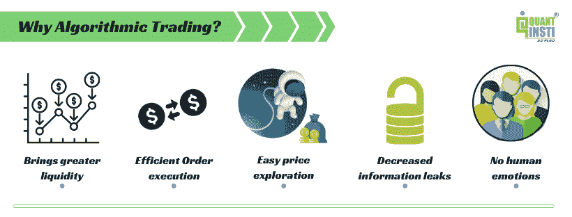
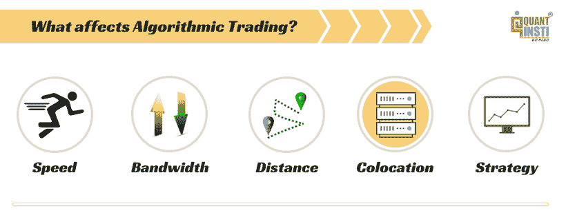

# 关于算法交易的最常见问题

> 原文：<https://blog.quantinsti.com/questions-algorithmic-trading/>

由[维拉伊·巴加](https://www.linkedin.com/in/virajbhagat/)

关于算法交易已经说了很多，也写了很多。尽管网上有介绍 T2 的视频和指南，但只有像 T4、EPAT、T6 这样真正旨在把人变成专业人士的课程很少。

这篇文章列出了一些与[算法交易](https://quantra.quantinsti.com/course/getting-started-with-algorithmic-trading)最相关的问题。这些是很多人在 AMA 的算法交易会议上提出的，这个会议提供了一个开放的平台，让他们的问题得到行业巨头的解答。你也可以看看这篇关于[的文章，关于 Algo 交易](/7-things-you-didnt-know-about-algorithmic-trading/)你不知道的 7 件事。

但是，与人类的智力相比，所有这些都要小得多，人类的智力会产生无数的问题，这是因为人类的天性非常好奇和探索。为什么不应该呢？提问是我们的天性。人们经常面临与算法交易相关的问题，并努力寻找正确的答案和解决方案。在我们讨论算法交易的常见问题之前，这里有一些问题可以让我们对它有一个清晰的了解:

### **今天 Algo 交易是怎么回事？**

*   75%的全球交易是通过算法执行的。
*   印度交易所 35-40%的交易额通过算法交易[【1】](https://www.thehindubusinessline.com/opinion/columns/slate/all-you-wanted-to-know-about-algo-trading/article23417138.ece)
*   与众多机构投资者、个人投资者、交易者等一起实现跳跃式增长。

### 为什么选择算法交易？

### **交易最常用的算法有哪些？**

在印度，使用[应用编程接口(API)](/trading-markets-using-apis/) 的算法是最常用的。在这里，投资者选择策略，然后他编程并由经纪人执行。【2】

### **什么影响算法交易？**

但这并没有停止。这就是你应该知道的算法交易。以下是我们在算法交易的**中遇到的一些最常见的问题。问题的范围从基础到一些真正有趣和专业的问题。**

**看着这些问题，你可能会有似曾相识的感觉，并想…“我以前没想过这个问题吗？”如果没有，你可能会想“为什么我以前没有想到这一点？”**

 **所以，现在开始:

### **算法交易常见问题**

> #### **Q1。 What is delay?**

**回复:**延迟是你在发出一个订单的时候，你损失了多少时间。基本上，它是订单到达交易目的地或交易所所用的时间，或者是处理市场数据、订单路由等所用的时间。

**潜伏期**帮助你确定合适的基础设施将建立你自己的办公桌。这也有助于你确定你是应该选择基于势头的策略还是做市策略。一旦您知道您的策略可以适应什么样的延迟，所有这些问题都变得容易回答了。

我们把所有不同的交易策略模式的所有概念和潜伏期混在了一起。

**定义之外:频率交易有哪些类型？**

**LFT** (低频交易)——如果你的交易策略可以适应半秒或一秒的延迟，而性能不会太差，我们可以称之为[低频交易](/latency-war-why-is-low-latency-important/)

**MFT** (中频交易)——如果你的策略不能适应那么多，但仍能适应几十毫秒的延迟，那么你就在谈论中频交易策略

**HFT** (高频交易)——如果你的策略承受不起哪怕 1 微秒的不利，那就意味着我们正在进入[高频交易](/a-brief-glimpse-into-high-frequency-data-features/)的游戏

> #### **Q2。 Is it true that HFT/ algorithm traders usually beat manual day traders? Therefore, if the regular trading decreases below a certain threshold, which market will HFT/ algorithm lose interest in? If yes, what is the threshold?**

**回复:**说[高频交易](/rise-of-hft-in-emerging-markets/) (HFT)普遍击败手动日内交易者并不绝对真实，这都要看我们这里说的是什么样的日内交易者。如果你说的是从套利机会或市场低效中获利的日内交易者，那么是的，机器可以更快地做这些事情。

举例来说，如果你是一个优秀的手工交易者，你可以在一秒钟内发送一个订单，如果你真的很优秀，那么可能在一秒钟内发送 2 个订单，如果你是“超人”，那么可能在一秒钟内发送 3-4 个订单，但不能超过这个时间。而另一方面，机器通常受到交易所设定的节流率的限制。

一台机器可以在一秒钟内发送成千上万的订单，所以这里没有匹配，但如果我们谈论的是那些分析数据并以手动方式执行订单的交易员，但他们进行了更多的研究，做了大量的功课，那么没有，这无关紧要。

关于门槛问题的第二部分，我们所看到的是，高频交易量参与越大，参与者的数量就越多，例如，如果你看看发达市场的交易所，如**纽约证券交易所(NYSE)** 你将能够看到，在一些交易所中，几乎 80-85%的交易量是通过算法发生的，大多数 HFT 公司专注于这些市场。在任何门槛的情况下，所有的 **HFT 公司**都将消失。发展中市场的情况也是如此，在印度也是如此，主要交易所中近 45-50%的交易量发生在算法上，尤其是在衍生品方面。

所以算法的使用并没有减少。如果算法太多，HFTs 将会失控，这是不正确的。竞争将会升温，一些高频交易将会倒闭，一些将会继续存在，但仅此而已。

> #### **Q3。 What if the market over-trades algo? Will it backfire?**

**回复:**这又是上一个问题的延伸。市场会不会适得其反？不尽然！

当你说算法时，它本质上意味着你已经自动化了执行，算法[并不总是意味着高频交易](/hft-infographic/)。因此，如果你是一个散户，你使用任何一家经纪商提供的 API 进行交易，你并不是真正在高频基础上交易，因此你不是 HFT，但你肯定是 algo，它只是带来了更高的效率。

如果有太多的算法，你试图交易市场中的低效率，那么这可能是一个挑战，因为找到这些效率可能真的很难，但除此之外，它不会适得其反。另一点需要补充的是，即使对于效率低下的企业，瞄准它们也变成了一场技术和基础设施的游戏。所以这些因素给了你一定的优势。

例如，您可以拥有的网络类型、系统类型、不断变得更加昂贵的硬件。

因此，如果你专注于吃掉市场的低效率，而不是市场中的 HFT，就很难发现低效率，因为它在那里的那一刻，就消失了，有人会把它拿走。

> #### **Q4。 Can I quantify the technical indicators? How about patterns and waves?**

**回复:**是的，你可以量化[的技术指标](/indicators-build-trend-following-strategy/)，这很简单，因为这是一套数学公式，无论是否量化，都可以看出来。但是你绝对可以量化和自动化它们。

是的，你也可以量化模式和波形。相对容易得多的模式；如果你能想到什么，那么机器就有能力去做，因为就像我们的大脑一样，机器也是基于逻辑工作的。详细说明一下，当你编写逻辑代码时，有些算法可能会更复杂，而有些算法可能很容易编写。

举个例子，如果你在画一条趋势线，那就相当简单了，你在找两个点，y=mx+c 就是你的趋势线公式，如果你知道截距，你就可以画一条线，或者如果你知道这两个点，你就可以计算截距并画一条线。这部分并不难，你可以计算出局部最大值和局部最小值，然后你就可以画线了。如果你在看一些有很大主观空间的东西，那就更难了。

同样，在波浪方面，如果你试图编写一个艾略特波浪代码，并且非常明确地定义了波浪规则，那么这并不困难，但是如果你为主观性留了很多空间，那么，在这种情况下，这将变得非常困难。事实上，有一些工具可以用来编码这些波的模式，我们也已经开始研究这样的东西，在不久的将来你应该可以看到。

> #### **Q5。 I am a LARP businessman in Western Australia; Now that there is ready-made software, do I need to learn algo?**

**回复:**这完全取决于什么对你有效。如果现成的软件已经在为你工作了，并且你对它的性能感到满意，那么你只需要继续发展和试验，因为同样的东西不会一直工作。

> #### **Q6。 Does automation help overcome emotional defects in transactions?**

**回复:**肯定！事实上，这是[自动化你的战略](/algorithmic-trading-strategies/)的好处之一。

控制情绪，给你可伸缩性，给你带宽，当执行由机器执行时，你可以用它来制定策略，这些都是任何规模的自动化带来的主要好处。

除非你一直在干扰你的端口，否则什么也帮不了你，但假设你不这么做，那么自动化可以帮上忙。

> #### Q7。 Is HFT suitable for retail investors? Is the algorithm for retail investors?

**回复:**是[针对散户的算法交易](/algorithmic-trading-retail-traders/)？可能是的，如果你有正确的技能。

但散户投资者肯定不会选择 HFT，因为 HFT 更像是一场科技游戏。如果有人说你现在是散户，你可以去 HFT，不要被误导。如果这个人不知道 HFT 到底是什么意思，或者他不知道散户是什么意思。

在你开始交易 HFT 策略之前，你需要花费合理的资金。这并不意味着你不能做 algo，algo 你可以。

但如果你计划利用零售平台进行现金期货套利、日历价差或一些基本的看跌期权套利，那么你可能不会看到太多的成功。

> #### **Q8。 Can C++ language be used for algorithm trading? Is Java important in algorithm trading?**

**回复:**在大多数 HFT 公司，如果你在高频率和低延迟方面 [C++](/an-example-of-a-trading-strategy-coded-in-c/) 是首选语言，因为它是最快的，你关心每一微秒。如果你不担心这一点，那么你可以使用任何其他语言，这没关系，它不会增加那么多你应该担心的延迟。所以是的，可以用 C++语言。

能是唯一能用的吗？如果你在做 HFT，那么最有可能是，否则不是。

另一件需要知道的重要事情是，这些编程语言不仅仅是编码算法或策略，它还有助于进行大量的研究和分析，所以这是 R 和 Python 中更受欢迎的东西。即使在 HFT 测试中，你也会看到很多分析师使用 R 和 [**Python**](/what-makes-python-most-preferred-language-for-algorithmic-traders/) 进行回溯测试，评估交易策略。当它投入生产时，算法是用 C++为 HFT 编码的。但是对于中频和低频，任何语言都可以。

> #### **Q9。 I trade a system with a hit rate of 45%, and the average profit/average loss =1.75\. Trading is 2-3 times a month, but sometimes there will be 2 losses or even 7 consecutive losses. This particular difficulty prevents me from increasing the trading volume, even if the capital is positive. Can you come up with a solution?**

**回复:**这只是这里有限的信息，但我怀疑或猜测的是后验测试参数或输出参数中有问题，那里可能有一些优化的空间。

在量化交易策略中，你会看到**交易比率**以及不同的比率，其中包括每个交易者都会看到的一个基本情况，那就是亏损。因此，样本内和样本外交易有一个基本但不太流行的概念，那就是，你不要优化对你可用的整个数据集的回溯测试，你要对样本内和样本外数据进行回溯测试。在样本内数据中，您可以进行所有想要进行的优化，然后在未经优化的样本外数据上运行策略，并检查性能如何，或者在您的情况下，下降情况如何。如果提取太多，那么你需要在你的策略中增加一点波动性，这对于一个风险来说太高了，如果它显示的结果在样本外数据中造成了巨大的损失。因此，这是可以帮助你的东西，你可能会在扩大你的战略中获得一些信心。

> #### **Q10。 How do we know if a market/trading place is saturated in HFT/ algorithm trading? For example, **As an HFT company, I am considering entering a new market. How important is the existing HFT ratio in this market to me?****

**回复:**正如我们之前讨论的，HFT 比率只是告诉你可以预期的竞争程度。如果你的策略是简单的普通套利策略，那么 HFT 比率表明进入这个市场可能不是一个好主意。如果你的策略不是简单的普通套利策略，而是更聪明，使用更多的数据分析结果，使用更多的统计数据进行一些像样的预测，那么，在这种情况下，它可能就没那么重要了。

高 HFT 绝对意味着，如果你想冒险进入普通的套利策略，甚至在一定程度上进入做市策略，你需要有一个技术非常强大的基础设施。

> #### **Q11。 What is the exact meaning of total bid quantity and total asking price quantity? Who are those who will buy but haven't bought and sold yet, and vice versa, and their **numbers will be counted. Who has bought but not yet sold, and vice versa, these figures will be counted.****

**回复:**总买价数量和总卖价数量仅仅是人们可以购买和出售的东西，它并没有给你多少交易的指示。它只是告诉你市场的情况，好吧，有这么多的人在那里买这么多数量的东西，他们在那里买，在那里卖。

> #### **Q12。 In India, after HFT traders entered the T2 T1 market, did the traditional trading volume decrease?**

**回复:**肯定的，是的。

在印度，曾经有一些大型自营交易公司雇佣 500-1000 名交易员，这些人不停地进进出出。**批发商**是这里的俗称。

这些交易者不会过多地分析屏幕，但会建仓，并试图在几秒或几分钟内退出。此外，在进行大量的[套利策略](/statistical-arbitrage/)之前，所有这些东西都非常流行，但在 algos 中，所有这些东西都非常容易被机器取代，所以这就是所发生的事情。这些类型的公司不得不收缩，但是他们中的大多数已经改变了他们的策略和商业模式，更多的转向[的面向](https://quantra.quantinsti.com/course/quant-interview-questions-preparation)的方面。这就是我们在印度看到的变化。

> #### **Q13。 I am a software professional from the background of data science. How soon can I make a simple algorithm?**

**回复:**我认为从算法交易的角度来看，这是一个相当强大的背景。我假设你已经很好地掌握了统计学和编程，现在你需要选择量化交易。因此，如果你对统计数字**有很好的理解，这应该相对容易，但仍取决于你在金融市场方面的出发点。我不能回答需要多少个月，但是你已经得到了 3 个月中的 2 个，所以优先权在你这边。**

> #### ****Q14。 Is the basic index data manually entered into the program?****

****回复:**如果你谈论的是**市盈率**或典型的基本面，如增长和**宏观经济数据**(如 GDP)，你可以手动输入，也可以使用数据软件输入。有些公司确实会向你提供数据(机器可读的经济数据)，所以你可以输入这些数据，当数据发布时，算法会读取你的数据，你可以根据结果对你的策略进行预编码，并相应地发送订单。因此，所有这些都是可能的，在零售领域并不常见，但现在有一些工具也可以用于零售。有些工具还可以直接读取或抓取新闻或网络上的数据。**

> #### ****Q15。 What are the advantages and disadvantages of HFT from India for non-Indian market?****

****回复:**这将更多地落在娱乐方面，而不是其他方面。毫无疑问，作为一名印度人，你不能把钱拿出去交易外汇交易所上市的保证金产品。除非你有 RBI 的批准，我不认为你可以这样做。但是，如果有一家公司(全球公司)将其交易外包给你，那么你可能可以，但我不确定。我可以肯定的一点是，你不能寄钱，你可以寄钱投资，但你不能寄钱交易保证金。**

> #### ****Q16。 After HFT enters the** **market, will the trading place worry about losing the retail trading volume?****

****回复:**绝对不会！**

**我不知道这方面的任何经验证据，因为散户一般不做套利。散户确实建仓；他们购买股票，进行商品交易。大多数情况下，他们通常采取方向性押注，但如果市场上没有高频交易，那么散户投资者支付的买卖价差将相对较高。**

**如果有高频交易，那么市场将会更有效率，这意味着它们支付的买卖差价将会小得多。事实上，**Aite Group**(HFT 领域的领先分析机构)在大约 2 年前的一项研究中提到，仅仅因为高频和算法交易带来的更好的买卖价格，一个普通的美国散户交易者就可以节省将近 250 美元。**

**在 HFT 的存在下，市场的流动性要高得多，因为 HFT 拥有技术和基础设施，可以降低缩小市场的风险因素。万一发生一些剧烈的事情，比如经济中的重大变化，特别是股票结果，管理决策，诸如此类的事情，高频交易者可以更快地做出反应。他们有信心，因为他们有能力在 99.99%的时间里创造更窄的市场，如果你增加减速带，或者剥夺高频交易者的信心或舒适，情况就不是这样了。所以，这就是为什么当你有 HFT 时，你会看到更紧张的市场，否则买卖价差会更高。**

> #### ****Q17。 Flash novels depict HFT as immoral. Do you agree with this view? Should a system with higher computing power give you the right to fight Xiao Qiao?****

****回复:**如果你发现有人在做违法或不符合规则或法规的事情，那么这显然是不正确的，也是不应该发生的，这与金融市场、电子商务、高频交易或基金管理等领域无关。**

**“ **Little Joe** ”通常会说很多关于支付的过渡成本，因为那里有很多高频交易。高频交易夺走了套利机会，因为它们提高了市场效率。就我个人的观点而言，散户交易者不会因为 HFT 的所作所为而受到伤害，HFT 相对于中频交易公司、经纪人或零售商的优势是微乎其微的。**

**散户通过基于网络的浏览器发送订单，这意味着他们已经有几毫秒的延迟，所以你作为散户不会受到影响。如果一家 HFT 公司在做任何事情，获得非法访问是另一回事，但即使在这种情况下，我也怀疑散户是否会受到伤害，因为首当其冲的将是遵守规则的其他 HFT 公司，非法访问将让他们有几微秒的优势，这对其他 HFT 公司来说是一件大事，但对散户来说不是。**

**即使在[主机托管设施](/sebi-paper-algorithmic-trading-co-location-july-2016/)的情况下，我也有几毫秒的优势，**这并没有什么不道德的**，如果你把我放在离市场 100-200 英里的地方，那么我肯定会损失一些时间，但我会相应地将我的报价设置得更宽。**

> #### ****Q18。 How many hours does a quantitative analyst spend on coding every day?****

**回复:这取决于你是什么样的**量化分析师**，但通常是一天中的大部分时间。它将是 R 和 Python 的混合；它可以是 C++或者其他语言。世界上有大量的语言。一些平台有多种语言，而他们中的一些也会创建一个基于 VB 脚本的模型。语言可能有所不同，但编码的数量可能相当可观。**

> #### ****Q19。 What are the different types of algorithms that can be used for automatic transactions?****

****回复:**有很多；同样，您必须根据低频、中频和高频来滤除它们。**

**在高频率的情况下，重点将更多地放在**套利**和做市以及一些**定向策略**上，这将需要大量更快的计算。**

**在中低频端，你可以从自动化的角度[自动化任何策略](/automated-trading-order-management-system/)。使用因子模型，你甚至可以自动化你的**基本面投资**来分析和实现算法。不知道你会从中受益多少，但从分析的角度来看，你会受益匪浅，因为你可以浏览许多年度报告和许多股票的许多基本面数据，这是你无法手动完成的，但从执行的角度来看，这并没有多大帮助。关键是你可以自动化各种策略。**

**比较流行的有**基于动量的策略**，统计套利，[基于希腊的期权策略](/the-greeks-in-options-delta-gamma-theta-and-vega/)，分散和[基于情绪的策略](/sentiment-trading-indicators-1/)。有一个关于自动交易的流行策略的完整列表，是的，我们也涵盖了很多网络交流。**

> #### ****Q20。 How does Algo trading help retail investors?****

****回复:**从接收者的角度来看，如果你是手动操作，而有人在做 algo，那么你的收益就是买卖价格和**流动市场**。如果你想用算法进行自己的交易，这种情况下，它会给你更多的规模和股票数量，你可以在这些股票上运行每种策略。因此，你可以手动操作 5 到 10 只**股票**或 5 到 10 只**策略**，而不是去监控它们。此外，情感力量和分析方面可以用算法创造很多奇迹，即使你没有用算法做执行部分。**

> #### ****Q21。 I'm an NRI, trading in India through PIS platform. How do I do algorithmic trading?****

****回复:**如果你是一个 **NRI** 你可以做算法交易，这应该不成问题，你需要与能够满足 NRIs 的合适的经纪人联系，我认为大多数经纪人都能够做到这一点。如果你不是印度人，而你想在印度做生意，那么你可以以 **FPI 类别 3** 的身份来。**

**自动化是允许的，但有一些限制性股票你不能投资，但那是很小的一部分。**

### ****下一步****

**我们很确定，你也会有一些**问题**要问我们，我们很乐意**帮助**你解决这些问题。如果你在算法交易生涯中需要任何进一步的**指导**，请随时 **[联系我们](https://www.quantinsti.com/contact-us/)** 。如果你是一个交易者、程序员、学生或者其他想从事算法交易的人，那么我们有算法交易的执行课程( [EPAT](https://www.quantinsti.com/epat) )给你。**

**QuantInsti 帮助人们获得适用于各种交易工具和平台的技能。EPAT 就是这么做的。其全面的课程包括培训模块，如统计学和计量经济学，金融计算和技术，算法和量化交易，并装备你成为一名成功的交易者。点击 了解更多 [**。**](https://www.quantinsti.com/)**

***免责声明:本文中提供的所有数据和信息仅供参考。QuantInsti 对本文中任何信息的准确性、完整性、现时性、适用性或有效性不做任何陈述，也不对这些信息中的任何错误、遗漏或延迟或因其显示或使用而导致的任何损失、伤害或损害承担任何责任。所有信息均按原样提供。*****