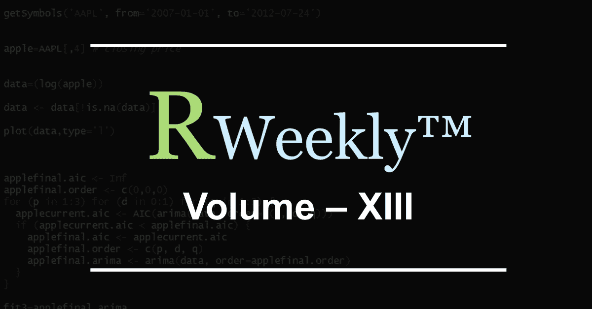
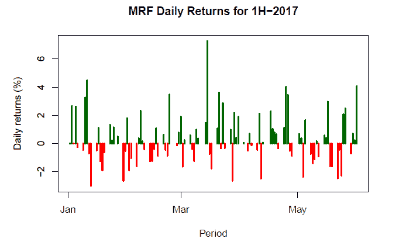
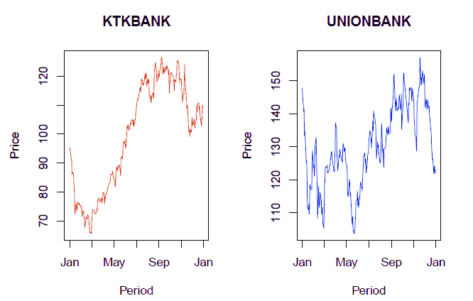
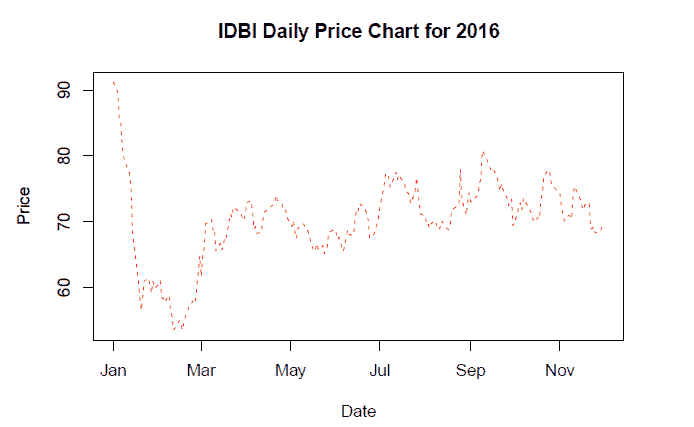
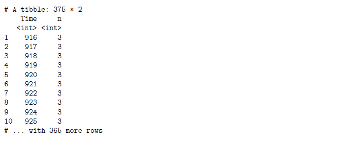
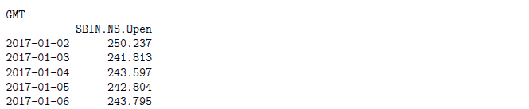
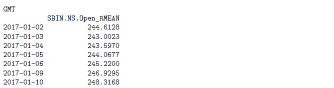
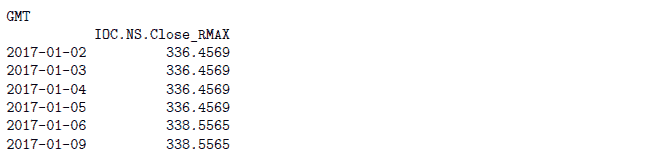

# r 每周简报第十三卷

> 原文：<https://blog.quantinsti.com/r-weekly-bulletin-vol-xiii/>



本周的 R bulletin 涵盖了一些有趣的绘图方法。希望你喜欢这个 R 周刊。享受阅读！

### 快捷键

1.  源文件- Ctrl+Shift+O
2.  获取当前文档- Ctrl+Shift+S
3.  在文件中查找- Ctrl+Shift+F

### 解决问题的想法

#### 使用多种颜色绘制变量

用多种颜色绘制一个变量可以很容易地辨别出绘制数据中的模式，并且可以使用“col”参数来完成。plot 函数的其余参数基本保持不变。让我们考虑一个例子来说明多色绘图。

例子:在这里，我们正在为在 MRF 上市的 NSE 股票寻找一年的数据。使用 quantmod 包中的 dailyReturn 函数，我们根据股票的每日收盘价计算每日回报率。

我们打算用深绿色绘制正收益，用红色绘制负收益。为此，我们使用 ifelse 语句创建一个名为“colors”的向量，如下所示。ifelse 语句作用于一个向量，我们称之为“returns”向量。

这个“颜色”向量用作绘图函数中“颜色”参数的值。绘图函数中的“类型”参数必须保持为“h”。绘图函数中使用的其余参数不言自明。

```py
library(quantmod)
mrf = getSymbols("MRF.NS", src="yahoo", from="2017-01-01", to="2017-06-01", auto.assign=FALSE)
returns = dailyReturn(Cl(mrf))*100
date = index(mrf)
colors = ifelse(returns >= 0, "darkgreen", "red")
plot(date,returns, type="h",lwd=2, col=colors, xlab="Period", ylab="Daily returns(%)", main="MRF Daily Returns for 1H-2017")
```



#### 在单页上显示多个绘图

为了在一个页面上显示多个图形，我们使用 par(mfrow)函数将图形窗口分成一个矩阵。我们在 par 函数的 mfrow 参数中指定行数和列数。比如 m flow = c(2，2)会把空间分成四个部分。

然后，我们调用高级函数来绘制数据集。如果我们想要绘制四个数据集并分别显示它们，我们将使用高级函数调用它们四次。下面给出的例子说明了这一点。

**举例:**

```py
library(quantmod)
ktkbank=getSymbols("KTKBANK.NS", src="yahoo", from="2016-01-01", to="2016-12-31",auto.assign=FALSE)
unionbank=getSymbols("UNIONBANK.NS",src="yahoo",from="2016-01-01",to="2016-12-31",auto.assign=FALSE)

ktkbank_close = coredata(Cl(ktkbank))
unionbank_close = coredata(Cl(unionbank))
date = index(ktkbank)

par(mfrow = c(1, 2))
plot(date, ktkbank_close, type = "l", lty = 1, pch = 19, col = "red", xlab = "Period",
ylab = "Price", main = "KTKBANK")
plot(date, unionbank_close, type = "l", lty = 1, pch = 19, col = "blue", xlab = "Period",ylab = "Price", main = "UNIONBANK")
```



#### 更改打印的全局参数

许多函数都有多个参数。对于其中的一些参数，R 已经设置了默认值。这些默认值有助于节省时间，因为我们不必为函数的每个参数都设置一个值。

如果我们不想使用默认值并为函数的任何特定参数设置自己的值，可以使用 par 函数来实现。可以通过使用参数名调用 par 函数来检查参数的当前默认值。

**举例:**

```py
par("col")
```

[1]“黑色

为了设置自己选择的新值，我们可以通过调用 par 函数来设置新值，并将新值赋给参数。

**举例:**

```py
par(col="blue")
```

有一长串这样的参数，它们的默认值可以使用 par 函数来更改。请参考 par 函数的帮助页面，其中列出了这些参数。请注意，当您更改全局参数的默认值时，它将影响所有的图，而不仅仅是当前的图。要重置原始值，请在完成绘图后为参数指定原始值。下面的例子说明了同样的情况:

```py
library(quantmod)
# make a copy of current settings
original_value = par("lty")
print(original_value)
```

[1]“固体”

```py
# set the global parameter using the par function
par(lty ="dashed")
# create a plot with the new setting
idbi=getSymbols("IDBI.NS", src="yahoo", from="2016-01-01", to="2016-12-01",auto.assign=FALSE)
high = coredata(Hi(idbi))
low = coredata(Lo(idbi))
date = index(idbi)
main = "IDBI Daily Price Chart for 2016"
plot(date, high, type = "l", pch = 19, col = "red", xlab = "Date", ylab = "Price", main = main)
```



```py
# Restore the global parameter to its default value
par(lty = original_value)
```

### 功能去神秘化

#### sapply 和 vapply 函数

sapply 函数是 lapply 的用户友好版本和包装器，它接受一个列表作为输入并返回一个向量。如果“simplify”参数作为“array”输入，则 sapply 函数将返回一个数组。

```py
sapply(x, f, simplify = FALSE, USE.NAMES = FALSE) is the same as lapply(x, f)
```

**举例:**

```py
x = list(a = 1:10, b = 11:15, c = 1:50)
sapply(x, FUN = length)
```

甲乙丙丁十五五十

vapply 函数类似于 sapply，但是有一个预先指定的返回值类型，所以使用起来更安全，有时更快。

**举例:**

```py
# We are specifying the return value to be an integer using the FUN.VALUE argument
x = list(a = 1:10, b = 11:15, c = 1:50)
vapply(x, FUN = length, FUN.VALUE = 0L)
```

甲乙丙丁十五五十

#### group_by 函数

该函数是 dplyr 包的一部分，用于给定数据集分组。人们可以对这样的分组数据执行不同的操作。该函数的语法如下所示:

```py
group_by(data, variables, add = FALSE)
```

其中，data -是给定的数据集变量-作为分组依据的变量的名称。add -默认情况下，当 add = FALSE 时，group_by 将覆盖现有组。要添加到现有组中，请使用 add = TRUE

**示例:**在这个示例中，NIFTY 文件包含 3 天 1 分钟的当天数据。IST 证交所交易时段从上午 9:15 开始，下午 3:30 结束。我们使用“Time”变量调用 group_by 函数，然后计算数据文件中提到的每个时间段(分钟)的观察次数。为此，我们对分组数据调用 summarise 函数，并使用 n()函数计算每个时间段的观察次数。从输出中可以看出，从 916 到 1530，每个时间段有 3 个观测值。

```py
library(dplyr)
df = read.csv("NIFTY_3days_intraday.csv")
colnames(df) = c("Date", "Time", "Close", "High", "Low", "Open", "Volume")
dt = group_by(df, Time)
sm = summarise(dt, n = n())
print(sm)
```



rollMean rollMin 和 rollMax 函数

这些函数是 timeSeries 包的一部分。它们计算时间序列对象的滚动平均值、最小值和最大值。滚动平均值的语法如下所示:

```py
rollMean(x, k, na.pad = FALSE)
```

其中，x 是单变量或多变量“时间序列”对象。k 是滚动窗口的整数宽度。na.pad 是用于填充的逻辑标志。默认情况下，它是假的。

**举例:**

```py
library(timeSeries); library(quantmod);
data = getSymbols("SBIN.NS", src="yahoo", from="2017-01-01", to="2017-01-15", auto.assign=FALSE)
open = timeSeries(data$SBIN.NS.Open)
print(head(open, 5))
```



```py
rollMean(open, k = 4, na.pad = FALSE)
```



其他两个函数的工作方式与 rollMean 相似。

**举例:**

```py
library(timeSeries); library(quantmod);
data = getSymbols("IOC.NS", src="yahoo", from="2017-01-01", to="2017-01-15", auto.assign=FALSE)
close = timeSeries(data$IOC.NS.Close)
rollMax(close, k = 5, na.pad = FALSE)
```



### 下一步

我们希望你喜欢这个公告。在[下一期每周简报](https://blog.quantinsti.com/r-weekly-bulletin-vol-xiv)中，我们将为读者列出更多有趣的方式方法加上 R 函数。

**更新**

我们注意到一些用户在从雅虎和谷歌金融平台下载市场数据时面临挑战。如果你正在寻找市场数据的替代来源，你可以使用 [Quandl](https://www.quandl.com/) 来获得同样的信息。