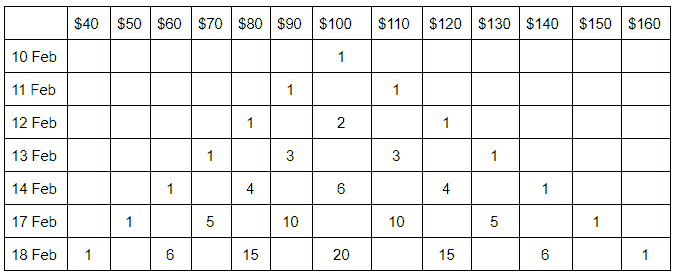

# 随机漫步:简介，GBM，模拟

> 原文：<https://blog.quantinsti.com/random-walk/>

由[瓦伦·迪瓦卡尔](https://www.linkedin.com/in/varun-divakar-b862a667/)和[雷基特·帕查内卡尔](https://www.linkedin.com/in/rekhit/)

随机游走！当我说这两个字的时候，你会想到什么。如果你想到一个人以这样的方式行走，我们不知道他们下一步会去哪里，那么你离这个概念不远了。但是，一个随机行走的人如何影响我们对做多或做空一只股票的看法呢？

在金融领域，随机游走理论认为，今天的股价对明天的股价没有关系或影响，股价的走向完全是随机的，不可预测的。

等等！这是否意味着所有的技术和定量分析工具都是多余的？虽然随机漫步理论有相当多的支持者，但它的批评者仍然活跃。无论如何，让我们从博客开始，看看我们将在几分钟内涵盖哪些主题。

*   什么是随机漫步？
*   [市场中的随机游走理论](#Random-Walk-Markets)
*   [对随机漫步的批评](#Criticism-Random-Walk)
*   [几何布朗运动在起作用](#Geometric-Brownian-Motion)
*   [利用几何布朗运动对股票价格进行随机游走模拟](#Simulation-Stock-Price)

## 什么是随机漫步？

如果我必须定义一个随机行走，我会说它是一个随机过程，用来描述一个看似随机或不可预测的物体所走的路径。是的，就是这么回事。

**趣闻**:有一座由艺术家安东尼·葛姆雷用随机漫步法创作的巨型雕像。请看下面:

<figure class="kg-card kg-image-card kg-width-full"></figure>

图片提供:[维基媒体](https://commons.wikimedia.org/wiki/File:Quantum_Cloud_by_Antony_Gormley_in_March_2011_01.jpg)

现实生活中有很多随机游走的例子。它们的范围从一个醉汉不可预测的行走，房间里气体分子的运动，甚至一枚硬币的投掷都可以说是随机的。

****但如果是随机的，我们为什么还要研究它？**T3】**

让我借助一个简单随机游走的例子来给出这个答案。让我们举一个在概率中经常被滥用的例子，抛硬币。现在我们知道掷硬币有两种结果，正面或反面。如果你扔硬币，你不能确定是正面还是反面，对吗？当然，在 10 次、50 次或者 100 次投掷中，你会发现硬币有 50%是正面朝上的。这就是重点，给定足够的试验，我们试图在一个看似随机的过程中找到模式。这有助于我们研究一个过程，如果可能的话，还可以预测结果。

事实上，让我们更进一步，以股票市场为例。虽然随机漫步可以由连续变量组成，但我们将讨论一个简单的随机漫步模拟。

假设红色公司的股票价格是 100 美元，我们说一个步长是 10 美元。由于随机漫步声明对象的路径是不确定的，并且不依赖于任何东西，甚至不依赖于历史价格，我们可以肯定地知道股票在第二天只能有两个值，增加或减少 10 美元。

因此，如果我们说在 2 月 10 日，如果价值是 100 美元。2 月 11 日，价格可能是 90 美元或 110 美元。

在 2 月 12 日，可能有 4 种结果，90 美元可能变成 80 美元或 100 美元，110 美元可能变成 100 美元或 120 美元。

有意思的是，如果我们尝试以表格形式查看结果，结果会是这样的:

<figure class="kg-card kg-image-card kg-width-full"></figure>

当然，这里我们假设，就像一个硬币，有一个平等的概率，股票价格可以上升或下降。在现实生活中，对于任何随机过程，我们不能肯定地说，一个对象所走的路径的概率是多少。

这里我想补充一个概念，叫做“漂移”。在前面的例子中，我们已经说过两种结果(股票上涨或下跌)的概率相等。我们这样说是因为这应该是一个简单的随机漫步。但在某些情况下，一种结果比另一种结果更重要。当你想到股市的时候，这种“漂移”其实会变得更加清晰。虽然个别股票有些难以确定，但我们可以看到，作为一个整体，股市通常是向上的。因此，我们会说，股票市场正在向相反的方向漂移。

坚持住！我们看到了一个扔硬币的例子，它是一种随机漫步，也是由股价创造的一条路径。但似乎有些不对劲。让我们看看随机漫步是否可以应用于股票市场。

## 市场中的随机漫步理论

伯顿·马尔基尔在《漫步华尔街》一书中普及了交易中随机漫步的概念。正如我们上面提到的，随机游走理论认为明天的股价不取决于今天的股价。换句话说，我们无法预测未来的股价。

伯顿建立在早期作品的基础上，他说股票市场的运动表现出随机游走，因此，人们无法准确预测未来的价格。他研究了各种投资技术，并批评财务顾问说，我们最好投资于被动的指数基金，而不是真正试图战胜市场。他说，很少有由金融顾问管理的基金实际上跑赢了金融市场。

这里有一个有趣的事实，为了支持他的理论，他告诉他的学生，他们以 50 美元的价格购买了一只假想的股票，然后告诉他们抛硬币，每有一个正面，股票将收盘上涨半个点，反之亦然。抛了几次硬币后，创建的图表交给了一位技术分析师，他看不出这是一个假的图表，并向伯顿发出了买入信号。

同样值得注意的是，他还提到，如果你把飞镖给一只猴子，并告诉他把它们扔向由股票组成的镖靶，它们至少会像财务顾问一样成功。

<figure class="kg-card kg-image-card kg-width-full"></figure>

当然，已经有实验试图模拟这些练习，并得出有趣的结果。这些结果是什么？让我们在下一节看到它们。

## 对随机漫步的批评

让我在这里提两个实验，乍看之下，这两个实验似乎都支持随机漫步假说，但事实证明并非如此。

在第一个例子中，马克·斯考森首先让他的学生在“金融经济学”课上选择一只表现良好的股票，然后让他的学生向一块有 1000 只股票的木板扔飞镖。到学期结束时，在平均回报后，发现通过投掷飞镖选择的股票组合比精心选择的股票组合表现更好。

如果这说服了你，那就等着听下一个吧。 [Research Affiliates](https://www.researchaffiliates.com/) 的首席执行官罗布阿诺特(Rob Arnott)也从总共 1000 只股票中随机创建了 30 只股票的投资组合，给所有股票相同的权重，然后根据市场回报来衡量回报。为了确保这是一个随机过程，他将这个过程重复了 100 次，实际上，创造了 100 个随机投资组合。你猜怎么着？其中 96 个投资组合的表现优于基准指数

那是否意味着随机漫步假说是真的？

坚持住！罗恩·阿诺特用简单的方式解释了这种优异表现。宇宙中的 1000 只股票中，小盘股比大盘股多。因此，投资组合中小盘股(高风险但高回报)比大盘股(低风险但低回报)多是很自然的，因此，“随机挑选”的股票投资组合有很大的机会跑赢股票。你可以在这里阅读整个故事。

现在等一下。我们仍然可以说，是的，风险很高，但我们确实跑赢了市场，对吗？

不完全是。正如我们从无数例子中看到的，从长期来看，小盘股提供的回报会逐渐减少，在某些情况下，会急剧减少。因此，从长远来看，这种随机选择的投资组合可能不是一个好主意。

此外，我们知道股票价格会受到各种因素的影响，一个主要的例子是收益公告或关键事件。因此，一个简单的历史分析可以让我们对未来的价格走势有所了解。有趣的是，有些人认为随机漫步是有效市场假说的进一步证明，而另一些人得出结论，当涉及到它们的含义时，他们完全相反。如果我们必须考虑更当前的事件，伯顿实际上已经承认“智能测试”可以用来超越市场，这意味着有可能击败市场。虽然这并不完全相关，但你可以在这里阅读[。](https://www.nytimes.com/2017/06/22/business/burton-malkiel-investment-stock-index-funds.html)

但在某种程度上，我们可以使用随机游走假设，并尝试预测股价。在我们看 python 代码之前，让我们先看看几何布朗运动。

## 几何布朗运动(GBM)

未来的股票价格很难预测，它取决于过去的趋势和波动性。在模拟股票价格时，我们必须给这两个参数合理的权重。随机游走模型有助于整合股票的这两个特征，并以一种非常清晰和简单的方式模拟股票价格。不用说，股票价格是随机的且不可预测的假设是这个模型的核心。让我们首先理解构成我们模拟基础的数学方程:

```py
Xt = μ + Xt-1+ et
```

其中，X <sub>t</sub> 是 t 时刻股价的对数，X <sub>t-1</sub> 是 t-1 时刻股价的对数，μ是漂移常数 e <sub>t</sub> 是 t 时刻的白噪声

可以看出，除μ外，所有其他项都随时间变化，随机噪声在每个时间步长都会变化。在一个标准的随机漫步中，模型在每个整数时间点的步长为 1，并且有均等的机会上升或下降。在上面的公式中，我们在每个时间步长选择了一个可变的步长。如果我们的步长为√h，时间是 h 的倍数，然后取极限为 h→0，你得到一个布朗运动。如果我们看一下几何布朗运动的定义，它是这样的:

> *“几何布朗运动(GBM)(也称为指数布朗运动)是一种连续时间的随机过程，其中随机变化量的对数遵循具有漂移的布朗运动(也称为维纳过程)。”*

这个定义非常接近于我们开始使用的上述方程，因此，为了模拟本例中的股票价格，我们将使用 St(随机过程)的 SDE 或随机微分方程。

```py
St = St-1* exp((μ-(σ2/2))*t + σWt)
```

其中 S <sub>t</sub> 是 t 时刻的股价，S <sub>t-1</sub> 是 t-1 时刻的股价，μ是日均收益，σ是日均波动率 t 是步长 W 的时间间隔 <sub>t</sub> 是随机正态噪声。

## 用几何布朗运动模拟股票价格的随机游走

现在让我们试着模拟股票价格。对于这个例子，我从 2008 年开始收集通用汽车的股票数据。导入库和价格数据的代码如下: