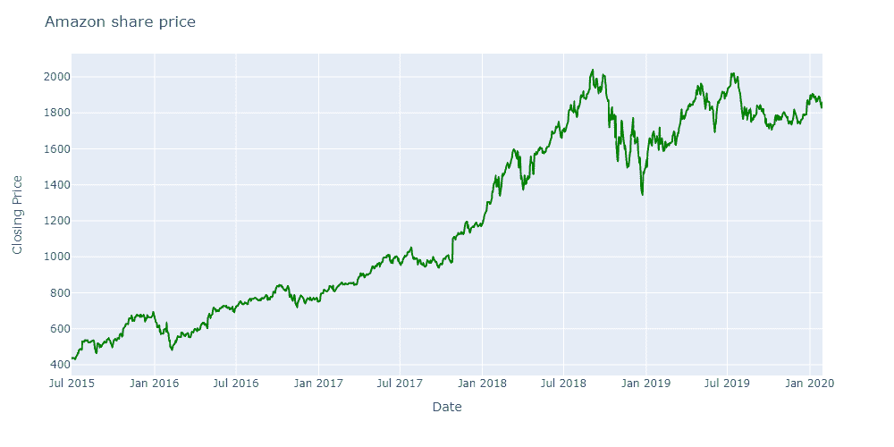
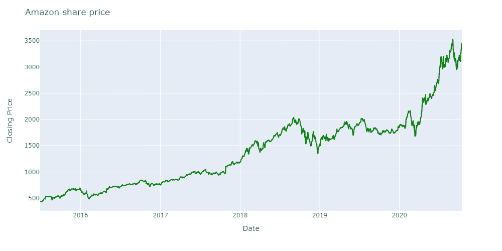

# 交易中的强化学习:要素、挑战及更多

> 原文：<https://blog.quantinsti.com/reinforcement-learning-trading/>

由[伊山沙阿](https://www.linkedin.com/in/ishan-shah-18393828/)

最初，我们是用机器学习和 AI 来模拟人类的思维方式，只不过快了一千倍！人脑很复杂，但容量有限。这种模拟是人工智能研究的早期推动力。但我们今天已经到了人类对 AI 如何“思考”感到惊讶的地步。一句话完美地总结了这一点，“由谷歌的 DeepMind AI 开发的强化学习算法 AlphaZero 教会了我们下棋是错误的！”

虽然大多数棋手知道国际象棋的最终目标是赢，但他们仍然试图将大部分棋子留在棋盘上。但 AlphaZero 明白，只要能拿下对手的王，它就不需要自己所有的棋子。因此，它的举动被认为是相当冒险的，但最终它们将获得丰厚的回报。

AlphaZero 明白，要实现将死的长期目标，它必须在游戏中遭受损失。我们称之为延迟满足。令人印象深刻的是，在 AlphaZero 之前，很少有人想到以这种方式玩游戏。从那以后，不同学科的不同专家一直在研究如何在他们的研究中适应强化学习。AlphaZero 的这一令人兴奋的成就引发了我们探索强化学习在交易中的应用的兴趣。

这篇文章的结构如下。重点是描述强化学习在交易中的应用，并讨论 RL 可以解决的问题，这可能是通过传统的[机器学习](https://quantra.quantinsti.com/course/introduction-to-machine-learning-for-trading)方法无法解决的。你不会找到任何代码来实现，但有很多例子来启发你探索交易的强化学习框架。

*   [什么是强化学习？](#what-is-reinforcement-learning)
*   [如何在交易中应用强化学习？](#how-to-apply-reinforcement-learning-in-trading)
*   [强化学习的组成部分](#components-of-reinforcement-learning)
*   [Q 表和 Q 学习](#q-table-and-q-learning)
*   [主要挑战](#key-challenges)

* * *

## 什么是强化学习？

强化学习听起来可能很奇特和先进，但是这种技术的基本概念非常简单。其实大家从小就知道这件事！

当你还是个孩子的时候，你总是会因为在运动或学习上的出色表现而得到奖励。还有，你因为做了像打碎花瓶这样的恶作剧而被训斥或责骂。这是改变你行为的一种方式。假设你会因为先来而得到一辆自行车或游戏机，你会为了先来而练习很多。因为你知道打碎花瓶意味着麻烦，所以你会小心翼翼。这叫做强化学习。

奖励起到了正强化的作用，而惩罚起到了负强化的作用。以这种方式，你的长辈塑造了你的学习。以类似的方式，RL 算法可以通过查看行为的奖励或惩罚来学习自己在[金融市场](/financial-markets-introduction/)中交易。

> 像人类一样，我们的代理人通过自我学习来实现成功的战略，从而获得最大的长期回报。这种仅通过奖励或惩罚的试错学习范式被称为[强化学习](https://en.wikipedia.org/wiki/Reinforcement_learning)(RL)
> ——谷歌深度思维

## 如何在交易中应用强化学习？

在交易领域，这个问题可以用多种方式来表述，比如利润最大化、减少提款或投资组合分配。RL 算法将学习最大化长期回报的策略。

例如，亚马逊的股价从 2018 年末到 2020 年初几乎持平。我们大多数人会认为均值回归策略在这里会更好。

但如果你从 2020 年初开始观察，价格会回升并开始形成趋势。因此，从 2020 年初开始，部署一个均值回复策略会导致亏损。看看前一年的均值回归市场条件，当市场开始形成趋势时，大多数交易者已经退出了市场。

但如果你做多并持有股票，从长远来看会对你有帮助。在这种情况下，为了未来的长期收益，放弃你现在的回报。这种行为类似于文章开头提到的[延迟满足](https://www.youtube.com/watch?v=lWURnHkYuxM)的概念。

RL 模型可以从 2017 年和 2018 年获得价格模式，从更大的角度来看，该模型可以继续持有股票，以获得巨额利润。

### 强化学习和传统的机器学习算法有什么不同？

正如你在上面的例子中看到的，你不需要在每个时间步都给 RL 算法提供标签。RL 算法最初通过试错来学习交易，并在交易结束时获得奖励。然后优化策略以获得最大回报。这不同于传统的最大似然算法，传统的最大似然算法要求在每个时间步或以特定频率进行标记。

例如，目标标签可以是每小时后的百分比变化。传统的最大似然算法试图对数据进行分类。因此，延迟满足问题很难通过传统的最大似然算法来解决。

* * *

## 强化学习的组成部分

考虑到 RL 算法试图解决的更大问题，让我们学习强化学习模型的构建模块或组件。

*   行动
*   政策
*   状态
*   奖励
*   环境

### 行动

这些动作可以被认为是 RL 算法在解决什么问题。如果 RL 算法解决了交易问题，那么操作将是买入、卖出和持有。如果问题出在[投资组合管理](https://quantra.quantinsti.com/course/quantitative-portfolio-management)上，那么行动将是对每个资产类别的资本分配。RL 模型如何决定采取哪种行动？

### 政策

有两种方法或策略帮助 RL 模型采取行动。最初，当 RL 代理对游戏一无所知时，RL 代理可以随机决定行动并从中学习。这被称为探索政策。稍后，RL 代理可以使用过去的经验将状态映射到行动，以最大化长期回报。这被称为剥削政策。

### 状态

RL 模型需要有意义的信息来采取行动。这个有意义的信息就是状态。比如你要决定买不买苹果股票。为此，哪些信息会对你有用？嗯，你可以说我需要一些[技术指标](/tag/technical-indicators/)，历史价格数据，情绪数据和基本面数据。所有这些收集在一起的信息成为状态。由设计者决定哪些数据应该构成状态。

但是为了正确的分析和执行，数据应该是弱预测性的和弱平稳的。数据应该是弱预测的足够简单好理解，但是你说的弱平稳是什么意思？弱平稳意味着数据应该具有恒定的均值和方差。但是为什么这很重要呢？简短的回答是，[机器学习](/tag/machine-learning/)算法在静态数据上运行良好。好吧！RL 模型如何学习将状态映射到要采取的动作？

### 奖励

奖励可以被认为是你想要从你的 RL 系统中获得的最终目标。例如，最终目标是创建一个有利可图的交易系统。然后，你的回报就变成了利润。或者它可以是最佳风险调整回报，那么你的回报就变成夏普比率。

定义奖励函数对于 RL 模型的性能至关重要。以下指标可用于定义奖励。

*   每点利润
*   [夏普比率](/sharpe-ratio-applications-algorithmic-trading/)
*   每笔交易利润

### 环境

环境是允许 RL 代理观察状态的世界。当 RL 代理应用动作时，环境对该动作起作用，计算奖励并转移到下一个状态。例如，环境可以被认为是一个国际象棋游戏或交易苹果股票。

### RL 代理

代理是 RL 模型，它接受输入特征/状态并决定要采取的动作。例如，RL 代理将 RSI 和过去 10 分钟的回报作为输入，并告诉我们是否应该做多苹果股票，或者如果我们已经做多，则平仓。

让我们把所有的东西放在一起，看看它是如何工作的。

### 第一步:

**状态&动作**:假设 2020 年 7 月 24 日苹果收盘价为 92 美元。基于状态(RSI 和 10 天收益)，代理给出了买入信号。

**环境**:为了简单起见，我们说订单是在下一个交易日，也就是 7 月 27 日开盘时下单的。订单金额为 92 美元。因此，环境告诉我们，你在 92 美元时做多了一股苹果股票。

奖励:没有奖励，因为我们还在交易中。

### 第二步:

**状态&动作**:使用最新的价格数据创建系统的下一个状态。7 月 27 日收盘时，价格达到了 94 美元。代理将分析状态并给出下一个动作，比如卖给环境

**环境**:将发出一个卖出指令，这将平仓多头头寸

**奖励**:给代理商 2.1%的奖励。

| **日期** | **收盘价** | **动作** | **奖励** **(%回报)** |
| 7 月 24 日 | $92 | 购买 | - |
| 7 月 27 日 | $94 | 出售 | Two point one |

太好了！我们已经了解了 RL 模型的不同组成部分是如何组合在一起的。现在让我们试着理解 RL 代理如何采取行动的直觉。

* * *

## Q 表和 Q 学习

Q 表和 Q 学习可能听起来很奇特，但它是一个非常简单的概念。

在每个时间步，RL 代理需要决定采取哪个动作。如果 RL 代理有一个表，可以告诉她哪一个动作会给出最大的回报，那会怎么样呢？然后只需选择该动作。这个表是 Q 表。

在 Q-table 中，行是状态(在这种情况下是天数)，动作是列(在这种情况下是持有和卖出)。该表中的值称为 Q 值。

| **日期** | **出售** | **按住** |
| 23-07-2020 | Zero point nine five four | Zero point nine six six |
| 24-07-2020 | Zero point nine five four | Zero point nine eight five |
| 27-07-2020 | Zero point nine five four | One point zero zero five |
| 28-07-2020 | Zero point nine five four | One point zero two six |
| 29-07-2020 | Zero point nine five four | One point zero four seven |
| 30-07-2020 | Zero point nine five four | One point zero six eight |
| 31-07-2020 | Zero point nine five four | One point zero nine |

根据上面的 Q 表，在 7 月 23 日，RL 代理将采取什么行动？是的，没错。将采取“持有”动作，因为其 q 值为 0.966，大于卖出动作的 q 值 0.954。

但是如何创建 Q 表呢？

让我们在一个例子的帮助下创建一个 Q 表。为简单起见，让我们以 2020 年 7 月 22 日至 7 月 31 日的价格数据为例。我们添加了百分比回报和累积回报，如下所示。

| **日期** | **收盘价** | **百分比回报** | **累计收益** |
| 22-07-2020 | Ninety-seven point two |
| 23-07-2020 | Ninety-two point eight | -4.53% | Zero point nine five |
| 24-07-2020 | Ninety-two point six | -0.22% | Zero point nine five |
| 27-07-2020 | Ninety-four point eight | 2.38% | Zero point nine eight |
| 28-07-2020 | Ninety-three point three | -1.58% | Zero point nine six |
| 29-07-2020 | Ninety-five | 1.82% | Zero point nine eight |
| 30-07-2020 | Ninety-six point two | 1.26% | Zero point nine nine |
| 31-07-2020 | One hundred and six point three | 10.50% | One point zero nine |

几天前你买了一支苹果股票，现在你已经没有资本了。你只有两个选择:“持有”或“卖出”。作为第一步，您需要创建一个简单的奖励表。

如果我们决定持有，那么在 7 月 31 日之前我们不会得到任何奖励，到最后，我们会得到 1.09 英镑的奖励。如果我们决定在任何一天卖出，那么回报将是到那天为止的累积回报。奖励表(R-table)如下图所示。如果我们让 RL 模型从奖励表中选择，RL 模型会卖出股票，得到 0.95 的奖励。

| **状态/动作** | **出售** | **按住** |
| 22-07-2020 | Zero | Zero |
| 23-07-2020 | Zero point nine five | Zero |
| 24-07-2020 | Zero point nine five | Zero |
| 27-07-2020 | Zero point nine eight | Zero |
| 28-07-2020 | Zero point nine six | Zero |
| 29-07-2020 | Zero point nine eight | Zero |
| 30-07-2020 | Zero point nine nine | Zero |
| 31-07-2020 | One point zero nine | One point zero nine |

但预计 7 月 31 日价格将升至 106 美元，涨幅为 9%。因此，你应该持有股票，直到那时。我们必须表现这些信息。以便 RL 代理可以做出持有而不是出售的更好决定。

如何着手呢？为了帮助我们，我们需要创建一个 Q 表。你可以从将奖励表复制到 Q 表开始，然后使用**贝尔曼方程**计算每天持有行动的隐含奖励。

### 贝尔曼方程

$$ Q(s_t,a_t^i) = R(s_t,a_t^i) + \gamma Max[Q(s_{t+1},a_{t+1})] $$

在这个等式中， **s** 是状态， **a** 是时间 **t** 的一组动作， **ai** 是该组动作中的一个特定动作。r 是奖励表。 **Q** 是状态动作表，但它会随着我们通过经验对系统了解的增加而不断更新。γ是学习率

我们将首先从 7 月 30 日的保持行动的 q 值开始。

1.  第一部分是采取行动的回报。如 R 表所示，它是 0
2.  我们假设γ = 0.98。第二天，即 7 月 31 日，卖出和持有操作的最大 Q 值是 1.09
3.  因此，7 月 30 日持有行动的 q 值为 0 + 0.98 (1.09) = 1.06

这样，我们将为 Hold 列的其他行填充值，以完成 Q 表。

| **日期** | **出售** | **按住** |
| 23-07-2020 | Zero point nine five | Zero point nine six six |
| 24-07-2020 | Zero point nine five | Zero point nine eight five |
| 27-07-2020 | Zero point nine eight | One point zero zero five |
| 28-07-2020 | Zero point nine six | One point zero two six |
| 29-07-2020 | Zero point nine eight | One point zero four seven |
| 30-07-2020 | Zero point nine nine | One point zero six eight |
| 31-07-2020 | One point zero nine | One point zero nine |

RL 模型现在将选择保持动作以最大化 Q 值。这就是 Q 表背后的直觉。这个更新 Q 表的过程叫做 Q 学习。当然，我们采用了一个动作和状态有限的场景。在现实中，我们有一个大的状态空间，因此，建立一个 q 表将是耗时的，也是资源的限制。

要克服这个问题，可以使用深度[神经网络](https://quantra.quantinsti.com/course/neural-networks-deep-learning-trading-ernest-chan)。他们也被称为深度 Q 网络或 T2 DQN T3。深度 Q 网络从过去的经验中学习 Q 表，当给定状态作为输入时，它们可以为每个动作提供 Q 值。我们可以选择具有最大 Q 值的动作。

**如何训练人工神经网络？**

我们将使用[体验回放](https://arxiv.org/pdf/1511.05952.pdf)的概念。您可以将代理过去的经历存储在重放缓冲器或重放存储器中。用通俗的语言来说，这将存储状态、采取的行动以及从中获得的奖励。并使用这种组合来训练[神经网络](/neural-network-python/)。

* * *

## 主要挑战

在构建 RL 模型时，主要有两个问题需要考虑。它们如下:

### 第二类混沌

这可能感觉像科幻小说的概念，但它是非常真实的。当我们训练 RL 模型时，我们是孤立工作的。在这里，RL 模型没有与市场互动。但一旦部署，我们不知道会对市场产生怎样的影响。

2 型混沌本质上是当一个情境的观察者有能力影响情境。在训练 RL 模型本身时，这种影响很难量化。然而，可以合理地假设 RL 模型即使在展开时仍在学习，因此将能够相应地自我校正。

### 金融数据中的噪声

有些情况下，RL 模型可能会拾取通常出现在[财务数据](/webinar-how-to-use-financial-market-data-for-fundamental-and-quantitative-analysis/)中的随机噪声，并将其视为应采取行动的输入。这可能导致不准确的交易信号。

虽然有消除噪声的方法，但我们必须小心权衡消除噪声和丢失重要数据之间的关系。

虽然这些问题绝对不容忽视，但有各种解决方案可以减少这些问题，并在交易中创建更好的 RL 模型。

## 结论

在介绍组成强化学习系统的组件时，我们仅仅触及了强化学习的表面。下一步将是通过实现你自己的 RL 系统来推进这种学习，在真实世界的市场数据上对[回测](/backtesting/)和[票据交易](/paper-trading/)。

您可以注册深度强化学习课程，详细学习 RL 模型，并创建自己的强化学习交易策略。

点击查看[。](https://quantra.quantinsti.com/course/deep-reinforcement-learning-trading)

## 参考资料和进一步阅读

1.  [金融市场中的强化学习——一项调查](https://www.econstor.eu/bitstream/10419/183139/1/1032172355.pdf)
2.  [深度 RL 中的关键论文](https://spinningup.openai.com/en/latest/spinningup/keypapers.html)
3.  [来自 DeepMind Technologies 的深度 RL](https://deepmind.com/blog/article/deep-reinforcement-learning)
4.  [优化交易执行的 RL](https://www.cis.upenn.edu/~mkearns/papers/rlexec.pdf)
5.  [增强 Q-Learning 实现最优资产配置](https://papers.nips.cc/paper/1427-enhancing-q-learning-for-optimal-asset-allocation.pdf)
6.  [交易系统和投资组合的强化学习](https://www.semanticscholar.org/paper/Reinforcement-Learning-for-Trading-Systems-and-Moody-Saffell/10f34407d0f7766cfb887334de4ce105d5aa8aae?p2df)

## 行业更新

1.  [人工智能和机器学习在算法交易中获得动力& ATS 在波动中](https://www.finextra.com/blogposting/19118/ai-and-machine-learning-gain-momentum-with-algo-trading-amp-ats-amid-volatility)
2.  [加拿大皇家银行资本市场推出人工智能电子交易平台 Aiden](https://ibsintelligence.com/ibsi-news/rbc-capital-markets-launches-aiden-an-ai-powered-electronic-trading-platform/)

*<small>免责声明:股票市场的所有投资和交易都涉及风险。在金融市场进行交易的任何决定，包括股票或期权或其他金融工具的交易，都是个人决定，只能在彻底研究后做出，包括个人风险和财务评估以及在您认为必要的范围内寻求专业帮助。本文提到的交易策略或相关信息仅供参考。</small>T3】*