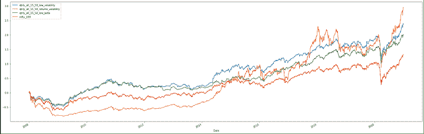

# 基于规则的投资组合，以战胜市场回报

> 原文：<https://blog.quantinsti.com/rule-based-portfolio-project-manoj-hatalage/>

该项目的目标是为散户投资者创建一个基于规则的投资组合。对于一个日常工作的普通散户投资者来说，规则的概念和实施应该简单易行。最重要的是，它应该能够击败广泛的指数！

本文是作者提交的最后一个项目，作为他在 QuantInsti 的算法交易管理课程( [EPAT](https://www.quantinsti.com/epat) )的一部分。请务必查看我们的[项目页面](/tag/epat-trading-projects/)，看看我们的学生正在构建什么。

* * *

## 关于作者

<figure class="kg-card kg-image-card"></figure>

Manoj Hatalage 是一名拥有 18 年经验的石油&天然气专家。他在自己的领域拥有各种高度认可的证书。大约三年前，Manoj 对金融市场产生了浓厚的兴趣。

由于没有金融和编程背景，他在寻找交易和投资的系统方法。一门精心设计、包罗万象的 EPAT 课程帮助他获得了未来金融市场之旅的结构化方法。

Manoj 决心在金融领域获得更多的知识，发展自己成熟的量化交易和投资策略。

* * *

## 介绍

市场赚钱难！成功交易者的百分比，我们能够为投资者创造财富的股票的百分比都低于 10%。在全球范围内，许多可能跑赢大盘指数的大型基金的回报率低于 35%至 40%。

我们将根据单一标准对同等权重的投资组合进行回溯测试，并根据广泛的指数评估这些投资组合的表现。对于这个回溯测试，我们将基于五个不同的因素计算投资组合产生的回报。

**宽基和智能贝塔指数**

目前除了各种宽基指数，还有 NSE 推出的几个 smart beta 指数。各种资产管理公司已经推出了指数基金和交易所交易基金，这些基金可用于其中一些指数。这些指数过去的表现可以从历史数据中计算出来。

因此，与其做我们自己的回溯测试，为什么不投资其中一个指数或者简单地复制它们呢？

这些指数是根据定义的规则创建的，有几个因素会影响这些指数的性能。

**这些因素的变化对绩效有什么影响？**

让我们看看影响投资组合表现的各种因素。

* * *

## 影响投资组合表现的因素

### 费用

如果投资者复制指数，投资者将不得不承担交易成本、经纪费和其他直接税。如果投资者通过指数基金投资，他/她将不得不考虑费用率和跟踪误差。

### 再平衡频率

Smart beta 指数每季度或每半年调整一次。假设某个特定指数每半年进行一次再平衡。如果投资组合每季度或每年重新平衡一次，回报和其他投资组合参数会受到什么影响？

### 重量

一只股票在指数中的权重是基于一些因素、部门和市场资本总额的。这些指数遵循对股票和行业在指数中权重的限制。我们希望创建一个没有股票或行业权重限制的等权重投资组合。

### 库存数量

投资组合的表现受到投资组合中股票数量的影响。股票数量多一点或者少一点会有什么影响？

### 股票领域

这些指数的股票范围主要是大中型股。应该评估扩大股票范围的影响。

所有这些因素对投资组合的影响应该是可量化的，并经过检查以得出确定的结论。

* * *

## 战略

投资组合的设计将基于各种因素。该投资组合的目的是为散户投资者简化投资组合的构建。因此，我们将考虑基本因素，如 Alpha、前一滚动年回报率、波动率、beta 和回报率相对于波动率。

* * *

## 因素(选择标准)

*   阿尔法:詹森的阿尔法被用作选择标准。詹森的阿尔法是一只股票的回报，超过其理论预期回报。
*   年度回报:前一个滚动年度的价格回报被用作选择标准。
*   回报/波动率:前一滚动年价格回报除以年波动率用作选择标准。
*   贝塔系数:贝塔系数是衡量股票相对于整个市场的波动性。低贝塔股票入围投资组合创建。
*   波动性:波动性是对给定证券或市场指数的收益分散性的统计度量。年化波动率较低的股票入围投资组合。

* * *

## 投资组合参数

*   基准指数:Nifty 50，Nifty 100，Nifty 总市场指数。
*   投资组合中的股票数量:-要测量的投资组合中 15、30、50 只股票的投资组合表现。
*   权重:等权重投资组合
*   税收(所得税/ LTCG/STGC): 10%
*   经纪和交易费用:0.275%
*   手头现金:投资组合价值或先前现金余额的 10%，以较高者为准。10%的现金部分用于支付交易成本和税款。
*   因素(选择标准):Alpha、前一年回报、波动性、beta 和回报/波动性。
*   数据:在 NSE 交易的股票工具的 EOD 数据。
*   回溯测试持续时间:2008 年 1 月至 2020 年 12 月。
*   再平衡频率:通过每年、每半年、每季度的再平衡来评估投资组合的表现。
*   股票领域:根据平均日成交量对不同股票领域的投资组合表现进行评估。

* * *

## 方法学

### 步骤 1 -计算因子和平均日价值

衡量前一个滚动年度每只股票的因子值和平均周转率值。要么考虑所有股票，要么按日平均交易价值筛选前 750 只股票，并按选择标准进行排序。

### 步骤 2 -计算当前的投资组合价值

对于初始投资组合，投资组合价值将是初始资本。此外，在重新平衡时，通过每只股票的 CMP *手握数量的总和来计算投资组合价值。如果手头的现金少于投资组合的 10%,通过按照现金部分留出现金来计算投资组合的价值。如果股票退市，取最后一个交易日的收盘价。

### 第三步-重新平衡

如果投资组合中的股票也出现在新入围的股票中，则买入/卖出该股票，使股票价值=投资组合当前价值/股票数量。计算销售数量的交易成本、利润/损失和税金。

如果投资组合中的股票没有出现在新入围的股票名单中，卖出该股票。计算销售数量的交易成本、利润/损失和税金。

对于当前投资组合中不存在的新入围股票，购买单位数量=(投资组合当前价值/股票数量)/CMP。

### 第四步-手头现金

交易成本和税收将从库存现金中扣除。在下一次投资组合再平衡期间，通过调整现金余额开始。

* * *

## 结果

使用上述方法，对库存数量、库存范围和再平衡频率的各种组合进行了回溯测试。

在评估各种投资组合的表现之前，让我们先回顾一下同期(即 2008 年 1 月 1 日至 2020 年 12 月 31 日)各种广泛指数和策略(smart beta)指数的价格回报

| **Sr 号** | **索引** | **CAGR** | **最大****下降** | **再平衡频率** |
| 1。 | 俏皮 50 | 6.52% | 60% | 半年一次 |
| 2。 | 漂亮的总市场指数 | 5.92% | 65% | 半年一次 |
| 3。 | 俏皮 100 | 6.70% | 62% | 半年一次 |
| 4。 | 俏皮的低波动 50 | 11.23% | 52% | 季刊 |
| 5。 | 俏皮的阿尔法 50 | 8.21% | 79% | 季刊 |
| 6。 | 俏皮 200 动量 30 | 9.94% | 68% | 半年一次 |
| 7。 | 俏皮的高 Beta 50 | -6.45% | 81% | 季刊 |
| 8。 | 俏皮的阿尔法低波动率 30 | 11.56% | 58% | 半年一次 |

从开始到现在，这些指数的收益和支出数字明显不同。如果我们比 2008 年早 3 年或晚 3 年开始回溯测试，指数和投资组合会显示更好的结果。

我们之所以考虑从 2008 年 1 月 1 日开始的回溯测试期，是因为当前的市场阶段。今天，市场上的每一个人都认为，市场是昂贵的，很快我们可能会看到一个急剧的调整。

投资者最害怕的是什么，然后在部署策略或实施基于规则的投资组合后立即看到大幅调整(缩减)。

因此，在印度市场出现迄今为止最严重的下跌之前，我们已经开始了回溯测试。

| **投资组合表现** |  |
|  | 股票领域 | 750 | 750 | 750 | 全部 | 全部 | 全部 |  |
| 股票数量 | 15 | 30 | 50 | 15 | 30 | 50 |  |
|  | 返回 | 最大压降 | 返回 | 最大压降 | 返回 | 最大压降 | 返回 | 最大压降 | 返回 | 最大压降 | 返回 | 最大压降 |
| **年度再平衡** | 阿尔法 | 5% | -87% | 4% | -84% | 6% | -82% | 3% | -87% | 4% | -85% | 4% | -84% |
| 年收益 | -2% | -89% | 3% | -83% | 4% | -82% | 0% | -89% | 3% | -83% | 4% | -82% |
| 退货/波动性 | 0% | -85% | 4% | -83% | 6% | -82% | 0% | -86% | 4% | -83% | 6% | -82% |
| 低 _ 贝塔 | 1% | -63% | 6% | -60% | 8% | -64% | 6% | -58% | 8% | -63% | 8% | -65% |
| 低 _ 波动性 | 6% | -50% | 9% | -47% | 9% | -49% | 5% | -50% | 8% | -46% | 9% | -48% |
|   |  |
| **半年度再平衡** | 阿尔法 | 6% | -87% | 8% | -84% | 7% | -83% | 9% | -88% | 8% | -86% | 8% | -85% |
| 年收益 | 4% | -86% | 3% | -84% | 5% | -82% | 2% | -87% | 6% | -84% | 6% | -83% |
| 退货/波动性 | 8% | -86% | 6% | -83% | 6% | -82% | 10% | -87% | 9% | -82% | 10% | -82% |
| 低 _ 贝塔 | 3% | -61% | 7% | -60% | 6% | -63% | 10% | -63% | 11% | -65% | 10% | -64% |
| 低 _ 波动性 | 6% | -50% | 8% | -46% | 9% | -48% | 6% | -48% | 8% | -44% | 9% | -46% |
|   |  |
| **季度再平衡** | 阿尔法 | 6% | -88% | 7% | -84% | 9% | -81% | 7% | -86% | 7% | -86% | 9% | -84% |
| 年收益 | 9% | -84% | 7% | -83% | 8% | -80% | 6% | -83% | 9% | -84% | 9% | -82% |
| 退货/波动性 | 12% | -83% | 10% | -82% | 10% | -80% | 12% | -84% | 13% | -81% | 13% | -80% |
| 低 _ 贝塔 | 7% | -56% | 8% | -58% | 7% | -60% | 11% | -59% | 9% | -63% | 9% | -65% |
| 低 _ 波动性 | 8% | -45% | 9% | -45% | 10% | -46% | 6% | -45% | 9% | -45% | 10% | -47% |
|   |   |   |   |   |   |   |   |   |   |   |   |   |   |   |

* * *

## 观察

### 再平衡频率

每年重新平衡的等权重投资组合未能跑赢宽基指数，且提款高于宽基指数，但低波动性投资组合除外，其回报率接近市场，提款较低。

除年度回报投资组合外，半年期投资组合再平衡能够跑赢市场回报。季度再平衡投资组合产生相对较高的回报，除了基于 alpha 的投资组合，因为一些半年度再平衡产生了较高的回报。

无论再平衡频率如何，Alpha 提取、年回报、回报 w.r.t .波动率都高于广泛指数。

### 库存数量

一些股票对投资组合回报的影响不是结论性的，在一些投资组合中，减少股票数量创造了更高的回报，在一些投资组合中，回报随着投资组合中股票数量的增加而减少。在大多数情况下，当股票数量增加时，最大提取额减少了 2%至 5%以上，但低贝塔投资组合除外，在这种情况下，提取额随着投资组合中股票数量的增加而增加。

### 股票领域

基于市值过滤股票是一个合适的系统。然而，由于我们无法获得股票的历史市值，我们使用平均交易值来过滤股票。

根据平均每日交易价值筛选出的前 750 只股票的投资组合回报低于全部股票的回报。这可能是由于当我们根据平均每日交易价值过滤股票时，大量交易的几只细价股票被过滤掉了。平均交易价值不应作为筛选股票的市场资本的代理。

* * *

## 回溯测试中面临的挑战

**数据** -面临的最大也是唯一的挑战是获取数据！

第一个明显的步骤是尝试通过免费资源获取数据。在我们的回溯测试期间，主要关注的是消除存活偏差，以获得在 NSE 上交易的每只股票的分割和红利调整数据。

还有一个符号变化的问题，合并。对于上市和退市的权益工具，没有单一来源提供分割和红利调整数据。

我们可以从 NSE bhavcopies 获取每个工具的数据，但是 bhavcopies 没有针对拆分和奖金进行调整。退市股票的拆分和分红历史不可用。因此，唯一的选择是获取数据。

但同样，数据供应商也没有在某个时期之前被摘牌的股票的数据。符号变更目录可用，但仅从 1999 年开始。从 2008 年或 2010 年至今的 EOD 数据差异较小。

即使在此期间也很少观察到差异，但仅限于 10 种仪器。这 10 种仪器的未调整数据包含在采购数据中，这可能会对后验测试性能产生轻微影响。

* * *

## 限制

我们比较了仅基于点对点回报的策略。在不同的市场阶段，不同的策略会产生不同的结果。如果我们选择不同的开始日期和结束日期，结果可能会有所不同。这些投资组合的表现应该针对不同的市场阶段进行深入评估。

### 市场是动态的

进行回溯测试有助于了解各种参数在过去是如何工作的。在历史上或纸面上，战胜市场回报是非常容易的。从长远来看，有新的力量和模式影响着经济和市场。过去行得通的，将来不一定行得通。

### 滑移

在回溯测试期间，重新平衡日期的收盘价用于计算。实际上，在再平衡日，不可能完全按照收盘价再平衡整个投资组合。这可能会影响投资组合的表现。

### 交易成本和税收

多年来，税收、佣金和交易成本都发生了变化。交易成本和税收会影响投资组合的回报。此外，我们已经考虑了每个再平衡日的统一税率 10%,该税率将根据各种个人因素从 0%到 30 %不等，如投资资本、投资组合中股票的持续时间、个人的税级，当然还有注册会计师的创造力！

### 无风险利率

对于回测，不考虑无风险率。投资组合成分和投资组合回报将根据无风险利率而变化。

### 扩大规模和流动性

我们没有考虑在不影响股票价格的情况下买卖的容易程度。投资组合包括小盘股和小盘股。随着投资组合的增长，我们可能无法以期望的价格退出全部数量。进入和退出时的冲击成本会影响投资组合的表现。在筛选股票时，应该添加一个过滤器，以确保股票的进出不会影响价格。

* * *

## 未来的发展

多因素投资组合:对于这个项目的范围，我们基于单个因素来限制我们的投资组合。基于两个或三个因素的投资组合可能会产生较高的回报和较低的支出。

基于基本标准的投资组合:我们已经基于非常少的因素对投资组合进行了回溯测试，这些因素是基于股票价格的。其他因素，如质量或股票价值，不属于这项研究的一部分。

基于基本面因素或价格、波动性、基本面因素组合的投资组合可能产生更高的回报。

* * *

## 结论

基于回报率相对于波动率和低波动率的季度再平衡投资组合在回溯测试的投资组合中产生了更高的回报率。如果我们单独考虑提款，低贝塔和低波动性投资组合的提款非常低。

这些观察基于截至 2020 年 12 月 31 日的 CAGR 回报。一个单一的因素不一定总是优于其他因素。各种基于因素的投资组合在更短或更长的时间内都优于其他因素。

让我们看看基于低波动性、低贝塔和波动性 w.r.t 回报的季度再平衡投资组合的累积回报的图形表示。

<figure class="kg-card kg-image-card kg-width-full"></figure>

从上面的累积回报图中可以看出，相对而言，波动性较低的投资组合表现稳定。在短时间内和回溯测试期末，相对于波动率投资组合的回报能够超过低波动率和低贝塔投资组合。

值得注意的是，长期以来，w.r.t .波动率投资组合的回报率一直低于宽基指数和低波动率投资组合。如果我们纯粹看一下[回测](/backtesting/)结束时的 CAGR 数据，回报 w.r.t .波动率投资组合可能被视为一个更好的选择。

然而，如果我们看看提款和持续的表现，季度再平衡的低波动性投资组合显然跑赢大盘。

此外，另一个值得注意的观察结果支持了许多学者在许多市场上观察到的 CAPM 的低β异常。与漂亮的高贝塔 50 指数相比，低贝塔投资组合能够以更低的支出产生更高的回报。

* * *

如果你想学习算法交易的各个方面，那就去看看这个[算法交易课程](https://www.quantinsti.com/epat/)，它涵盖了统计&计量经济学、金融计算&技术和算法&量化交易等培训模块。EPAT 教你在算法交易中建立一个有前途的职业所需的技能。[现在报名](https://www.quantinsti.com/epat/)！

* * *

**文件下载:**因子组合 Python 代码 Jupyter 笔记本

* * *

免责声明:就我们学生所知，本项目中的信息是真实和完整的。学生或 QuantInsti 不保证提供所有推荐。学生和 QuantInsti 否认与使用这些信息有关的任何责任。本项目中提供的所有内容仅供参考，我们不保证通过使用该指南您将获得一定的利润。