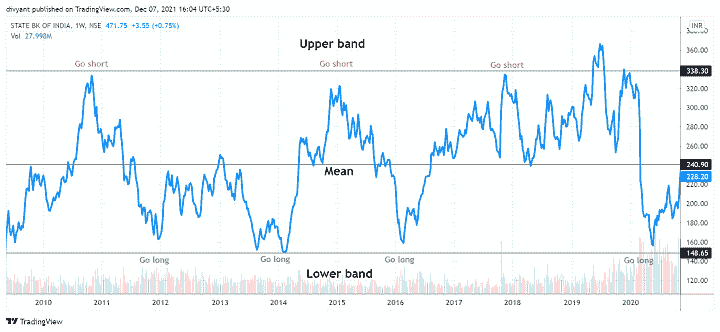
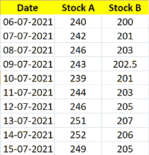
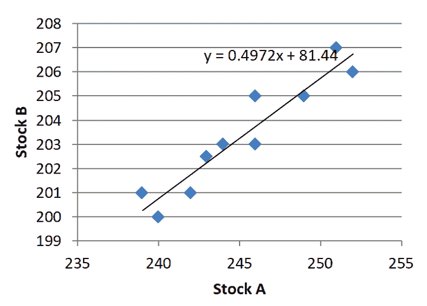
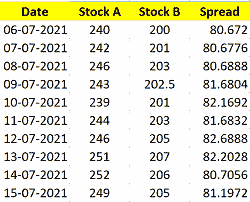

# 统计套利的配对动态选择

> 原文：<https://blog.quantinsti.com/selection-pairs-statistical-arbitrage-project-divyant-agarwal/>

一个令人难以置信的项目，深入研究并帮助您学习、建模和理解统计套利交易策略的创建和执行。它还有助于你了解如何定量分析建模结果。

这个项目的完整 python 代码也可以在文章末尾以可下载的格式获得。

本文是作者提交的最后一个项目，作为他在 QuantInsti 的算法交易管理课程( [EPAT](https://www.quantinsti.com/epat) )的一部分。请务必查看我们的[项目页面](/tag/epat-trading-projects/)，看看我们的学生正在构建什么。

* * *

## 关于作者

<figure class="kg-card kg-image-card kg-width-wide"></figure>

Divyant Agarwal 是一名金融专业人士，毕业于商业专业。Divyant 正在积极追求他的 CFA，FRM 和 CMT。除此之外，他还完成了算法交易(EPAT)的高管课程，并在机器学习、技术分析和期权交易方面拥有核心竞争力。

* * *

## **目标**

这个项目的目标是建立一个[统计套利交易](https://quantra.quantinsti.com/course/statistical-arbitrage-trading)策略的模型，并对模型结果进行定量分析。在[配对交易](/pairs-trading-basics/)中，最大的假设是股票之间的相关性是真实的，在任何背离之后，股票将回到相关关系。

两只股票相关，不代表未来还会继续相关。动机在于这些股票之间的相关性可能不会继续存在，因此配对不应该是固定的，而应该总是基于过去时期的相关性动态选择。

* * *

## **项目策略**

* * *

## 想法

这个想法是对在一段时间内保持稳定的资产恢复头寸。

平稳性指的是这样一个事实，如果资产价格没有偏离太多，而是保持在均值附近，那么如果价格比均值低太多，我们可以建立多头头寸；如果价格比均值高太多，我们可以建立空头头寸，预期价格会回到均值。

同样的例子可以在下面看到:

<figure class="kg-card kg-image-card kg-width-full"></figure>

在上图中，我们可以看到印度国家银行股票 10 年来的每周收盘价。我们可以看到，价格在本质上是稳定的，围绕 240 印度卢比的平均值波动。

股票偏离均值 100 点，然后又回到均值。使用均值回归和平稳性逻辑的交易机会可用于持有该股票，即我们可以在 140 印度卢比附近做多，在 340 印度卢比附近做空。在 Quantra 课程中详细学习[均值回归策略](https://quantra.quantinsti.com/course/python-mean-reversion-strategies-ernest-chan)。

当在市场上交易时，很难找到自然发生的稳定的价格序列。通常，小麦、玉米和外汇等大宗商品的价格都会出现这种趋势。

然而，该项目的重点是在印度市场进行股票交易，如前所述，很难找到自然发生的稳定价格序列(尤其是股票)。因此，更好的方法是找到倾向于一起移动的股票对，即它们的价差(价格之间的差异)遵循平稳性。

## 价差和对冲比率

### 价差的定义是什么？

价差是指两只股票的价格之差。差价计算如下——

**价差=股票 A 的价格–n *股票 B 的对数价格**

*其中，n 为套期保值比率*

### 对冲比率

套期保值比率是'*贝塔系数'*，可以通过回归两只股票的收盘价得到。假设，我们有两只股票 A 和 B 最近 10 天的价格

<figure class="kg-card kg-image-card kg-width-wide"></figure>

如果我们在股票 A 和股票 B 之间做线性回归，其中股票 B 是因变量(在 y 轴上)，股票 A 是独立股票(在 x 轴上)，那么变量的贝塔系数就是套期保值比率。

<figure class="kg-card kg-image-card kg-width-full"></figure>

在上面的例子中，我们可以看到线性回归方程是–

Y = 0.4972 X + 81.44

因此 **0.4972** 就是套期保值比率。

现在我们有了套期保值比率，我们可以使用下面的公式计算价差

**价差=股票 B 价格-对冲比率*股票 A 价格**

因此，我们得到下表——

<figure class="kg-card kg-image-card kg-width-wide"></figure>

既然我们已经计算了传播，我们必须检查传播是否稳定。

### 平稳性检验

**假设公式**

我们可以使用 ADF 测试来检查价差的平稳性。下面详细讨论一下 ADF 测试。

我们可以使用线性模型从过去的价格数据中描述当前的价格变化

**Δp(t) = λp(t − 1) + μ + βt+ α1Δp(t − 1) + ... + αkΔp(t − k) + Єt**

其中，
*p =乐器价格
δp(t)= p(t)-p(T1)
δp(T1)= p(T1)-p(T2)以此类推
λ=回归系数*

在这个检验中，零假设是 **λ = 0(不平稳)** &替代假设是 **λ < 0(平稳)**

假设背后的直觉是，如果λ = 0，那么下一个移动不依赖于过去的移动。因此，传播不是静止的。

但如果λ < 0，则意味着下一步棋依赖于过去的值。因此，价差是固定的。

**测试临界**

临界值可以从χ2(卡方)表值中找到。

常见置信区间的值如下所示

| **概率** | **临界值** |
| **90%** | -2.59 |
| **95%** | -2.87 |
| **99%** | -3.44 |

**测试统计**

测试统计指的是我们从模型中得到的值。它使用以下公式计算——

DF = \(\widehat{\lambda}\) / SE \(\widehat{\lambda}\)

where,
DF is Dickey Fueller t-stat
\(\widehat{\lambda}\) is the predicted coefficient
SE refers to the Standard Error of \(\widehat{\lambda}\)

**将测试统计值与测试临界值进行比较，并得出结论**

*   如果检验统计>检验临界–我们拒绝零假设，并得出结论，数据是'*平稳的*'
*   如果测试统计数据< test critical – we fail to reject the null hypothesis and conclude that is ‘*不稳定*

***因此，如果价差是稳定的，我们将包括要跟踪的对，否则我们暂时丢弃该对。**T3】*

代码如下: