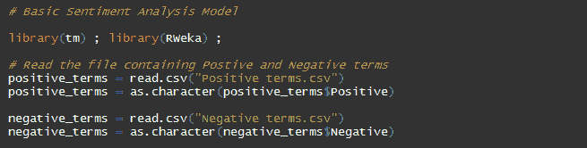
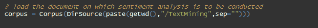
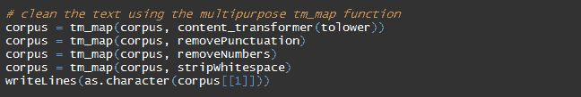
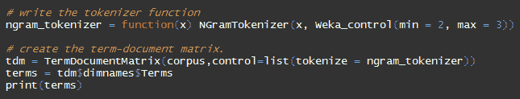
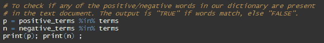
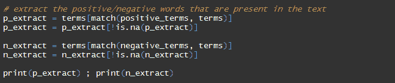
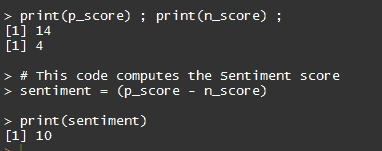
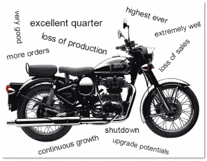
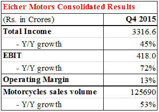
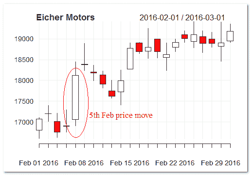

# 基于 R - Working 模型的交易情感分析

> 原文：<https://blog.quantinsti.com/sentiment-analysis-in-trading/>

由[米林德·帕拉德卡](https://in.linkedin.com/in/milind-paradkar-b37292107)

在这篇文章中，我们简要讨论了情绪分析，然后在 R. [**中介绍了情绪分析的基本模型。情绪分析**](https://quantra.quantinsti.com/course/sentiment-analysis-in-trading) 是对新闻报道/博客帖子/twitter 消息等中表达的感觉(即态度、情绪和观点)的分析。，使用自然语言处理工具。

[自然语言处理](https://blog.quantinsti.com/natural-language-processing-trading/) (NLP)简单来说就是指使用计算机处理英语等自然语言的句子/文本。这里的目标是从这些推文/博客/文章中发现的非结构化或半结构化数据中提取信息。为了实现这一点，NLP 利用了人工智能、计算语言学和计算机科学。

使用 NLP 模型，可以处理数百个文本文档，在几秒钟内确定情绪。如今，情感分析交易

是一个热门话题，在商业智能、政治、金融、决策等领域有着广泛的应用。

交易中的情绪分析- 情绪通常可以驱动市场的走向。因此，金融市场中的交易员和其他参与者试图衡量新闻报道/推文/博客帖子中表达的情绪。交易者建立自动交易系统，从自然语言中提取情感。这些交易系统根据产生的交易信号在市场上建立多头/空头头寸。交易系统也可以与其他交易系统相结合。最终的目标是从提取的信息中获得更高的回报。

情感分析有各种方法和模型。让我们来看一个非常基本的 R 模型，用于情感分析。

### **模型:R 中的情感分析**

在这个模型中，我们在 r 中实现了用于情感分析的“单词包”方法。该过程识别文章中的正面和负面单词(或一串单词)。为此，它使用了一个包含有情感词汇的大字典。这本词典中的每个单词都可以被赋予一个权重。正面词和负面词之和就是模型生成的最终情感得分。

我们将在 Eicher Motors Ltd .最新收益电话会议记录中的管理层评论文本上测试我们的模型。Eicher Motors 是一家领先的印度汽车制造公司，拥有 Royal Enfield Motors。我们模型的目标是评估他们在 2015 年第四季度收益电话会议中表达的观点。

为了构建我们的[情绪分析交易](https://quantra.quantinsti.com/course/sentiment-analysis-in-trading)模型，我们使用 r 中的“tm”和“Rweka”包。我们加载库，然后读取包含正面和负面术语的两个文档。为了准备这些文件，我们查阅了 2015 年第四季度之前的四份电话会议记录。我们从这些抄本中挑选出积极/消极的词来填充我们的词典。除了这些词，我们还添加了一些与摩托车行业相关的一般肯定/否定词。

我们将只考虑 R 中用于情绪分析的管理层评论。我们使用语料库功能在 R 中加载包含 CEO 准备的文本评论的文本文档(2015 年第四季度)。为此，我们将评论文档存储在 R 的工作目录下的 TextMining 文件夹中。

下一步是清理文本。我们将所有单词转换成小写，去掉标点符号，去掉数字，去掉空格。writeLines 函数使我们能够看到清理后的文本。

在下面的代码中，我们对上面清理过的文本进行了标记。标记化是将文本流分解成单词或一串单词的过程。我们在这里使用 NGramTokenizer 函数。这就产生了 N 个字母的文本。

n 元语法基本上是给定文本中一组共现的单词。比如考虑这句话“菜很好吃”。如果 n= 2，则 n 元语法将为:

*   食物
*   食物是
*   很好吃

此后，我们创建一个术语-文档矩阵(代码中称为**“terms”**)，该矩阵列出了语料库中所有出现的单词。

下面我们检查字典中的肯定/否定单词是否出现在文本文档中。

现在，我们从文本文档中提取所有与字典中的单词相匹配的正面/负面单词。

下面的代码行计算正面/负面分数，最后是情感分数。

**R 中的情感分析:最终情感得分**

情感分析模型发现了 14 个正面词和 4 个负面词，最终情感得分为 10。这告诉我们，从管理层的角度来看，2015 年第四季度的季度业绩不错。下面的单词云显示了从我们运行模型的文本文档中选取的一些正面/负面单词。

**R 中的情绪分析:验证我们的模型—**让我们检查季度业绩数字，以确认我们的模型生成的积极情绪得分。可以看出，艾希尔汽车公司公布了一个强劲的季度。凭借 125，690 辆摩托车的强劲销量，EBIT 的年增长率约为 72%。尽管该季度其生产设施遭遇洪水，导致生产停工数日，但业绩依然强劲。

下图显示了 Eicher Motors 公布财报当天，股票市场对其强劲业绩的反应。该股开盘在 17100 点左右，大幅波动，触及 18500 卢比左右的盘中高点，最终收于 18500 卢比。18,175.

**T2】**

### **结论**

这是对 r 中情感分析的基本介绍。上面的模型可以做得更健壮，并进一步微调。在以后的文章中，我们将尝试涵盖其他情感分析方法，并尝试围绕它们建立一个模型。

你可以报名参加 Quantra 上的[情绪分析课程](https://quantra.quantinsti.com/course/sentiment-analysis-in-trading)，这将帮助你利用 Twitter、新闻情绪数据设计新的交易策略。在本课程中，你将学习通过量化市场情绪来预测市场趋势。

QuantInsti 一直积极参与情绪分析会议，并且是最近于 2016 年在新加坡举行的“[金融情绪分析](https://blog.quantinsti.com/new-paradigms-sentiment-analysis-applied-finance/)”会议的主要营销和教育合作伙伴之一。 [Rajib Ranjan Borah](https://www.quantinsti.com/about-us/#rb) ，iRageCapital Advisory Pvt. Ltd .的联合创始人&董事& QuantInsti 是会议上“情绪分析应用于金融的新范例”的受尊敬的小组成员之一。

如果你希望在现代金融方法方面发展你的职业生涯，一定要参加这个关于金融情绪分析的课程。它涵盖了交易的各个方面，投资决策&应用使用新闻分析，情绪分析和替代数据。

### **下载数据文件**

*   **Files.rar 交易中的情绪分析**
    *   Eicher Motors 情绪分析- R Code.txt
    *   负面条款. csv
    *   积极条款. csv
    *   Q4.txt